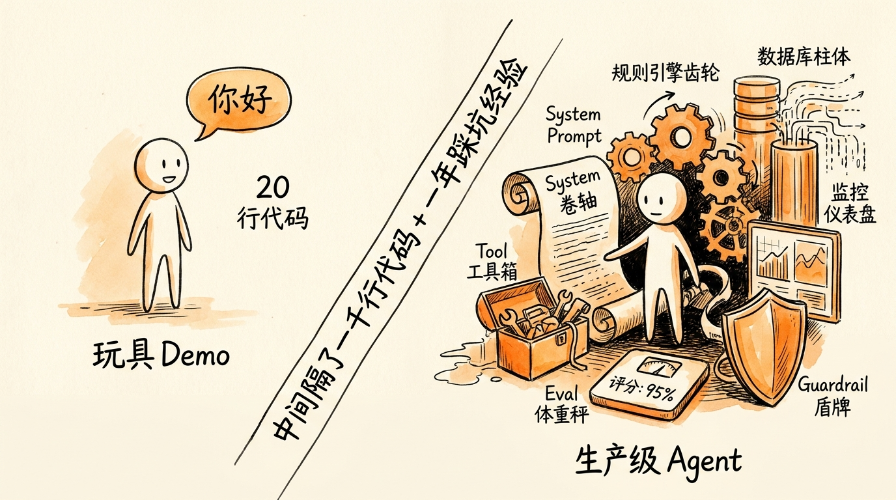
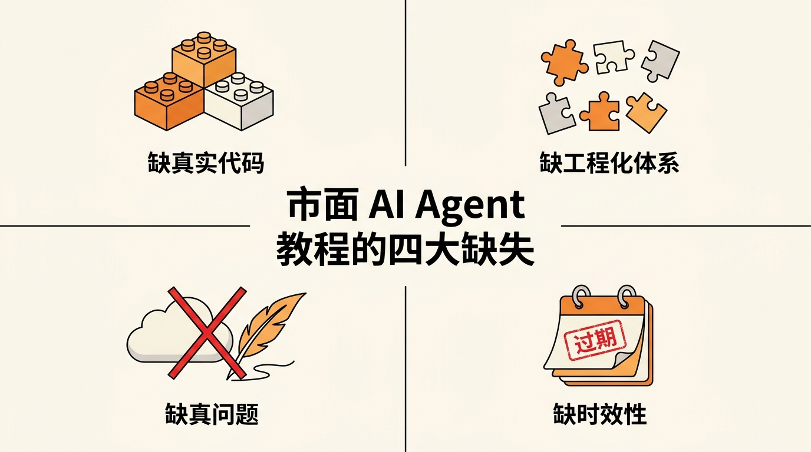
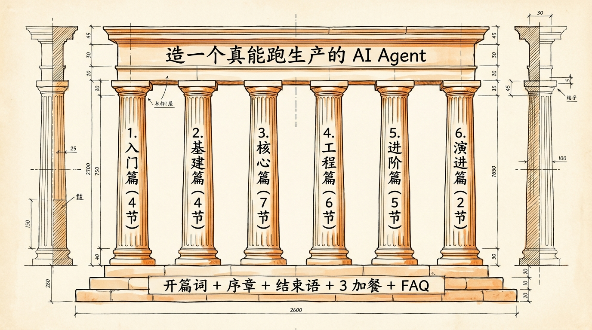
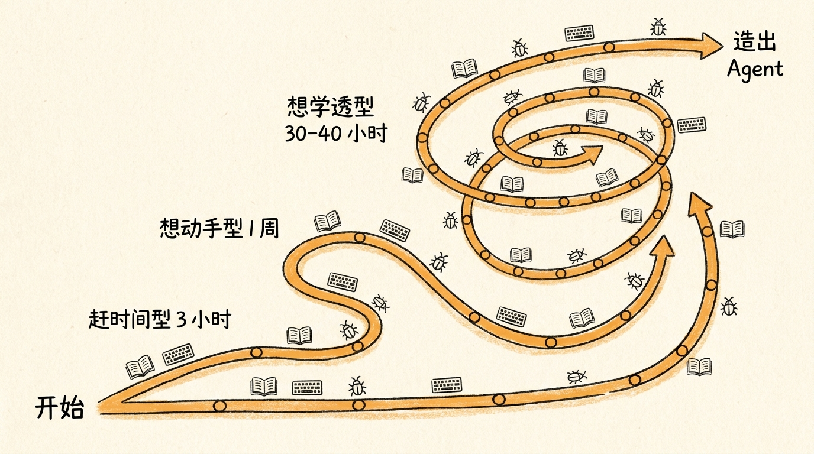

# 开篇词｜为什么要做这门 AI Agent 体系课


<!-- 图片说明（给图片代理）：
风格：手绘风格封面，温暖治愈系
内容：一个开发者坐在书桌前，桌上摊开一本厚厚的"政策红头文件"，旁边一台笔记本电脑屏幕上是 AI 对话界面。
背景隐约可见时钟（暗示退休年龄/时间）和一根连接电脑与文件之间的线，象征"用 AI 把政策翻译成答案"。
色调：米白底 + 橙黄主色 + 钢笔黑线条
中文标题手写在右上角："为什么要做这门 AI Agent 体系课"
不要写英文，不要科技感太强
-->

---

那天我妈打电话过来，开口第一句话是："你能不能帮我算算，我到底什么时候能退休。"

我妈 1968 年生人，上海户籍，事业单位干了三十年。前两个月我陪她去街道社保窗口排了俩小时队。窗口的工作人员把一沓表格摔在玻璃上："2025 年延迟退休改了规则，你这种情况要看新政策。回家自己算算，下次再来。"

回家路上她问我："新政策是啥？"

我打开 ChatGPT 输了一句"1968 年女性事业编上海退休时间"，模型自信地给了个答案：**56 岁退休，2024 年 8 月**。

我把这个答案翻给她看。她想了想说："那这个月我就不用交社保了？"

我犹豫了三秒，然后做了一件本来不该做的事——我又问了一遍 Claude。Claude 给了个完全不同的答案：**55 岁 8 个月退休，2024 年 4 月**。

两个全球最强的大语言模型，给出了两个不同的答案。而我妈的问题，是要决定下个月是否继续给社保账户打钱。**差一个月，差几千块钱**。

那天晚上我没睡好。第二天我开始写一个东西。它后来叫 SSP——Shanghai Social Security Planner。

这门课，就是把这个东西从头到尾拆开讲给你。

---

## 一、为什么要写这门课

我做 AI 应用一年多了。看过的"教程"按 GB 算。

九成都长一个样：

> ```python
> client = OpenAI()
> resp = client.chat.completions.create(...)
> print(resp.choices[0].message.content)
> ```
>
> "**恭喜你，你已经造了一个 AI 应用！**"

不，你没有。

你造了一个 hello world。生产环境的 AI Agent 长得不是这样。



<!-- 图片说明（给图片代理）：
风格：手绘对比图
内容：左右对比。
左边："玩具 Demo"——一个简笔画的小人头上顶着一个 chat 气泡，旁边一行小字"20 行代码"。
右边："生产级 Agent"——同一个小人，但被一堆复杂的部件包围：System Prompt 卷轴、Tool 工具箱、规则引擎齿轮、数据库柱体、监控仪表盘、Eval 体重秤、Guardrail 盾牌。
中间一道斜线分隔，写着"中间隔了一千行代码 + 一年踩坑经验"
色调：左浅右深，左轻右重
-->

去年 Forrester 发了一份报告说：**75% 的 AI Agent 项目失败了**。原因不是 LLM 不行。是大家把 demo 当成了产品，把 PoC 当成了上线。

更扎心的是 Anthropic 那篇《Building Effective Agents》。文章核心结论一句话：

> **"绝大多数生产 Agent 应该停在 Tool-Calling 这一层。把 80% 的预算花在好的 Prompt + 严格的 Guardrail + 可观测的 Eval，而不是花在多 Agent 协作和 RAG 大杂烩。"**

但你去搜中文 AI Agent 教程，看到的全是反过来的——上来就是 LangGraph 多 Agent 协作、上来就是 RAG 五层架构、上来就是 AutoGen 七个角色互相对话。

不是这些东西不重要。是顺序错了。

**先把单 Agent 做到生产级，再谈多 Agent。**

这就是这门课的第一个出发点：**给你一条从"能跑 demo"到"能上生产"的最短路径**。

不绕弯，不画饼，不堆术语。

---

## 二、市面上的教程缺什么

我把市面上能搜到的中英文 AI Agent 教程读了个遍，缺的东西可以归成四类。

**第一类：缺真实代码**。

99% 的"实战教程"是在讲 SDK 文档。讲 `streamText` 怎么调，讲 `tool()` 怎么注册，讲 `useChat` 怎么用。但**真要做一个能上线的产品**，你会立刻撞上一堆 SDK 文档不写的问题：

- 用户在第 5 轮对话里改主意了，怎么处理？
- LLM 调了 `computePlan` 但参数不全，怎么追问？
- 工具返回 5KB 的 JSON，怎么变成用户能看懂的卡片？
- 同一个对话第二天再打开，怎么"接续"？

SDK 文档不会告诉你这些。它只会告诉你 API 长什么样。

**第二类：缺工程化体系**。

Agent 不是一个函数，是一个系统。你需要 Prompt、Tool、Memory、Eval、Guardrail、Observability、Cost Control 至少七大件配齐。一篇文章只讲一件，读者拼到最后会发现拼不起来——因为每篇文章用的技术栈、架构假设、术语都不一样。

**第三类：缺真问题**。

"造一个能查天气的 Agent" "造一个能写诗的 Agent"——这些都不是真问题。**没有商业逻辑、没有领域复杂度、没有用户痛点**。

真实的 Agent 项目，永远在和"领域知识 × 用户表达模糊性 × 政策/业务规则随时变 × 数字必须算对"四件事搏斗。

**第四类：缺时效性**。

AI 圈三个月一个版本。你今天看一篇 2024 年初写的"Vercel AI SDK 教程"，里面所有代码都过期了——因为 SDK 已经升到 v6，API 全变了。你今天看一篇"Claude 实战"，里面的模型名都已经下架。



<!-- 图片说明（给图片代理）：
风格：信息图（infographic），扁平专业风
内容：4 宫格，每格一个"缺"：
  1. 缺真实代码（图标：玩具积木块）
  2. 缺工程化体系（图标：散落的拼图碎片）
  3. 缺真问题（图标：天气/写诗 emoji 被打叉）
  4. 缺时效性（图标：日历翻页 + 过期标记）
中央用大字写"市面 AI Agent 教程的四大缺失"
色调：橙黄主色 + 米白底 + 黑色线条
-->

这门课要解决的，就是这四件事：

| 缺什么 | 这门课怎么补 |
|---|---|
| 真实代码 | 配套 [`ssp-web`](https://github.com/jiji262/ssp-web) 项目，每节对应 `chapter-NN` git tag，能 clone 能跑能改 |
| 工程化体系 | 6 大篇 30 节，从最小可用版本（MVP）到生产部署，环环相扣 |
| 真问题 | 主线是"算社保退休年龄"——一个真实的、几亿人头疼的、政策频繁更新的领域 |
| 时效性 | 全部基于 2026 年最新版本：Next.js 16、React 19、AI SDK v6，模型选型覆盖 Claude 4.x、GPT-5.x、Gemini 3.x 系列 |

---

## 三、这门课在解决什么问题

简单说：**教你造一个真能跑生产、不会算错数的 AI Agent**。

把这件事拆开：

**1. 让你看懂 Agent 的本质**

第一篇会讲清楚 Agent 跟 Chatbot 的根本区别。一句话剧透：**Chatbot 是直接回答，Agent 是先决定下一步做什么**。这个区别看似细微，但决定了整个架构怎么搭。

**2. 让你能从零搭起来**

第二篇带你 20 行代码起一个 Agent 雏形。不用复杂工具链，不用提前理解 RAG 多 Agent，纯 `streamText + tool()` 就能跑。这是验证你"对 Agent 心智模型"是否到位的最快方式。

**3. 让你给 Agent 装上"大脑和手脚"**

第三篇是这门课最厚的一篇——**核心篇 7 节**。

- System Prompt 怎么写？我们会拆 SSP 里那 169 行的 Prompt（不是给你抄，是给你看怎么演进出来的）。
- Tool Calling 协议本质上在干嘛？为什么要用 Zod 写 schema？三个工具之间怎么编排？
- 规则引擎为什么是 Agent 的"骨头"？JSONLogic 怎么把 24 条政策变成可执行的 JSON？

**4. 让你从能跑变成能用**

第四篇 6 节工程化内容。前端 useChat 双栈、Tool Result Card 的设计、记忆系统、可观测性、安全护栏、成本控制——一个真上线的 Agent 该有的"装备"。

**5. 让你区分 demo 和生产**

第五篇进阶篇 5 节。重点是评测体系——**Eval 决定你的 Agent 不会变蠢**。这一篇里我们会讲三层评测模型、LLM-as-Judge、回归测试 CI 门禁。学完这一篇，你就明白为什么市面上 75% 的 AI 项目在生产环境扑街。

**6. 让你看见未来**

第六篇演进篇。多 Agent 协作（A2A 协议）、模型迁移（`gpt-4o-mini` 怎么平滑过渡到 `gpt-5.4-mini` / Claude Sonnet 4.6）、灰度发布、持续迭代。



<!-- 图片说明（给图片代理）：
风格：信息图，建筑结构图风格
内容：六根并立的柱子（仿希腊神庙），每根柱子写一个篇章名 + 节数：
  1. 入门篇 (4 节)
  2. 基建篇 (4 节)
  3. 核心篇 (7 节)
  4. 工程篇 (6 节)
  5. 进阶篇 (5 节)
  6. 演进篇 (2 节)
柱子下方是底座，写"开篇词 + 序章 + 结束语 + 3 加餐 + FAQ"
柱子上方是横梁，写"造一个真能跑生产的 AI Agent"
色调：米白 + 橙黄 + 钢笔黑
-->

学完这门课，你不是"听过了 Agent 是什么"，而是**真的能独立造一个 Agent 上线**。

---

## 四、课程结构与读法

整门课分 6 大篇 + 加餐 + FAQ，结构如下：

```
开篇词     ← 现在你在这里
序章       延迟退休来了，我们造了个 AI 帮你算社保
─────────────────────────────────────
入门篇     搞清楚 Agent 是什么          (4 节)
基建篇     把项目跑起来                  (4 节)
核心篇     给 Agent 装大脑和手脚        (7 节)
工程篇     从能跑到能用                  (6 节)
进阶篇     区分 demo 和生产            (5 节)
演进篇     走向生产                      (2 节)
─────────────────────────────────────
结束语     你以为是终点，其实是起点
加餐 1     管理后台是怎么炼成的
加餐 2     那些年我们踩过的坑（事故复盘）
加餐 3     模型迁移实战
FAQ        高频问题集锦（30+ 条）
```

完整目录在 [`README.md`](./README.md) 里，每节配一句话剧透。

---

**怎么读？给三种读法：**

**赶时间型——3 小时摸完底**

读 开篇词 + 序章 + 第 01 节《AI Agent 到底是个啥》+ 第 11 节《Tool Calling 协议》。这四节读完，你能在饭桌上跟老板讲清楚什么是 Agent、跟 Chatbot 啥区别、为什么不能直接问 ChatGPT 算社保。

**想动手型——一周搭起雏形**

按顺序走 入门篇 + 基建篇 + 核心篇前 4 节（第 09-12 节），同步把 [`ssp-web`](https://github.com/jiji262/ssp-web) clone 到本地跟着跑。每节配一个 git tag，例如读完第 6 节后 `git checkout chapter-06`，本地能起服务、能跟 AI 聊天、能拿到第一份社保规划。

**想学透型——30 到 40 小时通读**

从开篇词按顺序走完，每节末的思考题尽量做。每节都设计成可以独立打断又能续上——你今天读到第 14 节睡觉，明天直接从第 15 节继续，不会卡。

> **重要提醒**：这门课不是看视频。是**读 + 写代码 + 跑 + 改 bug**。不动手只看，最多吸收 30%。



<!-- 图片说明（给图片代理）：
风格：手绘风格三条路径图
内容：三条不同长度的路径，从左下"开始"通向右上"造出 Agent"。
路径 1（最短，3 小时）：贴近底部，一条直线
路径 2（中等，1 周）：S 型曲线
路径 3（最长，30-40 小时）：盘旋上升，路上有 30 个小节点
路径上有小图标：书本（读）、键盘（写代码）、bug（踩坑）
色调：米白底 + 暖色路径
-->

---

## 五、配套实战项目：ssp-web

这门课最大的特点是——**不是只讲理论，配套一整个真实可部署的项目**。

**项目地址**：[https://github.com/jiji262/ssp-web](https://github.com/jiji262/ssp-web)

这不是 hello world。这是一个 Next.js 16.1.6 + React 19.2.3 + AI SDK v6 + Neon Postgres 的全栈应用，包含：

- 完整的对话式 AI Agent（基于 `streamText` + 3 个 Tool）
- 24 条政策规则的 JSON DSL + JSONLogic 规则引擎
- Drizzle ORM 持久化（11 张 PG 表）
- NextAuth v5 管理员认证 + 匿名用户会话
- 一整套管理后台（规则编辑、参数管理、案例库、测试中心、发布流水线）
- 部署在 Vercel 的 `iad1` region，开箱即用

**每一节都对应一个 git tag**：

```bash
git clone https://github.com/jiji262/ssp-web.git
cd ssp-web
git checkout chapter-06    # 读完第 6 节后该长这样
pnpm install
pnpm dev
```

这意味着你**永远能看到"当节学完应该长什么样"**。读到一半懵了，跑不起来？`git diff` 一下你的代码和 `chapter-NN` tag，差在哪一目了然。

> **真实性声明**：所有代码片段都直接从仓库摘录，路径和行号都精确到行。**没有伪代码、没有"示意"、没有"为了讲解简化"**。课程的代码事实表 [`code-facts.md`](./code-facts.md) 保证了这一点。

---

## 六、作者寄语

写这门课的过程，比我预想的难得多。

我以为只是"把已经做出来的项目讲清楚"。结果一上手才发现，**很多决策当时凭直觉做的，要回过头讲明白为什么这么做，比做出来本身还难**。

为什么 System Prompt 是 11 节而不是 5 节？为什么用 JSONLogic 而不是写 TypeScript？为什么 Tool 是 3 个而不是 5 个？为什么 `temperature` 是 0.3 而不是 0.7？为什么 `stopWhen: stepCountIs(8)`？

每个问题背后都是踩过的坑。

我们走过的弯路、撞过的墙、烧掉的 Token 钱、深夜爬起来修的线上 bug——这些是这门课最值钱的部分。教你**怎么做对**很容易，教你**为什么会做错**才难。

我希望你看完这门课，能少走我们走过的几遍。

但我也很清楚一件事：**没有一门课能让你直接跳过试错**。

你还是会把 prompt 写炸、把 token 烧光、把数据库连接池打满、把 Agent 改进死循环。这不是教程的问题，是 Agent 工程的本质——它**新到没有"标准答案"**。

我能做的，是给你一份 **2026 年此刻最接近标准答案的参考路径**。

剩下的，是你自己的修行。

---

> **如果这门课只能留给你一句话，我想是这句**：
>
> **AI Agent 不是"用 AI 替代代码"，而是"用代码驯服 AI"。**
>
> LLM 是嘴，规则引擎是脑。LLM 负责听和说，规则负责算。
>
> 越早搞懂这件事，你越能造出靠谱的 Agent。

---

OK，开场白讲完了。

下一节是序章，我们从一个真实问题切入：**延迟退休政策落地后，几亿人都在问"我到底什么时候能退休"——为什么这个问题不能直接问 ChatGPT，为什么必须造一个 Agent，整个 SSP 项目长什么样。**

跟我来。

---

[📚 目录](./README.md) · [下一节：序章 - 延迟退休来了 →](./01-introduction.md)
