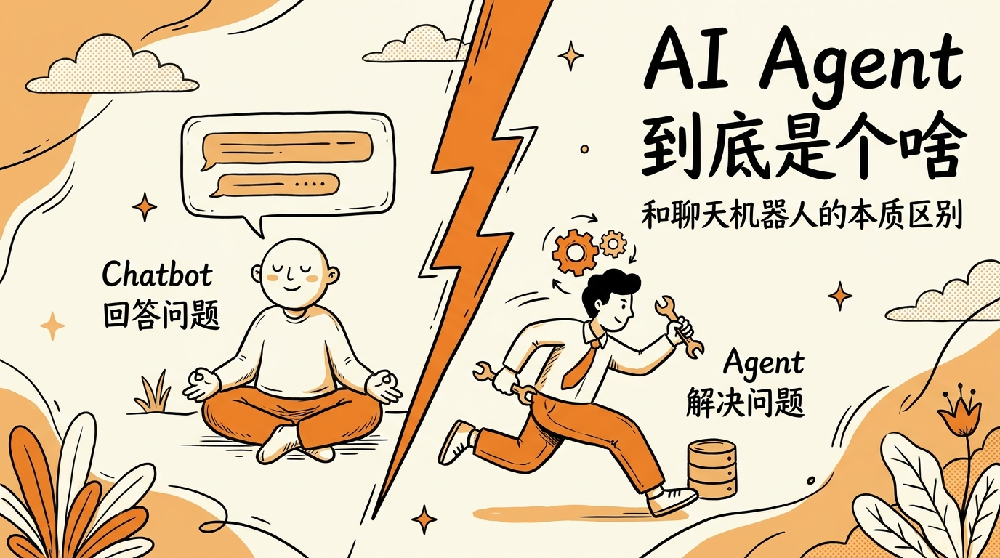
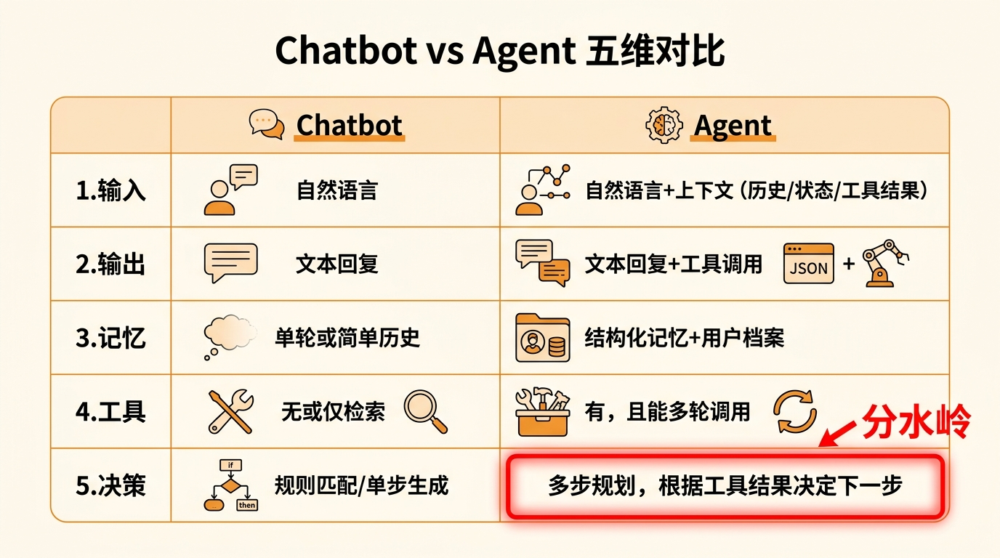
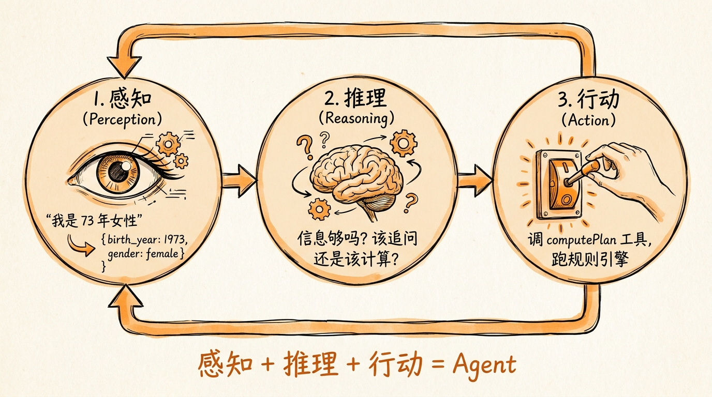
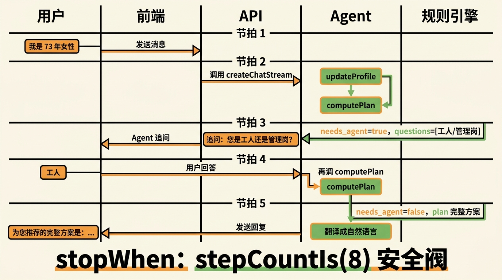
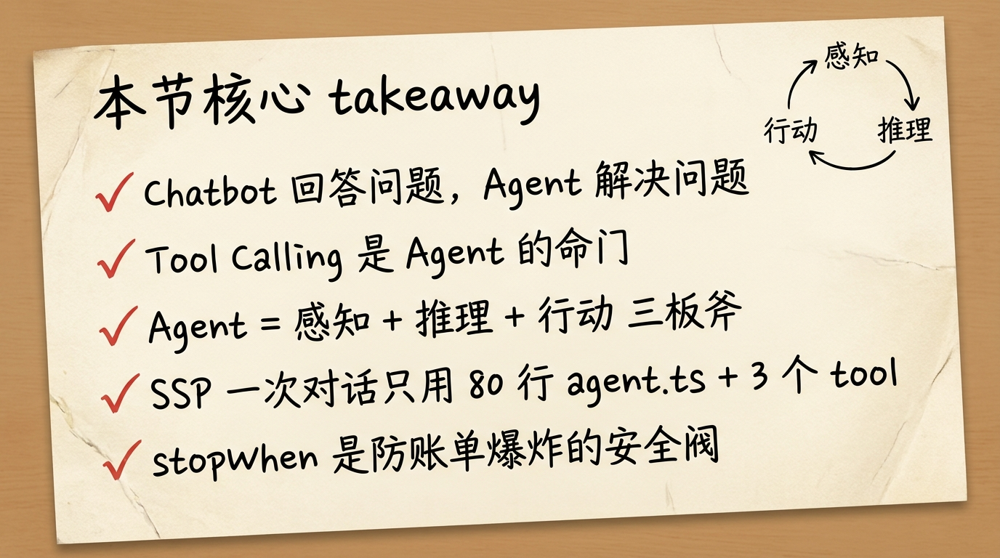

# 第 01 节 · AI Agent 到底是个啥：和聊天机器人的本质区别



> **预计时长**：阅读 25 分钟 / 实战 30 分钟
> **前置知识**:[开篇词](./00-prologue.md)、[序章:延迟退休来了，我们造了个 AI 帮你算社保](./01-introduction.md)
> **本节代码**：`ssp-web` 仓库 `chapter-01` tag · 主要文件 `src/app/api/chat/route.ts`、`src/lib/ai/agent.ts`

那天产品经理在群里发了张截图。

她问 ChatGPT：「我是 73 年的女性，什么时候退休？」

GPT 回得很客气：「根据现行政策，女性退休年龄为 50 至 55 岁。」

她接了一句：「**那我到底哪年退？**」

ChatGPT 又给了一段标准回答——女工人 50 岁、女干部 55 岁、灵活就业 55 岁，2025 年起渐进式延迟退休……信息没错，但你认真读，**它没有回答她的问题**。同样的 1973 年女性，工人岗和管理岗退休时间不一样，参与延迟方案后又叠加了 1-3 年的浮动；缴费月数不同，最低年限够不够，差几个月可能就是几千块钱补缴。

她截图发完一句话：「这种回答，跟没回答有啥区别？」

她问的是这个屏幕背后的东西——为什么大模型这么聪明，到了她这种**真问题**上就开始打太极？而我们做的 SSP（上海社保规划助手），同一句话进去，给出的不是政策科普，而是**精确到月份**的退休日期、补缴缺口、补贴清单。区别不在模型——同一个 gpt-4o-mini，出来的东西天差地别。

区别在一个词：**Agent**。

---

## 一、知识铺垫：先把几个名词钉在墙上

很多人开口闭口"AI Agent"，但讨论时根本不是同一个东西。我们先把这一节要用的术语统一，后面才能讲清楚。



| 术语 | 中文 | 定义（本课的口径） | 反例 |
|---|---|---|---|
| LLM | 大模型 | 输入 token 序列、输出 token 序列的概率模型 | ❌"AI"、"GPT"，太泛 |
| Chatbot | 聊天机器人 | 以"一问一答"为单位的对话系统，**没有外部动作能力** | ❌ 把"调过 API 的对话框"也叫 Chatbot |
| Agent | 智能体 | 能感知 → 推理 → 行动的循环系统，**会调用工具** | ❌"代理"这类人称化叫法 |
| Tool | 工具 | LLM 可以调用的外部函数，有 schema、有副作用 | ❌"function"、"插件" |
| Tool Calling | 工具调用 | 大模型按结构化协议输出 JSON，让宿主代码执行对应函数 | ❌ 用"function"直译的叫法（易与编程概念混淆）|
| ReAct | Reason + Act | Agent 的工作循环：思考 → 行动 → 观察 → 再思考 | ❌"思考链" |

> **划重点**：今天大家在产品里说的"AI Agent"，**它的最小可用形态 = LLM + Tool Calling + 一个 Loop**。三件套缺一样都不算 Agent。

为了避免在维度上混淆，我们用一张五维矩阵把 Chatbot 和 Agent 的差异钉死：

| 维度 | Chatbot | Agent |
|---|---|---|
| **输入** | 自然语言 | 自然语言 + 上下文（历史/状态/工具结果） |
| **输出** | 文本回复 | 文本回复 **+ 工具调用 JSON** |
| **记忆** | 单轮或简单历史 | 结构化记忆 + 用户档案（profile） |
| **工具** | 无，或仅检索（RAG） | 有，**且能多轮调用** |
| **决策** | 规则匹配/单步生成 | 多步规划，**根据工具结果决定下一步** |

这五个维度里，**「决策」是分水岭**——能不能根据"我刚拿到的工具结果"去决定"下一步该追问还是出结果"，这是 Agent 的命门。

---

## 二、核心讲解

### 2.1 一句话区分 Agent 和 Chatbot

我们做了快一年 SSP，反复打磨这句话。最后定下来的版本是：

> **聊天机器人回答问题，Agent 解决问题。**

两个动词的差别是关键。

「回答问题」是把信息组织出来递给你。模型脑子里有什么，就吐什么。「解决问题」是为了一个目标动起来——查表、计算、追问、再查、再计算，**直到目标达成**。前者是图书馆员，后者是家庭医生：图书馆员告诉你"高血压相关图书在 320 区"，家庭医生会问你"最近吃什么、睡多久、量过血压吗"，然后开张化验单，看结果再决定下一步。

回到产品经理那句"73 年的女性"——

- Chatbot 模式：把模型脑子里的政策片段拼出来给你，看似全面，**和你无关**。
- Agent 模式：从这句话提取 `birth_year=1973, gender=female`，调一次工具去算，发现还缺"工人/管理岗"，**反过来追问你**，拿到答案后再算一次，最终给到你"2030 年 4 月退休、还要补缴 6 个月、可申请 4050 补贴"这种**对你这个人成立**的方案。

中间最值钱的那一步，叫 **Tool Calling**——让模型会"调用外部工具"。听起来简单，但跨过这一步，AI 就从「知道很多事」变成了「能办很多事」。

### 2.2 SSP 实例：同一句话，两种回答方式

为了让你看到差别，我们对比一下"如果只用 LLM 回答"和"用 SSP（Agent）回答"的两条路径。

**路径 A：纯 LLM（Chatbot 模式）**

```
用户：我是 73 年的女性，什么时候退休？

LLM 直接回答（基于训练数据）：
"根据 2025 年实施的渐进式延迟退休方案，1973 年出生的
 女性，如果是普通工人岗（50 岁退休口径），将在 2025-2029
 年逐步延迟到 50.5-52.5 岁退休。具体到您，可能是 2024-
 2026 年退休。建议您咨询当地社保局核实……"
```

听上去像那么回事，但你**仔细看**——「可能是 2024-2026 年」，跨度三年；建议你「咨询当地社保局」，等于把球踢回去。**用户付出了一句话，得到的是模糊到没法行动的信息**。

**路径 B：SSP（Agent 模式）**

```
节拍 1（用户输入 → Agent 推理）
  用户："我是 73 年的女性"
  Agent："识别出 birth_year=1973, gender=female。
         先调一次 computePlan，看看缺什么。"

节拍 2（Agent 调工具 → 工具反馈）
  Agent 调用：computePlan({basic: {birth_year: 1973, gender: "female"}})
  规则引擎：跑 24 条规则
  返回：needs_agent=true,
        questions=[{ field: "female_retire_type",
                     text: "您是普通工人还是管理岗？"}]

节拍 3（Agent 拿到追问 → 转发给用户）
  Agent："请问您是普通工人岗还是管理岗位？这两个口径
         退休年龄不一样。"

节拍 4（用户答 → Agent 再调工具）
  用户："普通工人。"
  Agent："好，参数齐了。再算一次。"
  Agent 调用：computePlan({basic: {birth_year: 1973,
                                   gender: "female",
                                   female_retire_type: "worker50"},
                          ...})
  规则引擎：再跑 24 条规则
  返回：needs_agent=false, plan={...精确方案...}

节拍 5（Agent 把结构化方案翻译成人话）
  Agent："您是 1973 年出生女性、普通工人岗，按 2025 年
         渐进式延迟方案，您的法定退休日期是 2025 年 7 月，
         首次领取养老金需累计缴费满 15 年——您当前缴费
         X 月，还差 Y 月，建议……"
```

注意中间发生了什么：**Agent 自己决定什么时候算、什么时候追问、什么时候出结果**。没有人提前画好流程图告诉它"第 2 步必须问性别"，是它根据每一步工具返回的 `needs_agent` 信号动态决定的。

> **划重点**：Chatbot 是被动的应答机；Agent 是主动的决策者。它会调工具拿信息、根据信息决定动作、再调工具、再决定——直到目标达成或触发停止条件。

### 2.3 Agent 三板斧：感知 - 推理 - 行动

不管哪一代 Agent，核心能力都可以拆成三件事，缺一不可：



**感知（Perception）**：把自然语言变成结构化数据。

用户说"我是 73 年女性"，Agent 内部要把它变成：

```json
{ "birth_year": 1973, "gender": "female" }
```

听起来简单，但魔鬼在边角：「73 年」是 1973 还是 2073？「我老公」要算男性还是女性？「下个月退」是已经退了还是即将退？这些模糊输入，靠的是大模型的语言理解能力。

**推理（Reasoning）**：基于当前已知信息，决定下一步干什么。

- 已经有 birth_year + gender 了 → 够触发首次计算吗？够，调 computePlan。
- 工具返回 `needs_agent=true` → 看 questions 列表，需要追问。
- 用户回答了 → 参数齐，再算一次。
- 工具返回 `needs_agent=false` → 把结果翻译成人话给用户。

这是 Agent 的"大脑"。注意它不是按预设流程走，而是根据**当前状态动态决策**。

**行动（Action）**：真的去做。调用工具、执行计算、写数据库、返回结果。

Agent 调用 `computePlan`，规则引擎跑 24 条政策规则，算出精确到月份的退休日期、缴费缺口、补贴资格——**这些数字不是 LLM 「猜」的，是「算」出来的**。

> **金句**：Agent = 感知 + 推理 + 行动。只有感知和推理没有行动，那是 Copilot；只有感知和行动没有推理，那是脚本自动化；三者俱全，才是 Agent。

ReAct 框架（Yao 等，arXiv:2210.03629）把这三件事压成一个循环：**Reason → Act → Observe → Reason → Act → ...** 直到任务完成。但 ReAct 的细节我们留到[第 03 节《ReAct 循环：感知-推理-行动的三板斧》](./04-react-loop.md)展开，这里只要你记住三板斧的概念就够了。

### 2.4 Tool Calling 是怎么发生的

Tool Calling 是 Agent 区别于 Chatbot 的关键技术——所以这里必须把它的「形」讲一下。但具体怎么写一个 tool、怎么定义 schema，那是[第 11 节《Tool Calling 协议》](./12-tool-calling.md)的事。这里只需要让你看懂"这件事到底怎么发生"。

打个比方：**Tool Calling 就像给 LLM 一部手机——它自己不能打电话，但你给它通讯录和拨号键，它就能联系到任何人**。LLM 是想打电话的人，工具是手机，你的服务端代码是真正接通电话的电信网络。

最简伪代码长这样：

```typescript
// 这是协议本质的伪代码（非项目实际代码）
const tools = {
  computePlan: {
    description: "根据用户社保信息计算退休规划",
    inputSchema: { /* ... 比如 birth_year、gender 等字段 ... */ },
    execute: async (args) => {
      // 真正干活的地方：调规则引擎
      return await runRuleEngine(args);
    },
  },
};

// 推理循环（SDK 内部其实就在做这个）
let messages = [{ role: "user", content: "我是 73 年女性" }];
while (true) {
  const reply = await llm.complete({ messages, tools });

  if (!reply.tool_calls) {
    // 模型决定「不调工具了，直接回话」 → 出循环
    return reply.text;
  }

  for (const call of reply.tool_calls) {
    const result = await tools[call.name].execute(call.args);
    messages.push({ role: "tool", content: result });
  }
  // 把工具结果塞回上下文，再让模型决定下一步
}
```

> **看这里 →**：循环里那句 `if (!reply.tool_calls) break` 才是 Agent 的灵魂。**模型自己决定哪一轮该停、哪一轮该再调一次工具**。这是 Chatbot 永远做不到的事——Chatbot 只有"用户问 → 模型答"一个回合，没有这个 while 循环。

实际项目里，这个循环不需要你手写。Vercel AI SDK v6（`ai@^6.0.99`）的 `streamText` + `tool()` 已经替你封装好了，你只需要传入 messages 和 tools。但**协议本质是这个 while**——理解它，你才能在 Agent 出 bug 时知道去哪儿查问题。

### 2.5 SSP 的对话生命周期：一次完整的端到端

把上面那些概念落到 SSP 的真实代码里，一次完整对话长什么样？

我们直接看 ssp-web 的核心入口：

```typescript
// src/app/api/chat/route.ts:81-294（POST handler 框架，行号区间）
export async function POST(req: Request) {
  // 1) 限流 + 长度门禁
  const { sessionId } = ensureAnonymousSession(req, legacySessionId);
  await checkRateLimit('chat:' + clientIp, { limit: 30, windowMs: 60_000 });

  // 2) 取/建会话（沿用历史 messages）
  const conversation = conversationId
    ? await getConversation(conversationId)
    : await createConversation({ sessionId });

  // 3) 前端 UIMessage → LLM ModelMessage
  const messages = await convertToModelMessages(uiMessages);

  // 4) 创建流（核心：内置 ReAct loop）
  const result = createChatStream(messages, { questions, userProfile });

  // 5) 流式返回，结束时持久化
  return result.toUIMessageStreamResponse({
    originalMessages: uiMessages,
    onFinish: async ({ messages: persistedMessages }) => {
      await updateConversation(conversation.id, {
        messages: persistedMessages,
        userProfile,
      });
    },
  });
}
```

第 4 步的 `createChatStream` 是整个 Agent 的"心脏"：

```typescript
// src/lib/ai/agent.ts:47-79
export function createChatStream(
  messages: ModelMessage[],
  context?: ChatContext,
) {
  const { apiKey, baseURL, model } = getOpenAIConfig();
  const openai = createOpenAI({ apiKey, baseURL });

  const systemPrompt = buildContextPrompt(...) // 拼上下文
    ? `${SYSTEM_PROMPT}\n\n${contextPrompt}`
    : SYSTEM_PROMPT;

  return streamText({
    model: openai(model),
    system: systemPrompt,
    messages,
    tools,                       // ← 注入 3 个工具
    stopWhen: stepCountIs(8),    // ← Agent 最多转 8 圈，安全阀
    temperature: 0.3,            // ← 低温度，事实导向
    providerOptions: {
      openai: { store: false },  // 中转网关兼容
    },
  });
}
```

**整个文件 80 行**——这就是 SSP 推理层的全部门面。剩下的：

- 工具定义在 `src/lib/ai/tools.ts`（537 行，3 个工具：computePlan / validateField / updateProfile）
- System Prompt 在 `src/lib/ai/prompts.ts`（169 行，11 节分层）
- 规则引擎（真正干活的）在 `src/lib/engine/`（8 个文件 ~1500 行）

注意看 `stopWhen: stepCountIs(8)`——这是一道**硬性安全阀**。正常对话 3-4 步就够了，留 8 步是容错空间。

**为什么一定要有这个上限？** 因为 LLM 偶尔会"犯轴"——某个边界条件让它反复调同一个工具，一圈一圈转。我们最初没设上限，有一次它连续调了十几次工具，token 像水龙头一样流，钱包心在滴血。

> **划重点**：任何 Agent 都需要终止条件。`stopWhen: stepCountIs(8)` 不是魔法数字，是防止你账单爆炸的安全阀。没有上限的循环，就像没刹车的汽车。



到这里，你已经看到一个完整 Agent 的形态：

1. **入口**：`POST /api/chat`（route.ts，294 行）
2. **推理**：`createChatStream`（agent.ts，80 行）—— `streamText` + `tools` + `stopWhen`
3. **工具**：3 个 tool（tools.ts，537 行）
4. **执行**：规则引擎（engine/，1500 行）
5. **持久化**：onFinish 写库（queries.ts 的 `updateConversation`）

一次用户消息进来，可能触发 2-4 个推理节拍，全部在一次 HTTP 流式请求里完成。用户看到的是一段流畅的回复，背后是 Agent 在不停推理-执行-推理-执行。

---

## 三、举一反三：你的项目是 Chatbot 还是 Agent？

理解了 SSP 这个例子，再回头看下面三个常见场景，你能判断它们是 Chatbot 还是 Agent 吗？

**场景 1：法律咨询助手**

用户问"租房合同里这条违约金算不算霸王条款"，AI 调用 `searchLawDatabase` 检索相关法条，调用 `analyzeContract` 解析条款，发现合同里没写"违约金上限"，主动追问用户"你们当地是哪个城市？2024 年新规对城市有差别条款"，拿到答案后再调一次 `analyzeContract` 给出最终建议。

✅ **是 Agent**。多轮工具调用 + 主动追问 + 根据中间结果决策。

**场景 2：健身规划助手**

用户问"我 30 岁男性想增肌，给个计划"，AI 直接生成一份训练表 + 饮食建议，**没有调用任何工具**，没有问体重、没有问基础代谢、没有调用 BMI 计算器。

❌ **这是 Chatbot**。即使输出看起来很专业，本质上仍是「一问一答」，没有外部动作能力。要变成 Agent，至少要接 `calculateBMR` 和 `searchExerciseDatabase` 这种工具。

**场景 3：报税助手**

用户上传工资条 PDF，AI 调用 `parsePDF` 提取数据，调用 `calculateTax` 计算应税额，发现用户有专项附加扣除可申报，**主动追问**"有租房合同吗？住房租金可以抵扣 1500/月"，拿到信息后再调用 `calculateTax` 重算，最终生成申报草稿。

✅ **是 Agent**，而且是典型的 Tool-Calling Agent，和 SSP 同构。

> **判定准则三连击**：
> 1. 它会**主动调用工具**吗？
> 2. 它会**根据工具结果**决定下一步吗？
> 3. 它有**多轮循环**吗？
>
> 三个都是 → Agent。少一个 → 还在 Chatbot 阶段。

把这三个问题甩给你手头的项目，五分钟就能给它定位。

---

## 四、小结



读到这里你应该锁住三件事：

**1. Agent ≠ 更聪明的 Chatbot。** 它的本质是 **LLM + Tool Calling + Loop**——能调工具、能根据结果决策、能多轮循环。换一个更强的模型不会让 Chatbot 变成 Agent，接上工具循环才会。

**2. Agent 三板斧是感知 - 推理 - 行动。** SSP 的一次对话，可能在这三件事之间来回 2-4 圈，每一圈都根据上一圈的工具结果动态决策。这种"边走边看"的能力，是 Chatbot 永远做不到的。

**3. 任何 Agent 都需要终止条件。** SSP 用 `stopWhen: stepCountIs(8)`，意思是再迷路也最多转 8 圈。没有上限的 Agent 等于没刹车的车——总有一天会撞上你的钱包。

**核心要点回顾**：

- ✅ Chatbot 回答问题，Agent **解决**问题
- ✅ Tool Calling 是 Agent 的命门——LLM 输出结构化 JSON，宿主代码去执行
- ✅ Agent = 感知 + 推理 + 行动，三者缺一不可
- ✅ SSP 一次对话只用了 80 行 agent.ts + 3 个 tool 就跑起来
- ✅ `stopWhen` 不是魔法，是防止账单爆炸的硬性安全阀

下一节，我们把视角拉远——**从 1966 年的 ELIZA 到今天的 AutoGPT，AI 是怎么一路走到 Tool-Calling Agent 这一站的**？知道历史，才知道你的项目该停在哪一代。

---

## 思考题

1. **【开放题】** 你手上正在做的 AI 项目（公司的、个人玩的、想做的），是 Chatbot 还是 Agent？用本节"判定准则三连击"自检：会调工具吗？会根据结果决策吗？有多轮循环吗？把答案写下来，三个月后回头再看，会发现自己进步了。
2. **【动手题】** clone `ssp-web` 到本地，按 README 跑起来后，对话框里说"我是 73 年女性"。**重点不是看 UI**，而是打开浏览器 DevTools 的 Network 面板，找到 `/api/chat` 这条 SSE 流，观察里面的 `tool-call` 和 `tool-result` 事件。你会清楚地看到 Agent 在自己调工具、再调一次的过程。**验收标准**：能截图标出"第几次调用 computePlan"、"工具返回的 needs_agent 是 true 还是 false"。
3. **【选做】** 用任何你熟悉的语言，写两个最小程序：
   - **A**：50 行内的最小 Chatbot——直接转发用户输入到 LLM，输出回复。
   - **B**：50 行内的最小 Agent——给 LLM 配一个 `calculate(expression)` 工具（调系统的 eval 或一个数学库），让它能算"3 的 17 次方再加 5 的阶乘是多少"。
   对比这两个程序的代码结构，你会比读 5 篇博客都更清楚 Agent 和 Chatbot 的差别。

---

## 面试题

**Q1.【基础】【主题：Agent vs Chatbot】** 面试官给你一句话："把一个聊天机器人接上一个搜索 API，它就变成 Agent 了。" 这句话对吗？请说出你判断 Agent 与 Chatbot 的标准。
<details><summary>参考解答</summary>

不完全对。"接了一个 API"只是有了行动能力的雏形，但是否成为 Agent，要看三件事是否同时具备（本节"判定准则三连击"）：

1. **会主动调用工具**——不是写死的固定调用，而是模型自己决定这一轮要不要调、调哪个。
2. **会根据工具结果决策**——拿到工具返回后，能判断"信息够不够、下一步是追问还是出结果"。
3. **有多轮循环**——存在一个"推理→行动→观察→再推理"的 Loop，而不是"问一句答一句"的单回合。

如果只是把用户输入转发给一个固定 API、再把结果套个模板返回，那它仍是 Chatbot——它没有"根据结果决定下一步"的决策环节。本质上：**Chatbot 回答问题，Agent 解决问题**；分水岭是"决策"维度，即能否基于刚拿到的工具结果动态决定下一步动作。

</details>

**Q2.【进阶】【主题：Agent vs Chatbot】** 请用一次 Tool Calling 的完整时序，说明用户、LLM、宿主服务端三方的分工。为什么说"LLM 从来不执行代码"？
<details><summary>参考解答</summary>

时序（对应本节 §2.4 的 while 循环）：

1. 用户发自然语言（"我是 73 年女性"）。
2. 宿主把 messages + 工具列表（每个工具的 description + inputSchema）发给 LLM。
3. LLM 输出一段**结构化意图**：要么是纯文本回复，要么是 `tool_calls`（"我想调 computePlan，参数是 {...}"）。
4. 宿主服务端读取 `tool_calls`，**真正执行**对应函数（如调规则引擎），拿到结果。
5. 宿主把工具结果作为 `tool` 角色消息拼回上下文，回到第 2 步。
6. 直到 LLM 不再输出 `tool_calls`（或触发 `stopWhen` 上限），把最终文本返回用户。

"LLM 从来不执行代码"的含义：LLM 只产出 token——它输出的 `tool_calls` 只是"想调什么、传什么参数"的 JSON 意图，**真正执行函数、访问数据库、调外部 API 的是宿主服务端代码**。这条边界很重要：它决定了安全与可控性——执行权始终在你手里，模型只有"建议调用"的权力。

</details>

**Q3.【深挖】【主题：Agent vs Chatbot】** SSP 的推理循环里有一句 `stopWhen: stepCountIs(8)`。这个参数解决什么问题？去掉它会发生什么？把上限设成 100 又有什么风险？
<details><summary>参考解答</summary>

它是多步工具循环的**硬性终止条件**，本质等价于 ReAct 论文里的 `max_steps`。

- **解决的问题**：Agent 的循环"模型决定下一步"是非确定性的。某些边界条件下模型可能反复调同一个工具、始终觉得"还差一点信息"，循环就停不下来。`stepCountIs(8)` 保证再迷路也最多转 8 圈。
- **去掉它会怎样**：注意 AI SDK v6 的核心函数 `streamText` 默认是 `stepCountIs(1)`（只跑一步），所以"去掉"在 SSP 这里意味着不开多步循环——`computePlan` 的结果无法回灌给模型继续作答，多轮追问链路直接断掉。而如果换成一个不设上限的停止条件（如永不触发的 `isLoopFinished`），模型卡在某个状态时会持续烧 token，账单失控。
- **设成 100 的风险**：等于把安全阀拧到几乎失效。正常对话 2-4 步就结束，留 8 步是容错余量；100 步意味着一旦模型陷入循环，要烧掉约 100 次 LLM 调用 + 工具调用的成本才会被强制中断。上限应贴合任务的真实步数分布，而不是越大越安全。

</details>

---

## 延伸阅读

- [Anthropic — Building Effective Agents (2024.12)](https://www.anthropic.com/engineering/building-effective-agents) — 把"先穷尽单 Agent 再上多 Agent"讲得最透的一篇
- [ReAct 论文：arXiv:2210.03629](https://arxiv.org/abs/2210.03629) — 历史起点，Reason + Act 思想首次提出
- [OpenAI Function Calling 文档](https://platform.openai.com/docs/guides/function-calling) — Tool Calling 的协议官方说明
- [Vercel AI SDK 文档](https://sdk.vercel.ai/docs/foundations/agents) — 我们用的那一套 SDK 的官方教程

---

[← 上一节：序章 · 延迟退休来了，我们造了个 AI 帮你算社保](./01-introduction.md) · [📚 目录](./README.md) · [下一节：第 02 节 · Agent 四代进化史 →](./03-agent-evolution.md)
