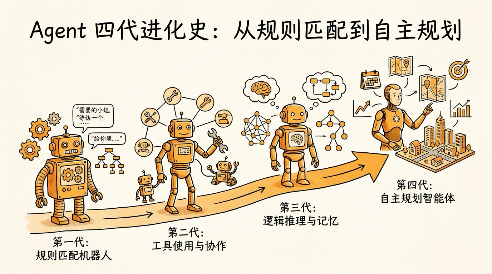
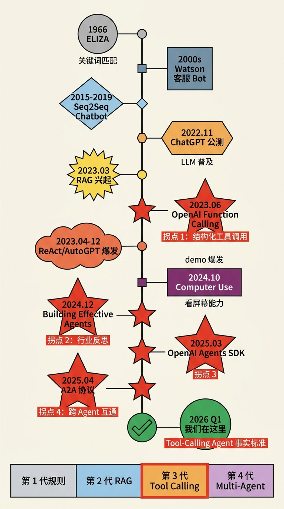
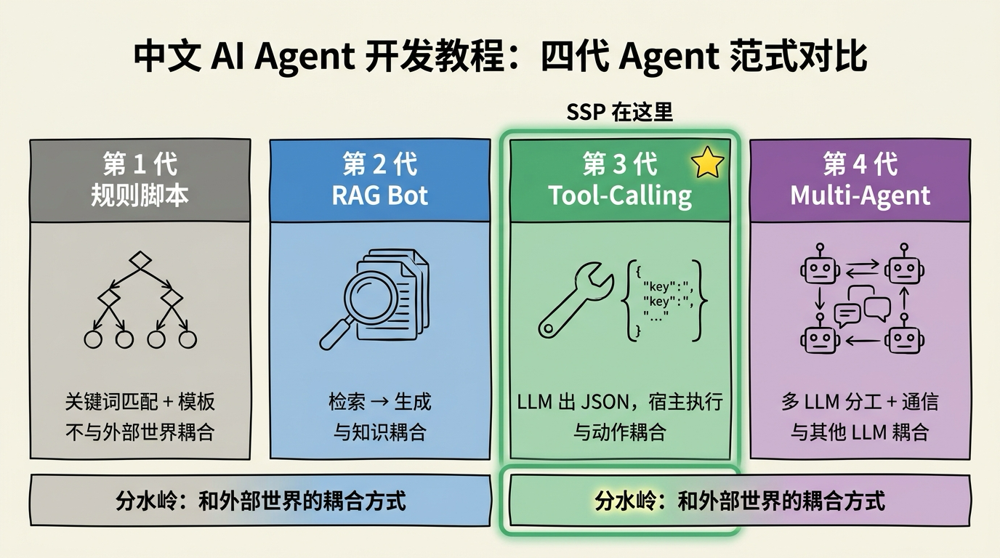
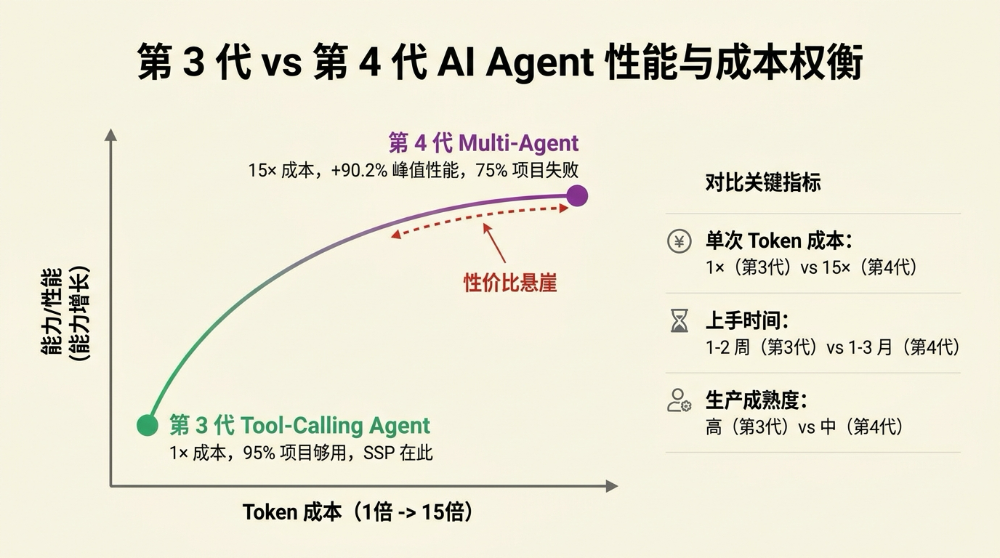
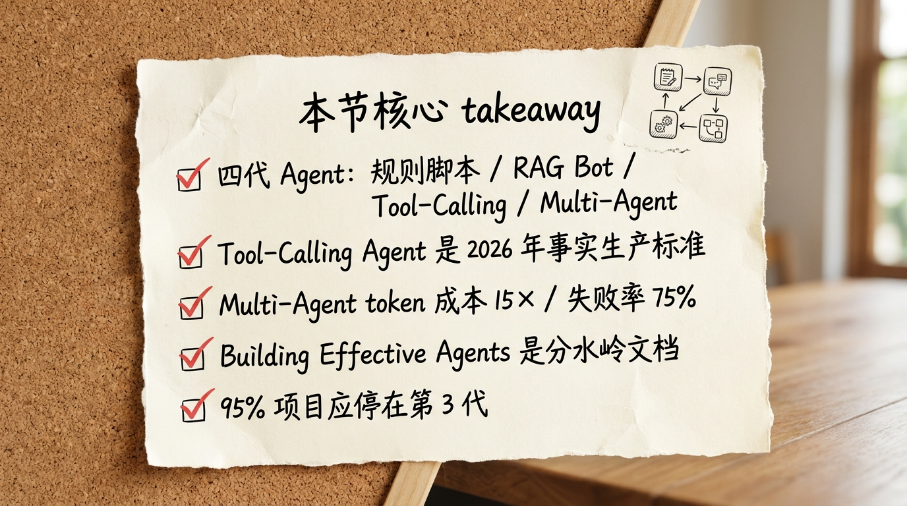

# 第 02 节 · Agent 四代进化史：从规则匹配到自主规划



> **预计时长**：阅读 30 分钟 / 实战 30 分钟
> **前置知识**：[第 01 节《AI Agent 到底是个啥》](./02-what-is-agent.md)
> **本节代码**：`ssp-web` 仓库 `chapter-02` tag · 主要文件 `src/lib/ai/agent.ts`、`src/lib/ai/tools.ts`

2023 年 4 月，AutoGPT 在 GitHub 一周涨了 5 万星。

那段日子推特上天天有人发视频——给 AutoGPT 一句"帮我开个袜子电商"，它自己上网查市场、自己写商业计划、自己设计 logo，还自己注册域名。视频底下评论区一片"AGI 来了"。

我当时也跟风装了一个，想让它帮我做点正经事。结果它在我硬盘上转了两小时，烧了 8 美元 token，最后给我留下一个**充满循环引用的笔记文件**——它把自己写的 todo 列表当成了用户的新需求，又生成了一份新的 todo，又把这份新的当需求……尾声的日志是这样的：

```
Step 47: I should probably break this loop.
Step 48: But before I do, let me create a TODO to break the loop.
Step 49: TODO created. Continuing with original plan.
Step 50: ...
```

那是我第一次直观感受到 **demo 和生产的鸿沟**。AutoGPT 在演示视频里能演出 AGI 的影子，但你真把它放进自己的工作流，它会优雅地烧光你的钱然后给你一堆垃圾。

三年过去，再看 2026 年的 Agent 市场——**99% 的真实生产项目还是停在 Tool-Calling Agent 这一代**。SSP 也是。不是不能往前再走，是**性价比不允许**。这一节，我们把 Agent 进化的四代讲清楚，让你看完知道自己手上的项目应该停在哪一代——以及为什么别盲目追第四代。

---

## 一、知识铺垫：从 ELIZA 到 AutoGPT，60 年画一张时间轴

Agent 不是 2023 年突然冒出来的。它是一段足足 60 年的演化史，每一代都解决了上一代解决不了的问题，但也带来了新问题。

我们把这段历史压成一张时间轴：

```
1966   ELIZA（MIT，关键词匹配 + 模板）
            │
            ▼
2000s  Watson / 客服 Bot（倒排索引 + FAQ）
            │
            ▼
2015-2019   Seq2Seq / Smart Reply（神经网络对话）
            │
            ▼
2022.11    ChatGPT 公测（LLM 普及，但只能聊）
            │
            ▼
2023 初     RAG（LangChain / LlamaIndex 兴起）
            │
            ▼
2023.06    OpenAI Function Calling（关键拐点 1：结构化工具调用）
            │
            ▼
2023 全年   ReAct Agent / AutoGPT / BabyAGI（demo 爆发）
            │
            ▼
2024.10    Computer Use（Claude / OpenAI Operator）
            │
            ▼
2024.12    Anthropic《Building Effective Agents》(关键拐点 2：行业反思)
            │
            ▼
2025.03    OpenAI Agents SDK（关键拐点 3：handoff 生产化）
            │
            ▼
2025.04    Google A2A 协议（关键拐点 4：Agent 互操作）
            │
            ▼
2026 Q1    我们在这里 —— 单 Agent + Tool Calling 是事实生产标准
```



<!-- 图片说明（给图片代理）：
风格：信息图（infographic），扁平专业风格
内容：纵向时间轴，从上到下 11 个节点（1966 ELIZA → 2026 Q1 SSP）
  - 1966 ELIZA（关键词匹配，灰色）
  - 2000s Watson / 客服 Bot（蓝灰色）
  - 2015-2019 Seq2Seq Chatbot（淡蓝）
  - 2022.11 ChatGPT 公测（橙色，"LLM 普及"标签)
  - 2023.03 RAG 兴起（黄色）
  - 2023.06 OpenAI Function Calling ⭐拐点 1（红色高亮，标"结构化工具调用"）
  - 2023.04-12 ReAct/AutoGPT 爆发（橙红，标"demo 爆发"）
  - 2024.10 Computer Use（深紫，标"看屏幕能力"）
  - 2024.12 Building Effective Agents ⭐拐点 2（红色高亮，标"行业反思"）
  - 2025.03 OpenAI Agents SDK ⭐拐点 3（红色高亮）
  - 2025.04 A2A 协议 ⭐拐点 4（红色高亮，标"跨 Agent 互通"）
  - 2026 Q1 「我们在这里」（绿色，标 "Tool-Calling Agent 事实标准"）
中文标注，每个节点带年份 + 一句话说明，4 个拐点星标特别突出
整体下方再画一条横向带：第 1 代规则 → 第 2 代 RAG → 第 3 代 Tool Calling → 第 4 代 Multi-Agent，4 代色块，强调 SSP 在第 3 代
-->

11 个阶段我们留给学术综述（参考 R3 论文清单）。**对工程师来说，记住四代就够**：

| 代 | 名字 | 代表 | 范式 | SSP 在这里？ |
|---|---|---|---|---|
| 第 1 代 | 规则脚本 | ELIZA、Watson、客服 FAQ | 关键词匹配 + 模板 | ❌ |
| 第 2 代 | RAG Bot | LangChain / LlamaIndex 套餐 | 检索 → 生成 | ❌ |
| 第 3 代 | Tool-Calling Agent | OpenAI Function Calling、Claude Tool Use | LLM 输出 JSON、宿主执行 | ✅ |
| 第 4 代 | Multi-Agent / 自主规划 | AutoGPT、CrewAI、LangGraph、Anthropic 多 Agent | 多个 LLM 实例分工 + 通信 | ❌ |



<!-- 图片说明（给图片代理）：
风格：信息图（infographic），扁平专业风
内容：4 个横向并排的色块，从左到右代表四代 Agent
  1. 第 1 代 规则脚本（灰色）：图标=决策树，标「关键词匹配 + 模板」「不与外部世界耦合」
  2. 第 2 代 RAG Bot（蓝色）：图标=放大镜+文档，标「检索 → 生成」「与知识耦合」
  3. 第 3 代 Tool-Calling（绿色，高亮+⭐SSP 在这里）：图标=扳手+JSON，标「LLM 出 JSON，宿主执行」「与动作耦合」
  4. 第 4 代 Multi-Agent（紫色）：图标=多个机器人连线，标「多 LLM 分工 + 通信」「与其他 LLM 耦合」
每个色块底部标一句「分水岭：和外部世界的耦合方式」，第 3 代用边框突出
中文标注，字号清晰
-->

> **划重点**：四代的分水岭不是模型大小，是「**LLM 和外部世界的耦合方式**」。每跨一代，LLM 就和现实世界更紧一点。

第 1 代到第 2 代：LLM 和"知识"耦合（能读，但不能做）。
第 2 代到第 3 代：LLM 和"动作"耦合（能调工具）。
第 3 代到第 4 代：LLM 和"其他 LLM"耦合（多 Agent 协作）。

下面我们一代一代展开。

---

## 二、核心讲解

### 2.1 第一代：规则脚本 / FAQ Bot（1966-2010s）

**代表**：ELIZA（Weizenbaum, MIT, 1966）、IBM Watson、各家客服决策树。

**核心范式**：关键词匹配 + 模板回复。

ELIZA 的伪代码本质长这样：

```python
# 第 1 代 Chatbot 的本质（示意，非项目实际代码）
def reply(user_input):
    if "headache" in user_input:
        return "Tell me more about your headache."
    if "mother" in user_input:
        return "Tell me more about your family."
    return "Please go on."
```

就这么简单。但 1966 年的人被它震撼到流泪——Weizenbaum 的秘书甚至要求他离开房间，好让她和"心理医生"私下聊天。

ELIZA 的成功告诉我们一件事：**人类对"被理解"的标准很低**。但同样的设计放到 2024 年，没人会觉得这是 AI——它没有理解，没有记忆，没有外部动作能力。

**典型应用场景**：FAQ 客服机器人（如银行卡丢失自助流程）、电话语音菜单（"按 1 查账单，按 2 ……"）、IVR 系统。

**反例（什么时候这是错的选择）**：处理非结构化的开放对话。它跑不出训练时枚举过的关键词，遇到没见过的输入就崩。今天还在用决策树跑客服的产品，每次新业务上线都要手动加规则，最后维护成本爆炸。

**SSP 不在这里**：SSP 的输入"我是 73 年女性"，关键词匹配根本无法处理（"73 年"该匹配 1973 还是 2073？），决策树撑不起这种语义。

### 2.2 第二代：RAG Bot（2023 初）

**代表**：LangChain、LlamaIndex 早期版本，所有"挂了一个知识库的 LLM"。

**核心范式**：检索 → 注入 → 生成。

```python
# 第 2 代 RAG 的本质（示意）
def reply(user_input):
    docs = vector_db.search(user_input, top_k=5)  # 检索
    context = "\n".join(docs)
    prompt = f"基于下面文档回答：\n{context}\n\n问题：{user_input}"
    return llm.complete(prompt)                    # 生成
```

RAG 是一个巨大的进步——它让 LLM 能"读"训练数据之外的内容。法律咨询、医疗百科、企业内部文档，都可以通过向量检索注入到 prompt 里，让 LLM 基于事实回答。

**但 RAG 仍然只能"读"，不能"做"**。

举个例子：你问 RAG Bot"我刚买的这只股票今天涨了多少"——它从训练数据找不到，从你的知识库也找不到，只能回答"我无法查询实时股价"。它不会去**调一个股票 API**。

**典型应用场景**：企业内部文档问答（"HR 政策手册问答机器人"）、技术文档助手、法律条文检索。

**反例**：需要执行动作的场景。给 RAG Bot 发"帮我订下周五早上 9 点北京到上海的机票"，它能给你列出所有航班信息（从知识库检索到的），但无法**真的去订**。

**SSP 不在这里**：社保规划不仅需要知识（政策条文），更需要**计算**。RAG 能帮你查到"养老最低缴费年限是 15 年"这条政策，但算不出"你还差几个月、要交多少钱"——这必须靠工具调用。

> **划重点**：RAG 解决了"LLM 没读过这份资料"的问题；它没解决"LLM 算不对数"的问题。混淆这两个，是中小团队最常见的产品定位错误。

### 2.3 第三代：Tool-Calling Agent（2023.06 至今）—— SSP 所在的位置

**关键拐点**：2023 年 6 月，OpenAI 发布 Function Calling。从此 Agent 从「prompt 工程黑魔法」变成「结构化协议」的工程问题。

**核心范式**：LLM 输出**结构化 JSON**指明要调哪个工具、传什么参数；宿主代码执行；结果塞回上下文；LLM 再决定下一步。

这是我们在第 01 节讲过的循环：

```typescript
// 第 3 代 Tool-Calling Agent 的本质（示意，对应 ssp-web 的 streamText 内部循环）
let messages = [{ role: "user", content: "我是 73 年女性" }];
while (步数 < stopWhen) {
  const reply = await llm.complete({ messages, tools });
  if (!reply.tool_calls) return reply.text;        // 没要调工具，结束
  for (const call of reply.tool_calls) {
    const result = await tools[call.name](call.args);  // 真执行
    messages.push({ role: "tool", content: result });
  }
}
```

**SSP 就是这一代的一个标准实例**。看 `src/lib/ai/agent.ts:47-79`：

```typescript
return streamText({
  model: openai(model),
  system: systemPrompt,
  messages,
  tools,                       // 3 个工具：computePlan / validateField / updateProfile
  stopWhen: stepCountIs(8),    // ReAct 循环上限
  temperature: 0.3,
  providerOptions: {
    openai: { store: false },
  },
});
```

整个 Agent 的"心脏"就这么一段。AI SDK v6 的 `streamText` 把 ReAct loop 封装好了，你只需要传 messages 和 tools。

**为什么第三代是事实标准？**

我们用一组数据说明：

| 维度 | 第 3 代（Tool-Calling） | 第 4 代（Multi-Agent） |
|---|---|---|
| 单次对话 token 成本 | **1×**（baseline） | **15×**（Anthropic 内部数据） |
| 调试难度 | 中 | 高（多 Agent 互相影响） |
| 上手时间 | 1-2 周 | 1-3 个月 |
| 生产成熟度 | ✅ 高 | 中（Forrester：**75% 项目失败**） |
| 适合任务 | 单一目标、步数 < 10 | 跨域研究、breadth-first |

> **划重点（来自 R3 §6）**：Anthropic 多 Agent 研究系统在某些任务上比单 Agent 提升 **90.2%**，但 token 成本是 **15×**。**80% 的 token 差异解释了 80% 的性能差异**——多 Agent 不是魔法，是用钱买精度。



<!-- 图片说明（给图片代理）：
风格：信息图（infographic），扁平专业风
内容：一条二维权衡图，横轴=token 成本（1× → 15×），纵轴=能力/性能。
  - 左下绿点：第 3 代 Tool-Calling Agent，标「1× 成本、95% 项目够用、SSP 在此」
  - 右上紫点：第 4 代 Multi-Agent，标「15× 成本、+90.2% 峰值性能、75% 项目失败」
  - 两点之间画一条边际收益递减的曲线，曲线后段用红色虚线标「性价比悬崖」
  - 右侧附一栏数字：单次 token 成本 1× vs 15×、上手 1-2 周 vs 1-3 月、生产成熟度 高 vs 中
中文标注，字号清晰
-->

ReAct 论文（arXiv:2210.03629）在 ALFWorld 上比模仿学习 + RL 高出 **34% 绝对成功率**——但这是论文场景。落到生产，第三代 Tool-Calling Agent 已经能解决**绝大多数业务场景**：客服、咨询、规划、报告生成、内部工具自动化。

**典型应用场景**：

- 社保/税务/法律咨询（SSP 同构）
- 客服自动化（接单、查物流、退款）
- 数据分析助手（SQL 生成 + 执行 + 解读）
- 编码助手的工具部分（Cursor 的工具层、Copilot Workspace）

**反例**：以下场景**不该停在第 3 代**：

1. 跨多个领域的深度研究（"分析过去 10 年新能源车赛道，给出投资建议"）—— 这种 breadth-first 任务，单 Agent 上下文窗口装不下。
2. 长程多角色协作（"写一个完整剧本，需要剧情、对白、分镜、人设"）—— 单 Agent 容易跑偏，多 Agent 各司其职更稳。
3. 需要在多个虚拟工作流并行处理的任务—— LLMCompiler / Map-Reduce 模式更合适。

但这些场景占比不超过 5%。**剩下 95%，第 3 代够用**。

### 2.4 第四代：Multi-Agent / 自主规划（2023.08 至今）

**代表（按时间）**：

| 时间 | 项目 | 特点 |
|---|---|---|
| 2023.04 | AutoGPT、BabyAGI | 单 Agent 自主规划，**demo 神级，生产不行** |
| 2023.08+ | AutoGen（Microsoft） | 多 Agent 对话框架 |
| 2024 | CrewAI | role-based 多 Agent，"角色" 抽象 |
| 2024 | LangGraph | 低抽象图节点，全部多 Agent 范式都能跑 |
| 2024.10 | Claude Computer Use / OpenAI Operator | 看屏幕 + 点鼠标 |
| 2025 | Anthropic 多 Agent Research | Lead Opus + 多个 Sonnet subagent |
| 2025.03 | OpenAI Agents SDK | handoff 模式生产化 |
| 2025.04 | Google A2A 协议 v1.0 | Agent 之间的"HTTP" |

**核心范式**：把任务拆给多个 LLM 实例（每个有自己的角色 + 工具），它们之间通过自然语言或结构化消息通信，完成单个 Agent 搞不定的复杂任务。

**典型多 Agent 模式**（详见 R3 §6）：

| 模式 | 结构 | 典型场景 |
|---|---|---|
| Supervisor / Hierarchical | 一个 Lead Agent 统筹多个 Worker | Anthropic 研究系统 |
| Swarm / Network | Agent 之间 handoff，无中央 | OpenAI Agents SDK |
| Sequential Pipeline | A → B → C | CrewAI sequential（其实就是 prompt chaining） |
| Map-Reduce | 多 Agent 并行 + Reducer 聚合 | Anthropic 多文档摘要 |
| Debate / Consensus | N 个 Agent 互辩 → 投票 | 高赌注决策（医疗、合约） |

**多 Agent 的"代价"——一定要算清楚再上**：

来自 Anthropic 内部和 R3 §11 的真实数据：

- **Token 成本：15×**（多 Agent vs 单 chat）—— 不是夸张，是事实。多 Agent 系统每个 Agent 都要看上下文、出推理、调工具，token 像水龙头一样流。
- **失败率：75%**（Forrester 2025 调研）—— 75% 的企业自建多 Agent 项目最终失败。失败原因不是模型不行，是基础设施、可靠性工程、测试不到位。
- **调试地狱**：A 出错传给 B，B 又传给 C，最终 D 给出错误答案——你怎么排查根因？需要一整套 trace + replay 工具。
- **学习曲线**：LangGraph 的 checkpoint / interrupt / Send API，AutoGen 的 actor model，每一个都是 1-3 个月的学习成本。

**Anthropic 自己怎么说？**

2024 年 12 月 Anthropic 发了一篇里程碑文章《Building Effective Agents》。整篇文章一句核心思想：

> **先穷尽单 Agent 再上多 Agent。** 80% 的需求单 Agent + Tool Calling 就够。

这是行业内**第一次系统性反思**——之前一年大家都在追多 Agent，到 2024 年底终于有人站出来说"算账要算清楚"。这篇文章可以说为整个 2025 年的 Agent 工程化定调。

**那什么时候**该用多 Agent？

R3 §6.0 给的判断：**只在任务价值足够高时，多 Agent 经济上才成立**。

具体来说：

- 任务是 breadth-first（研究、调研、扫描大量素材）
- 单个 Agent 的上下文窗口装不下
- 用户能接受 30 秒以上等待 + 5-15× 单次成本
- 任务结果价值 > 100 美元/次（因为光 token 就要烧 5-20 美元）

这些条件**绝大多数 SaaS 业务都不满足**。

**SSP 为什么不上多 Agent？**

简单算笔账：

- SSP 一次对话平均 2-4 个工具调用，单次 token 约 5K input + 2K output ≈ $0.001（用 gpt-4o-mini）
- 如果改成多 Agent（比如一个 PolicyAgent 查规则、一个CalcAgent 算数、一个 PresenterAgent 翻译成话），token 至少 ×10 ≈ $0.01
- SSP 是免费产品，每条多 1 美分意味着……我们要再付 10 倍服务器钱
- 而**用户体验提升不到 10%**——单 Agent 已经能算对了

> **金句**：选第几代 Agent 不是看技术新潮度，是看任务的"投入产出比"。SSP 老老实实待在第三代，不是因为我们不会做第四代，是因为**第三代刚刚好**。

### 2.5 关键拐点事件复盘

进化史不是平滑曲线，是几个关键事件推着往前走的。我们挑四个最重要的拐点复盘一下：

**拐点 1：2023.06 OpenAI Function Calling**

之前的 Agent（如 ReAct 论文）是用 prompt 让模型生成"伪结构化"字符串，再用正则抽出来。这种方式在生产里**极不稳定**——一个标点符号、一个换行就崩。

Function Calling 把"工具调用"变成模型的**原生能力**：模型直接输出 `{"function": "search", "arguments": {...}}` 这种 JSON，宿主无需解析。从此 Agent 从"prompt 黑魔法"变成"结构化工程"。

**对应到 SSP**：我们的 `tools.ts` 用 Vercel AI SDK 的 `tool()` + Zod schema 注册工具，模型按 schema 输出 JSON，SDK 自动调用 execute。这一切都是 Function Calling 的工业化产物。

**拐点 2：2024.12 Anthropic《Building Effective Agents》**

这篇文章把行业从"追多 Agent"拉回"先做好单 Agent"。文章里给出了 5 种"工作流模式"（chain / routing / parallelization / orchestrator-workers / evaluator-optimizer）和 1 种真正意义上的"Agent"（autonomous tool-using loop）。

文章金句：「**Don't build agents for everything. Build the simplest thing that works.**」

**对应到 SSP**：我们的 11 节 System Prompt 分层、`stopWhen: stepCountIs(8)`、3 个工具的最小集，全部受这篇文章影响。没有它，我们可能也会走"多 Agent" 弯路。

**拐点 3：2025.03 OpenAI Agents SDK**

OpenAI 把内部的 Swarm 框架重做成正式产品 Agents SDK，把"handoff"（一个 Agent 把任务转交给另一个）做成一等公民，并内置 tracing 系统。这是第一次从大厂角度，**承认 Agent 是一个有自己 SDK 的工程领域**，而不只是 Chat Completions 的一个 feature。

**对应到 SSP**：我们用的是 Vercel AI SDK，但思路一致——`streamText` + `tool()` + `stopWhen` 就是 OpenAI Agents SDK 的 TypeScript/Next.js 等价物。

**拐点 4：2025.04 Google A2A 协议**

Google 发布了 Agent-to-Agent（A2A）协议 v1.0，定义了 `Agent Card`（发布在 `/.well-known/agent.json`）、Task 生命周期、跨厂商通信标准。2025 年 7 月规范捐给 Linux Foundation，超过 150 家组织参与。

**A2A 和 MCP 的关系**：

| 维度 | MCP（Model Context Protocol） | A2A（Agent-to-Agent） |
|---|---|---|
| 范围 | **垂直**：单 Agent ↔ 工具 | **水平**：Agent ↔ Agent |
| 类比 | "USB-C for tools" | "HTTP for agents" |
| 提出方 | Anthropic（2024.11） | Google（2025.04） |

两者**互补不冲突**。我们会在[第 24 节《MCP 协议拆解》](./25-mcp-protocol.md)详细展开 MCP，A2A 留到[第 27 节《多 Agent 协作模式》](./28-multi-agent.md)再讲。

### 2.6 怎么判断你的项目该停在哪一代

我们把决策路径压成一张表，你拿着自己的项目对号入座：

| 你的场景 | 推荐代际 | 为什么 |
|---|---|---|
| FAQ 自助、固定流程客服 | 第 1 代 + LLM 兜底 | 关键词决策树最稳，LLM 兜不住的 5% 用大模型 |
| 内部文档问答、政策检索 | 第 2 代（RAG）| 检索 + 生成够用，没必要给 RAG 接 100 个工具 |
| 业务咨询 + 计算 + 多轮决策 | **第 3 代（SSP 同构）** | 95% 项目应该停在这里 |
| 跨多领域深度研究 | 第 4 代（Map-Reduce 多 Agent） | 单 Agent 装不下 |
| 高赌注决策（医疗诊断、合约审核） | 第 4 代（Debate）| 多 Agent 互辩降低幻觉 |
| 长程编码、SWE-bench 类任务 | 第 4 代（Supervisor）| Anthropic 多 Agent 研究系统是正解 |

> **判定准则三连击**（沿用第 01 节）：
> - 任务能不能在 8 步内搞定？能 → 第 3 代够。
> - 任务需要不需要 100K+ 上下文里同时处理多个子领域？需要 → 考虑第 4 代。
> - 你愿不愿意付 15× token 成本？不愿意 → 老老实实第 3 代。

**多数项目最佳停留点是第 3 代**。这是 2026 年的工程现实。

---

## 三、举一反三：四代各自的最佳应用场景与反例

为了让你内化"什么时候用什么"，我们对四代分别给一个**最佳场景**和一个**反例**：

**第 1 代：规则脚本**

- ✅ 最佳场景：电话语音菜单、银行 ATM 自助流程、退货流程问答。**输入空间小、流程固定、合规要求严**——决策树最稳。
- ❌ 反例：用决策树做心理咨询机器人。每个用户表达情绪的方式都不一样，关键词匹配会让 90% 的对话陷入"对不起，我没有理解您的问题"。

**第 2 代：RAG Bot**

- ✅ 最佳场景：内部文档问答（"我们公司的差旅报销流程是？"）、技术文档助手（库的 API 用法）、合规知识库。**只读、不写，知识库是真理**。
- ❌ 反例：用 RAG 做股票分析助手。用户问"今天 NVDA 涨了多少"，RAG 找不到（训练数据 + 知识库都没有实时数据），它会要么瞎编要么道歉。这种场景需要的是 Tool Calling（接 stock API）。

**第 3 代：Tool-Calling Agent**

- ✅ 最佳场景：SSP 这种"咨询 + 计算 + 决策"场景；客服自动化；数据分析助手；编码工具层。**目标单一、步数有限、可被工具结果修正**。
- ❌ 反例：用单 Agent 做"帮我研究过去 10 年新能源赛道并给投资建议"。这种 breadth-first 任务，单 Agent 上下文装不下、思维深度不够。强行做出来的结果会很浅。

**第 4 代：Multi-Agent**

- ✅ 最佳场景：Anthropic 多 Agent Research（深度调研）、剧本写作 Agent 团队（剧情/对白/分镜分工）、Code Generation Pipeline（PM → Architect → Coder → Reviewer）。**任务复杂到单 Agent 不够 + 价值高到 token 成本可以摊销**。
- ❌ 反例：用 5 个 Agent 做"客服自动化"。单 Agent + 10 个工具就能解决的事，硬拆成 IntentAgent / RouterAgent / DBAgent / TemplateAgent / PostProcessAgent 来"显得专业"——结果是 token 成本飙升 10×、调试时间多 30 倍、用户体验**反而下降**（多了延迟和误传）。

> **金句**：架构选错了，不是慢一倍的问题，是钱包加倍出血。

---

## 四、小结



读到这里，你应该对 Agent 的"出身"有了清晰认知：

**1. Agent 不是 2023 年突然冒出来的。** 它是 60 年演化出的产物——从 1966 ELIZA 的关键词匹配，到 2026 的 Tool-Calling Agent，每一代都在解一个"上一代解不了"的问题，但也都付出了代价。

**2. 四代 Agent 的本质区别是"和外部世界的耦合方式"。** 第 1 代不耦合（纯规则）；第 2 代和"知识"耦合（RAG 检索）；第 3 代和"动作"耦合（Tool Calling）；第 4 代和"其他 LLM"耦合（多 Agent 协作）。每跨一代，能力扩大，成本和复杂度成倍增加。

**3. 95% 的生产项目应该停在第 3 代。** 第 4 代的 15× token 成本、75% 失败率、3 个月学习曲线，绝大多数项目无法承受。SSP 选第 3 代不是技术保守，是**算清楚账后的工程理性**。

**4. 关键拐点要记住**：2023.06 Function Calling、2024.12 Building Effective Agents、2025.03 OpenAI Agents SDK、2025.04 A2A 协议。这四个事件定义了今天的 Agent 工程领域。

**核心要点回顾**：

- ✅ 四代 Agent 分别是：规则脚本 / RAG Bot / Tool-Calling Agent / Multi-Agent
- ✅ Tool-Calling Agent（第 3 代）是 2026 年的事实生产标准
- ✅ Multi-Agent（第 4 代）token 成本是 15×、失败率 75%，选用要算账
- ✅ Anthropic《Building Effective Agents》(2024.12) 是分水岭文档
- ✅ ReAct +34%（ALFWorld）、LLMCompiler 3.7× 加速、Anthropic 多 Agent 90.2% 提升 vs 15× token——这些数字记下来就够你和别人吵架用了

下一节，我们深入第 3 代的核心机制：**ReAct 循环**——感知-推理-行动的三板斧到底怎么转起来。这是 SSP 的灵魂引擎，也是你以后做任何 Tool-Calling Agent 的通用心智模型。

---

## 思考题

1. **【开放题】** 从 1966 年的 ELIZA 到今天的 Tool-Calling Agent，60 年里你认为最大的范式飞跃发生在哪一年？为什么是它而不是别的？提示：可以从"模型能力"、"协议标准化"、"开发者工具"三个角度去想。
2. **【动手题】** clone `ssp-web` 跑起来后，对话框输入"我是 73 年女性"。然后**估算**：如果同样这个对话改成"多 Agent"实现（一个 PolicyAgent 查规则、一个 CalcAgent 算数、一个 PresenterAgent 翻译），token 成本会涨多少？参考 R3 §6.0 给出的 15× 估算。**验收标准**：能给出"目前每次 ~$0.001、改 multi-agent 大约 ~$0.0X"这样的具体数字 + 一两句"为什么这么估"的解释。
3. **【选做】** 用伪代码画出 SSP 的 Tool-Calling Agent 实现 vs 一个等价的 Multi-Agent 版本（比如 Supervisor 模式），做行数对比。**预期发现**：Multi-Agent 版本至少多 3-5 倍代码量，但能力提升微乎其微——这就是"过度设计"。

---

## 面试题

**Q1.【基础】【主题：Agent 进化史】** 请按时间顺序说出 Agent 的四代演进，并指出每一代的本质分水岭是什么。SSP 属于哪一代？
<details><summary>参考解答</summary>

四代依次是：

1. **规则脚本**（ELIZA、客服 FAQ）：关键词匹配 + 模板回复，不与外部世界耦合。
2. **RAG Bot**（LangChain/LlamaIndex 早期）：检索 → 注入 → 生成，与"知识"耦合，能读不能做。
3. **Tool-Calling Agent**（OpenAI Function Calling 之后）：LLM 输出结构化 JSON、宿主执行，与"动作"耦合。
4. **Multi-Agent / 自主规划**（AutoGPT、CrewAI、LangGraph、Anthropic 多 Agent）：多个 LLM 实例分工 + 通信，与"其他 LLM"耦合。

**本质分水岭不是模型大小，而是"LLM 和外部世界的耦合方式"**——每跨一代，LLM 就和现实世界更紧一层。SSP 是标准的**第 3 代 Tool-Calling Agent**：`streamText` + 3 个工具 + `stopWhen` 多步循环。

</details>

**Q2.【进阶】【主题：Agent 进化史】** 2023 年 6 月的 OpenAI Function Calling 为什么被称为 Agent 工程的关键拐点？它之前的 ReAct 是怎么实现"调用工具"的？
<details><summary>参考解答</summary>

在 Function Calling 之前，ReAct 类 Agent 靠**纯 Prompt 工程**让模型生成"伪结构化"字符串（如 `Action: Search[xxx]`），宿主再用正则把工具名和参数抽出来执行。这种方式在生产里极不稳定——一个标点、一个换行就可能让解析失败。

Function Calling 把"工具调用"变成模型的**原生能力**：模型直接输出结构化的 `tool_calls` JSON（工具名 + 参数），宿主无需正则解析。从此 Agent 从"Prompt 黑魔法"变成"结构化工程问题"，可测、可控、可复现。今天的 Tool-Calling Agent（含 SSP 用的 AI SDK v6 `tool()` + Zod schema）本质都是 Function Calling 的工业化产物。

</details>

**Q3.【深挖】【主题：Agent 进化史】** 有人主张"既然多 Agent 在某些任务上比单 Agent 强 90%，就该默认上多 Agent"。请结合成本与可靠性，反驳或限定这个观点。
<details><summary>参考解答</summary>

该观点忽略了代价。Anthropic 多 Agent 研究系统的数据显示：性能提升约 90.2% 的同时，**token 成本约为单 Agent 对话的 15 倍**，且官方归因是"性能差异很大程度由 token 用量差异解释"——多 Agent 不是某种神奇协作智慧，而是"看得更多、想得更多、写得更多"。

因此是否上多 Agent 应满足三条硬判据（任务价值视角）：

1. **breadth-first**：宽度优先探索（研究大量素材），单 Agent 上下文装不下。
2. **子任务可独立并行**：弱耦合，能 fail-one-retry-one。
3. **任务价值 ≫ 15× token 成本**：值得为单次任务付 15 倍代价。

Anthropic 2024 年底《Building Effective Agents》的核心建议是"先穷尽单 Agent 再上多 Agent，完全自主 Agent 是最后手段"。SSP 问题边界窄、链路短、成本敏感，三条判据一条都不满足 → 单 Agent 是终点而非中间站。**架构选型看投入产出比，不看技术新潮度。**

</details>

---

## 延伸阅读

- [Anthropic — Building Effective Agents (2024.12)](https://www.anthropic.com/engineering/building-effective-agents) — 必读。分水岭文档
- [Anthropic — How we built our multi-agent research system (2025)](https://www.anthropic.com/engineering/multi-agent-research-system) — 多 Agent 落地的最权威案例
- [ReAct 论文：arXiv:2210.03629](https://arxiv.org/abs/2210.03629) — Reason + Act 思想首发
- [LLMCompiler 论文：arXiv:2312.04511](https://arxiv.org/abs/2312.04511) — 并行 Function Calling 编译器，3.7× 加速
- [A2A Protocol Specification v1.0](https://a2a-protocol.org/latest/specification/) — Agent 互操作协议规范

---

[← 上一节：第 01 节 · AI Agent 到底是个啥](./02-what-is-agent.md) · [📚 目录](./README.md) · [下一节：第 03 节 · ReAct 循环 →](./04-react-loop.md)
