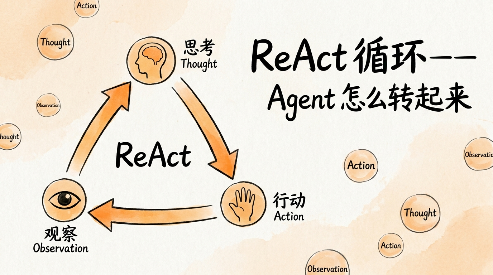
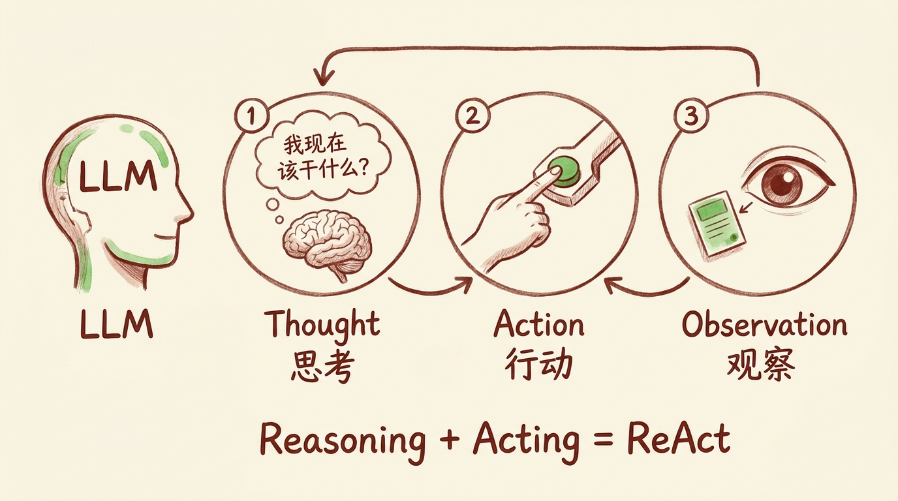
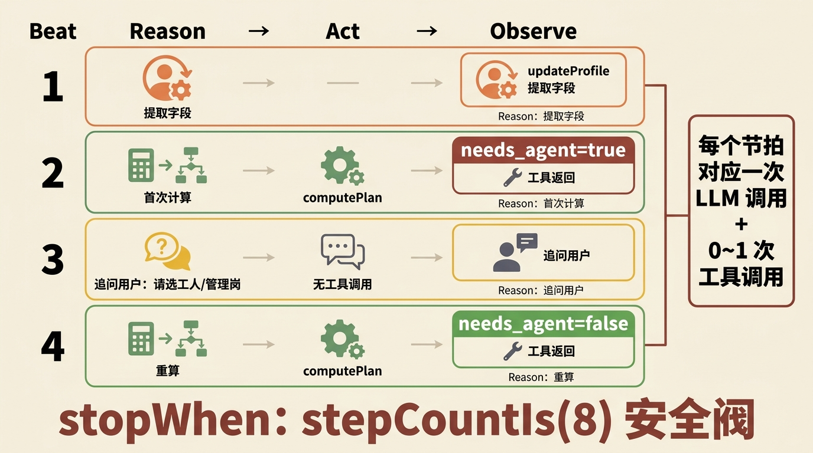
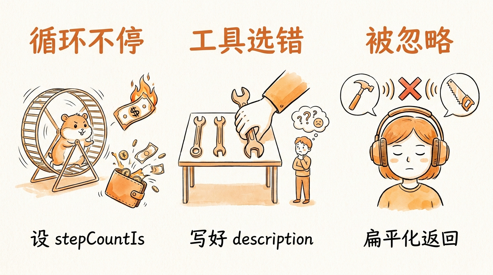
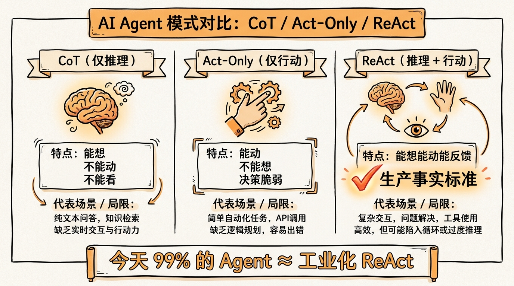

# 第 03 节 · ReAct 循环：感知-推理-行动的三板斧



> **预计时长**：阅读 25 分钟 / 实战 45 分钟
> **前置知识**：第 01 节《AI Agent 到底是个啥》、第 02 节《Agent 四代进化史》
> **本节代码**：`ssp-web` 仓库 `chapter-03` tag · 主要文件 `src/lib/ai/agent.ts`、`src/lib/ai/tools.ts`、`src/app/api/chat/route.ts`

---

那天有个朋友在群里发截图，说他做了个查机票的 Agent，让他自豪了三天。

第四天他发来一张图：用户问"明天上海飞东京最便宜的航班是哪趟"，Agent 自信地回答："**MU 521，明早 9:50 起飞，含税 1860 元，强烈推荐。**"

朋友截图里同时贴了一条消息：他刚刚用真名买票，发现根本**没有 MU 521 这趟航班**。航班号、价格、起飞时间——全是 LLM 编出来的。

他在群里问的是同一个问题：「我明明给它接了航班查询 API，它怎么还能编？」

我让他打开 console 看一眼。果然——LLM 那一轮**根本没调工具**，直接拿"它以为它知道"的航班信息回了一句。

这就是为什么我们要花一整节聊 **ReAct**。

ReAct 不是什么玄学概念，它是一种**逼着 LLM 把"思考"和"行动"交织起来**的工作方式。今天市面上几乎所有靠谱的 Agent，本质都跑在 ReAct 这套循环里。理解它，你就理解了 99% 的 Agent。

---

## 一、知识铺垫：为什么 LLM 单靠"想"是不够的

回到第 01 节我们讲过的三件事：**感知 / 推理 / 行动（Perception / Reasoning / Action，下文简称 PRA）**。

- **感知**：把"我是 73 年的女性"变成 `{birth_year: 1973, gender: "female"}`
- **推理**：判断"信息够不够""下一步该干什么"
- **行动**：真的去算、去查、去存

聊天机器人有 1，没有 2 的下一步，更没有 3。
Agent 三件事全有，关键还在于：**它知道什么时候做哪件事，以及要不要再做一遍。**

但麻烦在于——LLM 本身只会"产 token"。它没有按钮可以按、没有 API 可以调、没有数据库可以查。如果你不显式告诉它"你的下一步要么是说话，要么是调一个工具"，它就会**用编造来填补不知道的部分**。这就是开头那个机票 Agent 翻车的根因。

### 早期方案为什么不够

在 ReAct 之前，业界尝试过两条路，都不太行。

**第一条路：纯 Chain-of-Thought（CoT）**——让 LLM 一步一步"想"。

CoT 是 Wei 等人 2022 年的论文（[arXiv:2201.11903](https://arxiv.org/abs/2201.11903)）提出的，思路简单：在 Prompt 里加一句"Let's think step by step"，让模型把推理过程展开。

问题是，**CoT 只能在脑子里推，没有外部信息接入**。让 CoT 模型查"明天上海到东京最便宜的航班"，它最多老老实实告诉你"我没法实时查询"，但更常见的情况是——它一本正经地编一个。

**第二条路：纯 Act-Only**——干脆让模型只输出动作，别想。

OpenAI 早期做过类似实验：给 LLM 一堆工具，每轮强制输出一个 `tool_call`。问题立刻就来了——模型不知道"为什么要调这个工具"，调用决策极其脆弱，工具一多就乱套。

> 划重点：**只想不动 → 幻觉**；**只动不想 → 乱调**。两条路都堵死了。

### ReAct 出场：把"想"和"做"串成一条 token 流

2022 年 10 月，普林斯顿的 Shunyu Yao 和 Google Brain 的合作者发了一篇论文——*ReAct: Synergizing Reasoning and Acting in Language Models*（[arXiv:2210.03629](https://arxiv.org/abs/2210.03629)），ICLR 2023 接收。

ReAct 的核心思路就一句话：**让模型每一步都在同一段 token 里既"想"又"做"，然后把环境的反馈（Observation）拼回上下文，进入下一轮。**

写成模式就是：

```
Thought: <模型在想什么>
Action: <模型决定做什么>
Observation: <环境的反馈>
Thought: <根据反馈接着想>
Action: <接着做>
...
```

这套模式在论文里的实验结果非常硬：

| 任务 | 对照组 | ReAct 表现 |
|---|---|---|
| HotpotQA（多跳问答） | CoT-only 24% EM | ReAct + CoT 35% EM |
| Fever（事实校验） | CoT-only 56% | ReAct 60% |
| ALFWorld（具身 Agent） | 模仿学习 22% 成功率 | ReAct **71%** 成功率（+49 绝对值） |
| WebShop（网页购物） | RL baseline 28.7% | ReAct 40% 成功率（+11 绝对值） |

也就是说，光让 LLM "想"或者光让它"动"都不够，**只有把两件事织进一段 token 流里，模型才能在每个观察点上修正自己的轨迹**。



<!-- 图片说明（给图片代理）：
风格：手绘信息图，温暖配色（米黄底 + 棕红线条 + 绿色高亮）
内容：左侧画一个 LLM 头部剪影；右侧三个圆环依次相连：
  1. Thought（思考）——脑子里冒一个泡泡，写"我现在该干什么？"
  2. Action（行动）——一只手伸出去按一个工具按钮
  3. Observation（观察）——一只眼睛看到工具返回的小卡片
三个圆环用箭头串成循环，箭头从 Observation 回到 Thought
底部一句话："Reasoning + Acting = ReAct"
中文标注，字号清晰
-->

---

## 二、核心讲解

### 2.1 ReAct 原始论文里的"伪格式"

ReAct 提出的时候（2022.10），LLM **还没有原生 tool calling**。OpenAI 的 function calling 要等到 2023 年 6 月才上线。所以原始论文里的 ReAct 是**纯 prompt 工程**——靠 Prompt 让模型生成符合格式的字符串，再用正则把 `Action: tool(args)` 抽出来执行。

举个论文 §B.1 里的例子（HotpotQA），用户问：「除了 Apple Remote 这个产品，还有哪些设备可以控制 Apple Remote 最初设计要交互的程序？」

ReAct Agent 的轨迹长这样（精简版）：

```
Thought 1: I need to search Apple Remote and find the program it was originally designed to interact with.
Action 1:  Search[Apple Remote]
Observation 1: The Apple Remote is a remote control ... originally designed to control the Front Row media center program ...

Thought 2: Apple Remote was originally designed to control the Front Row media center program. I need to search Front Row next and find what other devices can control it.
Action 2:  Search[Front Row]
Observation 2: Could not find [Front Row]. Similar: ['Front Row Seat to Earth', 'Front Row (software)', ...]

Thought 3: To find the program, I can search Front Row (software).
Action 3:  Search[Front Row (software)]
Observation 3: Front Row is a discontinued media center software ... controlled by an Apple Remote or the keyboard function keys.

Thought 4: So the answer is keyboard function keys.
Action 4:  Finish[keyboard function keys]
```

注意几个关键点：

1. **Thought 是自然语言**，不是结构化 JSON。模型要靠 Prompt 模板里的 few-shot 例子学会"先 Thought 再 Action"。
2. **Action 是字符串**：`Search[xxx]` 这种格式，外部代码用正则 `r"Action \d+: (\w+)\[(.*?)\]"` 抽出来。
3. **Observation 是工具返回的文本**，原样拼回 prompt 末尾，作为下一轮模型推理的输入。
4. **Loop 是外面的代码控制的**：当模型输出 `Finish[answer]` 或者超过 max_steps，循环停止。

> 这套写法在 2022 年是黑魔法，今天看像古董——但思想没变，只是从"字符串解析"升级成了"原生 JSON"。

### 2.2 ReAct 的工业化：现代 Tool Calling

OpenAI 2023 年 6 月发布 function calling 后，整套 ReAct 协议被 SDK 收编了。今天大家说的"Tool-Calling Agent"，本质上就是 **ReAct 的工业化版本**。对应关系是：

| ReAct 原始（2022.10） | 现代 Tool Calling（2023.06+） |
|---|---|
| `Thought:` 自然语言 | 隐式存在于模型的 reasoning token / system prompt 里，不再要求显式输出 |
| `Action:` 字符串解析 | 模型直接输出结构化 `tool_calls` JSON 数组 |
| `Observation:` 拼回 prompt | `tool_result` 类型的 message |
| `for step in range(max_steps)` 自己写 | SDK 自动 loop，直到无 `tool_calls` 输出 |
| 用正则抽 `Action` | OpenAI / Anthropic / Google API 原生支持 |

> **划重点**：今天 99% 的"Tool-Calling Agent"≈ "工业化 ReAct"。两者不是替代关系，而是**Prompt 时代 → 结构化时代的同一套思想**。

最直观的证据是：你看 Vercel AI SDK v6 的 `streamText` 调用结构，它内置的 multi-step loop 就是 ReAct loop——只不过你不用自己写 `while` 循环了。

```ts
// 示意：现代 Tool Calling 在 SDK 里是怎么转的（伪代码）
const result = streamText({
  model: openai("gpt-4o-mini"),
  system: "你是社保规划助手...",
  messages: [{ role: "user", content: "我是73年女性..." }],
  tools: { computePlan, updateProfile, validateField },
  stopWhen: stepCountIs(8),  // 最多 8 步，不写就死循环
});
// SDK 内部干的事：
//   1. 把 messages 发给 LLM
//   2. 收到响应 → 看有没有 tool_calls
//      → 有：执行工具 → 把 tool_result 拼回 messages → 回到 1
//      → 没有：当作最终回复 → 流式吐字 → 结束
```

注意 `stopWhen: stepCountIs(8)` 这个参数——它是 ReAct 论文里 `max_steps` 的现代化身。没有它，ReAct 循环可能永远不停。

### 2.3 SSP 里的 ReAct 循环长什么样

光说概念太干，我们来看 SSP（Shanghai Social Security Planner，上海社保规划助手）里一次真实对话的 ReAct 链。

**用户输入**："我是女的，1975 年 8 月出生，上海户籍，养老保险交了 18 年，灵活就业。"

**SSP 跑了 4 个节拍才把方案吐出来**：

```
节拍 1（Reason → Act）
  Thought（隐式）：用户给了一堆字段，我先把它们结构化存下来
  Action: tool_call updateProfile({
    basic: { gender: "female", birth_year: 1975, birth_month: 8 },
    social: { pension_contrib_months: 216 },
    status: { employment_status: "flexible" }
  })
  Observation: { updated: true, profile: {...} }

节拍 2（Reason → Act）
  Thought（隐式）：信息够 Tier 1 了（gender + birth_year），可以触发首次计算
  Action: tool_call computePlan({
    basic: { gender: "female", birth_year: 1975, birth_month: 8 },
    social: { pension_contrib_months: 216 },
    status: { employment_status: "flexible" }
  })
  Observation: {
    success: true,
    needs_agent: true,
    questions: [{ question_id: "Q-FEMALE-RETIRE-TYPE", text: "您是普通工人还是管理岗？" }],
    plan: { ... 部分填充 ... }
  }

节拍 3(Reason → Act)
  Thought（隐式）：引擎说还差一个字段，按 prompt 规则我应该追问而不是给最终方案
  Action: 用自然语言追问 + 给出快捷按钮
  （模型这一轮没调工具，直接生成文本输出）

【用户点击"普通工人"按钮】

节拍 4（Reason → Act）
  Thought（隐式）：补充信息齐了,重算一遍
  Action: tool_call computePlan({
    ... 同上 ...,
    basic: { ..., female_retire_type: "worker50" }
  })
  Observation: {
    success: true,
    needs_agent: false,
    plan: { ... 完整方案 ..., scenarios: [...], subsidy_recommendations: [...] }
  }

  → 模型把方案翻译成自然语言 + 渲染卡片，结束循环
```

四个节拍跑完，用户拿到了一份精确到月份的退休规划方案——而这中间所有的"决定下一步该干什么"都是 LLM 自己根据上一轮 Observation 临时判断的。**没有人提前画一张流程图告诉它"第二步必须调 computePlan"。**



<!-- 图片说明（给图片代理）：
风格：信息图，扁平专业，米黄底 + 棕红 + 绿色 + 橙色
内容：4 个节拍纵向排列，每个节拍展示 Reason → Act → Observe 三个小图标
  节拍 1：updateProfile（橙色） → "提取字段"
  节拍 2：computePlan（绿色） → "首次计算" → 工具返回 needs_agent=true（红框高亮）
  节拍 3：追问用户（无工具调用）→ "请选工人/管理岗"
  节拍 4：computePlan（绿色） → "重算" → needs_agent=false（绿框高亮）
右侧标注：每个节拍对应一次 LLM 调用 + 0~1 次工具调用
底部："stopWhen: stepCountIs(8)"作为安全阀
-->

### 2.4 SSP 是怎么把 ReAct 跑起来的（代码层）

SSP 没有自己写 ReAct loop——AI SDK v6 的 `streamText` 内置了。核心代码在 `src/lib/ai/agent.ts`：

```ts
// src/lib/ai/agent.ts:47-79
export function createChatStream(
  messages: ModelMessage[],
  context?: ChatContext,
  onFinish?: (result: { text: string }) => void | Promise<void>,
) {
  const { apiKey, baseURL, model } = getOpenAIConfig();
  const openai = createOpenAI({ apiKey, baseURL });

  const contextPrompt = context
    ? buildContextPrompt(context.questions ?? [], context.userProfile)
    : "";

  const systemPrompt = contextPrompt
    ? `${SYSTEM_PROMPT}\n\n${contextPrompt}`
    : SYSTEM_PROMPT;

  return streamText({
    model: openai(model),
    system: systemPrompt,
    messages,
    providerOptions: {
      openai: { store: false },
    },
    tools,
    stopWhen: stepCountIs(8),    // ← ReAct 安全阀
    temperature: 0.3,            // ← 低温度让推理稳定
    onFinish,
  });
}
```

> **看这里 →**：`stopWhen: stepCountIs(8)` 是 ReAct loop 的硬上限。SSP 实际正常对话只跑 2-4 步，留 8 步是给容错空间。**任何 ReAct Agent 都必须有这个上限**——没有它，模型某天卡在某个边界条件上反复调同一个工具，token 一夜烧光。这不是理论风险，作者团队早期真的遇到过账单心痛。

三个工具是怎么注册进去的？看 `src/lib/ai/tools.ts:322-326`：

```ts
// src/lib/ai/tools.ts:322-326
export const tools = {
  computePlan: computePlanTool,
  validateField: validateFieldTool,
  updateProfile: updateProfileTool,
};
```

就是一个普通的对象，键是工具名（LLM 看到的就是 `computePlan` 这个字符串），值是 `tool({ description, inputSchema, execute })` 创建的工具对象。

LLM 拿到工具列表的方式是这样的：AI SDK 在调用 LLM 时，会把每个 tool 的 `description` 和 `inputSchema`（Zod schema）翻译成 OpenAI 的 `function` 描述，作为请求参数传过去。模型收到工具列表后，**自己决定要调哪个、传什么参数**——这就是"Action"在工业化 ReAct 里的实际形态。

### 2.5 自己手写一个 ReAct loop（10 行 Python）

为了把魔法揭开，我们用纯 Python 写一个最小 ReAct agent，便于读者对照理解 SDK 内部到底干了什么：

```python
# 示意，非项目实际代码
def react_agent(query: str, tools: list, max_steps: int = 10) -> str:
    messages = [{"role": "user", "content": query}]
    for step in range(max_steps):
        resp = llm.complete(messages, tools=tools)
        # 关键判断：模型这轮想说话还是想调工具？
        if not resp.tool_calls:
            return resp.text  # 没有 tool_calls → 这就是最终回复
        # 否则：执行所有 tool_calls → 把结果拼回 messages → 进入下一轮
        messages.append(resp.assistant_message)
        for call in resp.tool_calls:
            result = execute_tool(call.name, call.args)
            messages.append({
                "role": "tool",
                "tool_call_id": call.id,
                "content": result,
            })
    raise StepLimitExceeded(f"Hit {max_steps} steps without finishing")
```

10 行代码，但完整覆盖了 ReAct 的全部精髓：

1. **循环结构**：`for step in range(max_steps)`——硬上限，对应 SSP 的 `stepCountIs(8)`
2. **退出条件**：`if not resp.tool_calls: return resp.text`——模型说够了就停
3. **工具执行**：`execute_tool(call.name, call.args)`——把 LLM 输出的 JSON 意图翻译成对真实函数的调用
4. **观察拼回**：`messages.append({"role": "tool", ...})`——这就是 ReAct 论文里的 Observation

看完这段你会发现：**Vercel AI SDK 的 `streamText`、OpenAI Agents SDK、LangGraph 的 ReAct node、Anthropic SDK 的 tool use loop——核心结构都是这个**。差异只在于错误处理、流式编码、并发执行、可观测性这些工程细节。

### 2.6 ReAct 三个常见踩坑

ReAct 看起来直观，但生产里翻车的姿势也很多。三个最常见的：

**踩坑 1：循环不停（infinite loop）**

最典型场景：模型在某个边界条件上反复调同一个工具，每次返回都让它觉得"还差一点信息"。

```
Round 1: tool_call("validateField", { field: "birth_year", value: 1975 })
         → { valid: true }
Round 2: tool_call("validateField", { field: "birth_year", value: 1975 })  ← 又调了一遍
Round 3: tool_call("validateField", { field: "birth_year", value: 1975 })  ← 还调
...
```

**根因**：Prompt 里没明确告诉模型"何时该停"，或者工具返回结构不让模型读得出"已经够了"。

**对策**：
1. **必须设 `stopWhen: stepCountIs(N)`**——硬阀门
2. **工具返回里带"下一步建议"**——SSP 的 `computePlan` 返回 `needs_agent: false` 时模型就知道可以收尾了
3. **System Prompt 里写明决策规则**——SSP 的 8 条核心规则有 2 条专门处理这个（"needs_agent=true 时追问 / needs_agent=false 时展示结果"）

**踩坑 2：工具选错（wrong tool）**

模型看到三个工具，一拍脑袋调了个最不合适的。

典型表现：用户已经说了出生年份，模型却调 `validateField` 去校验格式而不是直接调 `computePlan` 去算。

**根因**：工具的 `description` 写得太像变量名注释，模型分辨不出来什么时候用哪个。

**对策**（来自 Anthropic《Building Effective Agents》和 SSP 的实践）：
1. 每个工具的 `description` 写到 docstring 级别——交代用途、参数语义、返回结构、什么时候**不该**用
2. System Prompt 里给 1-2 个 few-shot 例子（"用户说出生年份 → 调 updateProfile，不是 validateField"）
3. 工具名要语义清晰——`computePlan` 比 `process` 强 100 倍

**踩坑 3：Observation 被忽略（deaf model）**

模型调了工具，工具返回了关键信息，但模型下一轮**完全没读**——继续按它"以为"的状态走。

典型表现：`computePlan` 返回 `questions: [Q-FEMALE-RETIRE-TYPE]`，模型却直接给了一个完整方案，根本没追问。

**根因**：Observation 在 messages 数组里位置太靠前，被后续 token 稀释了；或者工具返回结构嵌套太深，模型解析不出来。

**对策**：
1. 工具返回**扁平化关键字段**——SSP 把 `needs_agent` 放在最外层，不是埋在 `meta.flags.needs_agent`
2. 在 System Prompt 里明确"看到 needs_agent=true 时**必须**追问"
3. 严重时可以考虑加一层结构化输出（structured output）强制模型输出"我读到了 needs_agent=true"再决定下一步

> 划重点：这三个坑统称"ReAct 的可靠性税"——不交这份税，你的 Agent 在 demo 里跑得欢，上生产就翻车。



<!-- 图片说明（给图片代理）：
风格：手绘信息图，三栏并列
内容：
  左：循环不停——一只小仓鼠在跑轮子上，旁边画账单冒火 💸
  中：工具选错——三把扳手摆在桌上,一只手抓错了那把
  右：Observation 被忽略——一个耳朵戴着耳机，工具说话被屏蔽
每栏底部一行字："设 stepCountIs / 写好 description / 扁平化返回"
中文，温暖配色
-->

### 2.7 不止 ReAct：Plan-Execute 与 Reflexion 等规划范式

学到这里你可能会以为"Agent = ReAct"。但 ReAct 只是 Agent 规划范式里最常用的一种，不是唯一一种。面试里被追问"除了 ReAct 你还知道哪些规划范式、它们差在哪"是高频场景，这里把和 ReAct 并列的几种摆出来对照一遍。

它们不是"先进 vs 落后"的关系，而是**在 token 成本、可靠性、适用任务上各有取舍**。

**Plan-and-Solve（先列计划再求解）**——Wang 等人 2023 年提出（[arXiv:2305.04091](https://arxiv.org/abs/2305.04091)）。它是"显式规划"最轻量的形态：不引入额外角色，只改 Prompt，让模型**先把任务拆成子任务并定出计划，再按计划逐步求解**。针对的是纯 CoT "想着想着漏了一步"的毛病，适合多步算术、常识推理。

**Plan-and-Execute（Planner/Executor 分层）**——这不是单篇论文，而是被 LangGraph 等框架沉淀下来的工程模式。一个 **Planner**（通常用更强、更贵的推理模型）先产出多步计划，一个 **Executor**（便宜模型 + 工具）逐步执行，执行中还能"重规划"。它把"贵的规划"和"便宜的执行"分了层，适合长程任务。

**Reflexion（执行后自我反思）**——Shinn 等人 2023 年提出（[arXiv:2303.11366](https://arxiv.org/abs/2303.11366)，NeurIPS 2023）。它在 ReAct 之上加了一步：每次执行完用自然语言"自我反思"，把失败教训写进记忆缓冲，下次重试时带着教训跑。适合"可以多次重试、有明确成败信号"的任务。

**ReWOO（规划与观察解耦）**——Xu 等人 2023 年提出（[arXiv:2305.18323](https://arxiv.org/abs/2305.18323)）。它跟 ReAct"边想边调、每步都等观察"正好相反：**先一次性规划出全部步骤和工具调用，再批量取证据，最后合成答案**。论文报告它在 HotpotQA 上拿到约 5× 的 token 效率，而且对工具失败更鲁棒。当 ReAct"每一步都把全部历史重发给 LLM"成了成本瓶颈时，ReWOO 是常被搬出来的替代。

把它们和 ReAct 放进一张表：

| 范式 | 一句话 | token 成本 | 适用场景 |
|---|---|---|---|
| **ReAct** | 边想边做，每步等观察反馈 | 中（每步重发历史） | 需要调工具、链路短的通用 Agent |
| **Plan-and-Solve** | 先列计划再逐步求解（只改 Prompt） | 低 | 多步推理、想减少"漏步" |
| **Plan-and-Execute** | Planner 出计划、Executor 执行，可重规划 | 中高（分层多次调用） | 长程任务、想把贵的规划和便宜的执行分层 |
| **Reflexion** | 执行后自我反思，把教训写进记忆 | 高（多轮重试） | 可多次重试、有成败信号的任务 |
| **ReWOO** | 先一次性规划、再批量取证据 | 低（解耦省往返） | 工具往返贵、想省 token |

> **划重点**：这些范式不是要你全用上，而是给你一把"选型尺"。绝大多数业务 Agent 停在 ReAct 就够了——更复杂的范式带来的是更高的 token 成本和更难的调试。

**那 SSP 为什么选 ReAct？** 看 SSP 的任务特征就明白了：

1. **链路短**——一次完整对话正常 2-4 个节拍就出方案，远没到需要"先规划一大张计划表再执行"的长程任务。Plan-and-Execute 的分层规划在这里是纯粹的额外开销。
2. **有确定性执行层兜底**——真正的计算交给 24 条规则的引擎（`computePlan`），LLM 只负责"判断信息够不够、下一步调哪个工具"。这本身就是一种"轻量的规划/执行分离"：LLM 做非确定性的调度，规则引擎做确定性的计算。不需要再叠一个 Planner 模型。
3. **不需要多次重试机制**——Reflexion 的价值在"反复试错直到成功"，但社保规划是一次算准的确定性任务，没有"重试一次就更接近答案"的空间。
4. **成本敏感**——SSP 跑在 `gpt-4o-mini` + 中转网关上，ReWOO 那种"省 token"的诱惑确实存在，但它的代价是"先把全部步骤规划死"，与 SSP "信息边来边算、随时追问"的对话式交互不兼容。

所以 SSP 用最朴素的 ReAct（`streamText` + `stopWhen: stepCountIs(8)`），把复杂度留给确定性的规则引擎，而不是留给 LLM 的规划范式。**选型的第一性原理是任务特征，不是"哪个范式听起来更高级"。**

---

## 三、举一反三：换个领域怎么套 ReAct

ReAct 不是社保专属，它是**所有 Tool-Calling Agent 的通用骨架**。换个领域，换一组工具，循环结构一行不改。

**比如要做一个报税助手 Agent**：

工具集：`extractIncomeData`（从用户描述里抽收入字段）、`computeTax`（调税务规则引擎算应纳税额）、`validateDeduction`（校验某项扣除是否合规）。

ReAct 循环节拍举例——

```
节拍 1: extractIncomeData("我是上海工资 30k，年终奖 10 万，房贷利息每月 4 千")
        → { salary: 360000, bonus: 100000, deductions: { mortgage: 4000 } }
节拍 2: computeTax({...})
        → { tax_due: 28560, needs_clarification: true,
            questions: ["有无子女教育支出？"] }
节拍 3: 追问用户："您有没有子女教育专项扣除？"
节拍 4: computeTax({..., child_edu: true})
        → 最终税额 + 详细计算说明
```

**比如要做一个医疗问诊助手 Agent**：

工具集：`extractSymptoms`、`searchKnowledgeBase`（向量检索循证医学知识库）、`triageEvaluation`（根据症状评估紧急程度）。

ReAct 循环节拍举例——

```
节拍 1: extractSymptoms("发烧 38.5 度三天 + 咳嗽 + 胸闷")
        → { fever: 38.5, duration_days: 3, cough: true, chest_tightness: true }
节拍 2: triageEvaluation(symptoms)
        → { urgency: "moderate", needs_more_info: true,
            questions: ["有无气短？心率多少？"] }
节拍 3: 追问 + 用户回答
节拍 4: searchKnowledgeBase("发热咳嗽胸闷气短鉴别诊断")
        → 检索到 5 篇相关临床指南
节拍 5: triageEvaluation(...) + 给出建议（不诊断，仅引导就医）
```

**核心原则换不掉**：

1. **LLM 负责理解 + 决策调度，工具负责精确计算 / 检索**
2. **每轮决定下一步要不要调工具、调哪个、传什么参数**
3. **设 max_steps**，否则一定翻车
4. **工具返回里带"下一步建议"**，让模型读得懂

> 学完 SSP 的 ReAct 套路，你换到法律咨询、金融规划、健身助手——架构原样能搬。差别只在工具集和 System Prompt，骨架一行不改。

---

## 四、小结

回顾一下本节的脉络：

- **早期 LLM 单靠"想"或单靠"动"都不行**——只想会幻觉，只动会乱调
- **ReAct（2022.10）把 Reasoning 和 Acting 织进同一段 token 流**，引入 Observation 闭环
- **现代 Tool Calling = ReAct 工业化版**：Thought 隐式化、Action 结构化 JSON、Observation 用 tool_result message、Loop 由 SDK 接管
- **SSP 用 `streamText` 跑 ReAct**：`stopWhen: stepCountIs(8)` 是必备安全阀，`temperature: 0.3` 让推理稳定
- **三大踩坑**：循环不停、工具选错、Observation 被忽略——每一个都有对策
- **换领域只换工具集**：报税、医疗、法律——架构原样复用



<!-- 图片说明（给图片代理）：
风格：信息图，三列对比表（手绘风 + 信息图风混搭）
内容：三列
  Col 1: CoT（仅推理）——只有大脑图标，特点：能想 / 不能动 / 不能看
  Col 2: Act-Only（仅行动）——只有手的图标，特点：能动 / 不能想 / 决策脆弱
  Col 3: ReAct（推理 + 行动）——大脑+手+眼睛全有，特点：能想能动能反馈，是生产事实标准
每列下方写"代表场景"和"局限"
底部一行金句："今天 99% 的 Agent ≈ 工业化 ReAct"
中文，温暖配色
-->

**核心要点回顾**：

- ReAct 是 Reason + Act 的循环，2022 年由普林斯顿提出，今天演进成 Tool Calling 标准
- ReAct 论文里的"Thought / Action / Observation"三段式，对应现代 SDK 里的"reasoning token / tool_calls JSON / tool_result message"
- 每个 ReAct loop 必须有 `max_steps`，否则会变成烧钱机器
- 工具的 `description` 决定了 LLM 选不选你这个工具——写好 description 比换更强的模型重要
- 观察（Observation）必须被读到——返回结构扁平化、关键字段放外层
- 学会 ReAct 等于学会了 99% 的生产 Agent

---

## 思考题

1. **【开放题】**：自从 OpenAI o1（2024.09）和 Claude Extended Thinking（2025.02）这类 Reasoning Models 出现后，业界出现了一种声音——"Reasoning Models 上**不应该**再外挂 ReAct prompt"。这个说法成立吗？为什么？（提示：[OpenAI cookbook 关于 reasoning + tools 的章节](https://cookbook.openai.com/) 明确说"asking a reasoning model to reason more may actually hurt performance"。结合 Reasoning Model 内部已经在做的事情想一想。）

2. **【动手题】**：在 `ssp-web` 仓库本地跑通 chat，然后在 `src/app/api/chat/route.ts` 里加一行 `console.log` 把每轮 LLM 的输出（含 tool_calls）打到 console。
   - **验收标准**：用户跑一轮"我是 73 年女性"的对话后，console 里能看到至少 2 次 LLM 调用、每次的 tool_calls 数组、以及最后一次没有 tool_calls 的纯文本输出。把 console 截图保存为本节学习证据。

3. **【选做】**：把 `src/lib/ai/agent.ts` 里的 `streamText` 调用换成手写 ReAct 循环（参考本节 §2.5 的 10 行 Python 模板，用 TypeScript + OpenAI SDK 重写）。完成后跑一遍同样的对话，对比代码量、token 数、延迟。**预期发现**：手写版至少 80-150 行（含错误处理、SSE 编码、并发等细节），但你会更深刻理解 SDK 帮你做了什么。

---

## 面试题

**Q1.【基础】【主题：ReAct 与规划】** ReAct 的全称是什么？它要解决的核心痛点是什么？请用 Thought / Action / Observation 解释它的循环结构。
<details><summary>参考解答</summary>

ReAct = **Reason + Act**（推理 + 行动），出自 Yao 等人 2022 年的论文（arXiv:2210.03629，ICLR 2023）。

它要解决的痛点是早期两条路都堵死：

- **纯 Chain-of-Thought（只推理）**：只能在参数里推，无法接入外部信息，容易把不知道的事实编出来（幻觉）。
- **纯 Act-only（只行动）**：每步只输出动作不推理，决策脆弱，工具一多就乱选。

ReAct 把二者织进同一段 token 流：

```
Thought:     模型在想什么（下一步该做什么）
Action:      模型决定做什么，作用于外部环境
Observation: 环境返回的反馈
Thought:     根据反馈接着想 …（循环，直到 Finish 或步数上限）
```

推理决定"下一步做什么"，行动把外部世界的反馈拉回来校正推理——一句话："只想会幻觉，只动会乱调，想+做协同才稳"。

</details>

**Q2.【进阶】【主题：ReAct 与规划】** 今天的 Tool-Calling Agent 和 2022 年的原始 ReAct 是什么关系？AI SDK v6 里哪一段对应 ReAct 论文的 `max_steps`？
<details><summary>参考解答</summary>

今天绝大多数 Tool-Calling Agent ≈ **工业化的 ReAct**。两者不是替代关系，而是"Prompt 时代 → 结构化时代"的同一套思想：

| ReAct 原始（2022.10） | 现代 Tool Calling（2023.06+） |
|---|---|
| `Thought:` 自然语言 | 隐式在 reasoning token / system prompt，不强制显式输出 |
| `Action:` 字符串 + 正则解析 | 模型直接输出结构化 `tool_calls` JSON |
| `Observation:` 拼回 prompt | `tool_result` 类型消息 |
| 自己写 `for step in range(max_steps)` | SDK 自动 loop，直到无 tool_calls |

在 AI SDK v6 里，ReAct 论文的 `max_steps` 对应 `stopWhen: stepCountIs(n)`。SSP 用的是核心函数 `streamText`（默认 `stepCountIs(1)` 单步），显式写 `stepCountIs(8)` 是**主动开启**上限 8 步的多步工具循环——否则 `computePlan` 的结果无法回灌给模型继续作答。

</details>

**Q3.【深挖】【主题：ReAct 与规划】** 除了 ReAct，你还知道哪些规划范式？请挑两个和 ReAct 对比，说明它们的取舍，以及 SSP 为什么选最朴素的 ReAct。
<details><summary>参考解答</summary>

和 ReAct 并列的常见范式（不是"先进 vs 落后"，而是 token 成本 / 可靠性 / 适用任务的取舍）：

- **Plan-and-Solve**（arXiv:2305.04091）：只改 Prompt，先列计划再逐步求解，token 成本低，治"漏步"。
- **Plan-and-Execute**（LangGraph 等沉淀的工程模式）：Planner（贵的推理模型）出计划、Executor（便宜模型）执行，可重规划，适合长程任务，成本中高。
- **Reflexion**（arXiv:2303.11366）：执行后用自然语言自我反思，把教训写进记忆，下次重试更好，适合可多次重试、有成败信号的任务，成本高。
- **ReWOO**（arXiv:2305.18323）：与 ReAct 相反，先一次性规划全部步骤、再批量取观察，省 token、对工具失败更鲁棒。

**SSP 选最朴素 ReAct 的理由**：① 链路短（一次对话 2-4 个节拍就出方案，没到长程任务）；② 已有确定性执行层兜底（24 条规则的引擎做计算，LLM 只负责调度，本身就是轻量的规划/执行分离，不需要再叠 Planner 模型）；③ 不需要多次重试（社保规划是一次算准的确定性任务）；④ 对话式交互"信息边来边算、随时追问"与 ReWOO"先把步骤规划死"不兼容。选型第一性原理是任务特征，不是"哪个范式听起来更高级"。

</details>

---

## 延伸阅读

- 论文：[ReAct: Synergizing Reasoning and Acting in Language Models](https://arxiv.org/abs/2210.03629)（Yao et al., ICLR 2023）—— ReAct 原始论文，必读
- 论文：[Reflexion: Language Agents with Verbal Reinforcement Learning](https://arxiv.org/abs/2303.11366)（Shinn et al., NeurIPS 2023）—— ReAct 的进阶版（执行后自我反思）
- 工程博客：[Anthropic — Building Effective Agents (2024.12)](https://www.anthropic.com/engineering/building-effective-agents)—— 行业第一次系统反思"别上来就多 Agent"，对 ReAct 单 Agent 路径极其推崇
- 工程博客：[OpenAI — Function Calling and Other API Updates (2023.06)](https://openai.com/index/function-calling-and-other-api-updates/)—— Function Calling 发布博客，标志 ReAct 工业化的起点
- AI SDK v6 文档：[streamText() with multi-step tool calls](https://sdk.vercel.ai/docs/foundations/agents)—— 当前 ReAct 在 TypeScript 生态的事实实现

---

[← 上一节：第 02 节 Agent 四代进化史](./03-agent-evolution.md) · [📚 目录](./README.md) · [下一节：第 04 节 SSP 四层架构鸟瞰 →](./05-four-layer-architecture.md)
