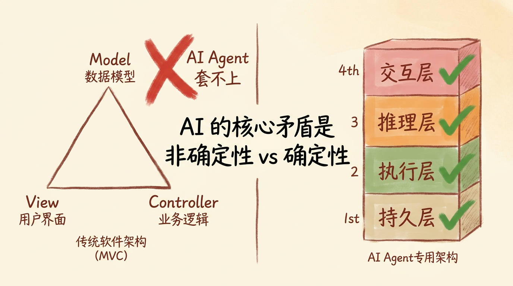
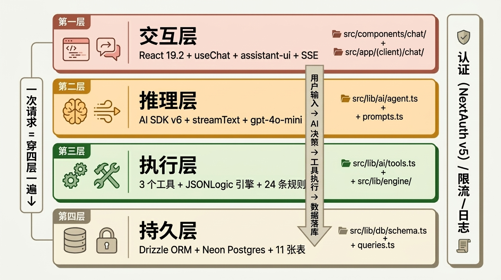
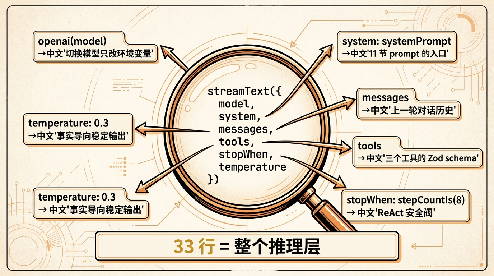
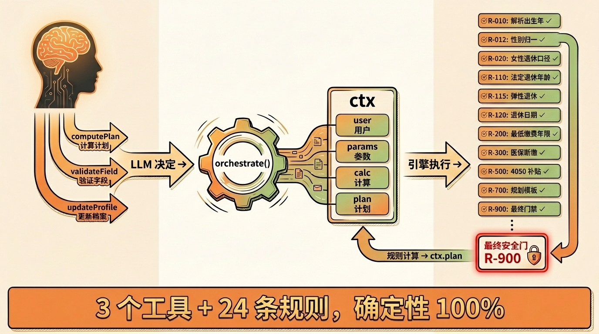
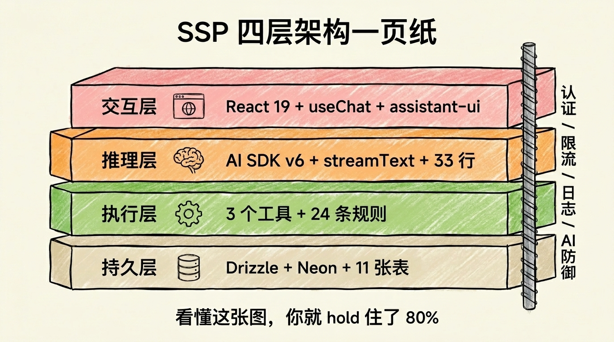

# 第 04 节 · SSP 四层架构鸟瞰：用一张图看懂整个系统


<!-- 图片说明（给图片代理）：
风格:手绘 + 信息图混搭,温暖配色(米黄底 + 棕红 + 草绿 + 橙色 + 暖灰)
内容:封面横幅,左侧画一个程序员盯着 8 个目录发呆,头顶冒问号
右侧是一栋四层小楼,每一层贴一个标签:
  顶层(交互层 / 粉色)——一个聊天气泡 + 用户头像
  二层(推理层 / 橙色)——一颗大脑 + 闪电
  三层(执行层 / 草绿)——一只手拿扳手 + 齿轮
  地下室(持久层 / 米色)——一个保险箱 + 数据库柱
楼前一条主路从顶到底贯穿四层,标"一次请求穿四层"
中文标题:"SSP 四层架构鸟瞰",字号清晰
-->

> **预计时长**：阅读 25 分钟 / 实战 30 分钟
> **前置知识**：[第 03 节《ReAct 循环》](./04-react-loop.md)、对 Next.js / TypeScript 有基础了解
> **本节代码**：`ssp-web` 仓库 `chapter-04` tag · 主要文件 `src/app/api/chat/route.ts`、`src/lib/ai/agent.ts`、`docs/architecture.md`

那天有个朋友在群里发了张截图：他刚 clone 了 `ssp-web`，VSCode 打开，左边树状目录展开 `src/`，里面齐刷刷 8 个文件夹——`app / components / data / lib / types`，再往里钻 `lib/ai`、`lib/db`、`lib/engine`、`lib/security`……他手停在那里，给我发了句话：「**Dennis，我应该从哪个文件开始看？**」

这是过去半年里我被问得最多的一句话。

不止他。我把 SSP 推到群里以后，前后有十几个人 clone 下来，第一反应都是先打开 `package.json` 看看用了什么库，然后打开 `src/app/page.tsx` 看看首页怎么写，然后……就懵了。**首页只有 147 行，但你看完它，根本不知道这个项目是怎么跑起来的。**

问题不在他们，问题在于：**一个能跑生产的 Agent 项目，不是按"页面"组织的，是按"层"组织的**。你拿"页面思维"去读，你永远看不懂。

这一节就干一件事——给你画一张 SSP 的"楼层平面图"。读完它你应该能做到：随便给你一个文件路径，比如 `src/lib/engine/scenario-builder.ts`，你立刻知道它属于哪一层、上面下面跟谁打交道、为什么要存在。

而且这套四层心智模型不是 SSP 专属——任何一个生产级 Tool-Calling Agent，**鸟瞰下来都是这四层**。学会它，你下次接手别人的 AI 项目，也不会迷路。

---

## 一、知识铺垫：为什么 AI 应用要分四层

写 Web 应用的时候，我们最熟悉的分层是 MVC（Model / View / Controller）。这套来自 1979 年的 Smalltalk-80 的模型，统治了 Web 开发 40 年。

但放到一个 AI Agent 项目上，MVC 立刻就别扭了。

### MVC 套不上 AI Agent

举个例子。SSP 里的 `src/lib/ai/agent.ts` 是个什么东西？它包了 LLM、注入了 system prompt、注册了三个工具、接住流式响应——

- 它不是 Model（它没有数据 schema）
- 它不是 View（它跟 UI 无关）
- 它也不是 Controller（它不路由 HTTP 请求，HTTP 入口在 `src/app/api/chat/route.ts`）

那它是什么？它是 **Agent 的大脑**——一个介于"决策"和"执行"之间的东西。这个角色在传统 Web 应用里**根本不存在**。

再看 `src/lib/engine/`。它跑 24 条决策规则、做政策计算、生成证据链——

- 它像 Service Layer？也不完全像。Service 是应用层的业务逻辑，但规则引擎是**确定性的、无状态的、政策即代码的**。它跟"用户行为"无关，跟"政策定义"有关。

MVC 套不上的根因是：**AI 应用的核心矛盾不是"数据/视图/控制"，而是"非确定性 / 确定性"的边界**。LLM 是非确定性的（同样的 prompt 跑两次输出可能不同），规则引擎是确定性的（同样的输入永远给同样的输出）。**这两类逻辑的边界画在哪里、谁调谁、谁信谁，决定了你的 Agent 能不能上生产**。

### 四层架构是怎么浮出水面的

SSP 在跑了几个版本之后，作者团队发现代码自然地分成了四个集合：

1. **跟用户打交道的代码**：React 组件、SSE 流、按钮、加载状态——你可以叫它 **交互层 / Interaction Layer**
2. **跟 LLM 打交道的代码**：system prompt、tool schema、streamText 调用——叫它 **推理层 / Reasoning Layer**
3. **跟规则、计算打交道的代码**：JSONLogic 引擎、24 条规则、补贴推荐器——叫它 **执行层 / Execution Layer**
4. **跟数据库打交道的代码**：Drizzle schema、queries、Neon 连接——叫它 **持久层 / Persistence Layer**

每一层有清晰的输入输出，层与层之间通过定义良好的接口通信。改其中一层不会震荡其他层——这是分层的核心价值。

> **划重点**：四层不是 SSP 发明的。Anthropic 2024 年的《Building Effective Agents》、OpenAI 2025 年的 Agents 设计指南、Vercel 的 AI SDK v6 文档，画出来的架构图本质都是这四层。**这是 AI Agent 项目的事实标准**，只是各家给的名字不一样。



<!-- 图片说明(给图片代理):
风格:手绘信息图,左右对照
内容:左侧 MVC 三角形(Model / View / Controller),旁边一段红色叉号:"AI Agent 套不上"
右侧四层小楼:Interaction / Reasoning / Execution / Persistence,每层贴一个绿色对勾
中间一句金句:"AI 的核心矛盾是 非确定性 vs 确定性"
温暖配色,中文标注
-->

---

## 二、核心讲解

### 2.1 四层架构总览图

先把整张图拿出来看一眼，再逐层拆解。



<!-- 图片说明(给图片代理):
风格:信息图(infographic),扁平专业风,温暖配色
内容:四个并列横向方块,从上到下:
  1. 交互层(粉色背景 #FDF6E3 + 棕红边):
     图标 = 浏览器 + 聊天气泡
     文字:React 19.2 + useChat + assistant-ui + SSE
     代码位置:src/components/chat/ + src/app/(client)/chat/
  2. 推理层(橙色背景 #FEF3DC + 金棕边):
     图标 = 大脑 + 流光
     文字:AI SDK v6 + streamText + gpt-4o-mini
     代码位置:src/lib/ai/agent.ts + prompts.ts
  3. 执行层(草绿背景 #F0F5EB + 深绿边):
     图标 = 齿轮 + 工具
     文字:3 个工具 + JSONLogic 引擎 + 24 条规则
     代码位置:src/lib/ai/tools.ts + src/lib/engine/
  4. 持久层(米色背景 #FFF8EE + 暖灰边):
     图标 = 数据库柱 + 锁
     文字:Drizzle ORM + Neon Postgres + 11 张表
     代码位置:src/lib/db/schema.ts + queries.ts
箭头从上往下贯穿:用户输入 → AI 决策 → 工具执行 → 数据落库
左侧标注:"一次请求 = 穿四层一遍"
右侧标注三个跨层组件:认证(NextAuth v5)、限流、日志
中文标注,字号清晰
-->

为了让你有"立体感"，我在图旁边补一张数字版的快速索引。这张表是后面 4.2-4.5 的总目录，看不懂没关系，先扫一眼有个概念。

| 层 | 一句话职责 | 主要代码 | 关键依赖 | LOC |
|---|---|---|---|---|
| **交互层** | 用户看到的一切 | `src/components/chat/` + `src/app/(client)/` | React 19.2 + AI SDK v6 + assistant-ui | ~2000 |
| **推理层** | LLM 大脑 + 决策调度 | `src/lib/ai/agent.ts` + `prompts.ts` + `tools.ts` | AI SDK v6 + OpenAI Provider | ~990 |
| **执行层** | 工具 + 规则引擎 | `src/lib/engine/` + `dsl/ssp_dsl_v1/rules/` | JSONLogic + Zod + 24 条 JSON 规则 | ~1500 |
| **持久层** | 数据落地 | `src/lib/db/` | Drizzle ORM + Neon Postgres + 11 张表 | ~700 |

> **看这里 →**：四层加起来约 5200 行 TypeScript（不含规则 JSON 和测试）。一个能服务真实用户的 Agent，本质就这么大。**别被 LangChain 的"数百页文档"吓到——你需要的代码量比你想象的少 10 倍。**

下面我们一层一层钻进去。

### 2.2 交互层 Interaction：让 AI 看起来像在跟你说话

打开浏览器访问 `/chat`，你看到的东西全部来自这一层。

**职责清单**：

- 渲染对话气泡、流式打字效果
- 把工具结果（JSON）变成可点击的 UI 卡片
- 维护"用户输入 / AI 回复 / 工具调用 / 工具结果"的消息状态机
- 通过 SSE 把后端推过来的 chunk 实时拼成画面
- 让用户点击快捷按钮时，把"普通工人"这种语义直接变成下一轮 user message

**核心组件**（来自 `src/components/chat/`，code-facts §8.1）：

| 文件 | 行数 | 关键职责 |
|---|---|---|
| `ChatPanel.tsx` | 528 | 主面板。整合 useChat + AssistantChatTransport + assistant-ui Primitives |
| `ToolResultCard.tsx` | 708 | 把 `computePlan` / `validateField` 工具结果渲染成场景对比 + 补贴推荐卡片 |
| `MessageBubble.tsx` | 156 | 旧版气泡（手写 markdown 解析），ChatPanel 已用 assistant-ui 替代 |
| `ChatInput.tsx` | 90 | 旧版输入框（含中文 IME 处理），ChatPanel 用 ComposerPrimitive 替代 |
| `ConversationList.tsx` | 249 | 左侧会话列表（删除/切换） |
| `conversation-runtime.ts` | 49 | fetch 包装：从响应头读 `x-conversation-id` |

**关键代码片段**（`src/components/chat/ChatPanel.tsx:354-390`，code-facts §8.1）：

```ts
// src/components/chat/ChatPanel.tsx:354-390(节选)
const transport = useMemo(() => new AssistantChatTransport({
  api: "/api/chat",
  fetch: createConversationTrackingFetch(handleConversationReady),
  prepareSendMessagesRequest: async (options) => ({
    ...options,
    body: { ...body, conversationId, sessionId, questions, userProfile: sessionProfile, planId },
  }),
}), [conversationId, handleConversationReady, planId, questions, sessionId, sessionProfile]);

const chat = useChat({ id: conversationId, transport, messages: initialMessages ?? [], onFinish });
const runtime = useAISDKRuntime(chat);
```

> **看这里 →**：`useChat` 是 AI SDK v6 React hook 的入口（包名 `@ai-sdk/react@^3.0.103`，code-facts §2）。它把"发消息→等流→拼 chunk→暴露 messages 数组给组件"这一整套 SSE 状态机封装成一个 hook。**没有它，你要写 800 行 fetch + ReadableStream + JSON.parse 的样板代码**。

**为什么用 assistant-ui 而不是自己撸？**

在 SSP 里我们最初的版本是手写的——有 `MessageBubble.tsx`（156 行）和 `ChatInput.tsx`（90 行）作为见证。后来切到 [`assistant-ui`](https://www.assistant-ui.com/)（包名 `@assistant-ui/react@^0.12.14`）——它提供了 `ThreadPrimitive` / `ComposerPrimitive` / `MessagePrimitive` 这套 headless primitives，自带键盘可访问性、流式光标、长对话虚拟滚动、SSR 兼容。**这些细节你自己写一遍要踩 20 个坑**。

assistant-ui 跟 useChat 是怎么对接的？看 `useAISDKRuntime(chat)`——它把 useChat 的 `messages` 数组适配成 assistant-ui 期望的 runtime 接口。两个生态在 `@assistant-ui/react-ai-sdk@^1.3.10` 这个胶水包里握手（code-facts §2）。

> **划重点**：交互层的核心矛盾是「**流式体验 vs 状态一致性**」。LLM 一个字一个字往外蹦，前端要让用户立刻看到字、同时正确处理 tool_call / tool_result 这些"半成品"消息块。这件事自己做巨复杂，**用 useChat + assistant-ui 是 2026 年的事实标准**。

### 2.3 推理层 Reasoning：Agent 的大脑

**这一层是整个 SSP 的灵魂，但它的代码量最少——只有 ~990 行**。

| 文件 | 行 | 关键导出 | 职责 |
|---|---|---|---|
| `src/lib/ai/agent.ts` | 80 | `createChatStream`、`ChatContext` | 包装 streamText，注入 system + tools |
| `src/lib/ai/prompts.ts` | 322 | `SYSTEM_PROMPT`、`buildContextPrompt` | System Prompt 全文 + 上下文拼接 |
| `src/lib/ai/tools.ts` | 537 | `tools`、`computePlanTool` 等 | 三个工具的 Zod schema 和 execute |
| `src/lib/ai/config.ts` | 51 | `getOpenAIConfig` | 读 OPENAI_URL/KEY/MODEL 环境变量 |

**核心调用结构**（code-facts §4.1，`src/lib/ai/agent.ts:47-79`）：

```ts
// src/lib/ai/agent.ts:47-79(完整逐行解读见第 03 节)
export function createChatStream(messages, context, onFinish) {
  // ... 取 OpenAI 配置 + 拼 SYSTEM_PROMPT + context
  return streamText({
    model: openai(model),
    system: systemPrompt,
    messages,
    providerOptions: { openai: { store: false } }, // 中转网关兼容
    tools,
    stopWhen: stepCountIs(8),    // 多步工具调用上限
    temperature: 0.3,            // 低温度,事实导向
    onFinish,
  });
}
```

> **看这里 →**：第 03 节我们已经详细讲过这段——`stopWhen: stepCountIs(8)` 是 ReAct 循环的硬阀门，`temperature: 0.3` 让推理稳定。这一节我们换个视角：**这 33 行代码，就是整个推理层的入口**。

**System Prompt 在哪？**——`src/lib/ai/prompts.ts:10-169`，导出常量 `SYSTEM_PROMPT`。中文，11 个 section，包括角色 / 8 条核心规则 / Tier 1/2/3 数据收集 / 结果格式 / 表达规范 / 关键字段识别 / 2025 政策要点 / 置信度标注 / 标准注意事项 / 模糊输入处理 / 超范围问题 / 多轮对话策略（code-facts §4.2）。

**8 条核心规则**（`prompts.ts:14-23`，原文）：

1. 绝不自行计算政策数字
2. 累积用户信息（合并新旧）
3. Tier 1 字段即刻计算
4. needs_agent=true 时追问
5. needs_agent=false 时展示结果
6. 诚实告知边界
7. 不收集敏感信息
8. 结构化记录用户信息（updateProfile 每轮一次）

这 8 条会在第 09 节《System Prompt 11 节分层设计法》里逐条展开。这一节你只需要知道——**推理层不只是"调 LLM"，它的实质是"用 prompt 把 LLM 调教成一个会按规则做决策的 Agent"**。

**模型选择**（code-facts §11.5 + R5 备注）：

```ts
// src/lib/ai/config.ts —— OPENAI_MODEL 环境变量决定
// 默认值:gpt-4o-mini
// 2026 R5 推荐:gpt-5.4-mini(性价比、tool calling 准确率明显更好)
```

> **划重点**：推理层是 SSP 里**最容易被换掉的一层**。把环境变量从 `gpt-4o-mini` 改成 `gpt-5.4-mini` 或 `claude-haiku-4.5`，整个项目继续跑，前后端不动一行代码。**这就是分层的力量**——下层的实现细节对上层透明。



<!-- 图片说明(给图片代理):
风格:信息图,中央放大镜效果
内容:中央一个圆形放大镜,框住 streamText({...}) 的代码块
四周辐射出 6 条线,每条线指向一个组件:
  - openai(model) → "切换模型只改环境变量"
  - system: systemPrompt → "11 节 prompt 的入口"
  - messages → "上一轮对话历史"
  - tools → "三个工具的 Zod schema"
  - stopWhen: stepCountIs(8) → "ReAct 安全阀"
  - temperature: 0.3 → "事实导向稳定输出"
底部一句话:"33 行 = 整个推理层"
中文,温暖配色
-->

### 2.4 执行层 Execution：工具调用 + 规则引擎

LLM 决定要调工具的那一刻，控制权就交给了执行层。这一层是 SSP 里**代码量最大、确定性最强**的一层。

**两个子模块**：

```
src/lib/ai/tools.ts        ← 3 个工具(LLM 看到的接口)
src/lib/engine/            ← 规则引擎(确定性计算的灵魂)
  ├─ orchestrator.ts       (239) ← 入口
  ├─ executor.ts           (80)  ← 单条规则执行
  ├─ actions.ts            (338) ← 6 种 action 处理
  ├─ json-logic.ts         (103) ← JSONLogic 求值
  ├─ builtins.ts           (230) ← 9 个内置函数
  ├─ scenario-builder.ts   (302) ← 场景对比
  ├─ subsidy-advisor.ts    (200) ← 补贴推荐
  └─ test-runner.ts        (283) ← 测试运行器
```

**3 个工具**（不是 4 个，code-facts §4.3）：

```ts
// src/lib/ai/tools.ts:322-326
export const tools = {
  computePlan: computePlanTool,        // 调规则引擎算社保方案
  validateField: validateFieldTool,    // 校验单字段格式
  updateProfile: updateProfileTool,    // 结构化提取用户信息
};
```

**为什么是 3 个不是 5 个不是 10 个？**

这是 SSP 走过弯路得到的教训。最早的版本有 7 个工具——`computeRetireDate` / `computePensionGap` / `computeMedicalGap` / `compute4050Subsidy` ……每个工具对应一组规则。结果 LLM 经常调错，调用顺序也乱。后来全部合并到 `computePlan` 里，让 LLM 只需要决定"我要不要算"，**怎么算交给规则引擎一次性吐出完整方案**。

合并后准确率明显提升，token 消耗也降了——因为 prompt 里再也不用解释"先调 A 再调 B"的流程。

> **划重点**：**工具数量是 Agent 设计的核心变量**。Anthropic《Building Effective Agents》明确建议「**工具集合保持在 3-5 个**」。SSP 是 3 个，刚好命中下限。第 13 节《三个工具的编排策略》会专门讲为什么。

**24 条规则**（不是 23/25，code-facts §5.4）：

按 `dsl/ssp_dsl_v1/rule_sets/rule_set_shanghai_plan_v1.json:6-31` 的执行顺序：

```
R-010 解析出生年(用 73 年表达)→ R-011 拼接生日 → R-012 标准化性别
→ R-020 女性退休口径 → R-110 查退休年龄表 → R-115 弹性退休
→ R-120 计算退休日期 → R-200 最低缴费年限 → R-210 养老缺口
→ R-220 医保终身待遇缺口 → R-300 医保断缴月数 → R-310 医保等待期
→ R-400 失业资格 → R-410 失业可领月数 → R-420 失业期医保
→ R-500/510 4050 补贴 → R-520/521 大龄岗位补贴
→ R-530 老失业人员养老过渡 → R-540 补贴互斥
→ R-600 缴费断档提醒 → R-700 规划模板装配 → R-900 最终安全门
```

> **看这里 →**:执行顺序由 **rule_set 的 rules 数组**决定（不是按 priority 字段）。priority 仅用于 Admin UI 排序。这是 code-facts §5 第 905 行强调过的"容易踩坑"点。

**JSONLogic 引擎是怎么跑的？**

引擎入口在 `src/lib/engine/orchestrator.ts:41-134`（code-facts §5.7）：

```ts
// src/lib/engine/orchestrator.ts:41-134(骨架,完整实现见第 15 节《JSONLogic 引擎实现》)
export async function orchestrate(input: OrchestratorInput): Promise<OrchestratorResult> {
  // 1. 并行加载:规则集 + 参数包(按 as_of_date 取生效版本)
  // 2. 构建上下文 ctx = { user(输入), params(政策), calc(中间), plan(输出) }
  // 3. 按 rule_set.rules 数组顺序逐条 executeRule(ruleDef, ctx)
  return { plan: ctx.plan, calc: ctx.calc, user: ctx.user, trace: allTrace /* ... */ };
}
```

整个引擎的工作模式可以一句话总结：**给一个 user 输入，按 rule_set 顺序跑 24 条规则，每条规则读 ctx 改 ctx，最终从 ctx.plan 取出方案**。

> **划重点**：`R-900-FINAL-GATE` 是最后一条规则，叫"最终安全门"。它的作用是检查关键字段是否齐全——少一个就把 `needs_agent` 设成 true，让上层 LLM 去追问。**这条规则保证了"宁愿不出方案，也不出错方案"**。这就是确定性引擎的优雅之处。

执行层的细节会在第 14-15 节《规则引擎 DSL》和《JSONLogic 引擎实现》两节完整展开。这一节你只要记住一句话——**LLM 是嘴，规则引擎是脑**。



<!-- 图片说明(给图片代理):
风格:信息图,左中右三栏
内容:
  左栏:LLM 头部 + 三个 tool_call 箭头(computePlan / validateField / updateProfile)
  中栏:orchestrate() 大齿轮,流入 ctx 数据结构(user/params/calc/plan)
  右栏:24 条规则纵向排列,每条小卡片(R-010 / R-011 / ... / R-900),
       R-900 用红色边框标注"最终安全门"
箭头从左到右:"LLM 决定 → 引擎执行 → 规则计算 → ctx.plan"
底部:"3 个工具 + 24 条规则,确定性 100%"
中文,温暖配色
-->

### 2.5 持久层 Persistence:让 Agent 不再健忘

**11 张表**（不是 6/8,code-facts §6.1）。Schema 定义在 `src/lib/db/schema.ts`,全部用 PostgreSQL,通过 Drizzle ORM 操作。

| 表 | 主键 | 关键字段 | 谁在用 |
|---|---|---|---|
| `rules` | serial | rule_id, decision_table (jsonb), version | 引擎加载规则 |
| `params` | serial | policy_pack_id, value (jsonb), rows (jsonb) | 引擎加载政策参数 |
| `policy_pack_versions` | serial | policy_pack_id, version, param_snapshot | 政策版本快照 |
| `rule_sets` | serial | rule_set_id, rules (jsonb 数组) | 引擎决定执行顺序 |
| `workflows` | serial | workflow_id, stages | 发布流水线 |
| `publishes` | serial | entity_type, from_stage, to_stage, diff | 发布历史审计 |
| `plans` | uuid | user_input, calc_result, plan_output, trace | 持久化计算结果 |
| `conversations` | uuid | session_id, messages (jsonb), user_profile | **核心**:对话历史 |
| `showcase_cases` | serial | case_uid, user_message, ai_response | 案例展示 |
| `cases` | serial | case_uid, transcript_text, is_regression | 真实案例库 |
| `tests` | serial | rule_id, input, expected, last_run_result | 单元测试 |

> **看这里 →**:这张表正好 **11 张**——`code-facts` §6.1 完整列出这 11 张(rules / params / policy_pack_versions / rule_sets / workflows / publishes / plans / conversations / showcase_cases / cases / tests)。**核心引擎只用前 8 张,`showcase_cases` / `cases` 是案例库,`tests` 给测试运行器用**。

**为什么是 11 张而不是 4 张？**

序章里我画过一张简化的"4 张表"图——`conversations / plans / rules / params`。那张是给读者快速理解架构看的。**真实生产里要做版本控制、发布审计、案例回归,表数量自然就长上来了**。这就是 demo 和生产的差距。

**关键代码:Drizzle 懒加载 Proxy**(code-facts §6.2):

```ts
// src/lib/db/index.ts(节选)
import { neon } from "@neondatabase/serverless";
import { drizzle, type NeonHttpDatabase } from "drizzle-orm/neon-http";
import * as schema from "./schema";

let _db: NeonHttpDatabase<typeof schema> | null = null;
function getInstance() {
  if (!_db) _db = drizzle(neon(process.env.DATABASE_URL!), { schema });
  return _db;
}
export const db = new Proxy({} as NeonHttpDatabase<typeof schema>, {
  get(_t, prop) {
    const v = getInstance()[prop as keyof typeof _db];
    return typeof v === "function" ? v.bind(getInstance()) : v;
  },
});
```

> **看这里 →**:这套 Proxy 设计是为了 **Vercel Serverless 冷启动**优化——只有第一次访问 `db.select(...)` 时才建数据库连接,如果整个请求没碰数据库,就不连。**Serverless 时代的 ORM 必须是懒加载的**,否则每个空请求都建一次连,数据库连接数立刻爆。

**为什么用 Neon + Drizzle 而不是 Supabase + Prisma?**

第 05 节(下一节)会专门讲选型。这里只给一个核心理由:**HTTP 模式无连接池**。Neon 的 `@neondatabase/serverless` driver 走 HTTP,每次请求独立,无需池化——这是 Serverless 时代最优雅的解。

**会话持久化的 8 个 CRUD 函数**(code-facts §6.3):

`createConversation` / `getConversation` / `updateConversation` / `listConversations` / `deleteConversation` 等,在 `src/lib/db/queries.ts:435-513`。会话 CRUD 是整个持久层的核心——**它把"对话状态"变成了可恢复、可追溯、可分析的数据**。第 18 节《Agent 记忆系统》会展开。

### 2.6 数据流:一次完整请求穿四层

光看分层还不够直观。我们跟踪一次真实请求,看四层是怎么串起来的。

**用户输入**:"我是女的,1975 年 8 月出生,上海户籍,养老保险交了 18 年,灵活就业。"

```
[交互层] ChatPanel.tsx → useChat.sendMessage() → AssistantChatTransport.fetch() → POST /api/chat
   ↓
[API 路由] route.ts:81-294 → 解析校验 → ensureAnonymousSession → checkRateLimit(30/分) → 长度门禁(MAX_MESSAGES=40) → 取/建 conversation[→持久层] → convertToModelMessages → createChatStream[→推理层]
   ↓
[推理层] agent.ts:47-79 streamText({ system, tools, stopWhen: stepCountIs(8) }) → LLM 决定:调 updateProfile + computePlan
   ↓
[执行层] tools.ts:322-326 → updateProfile.execute → computePlan.execute → orchestrate()跑24条规则 → buildScenarios()构3场景 → adviseSubsidies()推4050 → savePlan()[→持久层]
   ↓
[推理层] LLM 拿到工具结果(Observation) → 据 needs_agent=true 生成追问 + 把 questions 渲成快捷按钮
   ↓
[API 路由] toUIMessageStreamResponse() 返回 SSE → onFinish:void updateConversation()[→持久层异步写入,不阻塞]
   ↓
[交互层] useChat 解析 SSE → assistant-ui Primitives 渲染 → ToolResultCard 渲染场景卡片 → 浏览器显示打字流 + 按钮
```

**这一次请求里发生了什么**:

- **9 个步骤**穿越 4 层
- **2 次 LLM 调用**(一次决定调工具,一次根据工具结果生成回复)
- **2 次工具调用**(updateProfile + computePlan)
- **24 条规则**的引擎执行
- **2 次数据库写**(conversations 异步、plans 同步)
- **1 条 SSE 流**贯穿整个生命周期

这就是「**用户跟 AI 聊天 → AI 调工具去算 → 规则引擎出结果 → AI 翻译成人话**」的全部细节展开。**记住这张图,你就 hold 住了 80% 的 SSP**。

> **划重点**:`onFinish: void updateConversation(...)` 这个 `void` 是故意的——它的作用是"启动数据库写入但不等待"。**如果改成 `await`,用户得等数据库完成才能看到第一个流式字**。这是 SSP 早期踩过的坑,详细会在第 19 节《调试与可观测》里复盘。

### 2.7 跨层公共组件:认证 / 限流 / 日志 / 安全

四层架构画完了,但有些组件**横跨所有层**——它们不属于某一层,而是渗透在每一层里。这些是生产 Agent 的"地基钢筋"。

**认证(NextAuth v5)**:

```ts
// src/lib/auth.ts:8-22 + src/proxy.ts(code-facts §7.1-7.2)
// ⚠️ 注意:src/proxy.ts 实际是 Next.js middleware,文件名是 proxy 但功能是中间件
// 这是 Next.js 16 把 middleware.ts 改名 proxy.ts 的结果
export const { auth, signIn, signOut, handlers } = NextAuth({
  providers: [Credentials({ /* 单管理员 + bcrypt */ })],
  session: { strategy: "jwt" },
  pages: { signIn: "/admin/login" },
});
```

C 端用户**不登录**,只用 `ssp-anon-session` cookie 区分(code-facts §7.3)。Admin 后台用账号密码——这是 SSP 双轨制设计,详见第 08 节《认证与多用户》。

**限流(Rate Limiting)**:

```ts
// src/lib/security/rate-limit.ts(code-facts §7.4)
// 进程内 in-memory 桶,chat: 30 次/分钟,plan: 12 次/分钟
const result = checkRateLimit('chat:' + clientIp, {
  limit: CHAT_RATE_LIMIT,        // 30
  windowMs: CHAT_RATE_WINDOW_MS, // 60_000
});
```

> **划重点**:这是 in-memory 限流,**重启就清空,多实例不共享**。SSP demo 阶段够用,生产环境上 100K MAU 必须换 Redis 或 Upstash。第 20 节《安全护栏》专门讲。

**日志(结构化日志)**:

```ts
// src/lib/logging.ts → JSON stdout → Vercel Functions 自动收集
logger.warn("chat.persist_finish_failed", { conversationId, err });
```

每次请求一个 `request_id` 贯穿四层日志,出错时可以一键拉出全链路 trace(code-facts §13)。

**安全声明**(System Prompt 第 7 条 + 数据 schema):

- **不收集 PII**——姓名、身份证、手机号永远不存(code-facts §7.5)
- **JSONB 存对话**——非 PII 结构化字段(gender / birth_year / contrib_months 等)
- **temperature: 0.3**——降低 LLM 自由发挥空间
- **stopWhen: stepCountIs(8)**——防止无限循环烧钱

这四条加起来叫"AI 层防御",是第 20 节的主题。

> **划重点**:**横切关注点(cross-cutting concerns)是分层架构最容易被忽略的部分**。在 SSP 里它们是显式的——认证 / 限流 / 日志各有专门的目录。一个工程化的 Agent 项目,**这四样必须从第一天就设计进去**,而不是上线后再补。

---

## 三、举一反三:换个领域怎么套四层

四层不是社保专属。**任何 Tool-Calling Agent 都能套这个架子**,变化的只是每一层的具体技术选择。

**场景 A:法律咨询助手**

```
交互层 → React 19 + useChat + assistant-ui(不变)
推理层 → AI SDK v6 + Claude Sonnet 4.6(法律文本对长上下文要求高)
执行层 → 3 个工具:checkClause / searchPrecedent / draftMemo
        + 法条 RAG 引擎(替代规则引擎)
持久层 → Neon Postgres + pgvector(新增向量索引)
```

法律咨询的核心特点是**幻觉容忍度极低**。所以执行层的"规则引擎"换成"法条 RAG + 引用校验",每条法条引用必须有出处链接。架构骨架完全相同,只是把"24 条 JSONLogic 规则"换成"法条向量库 + 重排器"。

**场景 B:健身规划助手**

```
交互层 → React 19 + useChat + assistant-ui(+ 拍照上传组件)
推理层 → AI SDK v6 + gpt-5.4-mini(任务简单,性价比最高)
执行层 → 4 个工具:analyzePose / generatePlan / trackProgress / suggestMeal
        + 训练计划生成器(简化的规则引擎)
持久层 → Neon Postgres + Apple Health OAuth 同步
```

健身助手的特点是**多模态 + 设备数据**。交互层多一个"拍照上传"组件,推理层加上 GPT-5 视觉模型,持久层多一个 OAuth 同步流。**架构骨架不变**。

**场景 C:报税助手**

```
交互层 → 同上
推理层 → 分级路由:意图用 gpt-5.4-nano,主力 gpt-5.4-mini,难报税升级 GPT-5.4
执行层 → extractIncomeData / computeTax / validateDeduction
        + 80 条税务规则(JSONLogic 沿用)
持久层 → Neon Postgres + 时序索引(BRIN)处理多期数据
```

报税场景甚至**整套 JSONLogic 引擎都能直接搬过来**——把 24 条社保规则换成 80 条税务规则就行。这就是 DSL 化规则引擎的威力。

**通用结论**:

1. **交互层换得最少**——React + useChat 几乎适配所有 chat 类 Agent
2. **推理层换模型**——任务复杂度决定模型档次
3. **执行层换工具**——领域决定工具集和 DSL
4. **持久层换 schema**——数据结构跟领域强相关

> **划重点**:学完 SSP 的四层架构,你换到任何 Tool-Calling Agent 项目,**底座一行不改**。差别只在每层的具体技术选择和业务规则。这就是分层架构最大的价值——**把"通用能力"和"领域知识"解耦**。

---

## 四、小结

四层架构不是教科书概念,是 SSP 跑出来的真实分层。回顾一下:

- **交互层**:React 19 + useChat + assistant-ui,把流式 AI 变成可点击的对话界面
- **推理层**:AI SDK v6 + streamText + gpt-4o-mini(R5 推荐 gpt-5.4-mini),33 行驱动整个 Agent
- **执行层**:3 个工具 + JSONLogic 引擎 + 24 条规则,确定性 100%,绝不让 LLM 算数字
- **持久层**:Drizzle ORM + Neon Postgres + 11 张表,Serverless 友好
- **跨层钢筋**:NextAuth v5 + 限流 + 结构化日志 + AI 防御四件套
- **数据流**:一次请求 9 步穿四层,2 次 LLM 调用 + 2 次工具调用 + 2 次数据库写 + 1 条 SSE 流



<!-- 图片说明(给图片代理):
风格:手绘风格小结卡片,温暖配色
内容:标题"SSP 四层架构一页纸"
四个手绘方块纵向排列(从上到下,模拟楼层):
  1. 交互层(粉色):图标 = 浏览器,文字"React 19 + useChat + assistant-ui"
  2. 推理层(橙色):图标 = 大脑,文字"AI SDK v6 + streamText + 33 行"
  3. 执行层(草绿):图标 = 齿轮,文字"3 个工具 + 24 条规则"
  4. 持久层(米色):图标 = 数据库,文字"Drizzle + Neon + 11 张表"
右侧一根横切的钢筋,标注"认证 / 限流 / 日志 / AI 防御"贯穿四层
底部金句:"看懂这张图,你就 hold 住了 80%"
中文,可爱风格
-->

**核心要点回顾**:

- ✅ MVC 套不上 AI Agent,因为核心矛盾是「非确定性 vs 确定性」
- ✅ 四层是事实标准——Anthropic / OpenAI / Vercel 文档画出来都是这四层
- ✅ SSP 全栈约 5200 行 TypeScript,**比你想的少 10 倍**
- ✅ 推理层最薄(990 行)、执行层最厚(1500 行)——确定性逻辑天然代码量大
- ✅ 跨层公共组件(认证 / 限流 / 日志 / 安全)必须从第一天设计进去
- ✅ 一次请求穿四层 9 步走,记住这张图就够用

下一节我们要把这套四层架构落到具体技术栈——**2026 年起一个 AI Agent 项目,每一层该选什么、为什么**。

---

## 思考题

1. **【开放题】**:SSP 选了"4 层"。换两种思路想一想:
   - 如果合并执行层 + 持久层,变成"3 层"会怎样?(提示:工具的 execute 直接读写数据库会发生什么?)
   - 如果把"安全防御"独立成第 5 层会怎样?(提示:跨层关注点 vs 独立分层的边界在哪?)
   说说你的判断,以及对你正在做的项目的启发。

2. **【动手题】**:clone `ssp-web` 仓库到本地,在 `src/` 下面找出本节提到的 4 层各自对应的目录和文件。然后**画一张你自己版本的架构图**(白板 / draw.io / Figma / 手画都行),要求:
   - 每一层至少标 2 个具体文件路径(含行数)
   - 画出 3 条贯穿四层的请求流(对比一下 §2.6 那张)
   - 把跨层组件画成"横切线"
   - **验收**:把图发出来,每一层都能解释为什么这些文件归这一层,而不是别的层。

3. **【选做】**:把 SSP 改造成"3 层架构"——**把执行层和持久层合并**(让 `computePlan.execute` 直接调用 Drizzle queries)。完成后回答:
   - 哪些复杂度被合并了?
   - 哪些复杂度被转移到了其他层?
   - 你愿意接受这个 trade-off 吗,为什么?
   **预期发现**:层数减少不一定代码减少,可能只是把复杂度换了个地方。这就是分层的本质——**用复杂度的分布,换可维护性的清晰**。

---

## 面试题

**Q1.【基础】【主题：Agent 架构设计】** 为什么传统 MVC 套不上 AI Agent？SSP 的四层各自负责什么？
<details><summary>参考解答</summary>

MVC 的核心矛盾是"数据 / 视图 / 控制"，而 AI Agent 的核心矛盾是**"非确定性 vs 确定性"的边界**：LLM 同一输入两次输出可能不同（非确定性），规则引擎同一输入永远同一输出（确定性）。`agent.ts` 既不是 Model（无 schema）、不是 View（与 UI 无关）、也不是 Controller（不路由 HTTP），它是"Agent 的大脑"——这个角色 MVC 里根本不存在。

SSP 四层：

- **交互层**：React 19 + useChat + assistant-ui + SSE，把流式 AI 变成可点击界面。
- **推理层**：AI SDK v6 `streamText` + System Prompt + 工具注册，LLM 决策调度。
- **执行层**：3 个工具 + JSONLogic 引擎 + 24 条规则，确定性计算。
- **持久层**：Drizzle ORM + Neon Postgres，会话 / 方案落库。

</details>

**Q2.【进阶】【主题：Agent 架构设计】** 为什么说"推理层是最容易被换掉的一层"？这体现了分层的什么价值？
<details><summary>参考解答</summary>

因为推理层的实现细节（用哪个模型）对上下层透明：把 `OPENAI_MODEL` 环境变量从一个模型换成另一个（如换成性价比更好的小模型），整个项目继续跑，前后端、执行层、持久层都不动一行代码。

这体现分层的核心价值——**下层实现细节对上层透明、关注点分离**。每层有清晰的输入输出与接口，改一层不震荡其他层。这也是为什么"通用能力"（四层骨架）和"领域知识"（工具集 + 规则）能解耦：换个领域（法律、报税、健身），交互层几乎不动，只换执行层的工具与 DSL、持久层的 schema。

</details>

**Q3.【深挖】【主题：Agent 架构设计】** SSP 的执行层把 LLM 和规则引擎分开，让 LLM"绝不自行计算政策数字"。这个边界为什么重要？`R-900-FINAL-GATE` 在其中起什么作用？
<details><summary>参考解答</summary>

边界重要性：LLM 是非确定性的，让它算退休年龄、补缴月数这类**对错可验证、容不得幻觉**的数字，风险极高。SSP 的设计是"LLM 是嘴、规则引擎是脑"——LLM 只负责理解输入、判断信息够不够、决定调哪个工具（非确定性的调度），真正的计算交给 24 条 JSONLogic 规则的确定性引擎。这正是"规划/执行分离"思想在单 Agent 内的体现：LLM 规划调度，引擎执行计算。

`R-900-FINAL-GATE` 是规则链最后一条"最终安全门"：它检查关键字段是否齐全，少一个就把 `needs_agent` 设为 `true`，让上层 LLM 去追问，而不是带着缺失字段硬出方案。它保证了"宁愿不出方案，也不出错方案"——把"是否有足够信息作答"也变成一条确定性规则，而不是赌 LLM 的自觉。

</details>

---

## 延伸阅读

- ssp-web 内部文档:[`docs/architecture.md`](https://github.com/jiji262/ssp-web/blob/main/docs/architecture.md)——12 张 mermaid 图,本节四层图的真理来源
- Anthropic 工程博客:[Building Effective Agents (2024.12)](https://www.anthropic.com/engineering/building-effective-agents)——单 Agent 模式 + 工具集合大小的官方建议
- OpenAI Cookbook:[A Practical Guide to Building Agents (2025)](https://cookbook.openai.com/examples/agents_sdk/agents_sdk_practical_guide)——Agents SDK 视角下的分层实践
- Vercel AI SDK v6 文档:[Foundations - Agents](https://ai-sdk.dev/docs/foundations/agents)——streamText 的多步循环与工具协议
- 论文:[Voyager: An Open-Ended Embodied Agent with LLMs](https://arxiv.org/abs/2305.16291)(Wang et al., 2023)——分层 Agent 在具身智能中的早期工作

---

[← 上一节:第 03 节 ReAct 循环](./04-react-loop.md) · [📚 目录](./README.md) · [下一节:第 05 节 2026 年 AI 全栈技术栈选型逻辑 →](./06-tech-stack-2026.md)
