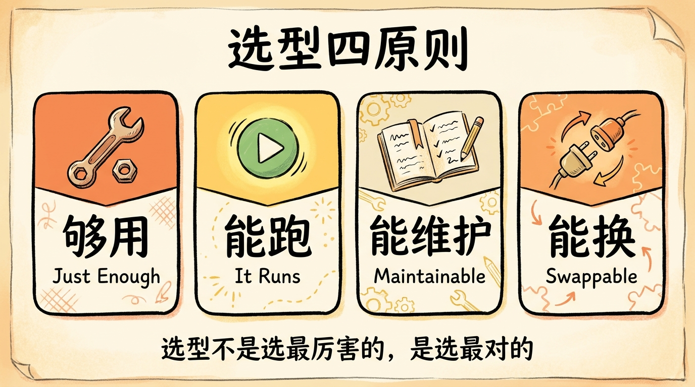
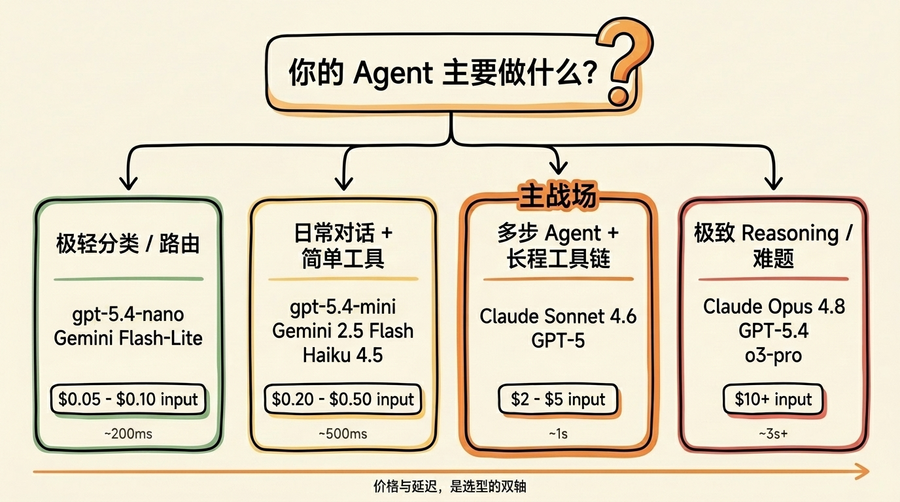
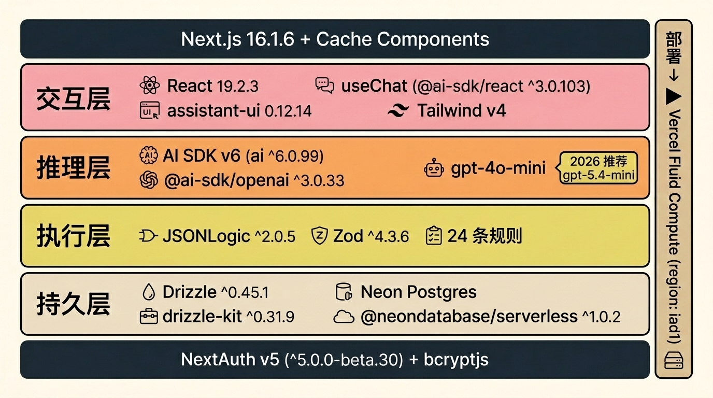
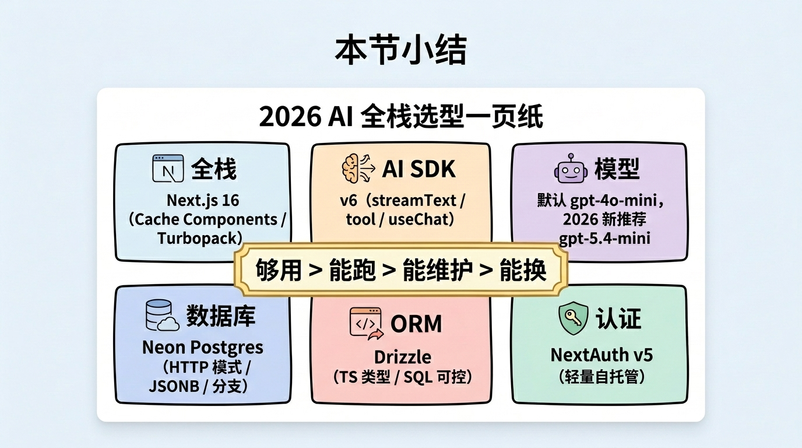

# 第 05 节 · 2026 年 AI 全栈技术栈选型逻辑


> **预计时长**：阅读 30 分钟 / 实战 60 分钟
> **前置知识**：[第 04 节《SSP 四层架构鸟瞰》](./05-four-layer-architecture.md)、对 Next.js / Node.js 有基础了解
> **本节代码**：`ssp-web` 仓库 `chapter-05` tag · 主要文件 `package.json`、`next.config.ts`、`vercel.json`

那天在群里有人问我："Dennis，我下个月要起一个新 Agent 项目，做企业内部的合同审核助手。**LangChain 还是 AI SDK？**Postgres 还是 Mongo？模型用 GPT-5 还是 Claude？前端要不要上 assistant-ui？"

她一口气问了五个问题，每一个都是把开发周期从两周拖到两个月的那种。

我没立刻回。我反问她：「你这个 Agent 一期要多少个工具？」

「三个吧，分类、抽条款、对比模板。」

「单日预计调用量？」

「内部用，**最多每天几百次**。」

「OK，那就别想太多。AI SDK + Next.js + Neon Postgres + Drizzle + gpt-4o-mini，三天起跑，账单不到 30 美元。模型上线一个月再换。」

她将信将疑地接受了。三周后她跟我说："要不是你拦了，我估计现在还在 LangChain 的 AgentExecutor 里调流式 callback。"

这一节就讲一件事：**2026 年起一个 AI Agent 全栈项目，每一层该选什么、为什么。**不讲所有可能性，只讲在"够用、能跑、能维护、能换"四个标准下的最优解。

---

## 一、知识铺垫：选型四原则

技术选型最容易翻车的姿势，是把它当作"选最厉害的"。但实际上，**对一个还没上线的 Agent 项目来说，"最厉害"几乎等于"最贵"+"最难调"+"半年后没人维护"**。

我们在 SSP 项目上摸出来四个原则，每次新项目都会用它过一遍清单。



<!-- 图片说明（给图片代理）：
风格：手绘风格信息图
内容：四个并排的卡通方块，每块一句话
  1. 够用：图标 = 一把刚好合适的扳手，文字"Just Enough"
  2. 能跑：图标 = 一个绿色的运行按钮，文字"It Runs"
  3. 能维护：图标 = 一本翻开的笔记本，文字"Maintainable"
  4. 能换：图标 = 一个插拔的接口，文字"Swappable"
底部：一行小字"选型不是选最厉害的，是选最对的"
-->

**原则一：够用就好**——你不需要一个能服务一亿用户的架构来跑前 100 个用户。Vercel Hobby 计划免费就够撑前 1 万次对话。

**原则二：能跑起来**——选型完，第一周必须能 demo。如果一个框架的 quickstart 都跑不通，再多 GitHub Star 也是负累。

**原则三：能维护**——半年后如果这个项目要由别人接手，他能不能在两小时内看懂 `agent.ts` 的 80 行代码？能，就选；不能，就放弃。

**原则四：能换**——每一层都要可拆卸。模型今天用 gpt-4o-mini，三个月后想切 Claude Sonnet 4.6，不应该让你重写一半代码。

> **划重点**：选型四原则的优先级是从上到下的。够用 > 能跑 > 能维护 > 能换。"能换"是兜底，不是出发点——为了"能换"过度抽象，反而违反了前三条。

---

## 二、核心讲解

### 2.1 全栈框架：Next.js 16 是 2026 年的默认值

先把候选名单摆出来：

| 框架 | 上手成本 | AI 集成 | 部署 | 心智模型 | 推荐 |
|---|---|---|---|---|---|
| **Next.js 16** | 中 | ★★★★★ | Vercel 一键 | App Router + RSC | ✅ 默认 |
| Remix / React Router 7 | 中 | ★★★ | 自己接 | Loaders + Actions | 偏 SSR 数据流 |
| SvelteKit | 低 | ★★★ | Vercel/自托管 | Stores + 编译时 | 单人快速 |
| Astro | 低 | ★★ | 静态优先 | Islands | 偏内容站 |

**为什么是 Next.js 16？**

第一，**AI SDK 原生支持**。Vercel 同时维护 Next.js 和 AI SDK，`streamText` 的 `toUIMessageStreamResponse()` 直接返回标准 Web `Response`，App Router 的 Route Handler 接住即可。这种"亲生孩子"的契合度，别的框架短期赶不上。

第二，**Cache Components 心智反转**。Next.js 14/15 的隐式缓存让无数人踩过坑——你以为是动态的，实际被默默缓存了 5 分钟，AI 回复还是上一轮的。Next.js 16 把这套推倒重来：默认全部是请求时执行，**要缓存必须显式 `'use cache'`**。这对 AI 应用是天大的好事——你的 `/api/chat` 路由再也不会被意外缓存。

```ts
// next.config.ts —— 启用 Cache Components
import type { NextConfig } from 'next'

const nextConfig: NextConfig = {
  cacheComponents: true,
}

export default nextConfig
```

`'use cache'` 配合 `cacheLife('hours')` 和 `cacheTag('user-${id}')`，让你精准控制"哪些数据可缓存、缓存多久、何时失效"——用户档案缓存 1 小时，规则定义缓存 1 天，AI 流式回复一秒都不缓存。

第三，**Turbopack 默认开启**。`next dev` 的 Fast Refresh 比 Webpack 快 5-10 倍，`next build` 快 2-5 倍。SSP 的全量构建从 38 秒降到 11 秒。

第四，**Fluid Compute** 是 Vercel 2025 年推出的新计算模型，2025-04-23 起新项目默认开启，专为 AI workload 优化——一个函数实例支持多并发，把"流式等待 LLM 输出"的空闲时间利用起来。Hobby 计划单函数最大执行 5 分钟（Pro 计划 13 分钟），覆盖大多数 Agent 多轮对话场景。

> **小提醒**：Next.js 16 把 `middleware.ts` 重命名为 `proxy.ts`，但 `proxy.ts` 强制跑 Node.js runtime（不可改 Edge）。如果项目里需要 Edge runtime 的轻量中间件，目前还得用 deprecated 的 `middleware.ts`——但官方说"会在未来版本删掉"。SSP 的 `src/proxy.ts` 实际就是 Next.js middleware（文件名误导，但功能是中间件），里面是 NextAuth 的鉴权逻辑。

### 2.2 AI SDK 选型：v6 是新项目唯一答案

候选三选一：

| 方案 | 抽象层级 | 流式支持 | TypeScript 友好 | 学习成本 | 推荐 |
|---|---|---|---|---|---|
| **AI SDK v6** | 中（streamText / tool / useChat 三件套） | 一等公民 | ★★★★★ | 半天 | ✅ 默认 |
| LangChain.js | 高（Chain/Agent/Runnable 三层） | 历史痛点 | ★★★ | 一周 | 复杂编排再考虑 |
| OpenAI SDK 直调 | 低（自己撸协议） | 自己实现 SSE | ★★★★ | 调通 800 行 | 教学 / 实验 |

**为什么是 AI SDK v6？**

我在序章和第 04 节都提过 SSP 推理层只有 80 行。这不是夸张——`src/lib/ai/agent.ts` 一共就这么多。把 `createChatStream` 函数从 v6 的官方文档里抄一份，改三个参数，就能跑。

```ts
// src/lib/ai/agent.ts:47-79（节选）
export function createChatStream(
  messages: ModelMessage[],
  context?: ChatContext,
  onFinish?: (result: { text: string }) => void | Promise<void>,
) {
  const { apiKey, baseURL, model } = getOpenAIConfig();
  const openai = createOpenAI({ apiKey, baseURL });

  return streamText({
    model: openai(model),
    system: systemPrompt,
    messages,
    providerOptions: { openai: { store: false } },
    tools,
    stopWhen: stepCountIs(8),
    temperature: 0.3,
    onFinish,
  });
}
```

这 20 行核心代码，背后帮你处理了什么？

- **工具调用协议**：LLM 输出 `tool_call` JSON → SDK 自动路由到 `execute` 函数 → 把结果格式化喂回 LLM
- **多步循环**：`stopWhen: stepCountIs(8)` 表示最多 8 步，工具结果自动喂回模型让它决定下一步
- **SSE 流式**：`toUIMessageStreamResponse()` 一行代码生成符合 v6 协议的 SSE 流
- **错误恢复**：流被中断时 `onError` 回调能拦截并返回业务文案

> **划重点**：v6 把 Agent 抽象升级成一等公民——`ToolLoopAgent` 和 `createAgentUIStreamResponse` 进入主 API。但对 SSP 这种"工具调用 + 多步推理"的场景，**`streamText` 已经够了**。`ToolLoopAgent` 适合"必须调某个 done 工具才结束"的强结构化 Agent，简单场景反而绕。

**和 v5 / v4 的关键差异**（迁移时必看）：

| 项 | v4 | v5 | v6 |
|---|---|---|---|
| 多步参数 | `maxSteps` | `stopWhen` 引入 | `stopWhen: stepCountIs(N)`（**默认 1，必须显式开**）|
| Tool 入参 | `parameters` | `inputSchema` | `inputSchema`（v4 写法 v6 不识别）|
| 结构化输出 | `generateObject` | 同上 | **deprecated**，改 `streamText({ output: Output.object(...) })` |
| 消息转换 | 同步 | 同 | **`convertToModelMessages` 改为 async** |
| OpenAI 默认 API | Chat Completions | 同 | **Responses API**（要回到旧 API 用 `openai.chat()`）|

LangChain.js 不是不能用，是"杀鸡用牛刀"。它的核心价值在 RAG pipeline、复杂 Agent 编排、多 Agent 协作；而你的第一个 Agent 项目大概率只需要"调一个工具、拿结果、回复用户"，AI SDK v6 在这个尺度上完胜。

OpenAI SDK 直调？教学场景值得做一次（第 11 节会从 0 撸一个最小 SSE 解析器），但生产项目不要——光是流式工具调用的状态机，自己写至少 800 行，还要持续跟 OpenAI 协议升级。

### 2.3 模型选型：默认 gpt-4o-mini，但要知道 2026 年还有更好的选择

SSP 现在线上跑的是 `gpt-4o-mini`。这是当年（2024）选的，2026 年 Q1 看，**它依然能用，但不再是新项目的最优选**。

来看一组 2026-04 的真实价位（USD per million tokens）：

| 模型 | Input | Cached input | Output | 上下文 | 状态 |
|---|---|---|---|---|---|
| `gpt-5.4` | 2.50 | 0.25 | 15.00 | 400K | GA |
| `gpt-5` | 1.25 | 0.125 | 10.00 | 400K | GA |
| **`gpt-5.4-mini`** | **0.75** | **0.075** | **4.50** | **~272K+** | **GA** |
| `gpt-5.4-nano` | 0.20 | 0.02 | 1.25 | ~272K+ | GA |
| `gpt-4o-mini` | 0.15 | 0.075 | 0.60 | 128K | GA（**未公布退役**） |
| Claude Sonnet 4.6 | 3.00 | 0.30 | 15.00 | 1M | GA |
| Claude Haiku 4.5 | 1.00 | 0.10 | 5.00 | 200K | GA |
| Gemini 2.5 Flash | 0.30 | 0.03 | 2.50 | 1M | GA |
| DeepSeek V4-Flash | 0.14 | 0.028 | 0.28 | 1M | GA |

来源：OpenAI / Anthropic / Google / DeepSeek 官方页面，截至 **2026-04-25** 抓取。



<!-- 图片说明（给图片代理）：
风格：信息图（infographic），扁平专业风
内容：决策树形态
顶部一个问题：「你的 Agent 主要做什么？」
分四个分支：
1. 极轻分类 / 路由 → gpt-5.4-nano / Gemini Flash-Lite（$0.10-$0.20 input）
2. 日常对话 + 简单工具 → gpt-5.4-mini / Gemini 2.5 Flash / Haiku 4.5
3. 多步 Agent + 长程工具链（**主战场**） → Claude Sonnet 4.6 / GPT-5
4. 极致 Reasoning / 难题 → Claude Opus 4.8 / GPT-5.4 / o3-pro
每个分支末端给出价格区间和延迟范围
中文标注，字号清晰
-->

**SSP 的选型逻辑**：

任务类型是「**结构化信息提取 + 工具调用决策**」——从"我是 73 年女性"抽出 `birth_year=1973, gender=female`，决定调 `computePlan` 还是先 `updateProfile`。这类任务 gpt-4o-mini 和 GPT-5 差距不大，但成本差 8 倍。今天从零起一个 SSP，会怎么选？

- **首选**：`gpt-5.4-mini`。性价比之王，输入 $0.75 / 输出 $4.50，比 gpt-4o-mini 单价高一截但质量提升明显，特别是 reasoning 和 tool calling。
- **备选**：Claude Haiku 4.5。若对 prompt caching 命中率敏感（System Prompt + 工具 schema 长期不变），Haiku 4.5 的 cache 读价 $0.10/M 比 gpt-5.4-mini 的 $0.075 略高，按场景权衡。
- **不再选**：纯新项目用 gpt-4o-mini——它能跑，但 gpt-5.4-mini 工具调用准确率明显更好。
- **不要选**：Assistants API（已 sunset，2026 上半年下线）、纯 Chat Completions（OpenAI 推 Responses API + MCP）。

> **小提醒**：模型选型不是"选一个"，是"组合一队"。SSP 一期就一个模型，简单。但生产环境的成熟做法是分级路由——意图识别用 gpt-5.4-nano，主力 Agent 用 gpt-5.4-mini，难题升级到 Sonnet 4.6。这个套路我们在第 21 节《成本控制》里完整展开。

**Tool Calling 准确率横评**（数据来源：BFCL v3 / τ-bench / TAU2-Bench，2026-04 更新）：

- 单点工具调用：GPT-5.4 接近第一，开源王者 GLM-5.1（76.7%）
- 多步真实工作流：Claude Sonnet 4.6 最强（airline 0.700 / retail 0.862）
- 长程自主操作：Claude Opus = 72.7%（OSWorld）
- 跨 MCP 协调：Gemini 3.1 Pro = 69.2%（MCP-Atlas 第一）

**结论**：单点 tool call → GPT-5.4；长程多步 Agent → Claude Sonnet 4.6；跨 MCP 协调 → Gemini 3.1 Pro。SSP 属"长程多步"档，理想模型是 Sonnet 4.6，**但价格也高**——output $15/M vs gpt-5.4-mini $4.50/M，差约 3.3 倍，值不值看产品对质量的容忍度（成本细账见第 21 节）。

### 2.4 数据库选型：Neon Postgres 是 Serverless 时代的最优解

候选清单：

| 数据库 | Serverless | 类型 | 价格起点 | 与 Vercel 集成 | 推荐 |
|---|---|---|---|---|---|
| **Neon Postgres** | ✅ 原生 | 关系型 + JSONB | 免费 0.5 GiB | ★★★★★ | ✅ 默认 |
| Supabase | ✅ | 关系型 + 全家桶 | 免费 500 MB | ★★★★ | 要 Auth + Storage |
| Vercel Postgres | ✅（基于 Neon）| 关系型 | 免费 256 MB | ★★★★★ | 锁定 Vercel |
| PlanetScale | ✅ | MySQL（无外键）| 已停免费 | ★★★ | 高并发 MySQL |
| MongoDB Atlas | ✅ | 文档 | 免费 512 MB | ★★ | 强非结构化 |

**为什么是 Neon？**

第一，**HTTP 模式无连接池**。Vercel Functions 是 Serverless，每次冷启动都要建连接。传统 Postgres 走 TCP，连接池配置不当会爆。Neon 提供 `@neondatabase/serverless` 包，**走 HTTP**，每次请求都是独立的，无需池化：

```ts
// src/lib/db/index.ts（节选）
import { neon } from "@neondatabase/serverless";
import { drizzle } from "drizzle-orm/neon-http";
import * as schema from "./schema";

let _db = null;
function getInstance() {
  if (!_db) _db = drizzle(neon(process.env.DATABASE_URL!), { schema });
  return _db;
}
export const db = new Proxy({}, {
  get(_t, prop) {
    const v = getInstance()[prop];
    return typeof v === "function" ? v.bind(getInstance()) : v;
  },
});
```

这套 Proxy 懒加载是 SSP 的真实代码。第一次访问 `db.select(...)` 时才建连接，冷启动友好。

第二，**JSONB 字段一等公民**。SSP 的 `conversations` 表把整段消息流（含工具调用块、流式 chunk）存在 `messages: jsonb` 里。Postgres 的 JSONB 支持 GIN 索引、`@>` 查询、`->` 提取，完全够用，且事务性比 Mongo 强一截。

第三，**分支数据库（branching）**。这是 Neon 的杀手锏——开发分支可以一键 fork 一份生产数据库的 schema 和数据，5 秒钟搞定。SSP 在 Admin 后台改规则时，新规则集先在 fork 出的分支里跑测试，通过再 merge 回主分支。

第四，**便宜**。Neon 免费版 0.5 GiB 存储 + 190 小时计算时间，SSP 内测 3 个月一分钱没花。Pro 版 $19/月，10 GiB + 300 小时。和 Vercel Pro 加起来 $39/月，能覆盖到 10 万月活。

**为什么不选 Supabase？**

Supabase 是好东西——Auth、Storage、Realtime 都很扎实。但**对一个只需要 Postgres 的 Agent 项目来说，Supabase 是过度配置**：SSP 的 Auth 用 NextAuth v5（轻量、可控），Storage、Realtime 都用不上（流式靠 SSE）。需要文件上传 + 实时多人协作 + 全套用户体系就上 Supabase，否则 Neon 更纯粹。

**为什么不选 MongoDB？**

"对话消息是 JSON，用 Mongo 不是天然匹配吗？"听起来对，实际错。SSP 的数据模型高度关系型——conversation 关联多个 plan，plan 引用多条 rule，rule 来自 rule_set，rule_set 关联一组 params。这些关联在 Mongo 里要么嵌入（冗余）、要么引用（自己 join），都不如 Postgres 一句 SQL 顺手。JSON 部分 Postgres 的 JSONB 完全 cover——鱼和熊掌都拿到。

### 2.5 ORM 选型：Drizzle 是 TypeScript 项目的最优解

| ORM | 类型安全 | SQL 可控性 | 学习成本 | 迁移工具 | 推荐 |
|---|---|---|---|---|---|
| **Drizzle** | ★★★★★ | ★★★★★ | 低 | drizzle-kit | ✅ 默认 |
| Prisma | ★★★★★ | ★★★ | 中 | Prisma Migrate | 团队已有经验 |
| Kysely | ★★★★★ | ★★★★★ | 中 | 自己写 | 极致 SQL |
| TypeORM | ★★★ | ★★★ | 中 | 自带 | 老项目兼容 |

**为什么是 Drizzle？**

第一，**Schema 即 TypeScript 类型**。看 SSP 的 schema：

```ts
// src/lib/db/schema.ts:133-140
export const conversations = pgTable("conversations", {
  id: uuid("id").primaryKey().defaultRandom(),
  sessionId: text("session_id").notNull(),
  messages: jsonb("messages").notNull().default([]),
  userProfile: jsonb("user_profile"),
  createdAt: timestamp("created_at").defaultNow().notNull(),
  updatedAt: timestamp("updated_at").defaultNow().notNull(),
});
```

写完这个 schema，整个项目里所有 `db.select().from(conversations)` 都自动有类型推断，IDE 能补全字段名，输错字段编译期就报错。比 raw SQL 安全得多，比 Prisma 编译速度快。

第二，**SQL 可控**。Drizzle 的查询语法贴近 SQL，没有 Prisma 那层"我帮你优化"的黑魔法。复杂查询直接写：

```ts
// src/lib/db/queries.ts（示意，略简化）
const rows = await db
  .select({ id: rules.id, ruleId: rules.ruleId })
  .from(rules)
  .where(and(
    eq(rules.status, "published"),
    lte(rules.effectiveFrom, asOfDate),
  ))
  .orderBy(rules.priority);
```

读起来就是 SQL，调试时 `db.select(...).toSQL()` 直接打出 raw query。

第三，**`drizzle-kit push` 极简迁移**。SSP 没有独立的 migration 文件夹——schema 改完直接 `npx drizzle-kit push` 同步到数据库；生产环境要严格 migration 也支持 `drizzle-kit generate`。

第四，**Edge runtime 兼容**。Drizzle + `@neondatabase/serverless` 是 Vercel Edge Functions 的官方推荐组合，Prisma 在 Edge 上需要 Accelerate 代理多一层延迟。

> **小提醒**：Drizzle 当前主要版本 `^0.45.1`，API 还在演进。SSP 用了它三年，遇到过两次 breaking change（迁移路径都很清楚）。如果你的团队对"API 稳定"特别敏感，Prisma 更成熟，但代价是类型推断慢、SQL 可控性差。

### 2.6 认证选型：NextAuth v5 + 匿名会话

候选：

| 方案 | 自托管 | 价格 | 集成成本 | 推荐 |
|---|---|---|---|---|
| **NextAuth v5（Auth.js）** | ✅ | 免费 | 低 | ✅ 默认 |
| Clerk | ❌ | 免费 1 万 MAU 起 | 极低 | 团队不想造轮子 |
| Supabase Auth | ✅ | 免费 5 万 MAU | 低 | 已用 Supabase |
| 自研 | ✅ | 免费 | 高 | 学习目的 |

**为什么是 NextAuth v5？**

SSP 是个特殊场景——**C 端用户不登录**，用匿名 cookie 区分；**Admin 后台**才有账号密码登录。这种"双轨制"用 NextAuth v5 + Drizzle adapter 很自然：

```ts
// src/lib/auth.ts:8-22（节选）
export const { auth, signIn, signOut, handlers } = NextAuth({
  providers: [
    Credentials({
      credentials: {
        username: { label: "Username", type: "text" },
        password: { label: "Password", type: "password" },
      },
      async authorize(credentials) {
        const adminUsername = process.env.ADMIN_USERNAME;
        const adminPasswordHash = process.env.ADMIN_PASSWORD_HASH;
        if (credentials.username !== adminUsername) return null;
        const isValid = await bcrypt.compare(
          credentials.password as string, adminPasswordHash
        );
        if (!isValid) return null;
        return { id: "admin", name: adminUsername, email: `${adminUsername}@admin.local` };
      },
    }),
  ],
  session: { strategy: "jwt" },
  pages: { signIn: "/admin/login" },
});
```

**关键事实**：单管理员账户、bcrypt 密码 hash、JWT session 策略（无数据库 session 表）、登录页 `/admin/login`。30 行代码搞定后台鉴权。

C 端的匿名会话怎么做？SSP 用了一个 `ssp-anon-session` cookie，30 天有效期，正则 `/^[a-zA-Z0-9-]{16,128}$/` 校验。代码在 `src/lib/security/anon-session.ts`，54 行。

```ts
// src/lib/security/anon-session.ts:30-45（节选）
export function ensureAnonymousSession(req, fallbackSessionId?) {
  const existing = req.cookies.get(ANON_SESSION_COOKIE_NAME)?.value;
  if (isValidSessionId(existing)) return { sessionId: existing, isNewSession: false };
  if (isValidSessionId(fallbackSessionId)) return { sessionId: fallbackSessionId, isNewSession: true };
  return { sessionId: createSessionId(), isNewSession: true };
}
```

**Clerk 比 NextAuth 好在哪？**

UI 现成（登录页 / 用户管理 / 权限控制）、社交登录默认接好、Webhook 体系完善、有团队管理。**但**——它是 SaaS，用户数据在 Clerk 服务器，超过 1 万 MAU 开始收费，自定义登录流（如 SSP 的"匿名 + 单管理员"）反而别扭。C 端 SaaS、不想自己做用户体系就上 Clerk；企业内部工具或自托管偏好就 NextAuth v5。

### 2.7 一张 SSP 完整选型表

最后把 SSP 的全套选型放在一起，一图看完：



<!-- 图片说明（给图片代理）：
风格：信息图，扁平专业风
内容：四层横向方块 + 每层右侧标注的版本号
1. 交互层（粉色）：React 19.2.3 + useChat (@ai-sdk/react ^3.0.103) + assistant-ui 0.12.14 + Tailwind v4
2. 推理层（橙色）：AI SDK v6 (ai ^6.0.99) + @ai-sdk/openai ^3.0.33 + gpt-4o-mini（标注"2026 推荐 gpt-5.4-mini"）
3. 执行层（绿色）：JSONLogic ^2.0.5 + Zod ^4.3.6 + 24 条规则
4. 持久层（米色）：Drizzle ^0.45.1 + drizzle-kit ^0.31.9 + Neon Postgres + @neondatabase/serverless ^1.0.2
顶部："Next.js 16.1.6 + Cache Components" 横跨四层
底部："NextAuth v5 (^5.0.0-beta.30) + bcryptjs"
最右：部署 Vercel Fluid Compute (region: iad1)
中文标注
-->

**精确版本号清单**（来自 ssp-web 的 `package.json`）：

| 依赖 | 版本 |
|---|---|
| `next` | `16.1.6` |
| `react` / `react-dom` | `19.2.3` |
| `ai` | `^6.0.99` |
| `@ai-sdk/openai` | `^3.0.33` |
| `@ai-sdk/react` | `^3.0.103` |
| `@assistant-ui/react` | `^0.12.14` |
| `next-auth` | `^5.0.0-beta.30` |
| `drizzle-orm` | `^0.45.1` |
| `drizzle-kit` | `^0.31.9` |
| `@neondatabase/serverless` | `^1.0.2` |
| `json-logic-js` | `^2.0.5` |
| `zod` | `^4.3.6` |
| `tailwindcss` | `^4` |

**部署区域**：Vercel `iad1`（美东弗吉尼亚），来自 `vercel.json`。注意 SSP README 早期版本写的是 `hkg1`（香港），是过期信息——**以 `vercel.json` 为准**。

```json
// vercel.json（全文）
{
  "regions": ["iad1"],
  "functions": {
    "src/app/api/**/*.ts": { "maxDuration": 30 }
  }
}
```

`maxDuration: 30` 是单函数 30 秒。SSP 的 chat route 实际在 `route.ts:23` 顶部覆盖到了 120 秒（`export const maxDuration = 120`），保证 8 步工具循环 + 流式回复跑完。

### 2.8 三个常见踩坑

**坑 1：Next.js 16 把 middleware 改名 proxy，但是 proxy 不能跑 Edge**

升级到 Next.js 16 后，`middleware.ts` 要改成 `proxy.ts`，配置 flag `skipMiddlewareUrlNormalize` 改成 `skipProxyUrlNormalize`。但 `proxy.ts` 强制 Node.js runtime，**不可改 Edge**。如果你原来 middleware 用了 Edge 来做地理位置识别或 A/B 测试，要么继续用 deprecated 的 `middleware.ts`（未来会删），要么把逻辑挪到 Vercel Edge Config。

SSP 的 `src/proxy.ts` 实际是 NextAuth middleware，跑 Node.js 完全 OK——里面要做 JWT 解码、bcrypt 比对，本来就需要 Node 环境。

**坑 2：AI SDK v6 的 `convertToModelMessages` 改 async**

v5 写法：

```ts
const messages = convertToModelMessages(uiMessages);
```

v6 必须：

```ts
const messages = await convertToModelMessages(uiMessages);
```

漏掉一个 `await`，TypeScript 不一定报错，但运行时会拿到 Promise 当 messages，模型直接回 "Invalid messages format"。codemod 可以扫一遍：`npx @ai-sdk/codemod v6/add-await-converttomodelmessages`。

**坑 3：把 Vercel region 写成 hkg1**

ssp-web 的 README 早期版本写的是 `hkg1`，但实际 `vercel.json` 一直是 `iad1`。**永远以配置文件为准**，README 是文档，配置是代码。这种小不一致积累起来会让新人困惑半天。

---

## 三、举一反三

把 SSP 这套选型搬到别的领域，绝大部分能直接复用。**变化的只是模型选择和数据 schema**。

**场景 A：法律咨询助手**

- 全栈框架：Next.js 16（不变）
- AI SDK：v6（不变）
- 模型：**Claude Sonnet 4.6**（法律文本对中文质感和长上下文要求高，比 gpt-4o-mini 好一档）
- 数据库：Neon Postgres + pgvector（**新增向量检索**，做法条 RAG）
- ORM：Drizzle（不变）
- 认证：NextAuth v5（C 端可能要邮箱登录，加 EmailProvider）

法律咨询的核心难点不在技术栈，是**幻觉容忍度极低**——错引一条法条可能误导用户。所以模型必须用 Sonnet 4.6 + 强 RAG（第 27 节会展开），且每条法条引用必须有出处链接。

**场景 B：报税助手**

- 全栈框架：Next.js 16（不变）
- AI SDK：v6（不变）
- 模型：**gpt-5.4-mini 起步，难报税情形升级 GPT-5.4**（分级路由）
- 数据库：Neon Postgres（不变）
- ORM：Drizzle（不变）
- 规则引擎：**关键差异——税法比社保规则更适合 DSL**，可延用 SSP 的 JSONLogic 引擎，把 24 条规则改成 80 条税务规则
- 认证：NextAuth v5 + 实名认证（涉及金钱必须实名）

报税场景的独特挑战是**多期数据汇总**（要看过去 12 个月收支），数据库要考虑时序索引，可能给 `transactions` 表加 BRIN 索引。

**场景 C：健身规划助手**

- 全栈框架：Next.js 16（不变）
- AI SDK：v6（不变）
- 模型：**gpt-5.4-mini**（任务简单，性价比最高）
- 数据库：Neon Postgres（不变）
- ORM：Drizzle（不变）
- 多模态：**新增**——用户拍训练动作照片让 AI 评估姿态，需要走 GPT-5 视觉
- 认证：Clerk（C 端 SaaS，省得自己做用户体系）

健身场景的特殊点是**多模态 + 设备数据**。可以把 Apple Health 数据通过 OAuth 接入，作为 Agent 的额外上下文。

**通用结论**：选型框架不变（Next.js + AI SDK + Neon + Drizzle + NextAuth），变的是模型档次和数据 schema。**不要每个新项目都重新选一遍底座**——在你熟悉的全栈组合上叠加业务，永远比"每层都重选"快得多。

---

## 四、小结



<!-- 图片说明（给图片代理）：
风格：手绘风格小结卡片
内容：标题"2026 AI 全栈选型一页纸"
六个手绘方块：
1. 全栈：Next.js 16（Cache Components / Turbopack）
2. AI SDK：v6（streamText / tool / useChat）
3. 模型：默认 gpt-4o-mini，2026 新推荐 gpt-5.4-mini
4. 数据库：Neon Postgres（HTTP 模式 / JSONB / 分支）
5. ORM：Drizzle（TS 类型 / SQL 可控）
6. 认证：NextAuth v5（轻量自托管）
中间一句金句："够用 > 能跑 > 能维护 > 能换"
中文标注，可爱风格
-->

技术选型不是炫技，是为了让产品能尽快跑起来、跑稳、跑久。回顾这一节的关键决策：

- **够用就好**——Next.js 16 + AI SDK v6 + Neon + Drizzle + NextAuth v5 是 2026 年起步项目的默认值
- **能跑起来**——20 行代码起 Agent，背后是 SDK 帮你处理工具调用、SSE 流、多步循环
- **能维护**——每一层都有清晰边界，新人接手两小时上手
- **能换**——模型从 gpt-4o-mini 换到 Claude Sonnet 4.6 不需要重写代码，只改环境变量

**核心要点回顾**：

- 全栈框架选 Next.js 16，因为 AI SDK 原生集成、Cache Components 心智反转、Turbopack 默认开
- AI SDK 选 v6，不要再用 LangChain 解决简单问题，也别自己撸 SSE
- 模型默认 gpt-4o-mini 跑得通，2026 新项目优先 gpt-5.4-mini，难任务升级 Claude Sonnet 4.6
- 数据库选 Neon Postgres + Drizzle，HTTP 模式 + 类型安全，Serverless 时代最优解
- 认证选 NextAuth v5（自托管 + 轻量）或 Clerk（SaaS + 省心），二选一不要混

下一节，我们要把这套选型变成能跑的代码——**用 20 行代码起一个最小可用的 Agent**，从 `pnpm create next-app` 一直到第一次 tool call 成功响应。

---

## 思考题

1. **【开放题】**：本节给了 SSP 的完整选型，但每个选择都有"反对票"。**如果让你换其中一项，你最想换哪个？为什么？**例如：把 Drizzle 换成 Prisma（团队熟悉度）、把 Neon 换成 Supabase（要 Storage）、把 gpt-4o-mini 换成 Claude Haiku 4.5（cache 命中率）。说说你的场景和考虑。

2. **【动手题】**：clone `ssp-web` 仓库，打开 `package.json`。**假设今天从零起一个新 Agent 项目**，按本节"四原则"做一次完整复盘——哪些依赖你会保留、哪些会换、哪些可以删掉？输出一份你自己的 `package.json` diff，列出至少 3 处改动并写明理由。**验收**：你的 diff 必须能跑通 `pnpm install` 且通过 `pnpm lint`。

3. **【选做】**：本节提到的"模型分级路由"（意图识别用 nano、主力用 mini、难题升级 Sonnet）SSP 还没实现。**用伪代码画一个三级路由的逻辑流图**——意图分类用什么 prompt，路由判断条件是什么，fallback 链怎么走。可以参考第 21 节《成本控制》的设计。

---

## 面试题

**Q1.【基础】【主题：技术选型】** 有人主张"新项目就该上最强的框架和模型，免得以后重构"。请用本节的选型四原则反驳这种说法，并说明四原则的优先级顺序及其含义。
<details><summary>参考解答</summary>

"上最强的"常常等于"最贵 + 最难调 + 半年后没人维护"。选型四原则按优先级从高到低是：**够用 > 能跑 > 能维护 > 能换**。

- **够用就好**：还没上线的 Agent 不需要服务一亿用户的架构，Vercel Hobby 免费额度就能撑过前 1 万次对话。
- **能跑起来**：选型后第一周必须能 demo，连 quickstart 都跑不通的框架，GitHub Star 再多也是负担。
- **能维护**：半年后别人接手，能不能两小时看懂核心代码（如 `src/lib/ai/agent.ts` 的 80 行）。
- **能换**：每一层可拆卸，换模型只改环境变量、不重写代码。

关键点：「能换」是兜底而非出发点。为了"未来可能要换"去过度抽象，反而违反前三条——这是面试里最容易暴露经验深浅的地方。

</details>

**Q2.【进阶】【主题：技术选型】** SSP 在 Serverless 环境下选了 Neon Postgres + Drizzle，而不是传统 Postgres + Prisma。请从「连接模型」和「类型/迁移」两个角度说明这套组合解决了什么问题。
<details><summary>参考解答</summary>

**连接模型**：Vercel Functions 是 Serverless，每次冷启动都要重建连接，传统 Postgres 走 TCP 连接池在高并发下容易耗尽。Neon 提供 `@neondatabase/serverless` 的 `neon-http` driver，走 HTTP、每次请求独立、无需池化，天然适配 Serverless。SSP 还用 Proxy 懒加载（`src/lib/db/index.ts`），第一次访问 `db` 时才建连接，进一步省冷启动开销。

**类型与迁移**：Drizzle 的 schema 即 TypeScript（`src/lib/db/schema.ts`），无代码生成步骤，类型推断几乎零延迟（Prisma 大项目要 5-10 秒 `generate`）；查询语法贴近 SQL，`.toSQL()` 可直接打印 raw query，没有"帮你优化"的黑魔法。开发期 `drizzle-kit push` 直接同步 schema，生产期切 `generate` + `migrate` 产出可 review 的 SQL。

补充边界：Drizzle 生态比 Prisma 小，部分复杂 raw SQL 映射要自己拼——这是它换取"纯粹 + 快 + 可控"付出的代价。

</details>

**Q3.【深挖】【主题：成本控制】** 假设 SSP 的月调用量从 1 万次涨到 10 万次，你要在 gpt-5.4-mini 与 Claude Sonnet 4.6 之间做选型。请说明你会怎么量化这笔账，以及"模型分级路由"如何进一步压成本。
<details><summary>参考解答</summary>

**量化思路**：先估单次对话的平均 token（input + output + 多步工具循环里的中间 token），再乘单价。Sonnet 4.6 输出 $15/M、gpt-5.4-mini 输出 $4.50/M，差约 3.3 倍。本节给的口径是：月调用量超 10 万次后，Sonnet 4.6 通常会比 gpt-5.4-mini 多花约 150 美元/月（随真实 token 结构浮动）。值不值取决于产品对回复质量的容忍度——SSP 是"结构化信息提取 + 工具调用决策"，两者质量差距小，所以默认 mini 更划算。

**分级路由**：不是"选一个"而是"组合一队"——意图识别/字段抽取这类轻任务用 gpt-5.4-nano（$0.20/M input），主力对话用 gpt-5.4-mini，只有命中"难判定/高价值"条件时才升级到 Sonnet 4.6。再叠加 prompt caching（System Prompt + 工具 schema 长期不变，cache 命中后 input 价大幅下降）。这样把贵模型的调用比例压到个位数百分比，整体成本可比"全程 Sonnet"低一个数量级。完整设计见第 21 节《成本控制》。

</details>

---

## 延伸阅读

- [Vercel AI SDK v6 官方迁移指南](https://ai-sdk.dev/docs/migration-guides/migration-guide-6-0)
- [Next.js 16 Cache Components 完整文档](https://nextjs.org/docs/app/building-your-application/caching/cache-components)
- [Neon Serverless Driver vs node-postgres 对比](https://neon.tech/docs/serverless/serverless-driver)
- [Drizzle ORM 官方教程](https://orm.drizzle.team/docs/overview)
- [Auth.js (NextAuth v5) Drizzle Adapter](https://authjs.dev/getting-started/adapters/drizzle)
- [OpenAI Responses API 迁移指南](https://platform.openai.com/docs/guides/migrate-to-responses)
- [Anthropic Prompt Caching 价格机制](https://docs.claude.com/en/docs/build-with-claude/prompt-caching)

---

[← 上一节：第 04 节 SSP 四层架构鸟瞰](./05-four-layer-architecture.md) · [📚 目录](./README.md) · [下一节：第 06 节 20 行代码起 Agent →](./07-minimal-agent.md)
