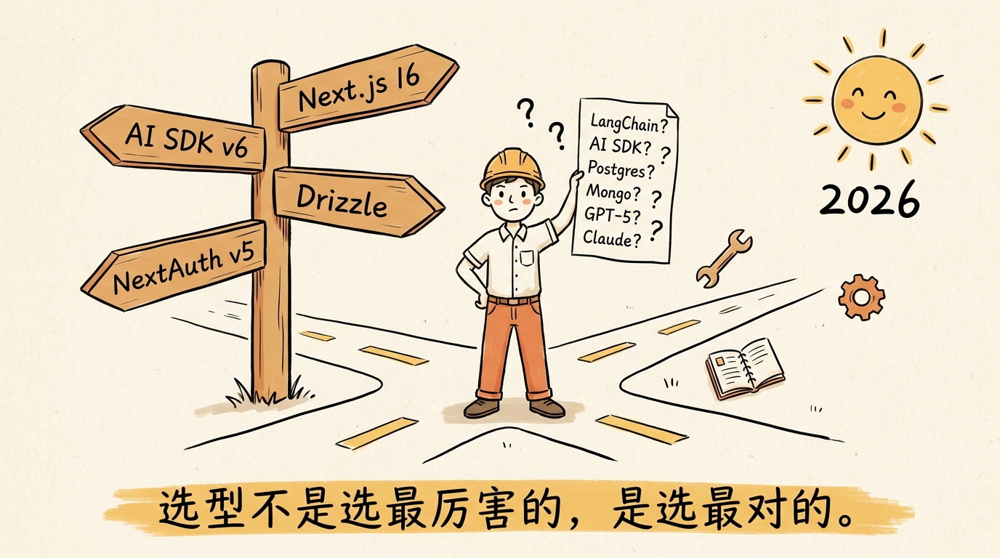
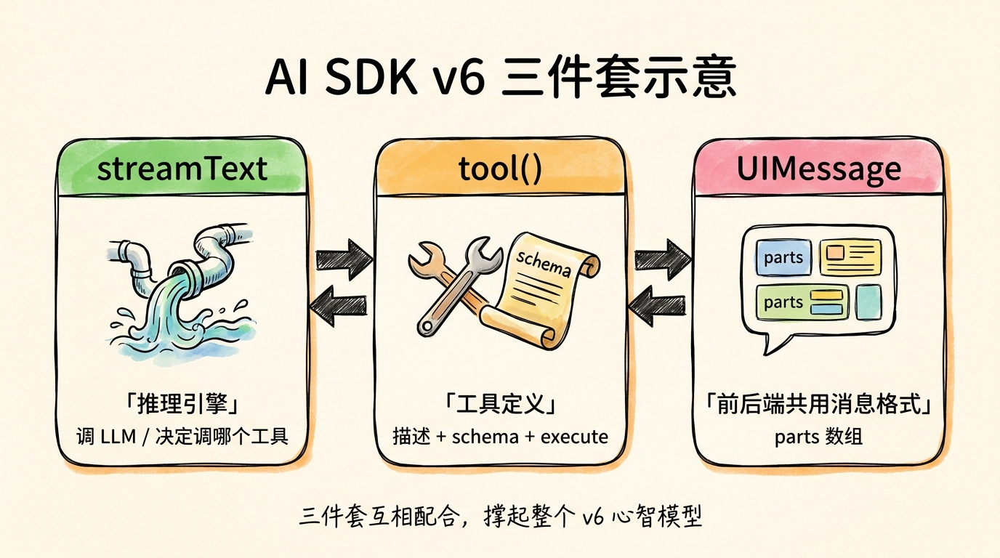
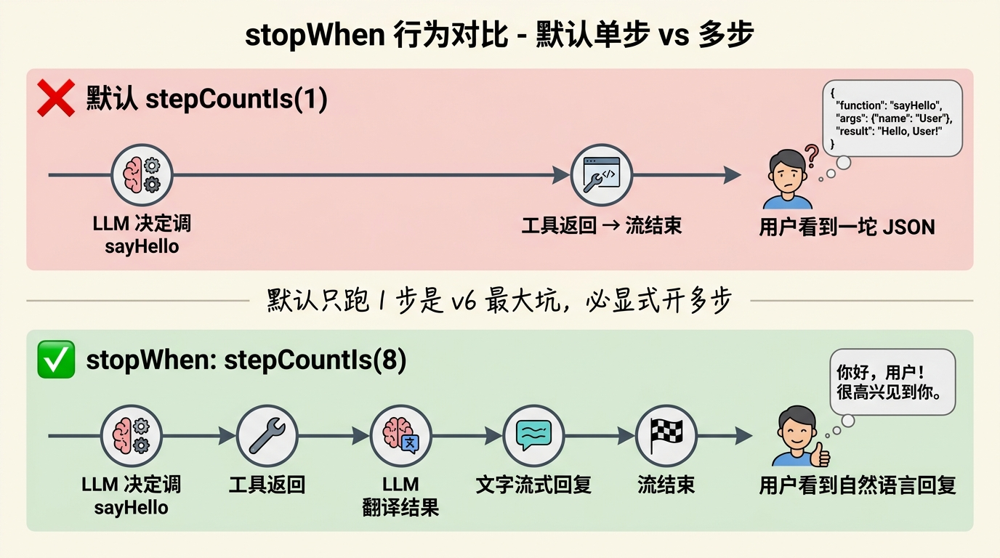
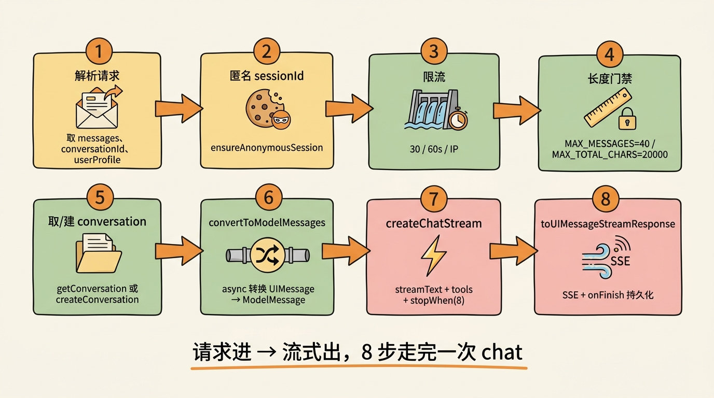
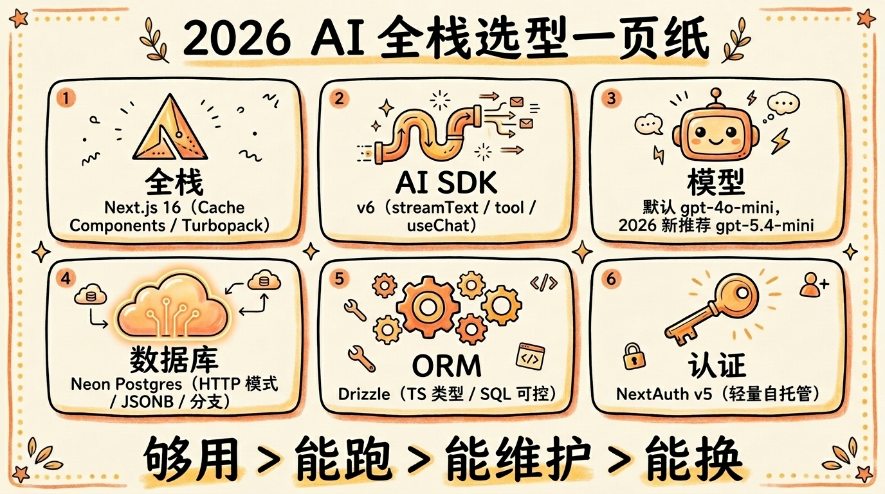

# 第 06 节 · 20 行代码起 Agent：用 streamText + tool() 搭最小可用版本



<!-- 图片说明（给图片代理）：
风格：手绘风、温暖封面
内容：画面正中央一台笔记本电脑屏幕，屏幕上是一段简洁的代码（占满屏幕的 20 行 TypeScript），代码块上方挂一个气球写"20 lines"。屏幕外侧伸出三只小手：一只手举着 streamText 标签，一只手举着 tool() 标签，一只手举着 useChat 标签。下方手写一行字："最少代码，最大乐趣 — 起一个能跑的 Agent。"
中文标注，字体亲切
-->

> **预计时长**：阅读 30 分钟 / 实战 60 分钟
> **前置知识**：[第 05 节《2026 年 AI 全栈技术栈选型逻辑》](./06-tech-stack-2026.md)、对 React + Next.js Route Handler 有基础了解
> **本节代码**：`ssp-web` 仓库 `chapter-06` tag · 主要文件 `src/app/api/chat/route.ts`、`src/lib/ai/agent.ts`、`src/components/chat/ChatPanel.tsx`

那天我在群里看见一个朋友哭丧着脸贴了一张截图。截图里是 LangChain 的 `AgentExecutor`、`ConversationBufferWindowMemory`、`ChatPromptTemplate.from_messages`，外加六七个 import，光初始化代码就 80 行。

她问：「Dennis，我就想做一个能调一个查天气的工具的小 Agent。**为什么这么难？**」

我没回。我新开一个空文件夹，跑了一句 `pnpm create next-app@latest`，进去把 `app/api/chat/route.ts` 写满，把首页改成 `useChat`。**11 分钟后**，她那台 MacBook 上跑出了一个能调用工具的 Agent。

她当场愣了五秒，发了一句："**LangChain 我学了三天还没跑通。**"

这一节就讲一件事：**用 AI SDK v6 起一个最小可用的 Agent，从零到能跑，20 行核心代码够了。** 不是教学玩具，是 SSP 这个生产项目里真实的 Agent 骨架——只是把规则引擎那一块抽走，让它对你显形。

---

## 一、知识铺垫：streamText、tool、UIMessage 三个 v6 概念

在敲代码之前，先把 v6 的三件套讲清楚。这三个名字会在后面 11 节里反复出现，搞清楚一次，省得后面来回查。



<!-- 图片说明（给图片代理）：
风格：手绘风信息图
内容：三个并排的卡通方块
1. streamText（绿色）：图标 = 一根流式管道，文字 "推理引擎 / 调 LLM / 决定调哪个工具"
2. tool()（橙色）：图标 = 一把扳手 + 一份 Zod schema 卷轴，文字 "工具定义 / 描述 + schema + execute"
3. UIMessage（粉色）：图标 = 聊天气泡 + 内嵌 parts 卡片，文字 "前后端共用消息格式 / parts 数组"
底部一行小字："三件套互相配合，撑起整个 v6 心智模型"
-->

### streamText：调 LLM 的入口

从 `ai` 包导入，**它不是 Promise**——同步返回一个 result 对象，里面挂着各种流。最常用的是 `result.toUIMessageStreamResponse()`，一行代码把流转成 Next.js 的 `Response`。

把它想成一个"高级版 OpenAI SDK"：你给它 messages，它帮你处理流式分块、工具调用循环、错误恢复、SSE 协议、UIMessage 序列化——这些活儿你自己写至少要 800 行。

### tool()：让 LLM 知道有什么"手脚"

`tool()` helper 把一个普通函数包装成 LLM 看得懂的工具。三块东西必填：

- **`description`**：给 LLM 看的"使用说明"，写得越具体越好
- **`inputSchema`**：用 Zod schema 描述入参（v4 叫 `parameters`，**v6 不识别**）
- **`execute`**：真正干活的函数

LLM 看到 `description` 决定"这次要不要调"，看 `inputSchema` 决定"该填哪些参数"，最后 SDK 调 `execute(input)` 跑一次。

### UIMessage：前后端共用的消息格式

v6 把消息抽象成 `UIMessage`，每条消息有 `role`、`id`、`parts: UIMessagePart[]`。**所有内容都在 parts 里**——文本是 `{ type: 'text', text }`，工具调用是 `{ type: 'tool-${name}', state, input, output }`，引用文件是 `{ type: 'file', url }`。

为什么不用 `content: string`？因为 Agent 的回复是混合的——一段文字，一个工具调用，一张图片，再一段文字。`parts` 数组让前端能精准渲染每一块，不必自己解析字符串。

> **划重点**：v6 有个常见踩坑，**`streamText` 默认 `stopWhen: stepCountIs(1)`**。这意味着 LLM 调一次工具就停了。要让它"调工具 → 看结果 → 再决策 → 再调或回话"循环跑下去，必须显式 `stopWhen: stepCountIs(8)`（或别的步数上限）。这一条踩过的人都记一辈子。

---

## 二、核心讲解

### 2.1 项目初始化：从空文件夹到能跑

```bash
# 起步
pnpm create next-app@latest my-agent
# 选项一路按推荐：TypeScript ✓、ESLint ✓、Tailwind ✓、App Router ✓、Turbopack ✓、不要 src/

cd my-agent

# 装 AI 三件套
pnpm add ai@^6 @ai-sdk/openai@^3 @ai-sdk/react@^3 zod@^4
```

把 `.env.local` 写好：

```bash
# .env.local
OPENAI_API_KEY=sk-your-key-here
OPENAI_MODEL=gpt-4o-mini
# 用国内中转可以加（OpenAI 兼容网关，常见路径形如 /openai/v1）：
# OPENAI_BASE_URL=https://your-proxy.com/openai/v1
```

> **小提醒**：`ai@^6.0.99` 与 `@ai-sdk/openai@^3.0.33` 的版本号配对要对齐。如果 `pnpm install` 装出 `ai@5.x` + `@ai-sdk/openai@2.x`，工具调用一定不工作——v5 和 v6 协议不兼容。SSP 项目里写死了 `^6.0.99` 就是这个原因。

跑一下 `pnpm dev`，浏览器打开 `localhost:3000`，看到 Next.js 默认页 = 准备就绪。

---

### 2.2 写一个 echo Agent（无 tool，纯 streamText）

第一步先不碰工具。让 Agent 把用户说的话原模原样流回来，验证 `streamText` 这条管道。

新建 `app/api/chat/route.ts`：

```ts
// app/api/chat/route.ts（最小版，6 行核心）
import { streamText, convertToModelMessages } from 'ai';
import { openai } from '@ai-sdk/openai';

export const maxDuration = 30;

export async function POST(req: Request) {
  const { messages } = await req.json();
  const result = streamText({
    model: openai('gpt-4o-mini'),
    system: '你是一个友好的助手，请把用户说的话礼貌地复述一遍。',
    messages: await convertToModelMessages(messages),
  });
  return result.toUIMessageStreamResponse();
}
```

> **看这里 →**：`convertToModelMessages` 在 v6 是 **async 函数**，必须 `await`。v5 是同步的，从 v5 升级时漏掉这一句，运行时模型会拿到一个 Promise，回出 "Invalid messages format"。

把 `app/page.tsx` 改成最小聊天界面：

```tsx
// app/page.tsx（核心：useChat + 按 parts 渲染；input 自己用 useState 管）
'use client';
import { useChat } from '@ai-sdk/react';
import { useState } from 'react';

export default function Home() {
  const { messages, sendMessage, status } = useChat();
  const [input, setInput] = useState('');

  return (
    <main className="max-w-2xl mx-auto p-6">
      {messages.map((m) => (
        <div key={m.id} className="my-2">
          <b>{m.role}:</b>{' '}
          {m.parts.map((p, i) => (p.type === 'text' ? <span key={i}>{p.text}</span> : null))}
        </div>
      ))}
      {/* ... <form> + <input>：onSubmit 里 sendMessage({ text: input }) 后 setInput('') */}
    </main>
  );
}
```

> **看这里 →**：v6 的 `useChat` **不再托管 input 状态**——v4 的 `input` / `handleInputChange` / `handleSubmit` 全部移除，自己用 `useState` 管。这是从"半托管 hook"变成"纯状态 hook"的进化，把 UI 控制权完全交还给你。

刷新页面，输入"你好"，按回车——你应该看到 AI 把"你好"复述回来，文字一个字一个字地流出。

**这就是最小 Agent 的骨架。** 一共两个文件，加起来不到 50 行。但还没接工具，下一步开始装手脚。

---

### 2.3 加第一个 tool：最小 sayHello

回到 `app/api/chat/route.ts`，加一个 `sayHello` 工具：

```ts
// app/api/chat/route.ts（加 tool 后）
import { streamText, tool, convertToModelMessages, stepCountIs } from 'ai';
import { openai } from '@ai-sdk/openai';
import { z } from 'zod';

export const maxDuration = 30;

const sayHello = tool({
  description: '用一种夸张又可爱的方式跟某个人打招呼，名字必填。',
  inputSchema: z.object({
    name: z.string().describe('要打招呼的人名'),
  }),
  execute: async ({ name }) => {
    return { greeting: `嘿嘿嘿，${name}！欢迎来到 Agent 的世界 🎉` };
  },
});

export async function POST(req: Request) {
  const { messages } = await req.json();
  const result = streamText({
    model: openai('gpt-4o-mini'),
    system: '你是一个能调用 sayHello 工具的助手。当用户提到名字时，主动调它打招呼。',
    messages: await convertToModelMessages(messages),
    tools: { sayHello },
    stopWhen: stepCountIs(8), // ★ 不写这个，调一次工具就停
    temperature: 0.3,
  });
  return result.toUIMessageStreamResponse();
}
```

> **划重点**：`stopWhen: stepCountIs(8)` 是 v6 的"必备肌肉记忆"——`streamText` 默认只跑 1 步，工具调完就停。要让 Agent **看到工具结果后接着说人话**，必须显式让它跑多步。8 是经验值，覆盖大多数对话场景。

刷新页面，输入"叫张丽来打招呼"。**你会看到一段 JSON 出现在消息流里**——那是工具调用的 `state: 'output-available'` 状态，但 UI 还没专门渲染它，所以就裸露给你看了。

下一步把这个 part 渲染成漂亮的卡片。

---

### 2.4 stopWhen 的核心警告：v6 默认只跑 1 步

这一节单独拎出来，因为踩坑率太高了。

```ts
// ❌ 错误写法：调一次工具就停
streamText({
  model: openai('gpt-4o-mini'),
  tools: { sayHello },
  // 没写 stopWhen
});
```

LLM 第一步：决定调 `sayHello`。
SDK 跑 `execute`，拿到结果。
LLM 第二步：本来要把结果翻译成自然语言，但是——**它没有第二步**，因为默认 `stopWhen: stepCountIs(1)`，跑完第一步就停了。

用户看到的最终消息，是 part 数组里只有一个 `tool-sayHello` 的 JSON，**没有任何文字回复**。

```ts
// ✅ 正确写法
streamText({
  model: openai('gpt-4o-mini'),
  tools: { sayHello },
  stopWhen: stepCountIs(8), // 允许 8 步循环
});
```

这下 LLM 的循环是：

1. 决定调 `sayHello({ name: '张丽' })`
2. 拿到工具结果 `{ greeting: '嘿嘿嘿，张丽！...' }`
3. 把结果翻译成自然语言："好的，我已经向张丽打了招呼，她应该能感受到我们的热情！"
4. （可选）继续下一步或结束

> **小提醒**：`stopWhen` 接的是数组就是"任一满足即停止"的 OR 关系。SSP 在生产里只用一个上限：`stopWhen: stepCountIs(8)`。复杂场景可以加 `hasToolCall('done')`、自定义 token 预算检查等。
>
> v6 的另一个变化：`ToolLoopAgent`（专门的 Agent 抽象）默认 `stepCountIs(20)`，比 `streamText` 宽松。但 SSP 没用 `ToolLoopAgent`，仍然 `streamText` + `stepCountIs(8)`，理由很简单——80 行代码搞得定的事，不需要再上一个高级抽象。



<!-- 图片说明（给图片代理）：
风格：信息图（infographic），扁平专业风
内容：上下两条时序图对比
上半 ❌（红色背景）：默认 stepCountIs(1)
  时间轴上只有 2 个节点：
    1. LLM 决定调 sayHello → 2. 工具返回 → 流结束（用户看到一坨 JSON）
下半 ✅（绿色背景）：stopWhen: stepCountIs(8)
  时间轴上 5 个节点：
    1. LLM 决定调 sayHello → 2. 工具返回 → 3. LLM 翻译结果 → 4. 文字流式回复 → 5. 流结束
中间一行小字："默认只跑 1 步是 v6 最大坑，必显式开多步"
中文标注，字号清晰
-->

---

### 2.5 升级到 ssp-web 真实 chat route 结构

到这里你的 minimal Agent 已经能跑了。下面我们把骨架拉到生产级——直接看 SSP 的 `src/app/api/chat/route.ts` 长什么样（节选关键结构）：



<!-- 图片说明（给图片代理）：
风格：信息图（infographic），扁平专业风
内容：横向流水线，从左到右 8 个步骤的卡片，每个卡片有图标 + 标题 + 一句话
1. 解析请求（图标：邮件）— 取 messages、conversationId、userProfile
2. 匿名 sessionId（图标：饼干）— ensureAnonymousSession
3. 限流（图标：闸门）— 30 / 60s / IP
4. 长度门禁（图标：尺子）— MAX_MESSAGES=40 / MAX_TOTAL_CHARS=20000
5. 取/建 conversation（图标：文件夹）— getConversation 或 createConversation
6. convertToModelMessages（图标：管道）— async 转换 UIMessage → ModelMessage
7. createChatStream（图标：闪电）— streamText + tools + stopWhen(8)
8. toUIMessageStreamResponse（图标：流水）— SSE + onFinish 持久化
中文标注，字号清晰
-->


```ts
// src/app/api/chat/route.ts:22-29（顶部常量）
export const dynamic = 'force-dynamic';
export const maxDuration = 120;
const MAX_MESSAGES = 40;
const MAX_MESSAGE_CHARS = 4000;
const MAX_TOTAL_CHARS = 20000;
const CHAT_RATE_LIMIT = 30;
const CHAT_RATE_WINDOW_MS = 60_000;
```

> **看这里 →**：`maxDuration = 120` 把单函数最长执行时间从默认 30 秒拉到 120 秒。Agent 的多步工具循环 + 流式回复，在最坏情况下可能跑超过 30 秒，30 秒会被 Vercel 自动杀掉。SSP 用 120 秒是经验值，覆盖 99% 的对话。

主流程 8 步，逐项对照 `code-facts.md` §3.2：

```ts
// src/app/api/chat/route.ts:81-294（结构示意，只留 3 个关键步骤）
export async function POST(req: NextRequest) {
  // 1-4. 解析请求 / 匿名 sessionId / 限流 / 长度门禁
  // ...（见上方流水线图 step 1-4）

  // 5. 取/建 conversation
  const conversation = body.conversationId
    ? await getConversation(body.conversationId)
    : await createConversation({ sessionId });

  // 6. 转 ModelMessage（v6 是 async）
  const messages = await convertToModelMessages(body.messages);

  // 7. 调 streamText（封装在 createChatStream，见下）
  const result = createChatStream(messages, {
    questions: body.questions,
    userProfile: body.userProfile,
  });

  // 8. 转 SSE Response，并在 onFinish 持久化（onError 见 §2.9）
  const response = result.toUIMessageStreamResponse({
    originalMessages: body.messages,
    onFinish: async ({ messages: persisted }) => {
      await updateConversation(conversation.id, { messages: persisted as unknown[] });
    },
  });
  response.headers.set('x-conversation-id', conversation.id);
  return response;
}
```

`createChatStream` 这个函数在 `src/lib/ai/agent.ts:47-79`，正是我们说的"20 行核心代码"：

```ts
// src/lib/ai/agent.ts:47-79（节选）
export function createChatStream(
  messages: ModelMessage[],
  context?: ChatContext,
  onFinish?: (result: { text: string }) => void | Promise<void>,
) {
  const { apiKey, baseURL, model } = getOpenAIConfig();
  const openai = createOpenAI({ apiKey, baseURL });

  const contextPrompt = context
    ? buildContextPrompt(context.questions ?? [], context.userProfile)
    : '';

  const systemPrompt = contextPrompt
    ? `${SYSTEM_PROMPT}\n\n${contextPrompt}`
    : SYSTEM_PROMPT;

  return streamText({
    model: openai(model),
    system: systemPrompt,
    messages,
    providerOptions: {
      openai: { store: false }, // 中转网关兼容
    },
    tools,
    stopWhen: stepCountIs(8),
    temperature: 0.3,
    onFinish,
  });
}
```

> **划重点**：`providerOptions.openai.store: false` 是给中转网关用的。OpenAI 默认 Responses API 会在自家服务器持久化每次响应（用于后续 fork、resume 之类的功能），但中转网关不一定支持，强制关掉避免出错。如果你直连 OpenAI 官方，这个参数可以省略。

`temperature: 0.3` 是事实导向场景的标配——SSP 不能让 LLM 在退休年龄上自由发挥。如果你做的是创意写作，调到 0.8-1.0 更合适。

---

### 2.6 用 useChat 接前端：transport 与 sendMessage

前端最小版只用了 `useChat()` 不带参数。生产里你会想要：

- 自定义 API URL（不是默认的 `/api/chat`）
- 在请求 body 里塞额外字段（`conversationId`、`userProfile` 等）
- 监听 `onFinish` 做副作用（持久化、更新本地状态）

v6 引入了 **transport 架构**——所有请求层面的配置全部塞到 `transport` 里：

```tsx
// 客户端示意（基于 ssp-web 的 ChatPanel）
import { useChat } from '@ai-sdk/react';
import { DefaultChatTransport } from 'ai';
import { useMemo, useState } from 'react';

export function ChatPanel() {
  const [conversationId] = useState<string | undefined>();
  const [profile, setProfile] = useState({});
  const transport = useMemo(
    () =>
      new DefaultChatTransport({
        api: '/api/chat',
        // body 字段会和 useChat 内部 body 合并，是给请求"加料"的入口
        prepareSendMessagesRequest: async (options) => ({
          ...options,
          body: { ...options.body, id: options.id, messages: options.messages, conversationId, userProfile: profile },
        }),
      }),
    [conversationId, profile],
  );
  // onFinish 扫 message.parts 做副作用 → 见下方节选
  const chat = useChat({ id: conversationId, transport, onFinish });
  // ... render messages.parts，参考 2.2 那段
  return null;
}
```

> **看这里 →**：`prepareSendMessagesRequest` 里的 `body` 字段会和 useChat 内部生成的 body 合并，是给请求"加料"的标准入口。SSP 在 `ChatPanel.tsx:354-390` 里塞了 6 个额外字段（conversationId、sessionId、questions、userProfile、planId、metadata），每个都对应后端的一个用法。

**SSP 的 onFinish 处理（`ChatPanel.tsx:396-441` 节选）**：

```ts
onFinish: ({ message }) => {
  for (const part of message.parts) {
    if (part.type === 'tool-computePlan' && part.state === 'output-available') {
      const planId = (part.output as any).plan_id;
      if (planId) setPlanId(planId); // 更新本地 planId
    }
    if (part.type === 'tool-updateProfile' && part.state === 'output-available') {
      const profile = (part.output as any).profile;
      setSessionProfile((prev) => deepMerge(prev, profile)); // 累积合并
    }
  }
},
```

这就是 v6 的"前端响应工具结果"标准模式：**onFinish 拿到完整 message → 扫 parts → 针对特定 tool 类型做副作用**。比 v4 的"自己解析 toolCall 数组"清爽十倍。

---

### 2.7 渲染 parts：tool 结果不要写成裸 JSON

第一节我们偷懒只渲染了 `text`，工具调用结果裸露成 JSON。生产里得分类型渲染。

```tsx
{m.parts.map((part, i) => {
  switch (part.type) {
    case 'text':
      return <span key={i}>{part.text}</span>;

    // ★ 静态工具的 type 是 `tool-${toolName}`，再按 part.state 分支
    case 'tool-sayHello':
      switch (part.state) {
        case 'input-streaming':
          return <pre key={i}>构造参数中...{JSON.stringify(part.input)}</pre>;
        case 'input-available':
          return <div key={i} className="text-gray-500">正在调用 sayHello...</div>;
        case 'output-available':
          return <div key={i} className="bg-green-50 p-2 rounded">{(part.output as any).greeting}</div>;
        // output-error / approval-requested 见下方状态表
      }
      break;

    default:
      return null; // step-start 等
  }
})}
```

> **划重点**：part.state 有 5 个状态——`input-streaming`（参数边生成边流出）、`input-available`（参数完整了）、`output-available`（工具执行完）、`output-error`（执行失败）、`approval-requested`（需要用户审批）。**生产 UI 至少要处理前 3 个**，否则用户看到的是断片的 JSON。

SSP 的 `ToolResultCard.tsx` 一共 708 行，专门把 `tool-computePlan` 渲染成"场景对比 + 补贴推荐 + 备注"的可点击卡片。这个我们留到[第 17 节《工具结果卡片化》](./18-streaming-ui.md)展开，现在你只要知道——**part 不是字符串，是结构化数据，前端有责任把它变成 UI**。

---

### 2.8 多步循环到底怎么转：把 stopWhen 想成"循环上限"

前面反复强调"必须写 stopWhen"，但很多人写了之后还是说不清**多步循环内部到底发生了什么**。这一节把它拆开，因为它是理解整个 Agent 心智模型的钥匙。

一次 `streamText` 调用，在底层是一个 **step 循环**。每个 step 是一次完整的"调 LLM → 看它要不要调工具"：

1. **Step 1**：SDK 把 `system + messages` 发给 LLM。LLM 返回两种可能——要么直接吐文本（结束），要么吐一个或多个 `tool_call`（要调工具）。
2. 如果是 `tool_call`，SDK 自动找到对应 tool 的 `execute`，跑一次，拿到结果。
3. **Step 2**：SDK 把"刚才的 tool_call + 它的结果"追加进 messages，**再发一次** LLM。LLM 这次能看到工具结果了，于是决定"再调一个工具"还是"把结果翻译成人话"。
4. 这个循环一直转，直到 LLM 不再要求调工具（自然结束），**或** `stopWhen` 条件命中（强制停）。

所以 `stopWhen: stepCountIs(8)` 的真实含义是：**这个循环最多转 8 圈**。第 8 圈还在调工具，SDK 就强制收尾，不再给 LLM 续命。这是一道"防失控保险"——万一 prompt 写得不好让 LLM 陷入"调工具 → 不满意 → 再调"的死循环，8 步上限保证它不会无限烧 token。

> **看这里 →**：为什么 SSP 选 8 不选 3、也不选 20？SSP 一次对话最复杂的链路是「`updateProfile` 累积档案 → `computePlan` 算方案 →（缺字段）`validateField` 校验 → 再 `computePlan`」，4-5 步能覆盖。留到 8 是给"用户一句话里塞了多个诉求"的长链路留冗余。设太小（如 3）会在输出结论前被截断，设太大（如 20）则在异常情况下浪费 token。8 是 SSP 跑了几个月对话日志后的经验值。

**怎么观察这个循环？** `streamText` 的结果对象上挂着 `steps`——它是一个数组，每个元素对应一个 step，里面有 `toolCalls`、`toolResults`、`text`、`finishReason`。调试时把它打出来，就能看到 LLM 到底转了几圈、每圈调了什么。

```ts
// 调试示意（示意，非项目实际代码）：观察多步循环
const result = streamText({ model, system, messages, tools, stopWhen: stepCountIs(8) });
result.steps.then((steps) => {
  console.log(`LLM 一共转了 ${steps.length} 圈`);
  steps.forEach((s, i) => {
    console.log(`Step ${i + 1}: ${s.toolCalls.length} 次工具调用, finishReason=${s.finishReason}`);
  });
});
```

> **划重点**：「Agent 能自己决定下一步做什么」这句话，落到代码上就是这个 step 循环——LLM 在每个 step 重新评估"我现在有什么信息、还缺什么、该调谁"。`stopWhen` 不参与决策，它只兜底。真正决定调几次、调谁的是 **LLM + 你写的 tool description + System Prompt**。这就是为什么后面第 09、11、13 节要花大力气讲 Prompt 和 schema——它们才是 Agent 行为的方向盘。

---

### 2.9 onError 与流式中断：生产 Agent 的容错底线

最小 Agent 跑通后，下一个绕不开的问题是：**流式过程中 LLM 挂了怎么办？** 网关超时、模型限流、token 超长——这些在生产里每天都发生。如果不处理，用户看到的是一个卡住的光标，体验直接崩。

`toUIMessageStreamResponse` 提供了 `onError` 回调，专门拦截流式过程中的错误并返回**对用户友好的文案**（而不是把堆栈信息直接吐给用户）。SSP 的真实写法：

```ts
// src/app/api/chat/route.ts（节选，onFinish 见 §2.5）
const response = result.toUIMessageStreamResponse({
  originalMessages: body.messages,
  onFinish: async ({ messages: persistedMessages }) => { /* 持久化，见 §2.5 */ },
  onError: (streamErr) => {
    logger.warn('chat.stream_error', { /* 结构化日志，便于排查 */ });
    return '抱歉，回复中断了。请发送"继续"，我会接着回答。';
  },
});
```

> **看这里 →**：`onError` 的返回值会作为一段文本塞进流里，让前端显示。SSP 没有把原始错误抛给用户——一是安全（不泄露内部实现），二是体验（一句"请发送继续"比一串红色报错温和得多）。同时 `logger.warn` 记结构化日志，方便事后在 Vercel Logs 里按 `chat.stream_error` 检索定位。

错误分类上，SSP 在 `route.ts` 外层还做了一层 try/catch，把错误分成两类：**AI 错误（如模型 503）返回 HTTP 503**，**内部错误（如 DB 写失败）返回 500**。这让前端能据状态码做不同重试策略——503 可以提示用户稍后再试，500 则是 bug 要上报。

这套容错不复杂，但它是 demo 和产品的分界线之一：**demo 假设一切顺利，产品假设处处会挂**。下一节的数据库持久化、第 19 节的调试可观测，都是围绕"处处会挂"这个前提展开的。

---

### 2.10 三个常见踩坑

**坑 1：用 `parameters` 而不是 `inputSchema`**

```ts
// ❌ v4 写法，v6 不识别
tool({
  parameters: z.object({ name: z.string() }),
  execute: ...,
});

// ✅ v6 正确写法
tool({
  inputSchema: z.object({ name: z.string() }),
  execute: ...,
});
```

v6 升级时漏改这个字段，工具会被发到客户端但 schema 是空的，LLM 不知道怎么填参数，永远调不通。Codemod 可以扫：`npx @ai-sdk/codemod v6/rename-parameters-to-input-schema`。

**坑 2：在 onToolCall 里 `await addToolOutput`**

客户端工具（没 `execute`）需要在前端用 `addToolOutput` 提供结果：

```ts
// ❌ 死锁
async onToolCall({ toolCall }) {
  await addToolOutput({ // ← await 这里会卡住
    tool: toolCall.toolName,
    toolCallId: toolCall.toolCallId,
    output: '...',
  });
}

// ✅ 正确：不 await
onToolCall({ toolCall }) {
  if (toolCall.dynamic) return; // ★ TS 必须先收窄 dynamic
  if (toolCall.toolName === 'getLocation') {
    addToolOutput({
      tool: 'getLocation',
      toolCallId: toolCall.toolCallId,
      output: 'San Francisco',
    });
  }
}
```

`addToolOutput` 内部会触发 `sendMessage()` 续跑流，**`await` 会让你等自己引发的下一轮请求完成**——经典死锁。

**坑 3：忘写 stopWhen**

最高频的踩坑。复习一遍：

```ts
streamText({
  model,
  tools,
  // ❌ 没写 → stepCountIs(1) → 调一次工具就停
});

streamText({
  model,
  tools,
  stopWhen: stepCountIs(8), // ✅
});
```

调试 trick：如果你的 Agent 调完工具没回话，**99% 是没写 stopWhen**。打开终端日志，看 LLM 调用次数——如果总是 1 次，确认。

---

## 三、举一反三

minimal Agent 的核心抽象是「**LLM 决策 + Tool 执行 + 多步循环 + 结构化结果**」。把 SSP 的工具换成别的领域，整套架构直接复用。

**法律咨询 Agent**：

- 把 `sayHello` 换成 `searchLawArticles({ topic, jurisdiction })`：返回相关法条 + 出处
- 加一个 `analyzeContract({ text, clauses })`：抽合同关键条款
- 加一个 `computeComplianceRisk({ scenario })`：调风险评分引擎

System prompt 大致写："你是一名法律咨询助手，遇到具体法条问题必须调 searchLawArticles，永远在回复里附上出处链接。"`stopWhen: stepCountIs(10)`（法律问题往往要查多条法规）。

**报税 Agent**：

- `lookupTaxRate({ income, region, year })`：查某年某地区的税率
- `simulateTaxScenario({ events })`：模拟"年中调薪后年终税额变化"
- `validateTaxId({ id })`：纳税人识别号格式校验

System prompt："你是一名报税助手，所有税额计算必须调 simulateTaxScenario，禁止口算。"`temperature: 0.1`（数字场景越低越好）。

**通用结论**：写一个领域的 minimal Agent，**90% 时间花在写好 3-5 个 tool 的 description 和 inputSchema**，10% 在调 prompt。streamText 那 20 行框架代码改不到。

---

## 四、小结



<!-- 图片说明（给图片代理）：
风格：手绘风、小结卡片
内容：标题"20 行起 Agent · 必备肌肉记忆"
六个手绘小方块：
1. streamText：默认单步，必加 stopWhen: stepCountIs(N)
2. tool()：v6 用 inputSchema（不是 parameters）
3. UIMessage：用 parts 数组，前端按 type 渲染
4. convertToModelMessages：v6 是 async，必 await
5. useChat：input 自己用 useState 管，不再托管
6. addToolOutput：客户端工具不要 await
中间一句金句："最少代码 ≠ 最差代码 — 80 行 ssp-web 撑住生产"
中文标注，可爱风格
-->

20 行代码起 Agent，听起来像营销话术，但你跟着这一节走完，**会发现框架代码确实就这么多**。剩下的复杂度都在三个地方：

- **工具定义**——description 和 inputSchema 写得好不好，直接决定 LLM 决策准不准
- **System Prompt**——告诉 LLM 什么时候调谁，是后面[第 09 节《System Prompt 11 节分层设计法》](./10-system-prompt.md)的重头戏
- **结果渲染**——把 part 变成漂亮的卡片，是[第 17 节](./18-streaming-ui.md)的事

**核心要点回顾**：

- ✅ AI SDK v6 = `streamText` + `tool()` + `useChat`，三件套撑起整个心智模型
- ✅ `streamText` 默认 `stopWhen: stepCountIs(1)`，**生产必须显式开多步**
- ✅ `tool()` 用 `inputSchema`（不是 `parameters`），v6 不再向后兼容
- ✅ `convertToModelMessages` 在 v6 是 async，必 `await`
- ✅ `useChat` v6 不再管理 input 状态，用 `useState` 自己管
- ✅ `addToolOutput` 不能 `await`，否则死锁
- ✅ 前端按 `part.type + part.state` 分类渲染，不要裸露 JSON

下一节，我们要给这个 Agent 装上记忆——**用 Drizzle + Neon Postgres 搭起 SSP 的数据持久层**，让 conversation 跨刷新都能恢复，让规则定义可以热更新，让 plan 历史可以审计回查。

---

## 思考题

1. **【开放题】**：本节强调 `streamText` 默认 `stopWhen: stepCountIs(1)` 是巨坑。但 v6 团队为什么不直接默认 `stepCountIs(8)` 或更大？想想"默认安全 vs 默认强大"的权衡——你会怎么设计这个默认值？

2. **【动手题】**：在本地起一个新项目，按 2.2-2.4 走完，跑通 echo Agent + sayHello 工具。然后**新增第二个工具 `currentTime`，无入参，返回服务器当前时间**，并修改 system prompt 让 LLM 在被问"现在几点"时调用它。**验收标准**：浏览器输入"几点了"，AI 调用 currentTime 后回复中文时间格式（如"现在是下午 3 点 24 分"）。要交：完整 `app/api/chat/route.ts` + 一段录屏或截图证明工具调用成功。

3. **【选做】**：把 minimal Agent 的工具换成"查天气 + 查机票 + 推荐餐厅"三件套（execute 都写假数据），让它能回答"我明天要去上海开会，给我个完整出行建议"。**重点**：观察 `stopWhen: stepCountIs(N)` 的 N 取多少时，LLM 能正确串起三个工具调用。提交一份你的 N 值实验记录（N=3 时 vs N=8 时 LLM 行为有何区别）。

---

## 面试题

**Q1.【基础】【主题：Tool Calling 协议】** 在 AI SDK v6 里，一个 `tool()` 由哪几部分构成？请说明 LLM 是怎么用这几部分决定"要不要调、怎么调"的，并指出 `inputSchema` 相对早期版本字段名的变化。
<details><summary>参考解答</summary>

`tool()` 三块必填：

- **`description`**：给 LLM 看的"使用说明"，LLM 据此判断**这次要不要调**这个工具。
- **`inputSchema`**：用 Zod（或 JSON）schema 描述入参，LLM 据此决定**该填哪些参数**；它同时用于校验 LLM 给出的入参是否合法。
- **`execute`**：真正干活的 async 函数，SDK 在 LLM 决定调用后跑 `execute(input)`。

调用时序：LLM 读 `description` 选工具 → 读 `inputSchema` 生成结构化入参（一个 tool_call）→ SDK 校验入参并调 `execute` → 把结果喂回 LLM。

版本变化：v6 用 `inputSchema`，早期版本（v4）叫 `parameters`，**v6 不识别 `parameters`**。漏改会导致工具被发给 LLM 但 schema 为空，LLM 不知道怎么填参，永远调不通。可用 codemod `v6/rename-parameters-to-input-schema` 批量修。

</details>

**Q2.【进阶】【主题：Tool Calling 协议】** 为什么说 `streamText` 默认 `stopWhen: stepCountIs(1)` 是 v6 最高频的坑？请用 step 循环解释"调了工具却不回话"的现象，并说明正确写法。
<details><summary>参考解答</summary>

`streamText` 底层是一个 **step 循环**，每个 step 是一次"调 LLM → 看它要不要调工具"。默认 `stepCountIs(1)` 意味着**只跑 1 步**：

- Step 1：LLM 决定调工具 → SDK 跑 `execute` 拿到结果 → 但因为上限是 1 步，循环到此结束。
- LLM **没有机会**进入 Step 2 去"看工具结果、翻译成人话"。

用户看到的最终消息里只有一个 `tool-xxx` 的 JSON part，没有任何文字回复——这就是"调了工具却不回话"。

正确写法是显式开多步：`stopWhen: stepCountIs(8)`。这样循环允许转最多 8 圈，LLM 在拿到工具结果后能继续生成自然语言或再调工具。调试技巧：如果 Agent 调完工具不回话，先看 LLM 调用次数，如果总是 1 次，基本就是漏写 `stopWhen`。

补充：`stopWhen` 只是"循环上限"兜底，不参与决策；真正决定调几次、调谁的是 LLM + tool description + System Prompt。

</details>

**Q3.【深挖】【主题：Agent 架构设计】** SSP 的生产 chat route 在最小 Agent 的基础上多做了哪些事？请从"请求入口到流式响应"的链路说明，并解释为什么生产 Agent 不能只有 `streamText` 一行。
<details><summary>参考解答</summary>

SSP 的 `src/app/api/chat/route.ts` 把最小骨架扩成 8 步流水线：

1. 解析请求 + 字段校验（`isValidMessages`）
2. 取/建匿名 sessionId（`ensureAnonymousSession`，多用户隔离）
3. 限流（30 次 / 60 秒 / IP，防滥用）
4. 长度门禁（`MAX_MESSAGES=40` / `MAX_TOTAL_CHARS=20000`，防超长烧 token）
5. 取/建 conversation（持久化的载体）
6. `await convertToModelMessages(...)`（v6 是 async，UIMessage → ModelMessage）
7. `createChatStream(...)`（封装 streamText + tools + `stopWhen: stepCountIs(8)`）
8. `toUIMessageStreamResponse({ onFinish, onError })`：流结束在 `onFinish` 把完整 messages 写库，`onError` 返回友好文案

为什么不能只有一行 `streamText`：**demo 假设一切顺利，产品假设处处会挂**。生产要处理多用户隔离、滥用防护、超长输入、持久化、流式中断容错——这些都不是 `streamText` 自带的，而是围绕它构建的工程外壳。核心推理代码确实只有 80 行（`agent.ts`），但能上线的前提是这层外壳。

</details>

---

## 延伸阅读

- [Vercel AI SDK v6 `streamText` Reference](https://ai-sdk.dev/docs/reference/ai-sdk-core/stream-text)
- [Vercel AI SDK v6 `tool()` Reference](https://ai-sdk.dev/docs/reference/ai-sdk-core/tool)
- [`useChat` Hook Reference](https://ai-sdk.dev/docs/reference/ai-sdk-ui/use-chat)
- [Loop Control（stopWhen / prepareStep）](https://ai-sdk.dev/docs/agents/loop-control)
- [v5 → v6 Migration Guide](https://ai-sdk.dev/docs/migration-guides/migration-guide-6-0)

---

[← 上一节：第 05 节 2026 年 AI 全栈技术栈选型](./06-tech-stack-2026.md) · [📚 目录](./README.md) · [下一节：第 07 节 数据库与 ORM →](./08-database-and-drizzle.md)
