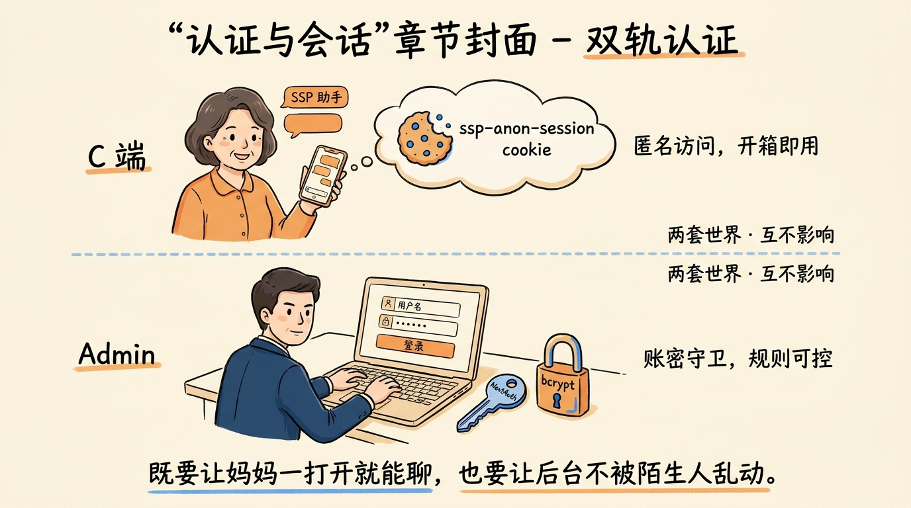
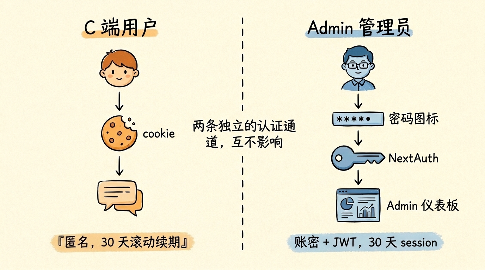
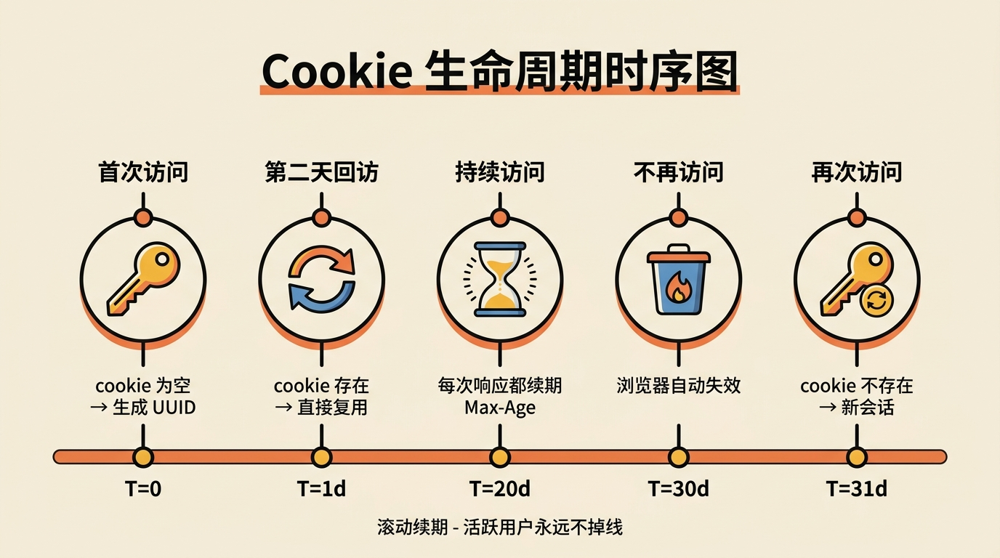
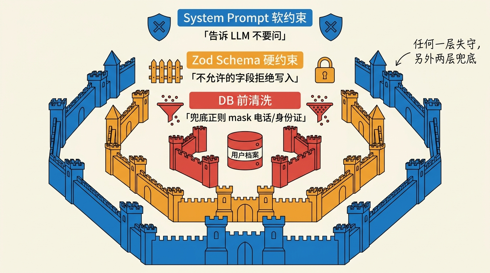
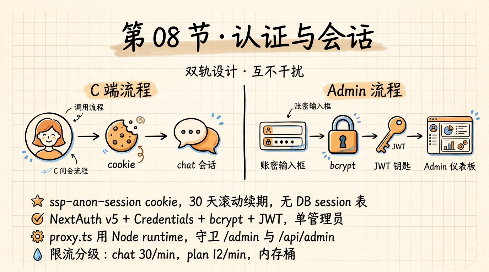

# 第 08 节 · 认证与多用户：NextAuth v5 + 匿名会话设计



<!-- 图片说明（给图片代理）：
风格：手绘风,温暖封面
内容:画面分两条会话轨道,一条是匿名用户(穿着家常便服的中年阿姨)直接打开手机,头顶冒出 `ssp-anon-session` cookie 字样,跟 SSP 助手轻松聊天;另一条是穿西装的管理员在登录界面,面前是 NextAuth 的钥匙图标 + bcrypt 锁。中间一条柔和的虚线把两个轨道隔开,代表"两套世界"。下方手写小字:"既要让妈妈一打开就能聊,也要让后台不被陌生人乱动。"
中文标注,字体亲切
-->

> **预计时长**：阅读 30 分钟 / 实战 60 分钟
> **前置知识**：第 07 节《数据库与 ORM》、对 Cookie 与 JWT 有基础了解
> **本节代码**：`ssp-web` 仓库 `chapter-08` tag · 主要文件 `src/lib/auth.ts`、`src/lib/security/anon-session.ts`、`src/proxy.ts`

那天我把 SSP 链接发给我妈，让她试试算自己的退休年龄。她用的是一台 5 年前的安卓机，看到打开的页面要"注册账号"——她按下手机的返回键，把页面关了。

后来我问她为什么不试。她说：「我不想注册一个新账号，我连密码都不知道怎么记。再说我又不是要买东西，凭什么要给你电话号码。」

那个瞬间我意识到一件事：**这门课讲的不是给极客做的工具，是给我妈也能用的东西**。她不会、也不应该被强制注册。

但同时我们又有一个 admin 后台，里面是 24 条政策规则、3 套政策参数、几百个测试用例——这些东西要是被陌生人随便改一下，整个 SSP 就崩了。

一个产品里同时存在两种用户：**完全不想被打扰的"游客"**，和**绝对不能被冒充的"管理员"**。怎么让两边并存，而且互不干扰？

这就是本节要讲的事。

---

## 一、知识铺垫：为什么 Agent 应用的认证设计这么纠结

很多人写 Web 应用的第一反应是：装一个 NextAuth，套一个 OAuth，登录注册一站式。但 AI Agent 应用有它自己的痛点。

**第一个痛点：注册门槛对话期就劝退**

AI 应用的核心价值是"开口就能用"。你让用户在注册环节填邮箱、设密码、点验证链接、回邮箱、填用户名、点头像，等他走完这一套，他对 AI 的好奇心已经凉了一半。

ChatGPT 早期能爆火，**很大一个原因就是没注册也能聊几句**——后来加了门槛是因为实在烧不起算力，不是因为体验更好。

**第二个痛点：用户档案要跨会话累积**

社保规划这件事不是一次聊完。用户今天聊了"我是 73 年女工"，明天回来想接着算医保。如果每次开页都要重新自我介绍，体验直接归零。

但你又不能强制注册——那回到痛点 1。**你需要一个不是账号的东西，但也能让用户回到前一次的状态。**

**第三个痛点：管理后台不能让人随便进**

`/admin` 路径下是规则编辑器、参数发布、测试中心，一旦被人乱改，C 端的所有用户都会受影响。这部分必须**强鉴权**——账号 + 密码 + Session + 路由保护。

**第四个痛点：Edge runtime 装不下完整鉴权**

Next.js 16 把 `middleware.ts` 改名 `proxy.ts`，而且**强制 Node.js runtime**（详见[第 06 节《2026 年 AI 全栈技术栈》](./06-tech-stack-2026.md)）。这其实是好事——以前 NextAuth v4 在 Edge 上各种限制（bcrypt 跑不动、Postgres 连不上），现在 v5 在 Node runtime 里能跑完整逻辑。

把这四点合起来，SSP 给出的答案是**双轨设计**：

- **C 端用匿名会话**：一个签名 cookie 标识用户，没有数据库 session 表
- **管理端用 NextAuth v5**：账号密码 + JWT + bcrypt + 路由守卫



<!-- 图片说明：
风格：手绘风
内容：左右两栏对比图。左栏 C 端:用户头像→cookie(画成饼干符号)→对话气泡,标注"匿名,30 天滚动续期"。右栏 Admin:管理员头像→密码图标→NextAuth(画成大门钥匙)→Admin 仪表板,标注"账密 + JWT,30 天 session"。中间用一道虚线隔开,虚线上写"两条独立的认证通道,互不影响"。
-->

下面分头讲。

---

## 二、核心讲解

### 2.1 SSP 的双轨认证：C 端和 Admin 端各走各的

先看代码事实（出处：`code-facts.md` §7）：

| 维度 | C 端（用户对话） | Admin 端（后台） |
|---|---|---|
| 认证机制 | 匿名 cookie | NextAuth v5 + Credentials |
| 标识 | `ssp-anon-session` cookie 值 | JWT token |
| 存储 | 仅 cookie，无 DB | JWT 加密在 cookie，无 DB session 表 |
| 续期 | 30 天滚动 | 30 天（NextAuth 默认） |
| 加密 | UUID v4 + 格式校验 | NEXTAUTH_SECRET + bcrypt 密码 hash |
| 路由保护 | 无（任何人都能聊） | `proxy.ts` 拦 `/admin/*` 与 `/api/admin/*` |
| 限流 | chat 30/min/IP, plan 12/min/IP | 不限 |

**双轨设计的好处**：

- **C 端零摩擦**——首次访问 cookie 就生成，30 天内回来还认得你
- **Admin 端强保护**——除非有账号密码，连页面都进不去
- **数据库少一张表**——没有 session 表，省一次写库；JWT 自带过期信息
- **代码少一半**——NextAuth 的 Adapter 体系（database session）我们用不上

> **划重点**：双轨不是"两套并存"，而是**两套互不知道对方存在**。匿名 cookie 不会去 `/admin`，NextAuth 不会管 `/api/chat`。各管各的，简单稳定。

---

### 2.2 匿名会话的全生命周期

来看 SSP 的匿名会话核心代码：

```typescript
// src/lib/security/anon-session.ts
import type { NextRequest } from "next/server";

export const ANON_SESSION_COOKIE_NAME = "ssp-anon-session";

const SESSION_COOKIE_MAX_AGE = 60 * 60 * 24 * 30; // 30 天

export function isValidSessionId(value: string | undefined): value is string {
  if (!value) return false;
  return /^[a-zA-Z0-9-]{16,128}$/.test(value);
}

function createSessionId(): string {
  return crypto.randomUUID();
}

export function ensureAnonymousSession(
  req: NextRequest,
  fallbackSessionId?: string,
): { sessionId: string; isNewSession: boolean } {
  const existing = req.cookies.get(ANON_SESSION_COOKIE_NAME)?.value;
  if (isValidSessionId(existing)) {
    return { sessionId: existing, isNewSession: false };
  }
  if (isValidSessionId(fallbackSessionId)) {
    return { sessionId: fallbackSessionId, isNewSession: true };
  }
  return { sessionId: createSessionId(), isNewSession: true };
}
```

> **看这里 →**：`isValidSessionId` 用正则锁住格式 `[a-zA-Z0-9-]{16,128}`。这是防御 cookie 注入——攻击者不能塞 `; DROP TABLE` 进来；攻击者也不能给一个 1MB 的 cookie 让你做 hash 计算。

**生命周期 6 步**：

1. **首访**：cookie 不存在 → `createSessionId()` 生成 UUID v4
2. **写回**：路由 handler 把新 sessionId 写进 `Set-Cookie`
3. **持续访问**：cookie 存在且格式合法 → 复用
4. **滚动续期**：每次响应都重写 `Max-Age`，让用户活跃 = 不过期
5. **过期失效**：30 天不来 → 浏览器自动删除 cookie
6. **再访**：进入流程 1，相当于"新用户"

**Cookie 标志全部值得讲一遍**：

```typescript
// src/lib/security/anon-session.ts:40-43
export function buildAnonymousSessionCookie(sessionId: string): string {
  const secure = process.env.NODE_ENV === "production" ? "; Secure" : "";
  return `${ANON_SESSION_COOKIE_NAME}=${sessionId}; Path=/; HttpOnly; SameSite=Lax; Max-Age=${SESSION_COOKIE_MAX_AGE}${secure}`;
}
```

| 标志 | 作用 | 不加会怎样 |
|---|---|---|
| `HttpOnly` | JS 读不到这个 cookie | 任何 XSS 都能偷走会话 |
| `SameSite=Lax` | 第三方域名跳转过来不会自动带 cookie | 容易被 CSRF |
| `Secure` (生产) | 仅 HTTPS 传输 | 中间人能看到明文 sessionId |
| `Path=/` | 全站可见 | 部分子路径无 cookie |
| `Max-Age=2592000` | 30 天滚动 | 关浏览器就丢 |

> **小提醒**：开发环境要不要加 `Secure`？答案是**不要**。本地是 http，加了 Secure 浏览器直接丢 cookie，导致登录每次都失败。SSP 用 `process.env.NODE_ENV === "production"` 自动切换。



<!-- 图片说明：
风格：信息图(infographic),扁平专业
内容：横向时序图,从左到右 5 个时间点:
1. T=0 首次访问：cookie 为空 → 生成 UUID
2. T=1d 第二天回访：cookie 存在 → 直接复用
3. T=20d 持续访问：每次响应都续期 Max-Age
4. T=30d 不再访问：浏览器自动失效
5. T=31d 再次访问：cookie 不存在 → 新会话
每个节点配小图标(钥匙、刷新、沙漏、垃圾桶)
中文标注,字号清晰
-->

---

### 2.3 在 chat 路由里取/建会话

匿名会话在 `/api/chat/route.ts:81-113` 这一段被读：

```typescript
// src/app/api/chat/route.ts (节选,非完整代码)
import { ensureAnonymousSession, attachAnonymousSessionCookie } from "@/lib/security/anon-session";
import { checkRateLimit, getClientIp, applyRateLimitHeaders } from "@/lib/security/rate-limit";

export async function POST(req: NextRequest) {
  const body = await req.json();
  const legacySessionId = body.sessionId; // 兼容老前端

  // 1. 取/建 sessionId
  const { sessionId, isNewSession } = ensureAnonymousSession(req, legacySessionId);

  // 2. 限流
  const ip = getClientIp(req);
  const limit = checkRateLimit(`chat:${ip}`, {
    limit: 30,
    windowMs: 60_000,
  });
  if (!limit.allowed) {
    const res = new Response("Too Many Requests", { status: 429 });
    applyRateLimitHeaders(res, limit, 30);
    return res;
  }

  // 3. 业务逻辑（此处省略）
  // ...

  // 4. 把 sessionId 写回 cookie
  if (isNewSession) {
    attachAnonymousSessionCookie(response, sessionId);
  }
  return response;
}
```

> **看这里 →**：`isNewSession` 这个标志是为了**只在需要时写 cookie**。如果用户已经有合法 cookie，就别多此一举重写——少一次 `Set-Cookie` 头，少一次 CDN 缓存击穿风险。

**会话和 conversation 是两件事**：

- **session（认证维度）**：标识"这是同一个浏览器/用户"，由 cookie 持有
- **conversation（对话维度）**：标识"这是哪一段对话"，由 `conversations.id` 持有

一个 session 可以有多个 conversation（用户开过 3 个对话），一个 conversation 只属于一个 session。这两个概念在术语表里也是分开的（详见 `style-guide.md` §7）：

```typescript
// src/lib/db/schema.ts:133-140
export const conversations = pgTable("conversations", {
  id: uuid("id").primaryKey().defaultRandom(),
  sessionId: text("session_id").notNull(), // ← 关联匿名会话
  messages: jsonb("messages").notNull(),
  userProfile: jsonb("user_profile"),
  createdAt: timestamp("created_at").defaultNow(),
  updatedAt: timestamp("updated_at").defaultNow(),
});
```

每次拉会话列表时（`/api/conversations`），用 `sessionId` 过滤：「只让你看到自己的对话」。

> **划重点**：用 sessionId 做隔离不是绝对安全。如果用户清浏览器、换设备，他就看不到自己的对话了——这是一个**取舍**：放弃绝对的"账号一致性"，换来"开口就能用"。

---

### 2.4 NextAuth v5 + Credentials：管理后台的强鉴权

C 端讲完，看管理端。SSP 的 `src/lib/auth.ts` 一共 53 行：

```typescript
// src/lib/auth.ts
import NextAuth from "next-auth";
import Credentials from "next-auth/providers/credentials";
import bcrypt from "bcryptjs";

export const { auth, signIn, signOut, handlers } = NextAuth({
  providers: [
    Credentials({
      name: "credentials",
      credentials: {
        username: { label: "Username", type: "text" },
        password: { label: "Password", type: "password" },
      },
      async authorize(credentials) {
        if (!credentials?.username || !credentials?.password) {
          return null;
        }
        const adminUsername = process.env.ADMIN_USERNAME;
        const adminPasswordHash = process.env.ADMIN_PASSWORD_HASH;
        if (!adminUsername || !adminPasswordHash) return null;
        if (credentials.username !== adminUsername) return null;

        const isValid = await bcrypt.compare(
          credentials.password as string,
          adminPasswordHash,
        );
        if (!isValid) return null;

        return {
          id: "admin",
          name: adminUsername,
          email: `${adminUsername}@admin.local`,
        };
      },
    }),
  ],
  session: { strategy: "jwt" },
  pages: { signIn: "/admin/login" },
});
```

**4 个关键决策**：

**决策 1：单管理员账户**

SSP 不在数据库里存用户表。`ADMIN_USERNAME` 和 `ADMIN_PASSWORD_HASH` 都是**环境变量**。

为什么？因为 SSP 的 admin 只有运维一个人用——加一张 user 表的成本远大于维护一对环境变量。生产里我每次想换密码，跑一次 `bcrypt.hash('new-pwd', 10)` 拿到 hash，去 Vercel dashboard 更新环境变量，redeploy，搞定。

**决策 2：bcrypt 而不是明文 / SHA-256**

bcrypt 的 cost factor 默认 10（约 60ms），抗暴力破解：
- 明文密码：被拖库 = 直接暴露
- SHA-256：拖库后用彩虹表 1 秒查到原密码
- bcrypt 10 轮：拖库后用 1 块 H100 跑一年也跑不完几百万账号

代价是登录慢一拍（60-100ms），但管理员不在乎登录速度。

**决策 3：JWT session（不开 DB session 表）**

```typescript
session: { strategy: "jwt" }
```

NextAuth v5 默认两种 session 策略：
- **`"jwt"`**：把 session 信息加密在 cookie 里，每次请求自带
- **`"database"`**：在 DB 里建一张 sessions 表，cookie 只存 sessionToken

SSP 选 JWT 是因为：
- **少一张表**——admin 只有一个人，建表纯属浪费
- **Edge 友好**——JWT 可以在 Edge runtime 验证（虽然 SSP 现在 proxy.ts 强制 Node runtime）
- **登出"假登出"**——JWT 没法服务端撤销，只能等过期。但管理端流量小，用户主动登出 = 浏览器删 cookie 即可

> **小提醒**：如果 admin 有 100 个人，**就要换 database session 策略 + Drizzle Adapter**。`@auth/drizzle-adapter` 已经在 `package.json` 装好了，但 SSP 没用。

**决策 4：自定义登录页 `/admin/login`**

```typescript
pages: { signIn: "/admin/login" }
```

这告诉 NextAuth：「未登录用户访问受保护路径时，把他重定向到 `/admin/login`，不是默认的 `/api/auth/signin`。」自定义登录页让品牌一致，也方便处理 callbackUrl 跳回原页。

---

### 2.5 路由守卫：proxy.ts 是怎么挡住未登录用户的

来看 SSP 的中间件（`src/proxy.ts`，35 行）：

```typescript
// src/proxy.ts
import { NextResponse } from "next/server";
import { auth } from "@/lib/auth";

export default auth((req) => {
  const { pathname } = req.nextUrl;
  const session = req.auth;

  // 1. 拦截 admin API（/api/admin/*）
  if (pathname.startsWith("/api/admin/")) {
    if (!session) {
      return NextResponse.json({ error: "Unauthorized" }, { status: 401 });
    }
    return NextResponse.next();
  }

  // 2. 拦截 admin 页面（/admin/*）
  if (pathname.startsWith("/admin/")) {
    if (pathname === "/admin/login") return NextResponse.next();
    if (!session) {
      return NextResponse.redirect(
        new URL("/admin/login?callbackUrl=" + pathname, req.url),
      );
    }
  }

  return NextResponse.next();
});

export const config = {
  matcher: ["/admin/:path*", "/api/admin/:path*"],
};
```

> **看这里 →**：`auth((req) => {...})` 是 NextAuth v5 的中间件 helper，它把当前 session 注入 `req.auth`，省一次 fetch。

**两种保护策略对比**：

| 路径模式 | 没登录怎么办 | 为什么 |
|---|---|---|
| `/api/admin/*` | 返回 401 JSON | API 调用方（fetch / curl）需要可解析的错误码 |
| `/admin/*` | 重定向到 `/admin/login?callbackUrl=...` | 浏览器访问，希望直接跳到登录页 |

`callbackUrl` 是关键体验细节——用户登录成功后能**回到他原本想去的页面**，不是被甩到 dashboard。

**Next.js 16 的特殊性**：文件名叫 `proxy.ts` 不是 `middleware.ts`（详见研究报告 §1.4）。函数也叫 `proxy` 不是 `middleware`。如果你从 Next.js 14/15 迁过来，要把名字都改了。

> **划重点**：在 Next.js 16 里，**`proxy.ts` 强制跑 Node runtime**。这意味着 NextAuth v5 + bcrypt + Drizzle 都能正常用，不用再为 Edge 做兼容（旧版 NextAuth + Edge 的折磨记忆，懂的都懂）。

---

### 2.6 为什么 SSP 不用 Drizzle Adapter

SSP 装了 `@auth/drizzle-adapter`（`^1.11.1`），但**没在 `auth.ts` 里使用**。这是个有意识的取舍。

如果你启用 Drizzle Adapter，会发生：

```typescript
// 假设启用 (示意,非项目实际代码)
import { DrizzleAdapter } from "@auth/drizzle-adapter";
import { db } from "@/lib/db";

export const { auth } = NextAuth({
  adapter: DrizzleAdapter(db),
  providers: [...],
  session: { strategy: "database" }, // 注意改了!
});
```

**得到的功能**：
- 服务端可以撤销 session（强制登出）
- 一个用户可以有多端登录管理
- 可以记录 login_at / IP / user-agent

**付出的代价**：
- 多 4 张表：`users / accounts / sessions / verificationTokens`
- 每次请求多一次 DB 查询（验 session）
- Drizzle schema 必须严格匹配 Adapter 期望的字段名（详见研究报告 §9.6）
- Edge runtime 兼容性变差（Drizzle 的 neon-http driver 走 fetch，但 bcrypt 仍跑不动）

**SSP 的现状**：
- 只有 1 个 admin 账户
- 不需要多端管理
- 不需要审计日志（Vercel Logs 已经够用）

**结论**：装好不用，**留作扩展点**。如果哪天 admin 变成 10 人，5 行代码切到 Adapter 即可。

---

### 2.7 PII 边界：哪些信息能存，哪些不能

C 端用户在对话里会说出各种东西：

> "我叫张丽，1973 年 8 月出生的，电话 13800138000，住在静安区..."

LLM 可能会**把所有这些都往 `userProfile` 里塞**。如果你不主动拦着，PII（Personally Identifiable Information，个人可识别信息）就会进数据库。

SSP 的处理方式有三层防御：

**第一层：System Prompt 里写"不收集"**

```
# 核心规则（节选自 src/lib/ai/prompts.ts:22）
7. 不收集敏感信息 — 不要求姓名、身份证号、手机号、地址等。
```

LLM 在生成 `updateProfile` 工具调用时，会自动剔除姓名/电话——**前提是它听话**。这一层是**软约束**，靠模型遵守。

**第二层：Zod schema 不允许 PII 字段**

```typescript
// src/types/user-profile.ts (节选)
export interface UserProfileBasic {
  birth_year?: number;
  birth_month?: number;
  gender?: "male" | "female";
  female_retire_type?: "worker50" | "cadre55";
  // 注意:这里没有 name / phone / id_number 字段
}
```

`updateProfile` 工具的 inputSchema 严格按这个类型走（详见[第 13 节《用 Zod 写出"自解释"的 Tool Schema》](./13-zod-schema.md)）。即使 LLM 不听话想塞 `name`，Zod 校验直接拒绝。这是**硬约束**。

**第三层：写库前再过一遍**

`onFinish` 回调里把 messages 写入 `conversations.messages`（JSONB 字段），SSP 这一步**不做 PII 清洗**——因为依赖前两层已经把住关口。

但你的项目要是真的处理高敏感场景（医疗 / 金融），就该加第三层：

```typescript
// 示意,非项目实际代码
function maskPII(messages: UIMessage[]): UIMessage[] {
  return messages.map((m) => ({
    ...m,
    parts: m.parts.map((p) => {
      if (p.type === "text") {
        return { ...p, text: redactPhone(redactIdNumber(p.text)) };
      }
      return p;
    }),
  }));
}
```

> **划重点**：**PII 防御要分层**。Prompt 是规劝，Schema 是检查，写库前清洗是兜底。三层任意一层失守，另外两层补位。



<!-- 图片说明：
风格：信息图(infographic),扁平专业,城堡防御主题
内容：从外到内三层城墙:
最外层(蓝色):"System Prompt 软约束 — 告诉 LLM 不要问"
中层(橙色):"Zod Schema 硬约束 — 不允许的字段拒绝写入"
内层(红色):"DB 前清洗 — 兜底正则 mask 电话/身份证"
中心:数据库图标,标"用户档案"
旁边小注:"任何一层失守,另外两层兜底"
中文标注,字号清晰
-->

---

### 2.8 限流：内存桶能抗多大流量

`src/lib/security/rate-limit.ts` 用的是**进程内内存桶**：

```typescript
// src/lib/security/rate-limit.ts:50-85 (节选)
const buckets = new Map<string, RateLimitBucket>();

export function checkRateLimit(
  key: string,
  options: RateLimitOptions,
): RateLimitResult {
  const now = Date.now();
  const bucket = buckets.get(key);

  if (!bucket || bucket.resetAt <= now) {
    buckets.set(key, { count: 1, resetAt: now + options.windowMs });
    return { allowed: true, remaining: options.limit - 1, ... };
  }

  if (bucket.count >= options.limit) {
    return { allowed: false, remaining: 0, ... };
  }

  bucket.count += 1;
  return { allowed: true, remaining: options.limit - bucket.count, ... };
}
```

**两条限流配置（出处：code-facts.md §7.4）**：

| 端点 | limit | window | key |
|---|---|---|---|
| `/api/chat` | 30 次 | 60 秒 | `chat:${IP}` |
| `/api/plan/compute` | 12 次 | 60 秒 | `plan:${IP}` |

为什么 chat 比 plan 宽松？因为 chat 的成本主要在 LLM token，是**单价低 + 频率高**；plan 直接调引擎，但每次调用会写库 + 跑 24 条规则，是**单价高 + 频率低**——所以反而要更严格。

**内存桶的局限**：

- **单实例有效**：Vercel Fluid Compute 同实例内多请求共享 bucket，但**跨实例**就各算各的
- **重启失效**：函数实例冷启动，bucket 清零
- **不防分布式刷**：如果攻击者用 100 个 IP 各发 30 次，每个都不超限，总流量 3000

什么时候该升级到 Redis / Upstash？

| 场景 | 内存桶够吗 |
|---|---|
| 学习项目 / Demo | ✅ 够 |
| 单实例月活 < 10K | ✅ 够 |
| 多区域部署 | ❌ 必须 Redis |
| 抗 DDoS | ❌ 必须配合 Vercel WAF / Cloudflare |
| 严格配额（按 user 限流） | ⚠️ Redis 更稳 |

> **小提醒**：限流是"够用就好"。SSP 现在的内存桶足够防自动化脚本爬数据，没到要上 Redis 的量级。等真的撑不住再换不迟——**别为不存在的流量预付架构成本**。

---

### 2.9 匿名→注册的迁移路径（演进方向）

SSP 现在是纯匿名 C 端 + 单管理员 admin。但如果你想在自己的项目里做"匿名 + 注册混合"，标准做法是：

**Step 1：匿名期间正常用 cookie**

跟 SSP 一样，cookie 标识 user，DB 里存 `conversations.session_id`。

**Step 2：用户决定注册（场景化触发）**

不是开页就弹注册框，而是**用户主动想要时**触发：
- 「想保存这个方案到下次登录看」→ 弹邮箱注册
- 「想把方案分享给家人」→ 弹邮箱注册
- 「想接收政策更新提醒」→ 弹邮箱注册

**Step 3：注册成功后合并匿名数据**

```typescript
// 示意,非项目实际代码
async function mergeAnonToUser(anonSessionId: string, userId: string) {
  await db.update(conversations)
    .set({ userId })
    .where(eq(conversations.sessionId, anonSessionId));

  // 合并 userProfile
  const anonProfiles = await db.select().from(userProfiles)
    .where(eq(userProfiles.sessionId, anonSessionId));
  for (const p of anonProfiles) {
    await db.insert(userProfiles).values({ userId, ...p })
      .onConflictDoUpdate({ target: userProfiles.userId, set: deepMerge(p) });
  }
}
```

**Step 4：cookie 升级**

注册后，把匿名 cookie 替换成 NextAuth session cookie。两者并行不冲突——匿名 cookie 自然过期就行。

> **划重点**：永远不要让用户**因为注册而丢失之前的对话和档案**。匿名 → 注册的迁移是一次性、自动、无感的，不能让用户重新自我介绍。

---

### 2.10 三个常见踩坑

**坑 1：把 cookie 名字写错**

`ssp-anon-session` 这个名字在三处出现：`anon-session.ts:3`、`route.ts` 的 `req.cookies.get(...)`、前端如果有 JS 读取的话。**任何一处写错都会让会话断裂**。SSP 把它做成常量 `ANON_SESSION_COOKIE_NAME` 导出，所有地方 import 这个常量——别在代码里到处写字符串。

**坑 2：localhost 上 Secure cookie 不工作**

新人最容易踩的坑。`Secure` 标志要求 HTTPS。本地 dev 是 http，加了 Secure 浏览器**直接丢这个 cookie**——你登录每次都失败，DevTools 看 Cookies 里啥都没有。

修法就是 `process.env.NODE_ENV === "production" ? "; Secure" : ""`。

**坑 3：SameSite=None 还不带 Secure**

如果你想让 cookie 在跨站 iframe 也工作（比如嵌入到第三方页面），要 `SameSite=None`。但**`SameSite=None` 必须配合 `Secure`**——单独写 None 浏览器会默认升级为 Lax，效果跟没写一样。

SSP 不需要跨站，所以用 `SameSite=Lax` 是更安全的默认。

---

## 三、举一反三

**法律咨询 Agent**：跟 SSP 类似，C 端可以匿名问"我这种情况能起诉吗"，但一旦用户决定**保存案件资料**就必须注册——因为律师事务所有合规义务存证，匿名档案达不到法律要求。这种场景下，匿名期最多 7 天，超过自动转注册引导。

**医疗问诊 Agent**（HIPAA / GDPR 严格场景）：**不能用匿名**。HIPAA 要求所有 PHI（受保护健康信息）必须可追溯到具体身份。这种场景必须用 NextAuth v5 + Database session + 强 MFA + 审计日志。匿名只能做"症状自查"这种不涉及 PHI 的入口。

**报税咨询 Agent**：分阶段走——前 5 轮聊基础情况是匿名的，到了**填具体收入数字**时强制注册。注册之前，cookie 标识 + sessionStorage 暂存表单。注册之后，立刻把暂存数据迁移到 DB。

**核心原则**：**匿名是入口，注册是承诺**。低敏感低承诺的场景用匿名；高敏感高承诺的场景必须实名。在两者之间，让用户**自己选择**何时升级。

---

## 四、小结



<!-- 图片说明：
风格：手绘风,小结卡片
内容：一张笔记本风格的图,顶部"第 08 节·认证与会话"
左半:C 端流程图(用户→cookie→对话),右半:Admin 流程图(账密→bcrypt→JWT→admin 后台)
中间分隔线手写:"双轨设计·互不干扰"
底部 4 个手写要点:
1. ssp-anon-session cookie,30 天滚动续期,无 DB session 表
2. NextAuth v5 + Credentials + bcrypt + JWT,单管理员
3. proxy.ts 用 Node runtime,守卫 /admin 与 /api/admin
4. 限流分级:chat 30/min,plan 12/min,内存桶
中文标注,字体亲切
-->

SSP 的认证设计核心就一句话：**让该容易的容易，让该严的严**。

C 端用户开页就聊，cookie 拿走 30 天的便利；管理员账密 + bcrypt + JWT，每次操作都要鉴权；中间用 `proxy.ts` 把两套世界隔开，互不打扰。

NextAuth v5 不是装上就完事，**关键是想清楚你的产品到底要"账号"还是"会话"**。SSP 选了"对 C 端不强制账号"这条路，少了一张 user 表，少了一套登录页，多了几亿潜在用户的入口。

**核心要点回顾**：

- ✅ 双轨设计：C 端匿名 cookie + Admin NextAuth v5
- ✅ 匿名 cookie 标志组合：`HttpOnly; SameSite=Lax; Secure(prod); Max-Age=2592000`
- ✅ NextAuth v5 + Credentials + bcrypt + JWT session（不开 DB session 表）
- ✅ Drizzle Adapter 装好不用，留扩展点
- ✅ `proxy.ts` 在 Next.js 16 是 Node runtime，跑完整 NextAuth 逻辑
- ✅ PII 三层防御：Prompt 软约束 + Schema 硬约束 + 写库清洗
- ✅ 内存限流够用：chat 30/min，plan 12/min，按 IP 维度

---

## 思考题

1. **【开放题】**：SSP 选择「不强制注册」是因为社保场景目标用户广泛（包括我妈这种不爱注册的中年人）。你的项目的目标用户画像如果改成"年轻技术从业者"，匿名设计还合理吗？说说你的判断和取舍。

2. **【动手题】**：在本地 clone `ssp-web`，修改 `src/lib/security/anon-session.ts`，把 cookie 名字从 `ssp-anon-session` 改成 `your-product-session`，并把 Max-Age 从 30 天改成 7 天。然后跑一遍：开页面 → 看 DevTools 的 Cookies → 关掉浏览器 → 等 8 天（或手动改本地时间）→ 再访问看是不是新 sessionId。**验收标准**：第二次访问 DevTools 里能看到新的 cookie 值，conversations 表里能看到两条不同 sessionId 的记录。

3. **【选做】**：实现一个匿名→注册的合并函数 `mergeAnonToUser(anonSessionId, userId)`。要求：迁移 conversations、合并 userProfile（用 deepMerge 不覆盖已有值）、写入 audit log 记录合并事件。验收：注册前有 5 条 conversations + 1 个 profile，注册后这些都关联到新 userId，匿名 sessionId 失效。

---

## 面试题

**Q1.【基础】【主题：认证与会话】** SSP 为什么用"匿名 cookie + NextAuth v5"双轨设计，而不是统一一套登录体系？请说清两条轨道各自服务什么场景、用什么机制。
<details><summary>参考解答</summary>

因为一个产品里同时存在两种用户：**完全不想被打扰的 C 端游客**和**绝对不能被冒充的管理员**，二者诉求相反，用一套体系会互相迁就。

- **C 端（用户对话）**：用匿名 `ssp-anon-session` cookie 标识，30 天滚动续期，**无数据库 session 表**。目标是"开口就能用、零注册摩擦"——强制注册会在对话期就劝退用户。用户档案靠 cookie + `conversations.session_id` 跨会话累积。
- **Admin 端（后台）**：用 NextAuth v5 + Credentials（账号密码）+ bcrypt + JWT session，`proxy.ts` 守卫 `/admin/*` 与 `/api/admin/*`。目标是"强鉴权"——规则/参数被乱改会影响所有 C 端用户。

关键点：双轨不是"两套并存"，而是**两套互不知道对方存在**——匿名 cookie 不碰 `/admin`，NextAuth 不管 `/api/chat`。各管各的，简单稳定，还省了一张 user 表和一套登录页。

</details>

**Q2.【进阶】【主题：安全护栏】** SSP 对用户 PII 做了"三层防御"。请逐层说明它们的约束强度，以及为什么单靠 System Prompt 不够。
<details><summary>参考解答</summary>

三层防御，强度递增：

1. **System Prompt 软约束**：在 prompt 里写"不收集姓名/身份证/手机号/地址"，让 LLM 生成 `updateProfile` 时自动剔除 PII。**但这是软约束**——靠模型"听话"，一旦 prompt 被绕过或模型抽风就失守。
2. **Zod schema 硬约束**：`updateProfile` 的 `inputSchema`（对应 `UserProfileBasic`）**根本没有 `name`/`phone`/`id_number` 字段**。即使 LLM 不听话想塞，Zod 校验直接拒绝。这是硬约束。
3. **写库前清洗（兜底）**：高敏感场景（医疗/金融）在 `onFinish` 写库前再用正则 mask 电话/身份证。SSP 当前依赖前两层把关，没开第三层。

为什么 Prompt 不够：Prompt 是"规劝"，模型可能不遵守；攻击者也可能用提示注入诱导它越界。**安全护栏要分层**——Prompt 规劝、Schema 检查、写库清洗兜底，任一层失守另外两层补位。这正是"纵深防御"思想在 Agent 上的落地。

</details>

**Q3.【深挖】【主题：认证与会话】** SSP 的 Admin 选了 JWT session 而非 database session，还装了 `@auth/drizzle-adapter` 却不用。请解释这两个决策的取舍，以及什么情况下你会反转它们。
<details><summary>参考解答</summary>

**JWT vs database session**：

- JWT：session 信息加密在 cookie 里，每次请求自带，**无需 DB session 表**、Edge 友好。代价是**无法服务端撤销**（登出只能等过期或浏览器删 cookie）。
- database session：DB 建 sessions 表，可服务端强制登出、多端管理、记审计。代价是多一张表 + 每次请求多一次 DB 查询。

SSP 选 JWT 是因为 **admin 只有一个人**——建表、查库纯属浪费，"假登出"（删 cookie）对单管理员完全够用。

**装 adapter 却不用**：`@auth/drizzle-adapter` 已在 `package.json`，但 `auth.ts` 没启用，属于**有意留的扩展点**。启用它会得到服务端撤销/多端管理/审计日志，但代价是多 4 张表（users/accounts/sessions/verificationTokens）、每请求多一次查询、schema 必须严格匹配 adapter 字段。

**反转时机**：当 admin 从 1 人涨到多人（需要各自账号、强制登出、登录审计）时，就切到 `session: { strategy: "database" }` + DrizzleAdapter，改动只有几行。这体现了"够用就好 + 能换"——先用最简方案，把升级路径留好。

</details>

---

## 延伸阅读

- [NextAuth v5（Auth.js）官方迁移指南](https://authjs.dev/guides/upgrade-to-v5)
- [Next.js 16 `proxy.ts` 与 middleware 的差异](https://nextjs.org/docs/app/building-your-application/routing/middleware)
- [OWASP Session Management Cheat Sheet](https://cheatsheetseries.owasp.org/cheatsheets/Session_Management_Cheat_Sheet.html)
- [Drizzle Adapter for NextAuth v5](https://authjs.dev/getting-started/adapters/drizzle)
- [bcrypt cost factor 选择讨论](https://github.com/kelektiv/node.bcrypt.js#a-note-on-rounds)

---

[← 上一节：第 07 节 数据库与 ORM](./08-database-and-drizzle.md) · [📚 目录](./README.md) · [下一节：第 09 节 System Prompt 11 节分层设计法 →](./10-system-prompt.md)
