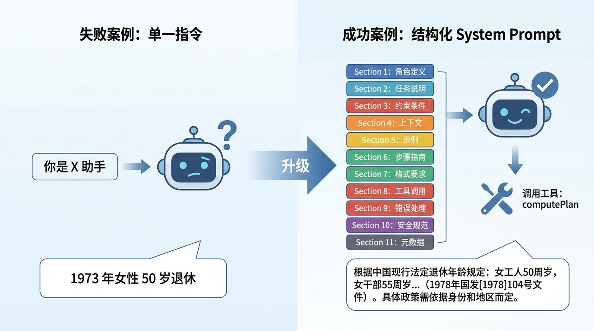
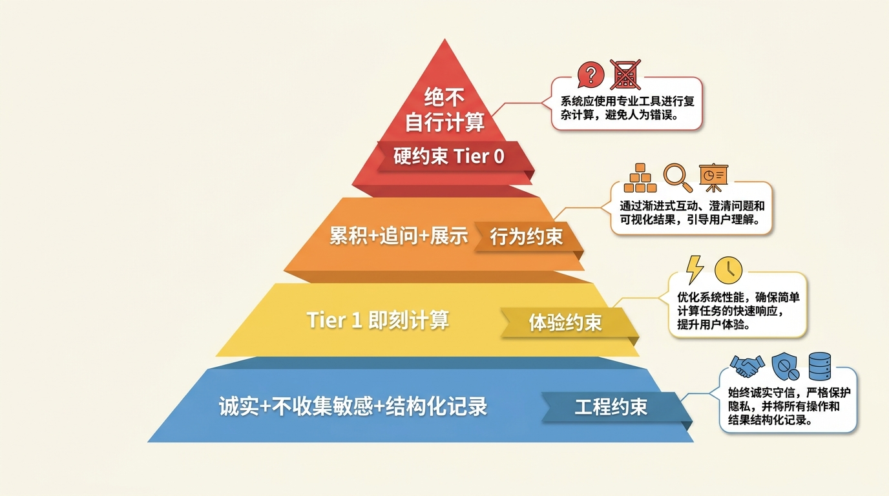

# 第 09 节 · System Prompt 11 节分层设计法：让 LLM 不再乱来


<!-- 图片说明（给图片代理）：
风格：手绘风,温暖封面
内容：画面中央一张"操作手册"大开本笔记,左页贴着 11 张便签条,从上到下分别是"角色/核心规则/数据收集/结果格式/字段识别/政策要点/置信度/注意事项/模糊输入/超范围/多轮策略",每张便签上画一个对应的小图标。右页是一只 AI 机器人手举工具(扳手、计算器),正在对照手册一条一条检查。底部手写大字:"11 节分层,让 AI 不再'一本正经地胡说八道'"。
中文标注,字体亲切
-->

> **预计时长**：阅读 30 分钟 / 实战 60 分钟
> **前置知识**：第 06 节《20 行代码起 Agent》、对 LLM 有基础概念
> **本节代码**：`ssp-web` 仓库 `chapter-09` tag · 主要文件 `src/lib/ai/prompts.ts`、`src/lib/ai/agent.ts`

那天产品经理在群里发了一张截图，火气很大。

截图里 SSP 的早期版本回了一句："1973 年出生的女性退休年龄为 50 岁。"

她回我一句："这话谁让 AI 说的？工人 50 岁，干部 55 岁，2025 年还要往后延，你这一句话起码错了三层。"

那时候我们的 System Prompt（下文统一用 System Prompt 这个词）只有一行：「你是一位专业的社保规划顾问，请帮用户解答退休问题。」

听起来人畜无害。但在大模型（LLM）眼里，这就是一句**让它放飞自我的许可证**——「专业」=「我可以自信地给数字」，「帮用户解答」=「我可以直接回答」。它不会调工具，不会查规则引擎，不会问你是工人还是干部，它会直接根据训练数据里的记忆，给你一个**听起来正确但其实彻底错了**的退休年龄。

这就是我要带你走完的路：**System Prompt 不是话术，是契约。**写得好，LLM 老老实实当工具调度员；写得差，LLM 自信满满地瞎编数字。一字之差，一个数字几亿人的退休方案就毁了。

---

## 一、知识铺垫：System Prompt 的本质是什么

很多人写第一行 prompt 的时候是这样的：

```
你是一位专业的 [领域] 助手，请帮助用户解答 [领域] 问题。
```

这一行，**几乎没有任何控制力**。

我帮你拆开看里面到底写了什么：

- 「你是一位专业的 X 助手」→ 给了模型一个**身份**，但没给**权限边界**
- 「请帮助用户解答」→ 给了模型一个**目标**，但没给**执行步骤**
- 「[领域] 问题」→ 给了模型一个**主题**，但没给**禁区**

模型读完这句，它会怎么理解？「我是专业的，我可以回答」。然后就开始凭训练数据里 2024 年之前的政策记忆裸答，问也不问，调也不调，验证也不验证。

> **划重点**：System Prompt 的本质，不是给模型一个角色，而是**给模型一份契约**——「这件事你必须做、那件事你不能做、遇到 X 情况走 Y 路径」。

### 现代 Prompt 工程 ≈ Context Engineering

2023 年大家叫这事「prompt engineering」。2026 年这个词已经几乎不用了，业界改叫 **Context Engineering**（上下文工程）。

为什么？因为现在的 prompt 不是一段静态文本，它是**多个组件拼出来的运行时上下文**：

| 组件 | 来源 | 作用 |
|---|---|---|
| **System Prompt（静态）** | 代码里写死 | 角色 + 规则 + 模板 |
| **Tool Schema** | Zod 定义自动生成 | 模型读得懂的工具说明书 |
| **Dynamic Context** | 运行时拼接 | 当前用户档案 + 待回答问题 |
| **Conversation History** | 数据库恢复 | 历史 messages |
| **Retrieved Knowledge** | 向量检索 / RAG | 相关政策条文 |

这五样东西**一起**进入 LLM 的上下文窗口，**任何一样写错都会让 Agent 行为崩坏**。这一节先讲第一样——静态 System Prompt 怎么设计。第 10 节讲第三样——动态上下文怎么注入。



<!-- 图片说明：
风格：信息图(infographic),扁平专业
内容：左侧画一个失败案例:"你是 X 助手"一行字 → AI 头上画问号 → 输出错误答案("1973 年女性 50 岁退休")。中间是大箭头加文字"升级"。右侧画一个成功案例:System Prompt 拆成 11 个分层方块,从上到下分别是 11 个 section,AI 头上画对勾 → 调用工具 computePlan → 输出正确答案。
中文标注,字号清晰
-->

### 为什么"分层"重要

把 prompt 写成一坨 200 字的散文，最大的问题不是看不懂，而是**没法演进**。

社保政策每年都改、模型每半年大版本升级、产品功能每月都加点新东西。如果 System Prompt 是一坨散文，每次修改都得整段重读、整段重测、整段重发。

但如果它是分层的——一层是"我是谁"，一层是"我必须遵守什么"，一层是"我怎么收集信息"，一层是"我怎么呈现结果"——那就**改哪层只测哪层**。这就是工程化的开始。

SSP 的 `prompts.ts` 就是这么写的。下面拆给你看。

---

## 二、核心讲解

### 2.1 SSP 的 11 节结构总览

打开 `src/lib/ai/prompts.ts:10-169`，你会看到一个叫 `SYSTEM_PROMPT` 的常量，**从顶到底分成 11 个 section**。来源：`code-facts.md` §4.2。

```typescript
// src/lib/ai/prompts.ts:10-169 (节选,展示 11 节骨架)
export const SYSTEM_PROMPT = `你是 SSP（上海社保规划助手）的对话引擎。

# 角色
... (略)

# 核心规则
1. 绝不自行计算政策数字 — ...
2. 累积用户信息(合并新旧) — ...
3. Tier 1 字段即刻计算 — ...
4. needs_agent=true 时追问 — ...
5. needs_agent=false 时展示结果 — ...
6. 诚实告知边界 — ...
7. 不收集敏感信息 — ...
8. 结构化记录用户信息(updateProfile 每轮一次) — ...

# 数据收集优先级
Tier 1 ...
Tier 2 ...
Tier 3 ...

# 结果展示格式
... (略)

# 回复表达规范
... (略)

# 关键字段识别
... (略)

# 2025 政策要点
... (略,仅供解释,不得用于计算)

# 置信度标注
... (略)

# 标准注意事项
... (略)

# 模糊输入处理
... (略)

# 超范围问题
... (略)

# 多轮对话策略
... (略)
`;
```

11 节合在一起约 169 行。**每一节都对应一个 LLM 容易翻车的具体行为**，没有一句是冗余的。

| Section | 行号区间 | 解决什么具体问题 |
|---|---|---|
| `# 角色` | 12-13 | 我是谁，能力边界在哪 |
| `# 核心规则` | 14-23 | 8 条不可违反的硬约束 |
| `# 数据收集优先级` | 25-50 | Tier 1/2/3 渐进收集 |
| `# 结果展示格式` | 52-75 | 输出模板，避免格式飘 |
| `# 回复表达规范` | 77-90 | 语气、人称、避免油腻 |
| `# 关键字段识别` | 92-105 | "73年"→1973 的映射 |
| `# 2025 政策要点` | 107-120 | 仅供解释，不可用于计算 |
| `# 置信度标注` | 122-128 | 确定/参考/估算三级 |
| `# 标准注意事项` | 130-138 | 法规引用、数据时效 |
| `# 模糊输入处理` | 140-150 | "我老公"→male 的推断 |
| `# 超范围问题` | 152-160 | 公积金→12329，其他城市→当地 |
| `# 多轮对话策略` | 162-169 | 信息累积、不重复追问 |

> **看这里 →**：每一节都解决一个**具体的、可观测的、可测试的**行为问题。不是「让 AI 更友好」「让 AI 更专业」这种没法测的口号。


<!-- 图片说明（给图片代理）：
风格：信息图(infographic),扁平专业
内容：纵向 11 个堆叠的便签条,从上到下依次是 角色 / 核心规则 / 数据收集优先级 / 结果展示格式 / 回复表达规范 / 关键字段识别 / 2025 政策要点 / 置信度标注 / 标准注意事项 / 模糊输入处理 / 超范围问题 / 多轮对话策略,每条右侧用一句话标注「解决什么翻车行为」,左侧标注 prompts.ts 行号区间。
中文标注,字号清晰
-->

### 2.2 8 条核心规则：硬约束的设计哲学

11 节里最重要的是 **# 核心规则**，因为它定义了 LLM 的「红线」。SSP 里写了 **8 条**（`prompts.ts:14-23`），来源：`code-facts.md` §4.2。

```
# 核心规则
1. 绝不自行计算政策数字 — 所有数值结论必须来自 computePlan 工具返回。
2. 累积用户信息(合并新旧) — 不丢失前几轮收集到的字段。
3. Tier 1 字段即刻计算 — 拿到 gender + birth_year 立刻调 computePlan。
4. needs_agent=true 时追问 — 规则引擎说信息不够就继续问,不要硬答。
5. needs_agent=false 时展示结果 — 规则引擎说够了就用结果模板呈现。
6. 诚实告知边界 — 不知道的不装懂,引导用户去 12333 查。
7. 不收集敏感信息 — 不要求姓名、身份证号、手机号、地址等。
8. 结构化记录用户信息 — 每轮调一次 updateProfile,把识别到的字段提取出来。
```

我把这 8 条按"为什么要存在"重新归类，你会看到一份**Agent 行为模式的设计哲学**：

| 规则 | 防什么 | 同类原则换个领域怎么用 |
|---|---|---|
| 1. 绝不自行计算 | 防数字幻觉 | 法律：绝不自行解读条款；医疗：绝不自行诊断 |
| 2. 累积用户信息 | 防金鱼脑 | 任何多轮场景都要 |
| 3. Tier 1 即刻计算 | 防"卡问"——用户体验差 | 「能给的先给一点,别都问完才反馈」 |
| 4. needs_agent=true 追问 | 防强答 | 任何场景都要"信息不够就问,别瞎猜" |
| 5. needs_agent=false 展示 | 防"问够了还问" | 防止 Agent 进入死循环 |
| 6. 诚实告知边界 | 防超出域瞎答 | 任何专业领域都要 |
| 7. 不收集敏感信息 | 防 PII 入库 | 与第 08 节的 PII 三层防御呼应 |
| 8. 结构化记录信息 | 防 LLM 答完忘记提取 | 没有这条就没有长期记忆 |

> **划重点**：第 1 条是**最重要的**。LLM 的幻觉在数字场景下尤其危险——它不会说"我不知道"，它会给你一个**听起来非常合理但完全错误**的数字。把"绝不自行计算"写成第 1 条，是在告诉模型：「你的工作是调度，不是计算。」

第 1 条配合第 3 条还有一个微妙的设计：**第 1 条说"必须调工具"**，第 3 条说**"什么时候调"**。两条搭配，模型从"是否要调工具"和"何时调工具"两个维度都得到约束。少了任何一条，模型都可能找到漏洞绕过。



<!-- 图片说明：
风格：信息图(infographic),扁平专业,金字塔结构
内容：金字塔顶端写"绝不自行计算"(红色,标"硬约束 Tier 0");第二层 "累积+追问+展示"(橙色,行为约束);第三层 "Tier 1 即刻计算"(黄色,体验约束);底层"诚实+不收集敏感+结构化记录"(蓝色,工程约束)。每一层旁配小注。
中文标注,字号清晰
-->

### 2.3 一段真实 prompt 摘录:看 8 条规则怎么落地

来看 SSP 真实 prompt 里"# 核心规则"+"# 数据收集优先级"两段的拼接（节选自 `prompts.ts:14-50`，30-60 行）：

```text
# 核心规则
1. **绝不自行计算政策数字** — 所有数值结论必须来自 computePlan 工具返回。
   严禁基于训练数据回忆"50岁退休""15年最低缴费"等政策数字。
2. **累积用户信息(合并新旧)** — 用户分多轮提供的字段都要保留,
   不丢失前几轮内容。每轮调用 updateProfile 时只追加增量字段。
3. **Tier 1 字段即刻计算** — 拿到 gender + birth_year 立刻调 computePlan。
   不要等用户提供"完整"信息再算 — 先给反馈,再追问细节。
4. **needs_agent=true 时追问** — 规则引擎说信息不够时,把 questions 列表
   逐一向用户追问。每次最多问 1-2 个。问题要给出可点选项(若有)。
5. **needs_agent=false 时展示结果** — 规则引擎说够了,用 # 结果展示格式
   段中的模板呈现 plan + warnings + caveats。不要再问问题。
6. **诚实告知边界** — 当问题超出 SSP 范畴(公积金/外地/医保报销细则),
   告诉用户:"这个我帮不了,建议拨 12333 或当地社保局。"
7. **不收集敏感信息** — 严禁要求姓名、身份证号、手机号、家庭地址。
   这些与计算无关,且违反隐私规范。
8. **结构化记录用户信息** — 每次回复前都调一次 updateProfile,
   把本轮新识别的字段以 JSON 形式回写。

# 数据收集优先级

## Tier 1(最低可计算集)
- gender(性别): male / female
- birth_year(出生年份): 4 位数字

只要 Tier 1 齐备,立刻调 computePlan,不要等更多信息。

## Tier 2(完整方案)
- birth_month(出生月份): 1-12
- pension_contrib_months(养老缴费月数): 整数
- employment_status(就业状态): employed / flexible / unemployed / retired

## Tier 3(精细化方案)
- female_retire_type(女性退休口径): worker50 / cadre55
- medical_contrib_months(医保缴费月数): 整数
- objective(用户偏好): early_retire / max_pension / balanced
```

> **看这里 →**：粗体的 `**...**` 是 Markdown 加粗。在 prompt 里**用结构化的 Markdown 写比纯文本更有效**——Claude 系列对 Markdown 标题极敏感，OpenAI 对 `# / ## / 1. 2. 3.` 的层级感知也很强（详见研究 R5 §9.2）。

逐段解读：

**「绝不自行计算」配套了「严禁基于训练数据回忆」**——这是关键。光说「绝不自行计算」不够，模型可能理解成「我可以基于训练数据回忆，只要不"计算"」。要把可能的歧义直接堵死。

**「不要等用户提供"完整"信息再算」**——这是体验导向。LLM 默认行为是"礼貌地一次性把所有问题问完"，这会让用户感觉在填表。明确告诉它"先给反馈"，行为完全不一样。

**「每次最多问 1-2 个」**——具体到数字的约束。如果只写「不要问太多」，LLM 可能问 5 个。写「最多 1-2 个」就稳定了。

**「Tier 1 齐备,立刻调」**——和「需要的字段不齐就追问」配合，构成完整闭环。两条加起来才是一个「能跑」的对话策略。

> **小提醒**：你看这段 prompt **没有任何"友好的""专业的""请耐心地"**这种形容词。不是不要，而是这种东西对 LLM 来说**信息量为零**。每一句话都要么给出**动作**（"立刻调"），要么给出**禁区**（"严禁"），要么给出**条件**（"齐备时"）。

### 2.4 反例:常见的 System Prompt 翻车

我整理了 6 类我亲自见过/写过的 System Prompt 坑，每个都附「为什么坑」+「怎么改」。

#### 坑 1:角色描写过度浪漫

```text
❌ 你是一位拥有 20 年从业经验的资深社保规划师,
    亲切耐心,擅长用通俗易懂的语言为用户答疑解惑,
    让用户感受到家人般的温暖。
```

LLM 读完这段会发挥创作能力——它真的会写出"温暖"的、"家人般"的回复，包括一些**不该有的人设细节**（"我从业 20 年，见过很多......"），用户会问到不存在的"经验细节"，LLM 会编。

```text
✅ 你是 SSP(上海社保规划助手)的对话引擎。
   职责:用调用 computePlan 工具的方式帮用户算社保规划。
   你不是真人,不要伪装成真人。
```

#### 坑 2:把"温度"写进 prompt 当指令

```text
❌ 请用温暖、友好的语气回复用户。
```

`temperature` 参数有用，但"语气"靠 prompt 一句话写不准。LLM 可能理解成"加 emoji"、"叫用户'亲'"、"叹号特别多"——全是反效果。

```text
✅ 回复风格:
   - 第二人称(你),不要用"您"
   - 不加 emoji,不加感叹号
   - 不要"亲"、"么么哒"、"小可爱"等称呼
   - 句式简洁,长难句拆成短句
```

#### 坑 3:把政策细节当字典塞进 prompt

```text
❌ 2025 年延迟退休政策:
   1973 年 1 月生女性工人:50 岁 1 个月
   1973 年 2 月生女性工人:50 岁 2 个月
   1973 年 3 月生女性工人:50 岁 3 个月
   ...(此处省略 200 行)
```

我们早期真的这么写过，效果差到哭。LLM 会**直接从 prompt 里抄一个数字回答**——绕过了 computePlan 工具，等于规则引擎白搭。

```text
✅ # 2025 政策要点(仅供向用户解释概念,不得用于计算)
   - 延迟退休渐进式:每 4 个月延 1 个月
   - 养老最低缴费:2030 起从 15 年逐步提到 20 年
   - 具体数字必须调 computePlan,不得在 prompt 中查表
```

把细节从 prompt 里**搬到规则引擎里**（详见[第 14 节《规则引擎 DSL》](./15-rule-engine-dsl.md)），prompt 里只留概念性的提示。

#### 坑 4:规则之间互相冲突

```text
❌ 1. 尽可能详细地解释政策背景
   2. 简洁回答,不要啰嗦
```

模型遇到冲突，行为变得不稳定——有时按 1，有时按 2，全看心情。

```text
✅ 1. 先用一句话给结论(50 字以内)
   2. 用户说"详细解释"时再展开背景(200 字以内)
```

把冲突拆成**条件触发**：什么场景按哪条。

#### 坑 5:把 prompt 当文档写

```text
❌ 关于本系统的设计理念:本系统旨在为用户提供精准的社保规划服务,
    我们的核心价值观是......(此处一段 500 字 PR 稿)
```

LLM 不需要读公司价值观。这种内容**纯粹烧 token**，还会稀释真正重要的指令。

```text
✅(直接删掉)
```

#### 坑 6:没有"超范围"指引

```text
❌(没有写"超范围怎么办")
```

用户问公积金怎么办？问股票怎么办？问"今天天气"怎么办？不写就只能靠 LLM 自由发挥——它可能强答，可能拒绝，可能强行扯回社保。

```text
✅ # 超范围问题
   - 公积金 → "公积金请拨 12329 查询。"
   - 外地社保 → "我只能算上海政策,外地请咨询当地社保局。"
   - 投资/股票/医保报销细则 → "不在 SSP 范围,请咨询专业人士。"
   - 闲聊 → 礼貌拒绝,引导回社保规划主题。
```

### 2.5 不同模型对 prompt 的反应差异

同一段 System Prompt，扔给不同模型，行为差异**非常大**。这是 R5（模型选型研究）里反复强调的事实。

| 维度 | OpenAI GPT 系列 | Anthropic Claude 系列 | Google Gemini 系列 |
|---|---|---|---|
| **偏好的 prompt 形式** | Markdown 列表 + 简短指令 | XML 标签嵌套(`<task>...</task>`) | Few-shot 示例驱动 |
| **顶头优先级** | 顶头放最重要指令 | 顶头放角色 + 任务定义 | 顶头放 1-2 个完整示例 |
| **拒答倾向** | 中等 | 较高(4.5+ 显著放松) | 较高 |
| **冗余程度** | 啰嗦时啰嗦,但能压住 | 经常带"前置说明"段落 | 经常先复述任务 |
| **工具调用准确率** | 单点 BFCL 第一(GPT-5.4) | 长程 τ-bench 第一(Sonnet 4.6) | 多 MCP 协调第一(3.1 Pro) |
| **JSON 严格度** | structured outputs 严格 | tool 严格,纯 JSON 较松 | response_schema 严 |

**SSP 用的是 OpenAI 兼容协议（`gpt-4o-mini`），所以 prompt 是按 GPT 风格写的——Markdown + 列表 + 短指令**。

如果你把同一段 prompt 直接迁移到 Claude，会发生什么？

- 长 prompt 中的**列表项**会被 Claude 完整执行——这点比 GPT 还稳
- 但 Claude 倾向于**前置解释**，比如"我理解你的需求，让我先......"——需要在 prompt 里专门加一条"不要前置解释，直接执行"
- Claude 对 **`<task>` `<context>` `<rules>`** 这类 XML 标签的响应比 Markdown 更好——SSP 如果要迁 Claude，建议把 11 节 section 的标题从 `# 角色` 改成 `<role>...</role>`

如果迁到 Gemini：

- Gemini **更需要例子**。在 # 数据收集优先级段落，建议加 1-2 个 few-shot：「用户说"73 年女工" → 你应该立刻调 computePlan，参数{...}」
- Gemini 对**硬性约束的执行**不如 Claude 听话——「绝不自行计算」可能要在多个段落重复 2-3 次
- Gemini 强项是 1M 上下文 + 多模态——如果你的产品要给用户上传截图（如社保对账单），Gemini 是首选

> **划重点**：**写 prompt 别想着「写一份能跑所有模型的通用版」**。同一份 prompt 迁不同厂商，至少要做 3 件事：(1) 改 Markdown 与 XML 的标签风格 (2) 调整 few-shot 数量 (3) 跑回归测试看哪些规则需要重写。详见加餐 3「模型迁移实战」。

### 2.6 Prompt 模板的可复用部分

不同领域 Agent，**有些段是通用的**，有些段是领域特定的。我把 SSP 的 11 节按这两个维度切一下：

| Section | 通用度 | 换领域要改什么 |
|---|---|---|
| 角色 | 领域特定 | 完全重写 |
| 核心规则(8 条) | **70% 通用** | 1/3/4/5/6/7/8 几乎不变,2 略改 |
| 数据收集优先级 | 领域特定 | Tier 1/2/3 字段全换 |
| 结果展示格式 | 半通用 | 模板结构通用,字段名改 |
| 回复表达规范 | **完全通用** | 几乎不用改 |
| 关键字段识别 | 领域特定 | 字段映射全换 |
| 政策要点 | 领域特定 | 完全重写 |
| 置信度标注 | **完全通用** | 三级标注通用 |
| 标准注意事项 | 半通用 | 法规引用换,时效声明保留 |
| 模糊输入处理 | 半通用 | 推断规则全换,推断思路保留 |
| 超范围问题 | 半通用 | 边界换,处理方式保留 |
| 多轮对话策略 | **完全通用** | 几乎不用改 |

> **小提醒**：把 prompt 拆成「领域特定段」和「通用段」两个文件，复用性立刻翻倍。SSP 里 `prompts.ts` 暂时还是一个文件（130 行），但下一步演进就是拆成 `prompts/core.ts`（通用）+ `prompts/domain.ts`（领域）。这一拆，做新产品时通用段直接复制，能省一半时间。

### 2.7 prompt 必须能跑 eval(伏笔)

写到这你可能会想：「这些规则、这些段落、这些约束……我怎么知道**真的**生效了？」

答案是：**跑 eval（评测）**。

每条核心规则都对应**一个或多个测试用例**：

| 规则 | eval 用例(示例) | 期望行为 |
|---|---|---|
| 1. 绝不自行计算 | "1973 年女性几岁退休?" | 调 computePlan,不直接给 50 |
| 2. 累积信息 | 第 1 轮"73 年女",第 3 轮"工人" | 第 3 轮调 computePlan 时 birth_year=1973 不丢 |
| 3. Tier 1 即刻计算 | "我是 73 年的女" | 第 1 轮就调 computePlan |
| 4. needs_agent=true 追问 | 缺 female_retire_type | 不强答,追问"工人还是干部" |
| 5. needs_agent=false 展示 | 字段齐全 | 用结果模板呈现 |
| 6. 诚实告知边界 | "我老家青岛的,能算吗?" | 引导用户去 12333 |
| 7. 不收集敏感 | 用户主动给电话 | 不写入 profile |
| 8. 结构化记录 | 每轮 | 都有 updateProfile 调用 |

**没有 eval 的 prompt 改动 = 在黑暗中摸索**。第 22 节《评测体系：三层评测模型与 LLM-as-Judge》会专门讲怎么搭 eval。这里先把这个伏笔埋下：**任何 prompt 改动都必须配套 eval 用例，否则不许上线**。

---

## 三、举一反三

**法律咨询 Agent 的 System Prompt**：核心规则的第 1 条改成「**绝不自行解读法律条款**——所有结论必须来自 `lookupCase` 工具返回的判例」。第 8 条改成「**结构化记录**用户提供的事实要素（时间、地点、当事人、争议点）」。新增一条「**绝不引用过期法条**——必须确认条款仍然生效」。Tier 1 改成「事实要素 + 争议焦点」。「政策要点」段改成「常见法律概念解释」，但**严禁**写具体条款数字。

**医疗问诊 Agent 的 System Prompt**：第 1 条改成「**绝不自行诊断**——所有结论必须来自 `lookupSymptom` / `lookupGuideline` 工具返回」。新增第 9 条「**强制免责声明**——每次回复必须以"以上仅供参考，请就医"结尾」。「不收集敏感信息」改成**反向**——医疗场景**必须**收集症状细节，但**严禁**收集姓名、身份证、家庭住址（HIPAA / GDPR 合规）。Tier 1 改成「主诉 + 病程 + 年龄」。

**个税咨询 Agent 的 System Prompt**：第 1 条改成「**绝不自行计算税款**——必须调 `computeTax` 工具」。Tier 1 改成「年收入区间 + 抵扣项 + 居民身份」。「政策要点」段写**新版个税法变更摘要**（仅供解释，不可用于计算）。新增「**强制提示风险**——计算结果必须附"以税务局核定为准"」。

**核心原则**：**领域不同，但骨架一样**。「不自行算/答 / 信息不够就问 / 信息够了就调工具 / 累积上下文 / 不要 PII / 诚实承认边界 / 结构化记录」这 7 条，**几乎可以直接套到任何严肃专业领域**。Agent 是嘴，工具/知识库/规则引擎是脑——这个 SSP 的根本设计，在所有专业领域都通用。

---

## 四、小结


<!-- 图片说明：
风格：手绘风,小结卡片
内容：一张笔记本,顶部"第 09 节·System Prompt 11 节分层设计法"。中间画一个洋葱模型(从内到外):
最内核(红色):"角色 + 8 条核心规则"
第二层(橙色):"数据收集优先级 + 结果模板"
第三层(黄色):"字段识别 + 模糊输入 + 超范围"
最外层(蓝色):"政策要点 + 注意事项 + 多轮策略"
右侧手写小字:"改哪层只测哪层,prompt 必须能跑 eval"
底部 5 个手写要点:
1. System Prompt 不是话术,是契约
2. 11 节分层让 prompt 可演进、可测试、可灰度
3. 8 条核心规则定义 LLM 红线
4. 不同模型对 prompt 反应差异巨大,迁移要重测
5. 任何 prompt 改动必须配套 eval
中文标注,字体亲切
-->

System Prompt 的本质是**契约**——它告诉 LLM「这件事必须做、那件事不能做、遇到 X 走 Y」。

SSP 的 11 节分层不是花架子，每一节都对应一个 LLM 容易翻车的**具体行为**：
角色避免 LLM 自由发挥、核心规则定义红线、数据收集策略防止填表式追问、结果模板防输出格式飘、字段识别消歧、模糊输入推断、超范围引导、多轮策略累积上下文。

**8 条核心规则**里最重要的是「绝不自行计算」——让 LLM 永远做调度员，不做计算员。第二重要的是「Tier 1 即刻计算」——让用户**先看到点东西**，再追问细节。两条配合，撑起 SSP 的对话主框架。

不同模型对 prompt 反应差异很大：GPT 偏 Markdown，Claude 偏 XML，Gemini 偏 few-shot。**别想着写一份通用 prompt**，迁厂商必重测。

最后，**任何 prompt 改动都必须配套 eval**——没有评测的 prompt 工程就是在黑暗中摸索。第 22 节会专门讲怎么搭 eval。

**核心要点回顾**：

- ✅ System Prompt = 契约，不是话术；现代 prompt 工程 ≈ Context Engineering
- ✅ 11 节分层让 prompt 可演进：改哪层只测哪层
- ✅ 8 条核心规则定义 LLM 行为红线，第 1 条「绝不自行计算」最重要
- ✅ 反例：角色浪漫化、规则冲突、政策细节塞 prompt 都会让 prompt 翻车
- ✅ 模型差异大：GPT/Claude/Gemini 对 prompt 形式偏好不同，迁移要重测
- ✅ 70% 的段落是跨领域通用的，30% 是领域特定的——这就是模板复用的基础
- ✅ 任何 prompt 改动必须配套 eval 用例（伏笔到第 22 节）

---

## 思考题

1. **【开放题】**：你看 SSP 的 8 条核心规则，第 7 条「不收集敏感信息」对社保场景是合理的，但对**医疗问诊**这种必须收集症状细节的场景，第 7 条该怎么改？换到**金融投顾**呢——必须收集收入区间、资产规模？说说你怎么在「合规」和「可计算」之间切边界，并设计你这个领域的「不收集」清单。

2. **【动手题】**：在本地 clone `ssp-web`，打开 `src/lib/ai/prompts.ts:14-23`，**故意把第 1 条「绝不自行计算政策数字」删掉**，重启 dev server。然后跟 Agent 说「我是 73 年的女工，几岁退休」。**验收标准**：观察 Agent 是否绕过 computePlan 直接给数字（大概率会）。然后把这条规则加回去，再问一遍，确认行为差异。把两次对话截图保存下来——这就是「prompt 行为可观测」最直接的证据。

3. **【选做】**：把 SSP 的 11 节 prompt **完整迁移到 Claude Sonnet 4.6**，要做的事：(1) 把 `# 角色 / # 核心规则 / # 数据收集优先级` 改成 `<role>...</role> <rules>...</rules> <data_collection>...</data_collection>` XML 标签风格 (2) 在「核心规则」第 1 条**重复 2 次**「绝不自行计算」 (3) 在「数据收集优先级」加一个完整的对话 few-shot 例子。对比 GPT 版和 Claude 版在同一组 10 条 eval 用例下的通过率差异。**验收**：写一份 200 字的迁移笔记，列出哪些段落改了、哪些没改、为什么。

---

## 面试题

**Q1.【基础】【主题：Prompt 与上下文工程】** 为什么说「你是一位专业的 X 助手，请帮用户解答 X 问题」这种 System Prompt 几乎没有控制力？一个可控的 System Prompt 至少要给模型哪几类信息？
<details><summary>参考解答</summary>

这种一句话 prompt 只给了**身份**（"专业的"）和**模糊目标**（"帮用户解答"），但没有给**权限边界**、**执行步骤**和**禁区**。模型读完会把"专业"理解成"我可以自信地给数字"、把"帮用户解答"理解成"我可以直接回答"，于是绕过工具凭训练数据裸答，产生幻觉。

一个可控的 System Prompt 本质是一份**契约**，至少要写清楚：

1. **角色与能力边界**——我是谁、不是真人、不要伪装；
2. **硬约束（红线）**——哪些事绝不能做（如 SSP 第 1 条「绝不自行计算政策数字」）；
3. **执行步骤/条件触发**——什么条件下走什么路径（Tier 1 字段齐就调 computePlan，needs_agent=true 就追问）；
4. **禁区与超范围处理**——遇到不该答的问题怎么引导。

判断标准：每一句话要么给**动作**、要么给**禁区**、要么给**条件**，"友好的""专业的"这类形容词对模型信息量为零。

</details>

**Q2.【进阶】【主题：Prompt 与上下文工程】** SSP 把 System Prompt 拆成 11 个 section，分层设计相比一坨散文的核心收益是什么？为什么说「改哪层只测哪层」是工程化的开始？
<details><summary>参考解答</summary>

核心收益是**可演进、可测试、可灰度**。社保政策每年改、模型每半年升级、产品每月加功能。如果 prompt 是一坨散文，每次改动都要整段重读、重测、重发；分层之后（角色 / 核心规则 / 数据收集 / 结果格式 / …），改动被局部化——改"政策要点"段不影响"回复表达规范"段，只需重测受影响的那一层对应的 eval 用例。

更深一层：每个 section 都对应一个**具体的、可观测的、可测试的**行为问题（如"数据收集优先级"防填表式追问、"超范围问题"防强答），而不是"让 AI 更友好"这种没法测的口号。分层 = 把 prompt 从"话术"变成"有明确职责边界的模块"，这正是工程化的标志。每条核心规则还能对应一组 eval 用例，让 prompt 改动像代码一样有回归保护。

</details>

**Q3.【深挖】【主题：Prompt 与上下文工程】** 同一份 System Prompt 从 GPT 迁移到 Claude / Gemini，行为差异很大。请说明三家模型对 prompt 形式的偏好差异，以及一次跨厂商迁移至少要做哪几件事。
<details><summary>参考解答</summary>

形式偏好差异：

- **GPT 系列**：偏好 Markdown 列表 + 简短指令，顶头放最重要的指令；
- **Claude 系列**：偏好 XML 标签嵌套（`<role>` `<rules>` `<task>`），且倾向"前置解释"，需要专门写一条"不要前置解释、直接执行"；拒答倾向较高；
- **Gemini 系列**：偏好 few-shot 示例驱动，对硬约束的执行不如 Claude 听话，关键规则常要重复 2-3 次；强项是长上下文 + 多模态。

一次跨厂商迁移至少要做三件事：

1. **改标签风格**——Markdown ↔ XML，调整层级标记；
2. **调整 few-shot 数量**——给 Gemini 补完整示例，必要时重复关键约束；
3. **跑回归 eval**——用同一组黄金样本对比通过率，定位哪些规则在新模型上回归并重写措辞。

结论是「别想着写一份能跑所有模型的通用 prompt」——prompt 风格、约束强度、示例数量都跟模型绑定，迁移必重测。

</details>

---

## 延伸阅读

- [Anthropic 官方 Prompt Engineering 指南（XML 标签使用）](https://docs.anthropic.com/claude/docs/use-xml-tags)
- [OpenAI Prompt Engineering 最佳实践](https://platform.openai.com/docs/guides/prompt-engineering)
- [Google Gemini Few-shot Prompting 指南](https://ai.google.dev/gemini-api/docs/prompting-strategies)
- [Lilian Weng - Prompt Engineering 综述（2023）](https://lilianweng.github.io/posts/2023-03-15-prompt-engineering/)
- [Context Engineering 概念辨析（Andrej Karpathy 2024）](https://twitter.com/karpathy/status/1745663700588937341)

---

[← 上一节：第 08 节 认证与多用户](./09-auth-and-session.md) · [📚 目录](./README.md) · [下一节：第 10 节 动态上下文注入 →](./11-dynamic-context.md)
