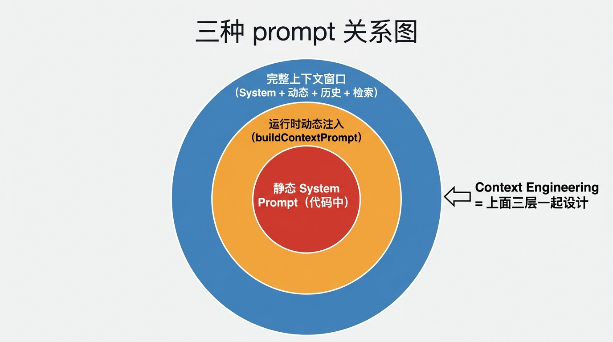
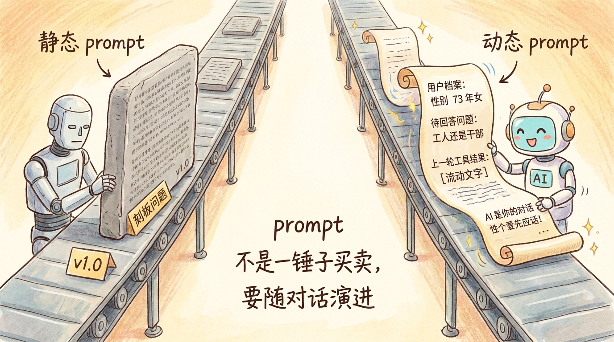
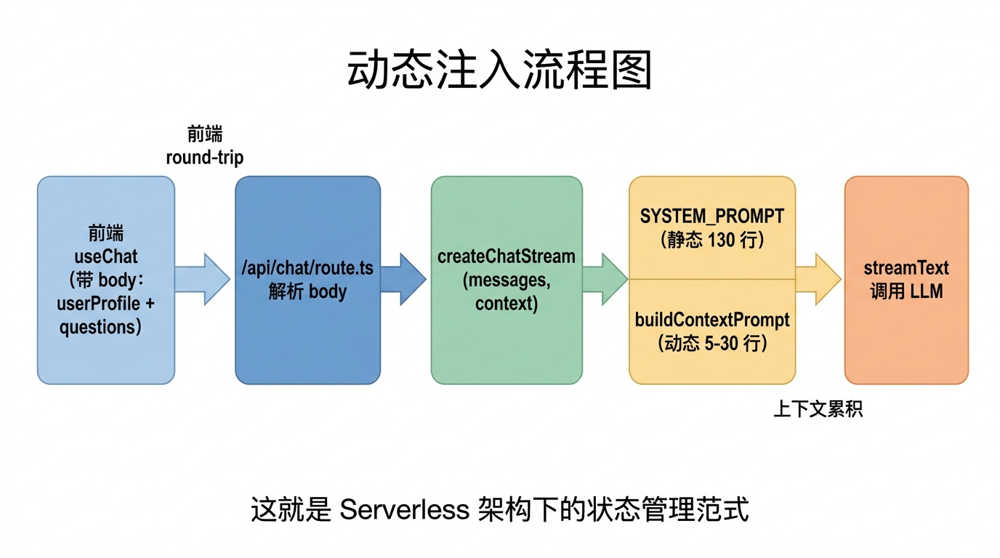
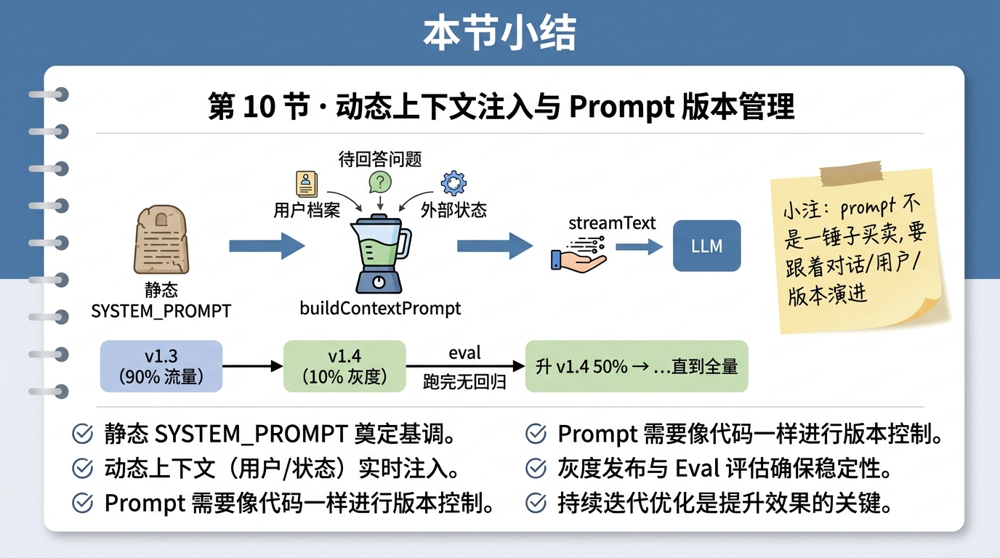

# 第 10 节 · 动态上下文注入与 Prompt 版本管理：让 Prompt 跟着对话演进


<!-- 图片说明（给图片代理）：
风格：手绘风,温暖封面
内容：画面分两条流水线。左边是"静态 prompt"——一块写满字的石碑,贴着"P1.0"标签,旁边一个机械人毫无表情地照念。右边是"动态 prompt"——一块魔法卷轴,卷轴上的字会随对话变化:有用户档案标签(性别 75 年女)、有"待回答问题:工人还是干部"、有"上一轮工具结果"等流动文字。一只活灵活现的 AI 角色在卷轴前,根据当前内容做出针对性回复。中间手写小字:"prompt 不是一锤子买卖,要随对话演进"。
中文标注,字体亲切
-->

> **预计时长**：阅读 30 分钟 / 实战 60 分钟
> **前置知识**：第 09 节《System Prompt 11 节分层设计法》
> **本节代码**：`ssp-web` 仓库 `chapter-10` tag · 主要文件 `src/lib/ai/prompts.ts`、`src/lib/ai/agent.ts`

我让两个朋友各试 SSP 一次。

第一个朋友小赵，1975 年的女工，第一次来。她说「我 75 年的，普通工人」。Agent 立刻调 computePlan，给出退休时间表。

第二个朋友老李，65 岁，已经退休 5 年。**他打开页面看到的开场白和小赵一模一样**：「我是 SSP 助手，可以帮你算社保规划。请问你的性别和出生年份？」

老李 5 年前就退休了，他根本不需要算"什么时候退休"，他想问的是"医保怎么继续缴"。但 Agent 不认得他——它不知道老李已经在数据库里有完整 profile，不知道他过去聊了 8 次都是医保问题，不知道他根本不需要再回答「性别和出生年份」。

**问题不在 Agent 笨。问题在 prompt 是死的。**

System Prompt 写好之后扔在 `prompts.ts` 里就不动了，每个用户、每段对话、每个时间点都看到完全一样的指令——这等于让 LLM 戴着面具上场，对所有人都演同一出戏。这一节就是要拆掉这层面具：让 prompt **跟着对话演进**，让 prompt **跟着用户演进**，让 prompt **跟着版本演进**。

---

## 一、知识铺垫：静态 prompt vs 动态 prompt vs 上下文工程

要把"动态注入"讲清楚，先把三个概念分清楚。

### 静态 Prompt

写在代码里、所有用户共享、整个生命周期不变的部分。SSP 里就是 `prompts.ts:10-169` 里那个 `SYSTEM_PROMPT` 常量（详见[第 09 节《System Prompt 11 节分层设计法》](./10-system-prompt.md)）。

特点：

- **简单**：写一次到处用
- **可缓存**：所有请求复用同一段 prompt（详见 R1 §8 prompt caching）
- **统一行为**：所有用户看到一致的人设
- **缺点**：不认人、不认场景、不认状态

### 动态 Prompt（运行时注入）

每次请求时**根据上下文动态拼接**的部分。SSP 里这部分由 `buildContextPrompt(questions, userProfile)` 函数生成（`prompts.ts:214-321`）。

特点：

- **个性化**：每个用户每次请求看到不同
- **场景化**：根据当前对话状态变
- **不可缓存**（拼接出来的部分）：每次重生成
- **缺点**：复杂度上升，要小心 token 爆炸

### 上下文工程（Context Engineering）

整个上下文窗口的工程化设计——**包括** System Prompt + Tool Schema + 动态注入 + 历史 messages + 检索到的知识，**全部加起来**怎么组织。这是 2024 年之后业界对"prompt 工程"的升级叫法。

> **划重点**：**静态 prompt 是地基，动态 prompt 是装修**。地基决定能造什么楼，装修决定每个房间长啥样。两者协作才能造出"不同用户进来看到不同房间"的 Agent。



<!-- 图片说明：
风格：信息图(infographic),扁平专业
内容：三个同心圆嵌套:
最内层(红色):"静态 System Prompt(代码中)"
中间层(橙色):"运行时动态注入(buildContextPrompt)"
最外层(蓝色):"完整上下文窗口(System + 动态 + 历史 + 检索)"
旁边小注:"Context Engineering = 上面三层一起设计"
中文标注,字号清晰
-->

---

## 二、核心讲解

### 2.1 三种动态注入方式:按用户 / 按对话 / 按外部状态

动态注入按"数据来源"分三大类：

| 类型 | 数据从哪来 | 典型用例 | SSP 里有没有 |
|---|---|---|---|
| **按用户档案** | 数据库 / 用户表 | 性别、出生年份、历史 profile | ✅ `userProfile` 注入 |
| **按对话历史** | 当前会话 messages | 上一轮工具调用结果、未答完的问题 | ✅ `questions` 注入 |
| **按外部状态** | 时间 / 天气 / 政策版本 | 「今天是 2026-04-26」「政策包 2024 版」 | ⚠️ 部分(政策包 as_of_date) |



<!-- 图片说明：
风格：信息图(infographic),扁平专业,数据流图
内容：三条输入流(左侧)汇入中间的"动态上下文拼接器",再接到右侧的 system message 末尾。
  - 流 1 按用户档案(数据库图标,标 userProfile)
  - 流 2 按对话历史(消息气泡图标,标 questions)
  - 流 3 按外部状态(时钟/日历图标,标 as_of_date)
中间拼接器把三股信息合并,箭头指向"静态 SYSTEM_PROMPT + 动态段"的 system 文本块。
中文标注,字号清晰
-->

#### 第 1 类:按用户档案动态注入

最常见也最重要的一类。每个用户的 profile 不同，prompt 中"已知信息"段就不同。

SSP 的实现（节选自 `prompts.ts:187-209`）：

```typescript
// src/lib/ai/prompts.ts:187-209 (节选)
export interface UserProfileSummary {
  basic?: { birth_year?: number; gender?: "male" | "female"; female_retire_type?: "worker50" | "cadre55" };
  social?: { pension_contrib_months?: number; medical_contrib_months?: number };
  status?: { employment_status?: string };
  objective?: { type?: string };
}

export function buildContextPrompt(
  questions: AgentQuestion[] = [],
  userProfile?: UserProfileSummary,
): string {
  const sections: string[] = [];
  // 1. 注入已知用户档案
  if (userProfile && hasAnyField(userProfile)) {
    sections.push(formatUserProfile(userProfile));
  }
  // 2. 注入待回答问题(下一节讲)
  if (questions.length > 0) {
    sections.push(formatQuestions(questions));
  }
  return sections.join("\n\n");
}
```

`formatUserProfile` 把对象变成 prompt 友好的文本（节选）：

```text
# 当前已知用户信息(已累积,直接用于 computePlan)
- 出生年份: 1973 年
- 性别: 女
- 女性退休口径: 普通工人(50 岁起步)
- 养老保险已缴: 216 个月
- 医保已缴: 180 个月
- 就业状态: 灵活就业
```

> **看这里 →**：注意写法是**面向 LLM 友好的自然语言列表**，不是 JSON。给 LLM 看 `"birth_year": 1973` 不如给「出生年份: 1973 年」——多一点中文上下文，LLM 推理更准。这是 R5 §9.2 实测过的现象。

为什么这么做？

- **省 token**：profile 有 8 个字段，但本轮可能只用到 3 个。注入相关字段比每轮重发完整 profile 省
- **防遗忘**：messages 历史可能很长，profile 信息可能被淹没。把它**前置**到 system 末尾，LLM 注意力集中在这
- **防覆盖**：用户在第 5 轮临时改口"我是干部不是工人"，profile 可以根据用户最新输入重新注入，不需要靠 LLM 自己捕捉变化

#### 第 2 类:按对话历史动态注入

最典型的就是**待回答问题**——规则引擎跑完后，发现用户还缺 `female_retire_type`，把这个问题打包扔到 prompt 里让 LLM 下一轮问。

SSP 的实现（节选自 `prompts.ts:176-182`）：

```typescript
// src/lib/ai/prompts.ts:176-182 (节选)
export interface AgentQuestion {
  question_id: string;
  text: string;
  field?: string;
  options?: Array<{ label: string; value: string }>;
}

function formatQuestions(questions: AgentQuestion[]): string {
  const header = "# 规则引擎待解决的问题";
  const guide = "以下字段缺失或需要确认,请用通俗易懂的语言逐一向用户追问。";

  const items = questions.map((q) => {
    const lines = [`- 字段 \`${q.field ?? q.question_id}\``];
    if (q.text) lines.push(`  提示: ${q.text}`);
    if (q.options?.length) {
      const opts = q.options
        .map((o) => `"${o.label}"(值=${o.value})`)
        .join("、");
      lines.push(`  可选项: ${opts}`);
    }
    return lines.join("\n");
  });

  return [header, guide, ...items].join("\n");
}
```

最终注入到 prompt 末尾的内容长这样：

```text
# 规则引擎待解决的问题
以下字段缺失或需要确认,请用通俗易懂的语言逐一向用户追问。
- 字段 `female_retire_type`
  提示: 您是普通工人还是管理岗/干部?
  可选项: "普通工人(50 岁)"(值=worker50)、"管理岗/干部(55 岁)"(值=cadre55)
```

> **看这里 →**：把 `value=worker50` 直接写在 prompt 里，是在**告诉 LLM 怎么把用户回答映射成结构化字段**。用户说"我是工人"→ LLM 调 `updateProfile({ female_retire_type: "worker50" })`。如果不在 prompt 里给映射，LLM 会瞎猜。

#### 第 3 类:按外部状态动态注入

外部状态是指**不依赖用户、不依赖对话**的环境信息。SSP 在这一类里只用了一点点——政策包的 `as_of_date`：

```typescript
// 示意,非项目实际代码
const externalContext = `
# 政策时效信息
当前政策包: SHANGHAI_BASE（2024 生效版）
有效日期: ${asOfDate}(${formatHumanDate(asOfDate)})
2030 年起最低缴费年限会从 15 年逐步提到 20 年
`;
```

更激进的用法是注入「当前时间」：

```typescript
// 示意,非项目实际代码
const timeContext = `
# 当前时间
${new Date().toISOString().split("T")[0]}(${getCurrentSeason()})
计算"今年"、"明年"、"已经退休几年"等相对时间时使用本日期。
`;
```

LLM **训练数据有时间截止**——它不知道"今天"是哪天。如果你的 Agent 涉及任何"今年"、"距离 X 还有多久"、"最近 30 天"这种相对时间，**必须**注入当前时间。

---

### 2.2 SSP 怎么把动态上下文拼到 system message

来看完整流程。`agent.ts:47-79` 的 `createChatStream` 是入口：

```typescript
// src/lib/ai/agent.ts:47-79
export function createChatStream(
  messages: ModelMessage[],
  context?: ChatContext,
  onFinish?: (result: { text: string }) => void | Promise<void>,
) {
  const { apiKey, baseURL, model } = getOpenAIConfig();
  const openai = createOpenAI({ apiKey, baseURL });

  // 静态 SYSTEM_PROMPT 永远在,动态部分由 buildContextPrompt 生成
  const contextPrompt = context
    ? buildContextPrompt(context.questions ?? [], context.userProfile)
    : "";
  // 拼接:静态 + 两个换行 + 动态
  const systemPrompt = contextPrompt
    ? `${SYSTEM_PROMPT}\n\n${contextPrompt}`
    : SYSTEM_PROMPT;
  return streamText({
    model: openai(model),
    system: systemPrompt,
    messages,
    providerOptions: {
      openai: { store: false },
    },
    tools,
    stopWhen: stepCountIs(8),
    temperature: 0.3,
    onFinish,
  });
}
```

> **看这里 →**：拼接顺序是**静态在前，动态在后**。这一点很关键——LLM 处理 system 时，**末尾的指令优先级更高**。把"当前用户的具体情况"放最后，模型回复时会优先参考这部分。

完整的 system 内容流向：

```
前端发请求 (含 conversationId / userProfile / questions)
    ↓
/api/chat/route.ts:230-261 解析 body
    ↓
context = { questions, userProfile }
    ↓
agent.ts: createChatStream(messages, context)
    ↓
SYSTEM_PROMPT (静态 169 行)
    +
buildContextPrompt (动态 5-30 行,看上下文有多少)
    ↓
streamText({ system: 拼好的字符串, messages, tools })
    ↓
LLM 看到的完整 system = 静态契约 + 当前对话状态
```



<!-- 图片说明：
风格：信息图(infographic),扁平专业,数据流图
内容:横向 5 个方块从左到右:
1. 前端 useChat(带 body: userProfile + questions)
2. /api/chat/route.ts 解析 body
3. createChatStream(messages, context)
4. SYSTEM_PROMPT(静态 169 行) + buildContextPrompt(动态 5-30 行)
5. streamText 调用 LLM
箭头:从 1 到 5,中间标注 "前端 round-trip"、"上下文累积"
底部小字:"这就是 Serverless 架构下的状态管理范式"
中文标注,字号清晰
-->

> **划重点**:**questions 和 userProfile 都是从前端 body 传来的,服务端自己不维护状态**。这是 Serverless 架构必须遵守的原则——服务端无状态,所有上下文要么从 DB 取,要么从客户端传(详见[第 18 节《Agent 记忆系统》](./19-agent-memory.md))。

---

### 2.3 Prompt 版本管理:别在生产改 prompt 不留痕

写好的 prompt 不是写完就完事。SSP 在开发期间改了 **20+ 版** prompt——有些改动让效果显著提升（加了"绝不自行计算"），有些改动看似无害却引入回归（精简了政策要点段落，结果 LLM 开始自己编数字）。

**没有版本管理的 prompt 迭代,就是在黑暗中摸索。**

#### 用 Git 管 prompt 文件就够了吗?

部分够，部分不够。

够的部分：
- 每次 prompt 修改 = 一个 git commit，diff 看得见
- 回滚 = `git revert`，几秒钟搞定

不够的部分：
- 你想做**灰度发布**——50% 用户用 P1.3，50% 用户用 P1.4，看哪个更好。git 做不到
- 你想做 **A/B 实验**——同一个用户多个 prompt 轮换看效果。git 做不到
- 你想**保留多个版本同时存在**，能瞬间切换。git 也做不到

所以生产级 Agent 通常会做"prompt 命名版本"+"运行时选择"。

#### SSP 还没做的(但你应该做的)版本管理

下面是一段**演进方向的示例代码**（标注：示意，非项目实际代码）。SSP 现在 `prompts.ts` 里只导出一个 `SYSTEM_PROMPT`，演进版会变成：

```typescript
// src/lib/ai/prompts/versions.ts (示意,非项目实际代码)
// 每个版本带 prompt 文本 + changelog + enabledRatio(灰度比例) + deprecated 标记
export const PROMPT_VERSIONS = {
  "P1.2_2025-03-10": { prompt: V1_2_PROMPT, enabledRatio: 0, deprecated: true },
  "P1.3_2026-04-15": { prompt: V1_3_PROMPT, enabledRatio: 100 }, // 全量上线
  // ... 更多历史版本,每个一行
};

export function getPromptForUser(userId: string) {
  const versions = Object.entries(PROMPT_VERSIONS).filter(
    ([_, v]) => v.enabledRatio > 0,
  );
  // 灰度策略:按 userId hash 落到某个版本(累积比例区间)
  const bucket = hashUserId(userId) % 100;
  let cumulative = 0;
  for (const [name, v] of versions) {
    cumulative += v.enabledRatio;
    if (bucket < cumulative) return { version: name, prompt: v.prompt };
  }
}
```

> **看这里 →**：`enabledRatio` 是灰度比例。"P1.3 100% + P1.4 0%" = 全量在 P1.3；"P1.3 90% + P1.4 10%" = 10% 灰度试新版。

#### 灰度发布 + 回滚

灰度发布的核心问题是**怎么把用户分到不同 prompt 版本**。两种主流方案：

**方案 A:按 user 落桶（确定性）**

```typescript
// 示意,非项目实际代码
const bucket = hashUserId(userId) % 100;
const version = bucket < 10 ? "P1.4" : "P1.3";
```

同一个用户**永远落到同一个版本**——这是关键。如果一个用户在第 1 轮用 P1.3、第 2 轮用 P1.4，对话上下文不一致，体验崩。

**方案 B:按请求随机（非确定性）**

```typescript
// 示意,非项目实际代码
const version = Math.random() < 0.1 ? "P1.4" : "P1.3";
```

适合无状态的单次请求场景（如分类、抽取）。多轮对话**严禁用这个**。

回滚同样关键。生产 prompt 出问题，要做到「**3 分钟内回滚**」：

```typescript
// 示意,非项目实际代码
// 把 P1.4 比例从 10 降到 0,P1.3 从 90 升到 100
PROMPT_VERSIONS["P1.4_2026-04-25"].enabledRatio = 0;
PROMPT_VERSIONS["P1.3_2026-04-15"].enabledRatio = 100;
```

只要这是个环境变量或 feature flag，改一下重新部署/热更新就完成回滚。

> **划重点**:**永远保留至少 3 个最近版本可瞬间回滚**。出事时不要分析、不要慌——先回滚到上一个稳定版,再慢慢查 root cause。这是工程纪律,跟代码 deploy 一样的逻辑。

---

### 2.4 A/B 测试 prompt:每个版本配一组 eval 用例

灰度上线只能告诉你**线上没炸**。它告诉不了你**新版到底比旧版好多少**。这就需要 A/B 测试 + eval。

#### A/B 测试的最小可行架构

| 组件 | 职责 | 工具 |
|---|---|---|
| **流量切分** | 按 userId hash 落桶 | feature flag(LaunchDarkly / Unleash / 自建) |
| **数据收集** | 记录每次请求的 promptVersion + outcome | DB 表 `prompt_runs` |
| **指标计算** | 任务成功率、token 成本、延迟 | SQL 聚合 / 仪表板 |
| **统计显著性** | 决定何时收 |
chi-square / t-test |
| **决策** | 全量 / 回滚 | 看仪表板,人决策 |

#### Eval 用例:每个版本配一组黄金样本

eval 的核心思想：**冻结一组测试用例,跑每个 prompt 版本,看通过率**。

SSP 的 eval 用例长这样（演进示意）：

```typescript
// src/eval/cases.ts (示意,非项目实际代码)
export const evalCases: EvalCase[] = [
  {
    id: "case_01_tier1_immediate_compute",
    rule: "Tier 1 字段齐就立刻调 computePlan",
    input: [{ role: "user", content: "我是 73 年的女工" }],
    expected: {
      tool_calls: [
        { name: "computePlan", args_match: { gender: "female", birth_year: 1973 } },
      ],
      no_direct_number: true, // LLM 不能直接给"50 岁退休"
    },
  },
  // ... 每条 case 对应一条核心规则:绝不自行计算、累积用户信息、追问缺失字段……(约 50-100 条)
];
```

> **看这里 →**:这些 case 全部**直接对应**[第 09 节](./10-system-prompt.md)的 8 条核心规则——一条规则配 5-10 个 case。这就是「prompt 必须能跑 eval」的具体落地方式。

每次改完 prompt，跑：

```bash
pnpm test:eval --version=P1.4_2026-04-25
```

输出大概是：

```
Eval Results for P1.4_2026-04-25
Total cases: 87   Passed: 81 (93.1%)   Failed: 6
Failed: case_03_accumulate_profile (regression vs P1.3 - was passing) ...
Pass rate diff vs P1.3: -1.2pt   Cost: +5.4%   Latency p50: +120ms
⚠️  P1.4 has regression. Recommend NOT rolling out.
```

> **划重点**:**通过率下降即回归**。立刻不上线,分析 root cause,改 prompt 再跑。pass rate 上升才允许灰度。

#### A/B 测试的统计显著性

灰度跑了一周，P1.3 通过率 91%，P1.4 通过率 93%——能说 P1.4 好吗？

**取决于样本量**。如果 P1.4 只跑了 10 个 case，2 个 pass 差距没意义。如果 P1.4 跑了 1000 个 case，2pt 差距很可能是真的。

最小检验：用 chi-square test 算 p-value，p < 0.05 才说有显著差异。生产 A/B 工具（Optimizely、Statsig）都会自动给你算。

---

### 2.5 与 Eval 的接口:每次改 prompt 必须跑回归

这一段我把 R4（评测体系）的**最关键一句**摆在这里：

> **任何 prompt 改动都必须配套 eval 用例。** 没有 eval 的 prompt 修改不许进 main 分支。

具体怎么配套？三种力度：

#### 力度 1:CI 自动跑(强制)

```yaml
# .github/workflows/eval.yml (示意,非项目实际代码)
# prompt 文件一改动就触发,跑 eval 并和 main 对比
on:
  pull_request:
    paths: ["src/lib/ai/prompts**", "src/lib/ai/agent.ts"]
# steps: pnpm install → pnpm test:eval → 与 main 对比并卡阈值
#   run: pnpm test:eval:compare-main --threshold=-2pt
```

`--threshold=-2pt` 意思是「**如果通过率比 main 分支低 2 个百分点以上,直接 fail CI**」。这条命令就是工程纪律的具象化。

#### 力度 2:发布门禁(Code Review 时检查)

PR 模板加一项：

```markdown
- [ ] 是否修改了 prompt?
  - [ ] 是 → 必须附 eval 报告(`pnpm test:eval` 输出截图)
  - [ ] 是 → 必须新增至少 1 条 eval case 覆盖本次改动
- [ ] 是否引入新的核心规则?
  - [ ] 是 → 必须新增至少 5 条 eval case
```

#### 力度 3:线上监控(灰度阶段持续观察)

灰度上线后,**线上指标也是 eval 的延伸**:

| 指标 | P1.3 | P1.4 (灰度 10%) | 判断 |
|---|---|---|---|
| 工具调用率 | 87% | 84% | ⚠️ 下降 3pt |
| 平均 token 成本 | $0.012 | $0.014 | ⚠️ 上升 17% |
| 用户继续对话率 | 73% | 75% | ✅ 上升 2pt |
| 完成 plan 率 | 64% | 67% | ✅ 上升 3pt |

如果某个核心指标下降超过阈值，**自动停止灰度**回滚到 P1.3。

---

### 2.6 模型迁移时 prompt 的迁移成本

第 09 节最后讲到，不同模型对 prompt 反应差异很大。这一节聊**怎么算迁移成本**。

#### 迁移路径与成本估算（基于 R5 + 加餐 3）

| 迁移路径 | 主要工作 | 估算时间 | 风险点 |
|---|---|---|---|
| `gpt-4o-mini` → `gpt-5.4-mini`（同家） | 几乎无改动 | 0.5 天 | 价格变化 |
| `gpt-4o-mini` → `Claude Haiku 4.5` | prompt 风格调整 + 跑 eval | 3-5 天 | 拒答倾向高,XML vs Markdown |
| `gpt-4o-mini` → `Gemini 2.5 Flash` | prompt 风格调整 + few-shot 增强 | 5-7 天 | 中文质感差 |
| `gpt-4o-mini` → `DeepSeek V4` | 改 base_url + prompt 复用 95% | 1-2 天 | 国内合规 OK |
| OpenAI Chat Completions → Responses API | tool schema 调整 | 1-2 天 | reasoning + tool 不兼容 |

**SSP 现在用的是 `gpt-4o-mini` + Chat Completions（兼容协议）**。如果要迁到生产级,**最划算的路径**是:

```
SSP 现状(gpt-4o-mini)
    ↓
第一步: 升级到 gpt-5.4-mini (0.5 天)
    + 性能提升 ~30%
    + 价格升($0.75 vs $0.15) 但能力性价比更好
    ↓
第二步: 试点 Claude Haiku 4.5 (3 天)
    + 长程 tool 链路准确率提升
    + 中文质感更好
    + 价格升($1 vs $0.75) 需要评估值不值
    ↓
第三步: 把"难任务"切到 Sonnet 4.6 (2 天 + 路由层)
    + 难判断的退休口径用大模型
    + 简单查询继续用小模型
    + 总成本可控
```

#### Prompt 迁移成本拆解

迁一个 SSP 等量级的 11 节 prompt 到 Claude，要做的事：

| 工作 | 工时 | 备注 |
|---|---|---|
| 把 `# 角色 / # 核心规则` 改成 `<role> / <rules>` 标签 | 0.5 天 | Claude 偏好 XML |
| 在 # 数据收集优先级 加 1-2 个 few-shot 例子 | 0.5 天 | Claude 接受少量 example |
| 重复关键规则 2-3 次 | 0.5 天 | Claude 4.x 比 GPT 听话,但重要规则仍要重复 |
| 跑 eval 看哪些 case 回归 | 0.5 天 | 必跑 |
| 修复回归(改 prompt 措辞) | 1-2 天 | 关键投入 |
| 灰度上线 10% 流量观察 | 1 周 | 用户行为数据收集 |

**总计**：5-7 天能完成一个中型 Agent prompt 的 Claude 迁移。详见加餐 3《模型迁移实战》。

> **划重点**:**任何模型迁移都不是改个 base_url 就完了**。prompt 风格、tool schema、行为微调,要走完整套 eval 验证。**别为了便宜几分钱抢迁——出事的代价比节省的成本大得多**。

---

## 三、举一反三

**法律咨询 Agent 的动态上下文**：用户档案动态注入「当前案件的事实要素」（时间、当事人、争议点）；对话历史动态注入「上一轮 lookupCase 检索到的判例摘要」；外部状态注入「当前生效的法律版本」（民法典 2024 修正案 vs 2020 版）。Prompt 版本管理：每次法律解读规则改动必须有完整 eval（用历史真实案件做黄金样本），灰度时按律师事务所分桶（不同事务所对接不同版本）。

**医疗问诊 Agent 的动态上下文**：用户档案注入「过敏史 + 长期用药 + 既往病史」，对话历史注入「上一轮 lookupGuideline 检索到的诊疗指南片段」，外部状态注入「当前流行病季节」（流感季 / 过敏季的不同提示）。Prompt 版本管理**最严格**：医疗 prompt 改动必须**双盲 eval**——医生人工评分 + LLM-as-Judge，两者一致才算通过。灰度按医院分桶，禁止同时跨多家医院做 A/B（医疗合规要求）。

**报税 / 个税 Agent 的动态上下文**：注入「上一年度报税档案」+「本年度收入累积」+「政策版本」（国务院某年某月生效的新政）。每次税务政策变更必须立刻发布新 prompt 版本，灰度可以按"用户上一年纳税档次"分桶（高净值人群优先享用稳定版，低风险用户做新版试点）。

**核心原则**:**动态注入的内容越个性化,Agent 越像"懂你的助手"。但内容要有边界——只注入对当前对话有用的部分,别把整个用户档案 dump 进 prompt(token 烧光,LLM 还分心)**。

---

## 四、小结



<!-- 图片说明：
风格：手绘风,小结卡片
内容：一张笔记本,顶部"第 10 节·动态上下文注入与 Prompt 版本管理"。中间画一个流水线:
左:静态 SYSTEM_PROMPT(一块石碑) → 中:buildContextPrompt(一个搅拌机,把"用户档案 + 待回答问题 + 外部状态"3 个原料拌进去) → 右:streamText(一只手把搅好的内容递给 LLM)
下方版本管理流程:
"P1.3 (90% 流量) ←→ P1.4 (10% 灰度) → eval 跑完无回归 → 升 P1.4 50% → ...直到全量"
旁边手写小注:"prompt 不是一锤子买卖,要跟着对话/用户/版本演进"
底部 5 个手写要点
中文标注,字体亲切
-->

System Prompt 不是写完就完事——它要跟着对话演进、跟着用户演进、跟着版本演进。

**三种动态注入方式**：按用户档案（最常见）、按对话历史（待回答问题）、按外部状态（时间 / 政策版本）。SSP 用 `buildContextPrompt(questions, userProfile)` 把这些拼到 system message 末尾。

**Prompt 版本管理**：用命名版本 + 灰度比例 + eval 通过率，让 prompt 修改像代码一样可控。SSP 现状只有一个版本，演进方向是 `PROMPT_VERSIONS` 字典 + `getPromptForUser` 路由。

**A/B 测试**：每个 prompt 版本配 50-100 条 eval 用例（覆盖 8 条核心规则）。通过率不升不上线，通过率下降立刻回滚。

**与 Eval 的接口**：CI 强制跑回归 + PR 模板检查 + 线上指标监控，三层把住关口。**任何 prompt 改动必须配套 eval**——这是工程纪律。

**模型迁移成本**：迁 Claude / Gemini 都不是改 base_url 那么简单，prompt 风格、tool schema、跑 eval 一套下来 5-7 天。详见加餐 3。

**核心要点回顾**：

- ✅ 静态 prompt 是地基,动态 prompt 是装修,Context Engineering 是整体设计
- ✅ 三种动态注入:按用户档案 / 按对话历史 / 按外部状态
- ✅ SSP 的 `buildContextPrompt` 把待回答问题和用户档案拼到 system 末尾
- ✅ Prompt 版本管理:命名 + 灰度比例 + 灰度落桶(按 userId 不按请求)
- ✅ A/B 测试用 eval 用例做黄金样本,通过率不升不上线
- ✅ 与 Eval 的接口:CI 强制 + PR 检查 + 线上监控,三层兜底
- ✅ 模型迁移成本:5-7 天 / 中型 Agent,绝不是改 base_url 那么简单

---

## 思考题

1. **【开放题】**：本节给出的「按 userId 落桶做灰度」方案，对**匿名用户**（如 SSP 的 C 端 anon-session,详见[第 08 节《认证与多用户》](./09-auth-and-session.md)）会不会有问题？匿名用户没有稳定 ID，cookie 30 天滚动续期，会不会出现「同一个用户跨天落到不同版本」的情况？说说你怎么调整桶定位策略。

2. **【动手题】**：在本地 clone `ssp-web`，修改 `src/lib/ai/prompts.ts:214-321` 的 `buildContextPrompt`，在最后加一段「外部状态」注入：当前日期 + 政策包 `as_of_date`。然后跟 Agent 说「我是 73 年的女工，今年 50 岁了应该退休吧」。**验收标准**：观察 Agent 的回复中是否引用了"今年（2026 年）"作为参照，是否提到了延迟退休政策——如果改前不引用、改后引用，说明动态注入生效。把两次对话截图保存。

3. **【选做】**：实现一个最小版本的 prompt 版本管理：在 `src/lib/ai/prompts/versions.ts` 创建一个字典，包含 `P1.0` 和 `P1.1` 两个版本（差异：P1.1 把第 8 条规则措辞改强为「**强制**每轮调 updateProfile」）。写一个 `getPromptForUser(sessionId)` 函数，按 sessionId hash 50/50 落桶。在 `agent.ts` 里调用这个函数。然后准备 10 条 eval 用例（覆盖 updateProfile 调用率），分别跑 P1.0 和 P1.1，对比通过率。**验收**：写一份 200 字 A/B 报告，包括样本量、pass rate、token 成本差异、是否建议全量上线 P1.1。

---

## 面试题

**Q1.【基础】【主题：Prompt 与上下文工程】** 静态 Prompt、动态 Prompt、上下文工程（Context Engineering）三者是什么关系？SSP 用哪个函数生成动态部分，拼接时为什么把动态部分放在 system message 末尾？
<details><summary>参考解答</summary>

三者关系：**静态 Prompt 是地基，动态 Prompt 是装修，上下文工程是整体设计**。

- **静态 Prompt**：写死在代码里、所有用户共享、整个生命周期不变（SSP 的 `SYSTEM_PROMPT` 常量），可缓存、统一行为，但不认人；
- **动态 Prompt**：每次请求按上下文拼接（SSP 的 `buildContextPrompt(questions, userProfile)`），个性化、场景化，但不可缓存、要防 token 爆炸；
- **上下文工程**：整个上下文窗口的工程化设计，包括 System Prompt + Tool Schema + 动态注入 + 历史 messages + 检索知识全部加起来怎么组织。

SSP 拼接顺序是**静态在前、动态在后**（`${SYSTEM_PROMPT}\n\n${contextPrompt}`）。原因是 LLM 处理 system 时**末尾指令优先级更高**，把"当前用户的具体情况"放最后，模型回复时会优先参考这部分。

</details>

**Q2.【进阶】【主题：Prompt 与上下文工程】** 动态注入按数据来源分哪三类？为什么说在 Serverless 架构下「服务端不维护对话状态」是动态注入必须遵守的前提？
<details><summary>参考解答</summary>

三类动态注入：

1. **按用户档案**——来自数据库 / 用户表（性别、出生年份、历史 profile），SSP 注入 `userProfile`；
2. **按对话历史**——来自当前会话 messages（上一轮工具结果、未答完的问题），SSP 注入 `questions`；
3. **按外部状态**——来自时间 / 政策版本等环境信息（如注入"当前日期"，因为 LLM 训练数据有时间截止，不知道"今天"是哪天）。

Serverless 前提：SSP 的 `questions` 和 `userProfile` 都是**从前端 body 传来的**，服务端自己不维护状态。因为 Serverless 函数是无状态的、随时可能冷启动/横向扩容，没有常驻内存保存"这个用户上一轮聊到哪"。所以所有上下文要么从 DB 取、要么从客户端传，每次请求重新拼装。这保证了任意一台函数实例都能独立处理任意一次请求。

</details>

**Q3.【深挖】【主题：Prompt 与上下文工程】** 为什么 Git 管 prompt 文件不足以支撑生产级 prompt 迭代？请描述一套「命名版本 + 灰度 + eval 回归」的 prompt 版本管理方案，并说明灰度落桶为什么要「按用户」而不是「按请求」。
<details><summary>参考解答</summary>

Git 够用的部分：每次改 prompt 一个 commit、diff 可见、回滚用 `git revert`。不够的部分：做不了**灰度发布**（50% 用户用新版）、做不了 **A/B 实验**、做不了**多版本同时存在瞬间切换**——这些都是"运行时按流量选版本"的需求，Git 是"代码版本"不是"流量版本"。

一套生产方案：

1. **命名版本**：用 `PROMPT_VERSIONS` 字典，每个版本带 `changelog` + `enabledRatio`（灰度比例）+ `deprecated` 标记；
2. **灰度落桶**：`getPromptForUser(userId)` 按 userId hash 落到某个版本；
3. **eval 回归**：每个版本配 50-100 条黄金样本（覆盖核心规则），通过率不升不上线、下降立刻回滚；CI 强制 + PR 检查 + 线上指标三层兜底。

灰度必须**按用户落桶（确定性）**而不是**按请求随机**：多轮对话里，如果同一个用户第 1 轮用旧版、第 2 轮用新版，prompt 行为不一致会让对话上下文断裂、体验崩坏。按 userId hash 能保证"同一个用户永远落到同一个版本"。按请求随机只适合无状态的单次请求场景（分类、抽取）。

</details>

---

## 延伸阅读

- [Anthropic Prompt Caching 官方文档（缓存动态部分的最佳实践）](https://docs.anthropic.com/claude/docs/prompt-caching)
- [Vercel AI SDK v6 system prompt 拼接机制](https://ai-sdk.dev/docs/foundations/prompts)
- [Promptfoo - Prompt 评测开源工具](https://www.promptfoo.dev/)
- [Statsig - feature flag 与 A/B 测试](https://statsig.com/)
- [Andrej Karpathy on Context Engineering（推文系列 2024）](https://twitter.com/karpathy/status/1745663700588937341)

---

[← 上一节：第 09 节 System Prompt 11 节分层设计法](./10-system-prompt.md) · [📚 目录](./README.md) · [下一节：第 11 节 Tool Calling 协议 →](./12-tool-calling.md)
