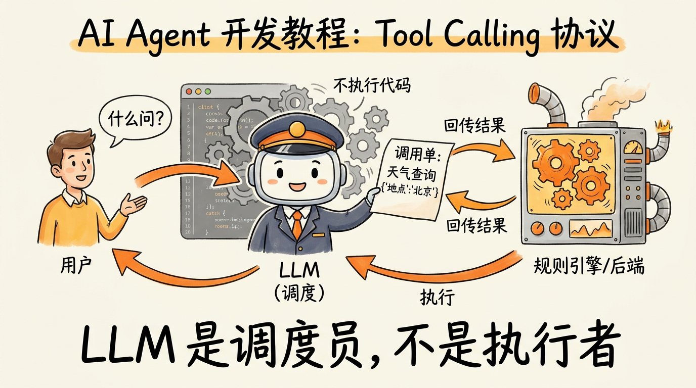
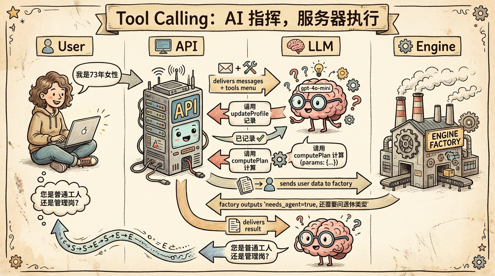
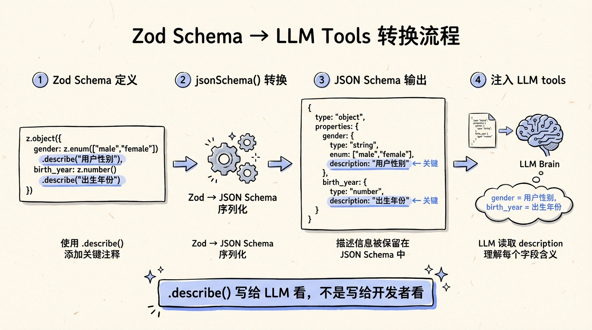

# 第 11 节 · Tool Calling 协议：LLM 从来不执行代码



> **预计时长**：阅读 30 分钟 / 实战 60 分钟
> **前置知识**：第 10 节《动态上下文注入与 Prompt 版本管理》、对 JSON Schema 与 Zod 有基础了解
> **本节代码**：`ssp-web` 仓库 `chapter-11` tag · 主要文件 `src/lib/ai/tools.ts`、`src/lib/ai/agent.ts`、`src/app/api/chat/route.ts`

---

那天群里的产品经理截图扔过来一句话：

> "我让 ChatGPT 算一下我妈什么时候能退休，它给我编了个'符合 2008 年人社部某文件'。我妈 1973 年出生的，2008 年那个文件根本不可能预知她现在的退休年龄。"

这就是为什么 SSP 必须有工具系统。光靠 LLM 自己心算社保规划——你能想象出来的所有失败模式，它都会犯一遍：算错延迟退休渐进表、把缴费月数当成年数、把上海的政策套到深圳头上、把 2025 年新政当成 2015 年的旧规来用。

不是 LLM 不努力。是这件事根本不该让 LLM 来算。

那应该让谁算？规则引擎。怎么把 LLM 跟规则引擎接起来？**Tool Calling 协议**。

但是 Tool Calling 这个名字很容易让人误解——很多人以为这是"让 LLM 帮你跑代码"。

不是。

这一节就把 Tool Calling 的真相讲清楚——它到底是个什么协议、谁来执行代码、怎么用 Vercel AI SDK v6 把它跑起来、不同模型在 Tool Calling 上的真实表现差多少。

---

## 一、知识铺垫：Tool Calling 协议的三方分工

### 1.1 一个非常普遍的误解

很多人把"AI Agent 调用工具"想象成这样：

> 用户说"算一下我什么时候退休"，LLM 看到这是个计算需求，于是在自己脑子里执行了 `computePlan({...})` 函数，拿到结果，再翻译给用户。

这个心智模型**完全是错的**。

LLM 在 Tool Calling 这件事里只做一件事——**生成一份 JSON 格式的"调用请求单"**。这个请求单长这样：

```json
{
  "tool_calls": [
    {
      "id": "call_xyz",
      "type": "function",
      "function": {
        "name": "computePlan",
        "arguments": "{\"basic\":{\"gender\":\"female\",\"birth_year\":1973}}"
      }
    }
  ]
}
```

然后这个请求单会被你的服务端代码拿到。是你的服务端去找到名叫 `computePlan` 的真实函数，把参数喂进去，把结果再塞回 LLM 的对话历史里。LLM 接下来看到的是这条工具结果消息，再决定下一步——继续调工具、还是给用户回话。

> **划重点**：LLM 永远不执行代码。它只决策"调什么工具、传什么参数"。执行权在开发者手里。

### 1.2 三方分工：用户、LLM、服务端

把这件事画成时序图，三方角色一目了然：



| 角色 | 职责 | 不做什么 |
|---|---|---|
| 用户 | 提供自然语言输入 | 不需要懂 JSON、不需要写参数 |
| LLM | 理解 + 决策 + 生成调用请求 | 不执行任何函数、不访问数据库、不调外部 API |
| 服务端 | 执行真实函数 + 校验参数 + 返回结果 | 不替 LLM 做"该不该调"的决策 |

这个分工有两个工程上的关键含义：

**第一，安全。** LLM 的输出无论多离谱，执行权都在你手里。LLM 说"删除所有用户数据"？你的 execute 函数可以直接拒绝。LLM 把 `birth_year` 填成 9999？Zod 校验会先把它打回去。在工具协议这一层，**LLM 是申请者，服务端是审批者**。

**第二，可追踪。** 每一次工具调用都是显式的 JSON 记录。你在 SSP 的 `conversations.messages` 表里可以看到完整的"LLM 申请→服务端执行→结果返回→LLM 翻译"四段链路。审计、复盘、debug 时，链路一清二楚。

### 1.3 Tool Calling = ReAct 的工业化版本

第 3 节《ReAct 循环》讲过 Reason → Act → Observe 的三段循环。Tool Calling 就是 ReAct 的协议化版本：

| ReAct 原始 | Tool Calling |
|---|---|
| Thought（自然语言推理） | 隐式存在于 LLM 上下文 / reasoning token |
| Action（字符串解析） | 直接输出 `tool_calls` JSON |
| Observation（结果拼回 prompt） | tool_result 消息回写历史 |
| Loop（自己写 while） | SDK 自动 loop 直到无 tool_call |

ReAct 最早的论文（[Yao et al., arXiv:2210.03629](https://arxiv.org/abs/2210.03629)）发表于 2022 年 10 月——那时候 LLM 还没有原生的 function calling，研究者只能让模型生成 `Action: search("xxx")` 这种伪结构化字符串，再用正则解析出来。OpenAI 在 2023 年 6 月正式发布 function calling 之后，这个解析过程被 SDK 内置了。

所以你今天写 Tool-Calling Agent，本质上就是在写工业化版本的 ReAct。**两者不是替代关系，而是同一套思想从 prompt 时代进化到结构化协议时代。**

> **小提醒**：用 reasoning 模型（o3、GPT-5 thinking、Claude extended thinking）时，**不要再叠 ReAct 模板**。模型内部已经在做思考链了，外面再加一层"Thought: ..."的指令反而会扰乱它。OpenAI cookbook 原话："asking a reasoning model to reason more may actually hurt performance"。

---

## 二、核心讲解

### 2.1 完整一轮 Tool Calling 时序图

把 SSP 的一次真实对话拆开看。用户输入"我是 73 年的女性，养老交了 180 个月"，从这一刻开始的端到端流程，包括前端、API 路由、AI SDK、OpenAI、规则引擎、数据库的全部交互：

```
1. 用户输入 → "我是73年的女性，养老交了180个月"
        │
        ▼
2. 服务端 /api/chat/route.ts 收到请求
   - convertToModelMessages(uiMessages)
   - 注入 SYSTEM_PROMPT
        │
        ▼
3. streamText 把 system + messages + tools 发给 OpenAI
        │
        ▼
4. LLM 推理 → 生成两个 tool_call:
   - updateProfile({basic:{gender:"female",birth_year:1973},
                    social:{pension_contrib_months:180}})
   - computePlan({basic:{gender:"female",birth_year:1973,
                          female_retire_type:"unknown"},
                  social:{pension_contrib_months:180}})
        │
        ▼
5. AI SDK v6 拦截 tool_call:
   - state: input-streaming → input-available
   - 调 updateProfile.execute → {updated:true, profile:{...}}
   - 调 computePlan.execute → orchestrate(...) → {plan,calc,trace,...}
   - state: output-available
        │
        ▼
6. 工具结果作为 tool_result 消息回写到 LLM
        │
        ▼
7. LLM 第二轮推理:
   - 读到 needs_agent=true, questions=["女性退休口径..."]
   - 决定不展示结果，向用户追问
        │
        ▼
8. SSE 流式推送文本 + tool 结果 part 到前端
```

整个过程对 LLM 是"透明"的——它只知道"我请求了调用，然后得到了结果"，中间发生了什么完全不知道。但对开发者完全可见——每一个 tool_call 的 JSON、每一次 execute 的返回、每一条 trace 都能落到日志、写到数据库、画到 dashboard。

这一点对生产环境意义巨大。SSP 的事故复盘本里几乎所有"为什么这次回复出错"的问题，最后都能通过翻 conversations 表的 messages 字段定位到——某一步工具入参错了、某一步 needs_agent 没正确触发、某一步 LLM 误读了工具结果。如果是纯 prompt 应用（没有显式 tool 协议），同样的问题你只能盯着自然语言来回猜。

> **划重点**：Tool Calling 是一种**显式的、双层的**协议——LLM 跟工具说话用 JSON，工具跟数据库 / 外部 API 说话用代码。中间层是你的 execute 函数。

### 2.2 SSP 的三个工具：单一职责

SSP 只有 **3 个工具**，定义在 `src/lib/ai/tools.ts:322-326`：

```typescript
// src/lib/ai/tools.ts:322-326
export const tools = {
  computePlan: computePlanTool,
  validateField: validateFieldTool,
  updateProfile: updateProfileTool,
};
```

这个数字不是偷懒，是深思熟虑的结果：

| 工具 | 类型 | 职责 | 副作用 | 行号 |
|---|---|---|---|---|
| `computePlan` | 查询+计算 | 调规则引擎，产出规划方案，存库 | 写库（plans 表） | `tools.ts:174-266` |
| `validateField` | 前置校验 | 校验单个字段格式 | 无 | `tools.ts:270-279` |
| `updateProfile` | 客户端通知 | 把结构化用户画像推给前端 | 无 | `tools.ts:282-318` |

**为什么不合并 updateProfile 进 computePlan？**

因为信息收集和触发计算的节奏不同步。用户说"我是女的"，Agent 需要记下来（updateProfile），但这时候还没有出生年份，不满足 computePlan 的触发条件。两个功能合并后，要么强行触发计算报错，要么放弃记录信息等到信息齐全——都不好。分开之后，Agent 可以**随时记录新信息，只在条件成熟时触发计算**。

**为什么需要 validateField？**

规则引擎不擅长输出友好的格式错误信息。用户说"我交了十五年养老"，LLM 可能解析成 `pension_contrib_months: 15`（应该是 180）。validateField 在 computePlan 之前先帮 LLM 验证数值是否合理，发现问题就让 LLM 回头跟用户确认，而不是把错误数据喂给规则引擎再去解释一个莫名其妙的计算结果。

它的实现也很轻——`tools.ts:402-536` 里就是一个 switch case，按 `field` 分支做最小校验：

```typescript
// src/lib/ai/tools.ts:459-469（节选）
case "social.pension_contrib_months":
case "social.medical_contrib_months": {
  const months = Number(value);
  if (!Number.isInteger(months) || months < 0 || months > 600) {
    return {
      valid: false,
      error: `缴费月数必须是 0 到 600 之间的整数（最多 50 年），您输入的是 "${value}"`,
    };
  }
  return { valid: true, normalized: months };
}
```

`error` 字段写得"足够友好"——LLM 可以直接把这个文案翻译给用户，不需要二次加工。这是工具结果设计的一个小细节：**错误消息要直接对话用户化，让 LLM 顺手就能用**。

> **小提醒**：工具数量超过 30 个，模型选错工具的概率会显著上升（OpenAI 2025 年 5 月官方数据）。SSP 用 3 个工具是经过对比测试的——多一个加噪音，少一个不够灵活。


### 2.3 AI SDK v6 的 tool() helper：注意不是 v4 写法

Vercel AI SDK v6 的工具定义用 `tool()` helper 包装，关键签名是这样的：

```typescript
// src/lib/ai/tools.ts:174-182
export const computePlanTool = tool<
  ComputePlanInput,
  Awaited<ReturnType<typeof computePlanExecute>>
>({
  description:
    "调用社保规则引擎，根据用户参数计算社保规划方案。当用户提供了足够的个人信息后调用此工具。如果引擎返回 needs_agent=true，说明仍有缺失字段，需要继续追问用户。",
  inputSchema: zodSchema(computePlanSchema),
  execute: computePlanExecute,
});
```

> **看这里 →**：`inputSchema: zodSchema(computePlanSchema)` 是 v6 的关键写法。**v4 用的是 `parameters`，v5 起改名 `inputSchema`，v6 中 `parameters` 已经不识别**——写错会被忽略，运行时表现像"工具无入参"，模型乱调。从 v4/v5 升级时这是头号坑点。

四个核心字段：

| 字段 | 必填 | 作用 |
|---|---|---|
| `description` | 强烈推荐 | 给 LLM 看的工具说明（什么时候该调它） |
| `inputSchema` | 必填 | Zod schema 包一层 `zodSchema()` 转成 JSON Schema |
| `execute` | 一般必填 | 真正的执行函数；不写就是"客户端工具"，前端处理 |
| `outputSchema` | 可选 | 输出类型（用于 TS 推断；很少手写） |

完整签名还有几个 v6 新增字段，等会讲到再说：`needsApproval`、`strict`、`inputExamples`、`onInputStart`、`onInputDelta`、`onInputAvailable`、`toModelOutput`。

> **划重点**：v6 的 `tool()` helper 和 v4 长得很像，但里面的字段名几乎全变了。从老项目升级时不要凭印象写——一定回到 [v6 tool() Reference](https://ai-sdk.dev/docs/reference/ai-sdk-core/tool) 核对。

### 2.4 streamText 的工具循环：必须显式加 stopWhen

把工具注册到 `streamText` 上：

```typescript
// src/lib/ai/agent.ts:47-79（节选）
import { streamText, stepCountIs } from "ai";
import { createOpenAI } from "@ai-sdk/openai";
import { tools } from "./tools";

export function createChatStream(messages, context, onFinish) {
  const { apiKey, baseURL, model } = getOpenAIConfig();
  const openai = createOpenAI({ apiKey, baseURL });

  return streamText({
    model: openai(model),
    system: systemPrompt,
    messages,
    providerOptions: {
      openai: { store: false },
    },
    tools,
    stopWhen: stepCountIs(8),    // ← 多步工具调用上限
    temperature: 0.3,
    onFinish,
  });
}
```

> **看这里 →**：`stopWhen: stepCountIs(8)` 这一行是生产环境的救命稻草。

为什么？因为 **AI SDK v6 的 `streamText` 默认 `stopWhen: stepCountIs(1)`——也就是默认只跑一步**。从 v5 升 v6 的项目最容易踩的坑就是：忘了显式加 `stopWhen`，结果 LLM 调完第一个工具就返回，根本不继续调用第二个。

| 入口 | `stopWhen` 默认值 |
|---|---|
| `streamText` / `generateText` | `stepCountIs(1)`（**单步！**） |
| `ToolLoopAgent` | `stepCountIs(20)` |

SSP 用 `stepCountIs(8)` 的依据：正常一轮对话最多 3-4 步（`updateProfile → computePlan → 追问 → computePlan`），8 步留了足够容错空间，又防止 LLM 进入"重复调同一工具"的死循环。最初我们没设这个上限，有一次测试时某个边界条件导致一次对话烧了几十步——账单出来的那一刻这个参数就加上去了。

这个数字不是拍脑袋，可以参考一些经验值：

| Agent 类型 | 推荐 stepCount |
|---|---|
| 单步问答（无 tool 链） | 1（默认值就行） |
| SSP 这种"信息收集 + 计算"的串行 Agent | 5-10 |
| 多 tool 协作的中等复杂 Agent | 10-20 |
| ToolLoopAgent（v6 默认 20） | 20+ |
| Computer Use Agent / Deep Research | 50-100+ |

**stopWhen 不只是 stepCount。** 还能组合预算条件：

也支持组合条件（数组 = OR）：

```typescript
import { stepCountIs, hasToolCall, type StopCondition, type ToolSet } from "ai";

const tools = { computePlan, validateField, updateProfile } satisfies ToolSet;

// 自定义 stopWhen：花费超过预算就停
const budgetExceeded: StopCondition<typeof tools> = ({ steps }) => {
  const totalUsd = steps.reduce((sum, s) => {
    const inputCost = (s.usage?.inputTokens ?? 0) * 0.00015 / 1000;
    const outputCost = (s.usage?.outputTokens ?? 0) * 0.0006 / 1000;
    return sum + inputCost + outputCost;
  }, 0);
  return totalUsd > 0.05;  // 单次对话超 5 美分就停
};

streamText({
  model, tools,
  stopWhen: [
    stepCountIs(20),
    hasToolCall("finalAnswer"),  // 调到 finalAnswer 这个工具就停
    budgetExceeded,              // 烧完预算就停
  ],
});
```

> **划重点**：`stepCountIs(N)` 是硬阀；`temperature: 0.3` 是软约束。两道防线一起用——硬阀防失控、低温减少 LLM 的"创造性"，让它该调工具调工具，该展示结果展示结果。

### 2.5 Tool 状态机：四个状态对应四种 UI

AI SDK v6 的 tool part 在前端有一个完整的状态机，每个状态前端都要对应渲染：

| state | 含义 | 前端该展示什么 |
|---|---|---|
| `input-streaming` | LLM 正在边推边生成入参 JSON | 灰色"思考中"占位 |
| `input-available` | 完整入参拿到，准备 execute | "正在调用 xxx 工具..." |
| `output-available` | execute 返回成功 | 渲染工具结果卡片 |
| `output-error` | execute throw 了 | 友好错误提示 + 重试按钮 |

还有一个特殊状态 `approval-requested`——下一节工具编排会讲到。

实际渲染代码长这样（示意）：

```typescript
// 示意：渲染 tool part
function renderPart(part) {
  if (part.type === "tool-computePlan") {
    switch (part.state) {
      case "input-streaming":
        return <PendingCard />;
      case "input-available":
        return <div>正在计算社保规划方案...</div>;
      case "output-available":
        return <PlanResultCard data={part.output} />;
      case "output-error":
        return <ErrorCard message={part.errorText} />;
    }
  }
  // ... 其他 part 类型
}
```

> **小提醒**：前端如果只处理了 `output-available`，工具失败时用户看到的就是"永远在加载"或"结果区域空白"。**每一种状态都需要对应的 UI 处理**——这是工程篇 17 节《工具结果卡片化》要讲的重点。



### 2.6 repairToolCall：LLM 入参不合法时的自我修复

LLM 偶尔会生成不符合 schema 的入参。比如 schema 要求 `birth_year: z.number().int()`，LLM 给了 `"1973"`（字符串）；或者 schema 要求 `gender: z.enum(["male","female"])`，LLM 给了 `"女性"`。

v6 提供了 `experimental_repairToolCall` 钩子，可以让 LLM 自己重试一次：

```typescript
import { generateText } from "ai";
import type { ToolCallRepairFunction } from "ai";

streamText({
  model, tools: { computePlan },
  experimental_repairToolCall: async ({
    system, messages, toolCall, tools, parameterSchema, error,
  }) => {
    // 让 LLM 看错误信息，自己修
    const repair = await generateText({
      model,
      system: typeof system === "string" ? system : system?.content,
      messages: [
        ...messages,
        { role: "assistant", content: [toolCall] },
        {
          role: "user",
          content: `Tool input failed validation: ${error.message}. Please correct.`,
        },
      ],
      tools,
    });
    const fixed = repair.toolCalls.find(
      (c) => c.toolName === toolCall.toolName,
    );
    return fixed ?? null;  // null = 放弃修复，工具失败
  },
});
```

适用场景：

- 中转网关返回的模型出错率比官方 API 高
- 用了 strictJsonSchema=false（v6 默认 true，关掉之后 schema 校验更宽松）
- 字段语义复杂、LLM 偶尔搞错单位（月 vs 年）

不适用场景：

- 已经用 reasoning 模型——它内部就在自我反思，外面再加修复钩子是叠床架屋
- 错误是业务性的（例如缺字段）——这种应该走 `needs_agent` 追问而不是修复

> **划重点**：repair 是"软兜底"，不是默认路径。第一道防线永远是 schema 设计本身（下一节细讲）+ description 写清楚。

### 2.7 toolChoice / activeTools：动态裁剪可用工具集

有些场景你希望强制 LLM 调某个工具，或者临时禁用某些工具。v6 给了两个旋钮：

```typescript
streamText({
  model, tools,
  // —— toolChoice：四种取值 ——
  toolChoice: "auto",                                   // 默认：模型自决
  toolChoice: "none",                                   // 禁用所有工具（纯文本回复）
  toolChoice: "required",                               // 必须调工具
  toolChoice: { type: "tool", toolName: "computePlan" }, // 强制调指定工具

  // —— activeTools：本次调用裁剪可见工具 ——
  activeTools: ["computePlan", "updateProfile"],        // 这次 validateField 不可见
});
```

SSP 实际生产里用 `auto`——三个工具的职责清晰，让模型自决就好。但下面两种场景值得知道：

**场景 1：客服转人工时禁用所有工具。**

```typescript
toolChoice: "none"
```

让 LLM 只能用自然语言回复，避免它在交接前还触发计算。

**场景 2：第一步必须先做风控筛查。**

```typescript
prepareStep: async ({ stepNumber }) => {
  if (stepNumber === 0) {
    return {
      activeTools: ["riskCheck"],
      toolChoice: "required",
    };
  }
  return {};
};
```

`prepareStep` 是 v6 新增的能力——每一步前可以动态调整 `model` / `toolChoice` / `activeTools` / `system` / `messages`。这是 reasoning agent 的关键增强点，后面 23 节讲评测时会再用到。

### 2.8 客户端工具：execute 不写就送到前端

工具如果**不写 execute 字段**，AI SDK 会把这个 tool_call 推到前端，由前端处理：

```typescript
// 服务端定义（无 execute）
const askForConfirmation = tool({
  description: "向用户确认是否提交退休申请",
  inputSchema: z.object({ message: z.string() }),
  // 没有 execute → 客户端工具
});
```

前端在 `useChat` 的 `onToolCall` 钩子里处理：

```typescript
// 前端
const { messages, addToolOutput } = useChat({
  transport,
  async onToolCall({ toolCall }) {
    // ★ TS 收窄：必须先这样写
    if (toolCall.dynamic) return;

    if (toolCall.toolName === "askForConfirmation") {
      // 弹窗、收集用户操作、把结果回传
      const userChoice = await showConfirmDialog(toolCall.input);

      // ★ 不要 await！会死锁
      addToolOutput({
        tool: "askForConfirmation",
        toolCallId: toolCall.toolCallId,
        output: { confirmed: userChoice },
      });
    }
  },
});
```

> **看这里 →**：`if (toolCall.dynamic) return;` 这一行是 TS 类型收窄需要的。v6 把 tool 分静态（schema 已知）和动态（运行时加载，比如 MCP）两种，TS 类型不一样。不写这行 IDE 会标红。

> **小提醒**：`addToolOutput` **不能 await**。AI SDK 内部用 promise 串接 streaming，await 会死锁住整条流。这是 v6 文档原话。

SSP 用的是 `updateProfile` 这种"半客户端工具"——服务端有 execute 但只 `return { updated: true, profile: params }`（`tools.ts:317`），不做副作用。真正的副作用在前端 `ChatPanel.tsx:396-441` 的 `onFinish` 里：扫到 `tool-updateProfile` 的 part，把 profile deepMerge 到 `sessionProfile` state。

### 2.9 不同模型的 Tool Calling 准确率：基准对比

不同模型在 Tool Calling 上的真实表现差距很大。截至 2026 Q1 的几个权威基准：

| 基准 | 测的是什么 | 第一名 | 第二/三名 |
|---|---|---|---|
| **BFCL v3**（Berkeley Function Calling Leaderboard） | 单点 Tool Calling 准确率 | GLM-4.5（开源 76.7%） | GPT-5.4 接近第一 |
| **τ-bench** retail / airline | 多步真实工作流 | Claude Sonnet 4.5（retail 0.862） | Opus 4.6 |
| **TAU2-Bench** 多轮 | 多轮对话 + 工具 | GPT-5.2（98.7%） | Claude Sonnet 4.6 |
| **OSWorld** | 长程自主操作桌面 | Claude Opus 4.6（72.7%） | GPT-5.4 |
| **MCP-Atlas** | 跨 MCP 协调 | Gemini 3.1 Pro（69.2%） | Claude Opus 4.6 |

结论：

- **单点工具调用**（schema 简单、参数少）→ GPT-5.4 / GLM-4.5 都很强
- **多步 Agent / 长程工具链** → Claude Sonnet 4.6 / Opus 4.6（τ-bench 长期王者）
- **跨 MCP 协调** → Gemini 3.1 Pro（多 MCP 服务调度第一）
- **极致 Reasoning** → Claude Opus 4.8 / GPT-5.4（极难推理任务）

SSP 默认用 `gpt-4o-mini` 是因为成本——3 个工具 + 简单 schema，4o-mini 的准确率已经够用。课程最后的"模型迁移加餐"会讲怎么把 SSP 迁到 Claude Sonnet 4.6 或 GPT-5-mini。

> **划重点**：选模型不是看综合排行榜，是看**你的工具复杂度**对应到哪个基准。SSP 这种 3 工具 + 串行调用的场景，4o-mini 完全够；如果你要做 30+ 工具 + 长程多步 Agent，必须上 Sonnet 4.6 起步。

### 2.10 几个 v6 必须注意的硬坑

把上面分散提到的 v6 坑点统一列一下，从 v4/v5 升级时一个个对照：

| v4/v5 坑 | v6 正确写法 |
|---|---|
| `parameters: z.object(...)` | `inputSchema: zodSchema(z.object(...))` |
| `streamText` 默认多步 | 默认 `stepCountIs(1)`，必须显式 `stopWhen` |
| `convertToCoreMessages` 同步 | `convertToModelMessages`（**async**，要 `await`） |
| `addToolResult` | `addToolOutput`（旧名兼容但 deprecated） |
| `onToolCall` 直接用 toolName | 必须先 `if (toolCall.dynamic) return;` 做 TS 收窄 |
| `addToolOutput(...)` 可以 await | **不能 await**（死锁） |
| `structuredOutputs` provider option | 删了，改 per-tool `strict: true` |
| `strictJsonSchema` 默认 false | **默认 true**（undefined 字段 → nullable） |
| `toModelOutput: output => ...` | `toModelOutput: ({ toolCallId, input, output }) => ...` |

最后这条（strictJsonSchema 默认 true）的影响很微妙：v6 默认开启 OpenAI strict 模式后，所有 `optional` 字段会被转成 `nullable`。LLM 会传 `field: null` 而不是不传。代码里读这些字段时要做 null 检查，或者关掉 strict：

```typescript
streamText({
  providerOptions: {
    openai: { strictJsonSchema: false },  // 关掉，回到 v5 行为
  },
});
```

---

## 三、举一反三

把 Tool Calling 协议的设计原则抽象出来：**LLM 决策、服务端执行、协议透明、状态可追踪**。换到别的领域，骨架完全可以复用。

**比如要做一个个税申报 Agent**：

工具集长这样：
- `queryTaxRules({year, region})` → 查当年个税法规
- `computeTax({income, deductions, ...})` → 算应缴税额
- `submitFiling({...})` → 提交申报（高风险，**必须加 needsApproval**）
- `validateInput({field, value})` → 单字段校验

跟 SSP 的差别：`submitFiling` 涉及外部接口 + 不可撤销，加 `needsApproval: async (params) => params.amount > 1000` 的动态审批阈值。低额自动通过，高额必须用户在前端点"确认提交"。

**比如要做一个法律咨询 Agent**：

工具集：
- `searchPrecedents({keywords, jurisdiction})` → 检索相似判例
- `analyzeContract({text})` → 合同条款分析
- `draftDocument({type, params})` → 生成法律文书草稿
- `consultExpert({question})` → 转人工律师

关键差异：`searchPrecedents` 是 RAG（27 节细讲），返回的判例会作为上下文喂回 LLM；`consultExpert` 是 handoff 模式（28 节多 Agent 协作），LLM 判断超出能力范围时主动转人工。

**比如要做一个健身规划助手**：

工具集：
- `getUserProfile({userId})` → 拉用户身体数据
- `generatePlan({goal, constraints})` → 出训练方案
- `validateSafety({plan, healthConditions})` → 安全性校验
- `logProgress({date, metrics})` → 记录进展

健身这种"持续追踪"场景，state 管理比 SSP 重得多——`logProgress` 是写库，每周需要 `getUserProfile` 拉历史看趋势。这是 19 节《Agent 记忆系统》要展开的话题。

---

## 四、小结


**核心要点回顾**：

- ✅ **LLM 永远不执行代码**——它只生成 JSON 调用请求；执行权在服务端的 execute 函数手里
- ✅ **Tool Calling = ReAct 工业化版本**——同一套思想从字符串解析进化到结构化协议
- ✅ **SSP 三工具单一职责**：computePlan（查询+计算）、validateField（前置校验）、updateProfile（客户端通知）
- ✅ **v6 的 tool() helper 关键写法**：`inputSchema: zodSchema(z.object(...))`，**不是 v4 的 parameters**
- ✅ **`stopWhen: stepCountIs(N)` 必须显式加**——v6 默认只跑 1 步，是头号升级坑
- ✅ **Tool 状态机四态**：input-streaming / input-available / output-available / output-error；前端必须全处理
- ✅ **repairToolCall 是软兜底**——主防线还是 schema 设计 + description 清晰
- ✅ **toolChoice / activeTools** 给"强制调"和"动态裁剪"两个旋钮
- ✅ **客户端工具**（无 execute）由前端 `onToolCall` 处理；**addToolOutput 不能 await**
- ✅ **不同模型 Tool Calling 准确率差距很大**——SSP 这种 3 工具场景 4o-mini 够用，长程多步必须 Sonnet 4.6 起步

下一节《用 Zod 写出一份"自解释"的 Tool Schema》会深入到 schema 设计本身——为什么 `.describe()` 不是 JSDoc 注释，为什么 LLM 老是把 birth_year 写成字符串，怎么用 enum / union / 嵌套对象让 schema 给 LLM 自带"使用说明书"。

---

## 思考题

1. **【开放题】**：你的项目里如果有一个工具特别"诱人"——比如一个 SQL 执行工具，可以让 Agent 直接查任何数据——你会让它过 `needsApproval` 吗？为什么？这种"灵活但危险"的工具，安全边界画在哪？
2. **【动手题】**：clone `ssp-web` 仓库，在 `src/lib/ai/agent.ts` 里把 `stopWhen: stepCountIs(8)` 改成 `stepCountIs(1)`，然后跟 Agent 说"我是 73 年的女性，养老交了 180 个月，帮我算一下"。观察前端表现。验收：你应该看到 Agent 只调一次工具就停了，没有进入"追问 → 再算"的循环。改回 `stepCountIs(8)` 重试，对比差异。
3. **【选做】**：用 `experimental_repairToolCall` 给 `computePlan` 加自动修复。当 LLM 把 `birth_year` 误填成字符串 `"1973"` 时，让 LLM 自己重试一次把它转成数字 1973。提示：用 `generateText` 把 `error.message` 喂回给 LLM。

---

## 面试题

**Q1.【基础】【主题：Tool Calling 协议】** 为什么说"LLM 从来不执行代码"？请用一次完整的 Tool Calling 时序说明用户、LLM、服务端三方的分工。
<details><summary>参考解答</summary>

LLM 在 Tool Calling 里只做一件事——**生成一份 JSON 格式的"调用请求单"**（`tool_calls`，含工具名 + 参数）。它不执行任何函数、不访问数据库、不调外部 API。

完整时序的三方分工：

1. **用户**：提供自然语言输入（"算一下我什么时候退休"），不需要懂 JSON；
2. **LLM**：理解 + 决策 + 生成 `tool_calls` JSON，把"想调哪个工具、传什么参数"输出出来；
3. **服务端**：拿到请求单后，找到对应的真实函数执行 `execute`、用 Zod 校验入参、把结果作为 `tool_result` 消息回写历史；LLM 看到结果再决定下一步（继续调工具或回话）。

两个工程含义：**安全**（执行权在服务端，LLM 输出再离谱也由 execute 把关，"LLM 是申请者、服务端是审批者"）；**可追踪**（每次调用都是显式 JSON 记录，审计/复盘时链路一清二楚）。

</details>

**Q2.【进阶】【主题：Tool Calling 协议】** AI SDK v6 的 `streamText` 默认 `stopWhen` 是什么？从 v5 升级时最容易踩什么坑？SSP 为什么显式写 `stepCountIs(8)`？
<details><summary>参考解答</summary>

v6 的 `streamText` / `generateText` 默认 `stopWhen: stepCountIs(1)`——**默认只跑一步**。（注意 `ToolLoopAgent` 类的默认是 `stepCountIs(20)`，两者要区分。）

最容易踩的坑：从 v5 升级时忘了显式加 `stopWhen`，结果 LLM 调完第一个工具就停了，根本不进入"工具结果回流 → 继续生成"这一步——表现为"只 updateProfile 不 computePlan"或"算完不展示结果"。

SSP 显式写 `stepCountIs(8)` 不是"把 20 收紧到 8"，而是**主动开启上限 8 步的多步工具循环**。依据：正常一轮对话最多 3-4 步（updateProfile → computePlan → 追问 → computePlan），8 步留了容错空间，又防止 LLM 进入"重复调同一工具"的死循环烧 token。`stepCountIs(N)` 是硬阀，配合 `temperature: 0.3` 软约束，两道防线一起用。

</details>

**Q3.【深挖】【主题：Tool Calling 协议】** AI SDK v6 工具有一个四态的状态机，请说明这四个状态分别对应前端什么 UI。当 LLM 给出的入参不满足 Zod schema 时，`experimental_repairToolCall` 怎么工作？它的边界在哪？
<details><summary>参考解答</summary>

四态状态机及对应 UI：

- `input-streaming`：LLM 正在边推边生成入参 JSON → 灰色"思考中"占位；
- `input-available`：完整入参拿到，准备 execute → "正在调用 xxx 工具…"；
- `output-available`：execute 返回成功 → 渲染工具结果卡片；
- `output-error`：execute 抛错 → 友好错误提示 + 重试按钮。

（还有特殊态 `approval-requested` 用于人工审批。）前端必须把每一种状态都处理，否则工具失败时用户看到"永远加载"或空白。

`experimental_repairToolCall`：入参校验失败时触发的钩子，接收 `{ toolCall, tools, error, messages, system }`，常见策略是把 `error.message` 回灌给 LLM 让它重新生成入参，返回修好的 tool call 或 `null`（放弃）。

边界：它是**软兜底不是默认路径**——第一道防线永远是 schema 设计本身（`.describe()` 写清楚 + enum 约束）+ description 清晰。不适用场景：(1) 已用 reasoning 模型（内部已在自我反思，再加修复是叠床架屋）；(2) 错误是业务性的（缺字段应走 `needs_agent` 追问而非 repair）；(3) 追求纯净 trace 时（repair 会引入额外一次 LLM 调用）。

</details>

---

## 延伸阅读

- [Vercel AI SDK v6 — `streamText` Reference](https://ai-sdk.dev/docs/reference/ai-sdk-core/stream-text)
- [Vercel AI SDK v6 — `tool()` Reference](https://ai-sdk.dev/docs/reference/ai-sdk-core/tool)
- [Vercel AI SDK v6 — Tool Calling 完整文档](https://ai-sdk.dev/docs/ai-sdk-core/tools-and-tool-calling)
- [ReAct: Synergizing Reasoning and Acting (arXiv:2210.03629)](https://arxiv.org/abs/2210.03629)
- [Berkeley Function Calling Leaderboard v3](https://gorilla.cs.berkeley.edu/leaderboard.html)
- [τ-bench: A Benchmark for Tool-Agent-User Interaction](https://github.com/sierra-research/tau-bench)
- [OpenAI Cookbook — Function Calling Best Practices](https://cookbook.openai.com/examples/function_calling_with_an_openapi_spec)

---

[← 上一节：第 10 节 动态上下文注入与 Prompt 版本管理](./11-dynamic-context.md) · [📚 目录](./README.md) · [下一节：第 12 节 用 Zod 写出一份"自解释"的 Tool Schema →](./13-zod-schema.md)
