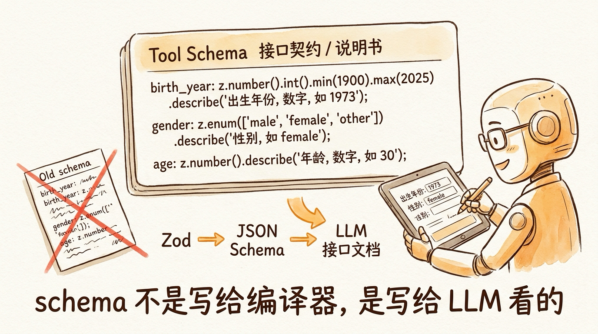

# 第 12 节 · 用 Zod 写出一份"自解释"的 Tool Schema



> **预计时长**：阅读 30 分钟 / 实战 60 分钟
> **前置知识**：第 11 节《Tool Calling 协议：LLM 从来不执行代码》、对 TypeScript 类型有基础了解
> **本节代码**：`ssp-web` 仓库 `chapter-12` tag · 主要文件 `src/lib/ai/tools.ts:36-156`

---

第一次跑 SSP 测试集时，我们盯着日志看了快半小时——LLM 老是把 `birth_year` 写成字符串 `"1973"`。

```json
{ "basic": { "birth_year": "1973", "gender": "female" } }
```

但我们的 Zod schema 写的是 `z.number()`。理论上 schema 校验应该把这种错误打回去。结果呢？日志里 80% 的 computePlan 调用都长这样——LLM 不约而同地把数字塞成字符串。规则引擎的 `parse_birth_year` 内置函数虽然能兜底（`tools.ts:36-44` 的 `birth_year_text` 字段就是为此而设），但每一次 fallback 都是一次推理浪费。

更怪的是同一个 prompt，**早上跑还好，下午跑就翻车**。我们一度以为是 OpenAI 模型在偷偷更新。

最后定位到根因：那一版 schema 的 `.describe()` 写的是 `"出生年份"`——四个字。LLM 看到 schema 里有"年份"两个字，加上用户输入是"73 年"，第一反应是"年份是文本"，于是去填了 `birth_year_text`。但 `birth_year_text` 字段当时还没存在，LLM 就发挥创造力，把这个字符串填进了 `birth_year`。

把 `.describe()` 改成 `"出生年份（数字），如 1973"`——一句完整的话，明确"数字"+"示例"——错误率立刻从 80% 掉到几乎不出现。

这就是这一节要讲的事：**Tool 的 schema 不是给 TypeScript 编译器看的，是给 LLM 看的**。

它写得清不清楚，直接决定 Agent 的稳定性。


---

## 一、知识铺垫：为什么 schema 是给 LLM 的接口契约

### 1.1 Zod schema 在 v6 里的旅程

写一行 `z.object({ ... })`，看上去只是 TS 的运行时校验。但接到 AI SDK 之后，这行代码在跑起来之前会经过一段长长的旅程：

```
你写的 Zod schema
    │
    ▼ zodSchema(s)
转成 JSON Schema（Draft 2020-12）
    │
    ▼ AI SDK 序列化
塞进 OpenAI tools[].function.parameters 字段
    │
    ▼ HTTP 请求
发到 OpenAI API
    │
    ▼ LLM 推理
LLM 读到 JSON Schema → 理解每个字段的类型 / 必填 / 含义
    │
    ▼
LLM 生成符合 schema 的 JSON 入参
```

终点是 LLM 看到这份 JSON Schema。**也就是说你的 Zod schema 最终变成 LLM 的"接口文档"**。

LLM 怎么读这份文档？它读 type、required、enum、description——尤其是 description。如果 description 写的是"birth_year"，LLM 不知道这是数字还是字符串，不知道范围是多少，不知道是出生年份还是入职年份。它只能靠猜。

这就是"自解释 schema"这个词的意思——**schema 本身要能解释自己**，不依赖外部说明。

### 1.2 Zod 4 与 v6 的关系：链尾顺序很重要

Vercel AI SDK v6 配套的是 **Zod 4.1.8 及以上**（v5/v6 迁移指南都强调过）。Zod 4 跟 Zod 3 在 metadata 处理上有一个非常容易踩的细节：

```typescript
// ❌ 错误：describe 在中间，丢失
z.string().describe("first name").min(1);

// ✅ 正确：describe 必须放在链尾
z.string().min(1).describe("first name");
```

为什么？因为 `.min()`、`.optional()`、`.extend()` 会**返回新的 ZodType 实例**，metadata 不继承。`.describe()` 必须挂在链的最后才能保留住。

SSP 的 schema 严格遵守这个规则，每个字段的 `.describe()` 都在链尾：

```typescript
// src/lib/ai/tools.ts:38-44（正确示范）
birth_year: z
  .number()
  .int()
  .min(1940)
  .max(2010)
  .optional()
  .describe("出生年份（数字），如 1973"),
```

> **小提醒**：从 Zod 3 升 Zod 4 时这是头号坑。如果你的 schema 写成了 `z.string().describe(...).min(1)`，所有 description 会在 v6 里悄悄丢失——LLM 看到的是个没说明的字段，错误率飙升你还找不到原因。

更微妙的是 `.meta()` —— Zod 4 推荐用 `.meta({ description: "..." })` 替代 `.describe()`，但行为完全一致，链尾顺序也一致。SSP 用的是 `.describe()`，因为 AI SDK v6 的 `zodSchema()` helper 对两种都识别，`.describe()` 写起来更短。

```typescript
// 这两种等价
z.string().describe("first name");
z.string().meta({ description: "first name" });
```

### 1.3 strictJsonSchema 默认开：undefined 变 nullable

v6 还有一个隐藏行为：**`strictJsonSchema` 默认是 true**。

这个设置打开后，所有 `optional` 字段会被序列化成 `nullable`——也就是说 LLM 会传 `field: null` 而不是省略字段。这个行为来自 OpenAI strict 模式的硬要求。

举个例子，SSP 的 social schema 是 optional 的：

```typescript
social: z
  .object({
    pension_contrib_months: z.number().int().min(0).optional()
      .describe("养老保险已缴月数"),
  })
  .optional(),
```

在 v6 + OpenAI 默认行为下，LLM 实际产出的入参可能长这样：

```json
{
  "social": {
    "pension_contrib_months": null,
    "medical_contrib_months": null
  }
}
```

而不是 `social: undefined`。读取这些字段时要做 null 检查，不能假设"不传 = undefined"。

如果不想要这个行为：

```typescript
streamText({
  providerOptions: {
    openai: { strictJsonSchema: false },
  },
});
```

> **划重点**：v6 默认 strict 是好事——LLM 出错率低很多。但代码侧要适配 null 而不是 undefined。

---

## 二、核心讲解

### 2.1 `.describe()` 是最重要的一环

把上面那个故事的代码完整放出来看：

```typescript
// src/lib/ai/tools.ts:38-44
birth_year: z
  .number()
  .int()
  .min(1940)
  .max(2010)
  .optional()
  .describe("出生年份（数字），如 1973"),
```

每个组件的作用：

| 调用 | 给 LLM 传达 | 作用 |
|---|---|---|
| `.number()` | type: "number" | 必须是数字 |
| `.int()` | 整数约束 | 不接受 1973.5 |
| `.min(1940)` | 最小值 | 1939 → 拒绝 |
| `.max(2010)` | 最大值 | 2011 → 拒绝 |
| `.optional()` | 可选字段 | 没有时可省略（strict 下变 nullable） |
| `.describe("出生年份（数字），如 1973")` | description 字段 | **LLM 真正读的"使用说明"** |

`.describe()` 写法的差距能差出 10 倍错误率：

| 写法 | 效果 | LLM 出错点 |
|---|---|---|
| `"出生年份"` | 几乎没用 | 不知道单位、不知道格式 |
| `"出生年份，如 1973"` | 中等 | 知道要填年份 |
| `"出生年份（数字），如 1973"` | 好 | 明确"数字"+示例 |
| `"出生年份（公元4位整数），如 1973。不要传'73年'，那是 birth_year_text 字段"` | 最好 | 给了反例引导 |

> **看这里 →**：写 `.describe()` 时假装你在跟一个"聪明但对业务一无所知的实习生"解释每个字段。它需要：单位、格式、范围、示例、反例。

实战经验：

- **数字字段** → 必须写单位（月 / 年 / 元 / 千克）+ 范围 + 示例
- **字符串字段** → 必须写格式（YYYY-MM-DD / E.164 等）+ 示例
- **enum 字段** → 每个 value 都要在 describe 里解释一句
- **嵌套字段** → 父对象也要 describe 一句"这一组是什么"

### 2.2 SSP 三个工具的实际 schema

把 SSP 三个工具的 schema 全部摆出来对照看。先看最复杂的 computePlan，分组结构：

```typescript
// src/lib/ai/tools.ts:36-156（节选关键结构）
const computePlanSchema = z.object({
  basic: z.object({
    birth_year: z.number().int().min(1940).max(2010).optional()
      .describe("出生年份（数字），如 1973"),
    birth_year_text: z.string().optional()
      .describe("出生年份文本，如 '73年' 或 '1973'，引擎会自动解析"),
    birth_month: z.number().int().min(1).max(12).optional()
      .describe("出生月份，1-12"),
    gender: z.enum(["male", "female"])
      .describe("性别：male=男，female=女"),
    female_retire_type: z.enum(["worker50", "cadre55", "unknown"]).optional()
      .describe("女性退休口径：worker50=普通工人（50岁退休），cadre55=管理岗/干部（55岁退休），unknown=不确定"),
    target_city: z.string().optional()
      .describe("目标城市，默认上海"),
    retire_preference: z.enum(["earliest", "standard", "latest"]).optional()
      .describe("退休偏好：earliest=最早退休（提前最多3年），standard=法定退休，latest=延迟退休（最多3年）"),
  }),
  social: z.object({
    pension_contrib_months: z.number().int().min(0).optional()
      .describe("养老保险已缴月数"),
    medical_contrib_months: z.number().int().min(0).optional()
      .describe("医疗保险已缴月数"),
    unemployment_insurance_years: z.number().min(0).optional()
      .describe("失业保险已缴年数"),
    // ... 其他字段
  }).optional(),
  // ... status / subsidy / mi / objective
});
```

再看最简单的 validateField：

```typescript
// src/lib/ai/tools.ts:158-167
const validateFieldSchema = z.object({
  field: z.string()
    .describe("字段路径，如 basic.birth_year、basic.gender、social.pension_contrib_months"),
  value: z.union([z.string(), z.number(), z.boolean()])
    .describe("用户提供的字段值"),
});
```

注意 `field` 的 description 直接给了三个具体示例——LLM 看到这个就知道要传"路径式字符串"，而不是字段裸名。这种"格式 + 示例"的写法对 LLM 学习路径风格几乎是 100% 命中。

最后看 updateProfile（`tools.ts:283-306`）：

```typescript
// src/lib/ai/tools.ts:283-306（节选）
const updateProfileSchema = z.object({
  basic: z.object({
    birth_year: z.number().int().optional(),
    gender: z.enum(["male", "female"]).optional(),
    // ... 其余字段同样全部 optional
  }).optional(),
  // ... social / status 同样整组 optional
});
```

跟 computePlan 比，这个 schema 字段是 computePlan 的**子集**——只挑 LLM 一次能从对话里直接抽取的"显式字段"。它不要求所有 basic 字段都填，**整组都是 optional，子字段也都是 optional**。LLM 这一轮能从用户话里抽到什么就传什么，不强求。

为什么和 computePlan 字段不一样？因为它们的目的不同——computePlan 要驱动规则引擎计算，所以约束严格；updateProfile 只是把"对话里识别到的"结构化数据推给前端做累积，宽松一点也无所谓。

> **划重点**：示例是 description 里最值钱的部分。一个好示例顶得上三段说明。同一项目的不同工具可以用不同严格度的 schema——能宽松的地方宽松，能严格的地方严格。

### 2.3 字段命名约定：snake_case 还是 camelCase

这是个看似小但实际很重要的问题。SSP 用的是 **snake_case**（`birth_year`、`pension_contrib_months`），不是 camelCase。为什么？

不同模型对命名风格的"看脸"程度不一样：

| 模型 | snake_case 准确率 | camelCase 准确率 |
|---|---|---|
| GPT-4o / 4o-mini | 高 | 高 |
| Claude Sonnet / Opus | 高 | 高 |
| Gemini 2.5+ | 高 | 中（偶尔忘记大写） |
| 小模型（Llama / Qwen 早期版本） | 中 | 低（混淆 birthYear 和 birth_year） |

**结论**：跨模型部署时优先用 snake_case，差异最小。如果你只跑 GPT/Claude，camelCase 也行，但要在团队代码风格里统一。

SSP 选 snake_case 还有一个项目层面的原因——规则引擎的 ctx（`user.basic.birth_year`、`user.social.pension_contrib_months`）也是 snake_case。schema 跟 ctx 字段一一对应，省掉一层 `transformer`。

> **小提醒**：不要在同一个项目里混用 snake_case 和 camelCase。LLM 有时候会"创造性地"把 `birthYear` 写成 `birth_year`，反过来也会，特别是当 system prompt 里两种风格都出现过时。

### 2.4 enum / union / literal：让 LLM 输出可枚举值

LLM 在自由文本字段上犯错率高。任何一个字段只要有"有限取值"，都应该用 enum 而不是 string。

看 SSP 的 gender 字段：

```typescript
// 错误示范（容易出错）
gender: z.string().describe("性别")
// LLM 可能传：male / female / 男 / 女 / Male / 女性 / m / f / 1 / 0 ...

// 正确示范（SSP 实际写法）
gender: z.enum(["male", "female"])
  .describe("性别：male=男，female=女"),
// LLM 必须从这两个值里选
```

enum 是 LLM 的"加速通道"——它不需要选词，直接照抄就行。错误率几乎归零。

更进阶的场景用 union 或 literal：

```typescript
// union：多种类型
field_value: z.union([
  z.string(),
  z.number(),
  z.boolean(),
]).describe("字段值，根据 field 类型不同"),

// literal：限定到某个具体值
status: z.literal("draft").or(z.literal("published")),

// discriminated union：根据某个字段决定结构
const event = z.discriminatedUnion("type", [
  z.object({ type: z.literal("click"), x: z.number(), y: z.number() }),
  z.object({ type: z.literal("submit"), formId: z.string() }),
]);
```

SSP 的 `validateField` 就用了 union：

```typescript
// src/lib/ai/tools.ts:163-166
value: z.union([z.string(), z.number(), z.boolean()])
  .describe("用户提供的字段值"),
```

因为不同 field 对应不同类型——`birth_year` 是数字、`gender` 是字符串、`on_unemployment_benefit` 是布尔——只能 union。

> **划重点**：能 enum 的不要 string。能 literal 的不要 enum。能 discriminated union 的不要 simple union。**约束越紧，LLM 出错率越低。**


### 2.5 嵌套对象：分组让 LLM 减负

SSP 的 `computePlan` schema 把 24 个字段分成了 6 个组：`basic` / `social` / `status` / `subsidy` / `mi` / `objective`。为什么不平铺？

平铺意味着 LLM 一次要看 24 个并列字段，每个都要判断"该不该填"。分组之后，LLM 看到的是 6 个并列的"块"，每个块里 3-5 个字段。**认知负担小一个数量级**。

```typescript
// 平铺（不推荐）
z.object({
  birth_year: ...,
  gender: ...,
  birth_month: ...,
  pension_contrib_months: ...,
  medical_contrib_months: ...,
  employment_status: ...,
  // ... 24 个字段并列
})

// 分组（SSP 实际写法）
z.object({
  basic: z.object({...}),         // 5 个基本信息字段
  social: z.object({...}).optional(),  // 6 个社保字段
  status: z.object({...}).optional(),  // 2 个就业状态字段
  // ...
})
```

分组带来的另一个好处：可以**整组 optional**。`.optional()` 挂在 `social` 上面，意味着用户没提社保信息时 LLM 完全可以不填这个组——而不是去猜每个子字段的默认值。

SSP 默认对话流是这样的：

1. 用户第一句"我是 73 年女的" → LLM 只填 `basic`，其他组完全不动
2. 用户补充"养老交了 180 个月" → LLM 填 `basic` + `social`
3. 用户说"我现在失业了" → LLM 填 `basic` + `social` + `status`

每一轮 LLM 只填它有信息的那几个组。**降低调用门槛 = 提高调用成功率**。

实际跑下来还有一个有趣现象：当 LLM 不确定一个字段该填什么时，它会**偏向把整组都不填**而不是乱猜某个子字段。这是个好行为——optional group 给了 LLM "我不知道就跳过"的退路。如果用平铺，LLM 看到 24 个并列字段，每个都"必须做决定"，反而更容易瞎填。

> **小提醒**：嵌套层级别太深。SSP 是 2 层（顶级对象 + 一层组），LLM 完全能 hold 住。3 层以上 LLM 偶尔会迷路。如果业务真有深层结构，考虑拆成多个工具而不是一个大 schema。


### 2.6 Schema 校验失败时的处理

LLM 偶尔会给出不符合 schema 的入参。AI SDK v6 的处理流程是：

```
LLM 生成 input
    │
    ▼
zodSchema 校验
    │
    ├─ 通过 → state: input-available → execute
    │
    └─ 失败 → InvalidToolInputError
              │
              ├─ 有 experimental_repairToolCall → 尝试修复
              │
              └─ 无 / 修复失败 → state: output-error
```

`InvalidToolInputError` 包含完整的 Zod 错误路径，长这样：

```
InvalidToolInputError: Invalid input for tool computePlan:
  basic.birth_year: Expected number, received string ("1973")
  basic.gender: Required
```

你可以在 `onError` 里捕捉它，决定是用户友好提示还是悄悄重试：

```typescript
streamText({
  // ...
  onError: ({ error }) => {
    if (error instanceof InvalidToolInputError) {
      logger.warn("tool_input_invalid", {
        tool: error.toolName,
        zodErrors: error.cause,
      });
    }
  },
});
```

SSP 的 `route.ts` 里没有特别处理这种错误——靠 `experimental_repairToolCall` 兜底（下面 2.7 讲），失败时直接 `output-error` 状态推到前端，前端显示"参数错误，请重新描述"。

### 2.7 自动重试：experimental_repairToolCall

如果你确实想给 LLM 一次自我修复的机会，v6 的 `experimental_repairToolCall` 钩子专门干这件事：

```typescript
import { generateText } from "ai";

streamText({
  model: openai(model),
  tools,
  experimental_repairToolCall: async ({
    system, messages, toolCall, tools, parameterSchema, error,
  }) => {
    // 让 LLM 看错误信息，自己重试
    const repair = await generateText({
      model: openai(model),
      system: typeof system === "string" ? system : system?.content,
      messages: [
        ...messages,
        { role: "assistant", content: [toolCall] },
        {
          role: "user",
          content: `Tool input failed validation: ${error.message}. Please correct.`,
        },
      ],
      tools,
    });
    const fixed = repair.toolCalls.find(
      (c) => c.toolName === toolCall.toolName,
    );
    return fixed ?? null;  // null = 放弃，工具失败
  },
});
```

适合什么场景？

- **中转网关**返回的模型错误率高（国内项目常见）
- **schema 复杂**，LLM 偶尔会搞错单位（月 / 年）
- **需要在前端无感知地兜一次**，不想暴露"重新填一次"

不适合什么场景？

- **错误是业务性的**——比如缺字段，应该走 `needs_agent` 追问而不是 repair
- **用了 reasoning 模型**——它内部就在自我反思，外面再加 repair 是叠床架屋
- **要追求纯净 trace**——repair 会引入额外一次 LLM 调用，影响 trace 可读性

> **划重点**：repair 是"软兜底"，不是默认路径。**第一道防线永远是 schema 设计本身**——`.describe()` 写清楚 + 用 enum 约束 + 给好 example。

### 2.8 inputExamples：给 LLM 几个"标准答案"

`.describe()` 是用文字告诉 LLM "这个字段该填什么"，但有时候**一个示例比三段文字更有说服力**。AI SDK v6 给工具定义加了一个专门的字段——`inputExamples`，让你直接把"标准答案"摆给模型看。

它挂在 `tool()` 的同一层，和 `inputSchema` / `execute` 并列：

```typescript
// 示意，非项目实际代码（SSP 当前未启用 inputExamples）
import { tool } from "ai";
import { z } from "zod";

const computePlanTool = tool({
  description: "调用社保规则引擎计算规划方案",
  inputSchema: computePlanSchema,
  inputExamples: [
    {
      input: {
        basic: { gender: "female", birth_year: 1973, female_retire_type: "worker50" },
        social: { pension_contrib_months: 216 },
      },
    },
    {
      input: {
        basic: { gender: "male", birth_year: 1965 },
        status: { employment_status: "flexible" },
      },
    },
  ],
  execute: computePlanExecute,
});
```

每个示例是 `{ input: {...} }` 的形状，`input` 就是一份合法的工具入参。模型在生成调用时会参考这些样例，学到"哦，原来 birth_year 是填 1973 这种四位数字、gender 是填 female 这个枚举值"——尤其对那种"文字描述讲不清的字段组合关系"特别管用。

但有一个**必须交代清楚的边界**：

> **看这里 →**：`inputExamples` 目前**只有 Anthropic 系的 provider 原生支持**，其他 provider（包括 OpenAI）会**直接忽略**这个字段。SSP 跑在 OpenAI provider（`@ai-sdk/openai`）上，所以即使写了 `inputExamples` 也不会生效——这正是 SSP 没有启用它的原因。如果你的项目用 Claude，它就值得一加。

这就引出 `inputExamples` 的正确定位：**它是个"增强器"，不是"唯一防线"**。

把降低 LLM 填参错误率的几道手段排个序，你会发现 `inputExamples` 站在偏后的位置：

| 手段 | 是否跨 provider 通用 | 定位 |
|---|---|---|
| `.describe()` 写清单位/范围/示例 | ✅ 通用 | 第一道防线，永远要做 |
| `enum` / `literal` 收敛取值 | ✅ 通用 | 第一道防线，能用就用 |
| `strict` 模式 | 部分 provider | 加固，provider 支持才生效 |
| `inputExamples` | ❌ 仅 Anthropic | 增强器，锦上添花 |
| `experimental_repairToolCall` | ✅ 通用 | 软兜底，错了之后补救 |

> **划重点**：别把 `inputExamples` 当成"写了它 schema 就能偷懒"。它解决的是"description 已经写清楚了、enum 也用上了，但模型对某些字段组合还是拿不准"的最后一公里。**第一道防线永远是 `.describe()` + `enum`**——这两样是跨 provider 通用的，`inputExamples` 只在用 Claude 时才帮得上忙。

### 2.9 Schema 演进：兼容性的现实问题

Schema 上线之后，几乎一定要改——加字段、改字段名、调整范围。但 schema 是 LLM 的接口契约，改它就像改 API。怎么改才不会破坏已有对话？

SSP 的实际做法：

**情况 1：加字段。** 直接加 optional 字段。LLM 看到新字段会自动开始用，不影响老对话。

```typescript
// 加 retire_preference 字段，不破坏兼容
basic: z.object({
  // ... 老字段
  retire_preference: z.enum(["earliest", "standard", "latest"]).optional()
    .describe("退休偏好：earliest=最早退休..."),
}),
```

**情况 2：改字段语义。** 不改名，保留旧字段，新加一个字段并 deprecate 旧字段。比如把 `pension_contrib_months`（月）改成 `pension_contrib_years`（年）：

```typescript
// 老字段保留
pension_contrib_months: z.number().int().min(0).optional()
  .describe("[已废弃，请用 pension_contrib_years] 养老保险已缴月数"),
// 新字段并存
pension_contrib_years: z.number().min(0).optional()
  .describe("养老保险已缴年数，如 15"),
```

LLM 看到 `[已废弃]` 字样会优先用新字段。execute 函数里两个字段都接，做转换。

**情况 3：删字段。** 不要直接删——删了之后老对话历史里的工具调用记录会"看起来不合法"。先标 deprecated 几周，确认 LLM 不再用了再删。

**情况 4：改 enum 取值。** 这是最危险的——`z.enum(["A", "B"])` 改成 `z.enum(["A", "C"])`，老对话的 trace 会校验失败。务必加 `.catch()` 兜底：

```typescript
gender: z.enum(["male", "female"])
  .catch("unknown")  // ← 老 trace 不合法时回退到默认值
  .describe("性别：male=男，female=女"),
```

> **小提醒**：schema 写好后**第一周不要改**，先看一周日志知道 LLM 在踩什么坑。这一周的观察价值远高于事先想破头。

### 2.10 反例：糟糕 schema 长什么样

把同一个工具的两份 schema 摆在一起对照：

**糟糕版本**：

```typescript
const badSchema = z.object({
  user: z.object({
    info: z.string().describe("用户信息"),       // ← 啥都没说
    age: z.number(),                            // ← 没单位、没 describe
    type: z.string().optional().describe("类型"), // ← 应该是 enum
    extra: z.any().optional(),                  // ← any 是死罪
  }),
  metadata: z.record(z.string(), z.unknown()).describe("元数据"), // ← 自由 KV，LLM 啥都塞
});
```

LLM 看到这份 schema 会做什么？

- `info: string` 没说要什么 → 把整段对话历史塞进去
- `age: number` 没单位 → 可能传月份、年龄、年份
- `type: string` 自由文本 → "VIP" "vip" "高端" 各种花式写法
- `extra: any` → LLM 创造力大爆发，塞进 100 个自创字段
- `metadata` → "我把用户名也塞进去吧""我把对话 ID 也塞进去吧"

**改造版本**：

```typescript
const goodSchema = z.object({
  user: z.object({
    age_years: z.number().int().min(0).max(150)
      .describe("用户年龄（岁），0-150 之间的整数，如 35"),       // 单位+范围+示例
    membership_type: z.enum(["free", "basic", "premium"])
      .describe("会员等级：free=免费，basic=基础付费，premium=高级付费"), // string → enum
  }),
  // metadata 拆成显式 enum 字段，不再用自由 KV
  source_channel: z.enum(["web", "mobile", "api"]).optional()
    .describe("用户来源渠道：web=网页端，mobile=移动端，api=外部 API"),
});
```

差别：

| 维度 | 糟糕版 | 改造版 |
|---|---|---|
| 类型清晰度 | string / any 居多 | enum / 限定数字 |
| 单位 | 没 | 都标了 |
| 范围 | 无 | min / max 都有 |
| 示例 | 无 | describe 里给了 |
| 自由度 | 太高 | 收敛到必要程度 |

> **划重点**：写完 schema 后做一个自检——把每个字段的 description 拿出来，假装你是 LLM，能不能照着填出合理值？答不上来就再加细节。

---

## 三、举一反三

Tool schema 设计的核心原则：**每个字段都要给 LLM 留下足够的"使用说明"——type、约束、单位、范围、示例、反例，缺一不可**。换到别的领域，原则一致，细节不同。

**比如要做一个医疗问诊 schema**：

```typescript
const consultSchema = z.object({
  symptoms: z.array(z.object({
    code: z.enum(["fever", "cough", "headache", /* ... */])
      .describe("症状代码（ICD-10 简化版），fever=发烧，cough=咳嗽，headache=头痛"),
    severity: z.enum(["mild", "moderate", "severe"])
      .describe("严重程度：mild=轻度，moderate=中度，severe=重度"),
    duration_days: z.number().int().min(0).max(365)
      .describe("持续天数，整数，超过 7 天建议就医"),
  })).describe("症状列表，至少一个"),
  vital_signs: z.object({
    temperature_celsius: z.number().min(35).max(42).optional()
      .describe("体温（摄氏度），35-42，如 38.5"),
    blood_pressure_systolic: z.number().int().min(60).max(220).optional()
      .describe("收缩压（mmHg），60-220 之间整数"),
  }).optional(),
});
```

医疗领域的特殊考虑：用 ICD-10 等标准代码 enum，避免 LLM 自由发挥；vital signs 的范围严格约束在生理可能范围内；持续天数加 describe 提示阈值。

**比如要做一个法律咨询 schema**：

```typescript
const legalQuerySchema = z.object({
  case_info: z.object({
    case_type: z.enum(["contract", "labor", "ip", "criminal", "civil"])
      .describe("案件类型：contract=合同，labor=劳动，ip=知识产权，criminal=刑事，civil=民事"),
    jurisdiction: z.enum(["mainland_cn", "hk", "macau", "tw"])
      .describe("司法管辖区：mainland_cn=大陆，hk=香港，macau=澳门，tw=台湾"),
    date_of_incident: z.string().regex(/^\d{4}-\d{2}-\d{2}$/).optional()
      .describe("事件日期，格式 YYYY-MM-DD，如 2025-03-15"),
  }),
  parties: z.array(z.object({
    role: z.enum(["plaintiff", "defendant", "witness", "third_party"])
      .describe("当事人角色：plaintiff=原告，defendant=被告，witness=证人，third_party=第三人"),
    type: z.enum(["individual", "company", "government"])
      .describe("当事人类型：individual=自然人，company=法人，government=政府机关"),
  })).min(1).describe("案件相关方，至少一个"),
});
```

法律 schema 的特殊考虑：jurisdiction 是 enum 而不是 string——避免"上海市""中华人民共和国""中国"这种不一致；日期用 regex 强制 ISO 格式；当事人角色用专业术语 enum，避免 LLM 自由翻译。

---

## 四、小结


**核心要点回顾**：

- ✅ **Zod schema 最终变成 LLM 的接口文档**——不是给 TS 编译器看的，是给 LLM 看的
- ✅ **`.describe()` 是最重要的一环**——必须放在链尾（Zod 4 metadata 不继承）
- ✅ **写 describe 的标准**：单位 + 范围 + 示例 + 反例。"出生年份"四个字不够，必须"出生年份（数字），如 1973"
- ✅ **能 enum 不要 string**——任何有限取值都应该 enum，错误率几乎归零
- ✅ **嵌套分组减负**——SSP 把 24 个字段分成 6 组，每组 optional，LLM 认知负担小一个数量级
- ✅ **snake_case 跨模型最稳**——尤其涉及多模型部署 / 小模型时
- ✅ **strict 默认 true**：v6 的 OpenAI strict 模式默认打开，optional 字段会变 nullable，代码侧要适配
- ✅ **schema 演进**：加字段直接加 optional；改语义保留老字段加新字段；删字段先 deprecate；改 enum 加 `.catch()` 兜底
- ✅ **repairToolCall 是软兜底**——主防线还是 schema 设计本身
- ✅ **inputExamples 是增强器**——给模型几个标准答案样例，但仅 Anthropic provider 原生支持，OpenAI 会忽略；不能替代 `.describe()` + `enum` 这两道跨 provider 通用的防线
- ✅ **自检黄金标准**：每个字段拿出 description，假装你是 LLM，能不能照着填？答不上就再加细节

下一节《三个工具的编排策略》会讲什么时候该调哪个工具、谁先谁后。SSP 三个工具不是孤立的——它们之间有串行依赖、有条件分支、有 needsApproval 的人工审批。这些编排关系直接影响对话体验。

---

## 思考题

1. **【开放题】**：你的项目里有没有遇到过"schema 跑了很久才发现写错了"的情况？事后看，那个错误是 schema 本身的问题，还是 description 没写清楚？如果重写，你会怎么改？
2. **【动手题】**：clone `ssp-web` 仓库，把 `src/lib/ai/tools.ts:63` 的 `gender` 字段从 `z.enum(["male", "female"])` 改成 `z.string()`，并把 `.describe("性别：male=男，female=女")` 改成 `.describe("性别")`。然后跟 Agent 说 "我妈是 1973 年女性"，连续测 5 次。验收：你应该看到 LLM 在 gender 字段上传出 "女" / "female" / "Female" / "女性" 等多种写法，至少出现 2 种以上不一致。改回 enum 版本再测，应该 5 次都是 `"female"`。
3. **【选做】**：用 `discriminatedUnion` 重构 `validateField` 的 `value` 字段。让 `field` 决定 `value` 的具体类型——`field: "basic.birth_year"` 时 `value` 必须是 `z.number()`，`field: "basic.gender"` 时 `value` 必须是 `z.enum(["male","female"])`。提示：用 `z.discriminatedUnion("field", [...])`。

---

## 面试题

**Q1.【基础】【主题：Schema 设计】** 为什么说"Tool 的 schema 不是给 TypeScript 编译器看的，是给 LLM 看的"？一行 Zod schema 在 AI SDK v6 里要经过怎样的旅程才到达 LLM？
<details><summary>参考解答</summary>

因为 Zod schema 最终会被序列化成 LLM 的**接口文档**。LLM 靠读这份文档里的 type、required、enum，尤其是 description，来理解每个字段该填什么。如果 description 只写"出生年份"，LLM 不知道是数字还是字符串、范围多少，只能靠猜——schema 写得清不清楚直接决定 Agent 稳定性。

旅程：你写的 `z.object({...})` → 经 `zodSchema()` 转成 JSON Schema（Draft 2020-12）→ AI SDK 序列化塞进 OpenAI `tools[].function.parameters` → HTTP 请求发到 API → LLM 读到 JSON Schema、理解每个字段 → 生成符合 schema 的 JSON 入参。终点是 LLM，不是编译器，所以叫"自解释 schema"——schema 本身要能解释自己。

</details>

**Q2.【进阶】【主题：Schema 设计】** SSP 早期 LLM 80% 把 `birth_year` 填成字符串 `"1973"`，根因是什么？请说明 `.describe()` 的写法标准，以及为什么"能 enum 不要 string"。
<details><summary>参考解答</summary>

根因：那一版 `.describe()` 只写了"出生年份"四个字。LLM 看到"年份"二字 + 用户输入"73 年"，第一反应是"年份是文本"，于是把字符串塞进了 `birth_year`。把 describe 改成"出生年份（数字），如 1973"——明确"数字"+示例——错误率从 80% 掉到几乎不出现。

`.describe()` 写法标准（假装在跟"聪明但对业务一无所知的实习生"解释）：**单位 + 格式 + 范围 + 示例 + 反例**。数字字段必须写单位（月/年/元）+ 范围 + 示例；字符串字段写格式（YYYY-MM-DD）+ 示例；enum 每个 value 解释一句。另外 Zod 4 里 `.describe()` 必须放在**链尾**，因为 `.min()` / `.optional()` 会返回新实例、metadata 不继承。

"能 enum 不要 string"：任何有限取值字段都该用 enum。`gender: z.string()` 会让 LLM 传出 male/女/Male/女性/m/f 各种花式；`z.enum(["male","female"])` 让模型从两个值里照抄，错误率几乎归零。约束越紧（string → enum → literal → discriminated union），LLM 出错率越低。

</details>

**Q3.【深挖】【主题：Schema 设计】** AI SDK v6 的 `strictJsonSchema` 默认是什么？它对 optional 字段有什么影响，代码侧要怎么适配？另外 `inputExamples` 这个字段的作用与边界是什么？
<details><summary>参考解答</summary>

`strictJsonSchema` 在 v6 **默认 true**（OpenAI strict 模式硬要求）。影响：所有 `optional` 字段会被序列化成 `nullable`——LLM 会传 `field: null` 而不是省略字段。所以读取这些字段时**要做 null 检查，不能假设"不传 = undefined"**。不想要这个行为可以 `providerOptions.openai.strictJsonSchema = false` 回到旧行为。它的好处是 LLM 出错率低很多，代价是代码侧要适配 null。

`inputExamples`：v6 给 `tool()` 加的字段，和 `inputSchema` / `execute` 并列，形状是 `[{ input: {...} }]`，把"标准答案样例"摆给模型看，对"文字描述讲不清的字段组合关系"特别管用。

边界：它目前**只有 Anthropic 系 provider 原生支持，OpenAI 会直接忽略**——这正是跑在 OpenAI 上的 SSP 没启用它的原因。定位上它是"增强器"不是"唯一防线"：跨 provider 通用的第一道防线永远是 `.describe()` + `enum`，`strict` 是部分 provider 加固，`inputExamples` 只在用 Claude 时锦上添花，`repairToolCall` 是错后软兜底。别把它当成"写了它就能偷懒"。

</details>

---

## 延伸阅读

- [Zod 4 官方文档](https://zod.dev)
- [Vercel AI SDK v6 — `zodSchema()` helper](https://ai-sdk.dev/docs/reference/ai-sdk-core/zod-schema)
- [Vercel AI SDK v6 — Tool Schema 设计指南](https://ai-sdk.dev/docs/ai-sdk-core/tools-and-tool-calling#schema-design)
- [OpenAI Structured Outputs 文档](https://platform.openai.com/docs/guides/structured-outputs)
- [JSON Schema Draft 2020-12 规范](https://json-schema.org/draft/2020-12/json-schema-core)

---

[← 上一节：第 11 节 Tool Calling 协议：LLM 从来不执行代码](./12-tool-calling.md) · [📚 目录](./README.md) · [下一节：第 13 节 三个工具的编排策略 →](./14-tool-orchestration.md)
