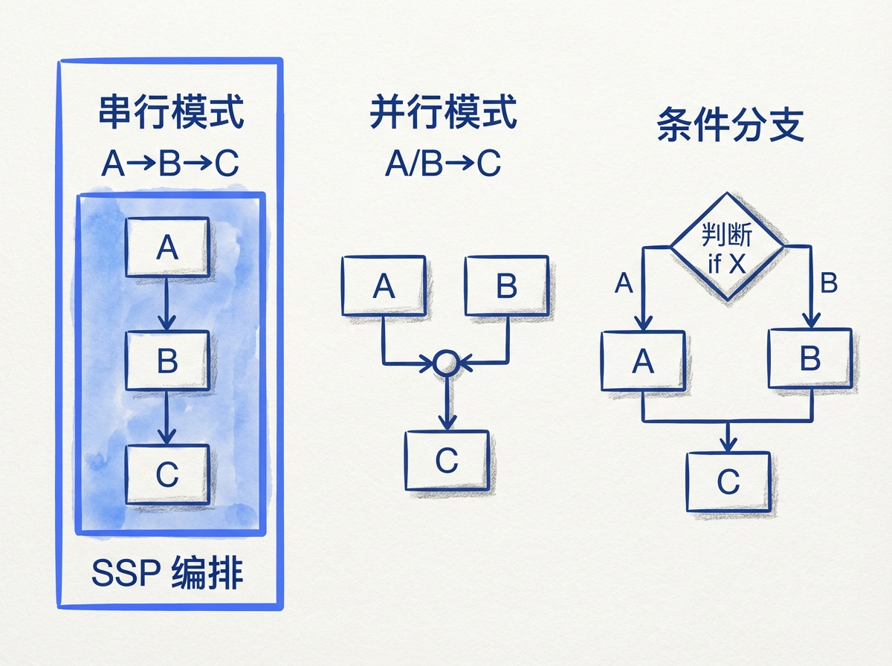
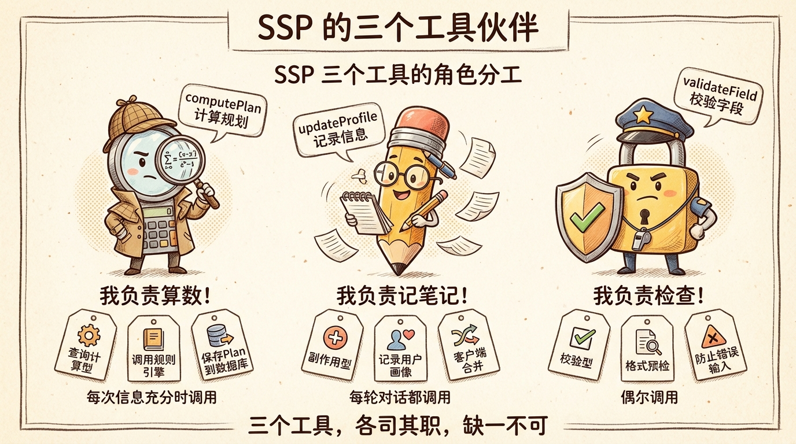
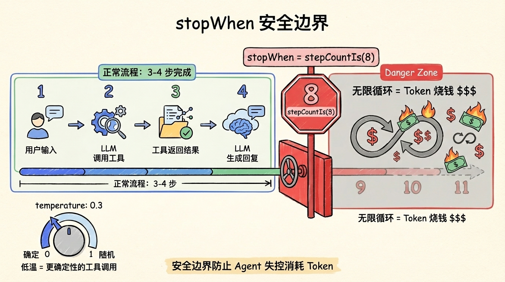
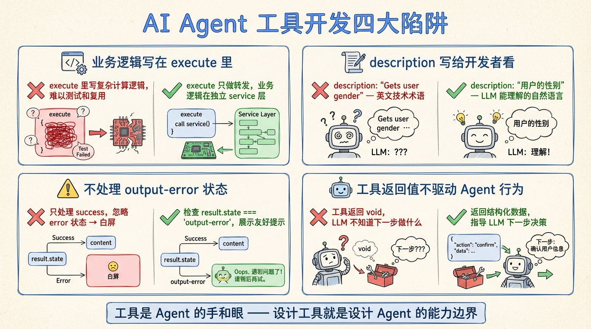

# 第 13 节 · 三个工具的编排策略：何时调、谁先谁后


> **预计时长**：阅读 30 分钟 / 实战 45 分钟
> **前置知识**：第 11 节《Tool Calling 协议：LLM 从来不执行代码》、第 12 节《用 Zod 写出一份"自解释"的 Tool Schema》
> **本节代码**：`ssp-web` 仓库 `chapter-13` tag · 主要文件 `src/lib/ai/agent.ts`、`src/lib/ai/prompts.ts`、`src/lib/ai/tools.ts`

那天产品经理在群里发了张截图，附带一句话："你这 Agent 是不是抽风了？"

截图里的对话很短：

> 用户：我女的 73 年的
> AI：好的，我已经了解到您的基本信息，正在为您计算社保规划方案……（长达 8 秒的加载中）……抱歉，由于关键字段缺失，无法给出方案。请问您的退休口径是普通工人还是管理岗？

8 秒。一份必然失败的"计算"占了 8 秒。然后才反过来追问一个本应在第一步就要的字段。

这不是 LLM 笨。这是工具编排崩了——`computePlan` 在信息明显不全的时候被强行触发，规则引擎兜底拦了下来，但代价是 8 秒的等待 + 一次毫无意义的数据库写入 + 用户一脸懵。

**编排不是"工具能用"就够了，而是"在对的时间用对的工具"。**

这一节讲三件事：SSP 三个工具到底是什么依赖关系？AI SDK v6 给了你哪些控制 LLM 工具选择的手段？最后落到一个问题——SSP 是怎么把这套能力组合起来，让上面那个 8 秒翻车 case 不再发生的。

---

## 一、知识铺垫：编排的本质，是控制 LLM 的工具选择

先把"编排"这两个字拆开看。

工具系统里，每一次调用有三个变量：**调不调**、**调哪一个**、**带什么参数**。第 12 节讲 Zod Schema，解决的是第三个——参数怎么传。这一节讲前两个——调还是不调，调哪一个先调。

听起来好像应该是 LLM 自己决定的事。但生产环境里，纯靠 LLM 自由发挥的代价你刚刚看到了：8 秒、空写一条 plan、用户体验崩。

> **划重点**：编排的本质，是用工程手段约束 LLM 的"工具选择自由度"——不是要剥夺它的判断，而是把那些 LLM 一定会犯错的边界 case 提前圈死。

这件事之所以重要，是因为 LLM 的"工具选择"本质上是一次概率采样。即使 System Prompt 写得再清楚，模型也可能在某些 corner case 里跳过收集环节直接调 `computePlan`。你能做的不是"祈祷它不出错"，而是"出错也接得住"。

AI SDK v6 围绕这件事，提供了五种粒度递进的手段，从软引导到硬约束：

| 粒度 | 手段 | 谁说了算 | 什么时候用 |
|---|---|---|---|
| 软引导 | System Prompt 文字描述 | LLM 自决 | 默认编排，最常见 |
| 工具裁剪 | `activeTools` | 这次调用屏蔽某些工具 | 阶段化任务、权限分级 |
| 工具强制 | `toolChoice: 'required'` / 指定 tool | 这一步必须 tool call | 必须出工具的关键步骤 |
| 步骤动态 | `prepareStep` | 每一步都可以重写策略 | 多阶段 Agent |
| 终止信号 | `stopWhen` + `hasToolCall` | 什么时候停 | 多步链路收尾 |

后面我们会逐个拆开。但在拆之前，先看 SSP 的依赖关系——这是后面所有决策的起点。



---

## 二、核心讲解

### 2.1 SSP 三工具的依赖关系：updateProfile 喂数据，computePlan 出结果，validateField 横切

回顾一下 SSP 的三个工具（详见第 11 节《Tool Calling 协议：LLM 从来不执行代码》）：

| 工具 | 类型 | 输入 | 输出 | 副作用 |
|---|---|---|---|---|
| `updateProfile` | 信息收集 | 结构化 profile 字段 | `{ updated: true, profile }` | 前端 `onFinish` 合并到 `sessionProfile` |
| `validateField` | 字段校验 | `{ field, value }` | `{ valid, normalized?, error? }` | 无 |
| `computePlan` | 规则引擎触发 | `basic / social / status / ...` 整 profile | `{ success, plan, calc, needs_agent, questions, ...}` | 写 `plans` 表 |

它们之间的关系，不是教科书上"串行/并行/分支"那种通用模型，而是有具体业务语义的：

```
[每轮新信息] ──→ updateProfile（结构化记录）
                    │
                    ├──→（数值字段）──→ validateField（可选前置校验）
                    │
                    └──→（Tier-1 字段齐了）──→ computePlan（触发计算）
                                                    │
                                                    └──→ needs_agent? 是 → 追问 → 下一轮
                                                                   否 → 展示结果
```

三个特点：

**第一，updateProfile 是"幂等的写"。** 用户每说一句话就可以调一次，不会有副作用，唯一的成本是几十毫秒的 round-trip。这意味着我们可以**在 System Prompt 里把它的调用条件写得很宽松**——"每轮对话都调用一次"。

**第二，computePlan 是"重的计算"。** 它要从数据库加载 24 条规则、合并三层政策参数、跑完整流水线、写 `plans` 表。一次完整跑要几百毫秒到一秒，错误调用还会污染数据。它的调用条件必须**严格**——Tier-1 字段不齐绝不调。

**第三，validateField 是"横切的轻校验"。** 它不在主链路上，只在 LLM 怀疑数据有歧义的时候插队进来。比如用户说"我交了十五年养老"——这可能是 15 个月也可能是 180 个月。LLM 应该先 validateField 确认数值，再决定是否塞进 updateProfile 或者 computePlan。

> **小提醒**：这三种类型（轻幂等写 / 重计算 / 横切校验）不是 SSP 独有，几乎所有 Agent 都会遇到。学会拆这三类，是设计编排策略的第一步。



### 2.2 五种编排手段：从最软到最硬

#### 2.2.1 System Prompt 软引导（最常用，也最被低估）

90% 的工具编排，都靠 System Prompt 里的一段文字搞定。SSP 的做法在 `src/lib/ai/prompts.ts:14-23` 的"核心规则"里，原文是这样的：

```
## 核心规则
1. **绝不自行计算**：不要凭记忆给出政策数字，所有计算必须调用 computePlan 工具
2. **累积用户信息**：用户每次提供新信息，与之前已知信息合并（不要让用户重复输入）
3. **Tier 1 字段即刻计算**：只要拿到 birth_year + gender(+ female_retire_type) 就立刻调用 computePlan
4. **needs_agent=true 时追问**：……
5. **needs_agent=false 时展示结果**：……
6. **诚实告知边界**：……
7. **不收集敏感信息**：……
8. **结构化记录用户信息**：每轮对话都通过 updateProfile 工具同步用户的结构化信息
```

> **看这里 →**：第 3 条和第 8 条直接控制了"何时调 computePlan"和"何时调 updateProfile"。第 3 条用了"立刻"这个强动词，让 LLM 在 Tier-1 字段齐时不要犹豫。第 8 条用"每轮"做条件，让 updateProfile 成为习惯动作。

这种"用自然语言写约束"的好处是**便宜、灵活、能跨工具协同**——LLM 一次性读到所有规则，能在多工具间做权衡。

但 System Prompt 的代价也很真实：

- **不可强制执行**。如果模型某一次"飘了"，跳过 updateProfile 直接出回复，你的 Prompt 拦不住它。
- **会被对话历史稀释**。第 20 轮对话时，模型对 System Prompt 第 3 条规则的"注意力"已经远低于第 1 轮。

所以 System Prompt 是 90% 的场景的默认手段，不是 100% 场景的最终手段。

#### 2.2.2 `toolChoice`：硬约束这一步必须出工具

AI SDK v6 的 `toolChoice` 有四种取值（参考[官方 Tool Calling 文档](https://ai-sdk.dev/docs/ai-sdk-core/tools-and-tool-calling)）：

```typescript
toolChoice: 'auto'                                       // 模型自决（默认）
toolChoice: 'none'                                       // 禁用 tool
toolChoice: 'required'                                   // 必须调 tool（不能直接出 text）
toolChoice: { type: 'tool', toolName: 'computePlan' }    // 强制特定 tool
```

什么时候该上硬约束？两种典型场景：

**场景 A：你**100% **确定这一步要出工具调用。** 比如 Agent 拿到完整用户信息后，下一步必然是触发 `computePlan`，那就在 `prepareStep` 里把 `toolChoice` 设成 `{ type: 'tool', toolName: 'computePlan' }`，省掉模型"是不是要直接回复"的判断成本。

**场景 B：调试时强制重现某个工具调用。** 比如你怀疑某条 Zod schema 写错了，可以临时把 `toolChoice` 锁到那个工具上，让模型必须传参，看清楚是哪个字段出问题。

但 SSP 实际**没有**用 `toolChoice`——这是个有意识的选择。原因后面 2.3 节会展开。

#### 2.2.3 `activeTools`：本次调用裁剪掉哪些工具

```typescript
streamText({
  model,
  tools: { updateProfile, validateField, computePlan },
  activeTools: ['updateProfile', 'computePlan'],  // 这次调用 validateField 不可见
});
```

`activeTools` 比 `toolChoice` 软一些——它不强制一定调工具，但**屏蔽掉的工具 LLM 完全看不到**。模型连"有这个工具"都不知道。

适合的场景：

- **阶段化的 Agent**。比如"信息收集阶段"只开 `updateProfile + validateField`，"计算阶段"才把 `computePlan` 开放出来。
- **权限分级**。匿名用户只能调用查询类工具，登录用户才能调用写入类工具。
- **Token 节省**。工具描述会进入 system prompt 的 token 预算。当工具集大到 20+ 个时，每一步只激活相关子集能显著省钱。

SSP 当前的工具集只有 3 个，且都是常驻可用，所以也没用 `activeTools`。但**如果你的 Agent 工具数 ≥ 8 个，强烈建议引入 `activeTools` 做阶段化裁剪**——LLM 在工具菜单短的时候选择更准。

#### 2.2.4 `prepareStep`：多步链路里每一步都可以重写策略

这是 AI SDK v6 多步控制里最强的一招。它是个回调，每一步都会被调用：

```typescript
// 示意，非项目实际代码
streamText({
  model,
  tools: { updateProfile, validateField, computePlan },
  prepareStep: async ({ stepNumber, steps, messages }) => {
    // 第 1-2 步只允许收集信息
    if (stepNumber <= 2) {
      return { activeTools: ['updateProfile', 'validateField'] };
    }
    // 第 3 步开始才允许触发计算
    if (stepNumber === 3) {
      return {
        activeTools: ['computePlan'],
        toolChoice: 'required',  // 必须出工具调用
      };
    }
    // 默认不动
    return {};
  },
});
```

`PrepareStepResult` 可以重写：`model` / `toolChoice` / `activeTools` / `system` / `messages` / `experimental_context` / `providerOptions`。

`prepareStep` 的核心价值是把"全局策略"拆成"每步策略"——你可以根据当前 step 数、历史 steps 的工具调用结果、消息长度等，**动态决定下一步只开放哪些工具**。

但要小心：

> **划重点**：`prepareStep` 是"每一步都跑一次"的。如果你在里面做了 IO（查数据库、调 API），整个链路会被这些 IO 拖慢。**保持纯函数 + 同步逻辑是最佳实践**。

#### 2.2.5 `stopWhen` + `hasToolCall`：什么时候停下来

第 11 节里我们见过 `stopWhen: stepCountIs(8)`——这是 SSP 的多步上限。但 `stopWhen` 不止这一种用法：

```typescript
import { streamText, stepCountIs, hasToolCall, type StopCondition } from 'ai';

stepCountIs(8);                  // 步数上限
hasToolCall('finalAnswer');      // 上一步调用过某个工具

// 数组 = OR：任一满足即停
stopWhen: [
  stepCountIs(8),
  hasToolCall('computePlan'),    // 一旦算过 computePlan，本轮就停（避免重复算）
],
```

更强的是自定义 `StopCondition`——它是个函数，签名为 `({ steps }) => boolean`，可以根据已发生的步骤做任意判断：

```typescript
// 示意：成本超预算就停
const tools = { updateProfile, validateField, computePlan } satisfies ToolSet;
const budgetExceeded: StopCondition<typeof tools> = ({ steps }) => {
  const total = steps.reduce(
    (acc, s) => acc + (s.usage?.inputTokens ?? 0) + (s.usage?.outputTokens ?? 0),
    0
  );
  return total > 5000;  // 单次对话超 5000 token 就停
};

stopWhen: [stepCountIs(8), budgetExceeded];
```

> **小提醒**：v6 里直接用 `streamText` 的默认 `stopWhen` 是 `stepCountIs(1)`——也就是**单步**！不显式设置 `stopWhen`，LLM 出第一次 tool call 之后就停了，根本不会进入"工具结果回流再回复"那一步。这是 v5 → v6 的常见踩坑点。

### 2.3 SSP 实际编排策略：极简，但每个选择都有理由

理论看完了，回头看 SSP 实际怎么写的。打开 `src/lib/ai/agent.ts:47-79`，整段 streamText 调用如下：

```typescript
// src/lib/ai/agent.ts:47-79
export function createChatStream(
  messages: ModelMessage[],
  context?: ChatContext,
  onFinish?: (result: { text: string }) => void | Promise<void>,
) {
  const { apiKey, baseURL, model } = getOpenAIConfig();
  const openai = createOpenAI({ apiKey, baseURL });

  const contextPrompt = context
    ? buildContextPrompt(context.questions ?? [], context.userProfile)
    : "";

  const systemPrompt = contextPrompt
    ? `${SYSTEM_PROMPT}\n\n${contextPrompt}`
    : SYSTEM_PROMPT;

  return streamText({
    model: openai(model),
    system: systemPrompt,
    messages,
    providerOptions: {
      openai: { store: false },  // 中转网关兼容
    },
    tools,
    stopWhen: stepCountIs(8),    // 多步工具调用上限
    temperature: 0.3,            // 低温度，事实导向
    onFinish,
  });
}
```

> **看这里 →**：注意几个**没有**的东西——没有 `toolChoice`、没有 `activeTools`、没有 `prepareStep`、没有自定义 `StopCondition`。SSP 的编排策略选择了**最朴素的一档**：System Prompt + `stopWhen: stepCountIs(8)` + `temperature: 0.3`。

为什么这么"省"？三个理由：

**理由 1：工具数量少（只有 3 个），SSP 的 LLM 不需要工具裁剪。** 三个工具职责完全不重叠，LLM 通过工具描述 + System Prompt 就能正确选择。`activeTools` 在工具数少时收益接近零，反而增加心智负担。

**理由 2：编排逻辑本质是"信息驱动"，不是"步骤驱动"。** SSP 不是固定的"先收集再计算"两阶段——用户可能第一句话就给齐 Tier-1 字段（"我女的 73 年生的工人"），这时 Agent 应一步到位调 `computePlan`。硬上 `prepareStep` 做阶段化反而把 LLM 困在僵化模板里。

**理由 3：硬约束的代价是失去 LLM 的判断力。** `toolChoice: 'required'` 强制每步必须出工具调用，但有时 LLM 应直接回复用户（如用户问"什么是社保"，根本不需要调工具）。

但选择"软"路线的前提是——**System Prompt 必须够细**。所以 SSP 的 System Prompt 长达 169 行（`src/lib/ai/prompts.ts:10-169`），远比那种"You are a helpful assistant"的样板长。详见第 9 节《System Prompt 11 节分层设计法》。

> **划重点**：SSP 的工具编排哲学是"**Prompt 软引导兜底，stopWhen 硬卡上限**"。不在 prompt 能搞定的事情上引入额外的 SDK 配置——配置越多，调试越难。

### 2.4 多步链路控制：stopWhen 的两种打法

`stopWhen: stepCountIs(8)` 这个数字怎么定的？SSP 的对话流程是：

```
第 1 步：updateProfile（记录用户首次提供的信息）
第 2 步：computePlan（首次触发计算）
第 3 步：（如果 needs_agent=true）assistant text（追问）
↓ 用户回复新信息
第 4 步：updateProfile（追加信息）
第 5 步：computePlan（再算一次）
第 6 步：assistant text（展示结果）
```

正常流程 6 步内结束。8 步留了 2 步的缓冲——给那些需要"两轮追问"的复杂 case 喘息空间，但不至于让 LLM 进入死循环。

你可能问：**为什么不用 `hasToolCall('computePlan')` 在算完后立刻停？**

不行。因为 `computePlan` 之后，LLM 还有重要任务——把规则引擎返回的 JSON 翻译成自然语言、追问用户、或者展示规划卡片。如果在 computePlan 后立刻 stop，用户只会收到一个空的 text。

`hasToolCall` 适合的场景是 "**这个工具被调用即代表任务完成**"——比如 Forced Tool Calling 模式里那个 `done` 工具：

```typescript
// 示意：Forced Tool Calling 模式
const agent = new ToolLoopAgent({
  model,
  tools: {
    search: searchTool,
    done: tool({
      description: 'Signal that you have finished',
      inputSchema: z.object({ answer: z.string() }),
      // 故意不写 execute，模型一旦调用此工具，loop 就停止
    }),
  },
  toolChoice: 'required',
});
```

SSP 没有这种"显式终止信号"的需求——它的终止条件是"LLM 觉得对话告一段落"，所以用步数上限就够。



### 2.5 反模式：硬编码顺序、过度限制 toolChoice

设计编排时，最容易掉的两个坑：

#### 反模式 1：在代码里硬编码工具调用顺序

有人会想："既然流程是 updateProfile → computePlan，那我直接在 API handler 里串行调用，不就稳了？"

```typescript
// 反例（千万别这么写）
const profileResult = await tools.updateProfile.execute(extractedFields);
const planResult = await tools.computePlan.execute(fullProfile);
return planResult;
```

这种写法等于**把 LLM 排除出决策环路**。LLM 不再有"判断信息是否充足"的能力——你强迫它每次都跑完整流程。结果就是 8 秒翻车 case 重现：用户只说了"我女的"，你也强行 computePlan 一次，规则引擎兜底拦截，给一个失败响应。

正确的做法是把决策权留给 LLM——**它知道信息充不充足，让它自己选。** 你能做的是把 prompt 写好、把工具设计好、把上限设牢。

#### 反模式 2：过度使用 `toolChoice: 'required'`

"我担心 LLM 偷懒不调工具，干脆每步都强制 required 吧。"

后果：

- **简单问答场景翻车。** 用户问"什么是养老保险？"—— 这种纯科普问题不需要任何工具，但 `required` 强迫模型调一个工具，它只能瞎调一个 `updateProfile({})` 凑数。
- **链路膨胀。** 模型为了满足 required，会在该停下时硬塞工具调用，把 8 步用满。
- **Token 成本飙升。** 每一次工具调用都是一轮 LLM 推理 + 工具结果回流再推理，是纯 text 响应的 3 倍 token。

`toolChoice: 'required'` 应该只在**特定步骤的特定上下文**中开启，不要做全局默认。

#### 反模式 3：用 prepareStep 做 IO 密集操作

```typescript
// 反例
prepareStep: async ({ stepNumber, messages }) => {
  // ❌ 每一步都查数据库
  const userProfile = await db.query.users.findFirst({ ... });
  if (userProfile.tier === 'premium') {
    return { activeTools: ['advancedTool'] };
  }
  return {};
};
```

`prepareStep` 每步都跑一次。一个 8 步的对话，等于 8 次额外的数据库查询。如果你的 Agent 在 serverless 环境（Vercel Function）跑，这种延迟会被放大 4-5 倍。

正确做法：把这些信息**预加载到 `experimental_context`**，prepareStep 里只做纯计算判断。



### 2.6 把人放回环里：needsApproval 的端到端实现

前面五种手段控制的是"LLM 选哪个工具、调几步"。但有一类工具，问题不在"该不该调"，而在"调了之后该不该真执行"——比如提交付款、删文件、把方案对外发布。这些动作一旦执行就难以撤销，你需要在 LLM 决定调用和工具真正执行之间**插一道人工审批闸门**。这就是 human-in-the-loop（人在环中），AI SDK v6 用工具上的 `needsApproval` 字段原生支持。

SSP 的三个工具（`updateProfile` / `validateField` / `computePlan`）都是"读 + 算"，没有不可撤销的副作用，所以**当前都不需要审批**。但 human-in-the-loop 是面试高频考点，也是你做高风险 Agent 迟早要补的一课，这里给一份完整的端到端实现样例。

整个流程分三步：工具定义标记审批 → 前端渲染审批 UI → 用户批准后恢复执行。

**第一步：工具定义加 `needsApproval`（服务端）**

在 `tool()` 定义里加一个 `needsApproval: true`，工具的 `execute` 保持不变，但 SDK 会在执行前先暂停、等用户点头：

```typescript
// 示意，非项目实际代码
import { tool } from "ai";
import { z } from "zod";

const processPayment = tool({
  description: "处理一笔付款",
  inputSchema: z.object({
    amount: z.number().describe("付款金额（元）"),
    recipient: z.string().describe("收款方"),
  }),
  needsApproval: true,             // ← 执行前必须等用户批准
  execute: async ({ amount, recipient }) => {
    return await doPayment(amount, recipient);
  },
});
```

当模型调用这个工具时，SDK **不会立刻跑 `execute`**，而是给前端推一个状态为 `approval-requested` 的工具 part，带上一个 `approval.id`。工具只有在收到用户批准后才会执行。

**第二步：前端渲染审批 UI（客户端）**

前端在 `message.parts` 里识别 `approval-requested` 状态，渲染"批准 / 拒绝"两个按钮，用 `useChat` 提供的 `addToolApprovalResponse` 把用户的决定回传：

```typescript
// 示意，非项目实际代码
"use client";
import { useChat } from "@ai-sdk/react";
import {
  DefaultChatTransport,
  lastAssistantMessageIsCompleteWithApprovalResponses,
} from "ai";

const { messages, sendMessage, addToolApprovalResponse } = useChat({
  transport: new DefaultChatTransport({ api: "/api/chat" }),
  // ← 所有审批都回应后，自动把消息发回服务端续跑
  sendAutomaticallyWhen: lastAssistantMessageIsCompleteWithApprovalResponses,
});

// 渲染时：
{message.parts.map((part, i) => {
  if (part.type === "tool-processPayment") {
    switch (part.state) {
      case "approval-requested":
        return (
          <div key={part.toolCallId}>
            <p>确认向 {part.input.recipient} 付款 ¥{part.input.amount}？</p>
            <button onClick={() =>
              addToolApprovalResponse({ id: part.approval.id, approved: true })
            }>批准</button>
            <button onClick={() =>
              addToolApprovalResponse({ id: part.approval.id, approved: false })
            }>拒绝</button>
          </div>
        );
      case "output-available":
        return <div key={part.toolCallId}>付款完成：{part.output}</div>;
      case "output-denied":
        return <div key={part.toolCallId}>付款已被取消。</div>;
    }
  }
})}
```

> **看这里 →**：`addToolApprovalResponse({ id: part.approval.id, approved })` 里的 `id` 取自 part 的 `approval.id`，不是 `toolCallId`，别填错。批准走 `approved: true`，拒绝走 `false`，对应前端两个不同的终态（`output-available` / `output-denied`）。

**第三步：用户批准后恢复执行**

`sendAutomaticallyWhen: lastAssistantMessageIsCompleteWithApprovalResponses` 这一行是关键——它让前端在"最后一条 assistant 消息里所有审批都被回应"时，**自动**把消息发回服务端。服务端收到带审批结果的消息后：批准了就跑 `execute` 拿到结果，拒绝了就把"用户拒绝"这个信号交给模型，让它据此回复。没有这一行的话，你得在每次审批后手动调一次 `sendMessage()`。

> **小提醒**：被拒绝时，模型可能"不死心"又把同一个工具调一遍。对策是在 System Prompt 里加一句"当某个工具执行未获用户批准时，不要重试，直接告知用户该操作未执行"，把模型的重试欲望按住。

**动态审批：只在高风险时拦**

`needsApproval` 不止能写 `true`，还能写成一个**根据入参动态判断**的 async 函数——这才是生产里最常用的形态。比如付款工具：小额自动放行，大额才需要人工确认：

```typescript
// 示意，非项目实际代码
const processPayment = tool({
  description: "处理一笔付款",
  inputSchema: z.object({
    amount: z.number(),
    recipient: z.string(),
  }),
  needsApproval: async ({ amount }) => amount > 1000,  // 仅 >1000 元需审批
  execute: async ({ amount, recipient }) => doPayment(amount, recipient),
});
```

这就把"审批阈值"变成了一条业务规则。回到 SSP 来看：假如哪天 `computePlan` 不再只是"算方案"，而是要"把方案直接提交给社保经办系统"，那它就该加一个 `needsApproval: async ({ objective }) => objective === "submit"`——查询自动放行、真提交才拦。这正是第 11 节里我们说"`submitFiling` 这种不可撤销动作必须加 `needsApproval`"的落地写法。

`approval-requested` 也是工具 part 状态机的一员（详见[第 17 节《工具结果卡片化》](./18-streaming-ui.md) 的「工具 part 状态机」）：完整状态是 `input-streaming → input-available → output-available / output-error / approval-requested`，审批 UI 就是给 `approval-requested` 这一态准备的渲染分支。

> **划重点**：human-in-the-loop 的本质，是给"不可撤销的高风险动作"加一道人工闸门。判断要不要加 `needsApproval`，就问一句——**这个动作执行错了，能不能撤回？** 不能撤回（付款、删除、对外发布、提交），就加；能撤回（查询、计算、记录），就别加，徒增交互摩擦。

---

## 三、举一反三

把 SSP 的"三工具"模型抽象出来，这个编排框架在所有需要"信息收集 → 计算决策"的 Agent 里都能复用。

**比如要做一个医疗问诊 Agent**：

| SSP 工具 | 医疗 Agent 对应 | 编排策略 |
|---|---|---|
| `updateProfile` | `updateSymptomLog`（记录症状描述） | 每轮调用，幂等 |
| `validateField` | `validateLabValue`（化验数值合理性） | LLM 觉得数据可疑时调 |
| `computePlan` | `computeDifferentialDiagnosis`（鉴别诊断） | Tier-1 症状齐了才调 |

医疗场景比社保更敏感的地方是：**`computeDifferentialDiagnosis` 应该用 `needsApproval`**——AI 给出的鉴别诊断必须经过人类医生审核才能展示给患者。这种 case 下，你会引入第三层安全网。

**比如要做一个个税申报 Agent**：

| SSP 工具 | 报税 Agent 对应 | 编排策略 |
|---|---|---|
| `updateProfile` | `updateIncomeRecord`（记录收入构成） | 每轮调用 |
| `validateField` | `validateDeduction`（专项附加扣除合规性） | 用户提到任何扣除项时调 |
| `computePlan` | `computeTaxReturn`（计算应纳税额） | 全部收入项目齐了才调 |

报税场景里，`validateField` 的角色更重——专项附加扣除有大量边界条件（房贷年限、子女教育阶段、赡养老人份额），LLM 几乎每个用户输入都要走一次校验。这时候你可以考虑在 System Prompt 里加一条强引导："对每一项扣除都必须先调用 validateDeduction 再写入。"

**抽象出来的三个原则**：

1. **轻量幂等的"信息收集"工具，让 LLM 高频调用**（每轮一次）
2. **重计算 / 有副作用的工具，必须等"前置字段齐"再调**（System Prompt 强引导）
3. **横切的"校验类"工具，由 LLM 按需触发**（不在主链路上）

把这三类摸清楚，新领域 Agent 的编排就有了骨架。

---

## 四、小结

工具编排不是"把工具调起来"那么简单，而是"在对的时间用对的工具"。


SSP 的编排策略可以一句话总结：**System Prompt 软引导兜底，`stopWhen: stepCountIs(8)` 硬卡上限，三个工具职责绝对清晰**。我们没有用 `toolChoice`、没有用 `activeTools`、没有用 `prepareStep`——不是因为这些工具不好，而是 SSP 的工具集只有 3 个、流程是信息驱动的，加这些反而徒增复杂度。

**核心要点回顾**：

- ✅ 编排的本质是控制 LLM 的"工具选择自由度"，五种粒度从软到硬：System Prompt → `activeTools` → `toolChoice` → `prepareStep` → `stopWhen`
- ✅ SSP 三工具的依赖关系：`updateProfile`（轻幂等写）、`computePlan`（重计算）、`validateField`（横切校验）
- ✅ 默认走 System Prompt 软引导路线，因为它跨工具协同好、便宜、灵活
- ✅ `stopWhen: stepCountIs(N)` 是必须的——v6 默认 `stepCountIs(1)` 是单步，多步链路必须显式声明
- ✅ 反模式：硬编码工具调用顺序（剥夺 LLM 决策权）、过度 `toolChoice: 'required'`（简单问答翻车）、`prepareStep` 里做 IO（链路膨胀）
- ✅ human-in-the-loop：对不可撤销的高风险动作加 `needsApproval`（可写 `true` 或动态阈值函数），前端在 `approval-requested` 态渲染审批按钮、用 `addToolApprovalResponse` 回传决定，配 `sendAutomaticallyWhen` 自动续跑；SSP 三工具都是读+算，当前不需要

下一节我们把镜头切到执行层——`computePlan` 工具背后那个**规则引擎**到底是怎么把 24 条政策变成可执行 JSON 的。

---

## 思考题

1. **【开放题】**：SSP 选择不用 `toolChoice` / `activeTools` / `prepareStep`，是因为工具数少、流程信息驱动。如果你的 Agent 工具数有 15 个、需要明显的阶段化（比如"调研阶段"→"执行阶段"→"汇报阶段"），你会怎么用 `activeTools` + `prepareStep` 做编排？画一个状态图说明每个阶段开放哪些工具。

2. **【动手题】**：在 `src/lib/ai/agent.ts` 里加一个自定义 `StopCondition`：当对话累计 input + output token 超过 6000 时停止。验收标准：跑 `pnpm test:eval` 时打印每个对话的总 token 用量，并且超过 6000 的对话能在到达上限时优雅终止（返回一句 "本次对话已达上限，请开新会话")。

3. **【选做】**：实现一个 Forced Tool Calling 模式的"finalize"工具——它没有 `execute`，但调用即代表 Agent 认为对话结束。结合 `hasToolCall('finalize')` 让对话在合适的时机自动收束。思考：这种模式的价值和代价分别是什么？什么时候比 `stepCountIs` 更合适？

---

## 面试题

**Q1.【基础】【主题：Tool Calling 协议】** AI SDK v6 控制 LLM 工具选择的手段从软到硬有哪几档？请按"谁说了算"排序并各举一个适用场景。
<details><summary>参考解答</summary>

五档，从软到硬：

1. **System Prompt 软引导**（LLM 自决）——默认编排，90% 场景，靠文字描述"何时调哪个工具"；
2. **`activeTools`**（本次调用裁剪可见工具）——阶段化任务、权限分级、工具数 ≥8 时省 token；
3. **`toolChoice`**（`required` / 指定 tool，强制这一步出工具）——确定这步必须调工具，或调试时强制重现；
4. **`prepareStep`**（每步重写策略：model/toolChoice/activeTools/messages）——多阶段 Agent；
5. **`stopWhen` + `hasToolCall`**（终止信号）——多步链路收尾。

排序的核心是"工具选择自由度"从 LLM 自决逐步收到工程硬约束。编排的本质不是剥夺 LLM 判断，而是把它一定会犯错的边界 case 提前圈死。

</details>

**Q2.【进阶】【主题：Tool Calling 协议】** SSP 三个工具是什么依赖关系？为什么 SSP 故意不用 `toolChoice` / `activeTools` / `prepareStep`，只用 System Prompt + `stopWhen`？
<details><summary>参考解答</summary>

依赖关系按业务语义分三类：

- `updateProfile`——**轻量幂等写**（每轮调一次，无副作用，调用条件可写宽松）；
- `computePlan`——**重计算**（加载 24 条规则 + 跑流水线 + 写库，几百 ms，调用条件必须严格：Tier-1 字段不齐绝不调）；
- `validateField`——**横切轻校验**（不在主链路，LLM 怀疑数据有歧义时插队）。

SSP 选最朴素一档的三个理由：(1) **工具只有 3 个且职责不重叠**，靠 description + System Prompt 就能正确选择，`activeTools` 收益接近零；(2) **编排是"信息驱动"不是"步骤驱动"**——用户可能第一句就给齐 Tier-1 字段，硬上 `prepareStep` 阶段化反而把 LLM 困在僵化模板里；(3) **硬约束会失去 LLM 判断力**——`toolChoice: 'required'` 会逼模型在该直接回复时硬塞工具调用。前提是 System Prompt 必须够细（SSP 长达 169 行）。

</details>

**Q3.【深挖】【主题：Tool Calling 协议】** 什么样的工具需要 `needsApproval`？请说明 human-in-the-loop 在 AI SDK v6 里的端到端三步实现，以及动态审批阈值怎么写。
<details><summary>参考解答</summary>

判断标准一句话：**这个动作执行错了能不能撤回？** 不能撤回（付款、删除、对外发布、提交申报）就加 `needsApproval`；能撤回（查询、计算、记录）就别加，徒增交互摩擦。SSP 三工具都是"读+算"，当前都不需要。

端到端三步：

1. **服务端**：在 `tool()` 定义加 `needsApproval: true`，SDK 在执行 `execute` 前暂停，给前端推一个 `approval-requested` 状态的工具 part，带 `approval.id`；
2. **前端**：识别 `approval-requested`，渲染"批准/拒绝"按钮，用 `addToolApprovalResponse({ id: part.approval.id, approved })` 回传（id 取自 `approval.id` 不是 toolCallId；不能 await）；
3. **恢复执行**：配 `sendAutomaticallyWhen: lastAssistantMessageIsCompleteWithApprovalResponses`，所有审批回应后自动把消息发回服务端续跑——批准则跑 execute，拒绝则把信号交给模型据此回复。

动态阈值：`needsApproval` 可写成 async 函数按入参判断，如 `needsApproval: async ({ amount }) => amount > 1000`——小额自动放行、大额才拦，把"审批阈值"变成一条业务规则。还要在 System Prompt 里加"未获批准时不要重试"，按住模型的重试欲望。

</details>

---

## 延伸阅读

- [Vercel AI SDK v6 - Loop Control](https://ai-sdk.dev/docs/agents/loop-control)
- [Vercel AI SDK v6 - Building Agents](https://ai-sdk.dev/docs/agents/building-agents)
- [Anthropic - Building effective agents](https://www.anthropic.com/research/building-effective-agents)
- [LangGraph - Tool Calling Patterns](https://langchain-ai.github.io/langgraph/concepts/agentic_concepts/)

---

[← 上一节：第 12 节 用 Zod 写出一份"自解释"的 Tool Schema](./13-zod-schema.md) · [📚 目录](./README.md) · [下一节：第 14 节 规则引擎 DSL：把 24 条政策变成可执行 JSON →](./15-rule-engine-dsl.md)
