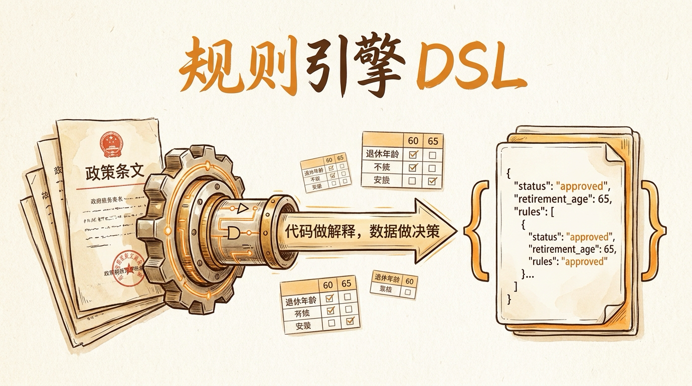
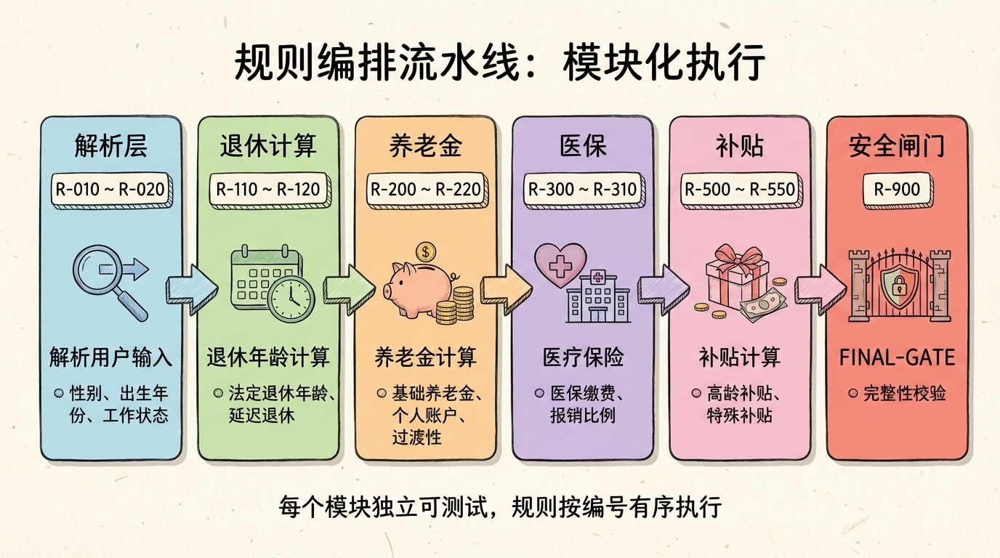
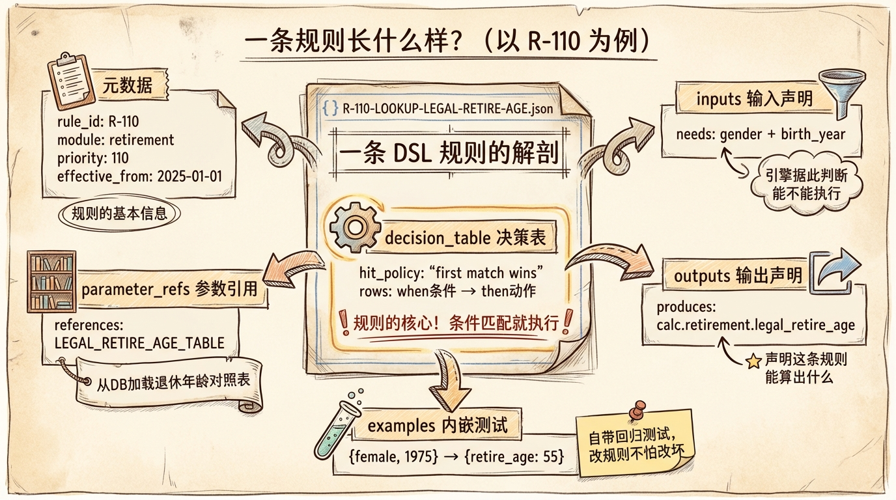
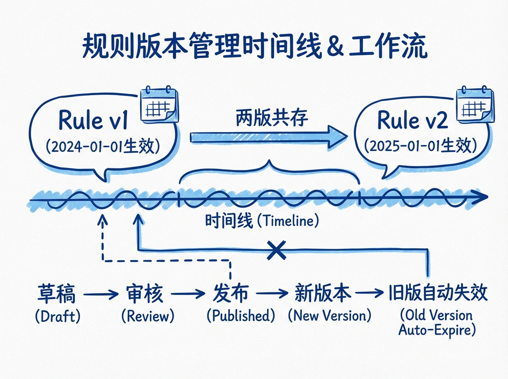

# 第 14 节 · 规则引擎 DSL：把 24 条政策变成可执行 JSON



> **预计时长**：阅读 35 分钟 / 实战 60 分钟
> **前置知识**：第 13 节《三个工具的编排策略》、对决策表（Decision Table）有基础了解
> **本节代码**：`ssp-web` 仓库 `chapter-14` tag · 主要文件 `dsl/ssp_dsl_v1/rules/`、`dsl/ssp_dsl_v1/rule_sets/rule_set_shanghai_plan_v1.json`、`src/lib/db/schema.ts`

2025 年 1 月，国务院发布《关于实施渐进式延迟法定退休年龄的决定》。

第二天产品群里炸了：

> 产品：**这不就是把退休年龄从 60 改到 63 吗？我们 if-else 一改不就完了？**
> 工程：**改不动。我们的退休年龄逻辑散落在 11 个文件里。**
> 产品：**11 个文件能有多大事，加班改一晚上呗。**
> 工程：**问题是这次改完，明年医保最低缴费年限要从 15 年逐步加到 20 年；后年 4050 补贴的覆盖范围又要调整……**
> 产品：（沉默）

每年改一次政策，每次改一晚上，对应一次发版、一次回归测试、一次潜在的线上事故。**你受得了吗？**

我们做 SSP 的第一天就问过这个问题。答案是 24 条 JSON 文件——一年改 200 行 JSON，不动一行 TypeScript。

这一节讲的就是这套 DSL 是怎么设计的：为什么是 JSON、为什么用决策表、为什么命名要长、为什么要存数据库。读完你不仅会用，还能复刻到自己的领域。

---

## 一、知识铺垫：DSL 的设计哲学，是"代码做解释，数据做决策"

先纠正一个常见误解：**规则引擎 ≠ if-else 大全。**

如果只是把 if-else 从 TypeScript 抄到 JSON，那只是换了个文件格式，痛点一个没解决。真正的规则引擎 DSL 有三个核心设计哲学：

#### 哲学 1：决策表（Decision Table）而不是流程图

决策表是一种古老但极其有效的业务规则表达形式。它把一条规则拆成 `when → then` 的二维矩阵：

| 条件 | when（什么条件） | then（执行什么动作） |
|---|---|---|
| row_1 | 缺关键字段 | 写 needs_agent=true，发追问 |
| row_2 | 字段全 | 查参数表，写 retire_age |

为什么不用流程图（if-else 嵌套）？因为流程图**藏不住嵌套，但藏得住边界 case**。当条件多到 4-5 个时，嵌套 if-else 会迅速变成无人能审的"金字塔"，而决策表把每一行都摊平——一眼能看出"少了哪种情况"。

这就是为什么 Drools、IBM Decision Manager 这些专业规则引擎都基于决策表，而不是把 BPMN 流程图当核心抽象。

#### 哲学 2：规则即数据，不是代码

24 条规则全部以 JSON 文件存在 `dsl/ssp_dsl_v1/rules/` 目录里，并通过 seed 脚本 upsert 到 PostgreSQL 的 `rules` 表（`src/lib/db/schema.ts:15-36`）。运行时，引擎从数据库加载规则——**规则是数据，不是代码**。

这意味着：

- 改规则不需要发版：直接改数据库（或者先改 JSON 再 reseed）
- 规则可以走管理后台编辑、审批、灰度（详见加餐 1《管理后台是怎么炼成的》）
- 规则可以多版本共存（见 14.4）
- 规则可以序列化成"证据"返回给用户（见第 15 节）

而代码做什么？只做一件事——**解释规则**。引擎代码 8 个文件、不到 1500 行 TypeScript，永远不需要因为政策变更而修改。

#### 哲学 3：政策即代码（Policy as Code）

规则一旦走的是 git 版本控制，每次政策变更都有 commit history。改了什么、谁改的、为什么改，全部可审计。这跟基础设施即代码（IaC）思路一模一样——把声明式资源管理的好处迁移到业务规则。

> **划重点**：DSL 设计的好坏，看一年后这个仓库长什么样。如果一年后规则文件多了几条、参数包改了几个数值，业务行为已经完全不同——但代码侧 zero diff——这套 DSL 就是成功的。


---

## 二、核心讲解

### 2.1 SSP 的规则 DSL：四个目录撑起整个引擎

打开 `dsl/ssp_dsl_v1/` 目录，你会看到这样的结构：

```
dsl/ssp_dsl_v1/
├── rules/                # 24 条规则 JSON（每条一个文件）
│   ├── R-010-PARSE-BIRTH-YEAR.json
│   ├── R-011-BUILD-BIRTH-DATE.json
│   ├── ...
│   └── R-900-FINAL-GATE.json
├── rule_sets/            # 规则集定义（执行顺序）
│   └── rule_set_shanghai_plan_v1.json
├── params/               # 政策参数包（数值 + 表）
│   └── policy_params_shanghai_base.json
├── schema/               # JSON Schema 校验（DSL/params/user_profile）
│   ├── ssp_rule_dsl.schema.json
│   ├── ssp_policy_params.schema.json
│   └── user_profile.schema.json
├── tests/                # 内嵌测试用例
├── workflows/            # 发布流水线定义
├── README.md
└── rules_manifest.json   # 规则清单（用于 Admin 列表）
```

四个核心目录的职责：

| 目录 | 干什么 | 改动频率 | 谁能改 |
|---|---|---|---|
| `rules/` | 业务规则定义 | 政策大调整时（年级别） | 业务方 + 工程 |
| `params/` | 政策数值参数 | 政策小调整时（季度级别） | 业务方 |
| `rule_sets/` | 编排规则的执行顺序 | 极低（架构变化时才改） | 工程 |
| `schema/` | DSL 自身的格式规范 | 极低（DSL 升级时） | 工程 |

这种分层带来一个重要好处：**改参数比改规则容易**。比如 2025 年 5 月调整社保缴费基数上下限，业务方只需要改 `params/` 里的两个数字（`P-SH-CONTRIB-BASE-LOWER`、`P-SH-CONTRIB-BASE-UPPER`），不用动 `rules/` 里的任何决策表。

#### 数据库侧的镜像

DSL 不只是 JSON 文件——它会通过 seed 脚本 upsert 到 PostgreSQL：

| 表 | 文件 | 行号 | 关键字段 |
|---|---|---|---|
| `rules` | `src/lib/db/schema.ts` | 15-36 | rule_id, name, module, decision_table (jsonb), status, effective_from, version |
| `params` | `src/lib/db/schema.ts` | 40-57 | policy_pack_id, param_id, type, value (jsonb), rows (jsonb) |
| `rule_sets` | `src/lib/db/schema.ts` | 73-84 | rule_set_id, rules (jsonb 数组), conflict_resolution, status |
| `policy_pack_versions` | `src/lib/db/schema.ts` | 61-69 | policy_pack_id, version, param_snapshot, status |
| `publishes` | `src/lib/db/schema.ts` | 103-114 | entity_type, entity_id, from_stage, to_stage, actor, gate_results, diff |

> **小提醒**：JSON 文件是"开发者的真理源"，数据库是"运行时的真理源"。两者通过 seed 同步——你可以理解为 git 仓库 = 源代码，DB = 已编译的二进制。


### 2.2 24 条规则的命名规范：R-XXX-NAME-IN-CAPS

打开 `rules/` 目录，你会看到所有文件名都遵循同一个格式：

```
R-010-PARSE-BIRTH-YEAR.json
R-011-BUILD-BIRTH-DATE.json
R-012-NORMALIZE-GENDER.json
R-020-FEMALE-RETIRE-TYPE.json
R-110-LOOKUP-LEGAL-RETIRE-AGE.json
R-115-FLEXIBLE-RETIREMENT.json
R-120-COMPUTE-RETIRE-DATE.json
R-200-MIN-PENSION-YEARS.json
...
R-900-FINAL-GATE.json
```

这个命名规则叫 **R-XXX-NAME-IN-CAPS**，三段：

- `R-` 是固定前缀，代表 Rule
- `XXX` 是 3 位数字编号，按"百位 = 模块"分配
- `NAME-IN-CAPS` 是大写连字符的英文动作短语

#### 编号的百位语义

24 条规则的编号是有讲究的：

| 编号区间 | 模块 | 规则数 | 示例 |
|:---:|---|:---:|---|
| 010-099 | normalization（输入归一化）| 4 | R-010-PARSE-BIRTH-YEAR、R-012-NORMALIZE-GENDER |
| 100-199 | retirement（退休计算）| 3 | R-110-LOOKUP-LEGAL-RETIRE-AGE |
| 200-299 | pension（养老金）| 2 | R-200-MIN-PENSION-YEARS、R-210-PENSION-GAP |
| 300-399 | medical（医保）| 3 | R-300-MI-GAP-MONTHS、R-310-MI-WAITING-PERIOD |
| 400-499 | unemployment（失业保险）| 3 | R-400-UNEMPLOYMENT-ELIGIBILITY |
| 500-599 | subsidy（补贴）| 6 | R-500-4050-ELIGIBILITY、R-510-4050-AMOUNT |
| 600-699 | reminder（提醒）| 1 | R-600-PAY-GAP-REMINDER |
| 700-799 | plan（规划装配）| 1 | R-700-PLAN-TEMPLATE |
| 900-999 | gate（最终门禁）| 1 | R-900-FINAL-GATE |

这种"百位 = 模块"的编号有几个好处：

1. **新规则插入容易**：`R-115-FLEXIBLE-RETIREMENT` 在 R-110 和 R-120 之间补一条，不需要重排
2. **依赖关系直观**：`R-200` 依赖 `R-110` 是显然的（先有退休年龄才有养老缴费缺口）
3. **代码搜索友好**：grep `R-1` 就能找出所有退休模块的规则

#### 执行顺序由 rule_set 决定

但要注意——**编号本身不决定执行顺序**。执行顺序由 `rule_set_shanghai_plan_v1.json` 的 `rules` 数组决定（`rule_set_shanghai_plan_v1.json:6-31`）：

```json
{
  "rule_set_id": "RS-SHANGHAI-PLAN-V1",
  "name": "上海社保规划主流程",
  "rules": [
    "R-010-PARSE-BIRTH-YEAR",
    "R-011-BUILD-BIRTH-DATE",
    "R-012-NORMALIZE-GENDER",
    "R-020-FEMALE-RETIRE-TYPE",
    "R-110-LOOKUP-LEGAL-RETIRE-AGE",
    "R-115-FLEXIBLE-RETIREMENT",
    "R-120-COMPUTE-RETIRE-DATE",
    "R-200-MIN-PENSION-YEARS",
    "R-210-PENSION-GAP",
    "R-220-MEDICAL-LIFETIME-GAP",
    "R-300-MI-GAP-MONTHS",
    "R-310-MI-WAITING-PERIOD",
    "R-400-UNEMPLOYMENT-ELIGIBILITY",
    "R-410-UNEMPLOYMENT-DURATION",
    "R-420-UI-MEDICAL-COVERAGE",
    "R-500-4050-ELIGIBILITY",
    "R-510-4050-AMOUNT",
    "R-520-JOB-SUBSIDY-ELIGIBILITY",
    "R-521-JOB-SUBSIDY-AMOUNT",
    "R-530-OLDER-UI-PENSION-FUND-COVERAGE",
    "R-540-SUBSIDY-MUTUAL-EXCLUSION",
    "R-600-PAY-GAP-REMINDER",
    "R-700-PLAN-TEMPLATE",
    "R-900-FINAL-GATE"
  ]
}
```

> **看这里 →**：24 条规则按数组顺序执行。换执行顺序不用改任何规则的 JSON，只改 `rule_set` 的数组。这就是把"规则"和"编排"分离的好处。

每条规则的 `priority` 字段（如 `R-010` 的 `priority: 10`）只用于 admin UI 的排序展示，**不影响实际执行顺序**——这是新人最容易踩的坑。



### 2.3 一条规则的 anatomy：以 R-010 为例

每条规则都是一个 JSON 对象，由六个组成部分构成。拿最简单的 `R-010-PARSE-BIRTH-YEAR` 举例：

```json
{
  "dsl_version": "SSP-DSL-1.0",
  "rule_id": "R-010-PARSE-BIRTH-YEAR",
  "name": "解析出生年份（支持 \"73年=1973\"）",
  "module": "normalization",
  "status": "published",
  "priority": 10,
  "effective_from": "2024-01-01",
  "decision_table": {
    "hit_policy": "first",
    "rows": [
      {
        "row_id": "row_2_parse_text",
        "when": {
          "and": [
            { "==": [{ "var": "user.basic.birth_year" }, null] },
            { "!=": [{ "var": "user.basic.birth_year_text" }, null] }
          ]
        },
        "then": {
          "actions": [
            {
              "type": "call",
              "fn": "parse_birth_year",
              "args": { "text": { "var": "user.basic.birth_year_text" } },
              "into": "user.basic.birth_year"
            }
          ]
        }
      }
    ]
  }
}
```

拆开看每一段：

#### Part 1: 元数据（identity）

```json
"dsl_version": "SSP-DSL-1.0",
"rule_id": "R-010-PARSE-BIRTH-YEAR",
"name": "解析出生年份（支持 \"73年=1973\"）",
"module": "normalization",
"status": "published",
"priority": 10,
"effective_from": "2024-01-01"
```

- `dsl_version`：DSL 自身版本，方便引擎做向后兼容
- `rule_id`：唯一标识，规则集引用就靠这个
- `name`：人类可读的中文名，admin UI 展示
- `module`：分组分类，影响 admin UI 的导航
- `status`：`draft` / `review` / `published` / `archived`，**只有 published 的规则才会被加载**
- `priority`：admin UI 排序用（不影响执行顺序，前面强调过）
- `effective_from`：从哪天开始生效，支持版本管理（见 14.4）

#### Part 2: inputs 声明（文档性）

R-010 没有写 inputs，但大部分规则会写：

```json
"inputs": [
  { "key": "user.basic.gender", "required": true },
  { "key": "user.basic.female_retire_type", "required": true },
  { "key": "user.basic.birth_year", "required": true }
]
```

这是**文档性质的声明**——告诉维护者"这条规则依赖哪些字段"。引擎不强制校验 inputs，真正的缺失处理在 decision_table 的 `when` 条件里。

> **小提醒**：为什么不强制校验？因为有些规则的"输入缺失"是它该处理的业务逻辑（比如 `R-900-FINAL-GATE` 就是专门检查缺失的）。强制校验会把这种合法 case 也拦掉。

#### Part 3: parameter_refs（参数表引用）

```json
"parameter_refs": [
  { "param_id": "T-RETIREMENT-AGE-LOOKUP", "purpose": "退休年龄映射表" }
]
```

声明这条规则要用到哪些参数表。运行时，引擎会把对应的参数从 `policy_pack` 加载到 `ctx.params`（详见第 15 节）。

**这一字段是政策更新最关键的解耦点**——参数表数据改了，规则定义一个字符不变。

#### Part 4: decision_table（决策表，核心）

```json
"decision_table": {
  "hit_policy": "first",
  "rows": [
    {
      "row_id": "row_2_parse_text",
      "when": { ... },           // JSONLogic 表达式
      "then": {
        "actions": [...]          // 数组：可以一次执行多个动作
      }
    }
  ]
}
```

- `hit_policy: "first"`：命中第一行就停止（if-else 语义）
- `hit_policy: "all"`：所有匹配行都执行（累加场景，比如补贴叠加）

这是规则的"灵魂"。决策表的好处是**所有边界 case 都摊平**——上下行之间是互斥关系（在 `first` 策略下），看一遍就知道有没有遗漏。

#### Part 5: outputs 声明（文档性）

```json
"outputs": [
  { "key": "calc.retirement.legal_retire_age_years", "type": "number" },
  { "key": "calc.needs_agent", "type": "boolean" }
]
```

声明这条规则会产出哪些字段。后续规则可以读取——这是**规则间通信的契约**。

#### Part 6: examples（内嵌测试用例）

```json
"examples": [
  {
    "name": "1973 男 -> 60",
    "input": { "user": { "basic": { "gender": "male", "birth_year": 1973 } } },
    "expected": { "calc": { "retirement": { "legal_retire_age_years": 60 } } }
  }
]
```

每条规则自带测试用例。seed 入库时会自动跑一遍 `executeSingleRuleInMemory()` 验证（详见 `src/lib/engine/test-runner.ts:1-283`）。

> **划重点**：规则和测试天生绑定在一起，永远不会分家。这是 SSP 在线规则编辑安全感的根本来源——你改一条规则，CI 立刻告诉你哪个 example 跑不过。

#### 六个动作类型（Action）

decision_table 里 `then.actions` 数组的每个元素都是一个 `Action`。SSP 定义了 6 种（详见 `src/types/engine.ts:23-77`）：

| Action 类型 | 干什么 | 例子 |
|---|---|---|
| `set` | 把 `value` 赋给 `path` | `{ type: "set", path: "calc.needs_agent", value: true }` |
| `lookup` | 查参数表 | `{ type: "lookup", table_param_id: "T-RETIREMENT-AGE-LOOKUP", key: {...}, into: "calc.legal_retire_age_years" }` |
| `call` | 调内置函数 | `{ type: "call", fn: "parse_birth_year", args: {...}, into: "user.basic.birth_year" }` |
| `emit_question` | 触发追问信号 | `{ type: "emit_question", value: { question_id: "Q-001", text: "请问您的性别？" } }` |
| `emit_warning` | 触发警告信号 | `{ type: "emit_warning", value: { warning_id: "W-001", text: "..." } }` |
| `emit_caveat` | 触发免责声明 | `{ type: "emit_caveat", value: { caveat_id: "C-001", text: "...", confidence: "low" } }` |

这 6 种 action 涵盖了"读表、算函数、写中间值、发信号"四类需求。够用，不多。新增一种 action 类型属于"**DSL 自身升级**"的事件——不是日常运营该做的。



### 2.4 规则版本管理：rule_sets 表 + publishes 表 + effective_from

政策是会变的。2024 年的 R-110 跟 2025 年的 R-110 算出来的退休年龄不一样——但同一个用户，10 月查一次、12 月查一次，看到不同结果就崩溃了。

SSP 的解决方案是**版本管理 + 时间机器**。

#### Layer 1：每条规则有 effective_from + version

```sql
-- src/lib/db/schema.ts:15-36 (示意)
CREATE TABLE rules (
  id SERIAL PRIMARY KEY,
  rule_id TEXT NOT NULL,
  version INT NOT NULL,
  decision_table JSONB,
  status TEXT,                  -- draft | review | published | archived
  effective_from DATE,
  effective_until DATE,
  -- ...
);
```

同一个 `rule_id` 可以有多个 `version`。`getEffectiveRules(ruleSetId, asOfDate)` 在加载时按 `asOfDate` 自动选生效版本（详见第 15 节的引擎入口）。

实际场景：

```sql
-- 旧版：2024-01-01 ~ 2024-12-31 生效
INSERT INTO rules (rule_id, version, effective_from, effective_until, status, ...)
VALUES ('R-110-LOOKUP-LEGAL-RETIRE-AGE', 1, '2024-01-01', '2024-12-31', 'published', ...);

-- 新版：2025-01-01 起生效（执行延迟退休渐进表）
INSERT INTO rules (rule_id, version, effective_from, effective_until, status, ...)
VALUES ('R-110-LOOKUP-LEGAL-RETIRE-AGE', 2, '2025-01-01', NULL, 'published', ...);
```

10 月查询 `asOfDate=2024-10-01` → 加载旧版，11 月查询 `asOfDate=2025-01-15` → 加载新版。**两个生效版本同时存在数据库，互不干扰**。

#### Layer 2：rule_sets 表管编排

```sql
-- src/lib/db/schema.ts:73-84
CREATE TABLE rule_sets (
  id SERIAL PRIMARY KEY,
  rule_set_id TEXT NOT NULL,
  rules JSONB,                  -- ["R-010-...", "R-011-...", ...]
  conflict_resolution TEXT,
  status TEXT,
  -- ...
);
```

规则集本身也有版本。如果你想从 24 条规则扩展到 26 条，新增的两条规则在审核期间不会影响 `RS-SHANGHAI-PLAN-V1` 的现行版本——你创建一个 `RS-SHANGHAI-PLAN-V1.1`（draft 状态），跑完测试再 `publish`。

#### Layer 3：publishes 表记录所有发布动作

```sql
-- src/lib/db/schema.ts:103-114
CREATE TABLE publishes (
  id SERIAL PRIMARY KEY,
  entity_type TEXT,             -- 'rule' | 'param' | 'rule_set'
  entity_id TEXT,
  from_stage TEXT,
  to_stage TEXT,
  actor TEXT,
  gate_results JSONB,           -- 测试通过情况
  diff JSONB,                   -- 改了什么
  created_at TIMESTAMP
);
```

每一次"draft → published"的状态变更都会写一条 publishes 记录。**这是审计的关键**——出了事故能复盘"是谁在什么时候改了什么"。

#### Layer 4：policy_pack_versions 管参数包

```sql
-- src/lib/db/schema.ts:61-69
CREATE TABLE policy_pack_versions (
  id SERIAL PRIMARY KEY,
  policy_pack_id TEXT,           -- 'SHANGHAI_BASE'
  version INT,
  param_snapshot JSONB,          -- 整个参数包的快照
  status TEXT
);
```

每次政策参数调整都打一个 `policy_pack` 快照——而不是改原数据。这意味着你可以**精确回滚**到任意历史时点的参数组合。

> **划重点**：四层版本（rule、rule_set、policy_pack、publishes）共同保证一件事——**昨天能算出的结果，今天必须能复现**。这是规则引擎对"可解释 AI"最硬核的承诺。



### 2.5 规则编辑器（CMS 后台简介）

光有 JSON 文件和数据库表还不够。业务方不会写 JSONLogic，更不会改 SQL。所以 SSP 配套了一套管理后台（详见加餐 1《管理后台是怎么炼成的》）：

```
/admin/rules          → 规则列表（按 module 筛选）
/admin/rules/:ruleId  → 规则详情（JSON 编辑器 + 跑示例）
/admin/rule-sets      → 规则集编辑（拖拽排序）
/admin/params         → 参数列表（数值表格直接编辑）
/admin/tests          → 测试中心（运行 + diff）
/admin/publish        → 发布流水线（draft → review → published）
```

核心交互：

1. 业务方在 `/admin/rules/:ruleId` 直接编辑 JSON（基于 monaco-editor 的 JsonEditor 组件）
2. 编辑器内置 schema 校验（用 `dsl/ssp_dsl_v1/schema/ssp_rule_dsl.schema.json` 做实时 validation）
3. 提交前必须跑一遍 `examples`，全部通过才能进入 `review` 状态
4. Reviewer 在 `/admin/publish` 里看 diff，决定是否 promote 到 `published`

整个流程下来，**业务方改规则的体验跟改一个 Notion 表格差不多**——不需要知道 git、不需要知道 JSON Schema、不需要知道 PostgreSQL。

加餐 1 会展开讲怎么搭这套 CMS。

### 2.6 反例：硬编码进 TS 的代价

最后看一下"不用 DSL"的代价。这是 SSP 项目早期的一个分支（已废弃），尝试过把规则全写在 TypeScript 里：

```typescript
// 反例：硬编码进 TS（千万别这么写）
function computeLegalRetireAge(profile: UserProfile): number {
  if (profile.gender === 'male') {
    if (profile.birth_year >= 1965) {
      // 渐进延迟：1965 出生延迟 1 个月，1966 延迟 2 个月...
      const monthsDelay = Math.min((profile.birth_year - 1964), 36);
      return 60 + monthsDelay / 12;
    }
    return 60;
  }
  if (profile.gender === 'female') {
    if (profile.female_retire_type === 'cadre55') {
      // 管理岗 55 岁退休，渐进延迟到 58
      // ...
    }
    if (profile.female_retire_type === 'worker50') {
      // 普通工人 50 岁退休，渐进延迟到 55
      // ...
    }
  }
  // 还有医保最低缴费年限、4050 补贴、失业金资格...
  // 24 条规则的逻辑全部 if-else 进来 → 1500 行
}
```

它会带来五个无法解决的问题：

#### 代价 1：政策更新必须发版

2025 年 5 月调一次缴费基数，TS 改完 → PR → review → CI → deploy → 灰度 → 全量。从需求到上线最快 3 天，碰到事故得回滚一周。

DSL 版本：业务方改一个数字 → admin 后台点一下 publish → 30 秒生效。

#### 代价 2：业务方完全无法参与

社保政策的解读、参数的核对，本应由业务专家做。但 TS 代码业务方读不懂、改不了，只能反复跟工程师沟通。"73 年女性管理岗到底是 55 还是 58？" 这种问题来回三五轮才能定下来。

DSL 版本：业务方直接在管理后台编辑参数表，工程师只在 schema 升级时介入。

#### 代价 3：完全没有可审计性

代码里改一个数字，git blame 能告诉你是谁改的，但说不清"改之前业务行为是什么"。出了线上事故，复盘要从 git 历史一行行翻。

DSL 版本：每次发布都写 `publishes` 表，diff、actor、gate_results 一清二楚。

#### 代价 4：测试覆盖率低

TS 里要为每条规则单独写单元测试。规则之间有依赖时（比如 R-200 依赖 R-110 的输出），测试设置极其麻烦。

DSL 版本：每条规则的 `examples` 内嵌就是测试，seed 时自动跑一遍。CI 顺便把所有 examples 又跑一遍。

#### 代价 5：跨地区扩展几乎不可能

上海政策已经 1500 行了，加上北京 → 3000 行。再加广州 → 4500 行。每个地区的规则用 if-else 区分？代码会爆炸。

DSL 版本：北京的政策另起一个 `policy_pack_id="BEIJING_BASE"` + 一个对应的北京规则集 `rule_set_id="RS-BEIJING-PLAN"`，规则文件互不影响。

> **划重点**：硬编码 vs DSL 不是"代码风格偏好"，而是"业务能不能持续运营"的根本性差异。**DSL 不是优化项，是必选项**——只要你的领域有政策、有版本、有审计需求。


---

## 三、举一反三

DSL 设计的精髓不在 SSP，而在**所有政策驱动 / 规则密集的领域**都能复用。

#### 法律条款 DSL（合同审查 Agent）

合同审查的核心是"找到不合规条款"。规则可以这样设计：

| SSP 概念 | 法律 DSL 对应 |
|---|---|
| `R-XXX-NAME` | `L-XXX-CLAUSE-CHECK`（每条审查规则） |
| `decision_table` | "合同条款匹配 → 触发警告" |
| `parameter_refs` | "法律条文库 + 行业标准库" |
| `effective_from` | "法规生效日期"（民法典 vs 老合同法） |
| `R-900-FINAL-GATE` | "总体合规性兜底检查" |

特别注意：法律 DSL 必须支持**地域适用性**（中国大陆 / 香港 / 海外），可以引入 `jurisdiction` 字段做条件过滤。

#### 医保政策 DSL（保险报销 Agent）

医保报销的"DSL 适配度"甚至比社保还高，因为它的规则本身就是"决策表"形式：

| SSP 概念 | 医保 DSL 对应 |
|---|---|
| `R-XXX-NAME` | `M-XXX-REIMBURSEMENT`（每类病种 / 药品的报销规则） |
| `decision_table` | "甲类药 100% / 乙类 70% / 丙类 0%" |
| `parameter_refs` | "医保目录 + 起付线 + 封顶线" |
| `T-RETIREMENT-AGE-LOOKUP` 这类参数表 | "病种报销比例表"、"起付线分级表" |
| `R-900-FINAL-GATE` | "年度封顶 + 自付比例校验" |

医保的复杂度在于**多层嵌套**：地区医保 + 大病医保 + 商业补充。SSP 的 `policy_pack_id` 这个抽象天然支持——每一层就是一个 pack，结果合并即可。

> **划重点**：抽象出来看，SSP 的 DSL 模式 = "**结构化领域规则 + 决策表 + 参数解耦 + 版本时间机器**"。这个模式对任何"政策驱动型业务"都成立——除了社保、医保、法律，还包括税务、福利、监管合规、信贷审批……

---

## 四、小结

24 条 JSON 规则承载了一套完整的政策计算系统——这背后是**代码做解释、数据做决策**的设计哲学。


DSL 的关键在于把"规则"从"代码"里剥离出来：rules/ 目录里 24 条 JSON、params/ 里一个政策包、rule_sets/ 里一个数组定义编排顺序、schema/ 给所有这些做格式校验。运行时存数据库，配 effective_from 做时间机器，配 publishes 做审计。业务方在 admin 后台用可视化编辑器操作，工程师只需要维护引擎本身。

**核心要点回顾**：

- ✅ DSL 三哲学：决策表 > 流程图、规则即数据 > 规则即代码、政策即代码（git 版本控制）
- ✅ 命名规范 R-XXX-NAME-IN-CAPS：百位 = 模块（010 归一化 / 100 退休 / 200 养老 / 300 医保 / 400 失业 / 500 补贴 / 600 提醒 / 700 装配 / 900 门禁）
- ✅ 一条规则六部分：元数据 / inputs / parameter_refs / decision_table / outputs / examples
- ✅ 6 种 Action：set / lookup / call / emit_question / emit_warning / emit_caveat
- ✅ 执行顺序由 rule_set 数组决定，**不是 priority**——这是新人最大的坑
- ✅ 四层版本管理：rule.version / rule_set / policy_pack_versions / publishes，保证"昨天的算法今天能复现"
- ✅ 硬编码进 TS 的五大代价：发版慢 / 业务方失语 / 无审计 / 测试难 / 不可跨域

下一节我们打开引擎本身——24 条规则在 ctx 里跑过一圈之后，怎么变成最终的 plan 输出？trace[] 又是怎么拼成一条可解释的证据链的？

---

## 思考题

1. **【开放题】**：SSP 的 R-XXX 命名按"百位 = 模块"分配。如果你要做一个跨城市（上海 + 北京 + 广州）的版本，命名规范要怎么调整？是引入前缀（SH-R-XXX、BJ-R-XXX）还是用 `policy_pack_id` 隔离？两种方案的优劣是什么？

2. **【动手题】**：在 `dsl/ssp_dsl_v1/rules/` 目录下加一条新规则 `R-145-EARLY-RETIRE-PENALTY`（提前退休扣减），用 decision_table 表达"每提前 1 个月，养老金扣 0.5%"。要求：
   - 写完整的 6 个部分（含 examples）
   - examples 至少 3 条（提前 0/12/36 个月各一条）
   - 跑 `pnpm seed` 入库后，CI 跑 examples 全绿
   - 验收标准：在 admin 后台 `/admin/rules/R-145-EARLY-RETIRE-PENALTY` 页面能编辑，跑 examples 通过

3. **【选做】**：研究一下 Drools / IBM Decision Manager 的 DRL 语法，对比 SSP 的 JSON DSL，列出三个 SSP 缺失但 DRL 支持的特性（提示：rule chaining、inheritance、explainability），评估其中哪些值得在 SSP 后续版本引入。

---

## 面试题

**Q1.【基础】【主题：规则引擎】** SSP 的规则引擎 DSL 有三个核心设计哲学，分别是什么？为什么说"规则引擎 ≠ if-else 大全"？
<details><summary>参考解答</summary>

三个设计哲学：

1. **决策表（Decision Table）而不是流程图**——把规则拆成 `when → then` 二维矩阵，所有边界 case 摊平，一眼看出"少了哪种情况"；嵌套 if-else 藏得住边界 case，条件多到 4-5 个就变成无人能审的金字塔；
2. **规则即数据，不是代码**——24 条规则以 JSON 存在，运行时从数据库加载，改规则不用发版、可走管理后台编辑审批灰度、可多版本共存、可序列化成证据返回用户；
3. **政策即代码（Policy as Code）**——规则走 git 版本控制，每次变更有 commit history，可审计。

"规则引擎 ≠ if-else 大全"：如果只是把 if-else 从 TS 抄到 JSON，只是换了文件格式，痛点一个没解决。真正的价值在于"代码做解释、数据做决策"——引擎代码（8 个文件约 1500 行）只负责解释规则，永远不因政策变更而修改。

</details>

**Q2.【进阶】【主题：规则引擎】** SSP 规则的命名规范 R-XXX-NAME-IN-CAPS 中"百位 = 模块"是什么意思？规则的执行顺序由什么决定？`priority` 字段起什么作用？
<details><summary>参考解答</summary>

命名三段：`R-` 固定前缀 + `XXX` 三位编号 + `NAME-IN-CAPS` 大写动作短语。"百位 = 模块"指编号按模块分段：010-099 归一化、100-199 退休、200-299 养老、300-399 医保、400-499 失业、500-599 补贴、600 提醒、700 装配、900 门禁。好处是新规则插入容易（R-115 补在 R-110 和 R-120 之间不用重排）、依赖关系直观、grep 友好。

**执行顺序由 `rule_set` 的 `rules` 数组决定**，不是编号、更不是 priority。换执行顺序只改 rule_set 数组、不动任何规则 JSON——这是把"规则"和"编排"分离的好处。

`priority` 字段**只用于 admin UI 的排序展示，不影响实际执行顺序**——这是新人最容易踩的坑。

</details>

**Q3.【深挖】【主题：规则引擎】** SSP 用四层版本管理保证"昨天能算出的结果今天能复现"，请说明这四层分别管什么。相比把规则硬编码进 TypeScript，DSL 方案的核心优势体现在哪几个维度？
<details><summary>参考解答</summary>

四层版本管理：

1. **rule.version + effective_from**——每条规则可有多版本，`getEffectiveRules(ruleSetId, asOfDate)` 按日期选生效版本（10 月查加载旧版、11 月查加载新版，两版同存）；
2. **rule_sets**——规则集本身有版本，扩展规则时新建 draft 规则集，跑完测试再 publish，不影响现行版本；
3. **publishes 表**——记录每次"draft → published"的 actor / diff / gate_results，出事故能复盘"谁在什么时候改了什么"；
4. **policy_pack_versions**——每次参数调整打快照而非改原数据，可精确回滚到任意历史时点。

相比硬编码进 TS 的五大优势维度：(1) **更新无需发版**（业务方改数字点 publish，30 秒生效 vs TS 改完要 PR/CI/deploy/灰度）；(2) **业务方可参与**（管理后台编辑 vs 看不懂 TS）；(3) **可审计**（publishes 表 vs git blame 说不清改前行为）；(4) **测试天生绑定**（每条规则 examples 内嵌、seed 自动跑 vs 单独写单元测试且依赖难设置）；(5) **跨地区可扩展**（新 policy_pack + rule_set vs if-else 代码爆炸）。结论：DSL 不是优化项，是必选项——只要领域有政策、有版本、有审计需求。

</details>

---

## 延伸阅读

- [JSONLogic 官方文档](https://jsonlogic.com/)
- [Martin Fowler — Rules Engine 模式](https://martinfowler.com/bliki/RulesEngine.html)
- [Drools 决策表官方文档](https://docs.drools.org/latest/drools-docs/docs-website/drools/language-reference/index.html#_decisiontables)
- [Decision Model and Notation (DMN) Specification](https://www.omg.org/spec/DMN/)
- [Open Policy Agent — Policy as Code](https://www.openpolicyagent.org/docs/latest/)

---

[← 上一节：第 13 节 三个工具的编排策略：何时调、谁先谁后](./14-tool-orchestration.md) · [📚 目录](./README.md) · [下一节：第 15 节 JSONLogic 引擎实现：从 ctx 到证据链 →](./16-jsonlogic-execution.md)
