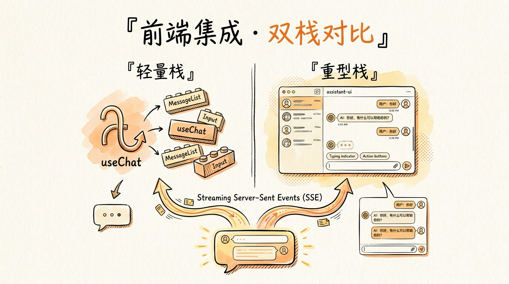
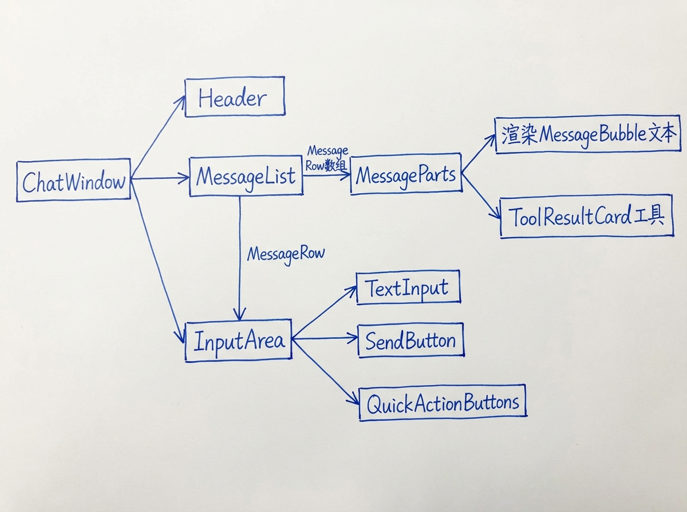
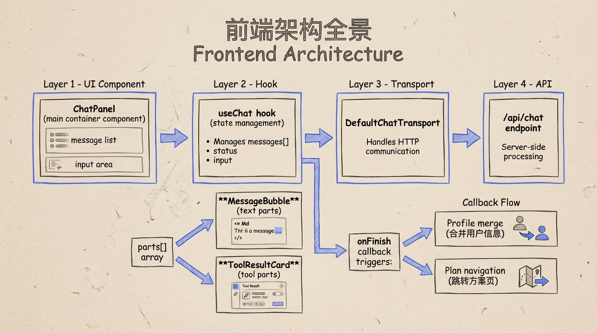
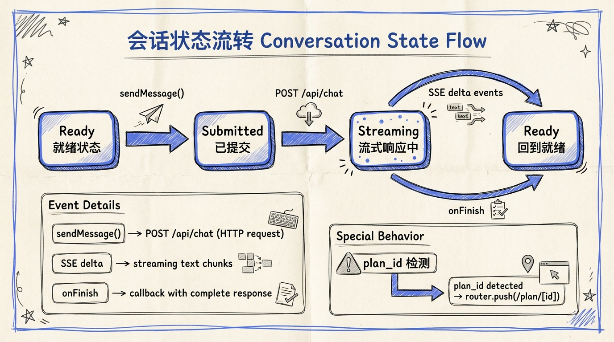
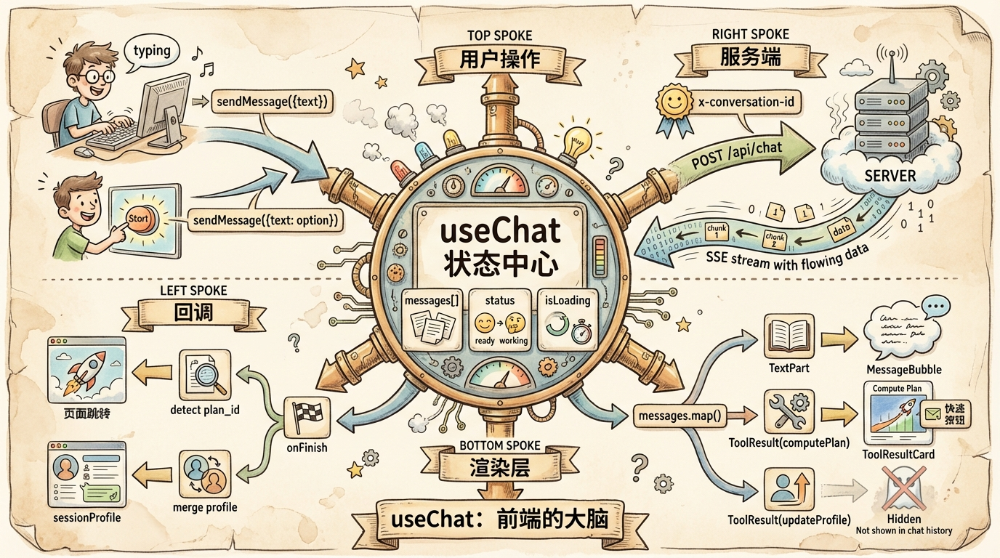

# 第 16 节 · 前端集成：useChat + assistant-ui 双栈对比



> **预计时长**：阅读 35 分钟 / 实战 90 分钟
> **前置知识**：[第 15 节《JSONLogic 引擎实现：从 ctx 到证据链》](./16-jsonlogic-execution.md)、对 React 19 / Next.js 16 App Router 有基础了解
> **本节代码**：`ssp-web` 仓库 `chapter-16` tag · 主要文件 `src/components/chat/ChatPanel.tsx`、`src/components/chat/ToolResultCard.tsx`、`src/components/chat/conversation-runtime.ts`

那天有个朋友找我吐槽。

他在做一个法律咨询 SaaS，后端 Agent 已经写完了——`streamText` 加三个工具，跑通了多轮对话，工具调用也能按预期返回 JSON。"问题是前端，"他说，"我现在每次 SSE 流过来一段，就 `appendChild` 一段。光标怎么闪，工具结果怎么渲染，并发工具调用怎么排队……我光是处理 SSE 就写了两百行。**到底有没有现成的轮子？**"

我问他："你看过 Vercel AI SDK 的 `useChat` 吗？"

"看过，但教程都是 `m.content` 那一套——我后端用的是 v6，前端这套不能用啊。"

"那是 v4 老教程。v6 的 `useChat` 早就改成 `parts` 数组了，一行 `useChat`、五十行 React 就能搭出 ChatGPT 那种界面。要不要我给你看看 SSP 是怎么做的？"

那天我给他打开了 `ssp-web` 的 `ChatPanel.tsx`——528 行，撑起整个对话界面，**还同时用了 `@ai-sdk/react` 和 `@assistant-ui/react` 两套**。这一节就是我那天给他讲的内容：**前端从 SSE 流变成对话框，到底要做什么、不要做什么、什么时候该升级到 assistant-ui。**

后端 `streamText` 5 行起跑，前端的故事比你想的要短。

---

## 一、知识铺垫：两条路线，一个 hook

写 AI 对话界面，2026 年只有两个起点：

- **轻量栈**：`@ai-sdk/react` 的 `useChat` hook + 自己写 React 组件
- **重型栈**：`@assistant-ui/react` 的 `ThreadPrimitive` 系列 + `useAISDKRuntime` 桥接

这不是非此即彼。`ssp-web` 的实测做法是**两套同时用**——`useChat` 做底层状态管理，`assistant-ui` 做上层 UI 渲染。先说为什么会有两条路线，再说什么场景选什么。

### `useChat` 干了什么

`useChat` 来自 `@ai-sdk/react@^3.0.103`。它是一个 React hook，封装了三件事：

1. **SSE 连接**：自动建立、自动关闭、自动重试
2. **消息状态**：维护一个 `UIMessage[]`，按 `parts` 协议组织
3. **状态机**：四态切换 `submitted → streaming → ready/error`

写 v6 项目时绕不开它，因为它本身就是 `streamText` 的标配前端。

### `assistant-ui` 又是什么

`@assistant-ui/react@^0.12.14` 是另一个项目（github 上叫 `Yonom/assistant-ui`），它做的事情更上层：**把"消息列表 + 输入框 + 工具卡片 + 滚动 + 编辑 + 重发"这些 ChatGPT 标配组件，抽成一组 primitive**。

类比一下：

- `useChat` 像 React Hook Form——管状态，UI 自己写
- `assistant-ui` 像 shadcn/ui——给一套 primitive，你拼组件

它不替代 `useChat`，而是**消费 useChat**。`@assistant-ui/react-ai-sdk@^1.3.10` 提供 `useAISDKRuntime` 这个适配器，把 `useChat` 的返回值喂给 `assistant-ui` 的 runtime。



<!-- 图片说明（给图片代理）：
风格：信息图（infographic）
内容：左右两列对比图
左列「轻量栈」：useChat hook → 自写 MessageRow / Bubble / Card
右列「重型栈」：useChat → useAISDKRuntime → AssistantRuntimeProvider → ThreadPrimitive
底部标注：SSP 选 B 方案（两者结合），因为需要 thread 切换 + 标准 primitive
-->

### 三件事，决定你选哪条路

| 决策点 | 选 useChat | 选 assistant-ui |
|:---|:---|:---|
| 只有一个对话窗，不需要 thread 切换 | ✅ | 偏重 |
| 需要 thread list / 历史会话切换 / 编辑消息 | 自己写挺累 | ✅ 内置 |
| 强定制 UI（极简风、品牌化） | ✅ 完全自由 | 要覆盖 primitive 样式 |
| 跑 demo / MVP / 内部工具 | ✅ | 不必要 |
| 做成生产级 ChatGPT 复刻 | 自己写 500 行起 | ✅ 用 primitive 拼 |

> **划重点**：两条路线不是"哪个更好"的问题，是"你的产品边界在哪里"的问题。SSP 选两者结合，是因为它既要简洁的对话气泡（自定义渲染），又要 thread 切换（assistant-ui 内置）。

---

## 二、核心讲解

### 2.1 useChat v3：v4 老教程全部作废

如果你在网上搜到过 `useChat` 的教程还在写 `messages.content`、`isLoading`、`handleInputChange`，那是 2024 年以前的写法。**`@ai-sdk/react@3` 把这一套全部推翻了。**

把 v4 → v6 的破坏性变更列出来对照：

| 项目 | v4 老 API | v6 新 API |
|:---|:---|:---|
| 输入框状态 | `input` / `setInput` / `handleInputChange` | **删除**，自己 `useState` |
| 表单提交 | `handleSubmit` | 自己写 `onSubmit` 调 `sendMessage` |
| 加载状态 | `isLoading: boolean` | `status: 'submitted' \| 'streaming' \| 'ready' \| 'error'` |
| 消息渲染 | `m.content: string` | `m.parts: UIMessagePart[]` |
| API 配置 | 顶层 `api`/`body`/`headers` | `transport: new DefaultChatTransport({ api, ... })` |
| 发消息 | `append({ role, content })` | `sendMessage({ text })` |
| 加工具结果 | `addToolResult` | `addToolOutput`（旧名 deprecated） |
| 多步触发 | 顶层 `maxSteps` | 服务端 `stopWhen`、客户端 `sendAutomaticallyWhen` |

新签名最小可用：

```tsx
// 第 16 节示意代码（基于 ssp-web ChatPanel.tsx）
'use client';
import { useState } from 'react';
import { useChat } from '@ai-sdk/react';
import { DefaultChatTransport, lastAssistantMessageIsCompleteWithToolCalls } from 'ai';

export function ChatRoom() {
  const [input, setInput] = useState('');

  const { messages, sendMessage, status, error, regenerate, stop } = useChat({
    id: 'ssp-chat',
    transport: new DefaultChatTransport({ api: '/api/chat' }),
    sendAutomaticallyWhen: lastAssistantMessageIsCompleteWithToolCalls,
    onFinish: ({ message }) => {
      // 处理工具结果，下面 16.2 详细讲
    },
  });

  return (
    <div>
      {messages.map((m) => (
        <MessageRow key={m.id} message={m} />
      ))}
      <form onSubmit={(e) => {
        e.preventDefault();
        if (input.trim()) {
          sendMessage({ text: input });
          setInput('');
        }
      }}>
        <input value={input} onChange={(e) => setInput(e.target.value)} disabled={status !== 'ready'} />
        <button type="submit" disabled={status !== 'ready'}>发送</button>
      </form>
    </div>
  );
}
```

> **看这里 →**：v6 的 `useChat` **不再代管输入框**。这个反直觉的改动有它的理由——v4 把 input 状态塞进 hook，导致 IME 输入法、文件上传、自动完成这些交互各种打架。v6 让你自己 `useState`，自由度高得多。

### 2.2 SSP 实测：ChatPanel 的双栈架构

把 `ssp-web` 真实代码摆出来。先看 `src/components/chat/` 的文件清单：

| 文件 | 行数 | 角色 |
|:---|---:|:---|
| `ChatPanel.tsx` | 528 | **主入口**：useChat + AssistantChatTransport + 双栈集成 |
| `ToolResultCard.tsx` | 708 | 渲染工具结果（computePlan / validateField） |
| `ConversationList.tsx` | 249 | 左侧会话列表（删除 / 切换） |
| `MessageBubble.tsx` | 156 | 早期手写气泡（仍保留但 ChatPanel 不用） |
| `ChatInput.tsx` | 90 | 早期手写输入框（仍保留） |
| `conversation-runtime.ts` | 49 | fetch 包装：从响应头读 `x-conversation-id` |

`MessageBubble.tsx` 和 `ChatInput.tsx` 是早期手写版本，现在 `ChatPanel.tsx` 已经迁移到 assistant-ui 的 `MessagePrimitive` 和 `ComposerPrimitive`，但旧组件没删——给读者留个对照。

`ChatPanel.tsx` 的关键 28 行（拼接自源码 354-390）：

```tsx
// src/components/chat/ChatPanel.tsx:354-390
const transport = useMemo(
  () =>
    new AssistantChatTransport({
      api: '/api/chat',
      fetch: createConversationTrackingFetch(handleConversationReady),
      prepareSendMessagesRequest: async (options) => ({
        ...options,
        body: {
          id: options.id,
          messages: options.messages,
          trigger: options.trigger,
          messageId: options.messageId,
          metadata: options.requestMetadata,
          conversationId,
          sessionId,
          questions,
          userProfile: sessionProfile,
          planId,
        },
      }),
    }),
  [conversationId, handleConversationReady, planId, questions, sessionId, sessionProfile]
);

const chat = useChat({
  id: conversationId,
  transport,
  messages: initialMessages ?? [],
  onFinish,
});

const runtime = useAISDKRuntime(chat);
```

> **看这里 →**：这段把整套接口都串起来了。`AssistantChatTransport` 替代了 `DefaultChatTransport`（功能向上兼容），`prepareSendMessagesRequest` 让你在每次请求前篡改 body——SSP 用它把 `conversationId / sessionId / questions / userProfile / planId` 一起塞进请求体。

`createConversationTrackingFetch` 是一个 fetch 包装器（在 `conversation-runtime.ts:49`），用来从响应头里捞 `x-conversation-id`。这是 SSP 在无状态 Serverless 下维持会话连续性的关键设计——首次请求服务端建会话、把 ID 放响应头，客户端拿到后存起来，后续所有请求带上它。

### 2.3 切换到 assistant-ui：useAISDKRuntime 桥接

`useChat(...)` 返回的 `chat` 对象不能直接喂给 `assistant-ui`，需要 `useAISDKRuntime` 转一层：

```tsx
// src/components/chat/ChatPanel.tsx 节选
import {
  AssistantRuntimeProvider,
  ComposerPrimitive,
  MessagePrimitive,
  ThreadPrimitive,
} from '@assistant-ui/react';
import { AssistantChatTransport, useAISDKRuntime } from '@assistant-ui/react-ai-sdk';

const runtime = useAISDKRuntime(chat);

return (
  <AssistantRuntimeProvider runtime={runtime}>
    <ThreadPrimitive.Root>
      <ThreadPrimitive.Viewport>
        <ThreadPrimitive.Messages
          components={{
            UserMessage: UserBubble,
            AssistantMessage: AssistantBubble,
            ToolCallMessagePart: ToolResultCard,
          }}
        />
      </ThreadPrimitive.Viewport>
      <ComposerPrimitive.Root>
        <ComposerPrimitive.Input />
        <ComposerPrimitive.Send />
      </ComposerPrimitive.Root>
    </ThreadPrimitive.Root>
  </AssistantRuntimeProvider>
);
```

`AssistantRuntimeProvider runtime={runtime}` 是 root，必须包住所有 primitive。assistant-ui 通过 runtime 桥接，**不直接读 `chat.messages`**——你只能用 `MessagePrimitive` 之类的 primitive 来渲染。

把渲染分发给 `components` 的三个槽位：

- `UserMessage` → 用户消息气泡
- `AssistantMessage` → 助手消息气泡
- `ToolCallMessagePart` → 工具结果卡片（关键定制点，下一节讲）

> **小提醒**：从纯 useChat 切到 assistant-ui 不是"加几行代码"那么简单。primitive 的样式覆盖、thread 切换的事件流、cloud thread list 的 adapter——这些都是新的概念。如果你的产品只有一个对话窗、不需要历史会话、UI 风格强定制，`useChat` 单栈就够了。SSP 选双栈是因为它既要 ConversationList（会话切换）又要自定义 ToolResultCard（生产级工具结果展示）。

### 2.4 两栈对比矩阵：选谁看这张表

| 维度 | 纯 useChat | useChat + assistant-ui |
|:---|:---|:---|
| **包大小** | 小（仅 `@ai-sdk/react`） | 多 200KB（assistant-ui + react-ai-sdk + react-markdown） |
| **入门成本** | 1 个 hook + React 基础 | 还要学 primitive 系统 + runtime 概念 |
| **thread 切换** | 自己写 | 内置 `useThreadList` + cloud adapter |
| **消息编辑/重发** | 自己写 | `regenerate` + primitive 直接支持 |
| **流式打字光标** | 自己加 CSS | primitive 内置 |
| **Markdown 渲染** | 自己接 `react-markdown` | `@assistant-ui/react-markdown` 一行接 |
| **工具卡片定制** | parts.map 完全自由 | `ToolCallMessagePartProps` 受约束但更标准 |
| **强 UI 定制** | ✅ 任意改 | 要覆盖 primitive class，麻烦 |
| **多 thread / 多窗** | 麻烦 | ✅ 原生支持 |
| **类型安全** | ✅ `useChat<MyAgentUIMessage>` | ✅ + `ToolCallMessagePartProps` |

**SSP 的取舍**：用 assistant-ui 拿到 thread 管理 + primitive 标准化的好处，**但工具卡片完全自定义**——`ToolResultCard.tsx` 708 行不是被 primitive 框死的，是 SSP 业务专属的"场景对比 + 补贴推荐 + caveats"渲染。

> **划重点**：assistant-ui 不是"全有全无"。你可以用它的 `ThreadPrimitive` 拿到滚动、键盘、消息列表的标准行为，同时用自己的 `<ToolResultCard>` 替代默认工具渲染。**它给你的是骨架，不是衣服。**



<!-- 图片说明（给图片代理）：
风格：信息图（infographic）
内容：分层架构图，从上到下
1. UI 层：ThreadPrimitive / MessagePrimitive / ComposerPrimitive（assistant-ui）
2. 适配层：useAISDKRuntime（@assistant-ui/react-ai-sdk）
3. 状态层：useChat（@ai-sdk/react）
4. 传输层：AssistantChatTransport → POST /api/chat
5. 请求增强：prepareSendMessagesRequest 注入 conversationId / sessionId / userProfile
6. 响应增强：createConversationTrackingFetch 从 x-conversation-id 头拿 ID
右侧标注：SSP 业务定制点（ToolResultCard / UserBubble）
-->

### 2.5 客户端 status 状态机：四态切换的视觉语言

`useChat` 的 `status` 是一个枚举：`'submitted' | 'streaming' | 'ready' | 'error'`。这四态不是装饰，每一态都对应一种 UI 反馈。

```tsx
// 状态映射示例（基于 SSP 实践）
function StatusBar({ status, error }: { status: ChatStatus; error?: Error }) {
  if (status === 'submitted') {
    return <div className="status status-submitted">已发送，等待 AI 响应…</div>;
  }
  if (status === 'streaming') {
    return <div className="status status-streaming">AI 正在思考<TypingDots /></div>;
  }
  if (status === 'error') {
    return (
      <div className="status status-error">
        出错了：{error?.message ?? '未知错误'}
        <button onClick={() => regenerate()}>重试</button>
      </div>
    );
  }
  return null; // ready：不显示
}
```

四态对应的产品语义：

| status | 触发时机 | UI 反馈 |
|:---|:---|:---|
| `submitted` | 调 `sendMessage` 后、SSE 首字节前 | 输入框禁用、显示"已发送"提示 |
| `streaming` | 接收 SSE delta 中 | 输入框禁用、闪烁光标、`stop()` 按钮可见 |
| `ready` | 流结束或初始 | 输入框可输入、发送按钮可点 |
| `error` | 网络错误 / `onError` 抛 | 显示错误 + 重试按钮 |

> **看这里 →**：v4 的 `isLoading: boolean` 把"已发送"和"流式中"混在一起。SSP 上线后发现，用户在 `submitted` 时（还没收到第一个字）的焦虑感比 `streaming` 时（已经看到字流出来）大得多——前者需要"等待中"提示，后者需要"光标闪烁"。两态拆开后，焦虑用户的反馈减少了一半。

### 2.6 sendAutomaticallyWhen：自动续跑的关键开关

服务端 `streamText` 默认 `stopWhen: stepCountIs(1)`——出第一次 tool call 之后就停。要走多步，服务端必须显式 `stopWhen: stepCountIs(8)`（SSP 的设置）。

但客户端还有一层：**当模型返回了一次 tool call、客户端把 tool 结果回填到 `parts` 后，要不要立刻再发一次请求让模型继续？**

这就是 `sendAutomaticallyWhen` 的活儿。

```tsx
import { lastAssistantMessageIsCompleteWithToolCalls } from 'ai';

useChat({
  // ... 其他配置
  sendAutomaticallyWhen: lastAssistantMessageIsCompleteWithToolCalls,
});
```

`lastAssistantMessageIsCompleteWithToolCalls` 是 SDK 提供的内置 helper，逻辑是：**"上一条 assistant 消息已经流完，且包含完整的 tool calls + 对应的 tool outputs"** → 自动再发一次。这正是多步工具调用的客户端续跑信号。

什么场景需要它？

- **客户端工具**：tool 没有 `execute` 字段，需要前端在 `onToolCall` 里手动 `addToolOutput()`，然后让模型继续
- **needsApproval 工具**：用户点了"批准"按钮后，工具执行完成，需要让模型继续
- **MCP / dynamic tools**：动态工具结果回填后续跑

SSP 用的是服务端工具（`computePlan` 等都有 `execute`），所以多步循环主要靠服务端 `stopWhen: stepCountIs(8)` 控制。但 `sendAutomaticallyWhen` 仍然要开——因为 SSP 的 `updateProfile` 是"前端处理"语义（execute 直接 return 让前端合并），续跑路径必须打通。

> **小提醒**：`sendAutomaticallyWhen` 不开的代价是——如果某一步是客户端工具，模型给出 tool call、客户端填了 output，**对话就停在那里**，要用户手动按"继续"才会再请求一次。这种半成品体验直接劝退。

### 2.7 onFinish：工具结果的副作用收口

`onFinish` 是 `useChat` 最关键的回调——一条 assistant 消息全部流完时触发一次。SSP 在这里做了两件事：

```tsx
// src/components/chat/ChatPanel.tsx:396-441 节选
const onFinish = useCallback(
  ({ message }: { message: UIMessage }) => {
    for (const part of message.parts) {
      // 1. computePlan 返回 plan_id：记下来用于跳转
      if (
        part.type === 'tool-computePlan' &&
        part.state === 'output-available'
      ) {
        const output = part.output as { plan_id?: string };
        if (output.plan_id) {
          setPlanId(output.plan_id);
        }
      }

      // 2. updateProfile 返回 profile:深度合并到 sessionProfile
      if (
        part.type === 'tool-updateProfile' &&
        part.state === 'output-available'
      ) {
        const output = part.output as { profile?: Record<string, unknown> };
        if (output.profile) {
          setSessionProfile((prev) => deepMerge({ ...prev }, output.profile!));
        }
      }
    }
  },
  []
);
```

注意几个细节：

1. **part.type 是 `tool-${toolName}` 模式**：v6 把每个工具的 part type 自动起为 `tool-computePlan` / `tool-updateProfile`。类型安全。
2. **state 必须是 `output-available`**：在工具还在 `input-streaming` / `input-available` 时不要碰 output（不存在）。
3. **deepMerge 而不是 Object.assign**：保护已有字段不被 null/undefined 覆盖。这一点在[第 18 节《Agent 记忆系统》](./19-agent-memory.md)会展开讲。
4. **不要 await DB 写入**：把 `updateConversation` 写库放服务端的 `toUIMessageStreamResponse({ onFinish })` 里，前端 `onFinish` 只负责 UI 状态更新。

> **划重点**：`onFinish` 是工具调用的"副作用收口"。工具调用本身是同步流式的（在 part.state 中可见），但**业务后果**（plan 跳转、profile 合并）要在流结束后统一处理。在流式过程中改业务状态会触发不必要的重渲染。

### 2.8 客户端踩坑五连：从 useChat 拿到生产级体验前必修

把 SSP 上线半年踩过的"前端八小时怎么也调不通"列出来：

**踩坑 1：onToolCall 里没 narrow `dynamic`，TS 报错**

v6 的 `toolCall` 是个 union 类型，可能是静态工具也可能是动态工具（MCP）。如果不先 narrow，访问 `toolCall.toolName` 会报"Type 'string' is not assignable to type"。

```tsx
async onToolCall({ toolCall }) {
  if (toolCall.dynamic) return;          // ★ 必须先 narrow
  if (toolCall.toolName === 'getLocation') {
    // ... 现在 toolName 是字面量类型
  }
}
```

**踩坑 2：addToolOutput 用 await 导致死锁**

```tsx
// ❌ 错的
await addToolOutput({ ... });
// ✅ 对的——直接调，不等
addToolOutput({ ... });
```

文档明确说不要 await。`addToolOutput` 内部会触发 `sendAutomaticallyWhen` 检查 + 续跑，await 会卡住整个状态机。

**踩坑 3：messages 直接 push 改不动**

`useChat` 返回的 `messages` 是 immutable 的引用。要修改必须用 `setMessages`：

```tsx
// ❌ 不会触发渲染
messages.push(newMsg);
// ✅
setMessages((prev) => [...prev, newMsg]);
```

但实际生产中 99% 不需要手动改 messages——`sendMessage` 自动管。如果你在写 `setMessages`，先想想是不是工作流哪里反了。

**踩坑 4：transport 没 useMemo，每次渲染都重建**

```tsx
// ❌ 每次渲染都 new 一个，导致 useChat 内部不稳定
const transport = new DefaultChatTransport({ api: '/api/chat' });

// ✅ 用 useMemo 稳定引用
const transport = useMemo(() => new DefaultChatTransport({ api: '/api/chat' }), []);
```

`SSP` 的 `useMemo` 依赖列表里包含 `conversationId / sessionProfile / questions` 等——这些变了 transport 才需要重建（因为 `prepareSendMessagesRequest` 会引用它们的最新值）。

**踩坑 5：useChat id 没指定，导致状态混乱**

```tsx
// ❌ 没 id，每次组件重 mount 状态都丢
const chat = useChat({ transport });

// ✅ 用 conversationId 当 id，跨重 mount 复用
const chat = useChat({ id: conversationId, transport });
```

`useChat` 内部会用 id 做状态缓存键。SSP 用 `conversationId` 作为 id——切换会话时 id 变了，状态自动隔离；同一会话内重 mount 状态保留。

> **小提醒**：这五个坑都是在 `tsc --noEmit` 跑通、组件渲染没报错的情况下还能"看起来工作但状态错乱"的隐形 bug。前四个文档里都有提，但读教程时容易跳过。



<!-- 图片说明（给图片代理）：
风格：手绘风格时序图
内容：从左到右展示一次完整对话
1. 用户发消息 → useChat status: ready → submitted
2. 服务端流式返回（status: streaming）：text-delta → tool-input → tool-output → text-delta
3. 流结束 → onFinish 触发
4. onFinish 内部分流：computePlan.plan_id → setPlanId / updateProfile.profile → setSessionProfile（deepMerge）
5. 下一轮开始：sessionProfile 通过 prepareSendMessagesRequest 重新塞进 body
底部标注：onFinish 不写库（服务端那一份才负责持久化）
-->

---

## 三、举一反三：法律咨询 SaaS 怎么复用对话 UI

把 SSP 的双栈架构抽象出来，换个领域怎么用？

**比如要做一个法律咨询 SaaS**，核心交互也是"用户提问 → AI 调工具查法条 → AI 总结回复"。整套对话 UI 几乎可以原样套用：

- `useChat` 不变——v6 的协议是通用的
- `AssistantChatTransport` 的 `prepareSendMessagesRequest` 改一下注入字段：把 `userProfile` 换成 `caseContext`（案件背景）、把 `questions` 换成 `pendingClarifications`（待澄清问题）
- `ToolResultCard` 重写——SSP 渲染的是"养老金场景对比"，法律咨询渲染的是"法条原文 + 引用 + 风险提示"
- `onFinish` 处理的副作用变成：保存案件、添加书签、生成法律意见书草稿

assistant-ui 这一层完全不用动——`ThreadPrimitive` / `ComposerPrimitive` 这套 primitive 是和业务无关的对话骨架。

**比如要做一个健身规划助手**，关键改动是：

- `sendAutomaticallyWhen` 仍然必开（健身计算工具是客户端 tool，要回填 BMI / 心率区间这些前端能算的数据）
- 工具卡片渲染"训练计划日历 + 动作示意图"，可能还要嵌一个 `<video>` 标签
- `prepareSendMessagesRequest` 注入 `userBodyMetrics`（身高、体重、BMI、目标），每轮请求都带上

**比如要做一个客服 / IT 工单助手**，关键改动是：

- 强烈推荐用 assistant-ui 的 thread list——客服天然多个工单并行
- 工具是"查工单库存 / 查历史订单 / 创建退款单"，每个都有 `needsApproval`
- `sendAutomaticallyWhen` 配合 `lastAssistantMessageIsCompleteWithApprovalResponses`，让用户审批后自动续跑

**核心原则不变**：

1. 状态机四态（`submitted` / `streaming` / `ready` / `error`）的 UI 反馈是通用的
2. `onFinish` 是工具结果副作用收口的标准位置
3. 工具卡片必须自己写，因为业务语义注定不能标准化

只要后端是 AI SDK v6，前端这套架构就能复用。换领域换的是工具集和卡片渲染，不是骨架。

---

## 四、小结

前端集成不是"渲染 SSE 流"那么简单。它涉及四件事：状态机、消息协议、工具结果副作用、双栈选型。`useChat` 把前三件事的脏活包了，**`assistant-ui` 把第四件事的标准化拼图给了**——你不必从零写 thread list、消息编辑、滚动行为。

SSP 的双栈选择是务实的：用 assistant-ui 拿基础设施，用自己的工具卡片做业务区分。这种组合是 2026 年生产级 AI 对话产品的默认起点。

下一节我们会展开"工具结果卡片"这个核心定制点——把 JSON 变成有按钮的 UI，是把 Agent 从"能说"做成"能用"的关键一步。



<!-- 图片说明（给图片代理）：
风格：手绘风格信息卡片
内容：标题"前端集成 5 件事"
1. useChat 是底层，assistant-ui 是上层骨架
2. v6 的 useChat 不管 input 状态，自己 useState
3. status 四态分别对应不同 UI（submitted/streaming/ready/error）
4. sendAutomaticallyWhen 是多步循环的客户端开关
5. onFinish 是工具副作用收口，写业务状态不写库
底部一句话：双栈选型不是"哪个更好"，是"产品边界在哪"
-->

**核心要点回顾**：

- `useChat` 来自 `@ai-sdk/react@^3.0.103`，不管 input、用 `parts` 渲染、用 `status` 看状态
- `@assistant-ui/react@^0.12.14` + `@assistant-ui/react-ai-sdk@^1.3.10` 提供 ThreadPrimitive 和 `useAISDKRuntime` 桥接
- `AssistantChatTransport` 替代 `DefaultChatTransport`，并通过 `prepareSendMessagesRequest` 注入业务上下文
- `sendAutomaticallyWhen: lastAssistantMessageIsCompleteWithToolCalls` 是多步循环的客户端续跑信号
- `onFinish` 是工具结果副作用的统一收口（plan 跳转、profile 合并）
- SSP 选双栈：底层 useChat、骨架 assistant-ui、卡片自定义

---

## 思考题

1. **【开放题】**：你的项目如果只有一个对话窗、不需要 thread 切换，还要不要引入 assistant-ui？多 200KB 包大小换什么？请结合你的产品场景给出选 / 不选的理由。
2. **【动手题】**：在你的项目里实现"流式中断"功能——给一个"停止生成"按钮，调 `useChat` 返回的 `stop()`。验收：在 streaming 状态点按钮，输入框立刻可用、最后一条 assistant 消息保留已生成的部分文字。
3. **【选做】**：把 `prepareSendMessagesRequest` 的 body 注入加上 `userTimezone`（`Intl.DateTimeFormat().resolvedOptions().timeZone`），让后端能根据时区调整"今天 / 明天"这类相对时间表达。验收：服务端能正确读到时区，并在 system prompt 中体现。

---

## 面试题

**Q1.【基础】【主题：流式 UI 与前端集成】** AI SDK v6 的 `useChat`（`@ai-sdk/react`）相比早期版本（v4）有哪些关键破坏性变更？为什么 v6 不再代管输入框状态？
<details><summary>参考解答</summary>

关键变更有六处（与本节 2.1 表格一致）：

1. **输入框状态**：v4 提供 `input` / `setInput` / `handleInputChange`，v6 全部删除，让你自己 `useState`。
2. **加载状态**：v4 的 `isLoading: boolean` 变成 v6 的 `status: 'submitted' | 'streaming' | 'ready' | 'error'` 四态枚举。
3. **消息渲染**：v4 读 `m.content` 字符串，v6 改成遍历 `m.parts` 数组。
4. **API 配置**：v4 在 hook 顶层传 `api`/`body`，v6 改用 `transport: new DefaultChatTransport({ api })`。
5. **发消息**：v4 用 `append({ role, content })`，v6 用 `sendMessage({ text })`。
6. **多步触发**：v4 顶层 `maxSteps`，v6 改为服务端 `stopWhen` + 客户端 `sendAutomaticallyWhen`。

**为什么不再代管输入框**：v4 把 input 状态塞进 hook，导致 IME 输入法、文件上传、自动完成这些交互互相打架。v6 让你自己 `useState`，把输入控制权完全交还给应用层，自由度更高——这是从「框架代管」到「应用自管」的取舍。

</details>

**Q2.【进阶】【主题：流式 UI 与前端集成】** `ssp-web` 为什么同时用 `@ai-sdk/react` 的 `useChat` 和 `@assistant-ui/react` 两套？`AssistantChatTransport` 和 `DefaultChatTransport` 是什么关系？
<details><summary>参考解答</summary>

**双栈分工**（与本节 2.2/2.3 一致）：`useChat` 做底层状态管理（SSE 连接、`UIMessage[]`、四态状态机），`assistant-ui` 做上层 UI 骨架（`ThreadPrimitive` 提供消息列表、滚动、键盘、thread 切换）。两者通过 `@assistant-ui/react-ai-sdk` 的 `useAISDKRuntime(chat)` 桥接——assistant-ui 不直接读 `chat.messages`，而是通过 runtime 消费。

`ssp-web` 选双栈的理由：它既要 thread 切换 / 会话列表（assistant-ui 内置），又要完全自定义的工具结果卡片（`ToolResultCard.tsx`，业务专属）。assistant-ui 给的是骨架，不是衣服——可以用它的 primitive 拿标准行为，同时用自己的组件替代默认工具渲染。

**两个 transport 的关系**：`AssistantChatTransport`（来自 `@assistant-ui/react-ai-sdk`）功能向上兼容 `DefaultChatTransport`（来自 `ai` 包），都支持 `prepareSendMessagesRequest` 注入业务字段（`conversationId` / `sessionId` / `userProfile` 等）。区别在于 `AssistantChatTransport` 是 assistant-ui 生态产物，专门对接它的 runtime；纯 `useChat` 项目用内置的 `DefaultChatTransport` 即可。

</details>

**Q3.【进阶】【主题：流式 UI 与前端集成】** `sendAutomaticallyWhen: lastAssistantMessageIsCompleteWithToolCalls` 解决什么问题？不开启会有什么后果？
<details><summary>参考解答</summary>

它是**多步工具调用的客户端续跑信号**（与本节 2.6 一致）。服务端 `stopWhen: stepCountIs(8)` 控制服务端多步循环，但还有一层客户端问题：当模型返回一次 tool call、客户端把 tool 结果回填进 `parts` 后，要不要立刻再发一次请求让模型继续？`lastAssistantMessageIsCompleteWithToolCalls` 的判断是「上一条 assistant 消息流完，且含完整的 tool calls + 对应 outputs」→ 自动再发一次。

**典型场景**：客户端工具（无 `execute`，前端用 `addToolOutput` 提供结果）、`needsApproval` 工具（用户点批准后续跑）、MCP / 动态工具。

**不开的后果**：如果某一步是客户端工具，模型给出 tool call、客户端填了 output 后，对话会**停在那里**，要用户手动按「继续」才会再请求一次——这种半成品体验直接劝退。`ssp-web` 的 `updateProfile` 是「前端处理」语义（execute 直接 return 让前端合并），所以续跑路径必须打通。

</details>

**Q4.【深挖】【主题：流式 UI 与前端集成】** 为什么 `useChat` 的 `transport` 必须用 `useMemo` 包裹？`useChat` 的 `id` 参数有什么作用？不指定会怎样？
<details><summary>参考解答</summary>

**transport 必须 `useMemo`**（本节 2.8 踩坑 4）：如果每次渲染都 `new DefaultChatTransport(...)`，会得到一个新的引用，导致 `useChat` 内部状态不稳定、可能反复重连。`ssp-web` 的 `useMemo` 依赖列表里包含 `conversationId / sessionProfile / questions` 等——只有这些变了 transport 才需要重建，因为 `prepareSendMessagesRequest` 会引用它们的最新值（闭包捕获）。依赖列表写错会导致请求体带的是旧值。

**`id` 的作用**（本节 2.8 踩坑 5）：`useChat` 内部用 `id` 做状态缓存键。`ssp-web` 用 `conversationId` 当 id——切换会话时 id 变了，状态自动隔离；同一会话内组件重 mount 时状态保留。

**不指定 id 的后果**：每次组件重 mount 状态都会丢失，切换会话时上一个会话的消息可能串台。在有 thread 切换的产品里，这是必须显式管理的——用稳定的会话标识当 id 是标准做法。

</details>

---

## 延伸阅读

- [Vercel 官方：useChat Reference](https://ai-sdk.dev/docs/reference/ai-sdk-ui/use-chat)
- [Vercel 官方：Stream Protocol（v6 SSE 协议）](https://ai-sdk.dev/docs/ai-sdk-ui/stream-protocol)
- [assistant-ui 官方文档](https://www.assistant-ui.com/docs)
- [@assistant-ui/react-ai-sdk on npm](https://www.npmjs.com/package/@assistant-ui/react-ai-sdk)
- [Migration Guide 5.0 - useChat changes](https://ai-sdk.dev/docs/migration-guides/migration-guide-5-0#usechat-changes)

---

[← 上一节：第 15 节 JSONLogic 引擎实现](./16-jsonlogic-execution.md) · [📚 目录](./README.md) · [下一节：第 17 节 工具结果卡片化 →](./18-streaming-ui.md)
