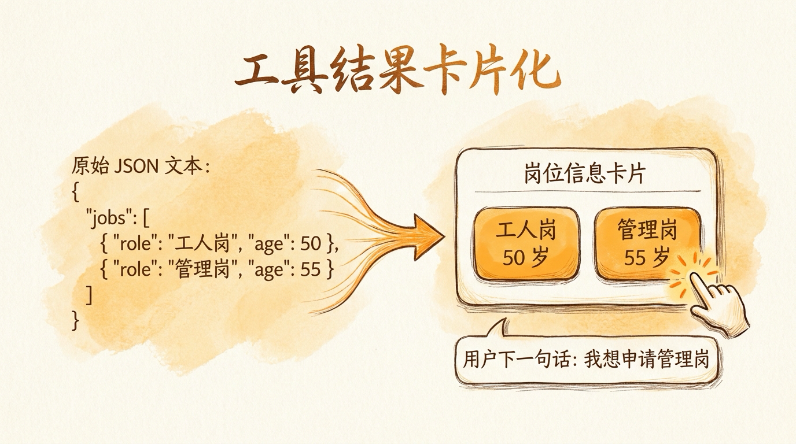
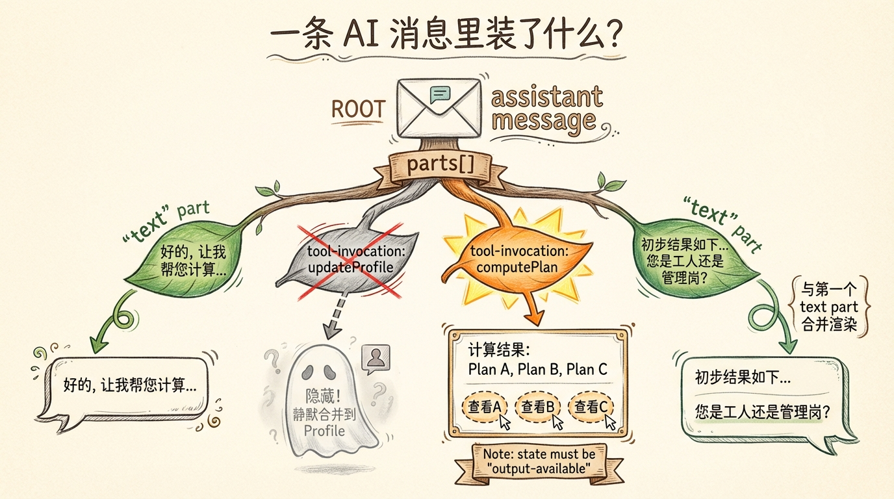
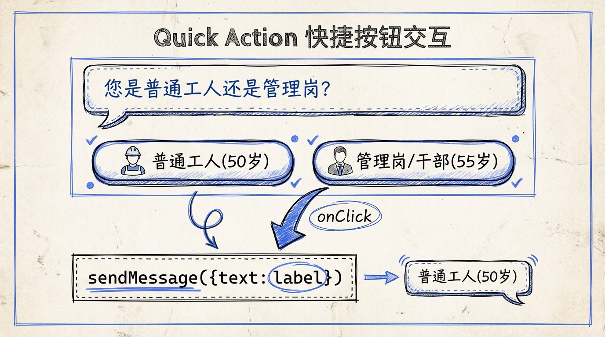
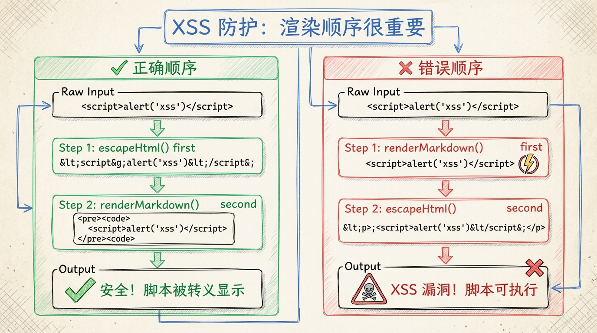
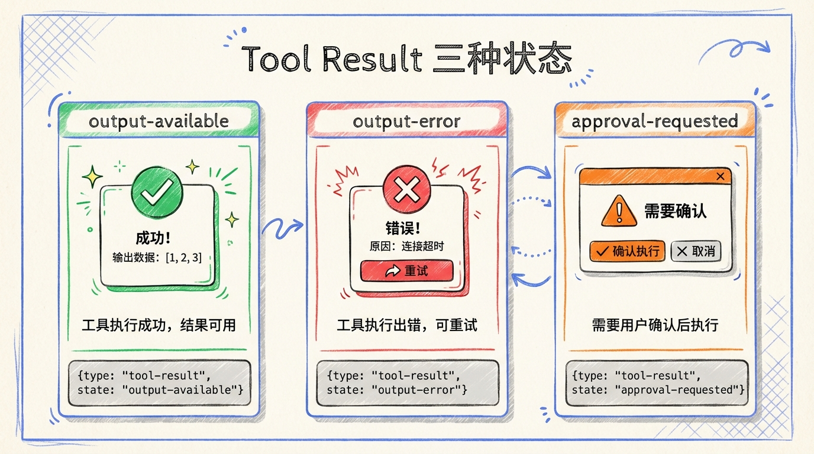

# 第 17 节 · 工具结果卡片化：把 JSON 变成有按钮的 UI



> **预计时长**：阅读 30 分钟 / 实战 75 分钟
> **前置知识**：[第 16 节《前端集成：useChat + assistant-ui 双栈对比》](./17-frontend-integration.md)、对 React 19 渲染机制有基础了解
> **本节代码**：`ssp-web` 仓库 `chapter-17` tag · 主要文件 `src/components/chat/ToolResultCard.tsx`、`src/components/chat/ChatPanel.tsx`

那天小赵发来一段 AI 回复的截图问我："Dennis 你看这个对不对？"

截图里 AI 写着："您可以选择**工人岗 50 岁**退休，或者**管理岗 55 岁**退休，前者影响最低缴费年限，后者保留延迟弹性。请选择一个继续。"

我说："产品意义对，UI 错。"

小赵愣住："哪里错了？"

"AI 让用户选择工人岗或管理岗——那不是文字括号，**那是真按钮**。"

我让她打开 `ssp-web` 的对话界面跑一遍同样的输入，她亲眼看到：AI 流式打完最后一个字，气泡下面**多出来两个蓝色按钮**——「工人岗（50 岁）」和「管理岗（55 岁）」。点哪个，哪个就直接当成用户的下一句话发出去。"哦，"她说，"差距就在这。我一直在想 AI 怎么写得更清楚，没想过 UI 能不能少一步。"

这就是这一节要讲的事：**Tool calling 拿到的不是文字，是 JSON。把 JSON 变成 UI，再把 UI 变成用户的下一句话——这是 AI Agent 产品体验和 ChatGPT 拷贝粘贴体验的分水岭。**

---

## 一、知识铺垫：UIMessage parts 协议

要把工具结果卡片化，先得搞清楚一件事：**Vercel AI SDK v6 的一条消息不是字符串，是 parts 数组**。

```ts
interface UIMessage<METADATA = unknown> {
  id: string;
  role: 'system' | 'user' | 'assistant';
  metadata?: METADATA;
  parts: Array<UIMessagePart>;
}
```

每个 part 有一个 `type` 字段决定它是什么。常见类型：

| `type` | 用途 | 关键字段 |
|:---|:---|:---|
| `text` | 文本 | `text: string`, `state?: 'streaming' \| 'done'` |
| `reasoning` | 推理过程（o1 / Claude thinking） | `text`, `state`, `providerMetadata?` |
| `source-url` | 来源 URL | `sourceId`, `url`, `title?` |
| `source-document` | 来源文档 | `sourceId`, `mediaType`, `title` |
| `file` | 文件附件 | `mediaType`, `url`, `filename?` |
| `tool-${toolName}` | 静态工具调用 | `toolCallId`, `state`, `input`, `output?` |
| `dynamic-tool` | 动态工具（MCP） | `toolName`, `state`, `input`, `output?` |
| `data-${name}` | 自定义结构化数据 | `id?`, `data` |
| `step-start` | 多步分隔标记 | （仅 type） |

**`tool-*` 是关键**。每注册一个 tool，v6 会自动派生一个 part type——`tool-computePlan` / `tool-updateProfile` / `tool-validateField`。这种"按工具命名"的设计让你可以在前端针对每个工具写专属的渲染逻辑，类型完全可推导。

工具 part 的 `state` 字段是流式状态机：

```
input-streaming   → 模型在生成 JSON 入参（边生成边发 delta）
input-available   → 完整入参已 ready，准备执行
output-available  → execute 返回了 result
output-error      → execute 抛了
approval-requested → needsApproval 阻止执行，等用户决策
```

每态对应一种 UI——下面会一个一个讲。



<!-- 图片说明（给图片代理）：
风格：信息图（infographic）
内容：一条 assistant 消息的剖析图
左侧 message 框，里面是 parts[] 数组
parts[0]: text "好的，让我帮您计算..."
parts[1]: reasoning（折叠"思考中"，灰色字）
parts[2]: tool-updateProfile（input-streaming → input-available → output-available）
parts[3]: tool-computePlan（同样三态变化）
parts[4]: text "初步结果出来了..."
右侧标注：每个 part 是独立渲染单元
-->

---

## 二、核心讲解

### 2.1 UIMessage parts 类型大全

照着 SSP 的实际渲染代码看一眼 part 类型分发：

```tsx
// 第 17 节示意代码（基于 ssp-web ChatPanel.tsx 的渲染逻辑）
function renderPart(part: UIMessagePart, key: number) {
  switch (part.type) {
    case 'text':
      return <TextBubble key={key} text={part.text} streaming={part.state === 'streaming'} />;

    case 'tool-updateProfile':
      // 静默处理，不渲染
      return null;

    case 'tool-computePlan':
      return <ToolResultCard key={key} part={part} />;

    // reasoning / tool-validateField / dynamic-tool / step-start / source-url
    // 各自分发到专属组件，逻辑同上，此处省略

    default:
      return null;
  }
}
```

注意几个实战点：

1. **`updateProfile` 直接 `return null`**——这是产品决策，不是 bug。详见下面 17.4。
2. **`step-start` 第一个忽略**——多步循环会在每步开头插一个 `step-start`，第一步前面没必要分隔。
3. **`source-url` 仅在 `sendSources: true` 时出现**——服务端 `toUIMessageStreamResponse({ sendSources: true })` 才会发到前端。

### 2.2 ToolResultCard 设计：708 行的工具卡片

`ssp-web` 的 `src/components/chat/ToolResultCard.tsx` 有 708 行，渲染的是 `computePlan` 和 `validateField` 两个工具的结果。它的输入是一个 part，状态分发：

```tsx
// 简化版本（真实代码 708 行处理了更多分支）
function ToolResultCard({ part }: { part: ToolUIPart<typeof tools.computePlan> }) {
  // 1. 输入流式中：显示骨架屏
  if (part.state === 'input-streaming' || part.state === 'input-available') {
    return <SkeletonCard label="正在为您计算社保方案…" />;
  }

  // 2. 出错：友好提示
  if (part.state === 'output-error') {
    return <ErrorCard text={part.errorText} />;
  }

  // 3. 等待批准（SSP 暂不用）
  if (part.state === 'approval-requested') {
    return <ApprovalRequest part={part} />;
  }

  // 4. 成功：渲染业务卡片（四个子组件见下文）
  if (part.state === 'output-available') {
    return <SuccessCard output={part.output} />;
  }

  return null;
}
```

四个区块对应 SSP 计算结果的四个 section：

- **PlanSummary**：方案概览（退休年龄 / 法定退休日期 / 养老缺口）
- **ScenarioCompare**：早退 vs 晚退场景对比（来自 `scenario-builder.ts` 的多场景输出）
- **SubsidyAdvice**：4050 / 大龄岗补 / 失业金等补贴推荐（来自 `subsidy-advisor.ts`）
- **CaveatList**：caveats 列表（提醒用户的注意事项 + confidence 标注）

> **看这里 →**：卡片不是堆数据，是**给用户决策用的视觉摘要**。SSP 的 ScenarioCompare 是双栏对比图，左边"早退（59 岁）" / 右边"晚退（62 岁）"，每栏只显示三件事：每月养老金、总收入差、关键风险。复杂的 calc 数据藏在折叠区，默认不显示。**给用户看的不是计算过程，是结论。**

### 2.3 一段真实 part 流：从用户问到卡片落地

把"用户问 → AI 思考 → 调工具 → 返回结果"这一段的 SSE 真实流摆出来。这是 SSP 在 chrome devtools 里能直接看到的。

```
T0  用户：「我是73年女性，灵活就业，养老交了180个月」

T1  POST /api/chat（带 conversationId / sessionId / userProfile / questions）

T2  服务端：streamText 启动，开始流式

T3  → SSE: { type: 'text-delta', delta: '好' }
    → SSE: { type: 'text-delta', delta: '的' }
    → SSE: { type: 'text-delta', delta: '，让' }
    ... 文字一个 token 一个 token 流
    → SSE: { type: 'text-done', text: '好的，让我帮您计算...' }

T4  → SSE: { type: 'reasoning-delta', delta: '用户提到...' }
    （仅当服务端 sendReasoning: true 时才发）

T5  → SSE: { type: 'tool-input-streaming-start', toolCallId: 'call_1', toolName: 'updateProfile' }
    → SSE: { type: 'tool-input-delta', toolCallId: 'call_1', delta: '{"basic":{"birth_y' }
    → SSE: { type: 'tool-input-delta', toolCallId: 'call_1', delta: 'ear":1973,"gen' }
    ... 入参 JSON 流式生成
    → SSE: { type: 'tool-input-available', toolCallId: 'call_1', input: {...} }
    → SSE: { type: 'tool-output-available', toolCallId: 'call_1', output: { updated: true, profile: {...} } }

T6  → SSE: { type: 'tool-input-streaming-start', toolCallId: 'call_2', toolName: 'computePlan' }
    ...
    → SSE: { type: 'tool-output-available', toolCallId: 'call_2', output: { needs_agent: false, plan_id: '...', plan: {...} } }

T7  → SSE: { type: 'text-delta', delta: '初步结果出来了...' }
    → SSE: { type: 'finish' }
```

**前端在每一步看到什么？**

- T3：`parts[0]` 状态从无到有，`text` 字段从 "" → "好" → "好的" → ... → 完整文字
- T5：`parts[1]` 出现，state 从 `input-streaming` → `input-available` → `output-available`
- T6：`parts[2]` 出现，state 同上
- T7：`parts[3]` 出现并流式更新

**关键事实**：`useChat` 内部把这些 SSE 事件**自动 reduce 成 messages 数组**，你的 React 组件每次只看到最新快照。流式打字效果是 React 重渲染产生的，不需要任何定时器。

> **小提醒**：在 `parts[1]` 处于 `input-streaming` 时，`part.input` 是**部分 JSON 字符串**。SDK v6 会用 `partial-json` 库尝试把它转成 partial object——你可以在卡片骨架屏里展示"正在解析参数..."的进度，但**不要尝试访问 `part.output`**（它根本还不存在）。

### 2.4 自定义渲染：tool 类型分发与 JSON → React

工具卡片的核心是把 JSON 翻译成 React 组件。SSP 的 `ToolResultCard` 主要做三件事：

**第一，类型推断**。v6 的 `useChat<MyAgentUIMessage>` 配合 `InferAgentUIMessage<typeof agent>` 可以让你在 part 类型上拿到精确的 input/output 形状：

```tsx
import type { ToolUIPart, InferUITools } from 'ai';
import { tools } from '@/lib/ai/tools';

type SSPTools = InferUITools<typeof tools>;
type ComputePlanPart = ToolUIPart<SSPTools, 'computePlan'>;

function ToolResultCard({ part }: { part: ComputePlanPart }) {
  if (part.state === 'output-available') {
    // part.output 已经是 computePlan 的 outputSchema 推断类型
    const planId = part.output.plan_id; // string
    const scenarios = part.output.plan.scenarios; // Scenario[]
    // ...
  }
}
```

不再需要 `as any` 或者重复定义 type——schema 是单一真理源，前后端共享。

**第二，按业务字段分发渲染**。`computePlan` 返回的 `output.plan` 包含 5 个 section（plan / calc / scenarios / subsidies / trace），每个 section 渲染一个子组件：

```tsx
{output.plan && <PlanSummary plan={output.plan} />}
{output.plan.scenarios && <ScenarioCompare scenarios={output.plan.scenarios} />}
{output.plan.recommendedSubsidies && <SubsidyAdvice subsidies={output.plan.recommendedSubsidies} />}
{output.caveats && <CaveatList caveats={output.caveats} />}
{output.trace && (
  <details>
    <summary>查看证据链（trace）</summary>
    <TraceView trace={output.trace} />
  </details>
)}
```

`<details>` 把 trace 折叠起来——这是给"想看为什么"的用户准备的，默认不展开。

**第三，把数字格式化成人话**。规则引擎返回的 `pension_amount: 2847.32`，给用户看的应该是 `¥2,847.32 / 月`。这一层格式化是前端的活：

```tsx
function formatCNY(amount: number): string {
  return new Intl.NumberFormat('zh-CN', {
    style: 'currency',
    currency: 'CNY',
    maximumFractionDigits: 0,
  }).format(amount);
}

function formatYearMonth(date: string): string {
  // 2030-06 → 2030 年 6 月
  const [y, m] = date.split('-');
  return `${y} 年 ${parseInt(m, 10)} 月`;
}
```

> **划重点**：服务端返回原始数据，前端做格式化。这是经典的"模型输出 vs 视图层"分离。如果 LLM 在 tool output 里直接写 `"¥2,847.32"`，你就被锁在中文上下文里了。**业务字段保持机器可读，UI 字段在前端转人话。**

### 2.5 快速操作按钮：addToolOutput 配合 client tool

有些工具是"等用户做选择"的——用户不点按钮，工具就没办法继续。这就是**客户端工具**（client-side tool）的用法：tool 在服务端定义但没有 `execute`，前端用 `addToolOutput()` 提供结果。

举个例子：用户问"你要看晚退方案还是早退方案？"，AI 应该弹两个按钮，用户点哪个，把那个选项作为工具结果回填，让 AI 接着说下面的话。

服务端这样定义：在 `src/lib/ai/tools.ts` 里用 `tool()` 注册一个 `askPreference`，`inputSchema` 描述 `question` 和 `options[]`，但**故意不写 `execute`**——这正是客户端工具的标志。前端在按钮 `onClick` 里调用 `addToolOutput({ tool, toolCallId, output })` 提供结果（**注意不要 `await`，会死锁**），配合 `useChat({ sendAutomaticallyWhen: lastAssistantMessageIsCompleteWithToolCalls })`。

`sendAutomaticallyWhen: lastAssistantMessageIsCompleteWithToolCalls` 会在 `addToolOutput` 之后**自动再发一次请求**——模型收到工具结果，继续生成下一段文字或继续调下一个工具。

**SSP 的实际做法略有不同**——它的"快速操作按钮"不是用 client tool 实现的，而是从 `computePlan` 的服务端结果里读取 `questions[]`，然后把每个 option 渲染成按钮，**点击 = 调用 `sendMessage({ text: option.label })`**：

```tsx
// 简化示意
{questions.map((q) => (
  <div key={q.field}>
    <p>{q.label}</p>
    {q.options?.map((opt) => (
      <button onClick={() => sendMessage({ text: opt.label })}>
        {opt.label}
      </button>
    ))}
  </div>
))}
```

**两种实现的区别**：

| 维度 | client tool + addToolOutput | sendMessage 直接发 |
|:---|:---|:---|
| 服务端语义 | 工具调用，可以多步循环 | 普通用户消息 |
| 用户消息记录 | 不会出现在用户消息历史里 | 会出现一条用户消息 |
| 模型理解 | 工具结果，更结构化 | 自由文本，依赖 prompt 解析 |
| 适用场景 | 需要多步交互（点完一个再点一个） | 简单的"问答式追问" |

SSP 选后者是因为追问只有一轮、用户消息出现在历史里也合理（"灵活就业"作为用户的回答记下来很自然）。如果是"先选 A 还是 B，再确认是否查看 B 的详细数据"这种多步选择，前一种更合适。



<!-- 图片说明（给图片代理）：
风格：手绘风格对比图
左侧「sendMessage 路径」：
  AI: "您目前的就业状态是？"
  按钮组: [在职] [灵活就业] [未就业]
  用户点击 → 出现一条新的用户气泡 "灵活就业"
  → AI 接着回复
右侧「client tool 路径」：
  AI 调用 askPreference 工具
  按钮组: [选 A] [选 B]
  用户点击 → 不出现用户气泡，直接 addToolOutput
  → AI 收到工具结果继续输出
底部标注：单轮选择用前者，多步交互用后者
-->

### 2.6 流式中断与恢复：stop / regenerate / resumeStream

用户中途想停下重来，怎么办？`useChat` 给了三个动作：

```tsx
const { stop, regenerate, resumeStream } = useChat({...});

// 1. 中断当前流（保留已生成的部分）
<button onClick={stop}>停止生成</button>

// 2. 重新生成最后一条 assistant 消息
<button onClick={() => regenerate()}>重新回答</button>

// 3. 流被网络中断后续传 [需核实]
useEffect(() => {
  // 页面恢复时尝试 resume
  resumeStream?.();
}, []);
```

**`stop()` 的行为**：

- 立即终止 SSE 连接
- `status` 从 `streaming` → `ready`
- 已生成的 parts 保留在 `messages` 里，文字不会消失
- 工具调用如果在 `input-streaming` / `input-available` 状态，**不会执行 execute**

**`regenerate()` 的行为**：

- 删除最后一条 assistant 消息
- 用倒数第二条用户消息重新发请求
- 可以指定 `messageId`：`regenerate({ messageId: 'msg_xxx' })` 重新生成特定一条

**`resumeStream` 是 v6 的新东西**，但截至 2026 Q1 在自定义 backend 下的端到端协议官方还标"experimental"。对 SSP 这种用标准 SSE 的项目，简单的"刷新页面 → 加载历史 → 接着聊"流程已经够用，`resumeStream` 主要是给长流（视频生成、复杂代码生成）准备的。

> **小提醒**：`stop()` 之后用户可能立刻想"重新生成"。SSP 的做法是在停止后给一个"重新回答"按钮，调用 `regenerate()`。**不要让用户再打一遍同样的问题。**

### 2.7 XSS 防护：永远不要信任 LLM 输出

工具结果可以是结构化数据，安全。但 `text` part 是模型生成的字符串，要渲染 Markdown 就要走 `dangerouslySetInnerHTML`——这是 XSS 的入口。

防御铁律一句话：**先转义 HTML，再解析 Markdown**。

```tsx
import DOMPurify from 'dompurify';
import { marked } from 'marked';

function safeRenderMarkdown(text: string): string {
  // 1. Markdown → HTML
  const html = marked.parse(text);
  // 2. 清洗：剥掉 <script>、onload、javascript: 等
  return DOMPurify.sanitize(html, {
    ALLOWED_TAGS: ['p', 'strong', 'em', 'ul', 'ol', 'li', 'code', 'pre', 'h1', 'h2', 'h3', 'a'],
    ALLOWED_ATTR: ['href'],
  });
}

// 使用：
<div dangerouslySetInnerHTML={{ __html: safeRenderMarkdown(part.text) }} />
```

**为什么不能反过来（先 escape 再 parse Markdown）？** Markdown 的格式标记（`**bold**`、`- list`）需要保留——`marked` 解析时会把这些转成 `<strong>` / `<ul>`。如果你先 escape，HTML 标签字符已经变成实体（`&lt;strong&gt;`），用户看到的就是一堆乱码。

**为什么 `escapeHtml` + `marked` 不够？** 因为 Markdown 本身允许 `<a href="javascript:alert(1)">click</a>` 这种合法但危险的链接。`DOMPurify` 才是最后一道墙——它对 HTML 做语义级的清洗，不只是字符转义。

`@assistant-ui/react-markdown` 内部就用了 DOMPurify，所以用 `MarkdownTextPrimitive` 渲染天然安全。如果你不用 assistant-ui、自己 marked → setHTML，**DOMPurify 必须加上**。

> **划重点**：XSS 防护铁律——LLM 是外部输入，模型再"安全"也会被 prompt injection。生产代码里**永远不要信任 LLM 输出能直接进 DOM**。



<!-- 图片说明（给图片代理）：
风格：手绘风格流程对比
左侧「正确」绿色：
原始文本: "**hello** <script>alert(1)</script>"
→ marked 解析: "<p><strong>hello</strong> <script>alert(1)</script></p>"
→ DOMPurify 清洗: "<p><strong>hello</strong></p>"
→ setInnerHTML: 用户看到加粗 "hello"
右侧「错误」红色：
原始文本: "**hello** <script>alert(1)</script>"
→ 直接 setInnerHTML: 脚本执行!
底部标注：marked + DOMPurify + 白名单 ALLOWED_TAGS
-->

---

## 三、举一反三：报税 / 医疗 Agent 的卡片化设计

工具结果卡片这一套抽象出来，换领域怎么用？

**比如要做一个个税申报助手**，工具是 `computeTax`、返回的 JSON 包括「应纳税所得 / 各档级税率拆解 / 已预扣税额 / 应退/补金额」。卡片的渲染策略：

- 顶部一行**一个数字**：「您应**退税** ¥3,247」（红色或绿色根据正负）
- 中部一张**柱状图**：6 个税率档级，每档应纳税额
- 底部一个**操作按钮**：「一键导出退税申请单 PDF」（这就是 `needsApproval` 工具的天然落点——点击后调 generatePdf，等用户确认后才执行）

**比如要做一个智能医疗问诊**，工具是 `searchSymptom` 返回「可能病因列表 + 推荐就诊科室 + 紧急程度」。卡片要做三件事：

- 把"紧急程度: high"翻译成醒目的红色 banner——**高紧急**优先级覆盖一切
- 病因列表必须给**置信度**而不是排名（"高度可能" / "中度可能"），避免给用户"这就是答案"的误导
- "推荐就诊科室"是按钮，点击 = `sendMessage({ text: '查心内科附近医院' })` 触发下一步工具

**比如要做一个商品比价助手**，工具是 `compareProducts` 返回三个 SKU 的对比表。卡片渲染：

- 标题"对比 3 件商品"
- 横向并排卡片，每张显示价格、评分、关键参数
- 价格最低的那张加金色边框 + "最优"角标
- 每张卡片底部有"加入购物车"按钮（client tool 模式，点击 = `addToolOutput({ tool: 'addToCart', output: { sku: '...' } })`，让 Agent 知道用户的选择）

**核心原则不变**：

1. **数据归数据，UI 归 UI**——服务端返回原始 JSON，前端做格式化和决策视觉
2. **状态机要齐全**——`input-streaming` / `output-available` / `output-error` 三态都有 UI
3. **用户可操作部分要醒目**——按钮永远比文字括号更容易被点
4. **复杂数据用折叠**——`<details>` 默认收起 trace / 详细计算，懂的人会展开
5. **永远不要信任 LLM 输出的 HTML**

---

## 四、小结

工具结果卡片化是 AI Agent 产品最容易被低估的一层。后端做对了 70%（streamText + tools + 规则引擎），但前端要把 JSON 变成"用户愿意点的 UI"——这层做不好，整个产品就停留在"会聊天的搜索框"。

SSP 的 708 行 `ToolResultCard.tsx` 不是"很多代码"，是"业务表达"——每个细节都是给用户决策用的视觉提示。当你的 AI 让用户做选择时，**那不是文字括号，那是按钮**——这一句话足以把整个交互层从 ChatGPT 拷贝粘贴升级到生产级 Agent 产品。

下一节我们会讲 Agent 记忆系统——为什么对话三轮之后 Agent 突然忘了用户姓名？四种记忆怎么协作？这是把"短对话能用"做到"长对话靠谱"的最后一道关。



<!-- 图片说明（给图片代理）：
风格：手绘风格小结卡片
标题"工具卡片化 6 件事"
1. UIMessage 是 parts[] 数组，不是字符串
2. tool-${toolName} 是 v6 自动派生的 part 类型
3. state 四态都要有 UI（input-streaming / input-available / output-available / output-error）
4. 客户端工具用 addToolOutput 配合 sendAutomaticallyWhen 续跑
5. 数字格式化在前端做，业务字段保持机器可读
6. XSS 防护铁律：先 marked 再 DOMPurify
底部一句话：把 JSON 变成有按钮的 UI 是 Agent 产品体验的分水岭
-->

**核心要点回顾**：

- UIMessage parts 协议：`text` / `reasoning` / `tool-*` / `dynamic-tool` / `data-*` / `step-start` / `source-*` / `file`
- 工具 part 状态机：`input-streaming → input-available → output-available / output-error / approval-requested`
- ToolResultCard 是 SSP 业务定制的核心——708 行渲染 PlanSummary / ScenarioCompare / SubsidyAdvice / CaveatList
- 客户端工具（无 execute）配合 `addToolOutput` 实现"用户点按钮 = 工具结果"
- SSP 的快速操作按钮用 `sendMessage` 路径而非 client tool，因为是单轮追问
- `stop()` / `regenerate()` 给用户掌控感；`resumeStream` 适合长流（实验性）
- XSS 防护：`marked` → `DOMPurify` 白名单清洗 → `dangerouslySetInnerHTML`

---

## 思考题

1. **【开放题】**：SSP 把 `updateProfile` 的工具 part 完全隐藏（`return null`），这个设计你认同吗？反方观点是"用户应该看到 AI 在做什么"。请给出你的判断和场景边界——什么时候应该可见，什么时候应该静默？
2. **【动手题】**：在你的项目里实现一个"展开证据链"折叠区。后端工具返回 `trace: TraceEntry[]`，前端用 `<details>` 默认收起，展开后显示每条规则的命中情况。验收：能完整展示 24 条规则中触发的那部分，每条带 rule_id + 命中时刻 + 影响字段。
3. **【选做】**：实现一个"工具结果导出 PDF"的 `needsApproval` 工具。后端注册时 `needsApproval: true`，前端在 `state === 'approval-requested'` 时弹出确认按钮。点击批准后 `addToolApprovalResponse({ id, approved: true })`，工具执行 generatePdf 并返回下载链接。验收：批准流程不阻塞当前对话，下载链接在卡片中以按钮形式可点。

---

## 面试题

**Q1.【基础】【主题：流式 UI 与前端集成】** AI SDK v6 的 `UIMessage` 为什么用 `parts` 数组而不是 `content` 字符串？工具调用的 part 是怎么命名的？
<details><summary>参考解答</summary>

v6 的一条消息不是字符串，是 `parts` 数组（与本节一、知识铺垫一致）。每个 part 有 `type` 字段决定它是什么：`text` / `reasoning` / `tool-${toolName}` / `dynamic-tool` / `data-${name}` / `step-start` / `source-url` / `file` 等。

**用 parts 的理由**：一条 assistant 消息可能同时包含文字、推理过程、多个工具调用、来源引用——用单一 `content` 字符串无法表达这种结构。parts 让每个片段成为独立的渲染单元，前端可以针对每种类型写专属渲染逻辑。

**工具 part 命名**：每注册一个 tool，v6 会自动派生一个 part type，命名为 `tool-` + 工具名，如 `tool-computePlan` / `tool-updateProfile` / `tool-validateField`。这种「按工具命名」的设计让前端能针对每个工具写精确的、类型可推导的渲染逻辑（配合 `InferUITools` / `ToolUIPart` 拿到 input/output 的精确类型）。

</details>

**Q2.【进阶】【主题：流式 UI 与前端集成】** 工具 part 的 `state` 字段有哪几种状态？每种状态前端应该渲染什么？为什么在 `input-streaming` 时不能访问 `part.output`？
<details><summary>参考解答</summary>

工具 part 的 `state` 是一个流式状态机（与本节一、2.2 一致），五种状态：

- `input-streaming`：模型在流式生成 JSON 入参（边生成边发 delta）→ 渲染骨架屏「正在解析参数…」
- `input-available`：完整入参 ready，准备执行 → 渲染骨架屏 / loading
- `output-available`：`execute` 返回了结果 → 渲染业务卡片（如 `ssp-web` 的 PlanSummary / ScenarioCompare）
- `output-error`：`execute` 抛错 → 渲染友好错误提示
- `approval-requested`：`needsApproval` 阻止执行，等用户决策 → 渲染批准按钮

**为什么 `input-streaming` 时不能访问 `part.output`**：此时入参 JSON 还没流完、`execute` 根本没执行，`output` 字段不存在。访问会得到 undefined 甚至报错。在此阶段 `part.input` 也只是**部分 JSON 字符串**，SDK v6 用 `partial-json` 尝试解析成 partial object——可以展示进度，但不要假设字段完整。

</details>

**Q3.【进阶】【主题：流式 UI 与前端集成】** "客户端工具 + `addToolOutput`" 和 "直接 `sendMessage`" 两种快速操作按钮实现有什么区别？`ssp-web` 为什么选后者？
<details><summary>参考解答</summary>

两种实现的区别（与本节 2.5 对比表一致）：

| 维度 | client tool + addToolOutput | sendMessage 直接发 |
|---|---|---|
| 服务端语义 | 工具调用，可多步循环 | 普通用户消息 |
| 用户消息记录 | 不出现在用户历史里 | 会出现一条用户消息 |
| 模型理解 | 工具结果，更结构化 | 自由文本，依赖 prompt 解析 |
| 适用场景 | 多步交互（点完一个再点一个） | 简单的问答式追问 |

client tool 模式：tool 在服务端定义但**无 `execute`**，前端在按钮 `onClick` 里调 `addToolOutput({ tool, toolCallId, output })`（注意不能 `await`，会死锁），配合 `sendAutomaticallyWhen` 自动续跑。

`ssp-web` 选 `sendMessage` 路径，是因为它的追问只有一轮：从 `computePlan` 结果里读 `questions[]`，把每个 option 渲染成按钮，点击 = `sendMessage({ text: option.label })`。用户的回答（如「灵活就业」）出现在消息历史里也很自然、符合直觉。如果是「先选 A 还是 B，再确认是否查看详细数据」这种多步选择，client tool + addToolOutput 更合适。

</details>

**Q4.【深挖】【主题：安全护栏】** 渲染 LLM 输出的 Markdown 时，为什么必须「先 `marked` 解析再 `DOMPurify` 清洗」，而不能反过来？为什么 `escapeHtml` + `marked` 还不够？
<details><summary>参考解答</summary>

**为什么不能反过来（先 escape 再 parse）**（本节 2.7）：Markdown 的格式标记（`**bold**`、`- list`）需要保留——`marked` 解析时会把它们转成 `<strong>` / `<ul>`。如果先 escape，HTML 标签字符已经变成实体（`&lt;strong&gt;`），用户看到的是一堆乱码而非格式化内容。所以正确顺序是 `marked.parse(text)` → `DOMPurify.sanitize(html, { ALLOWED_TAGS, ALLOWED_ATTR })` → `dangerouslySetInnerHTML`。

**为什么 `escapeHtml` + `marked` 不够**：Markdown 本身允许 `[click](javascript:alert(1))` 这种合法语法但危险的链接，`marked` 会把它转成可点击的 `<a href="javascript:...">`。字符转义层面的 `escapeHtml` 拦不住这种语义级攻击。`DOMPurify` 才是最后一道墙——它对 HTML 做语义级清洗（剥 `<script>`、`onload`、`javascript:` 协议等），配合白名单 `ALLOWED_TAGS` / `ALLOWED_ATTR` 把攻击面降到最小。

**铁律**：LLM 是外部输入，模型再「安全」也会被 prompt injection。生产代码里永远不要信任 LLM 输出能直接进 DOM。`@assistant-ui/react-markdown` 内部已用 DOMPurify，所以用 `MarkdownTextPrimitive` 渲染天然安全；自己 marked → setHTML 时必须显式加 DOMPurify。

</details>

---

## 延伸阅读

- [Vercel 官方：Stream Protocol（v6 SSE 协议）](https://ai-sdk.dev/docs/ai-sdk-ui/stream-protocol)
- [Vercel 官方：Chatbot Tool Usage](https://ai-sdk.dev/docs/ai-sdk-ui/chatbot-with-tool-calling)
- [UIMessage Reference](https://ai-sdk.dev/docs/reference/ai-sdk-core/ui-message)
- [DOMPurify 官方文档](https://github.com/cure53/DOMPurify)
- [assistant-ui Markdown Renderer](https://www.assistant-ui.com/docs/ui/markdown)

---

[← 上一节：第 16 节 前端集成](./17-frontend-integration.md) · [📚 目录](./README.md) · [下一节：第 18 节 Agent 记忆系统 →](./19-agent-memory.md)
