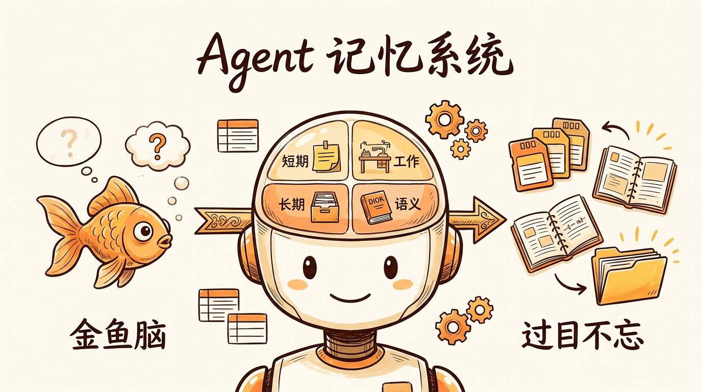
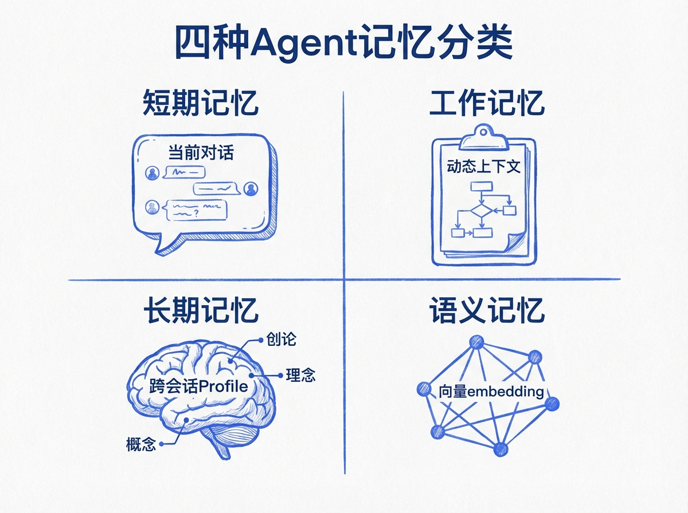
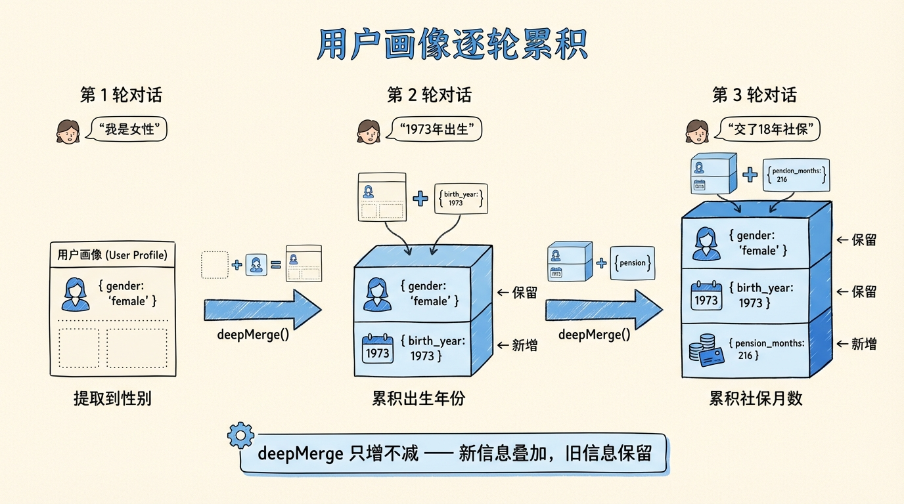
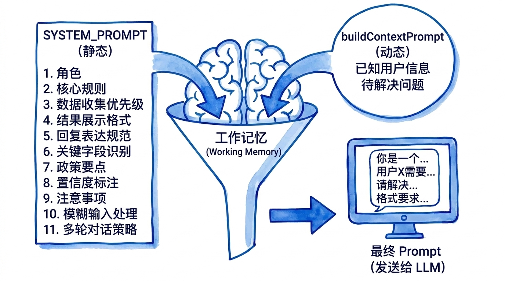
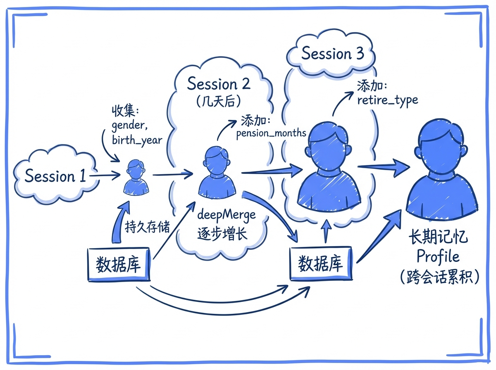
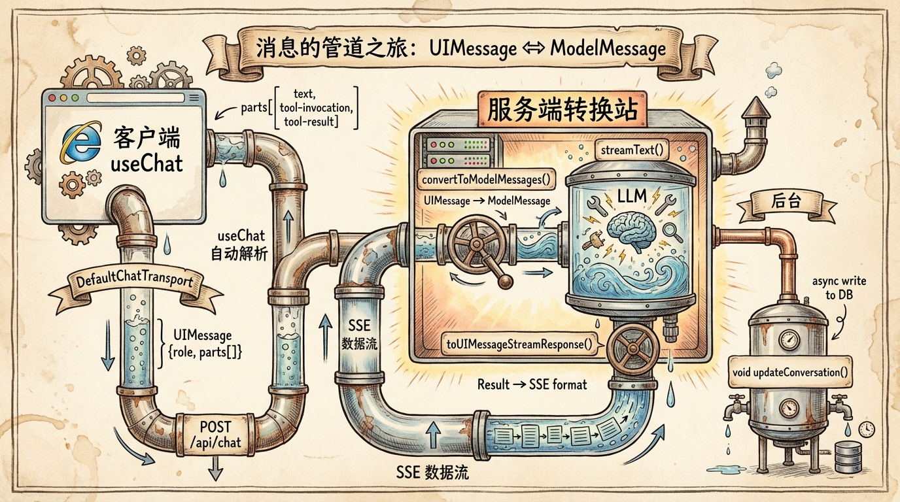
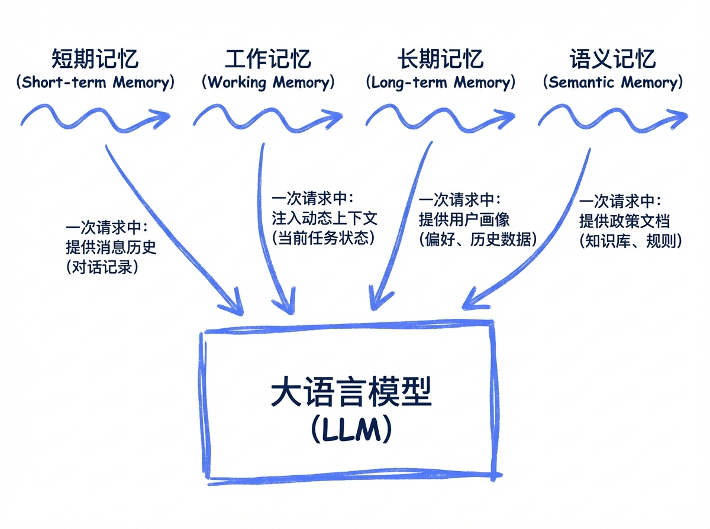

# 第 18 节 · Agent 记忆系统：从金鱼脑到过目不忘



> **预计时长**：阅读 30 分钟 / 实战 75 分钟
> **前置知识**：[第 17 节《工具结果卡片化：把 JSON 变成有按钮的 UI》](./18-streaming-ui.md)、对 PostgreSQL JSONB 有基础了解
> **本节代码**：`ssp-web` 仓库 `chapter-18` tag · 主要文件 `src/lib/db/schema.ts`、`src/lib/db/queries.ts`、`src/components/chat/ChatPanel.tsx`、`src/lib/ai/prompts.ts`

我一边喝咖啡一边给小赵演示 SSP，她在旁边看着。

我说："我 1975 年出生的女性。"
AI 答："好的，了解了您的基本信息。"
我接着说："灵活就业，养老交了 180 个月。"
AI 回："请问您的性别和出生年份是？"

小赵在那边噗嗤一声："这是金鱼脑。**我刚说我 1975 年生的，AI 下一句问'您贵庚？'**"

我说："对。这是早期版本。我们后来花了三周修这个 bug，最后写了 4 张表 + 3 个 hook + 1 套 deepMerge——SSP 里**每一行你认为微不足道的代码，背后都是为了不让 Agent 忘事**。"

这一节就讲这件事：**Agent 怎么从'金鱼脑'变成'过目不忘'**。不是某个魔术，是四种记忆按职责拆开、各自做好自己的活。

人类的记忆分好几种：刚才说的话你记得（短期），目前在想的事你记得（工作），昨天聊过的事你记得（长期），"1+1=2"你也记得（语义）。**Agent 要像人一样好用，也得有这四套。**

---

## 一、知识铺垫：四种记忆各司其职

在认知科学里，人类记忆按持续时间和功能分成多种类型。AI Agent 的记忆系统可以照着这个框架来设计。SSP 用了四种：

| 记忆类型 | 人类类比 | Agent 实现 | 存储位置 | 生命周期 |
|:---|:---|:---|:---|:---|
| **短期记忆** | 刚才聊的内容 | `messages[]` 数组 | 内存 + DB JSONB | 单次对话 |
| **工作记忆** | 当前正在思考的上下文 | `buildContextPrompt()` 动态拼接 | 仅请求时存在 | 单次请求 |
| **用户档案** | 记住的个人信息 | `userProfile` JSONB（deepMerge 累积） | DB 持久化 | 跨会话 |
| **工具结果缓存** | 短期记忆的"工具子集" | parts 中的 tool-output | DB JSONB | 跨会话 |
| **语义记忆** | 学过的知识 | 向量嵌入 + pgvector | DB（专表） | 永久 |

> **小提醒**：上表中的"语义记忆"是 RAG 的基础，会在[第 26 节《RAG 增强与混合检索》](./27-rag-augmentation.md)详细展开。这一节聚焦前四种——也就是**对话本身的记忆系统**。

四种记忆解决四个问题：

- **短期记忆**：让 LLM 知道"刚才聊到哪了"——它本身没有上下文，每次请求必须把历史发回去
- **工作记忆**：让 LLM 知道"现在该问什么/做什么"——动态注入待回答的问题、已知的用户信息
- **用户档案**：让 Agent 知道"这个用户是谁"——跨多次对话累积稳定信息
- **工具结果缓存**：让 Agent 不重复调同一个工具——上次算过的方案直接复用

四种记忆本质上是同一件事的不同切片：**让 Agent 在合适的时机拿到合适的信息**。下面一个一个拆。



<!-- 图片说明（给图片代理）：
风格：手绘风格信息图
内容：四个并排的卡通图标
1. 短期记忆：金鱼大脑 + 时钟（短暂）
2. 工作记忆：思考气泡 + 当前任务标签
3. 用户档案：身份证+档案夹（长期累积）
4. 工具结果缓存：缓存图标+计算器（避免重复算）
底部："四套记忆各司其职，让 Agent 不再金鱼脑"
-->

---

## 二、核心讲解

### 2.1 短期记忆：messages 数组与 UIMessage / ModelMessage 双轨制

短期记忆的载体就是 `messages[]`——每条消息按时间顺序排列，记录用户和 Agent 的所有发言。但这里有一个关键的双轨制：**前端用 `UIMessage`，后端调模型用 `ModelMessage`**。

```ts
// UIMessage：前端 useChat 管理的格式（带 parts、metadata）
interface UIMessage {
  id: string;
  role: 'user' | 'assistant' | 'system';
  parts: Array<UIMessagePart>;  // 可能包含 text / tool-* / reasoning 等
  metadata?: unknown;
}

// ModelMessage：发给 LLM API 的格式（OpenAI 标准）
type ModelMessage =
  | { role: 'system'; content: string }
  | { role: 'user'; content: string | ContentPart[] }
  | { role: 'assistant'; content: string | ContentPart[]; tool_calls?: ToolCall[] }
  | { role: 'tool'; tool_call_id: string; content: string };
```

两者必须显式转换。SDK v6 提供了 `convertToModelMessages`：

```ts
// src/app/api/chat/route.ts:234
const messages = await convertToModelMessages(uiMessages);
const result = createChatStream(messages, context);
```

> **看这里 →**：v6 把 `convertToModelMessages` 改成了 **async** 函数（v5 是同步），从 v5 升 v6 必须给所有调用前面加 `await`。SDK 提供 codemod：`npx @ai-sdk/codemod v6/add-await-converttomodelmessages`。

**搞混了会怎样？** 直接把 UIMessage 传给 `streamText` 的 `messages` 参数，TypeScript 类型检查会报错。如果你绕过类型强行传入，LLM 收到的消息结构是错的，工具调用可能丢失、上下文可能断裂——产出的回复看起来"好像对，又好像不对"，调起来很痛苦。

**短期记忆的存储**：SSP 用的是 PostgreSQL JSONB（不是单独的 messages 表）。

```ts
// src/lib/db/schema.ts:133-140
export const conversations = pgTable('conversations', {
  id: uuid('id').primaryKey().defaultRandom(),
  sessionId: text('session_id').notNull(),
  messages: jsonb('messages').notNull().default([]),       // UIMessage[]
  userProfile: jsonb('user_profile').default({}),           // 累积的用户画像
  createdAt: timestamp('created_at').notNull().defaultNow(),
  updatedAt: timestamp('updated_at').notNull().defaultNow(),
});
```

**为什么不建独立 messages 表？**

| 选项 | 关系表 | JSONB |
|:---|:---|:---|
| 跨会话搜索消息 | ✅ 索引方便 | ❌ 难 |
| 加载整个会话 | 需 JOIN | 一次查询 |
| 结构演进灵活性 | 需迁移 | 直接读写 |
| 主要使用场景 | 复杂检索 | LLM 一次性吞掉 |

SSP 的核心场景是"加载整个对话喂给 LLM"，不需要跨会话搜索某条消息。JSONB 一次查询拿回全部，不需要 JOIN。结构演进不用 migration——SDK 升级把 part type 改了，DB 不动。这是务实的选择。

> **划重点**：消息是"强耦合的整体"。一次对话从开始到结束几乎不会被单独拆查询某一条消息。JSONB 存储是一个 over-fitted 但合理的简化。

### 2.2 用户档案累积：updateProfile + deepMerge

这是 SSP 记忆系统最关键的部分。**用户档案**（user profile）是跨多轮对话累积出来的稳定信息——性别、出生年月、缴费月数、就业状态——以后每次对话都基于这些信息继续。

#### 数据流：每轮调用 updateProfile，前端 deepMerge 累积

`updateProfile` 工具的 execute 是个空壳子（`tools.ts:282-318` 节选）：

```ts
// src/lib/ai/tools.ts:282-318 节选
export const updateProfileTool = tool({
  description: '把用户提到的结构化信息记录到 profile（每轮一次）',
  inputSchema: z.object({
    basic: z.object({
      gender: z.enum(['male', 'female']).optional(),
      birth_year: z.number().optional(),
      birth_month: z.number().optional(),
      female_retire_type: z.enum(['worker50', 'cadre55']).optional(),
    }).optional(),
    social: z.object({
      pension_contrib_months: z.number().optional(),
      medical_contrib_months: z.number().optional(),
      // ...
    }).optional(),
    // ...
  }),
  execute: async (params) => {
    // ★ 这里没做任何持久化，只是 return 给前端
    return { updated: true, profile: params };
  },
});
```

> **看这里 →**：execute 只 `return { updated: true, profile: params }`——根本没碰数据库。**真正的累积发生在前端**。这是个故意的设计：profile 累积是 UI 状态，由前端 `onFinish` 控制 deepMerge 时机。

前端在 `ChatPanel.tsx` 的 `onFinish` 里这样做：

```tsx
// src/components/chat/ChatPanel.tsx:396-441 节选
onFinish: ({ message }) => {
  for (const part of message.parts) {
    if (
      part.type === 'tool-updateProfile' &&
      part.state === 'output-available'
    ) {
      const output = part.output as { profile?: Record<string, unknown> };
      if (output.profile) {
        // ★ deepMerge：合并而非覆盖
        setSessionProfile((prev) => deepMerge({ ...prev }, output.profile!));
      }
    }
  }
},
```

#### deepMerge 的关键细节：null/undefined 不覆盖

deepMerge 不是简单的 `Object.assign`。它有两个核心规则：

1. **嵌套对象递归合并**：`{ basic: { gender: 'female' } }` + `{ basic: { birth_year: 1975 } }` = `{ basic: { gender: 'female', birth_year: 1975 } }`，而不是后者覆盖前者
2. **null / undefined 不覆盖已有值**：LLM 在某轮可能返回 `{ basic: { gender: null } }`（它只是没提到性别，不是想清空）。如果直接 assign，前面收集到的 gender 就丢了

```ts
// 简化示意
function deepMerge(target: Record<string, any>, source: Record<string, any>) {
  for (const key in source) {
    const srcVal = source[key];
    const tgtVal = target[key];

    // 关键保护：null / undefined 不覆盖
    if (srcVal === null || srcVal === undefined) continue;

    if (typeof srcVal === 'object' && !Array.isArray(srcVal) && typeof tgtVal === 'object') {
      target[key] = deepMerge({ ...tgtVal }, srcVal);
    } else {
      target[key] = srcVal;
    }
  }
  return target;
}
```

> **小提醒**：测试这个 bug 会困惑很久——明明用户第一轮说了性别，第三轮 Agent 又问了一遍。原因是 LLM 在第二轮返回的 profile 没带 gender，直接 assign 把它覆盖成 undefined。**deepMerge + null 保护是必须的，不是"建议"。**

#### 为什么 SSP 不在服务端 deepMerge？

仔细看会发现 SSP 把 deepMerge 放在前端，这很反直觉——为什么不在服务端 `tools.ts` 的 execute 里直接读 DB、合并、写回？

理由是**架构约束**：

1. **服务端无状态**：SSP 是 Serverless 部署，每个请求是独立函数实例，没有共享内存
2. **持久化路径已分**：SSP 的 conversation messages + userProfile 在 `toUIMessageStreamResponse({ onFinish })` 流结束后**统一写一次** DB（`route.ts:172-181`）。如果 execute 内部又写一次，就有竞态
3. **前端是 single source of truth**：每次请求 body 带 `userProfile: sessionProfile`，服务端读到的就是最新的

```ts
// src/components/chat/ChatPanel.tsx:354-390 节选（每次请求注入 userProfile）
prepareSendMessagesRequest: async (options) => ({
  ...options,
  body: {
    // ...
    userProfile: sessionProfile,    // ★ 每次都把前端最新的 profile 发回去
    questions,
    conversationId,
    sessionId,
  },
}),
```

这种"前端是真理源、服务端是处理器"的模式叫 **client round-trip**。它把会话状态完全放在客户端，服务端纯函数化——非常适合 Serverless。



<!-- 图片说明（给图片代理）：
风格：手绘风格时序图
内容：横向时间线
T1 用户："我75年女性"
   → updateProfile({ basic: { gender: 'female', birth_year: 1975 } })
   → onFinish: deepMerge → sessionProfile = { basic: { gender: 'female', birth_year: 1975 } }
T2 用户："养老交了180个月"
   → updateProfile({ social: { pension_contrib_months: 180 } })
   → onFinish: deepMerge → sessionProfile = { basic: {...}, social: { pension_contrib_months: 180 } }
T3 用户："就业状态是灵活就业"
   → updateProfile({ status: { employment_status: 'flexible' } })
   → onFinish: deepMerge → sessionProfile 累积到 3 个 section
注:每轮调用 updateProfile 都只 return 当轮识别到的，前端 deepMerge 累积
-->

### 2.3 工作记忆：buildContextPrompt 动态注入

短期记忆解决了"对话历史"，但还有一个问题：**当前 Agent 应该关注什么？**

比如规则引擎跑完一轮，发现用户的 `female_retire_type` 还缺，emit 出一个 question："您是工人岗还是管理岗退休？"。这个待回答的问题需要注入到 LLM 的下一次请求里——让它知道"现在请追问这个"。

这就是工作记忆的活儿。SSP 的实现在 `prompts.ts:214-321` 的 `buildContextPrompt` 函数（节选示意）：

```ts
// src/lib/ai/prompts.ts buildContextPrompt 示意
export function buildContextPrompt(
  questions: AgentQuestion[],
  userProfile?: UserProfileSummary,
): string {
  let prompt = '';

  // 1. 注入待回答问题
  if (questions.length > 0) {
    prompt += `\n\n## 当前需要向用户收集的信息\n`;
    for (const q of questions) {
      prompt += `- ${q.text}（字段：${q.field}）\n`;
    }
  }

  // 2. 注入已知的用户画像
  if (userProfile && Object.keys(userProfile).length > 0) {
    prompt += `\n\n## 已收集的用户信息\n`;
    prompt += JSON.stringify(userProfile, null, 2);
  }

  return prompt;
}
```

`agent.ts:47-79` 把 `buildContextPrompt` 拼到 SYSTEM_PROMPT 后面：

```ts
// src/lib/ai/agent.ts:47-79 节选
const contextPrompt = context
  ? buildContextPrompt(context.questions ?? [], context.userProfile)
  : '';

const systemPrompt = contextPrompt
  ? `${SYSTEM_PROMPT}\n\n${contextPrompt}`
  : SYSTEM_PROMPT;

return streamText({
  model: openai(model),
  system: systemPrompt,
  messages,
  tools,
  stopWhen: stepCountIs(8),
  temperature: 0.3,
});
```

工作记忆的特点是**每次请求重新构建**。不持久化，也不需要持久化——它的内容是从其他记忆源（用户档案、上一轮 computePlan 的 questions）推导出来的。

> **小提醒**：System Prompt 不是越长越好。SSP 的基础 SYSTEM_PROMPT 是 169 行（`prompts.ts:10-169`），加上 buildContextPrompt 拼出来的动态部分，总长度大概 4-6KB。GPT-4o-mini 的上下文窗口是 128k，这种规模完全没问题。但如果你把整本社保政策 PDF 都塞进 prompt，每次请求成本会翻几十倍——那是 RAG 该解决的问题，不是 prompt。



<!-- 图片说明（给图片代理）：
风格：手绘风格流程图
内容:
[BASE SYSTEM_PROMPT 169 行] + [questions 注入] + [userProfile 注入] = 拼接好的最终 system
然后传给 streamText
左侧标注：questions 来自上一轮 computePlan emit_question
右侧标注：userProfile 来自前端 sessionProfile（每轮通过 body 带回来）
底部:每次请求重新拼，不持久化
-->

### 2.4 工具结果缓存：避免重复计算

`computePlan` 的执行不便宜——它要从 DB 读 24 条规则 + 政策参数包，跑 JSONLogic 评估，构建场景对比，做补贴推荐。完整一次计算大概 200-400ms（含 DB 查询）。

如果用户每次只是改了一个无关字段（比如把"备注"改了一下），Agent 又调一次 computePlan 重算一遍——浪费。

SSP 的做法是**把工具结果保留在 messages 的 parts 里**，作为短期记忆的一部分。下一轮 LLM 读到对话历史时，能看到"上次 computePlan 返回了什么"，从而决策"是否需要重新调用"。

```
// 一条 assistant 消息的 parts 例子（已结束的对话）
parts[0]: { type: 'text', text: '基于您的信息计算如下...' }
parts[1]: { type: 'tool-computePlan', state: 'output-available',
            input: { basic: { gender: 'female', birth_year: 1975 }, ... },
            output: { plan_id: 'p_123', plan: {...}, calc: {...} } }
parts[2]: { type: 'text', text: '您看是否需要细化？' }
```

下一轮用户说"再算一下晚退方案"，LLM 看到上面的 part 后会判断："已经有 plan，只需要让 SSP 切换 scenario，不必重算"。这就是"在 messages 里保留 tool output"的价值——**LLM 自己会做缓存判断，不需要你写额外代码**。

但要让这个机制工作，有两个前提：

1. **服务端 onFinish 要把 tool parts 写进 DB**：`route.ts:172-181` 的 `updateConversation(conversation.id, { messages: persistedMessages })` 把完整的 messages（含 tool parts）持久化
2. **System Prompt 要明确指引**：在 `SYSTEM_PROMPT` 第 2 条「累积用户信息（合并新旧）」+ 第 3 条「Tier 1 字段即刻计算」之间，要给 LLM 一条提示——"如果上一轮 computePlan 已成功且关键字段没变，复用结果不必重算"

> **划重点**：这种"对话历史即缓存"的模式在 LLM 应用里很常见——**模型本身会读历史**，工具结果留在历史里，下一轮就自动可用。比专门建一张缓存表简单得多，前提是会话长度可控（SSP 的 `MAX_MESSAGES=40`）。

### 2.5 长期跨会话记忆：conversations 表持久化

短期记忆活不过浏览器关闭。但用户档案不一样——用户今天说了性别和出生年份，明天回来 Agent 应该还记得。

SSP 的实现是 `conversations` 表的 JSONB 持久化 + 客户端 conversationId 路由。

#### 服务端持久化路径

```ts
// src/app/api/chat/route.ts:170-186 节选
const response = result.toUIMessageStreamResponse({
  originalMessages: uiMessages,
  onFinish: async ({ messages: persistedMessages }) => {
    try {
      await updateConversation(conversation.id, {
        messages: persistedMessages as unknown[],
        userProfile,
      });
    } catch (persistErr) {
      logger.warn('chat.persist_finish_failed', { /* ... */ });
    }
  },
  onError: (streamErr) => {
    logger.warn('chat.stream_error', { /* ... */ });
    return '抱歉，回复中断了。请发送"继续"，我会接着回答。';
  },
});
response.headers.set('x-conversation-id', conversation.id);
```

注意几个细节：

- **写库放在 `toUIMessageStreamResponse({ onFinish })` 里**——SDK 流结束后才调用，保证 messages 是完整的最终态
- **try-catch 不抛**——DB 失败只记日志，不影响 SSE 已经返回的回复
- **响应头带 `x-conversation-id`**——首次请求服务端创建会话，把 ID 通过 header 返回给客户端

#### 客户端会话恢复

```ts
// src/components/chat/conversation-runtime.ts 简化示意
export function createConversationTrackingFetch(
  onConversationReady: (id: string) => void
) {
  return async (input: RequestInfo | URL, init?: RequestInit) => {
    const response = await fetch(input, init);
    const id = response.headers.get('x-conversation-id');
    if (id) onConversationReady(id);
    return response;
  };
}

// ChatPanel.tsx 端：拿到 id 后存到 state + localStorage
const handleConversationReady = useCallback((id: string) => {
  setConversationId(id);
  localStorage.setItem('ssp:conversation-id', id);
}, []);
```

下次用户回来，从 localStorage 读 conversationId，`GET /api/conversations/${id}` 拿回历史 messages 和 userProfile，初始化 ChatPanel 的 `initialMessages` 和 `sessionProfile`——无缝衔接。

#### void 后台写入还是 await？SSP 的演进

早期 SSP 的代码用的是 **void 后台写入**（不 await）：

```ts
// 老做法
void updateConversation(conv.id, { messages, userProfile });
return response;   // 立即返回，不等 DB
```

理由是**SSE 的核心体验是"快"**。如果 await DB，每次对话首字节延迟会多出几十到上百毫秒——流式交互里这种延迟用户能感知。

但生产中遇到了一个 bug：当 messages 写入成功但 userProfile 写入失败（Neon 冷启动超时），下一次又把 userProfile 补上但 messages 又没写进去——两个字段写入窗口不同步，恢复会话时 Profile 和消息历史对不上。

**新做法是把 messages 和 userProfile 合并成一次原子写入**，放在 `toUIMessageStreamResponse({ onFinish })` 里。`onFinish` 是 SDK 在流结束后才调，所以 SSE 流式响应已经完全发给前端，再写库不会卡 SSE。这是把"快"和"原子"都拿到的方案。

```ts
// 当前做法：onFinish 内 await，但 SSE 已经返回完毕
onFinish: async ({ messages }) => {
  await updateConversation(conv.id, { messages, userProfile });   // 原子写一次
},
```

> **划重点**：生产级模式的进化路径——先用 `void` 换零延迟（粗暴但有效），遇到一致性问题后改用 `onFinish` + 原子写（保证 SSE 不卡 + 数据一致）。**架构选择不是一次定稿，是逐步演进**。



<!-- 图片说明（给图片代理）：
风格：手绘风格架构图
内容：双向流向
左侧客户端：sessionProfile (state) + conversationId (state + localStorage)
中间服务端：API /api/chat 接收 → 处理 → SSE 返回
右侧 DB：conversations 表（messages JSONB + userProfile JSONB + sessionId）
箭头1（首次请求）：客户端发起 → 服务端创建 conversation → header 返回 x-conversation-id → 客户端存
箭头2（后续请求）：客户端 body 带 conversationId/userProfile → 服务端用 ID 查 DB
箭头3（onFinish）：流结束 → updateConversation 原子写
箭头4（恢复）：客户端从 localStorage 读 ID → GET /api/conversations/{id} → 拿回 messages + userProfile
-->

### 2.6 PII 与记忆边界：什么不能记

记忆系统不是"全记下来"。SSP 在 System Prompt 第 7 条（`prompts.ts:21`）明确：

> **不收集敏感信息**——不要询问或记录用户的姓名、身份证号、手机号、住址等 PII。

实际数据库里的 `userProfile` JSONB 只存非 PII 结构化字段（参见 `types/user-profile.ts:1-60`）：

| Section | 字段 | 是否 PII |
|:---|:---|:---|
| `basic` | gender / birth_year / birth_month / female_retire_type | ❌ 非 PII |
| `social` | pension_contrib_months / medical_contrib_months / unemployment_insurance_years | ❌ 数字 |
| `status` | employment_status / on_unemployment_benefit / has_employment_difficulty_cert | ❌ 类目 |
| `subsidy` | 之前是否申请过补贴等 | ❌ 类目 |
| `mi` | 医保账户基础信息（无个人识别） | ❌ |
| `objective` | 用户的规划目标（如"想 60 岁退休"） | ❌ |

**没有姓名、电话、地址、身份证号、银行账户**——这些信息在合规和安全两个维度都不应该收集。

**为什么 PII 边界如此重要？** 三个理由：

1. **合规**：欧盟 GDPR、中国《个人信息保护法》对 PII 的存储、传输、处理都有强约束。一旦数据泄露，处罚是按"涉及多少 PII"来算的
2. **prompt injection 风险**：如果记了用户身份证号，攻击者可以构造提示词诱导 LLM 把它原样吐出来——这就是数据外泄
3. **业务边界**：社保规划助手不是身份认证系统。**不需要的信息一开始就不要碰**——这是最干净的防御

> **小提醒**：在 LLM 应用里，"少记"是默认策略。除非业务必须，否则 PII 一律不收集、不存储、不写日志。System Prompt 里要写明，前端也要做提醒——比如用户主动说出身份证号时，前端可以正则识别后弹一个 toast："为保护您的隐私，建议不要在对话中提供完整身份证号"。

### 2.7 上下文窗口压力：滑窗 vs 摘要

短期记忆有个隐形天花板——LLM 的上下文窗口。GPT-4o-mini 是 128k tokens，看起来很大，但**长对话+丰富 tool 结果**会把它打满。

举个数：SSP 的 conversation 平均一轮的 parts 大小（含 tool output）大概 1-3KB，对应 800-2400 tokens。30 轮对话就是 24-72KB。再加上 4-6KB 的 system prompt 和工具 schema。**满了就要做裁剪**。

#### 选项 1：滑窗（sliding window）

最简单：保留最后 N 条消息，前面的扔掉。

```ts
// route.ts:23 的 MAX_MESSAGES = 40
const trimmed = messages.length > MAX_MESSAGES
  ? messages.slice(-MAX_MESSAGES)
  : messages;
```

SSP 的策略是 `MAX_MESSAGES=40` 条 + `MAX_TOTAL_CHARS=20000`（约 8000 tokens）。两个限制取严的那个。超过就报错（`route.ts:103-115` 的字段长度检查）。

**优点**：简单、可预测、零计算开销
**缺点**：早期对话被完全丢失，包括用户提到的关键信息

#### 选项 2：摘要（summarization）

让 LLM 自己把前 N-K 条消息总结成一段，替换原始消息。

```ts
// 示意，SSP 暂未实现
async function summarizeOld(messages: ModelMessage[]) {
  const old = messages.slice(0, -10);   // 保留最后 10 条
  const summary = await generateText({
    model: openai('gpt-4o-mini'),
    prompt: `把下面的对话总结成 200 字以内的概要，保留所有用户提到的事实：\n\n${formatMessages(old)}`,
  });
  return [
    { role: 'system', content: `[历史对话摘要]\n${summary.text}` } as ModelMessage,
    ...messages.slice(-10),
  ];
}
```

**优点**：保留关键信息
**缺点**：增加一次 LLM 调用（成本+延迟），摘要质量决定记忆质量

#### 选项 3：用户档案兜底

SSP 的实际策略是**用 userProfile 兜底**——所有关键事实（gender / birth_year / contrib_months 等）都通过 `updateProfile` 工具结构化存进 `userProfile`。即使 messages 被裁掉，profile 仍在，下次请求 `buildContextPrompt` 仍会注入。

这种"结构化数据 + 自由文本"的双轨制，让 SSP 不需要做摘要——**关键信息已经被显式提取出来，自由对话只是表达层面**。

> **划重点**：上下文压力的最优解不是"压缩消息"，是"先把关键信息提取出来"。Profile + 工具结果 + 短期 messages 三层组合，比单纯做 summary 健壮得多。



<!-- 图片说明（给图片代理）：
风格：手绘风格对比图
内容：三栏并排
左栏「滑窗」：最后 40 条之前的全删，简单但丢信息
中栏「摘要」：N-K 条总结成 200 字，保留要点但增成本
右栏「档案兜底」：关键事实存 userProfile，messages 可以裁，profile 仍在
底部："SSP 选第三种 + 滑窗，因为 profile 是结构化的事实层"
-->

---

## 三、举一反三：医疗病历 / 法律案件记忆

把 SSP 的四种记忆抽象出来，换领域怎么用？

**比如要做一个智能医疗问诊助手**：

- **短期记忆**：当次问诊的对话历史。每次会话独立，问完就归档
- **工作记忆**：「目前正在排查的鉴别诊断」+「已收集的关键症状」。每次请求重新拼
- **用户档案（医疗版）**：年龄、性别、过敏史、慢性病史、用药史、家族病史。**不收集姓名 / 身份证 / 联系方式**（这些走专门的患者管理系统）
- **工具结果缓存**：上次"症状 → 可能病因"的搜索结果可复用，但**有效期短**——3 个月之前的检索结果应该重新跑（医学知识更新快）

**比如要做一个法律案件助手**：

- **短期记忆**：本次咨询的对话历史
- **工作记忆**：当前案件类型、已收集的事实点、待澄清的法律问题
- **案件档案（用户档案变体）**：案件类型（民事/刑事/行政）、当事人角色（原告/被告）、关键时间线、争议焦点。**不收集对方当事人 PII**（涉及第三方隐私）
- **工具结果缓存**：法条检索 + 类似判例。**有效期较长**（法律稳定性高），但要标记"截至 X 月 X 日的检索结果"

**比如要做一个个税申报助手**：

- **短期记忆**：单次申报会话
- **工作记忆**：本年度待录入的收入项 / 扣除项 / 已完成的步骤
- **用户档案（税务版）**：税务居民身份、家庭情况（有无子女 / 老人）、专项扣除偏好。**身份证号要存**（申报必填），但**强制加密 + 严格审计日志**
- **工具结果缓存**：税率表、专项附加扣除标准（每年更新一次，缓存 1 年）

**核心原则不变**：

1. **四种记忆按职责拆开**——不要把所有事情都塞进 messages
2. **关键事实提取到结构化档案**——自由文本是表达层，结构化数据是事实层
3. **PII 边界明确划线**——业务必须才存，存了必须加密 + 审计
4. **工具结果缓存有时效**——医学 3 个月、法律 1 年、社保政策按"政策包版本"
5. **上下文压力靠"分层"解决，不靠"压缩"解决**——profile 兜底比 summary 更稳

只要你的 Agent 是"信息累积型"业务（vs 单次问答型），这四种记忆几乎一比一可复用。换领域换的是字段名和合规边界，不是骨架。

---

## 四、小结

Agent 记忆系统的核心是**四种记忆各司其职、协同工作**：

- **短期记忆**（messages JSONB）：撑住当前对话的连贯性，UIMessage 和 ModelMessage 严格双轨
- **工作记忆**（buildContextPrompt）：动态注入当前任务上下文，每次请求重新构建
- **用户档案**（userProfile JSONB + deepMerge）：跨会话累积稳定信息，null/undefined 不覆盖
- **工具结果缓存**（messages 中的 tool-* parts）：让 LLM 自己判断是否复用上次结果，不必单独建表

技术实现上 SSP 是务实的——JSONB 存消息不建表、deepMerge 在前端做、conversationId 用响应头传、PII 严格不收集、上下文压力靠 profile 兜底。**不追求"完美架构"，追求"在当前阶段够用且可演进"**。

到这里 SSP 的"对话记忆"就讲完了。下一节进入工程化的另一面——当 Agent 真的上线，**它出 bug 怎么查？** 黑盒问题怎么破？日志、追踪、可观测——这是把 demo 变成生产系统的最后一座山。



<!-- 图片说明（给图片代理）：
风格：手绘风格小结卡片
标题"Agent 记忆系统 5 件事"
1. 短期记忆 = messages 数组，UIMessage / ModelMessage 双轨用 convertToModelMessages 转
2. 用户档案 = userProfile JSONB，deepMerge 累积 + null 保护
3. 工作记忆 = buildContextPrompt 每次拼，注入 questions + profile
4. PII 严格不收集（姓名/身份证/电话/地址绝不进 DB）
5. 上下文压力靠 profile 兜底，不靠 summary 压缩
底部一句话：四套记忆让 Agent 从金鱼脑变成过目不忘
-->

**核心要点回顾**：

- 四种记忆：短期（messages）/ 工作（buildContextPrompt）/ 用户档案（userProfile）/ 工具结果缓存（messages 中 tool-*）
- UIMessage（前端 parts 协议）vs ModelMessage（OpenAI 标准），用 `convertToModelMessages`（v6 是 async）转换
- userProfile 累积靠前端 deepMerge：嵌套递归 + null/undefined 不覆盖
- 服务端无状态、客户端是真理源：每次请求 body 带 sessionProfile
- 持久化用 JSONB 一张表（`conversations`），写入放 `toUIMessageStreamResponse({ onFinish })` 内
- 上下文窗口压力用结构化档案兜底，比 summary 简单且健壮
- PII 严格不收集——合规、安全、业务边界三重理由

---

## 思考题

1. **【开放题】**：SSP 把 `updateProfile` 的 deepMerge 放在前端做，文中给了 3 个理由。如果让你做相反的选择（在服务端 execute 内部直接 merge 写库），会引入哪些新问题？哪种场景下"服务端 merge"反而更合理？
2. **【动手题】**：在你的项目里实现一个"忘掉我吧"按钮——点击后清空 sessionProfile + 删除 DB 中的 userProfile + 保留对话历史但去掉所有 tool-updateProfile 的 part。验收：清空后再发消息，AI 像第一次见你一样问基本信息；旧的对话历史能正常加载但不会推断出 profile。
3. **【选做】**：实现一个"上下文压力监控"功能：每次请求前估算 messages + system + tools schema 的总 token 数，超过 80k 时触发摘要——把最早 20 条消息扔给 gpt-4o-mini 总结成 300 字，替换原始消息。验收：能在 chrome devtools 里看到压缩前后的字符数对比，且摘要后的对话仍能保持事实一致性。

---

## 面试题

**Q1.【基础】【主题：记忆系统】** Agent 的四种记忆分别是什么？各自解决什么问题、存储在哪里？
<details><summary>参考解答</summary>

`ssp-web` 用四种记忆（与本节一、知识铺垫表格一致）：

1. **短期记忆**（`messages[]` 数组，存内存 + DB JSONB，单次对话生命周期）：让 LLM 知道「刚才聊到哪了」——LLM 本身无状态，每次请求必须把历史发回去。
2. **工作记忆**（`buildContextPrompt()` 动态拼接，仅请求时存在）：让 LLM 知道「现在该问什么 / 做什么」——注入待回答问题、已知用户信息。
3. **用户档案**（`userProfile` JSONB，deepMerge 累积，DB 持久化跨会话）：让 Agent 知道「这个用户是谁」——跨多次对话累积稳定信息。
4. **工具结果缓存**（messages 中的 `tool-*` parts，DB JSONB 跨会话）：让 Agent 不重复调同一个工具——上次算过的方案直接复用。

本质是同一件事的不同切片：**让 Agent 在合适的时机拿到合适的信息**。（语义记忆/向量检索属于 RAG 范畴，在 RAG 章节展开。）

</details>

**Q2.【进阶】【主题：记忆系统】** `ssp-web` 的 `updateProfile` 工具的 `execute` 为什么只 `return { updated: true, profile: params }` 而不写数据库？deepMerge 为什么必须做 null/undefined 保护？
<details><summary>参考解答</summary>

**execute 不写库**（本节 2.2）：profile 的累积是 UI 状态，由前端 `onFinish` 控制 deepMerge 时机。`ssp-web` 是 Serverless 部署、服务端无状态，采用「client round-trip」模式——前端是 single source of truth，每次请求 body 带 `userProfile: sessionProfile`，服务端读到的就是最新的。如果 execute 内部又写库，会和 `toUIMessageStreamResponse({ onFinish })` 的统一持久化路径产生竞态。

**null/undefined 保护**（本节 2.2）：LLM 在某轮可能返回 `{ basic: { gender: null } }`（它只是这轮没提到性别，不是想清空）。如果用 `Object.assign` 直接覆盖，前面收集到的 gender 就丢了——表现为「用户第一轮说了性别，第三轮 Agent 又问一遍」。所以 deepMerge 有两条核心规则：① 嵌套对象递归合并而非整体覆盖；② `srcVal === null || srcVal === undefined` 时跳过，不覆盖已有值。

</details>

**Q3.【深挖】【主题：记忆系统】** 长对话会把 LLM 上下文窗口打满，应对上下文压力有哪三种策略？`ssp-web` 为什么主要靠"用户档案兜底"而不是"摘要压缩"？
<details><summary>参考解答</summary>

三种策略（本节 2.7）：

1. **滑窗（sliding window）**：保留最后 N 条消息，前面丢弃（`ssp-web` 用 `MAX_MESSAGES=40` + `MAX_TOTAL_CHARS=20000`）。优点简单零开销，缺点早期信息全丢。
2. **摘要（summarization）**：让 LLM 把前 N-K 条总结成一段替换原文。优点保留关键信息，缺点增加一次 LLM 调用（成本+延迟），摘要质量决定记忆质量。
3. **用户档案兜底**：所有关键事实通过 `updateProfile` 结构化存进 `userProfile`，即使 messages 被裁，profile 仍在，下次 `buildContextPrompt` 仍会注入。

`ssp-web` 主要靠第三种 + 滑窗，理由是：上下文压力的最优解不是「压缩消息」，而是「先把关键信息提取出来」。结构化的 profile（gender / birth_year / contrib_months）是事实层，自由对话只是表达层。事实已经被显式提取，就不需要靠摘要去「回忆」自由文本——profile 兜底比 summary 健壮得多，也省掉了一次额外 LLM 调用。

</details>

---

## 延伸阅读

- [Vercel AI SDK: Message Types](https://ai-sdk.dev/docs/reference/ai-sdk-core/ui-message)
- [convertToModelMessages Reference](https://ai-sdk.dev/docs/reference/ai-sdk-ui/convert-to-model-messages)
- [Drizzle ORM: JSONB with PostgreSQL](https://orm.drizzle.team/docs/column-types/pg#jsonb)
- [pgvector: Open-source vector similarity search](https://github.com/pgvector/pgvector)
- [Anthropic：Effective Context Engineering](https://www.anthropic.com/engineering/effective-context-engineering-for-ai-agents)

---

[← 上一节：第 17 节 工具结果卡片化](./18-streaming-ui.md) · [📚 目录](./README.md) · [下一节：第 19 节 调试与可观测 →](./20-debugging-observability.md)
