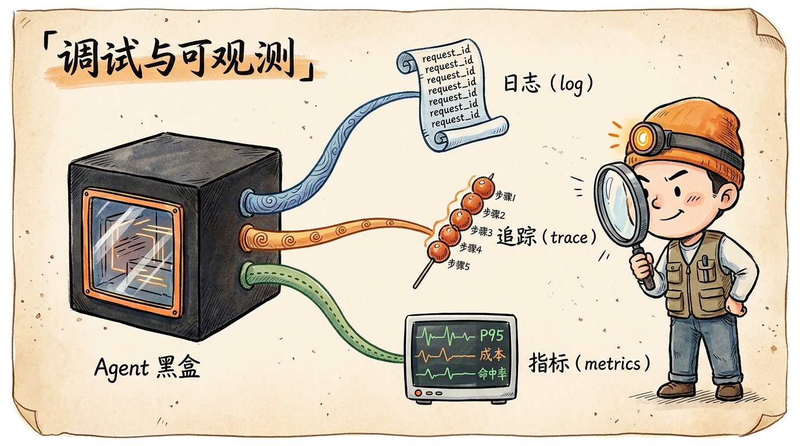
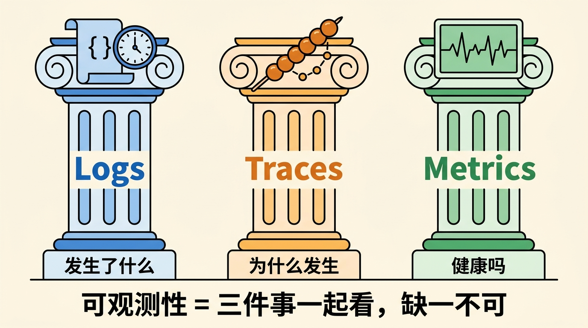
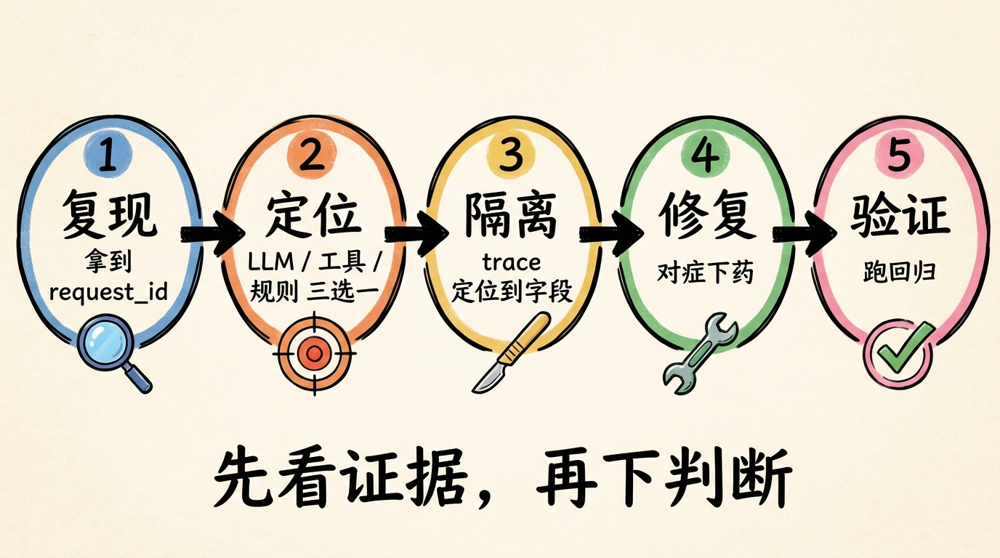
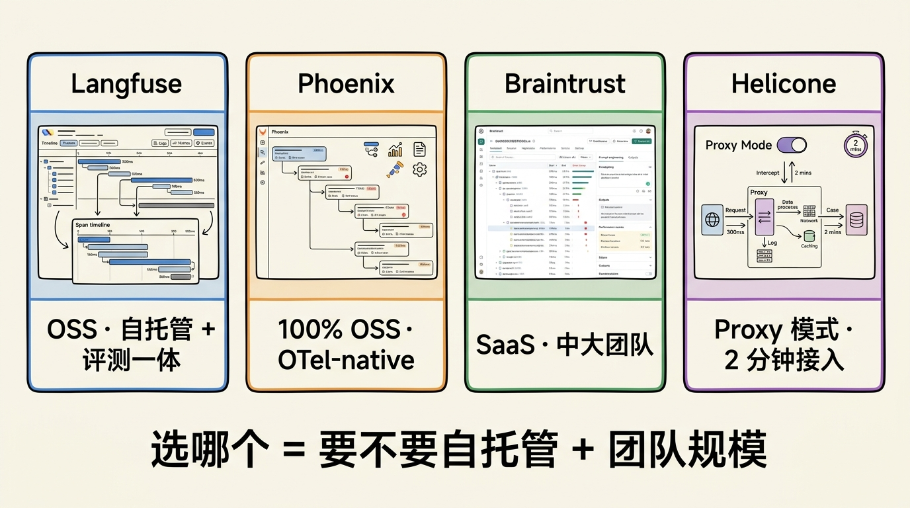
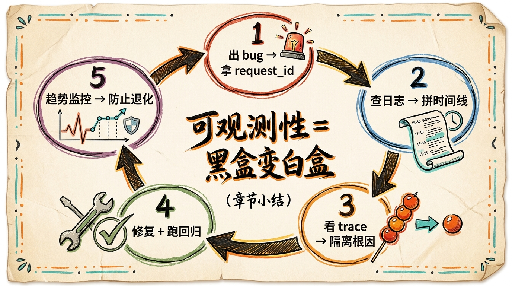

# 第 19 节 · 调试与可观测：Agent 出 bug 怎么查



<!-- 图片说明（给图片代理）：
风格：手绘信息图，卡通笔触
内容：左侧一个被打开了观察窗的「Agent 黑盒」，从中拉出三条线：
  1. 日志（log）—— 卷起的卷轴，写满 request_id 字样
  2. 追踪（trace）—— 一串糖葫芦串，每颗珠子标注一个步骤
  3. 指标（metrics）—— 一个心电图屏幕，显示 P95 / 成本 / 命中率
右侧站着一个戴着头灯的卡通工程师，手持放大镜对着黑盒里的 trace 看
背景：浅米色纸面纹理，配「调试与可观测」毛笔字标题
-->

> **预计时长**：阅读 35 分钟 / 实战 60 分钟
> **前置知识**：第 18 节《Agent 记忆系统》、对 Next.js Route Handler 与 SSE 流有基本概念
> **本节代码**：`ssp-web` 仓库 `chapter-19` tag · 主要文件 `src/lib/logging.ts`、`src/app/api/chat/route.ts`、`src/lib/engine/orchestrator.ts`

凌晨一点四十六分，群里弹出截图——用户截了一张对话，标注「我明明说过自己 1973 年生女性灵活就业，它算出 50 岁退休，应该是 55 岁」。

你打开 Vercel Logs 翻了五分钟，只看到一条孤零零的 `200 OK`，没有上下文，没有参数快照，没有规则命中记录。你猜可能是 `updateProfile` 没把就业类型存进去；也可能是 `R-110-LOOKUP-LEGAL-RETIRE-AGE` 查表查错了；也可能 LLM 一开始就调错了工具。

**猜，是生产环境调试的大忌。**

普通 Web 应用出 bug 看调用栈基本能解决，AI Agent 不行。它的失败模式是「概率性 + 多步链 + 上下文敏感」叠加——同一个 bug，复现一次可能要试五遍。你需要的不是运气，而是一套**可观测性基础设施**让你能像电影回放一样把每一步重看一遍。

这一节讲的就是这件事：怎么排查 Agent 的 bug，怎么搭让排查成为可能的可观测性，以及怎么对接 2026 年的新行业标准（OpenTelemetry GenAI / Langfuse / Phoenix / Helicone 等）。

---

## 一、知识铺垫：为什么 LLM 应用的可观测性比传统服务难

### 1.1 三个让人头疼的特性

传统 Web 应用出 bug，看调用栈、查 SQL 慢日志、压一下 nginx access log，基本就能定位。但 AI Agent 的失败模式完全不一样：

**不确定性。** 同一段对话跑十次，LLM 的推理路径可能给出八种走法。今天它先问性别，明天先问就业状态。同一个 bug，开发环境复现五次都不一定能命中那个错误分支。

**多步调用链。** 一次对话可能触发 3-8 次工具调用：`updateProfile` → `computePlan` → 再 `updateProfile` → 再 `computePlan` → ……每一步的偏差都会被下游放大。日志里看到 `computePlan` 算错了，但**根因可能在更早一步的 `updateProfile` 把 `female_retire_type` 写错了**。

**上下文敏感。** 同样一句「帮我算社保」，因为前面历史消息不同，Agent 行为完全不同。一个对话上下文里有缴费记录的用户，跟一个全新用户走的是截然不同的工具流。

> 普通 Web 应用出 bug，看调用栈就够了。AI Agent 出 bug，你需要看到整条思维链——从 LLM 拿到的 prompt、它选了哪个工具、传了什么参数、规则引擎命中了哪条规则、最终怎么算出那个数字。

### 1.2 可观测性三支柱：log / trace / metric

业界把可观测性拆成三件事：

| 名字 | 回答 | 用途 |
|---|---|---|
| **日志（Logs）** | 「发生了什么？」 | 出错时定位到具体一次请求 |
| **追踪（Traces）** | 「为什么发生？」 | 把 LLM 调用、工具执行、规则命中串成一条链 |
| **指标（Metrics）** | 「整体健不健康？」 | 看 P95 延迟、Token 成本、tool 成功率 |



<!-- 图片说明：
风格：信息图，扁平
内容：三个并列圆柱，从左到右：
  1. Logs：JSON 卷轴 + 时钟，标「发生了什么」
  2. Traces：糖葫芦串（多个 span），标「为什么发生」
  3. Metrics：心电图屏幕，标「健康吗」
底部一行字：可观测性 = 三件事一起看，缺一不可
-->

注意是「三件事一起看」，不是三选一。只有 log 没 trace，多步调用链根本拼不出来；只有 metric 没 log，单次问题根本定位不到。

### 1.3 OpenTelemetry GenAI：2026 年的事实标准

2024 年 4 月，OpenTelemetry 社区启动了 **GenAI Special Interest Group**，专门为 LLM 应用定一套语义规范（Semantic Conventions）。其中 LLM 调用相关约定已于 2026 年初转为 stable，agent / framework 与 MCP 相关约定仍处 experimental；但已经被 Datadog / Langfuse / Phoenix / Braintrust 全部支持，是事实标准。

它定义了 35+ 个 `gen_ai.*` 属性：

```text
# 核心（节选，完整 35+ 见官方 semconv）
gen_ai.operation.name        chat / text_completion / embeddings
gen_ai.provider.name         openai / anthropic / azure.ai.openai
gen_ai.request.model / gen_ai.response.model / gen_ai.response.finish_reasons
# Token 与成本（含缓存）
gen_ai.usage.input_tokens / output_tokens / cache_read.input_tokens
# 工具调用
gen_ai.tool.name / tool.call.id / tool.call.arguments / tool.call.result
# 对话与 RAG
gen_ai.conversation.id / input.messages / retrieval.query.text
```

**意思是：你今天写 SSP 的日志字段，未来想接 Datadog / Langfuse 时几乎不用改。** 用 `gen_ai.tool.name` 这种官方 key，所有平台开箱解析。

> **划重点**：可观测性不是「以后再加的奢侈品」，是从第一天就要打的地基。等线上烧起来再补，意味着你要在火场里拉电线。

---

## 二、核心讲解

### 2.1 五步排查法：拿到 bug 报告先别看代码

拿到一个 Agent 的 bug 报告，按这五步走效率最高：

**第一步 · 复现：拿到 request_id。** 用户反馈时让 ta 提供 `request_id`（响应头 `x-request-id` 返回）。如果用户没拿到，用 `conversation_id` + 时间窗口缩范围。

**第二步 · 定位：判断在哪个环节。** Agent 的 bug 通常出在三个层之一：

| 环节 | 症状 | 典型根因 |
|---|---|---|
| **LLM 决策** | 调了不该调的工具，或参数错 | System Prompt 不明确、tool description 模糊 |
| **工具执行** | 工具返回 error 或异常数据 | Zod 校验过松、外部 API 异常 |
| **规则引擎** | 工具调对了但结果不对 | 规则条件错、`effective_from` 配置错 |

**第三步 · 隔离：用 trace 定位到字段。** 拿出 `TraceEntry[]` 逐条看规则命中。比如本节开头那个 case，trace 里 `R-020-FEMALE-RETIRE-TYPE` 命中了 `worker50` 而不是 `cadre55`，再上溯到 `updateProfile` 的入参快照——发现用户消息里说的是「灵活就业」，但 LLM 把它存成了 `worker`。问题在 LLM 决策层。

**第四步 · 修复：对症下药。** 别一上来就改 prompt：

- LLM 决策错 → 在 System Prompt 的核心规则里加更明确的字段映射
- 工具校验松 → Zod schema 收紧 enum
- 规则错 → 改 DSL，走 `draft → published` 流程
- 外部依赖挂 → 加 fallback 或人工兜底

**第五步 · 验证：跑回归测试。** 修完不能只验这一条 case。下一节会专门讲评测，这里先记住一句话：**改了 prompt 就跑黄金集，改了规则就跑测试中心**。



<!-- 图片说明：
风格：手绘流程图
内容：5 个圆圈横向排列，每个圈里写步骤名 + 一句话
1. 复现：拿到 request_id
2. 定位：LLM / 工具 / 规则 三选一
3. 隔离：trace 定位到字段
4. 修复：对症下药
5. 验证：跑回归
圈与圈之间用箭头连接。底部有一句金句：「先看证据，再下判断」
-->

### 2.2 SSP 的 logging 设计：以 request_id 为锚

五步排查法能跑起来，前提是日志够用。SSP 的日志系统围绕一个核心：**每次 HTTP 请求生成一个 `request_id`，把整次请求的所有事件串起来**。

代码在 `src/lib/logging.ts`：

```typescript
// src/lib/logging.ts（结构化日志，输出 JSON 到 stdout）
function createRequestLogger() {
  const request_id = crypto.randomUUID();

  const logger = {
    request_id,
    // info：console.log(JSON.stringify({ request_id, event, ...data, ts }))
    info: (event: string, data?: Record<string, unknown>) => { /* ... */ },
    // warn：同上，走 console.warn，附 level: "warn"
    warn: (event: string, data?: Record<string, unknown>) => { /* ... */ },
    // error：走 console.error（stderr），附 error: String(error)
    error: (event: string, error: unknown, data?: Record<string, unknown>) => { /* ... */ },

    time: (label: string) => {                 // 返回「计时结束」函数
      const start = Date.now();
      return () => {
        const duration = Date.now() - start;
        logger.info(`${label}.duration`, { duration_ms: duration });
        return duration;
      };
    },
  };

  return logger;
}
```

> **看这里 →**：四个设计决策值得说明。

**1) JSON 格式输出到 stdout。** Vercel 自动采集 stdout，JSON 可以直接被 Log Drain 解析推到 Datadog / Langfuse / Loki，不需要额外 agent。Fluid Compute（2025-04-23 起所有新项目默认开）下，streaming function 享受扩展 runtime logs——更大、更频繁的 log entry 实时显示。

**2) 错误用 `console.error` 走 stderr。** Vercel 会自动把这些标记为 Error 级别，方便控制台一键筛选。

**3) `logger.time()` 返回计时结束函数。** 这个模式可以精确测量任何一段代码的耗时：

```typescript
const endTimer = logger.time("rule_engine");
const result = await orchestrate({ user });
endTimer();
// 自动输出：{ event: "rule_engine.duration", duration_ms: 247 }
```

**4) `request_id` 通过响应头返回客户端。** 用户反馈时附上这个 ID，搜索就能定位完整生命周期。这是五步排查法第一步能跑通的关键。

**关键事件清单**——别什么都打日志，否则噪音淹没信号。SSP 实战收敛到这几类：

```text
chat.request           收到请求 + 摘要参数（不含敏感原文）
chat.rate_limited      限流命中
chat.session_attached  匿名 session ID 已挂载
chat.tool_call         LLM 触发某个工具调用
chat.tool_result       工具执行完成（含 duration_ms）
chat.persist_started   onFinish 开始写库
chat.persist_finish_failed  onFinish 写库失败（关键的兜底告警）
chat.stream_error      SSE 流中断
chat.complete          整次对话完成（含 token / cost）
```

### 2.3 request_id 链路追踪：把请求按时间线拼起来

`request_id` 不是为了在日志里多一列字符串，是为了**一条 SQL 拼出一次请求的完整时间线**。

举个例子。用户报告「算错了」，给你 `f47ac10b-58cc-4372-a567-0e02b2c3d479` 这个 ID。你在日志系统里搜：

```sql
-- 在 Langfuse / Datadog / Loki 里
SELECT ts, event, ...payload
FROM logs
WHERE request_id = 'f47ac10b-58cc-4372-a567-0e02b2c3d479'
ORDER BY ts;
```

输出大概长这样：

```
12:30:01.102  chat.request               { messages_count: 4, conversation_id: "uuid-..." }
12:30:01.108  chat.session_attached      { is_new_session: false }
12:30:01.215  chat.tool_call             { name: "updateProfile", args: {...} }
12:30:01.218  chat.tool_result           { name: "updateProfile", duration_ms: 3 }
12:30:01.380  chat.tool_call             { name: "computePlan", args: {...} }
12:30:01.380  rule_engine.start          { rule_set: "RS-SHANGHAI-PLAN-V1" }
12:30:01.624  rule_engine.duration       { duration_ms: 244 }
12:30:01.625  chat.tool_result           { name: "computePlan", duration_ms: 245 }
12:30:02.802  chat.complete              { input_tokens: 1820, output_tokens: 423 }
```

时间线一拉，三件事立刻清楚：哪一步慢、哪一步出错、哪一步参数不对。

**响应头怎么挂？** 在 `/api/chat/route.ts` 的最后：

```typescript
// src/app/api/chat/route.ts:280（示意，参考真实代码补 x-request-id）
const response = result.toUIMessageStreamResponse({ originalMessages, onFinish, onError });
response.headers.set("x-conversation-id", conversation.id);
response.headers.set("x-request-id", logger.request_id);   // ← 加这一行
return response;
```

前端可以在 `transport.fetch` 钩子里读这个头，把它存到 conversation metadata，用户报 bug 时一键复制：

```typescript
// 前端示意（非项目实际代码）
const trackingFetch = async (input, init) => {
  const res = await fetch(input, init);
  const requestId = res.headers.get("x-request-id");
  if (requestId) lastRequestIds.push(requestId);
  return res;
};
```

### 2.4 Trace 可视化：从 JSON 数组到时间线 UI

裸看 JSON 数组找问题效率太低。你需要一个 trace 可视化工具把每一步画成时间轴。2026 年生产里主流四个选择：

| 工具 | 形态 | 强项 | 适用场景 |
|---|---|---|---|
| **Langfuse** | OSS + SaaS（v3.170.0） | OTel 兼容 + 自托管完整 + 评测/标注/实验一体 | 自托管 + 全栈观测 |
| **Arize Phoenix** | 100% OSS | OpenInference + auto-instrumentation | 已有 OTel 基础设施 |
| **Braintrust** | SaaS（$249/月起） | 生产 trace + 实验 + dataset 一体 | 中大团队闭环 |
| **Helicone** | OSS + SaaS（4.8k+ stars） | 改 base URL 加 header 即可接入 | 已有 OpenAI SDK，2 分钟接入 |

最适合本课读者的两条路径：

**路径 A · 自托管 Langfuse。** 给 SSP 这种自己掌控数据的项目最省事。Docker Compose 5 分钟跑起来，Helm Chart 上生产，组件就 Postgres + ClickHouse + Redis + S3。前端 SDK 一行装好：

```typescript
// 接 AI SDK v6（示意，非项目实际代码）
const langfuse = new Langfuse({
  secretKey: process.env.LANGFUSE_SECRET_KEY,
  publicKey: process.env.LANGFUSE_PUBLIC_KEY,
});

return streamText({
  // ... model / system / messages / tools / stopWhen 同前
  experimental_telemetry: {
    isEnabled: true,
    metadata: { conversation_id, request_id: logger.request_id },
  },
});
```

`experimental_telemetry` 是 Vercel AI SDK v6 的标准入口，所有 trace 自动按 OpenTelemetry GenAI 规范输出。

**路径 B · Helicone proxy。** 不想动代码？把 OpenAI base URL 改成 `https://oai.helicone.ai/v1`，加几个 header，trace 自动入库：

```typescript
const openai = createOpenAI({
  apiKey: process.env.OPENAI_API_KEY,
  baseURL: "https://oai.helicone.ai/v1",
  headers: {
    "Helicone-Auth": `Bearer ${process.env.HELICONE_API_KEY}`,
    "Helicone-Session-Id": conversationId,
    "Helicone-Property-RequestId": logger.request_id,
    "Helicone-Cache-Enabled": "true",
  },
});
```

> **小提醒**：proxy 模式调试方便但生产风险——所有 prompt 都过第三方网关，PII 处理（详见下一节）必须走前置过滤。



<!-- 图片说明：
风格：信息图，4 列对比
内容：四张工具截图风格的卡片
  - Langfuse：自托管 + 评测一体，标注「OSS」
  - Phoenix：OTel-native，标注「100% OSS」
  - Braintrust：SaaS，标注「中大团队」
  - Helicone：proxy 模式，标注「2 分钟接入」
底部一行：选哪个 = 要不要自托管 + 团队规模
-->

### 2.5 OpenTelemetry GenAI：把字段标准化

Trace 工具的底层规范都是 OpenTelemetry GenAI 语义约定。你应该按这套规范打日志，将来换工具不用改代码。

**核心约定。** SSP 的关键事件按 OTel 字段重写一遍长这样：

```typescript
// chat.complete 事件，遵循 OTel GenAI semantic conventions
logger.info("gen_ai.client.operation", {
  "gen_ai.operation.name": "chat",
  "gen_ai.provider.name": "openai",
  "gen_ai.request.model": model,                // gpt-4o-mini
  "gen_ai.response.model": resp.model,
  "gen_ai.response.id": resp.id,
  "gen_ai.response.finish_reasons": ["stop"],
  "gen_ai.request.temperature": 0.3,
  "gen_ai.request.max_tokens": maxOutputTokens,
  "gen_ai.usage.input_tokens": usage.inputTokens,
  "gen_ai.usage.output_tokens": usage.outputTokens,
  "gen_ai.usage.cache_read.input_tokens": usage.inputTokenDetails?.cacheReadTokens ?? 0,
  "gen_ai.conversation.id": conversation.id,
});
```

**工具调用约定。**

```typescript
logger.info("gen_ai.tool.invocation", {
  "gen_ai.tool.name": "computePlan",
  "gen_ai.tool.call.id": toolCallId,
  "gen_ai.tool.call.arguments": JSON.stringify(args),
  "gen_ai.tool.call.result": JSON.stringify(redactedResult),
  "gen_ai.tool.type": "function",
  duration_ms: 245,
});
```

**双写过渡。** 老字段和新字段共存一段时间，靠环境变量切换：

```bash
# 双发：老字段（自家约定）+ 新字段（OTel 标准）
export OTEL_SEMCONV_STABILITY_OPT_IN=gen_ai_latest_experimental,gen_ai
```

**Datadog / Langfuse / Phoenix 都已原生支持 OTel GenAI**——Datadog 在 2026-03 发布了原生支持，Langfuse 双向 OTel（吃 OTel / 出 OTel），Phoenix 的 OpenInference 是 OTel 的超集。换工具的迁移成本几乎归零。

### 2.6 一个真实 bug 的复盘：trace 怎么把它揪出来

讲个虚构但合理的 bug 来练手。这是把第 18 节《Agent 记忆系统》的 `deepMerge` 逻辑跟本节 trace 拼到一起的回放。

**症状。** 周五下午 3 点，运营报告：「上周开始有用户反馈第二轮对话又被问性别」。

**第一步 · 复现。** 拿到一个有问题的 conversation_id，把 conversation 的 messages 字段倒出来，本地复现一次。果然，第三轮 LLM 又问了「请问您是男性还是女性」。

**第二步 · 定位。** 看 trace。三轮对话的 trace 摘要：

```
turn-1  user: "我是1973年女性，灵活就业"
        tool_call updateProfile  args { basic.gender: "female", basic.birth_year: 1973 }
                                            ^^^ 没存 social.female_retire_type
turn-2  user: "缴了18年社保"
        tool_call updateProfile  args { social.pension_contrib_months: 216 }
        tool_call computePlan    needs_agent: true, questions: ["缺少 female_retire_type"]
turn-3  assistant: "请问您是男性还是女性"
```

**第三步 · 隔离。** 看 trace 第二步里 `computePlan` 的 `questions`，发现 `R-020-FEMALE-RETIRE-TYPE` 没命中——`user.basic.female_retire_type` 是 null。再看第一步 `updateProfile` 的入参：LLM 没把「灵活就业」映射到 `female_retire_type: "worker50"`。**根因在 prompt：System Prompt 关键字段识别那段没写「灵活就业 → female_retire_type=worker50」的映射规则。**

**第四步 · 修复。** 不是改 `deepMerge`，是补 prompt：

```typescript
// src/lib/ai/prompts.ts 关键字段识别段，补一行
- 灵活就业 / 个体 / 自雇 / 自由职业  → status.employment_status = "flexible";
  对女性额外推断 social.female_retire_type = "worker50"
- 企业职工 / 上班族 / 公司员工        → status.employment_status = "employed"
- 干部 / 公务员 / 事业编              → 对女性 social.female_retire_type = "cadre55"
```

**第五步 · 验证。** 把这个 case 加进 `dsl/ssp_dsl_v1/tests/`，跑测试中心确认通过。下次有人改 prompt，这条 case 自动护栏。

**复盘要点：**
1. 没有 trace，这个 bug 至少要花一下午 print 大法
2. 没有 request_id，找日志要按时间窗口翻 100 条无关日志
3. 没有 `tool.call.arguments` 字段，根本看不到 LLM 把「灵活就业」存成了什么

> **划重点**：可观测性的价值不在「平时」，在「凌晨两点出事」。

### 2.7 dev-only 调试技巧：用 prepareStep 偷看大脑

生产慎用，但开发环境特别好用——AI SDK v6 的 `prepareStep` 钩子允许你在每一步 LLM 调用**之前**做点事，比如打印将要发出去的完整 prompt：

```typescript
// 仅在 dev 环境开启的调试中间件
return streamText({
  // ... model / system / messages / tools / stopWhen 同前
  prepareStep: process.env.NODE_ENV === "development"
    ? async ({ stepNumber, messages, tools }) => {
        console.log("=== STEP", stepNumber, "===");
        console.log("messages:", JSON.stringify(messages, null, 2).slice(0, 2000));
        console.log("active tools:", Object.keys(tools));
        return {};   // 返回空对象 = 不修改任何参数
      }
    : undefined,
});
```

跑一次对话能看到完整的 prompt 演进——LLM 第一步收到什么、第二步又收到什么。**90% 的 prompt 注入式 bug（prompt 里被注入了奇怪的 context）都能在这一步看出来**。

另外两个 dev-only 调试技巧：

**onChunk 透出原始流。** `streamText` 的 `onChunk` 回调能拿到所有 stream chunk，临时打印出来能看到 LLM 每个 token 是怎么生成的：

```typescript
onChunk: process.env.NODE_ENV === "development"
  ? ({ chunk }) => {
      if (chunk.type === "tool-call") console.log("[tool-call]", chunk.toolName, chunk.input);
      if (chunk.type === "reasoning") console.log("[reasoning]", chunk.text);
    }
  : undefined,
```

**includeRawChunks 透出 provider 原始数据。** 设 `includeRawChunks: true`，可以拿到 OpenAI / Anthropic 真正返回的字节，定位 SDK 解析问题特别有用。

> **小提醒**：`prepareStep` 和 `onChunk` 在生产环境会显著增加日志量和 CPU 开销，**记得加 NODE_ENV 判断**。

### 2.8 错误分级：onError、503 与隐藏堆栈

AI SDK v6 给了三层错误回调，不要混用：

| 层 | 回调 | 触发时机 |
|---|---|---|
| `streamText` 顶层 | `onError({ error })` | 流式过程中任何 chunk 错误 |
| `toUIMessageStreamResponse` | `onError(error) => string` | **返回值**就是前端可见的错误文案 |
| `useChat` | `onError(error)` | 客户端兜底（网络错误、500 等） |

`ssp-web` 的实战做法（`src/app/api/chat/route.ts:234-261`）：

```typescript
const response = result.toUIMessageStreamResponse({
  originalMessages: uiMessages,
  onFinish: async ({ messages: persistedMessages }) => {
    try {
      await updateConversation(conversation.id, { messages: persistedMessages, userProfile });
    } catch (persistErr) {
      logger.warn("chat.persist_finish_failed", { error_message: String(persistErr) });
    }
  },
  onError: (streamErr) => {
    logger.warn("chat.stream_error", { error_message: String(streamErr) });
    return "抱歉，回复中断了。请发送\"继续\"，我会接着回答。";
  },
});
```

**关键点：`onError` 的返回值才是前端能看到的字符串**。如果不挂 `onError`，前端默认显示 `"An error occurred."`——那是 SDK 故意的信息隐藏，避免 stack trace 泄露到浏览器。

错误分三级：

- **400 Bad Request**：用户输入问题（不合法 JSON、缺字段）。`logger.warn` 不告警。
- **503 Service Unavailable**：AI 服务不可用（OpenAI 挂了、限流触发）。`logger.error` 触发告警。
- **500 Internal Server Error**：你自己的 bug。最严重，立即告警，**绝不把 stack 发给用户**。

### 2.9 六项核心生产指标

光有日志和追踪不够，还需要量化指标回答「整体健不健康」。SSP 跟踪六项：

| 指标 | 含义 | 警戒线 |
|---|---|---|
| P50 / P95 首 token 延迟 | 用户按发送到看到第一个字 | P95 > 3s 需要优化 |
| 端到端延迟 | 发送到整条回复完成 | 直接影响耐心 |
| 工具调用成功率 | `output-available` / 总调用 | < 95% 需要排查 |
| 平均工具调用步数 | 每次会话 tool call 数 | 过高说明对话效率差 |
| 单会话 Token 成本 | 每次对话费用 | 控制运营成本（详见下一节） |
| `needs_agent` 命中率 | computePlan 返回 `needs_agent: true` 的比例 | 过高说明 prompt 引导不够 |

前两项关用户体验，中间两项关稳定性，后两项关运营效率。`needs_agent` 命中率特别值得说——如果超过 60%，说明大多数用户首轮信息不全，LLM 反复追问，应该优化 prompt 的引导策略。

采集靠 `logger.time()` 和 `onFinish`：

```typescript
return streamText({
  // ...
  onFinish: ({ usage, finishReason }) => {
    logger.info("chat.complete", {
      "gen_ai.usage.input_tokens": usage.inputTokens,
      "gen_ai.usage.output_tokens": usage.outputTokens,
      "gen_ai.response.finish_reasons": [finishReason],
      estimated_cost_usd: estimateCost(usage),
    });
  },
});
```

---

## 三、举一反三：医疗 / 法律 Agent 的可观测性

把这一节的原则拎出来：**任何高责任 Agent 都需要 log + trace + metric 三件套，并按 OpenTelemetry GenAI 规范打字段，trace 落到 Langfuse 或 Phoenix，关键事件附 request_id**。

**医疗咨询 Agent。** 病人问「我这个症状要紧吗」，模型给了建议。出问题时你必须能复现：用户描述了什么症状、模型调了哪个工具（症状库查询 / 紧急程度分级）、模型推理走了哪条路径、最终给的是什么建议。**而且 trace 数据要保留 7 年（医疗法规要求）**——这种长保留场景下，Phoenix（OTel-native 自托管）+ S3 冷归档是首选。

**法律咨询 Agent。** 同样是高责任领域，但多了一层「免责声明出现在每条回复里」的合规要求。可以把它抽成一个独立的 trace span：`gen_ai.compliance.disclaimer_present = true/false`。每月自动跑一份指标报告，确保 100% 命中。

**金融规划 Agent。** 涉及到税收建议时，trace 必须能精确还原「当时的税率参数版本」。SSP 的 `policy_pack_version` 就是这么用的——`plans.policy_pack_version` 字段保存当时生效的政策版本。换到金融场景，把它改成 `tax_rule_version`，对接审计直接查 trace。

不变的是：**black-box → white-box** 的转化，靠的不是更聪明的 LLM，是更扎实的可观测性。

---

## 四、小结

可观测性是 Agent 上线的入场券，不是奢侈品。本节把它拆成三件事：

- **log** 用 `request_id` 把一次请求所有事件串起来
- **trace** 用 OpenTelemetry GenAI 规范把 LLM / tool / 规则引擎拼成一条链
- **metric** 用六项核心指标回答「整体健不健康」

外加一个五步排查法（复现 → 定位 → 隔离 → 修复 → 验证）作为出 bug 时的标准流程，再加 `prepareStep` / `onChunk` 这种 dev-only 利器。



<!-- 图片说明：
风格：手绘小结卡，米色纸面
内容：一个圆形闭环，五个节点：
  1. 出 bug → 拿 request_id
  2. 查日志 → 拼时间线
  3. 看 trace → 隔离根因
  4. 修复 + 跑回归
  5. 趋势监控 → 防止退化
中央写「可观测性 = 黑盒变白盒」
-->

**核心要点回顾**：

- LLM 应用的 bug 是非确定性的，必须靠日志/追踪/指标三件套补足
- `request_id` 是日志的灵魂，响应头必须返回给前端
- 五步排查法（复现 → 定位 → 隔离 → 修复 → 验证）按字段定位，不靠猜
- AI SDK v6 的 `experimental_telemetry` + `prepareStep` + `onChunk` 是天然的 trace 入口
- 按 OpenTelemetry GenAI semantic conventions 打字段，将来换 Langfuse / Phoenix / Datadog 几乎零改动
- Trace 工具四选一：自托管选 Langfuse，OTel 派选 Phoenix，团队闭环选 Braintrust，proxy 派选 Helicone
- `onError` 的返回值才是用户可见的错误文案，stack trace 绝不外泄

---

## 思考题

1. **【开放题】**：SSP 把 `request_id` 通过响应头返回给前端，方便用户报 bug 时一键提供。但这也意味着 `request_id` 是**用户可见**的——攻击者拿到这个 ID，能不能用来做坏事？你的项目里要不要把 `request_id` 改成对用户「不透明」的形式（例如 hash 一遍）？请结合下一节《安全护栏》先做一个判断，再读完下一节后回头修改你的答案。
2. **【动手题】**：在本地 clone `ssp-web`，给 `src/app/api/chat/route.ts` 加一行 `response.headers.set("x-request-id", logger.request_id)`，然后在浏览器 DevTools 的 Network 面板里发一次对话，从响应头里抓出 `x-request-id`，再到 `vercel logs` 或 `pnpm dev` 终端搜这个 ID，确认能拿到完整的事件时间线。**验收标准：终端打印的 JSON 日志里，`request_id` 字段与你抓到的响应头一致，且至少能看到 `chat.request` / `chat.tool_call` / `chat.complete` 三条记录**。
3. **【选做】**：把 SSP 现有日志改造成 OpenTelemetry GenAI semantic conventions 兼容的字段（用 `gen_ai.usage.input_tokens` 替代 `input_tokens` 等），然后用 Docker Compose 跑一个本地 Langfuse v3.170.0，把日志推过去，在 Langfuse UI 里看一次完整对话的 trace。**进阶**：再加一个自定义 span 记录 `rule_engine.duration` + 命中规则数。

---

## 面试题

**Q1.【基础】【主题：调试与可观测】** 为什么说 LLM 应用的可观测性比传统 Web 服务更难？可观测性的「三支柱」分别回答什么问题？
<details><summary>参考解答</summary>

三个让 LLM 应用难调的特性（与本节 1.1 一致）：

1. **不确定性**：同一段对话跑十次，LLM 推理路径可能给出多种走法，同一个 bug 复现五次都不一定命中。
2. **多步调用链**：一次对话触发 3-8 次工具调用，每步偏差被下游放大——日志看到 `computePlan` 算错，根因可能在更早的 `updateProfile` 把字段写错了。
3. **上下文敏感**：同一句话因历史消息不同，Agent 行为完全不同。

普通 Web 应用看调用栈基本够，AI Agent 需要看整条思维链。

**三支柱**（本节 1.2）：

- **日志（Logs）**回答「发生了什么」——出错时定位到具体一次请求。
- **追踪（Traces）**回答「为什么发生」——把 LLM 调用、工具执行、规则命中串成一条链。
- **指标（Metrics）**回答「整体健不健康」——P95 延迟、Token 成本、tool 成功率。

三件事一起看，缺一不可：只有 log 没 trace，多步链拼不出来；只有 metric 没 log，单次问题定位不到。

</details>

**Q2.【进阶】【主题：调试与可观测】** `ssp-web` 的日志系统为什么以 `request_id` 为锚？它通过响应头返回给前端有什么用？日志为什么输出 JSON 到 stdout？
<details><summary>参考解答</summary>

**以 `request_id` 为锚**（本节 2.2/2.3）：每次 HTTP 请求生成一个 `request_id`（`crypto.randomUUID()`），把整次请求的所有事件（`chat.request` / `chat.tool_call` / `chat.tool_result` / `chat.complete` 等）串起来。一条 SQL（`WHERE request_id = '...' ORDER BY ts`）就能拼出一次请求的完整时间线，立刻看清哪步慢、哪步错、哪步参数不对。

**响应头返回前端**：`response.headers.set("x-request-id", logger.request_id)`。用户报 bug 时附上这个 ID，开发者搜索就能定位完整生命周期——这是五步排查法「第一步 · 复现」能跑通的关键。

**JSON 到 stdout**：Vercel 自动采集 stdout，JSON 可直接被 Log Drain 解析推到 Datadog / Langfuse / Loki，不需要额外 agent。错误用 `console.error` 走 stderr，被自动标为 Error 级别便于筛选。

</details>

**Q3.【深挖】【主题：调试与可观测】** 为什么建议按 OpenTelemetry GenAI 语义约定打日志字段？AI SDK v6 提供了哪些 trace 入口？`prepareStep` / `onChunk` 为什么只在 dev 用？
<details><summary>参考解答</summary>

**按 OTel GenAI 约定打字段**（本节 1.3/2.5）：OpenTelemetry 在 2024 年成立 GenAI SIG，定义了 35+ 个 `gen_ai.*` 属性（如 `gen_ai.tool.name`、`gen_ai.usage.input_tokens`、`gen_ai.response.finish_reasons`）。截至 2026 仍是 experimental 状态，但已被 Datadog / Langfuse / Phoenix / Braintrust 全部支持，是事实标准。用官方 key 打日志，将来换平台几乎零改动——所有平台开箱解析。

**AI SDK v6 的 trace 入口**：

- `experimental_telemetry: { isEnabled: true, metadata }`：标准入口，trace 自动按 OTel GenAI 规范输出。
- `prepareStep`：每步 LLM 调用前的钩子，可打印将要发出的完整 prompt——90% 的 prompt 注入式 bug 能在这里看出来。
- `onChunk`：拿到所有 stream chunk，能看到每个 token / tool-call 怎么生成的。
- `includeRawChunks: true`：透出 provider 原始字节，定位 SDK 解析问题。

**为什么 dev-only**：`prepareStep` 和 `onChunk` 在生产会显著增加日志量和 CPU 开销，必须加 `NODE_ENV === "development"` 判断，否则线上日志爆炸、延迟上升。

</details>

---

## 延伸阅读

- [OpenTelemetry GenAI Semantic Conventions](https://opentelemetry.io/docs/specs/semconv/gen-ai/) —— 业界事实标准（experimental，但已被全行业采用）
- [Langfuse 官方文档](https://langfuse.com/docs/) —— v3 自托管 + Helm Chart 路径
- [Arize Phoenix](https://arize.com/docs/phoenix) —— OpenInference + OTel-native，100% OSS
- [Helicone Cookbooks](https://docs.helicone.ai/guides/cookbooks/cost-tracking) —— proxy 模式接入与成本追踪
- [Vercel AI SDK Error Handling](https://ai-sdk.dev/docs/ai-sdk-core/error-handling) —— 三层错误回调官方说明
- [Anthropic：April 23 Postmortem](https://www.anthropic.com/engineering/april-23-postmortem) —— Claude 团队的 prompt 改动评测纪律

---

[← 上一节：第 18 节 Agent 记忆系统：从金鱼脑到过目不忘](./19-agent-memory.md) · [📚 目录](./README.md) · [下一节：第 20 节 安全护栏：Prompt 注入、PII、速率限制四层防御 →](./21-security-guardrails.md)
