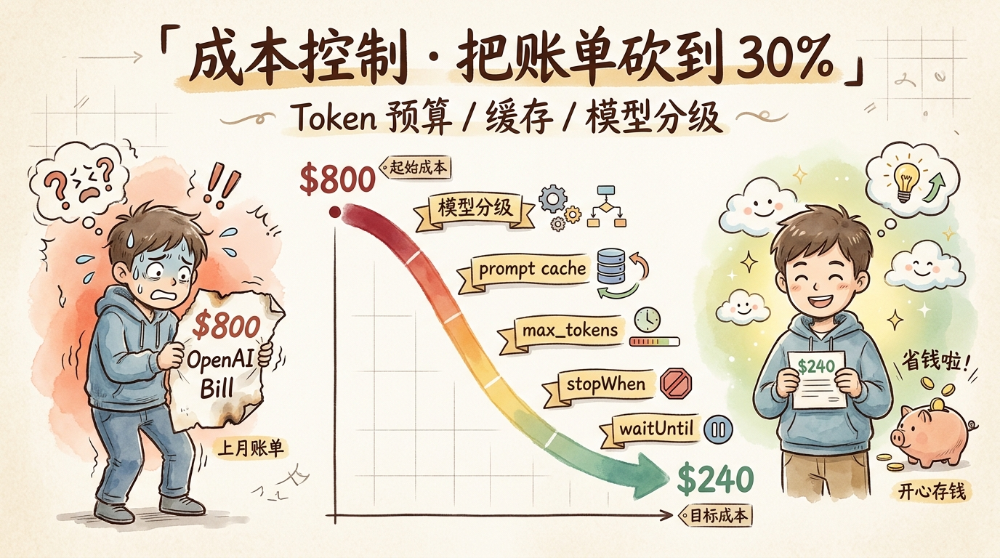
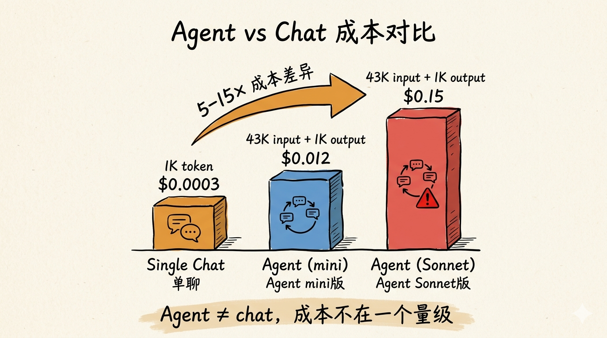
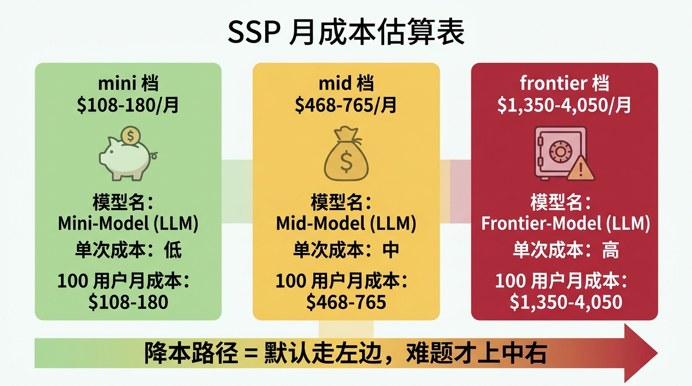
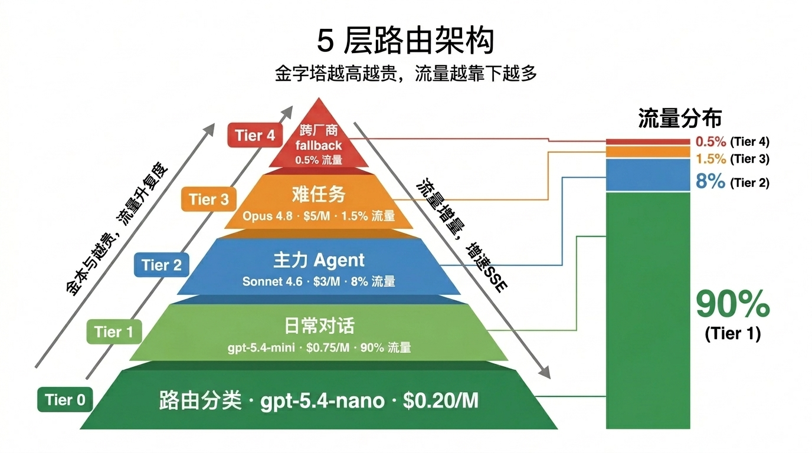
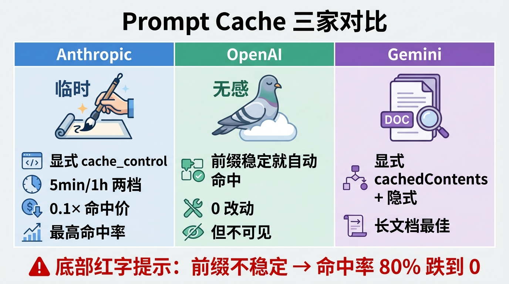
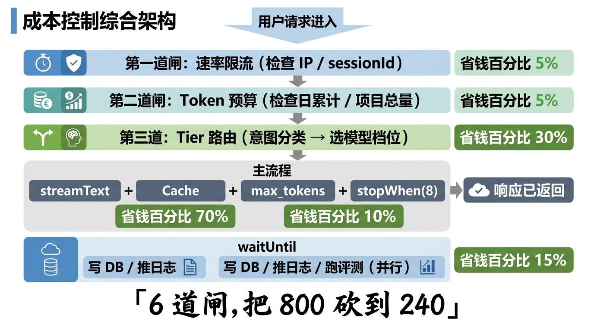
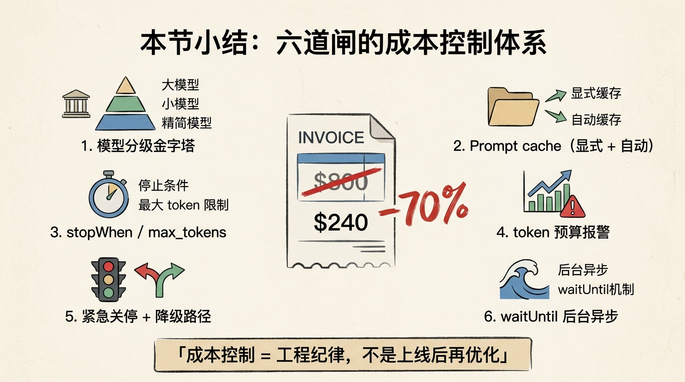

# 第 21 节 · 成本控制：Token 预算、缓存、模型分级



<!-- 图片说明（给图片代理）：
风格：手绘信息图,卡通笔触,浅米色纸面纹理
内容：
  - 左侧：一只焦虑的卡通小人捧着一张"$800 OpenAI Bill"的账单纸,头顶冒汗
  - 中间:一条向下的成本曲线,从顶端 $800 滑到底部 $240,曲线分段标注「模型分级」「prompt cache」「max_tokens」「stopWhen」「waitUntil」
  - 右侧:同一只小人微笑捧着 $240 账单,头顶飘几片云,旁边一个储蓄罐
  - 顶端毛笔字标题:「成本控制 · 把账单砍到 30%」
  - 副标:「Token 预算 / 缓存 / 模型分级」
-->

> **预计时长**：阅读 25 分钟 / 实战 45 分钟
> **前置知识**：第 20 节《安全护栏》、对 LLM token 计价模型有基本概念
> **本节代码**：`ssp-web` 仓库 `chapter-21` tag · 主要文件 `src/lib/ai/agent.ts`、`src/app/api/chat/route.ts`、`src/lib/security/rate-limit.ts`

上线第二天上午十点，运营找我说：「OpenAI 账单出了 800 美金，怎么算的？」

我那时还没几个用户。注册数 30 出头，活跃 10 来个。账单里一行小字：「gpt-4o-mini · 输入 280M token · 输出 42M token」。

280 兆 token 是什么概念？按一条消息 4000 字算，280M token 大概是 70 万条用户消息——远远超出我所有用户加起来一年都产生不了的对话量。

打开日志一查，前一天有人写了个脚本，从 0 点到清晨刷了 9 万次 chat 请求。每次请求带历史消息，每条历史又带 8000 token 的 system prompt——**循环烧爆 input token**。看着那条凌晨 4 点的日志，我第一反应是把账单截图发到群里：「上线第二天，我学会了什么叫 unbounded consumption。」

第二反应是回去补这一节漏掉的东西——限流我做了，但那是「速率」不是「成本」；System Prompt 我写了，但没有 cache；模型用了 4o-mini，但 8 步 tool 循环跑下来一次对话还是奔着 0.05 美金去；max_tokens 我没设，让 LLM 想说多少说多少。

**成本控制不是发布前最后五分钟的事，是从第一行代码就要写进去的预算意识。**

这一节就是把这些预算意识装进 SSP：从 input / output 单价算账，到 prompt cache 实操，再到 5 层模型路由——每个手段都给出 SSP 的真实参数和省下的真实金额。

---

## 一、知识铺垫：为什么 Agent 比 chat 贵 5-15 倍

### 1.1 一次 chat 和一次 Agent 的成本不在一个量级

如果你只用过 ChatGPT 网页版，你对 LLM 的成本认知大概是这样的：「我跟 GPT 聊一句，它回我一段，应该挺便宜的吧。」

这个直觉在「单轮 chat」场景下大致对——一句话进、一段话出，加起来 1000 token，按 `gpt-5.4-mini`（输入 $0.75/M、输出 $4.50/M）算，一次大约 **$0.002**。一分钱出头。

> 价格说明：本节所有单价均为标准处理档、单位 USD / 每百万 token（MTok），**价格截至 2026-05-30，以各厂商官方定价页为准**，会变。数据来自 `research/model-selection-2026.md`。

但 Agent 不是单轮 chat。一次 SSP 对话从「我 1973 年女性」到出 plan，要经过：

| 步骤 | 干什么 | input token | output token |
|---|---|---|---|
| 1. 用户开口 | "我 1973 年女性" | 8K (sys+tools) | 100 (调 updateProfile) |
| 2. tool result 回灌 | profile updated | 8.2K | 80 (问追问) |
| 3. 用户答 | "工人岗,缴了 25 年" | 8.4K | 120 (再 updateProfile) |
| 4. tool result 回灌 | updated | 8.6K | 200 (调 computePlan) |
| 5. computePlan 返回 | 大块 calc / scenarios | 10K | 600 (生成最终回答) |
| **合计** | 5 步 1 次完整对话 | **43.2K** | **1100** |

按 gpt-4o-mini（input $0.15/M、output $0.60/M）算：

```
input  = 43.2K × $0.15/M = $0.0065
output = 1.1K  × $0.60/M = $0.0007
合计   ≈ $0.007 / 一次对话
```

一次对话 7 厘钱。听起来还行？但这是**最理想的 5 步收敛**。实际跑 SSP 平均一次完整咨询是 6-8 步，遇到模糊输入会到 10-12 步，算上补缴费基数、医保分支，**真实平均 ≈ $0.012-0.018 / 对话**——还是 mini 模型。

升到 Sonnet 4.6（input $3/M、output $15/M），同样的对话：

```
input  = 43.2K × $3/M  = $0.13
output = 1.1K  × $15/M = $0.0165
合计   ≈ $0.15 / 一次对话
```

**贵了 20 倍。** 1000 个用户每天各问 3 次，按 mini 是 $36/天，按 Sonnet 是 $450/天，一个月差 1.2 万美金。同样的产品体验，模型选错就是数量级的成本差异。



<!-- 图片说明（给图片代理）：
风格：手绘对照柱状图,浅米色纸面
内容：
  - 左柱:Single chat 一次对话,1K token,$0.0003,矮矮的橙色柱
  - 中柱:Agent 一次对话(mini),43K input + 1K output,$0.012,中等高度蓝柱
  - 右柱:Agent 一次对话(Sonnet),43K input + 1K output,$0.15,高高的红柱
  - 顶端标注 5-15× ratio 箭头从左到右
  - 底部毛笔字注:「Agent ≠ chat,成本不在一个量级」
-->

### 1.2 为什么 Agent 这么贵——三个根因

**根因一：多步循环。** 一个工具的输出会变成下一步的输入。SSP 的 8 步上限（`stepCountIs(8)`，`src/lib/ai/agent.ts:71`）意味着同一段 system prompt + tool schema 会被「重复发送」最多 8 次。

**根因二：tool result 撑大 context。** `computePlan` 的返回值动辄几百到几千 token（plan、scenarios、calc trace、subsidies），都会加进下一轮 input。

**根因三：模型升级的诱惑。** 用户总会要求「换最新最强的」。但在 Agent 场景下，模型升级的成本是**输入 token × 多步循环 × 用户量**——三者相乘，账单非线性增长。

> **划重点**：在 Agent 里，**成本不是「调一次 API」的成本，是「跑完一个任务」的成本**——后者比前者贵 5-15 倍。这是所有 Agent 项目第一次结账时被打脸的地方。

---

## 二、核心讲解

### 2.1 成本来源拆解：不止有 input 和 output

打开 OpenAI / Anthropic / Google 的 dashboard，账单里其实有 **5 大类** 成本，不是只有 input 和 output 这么简单：

| 成本类型 | 占比典型值 | 说明 |
|---|---|---|
| **input token** | 60-75% | 每次请求都要发完整 messages |
| **cached input token** | 10-25% | 命中缓存的输入，价格只有 5-10% |
| **output token** | 10-20% | LLM 生成内容 |
| **tool call 循环** | 算在 input/output 里 | 多步循环放大 1.5-3 倍 |
| **reasoning token** | 0-30% | o-series / Claude extended thinking 专属 |

注意第二行：**cached input 只有正常 input 价格的 5-10%**，是 Agent 项目最重要的省钱杠杆（2.4 节展开）。第五行「reasoning token」是 o-series / Claude extended thinking 专属，一次调用可能烧几千 thinking token，对 Agent 这种高频 loop 不友好——SSP 不在主路径用，遇到难题才降级到 Tier 3。

### 2.2 SSP 实际成本估算：从一次完整对话到月账单

把 §1.1 的算法放到 SSP 真实场景，得出一张「价位 × 用量」对账表（基准同 §1.1：43.2K input + 1.1K output 的理想 5 步；价格截至 2026-05-30，标准档 USD/MTok，以官方为准）：

| 模型 | 单次对话 | 100 用户/天 × 3 次 | 月成本（30 天）|
|---|---|---|---|
| gpt-4o-mini（早期 GPT-4o 系） | $0.007 | $2.1 | **$63** |
| **gpt-5.4-mini**（推荐起步）| $0.037 | $11.1 | **$333** |
| gpt-5.4 | $0.125 | $37.5 | $1,125 |
| gpt-5.5（旗舰） | $0.249 | $74.7 | $2,241 |
| Claude Haiku 4.5 | $0.049 | $14.7 | $441 |
| Claude Sonnet 4.6 | $0.15 | $45 | $1,350 |
| Claude Opus 4.8 | $0.24 | $73.2 | $2,196 |
| Gemini 2.5 Flash | $0.016 | $4.8 | $144 |
| Gemini 2.5 Pro（≤200K 档） | $0.065 | $19.5 | $585 |

> **划重点**：100 个用户的小规模产品，从最便宜（Gemini 2.5 Flash）到最贵（gpt-5.5）账单差**15 倍以上**。上表是理想 5 步基准；真实 6-8 步对话再乘 1.5-2 倍，且**没算 prompt cache**——开了缓存能把 input 大头再砍掉一截（见 2.4）。

价位数据来自模型选型研究报告（`research/model-selection-2026.md`，价格截至 2026-05-30）。两个特别提示：

- **gpt-4o-mini 在 2026 年不再是新项目首选**。它属于早期 GPT-4o 系，API 仍可用但能力落后；`gpt-5.4-mini`（$0.75/$4.50）账面单价更高，但同样任务消耗的 token 普遍更少、工具调用更准，**单位任务性价比反而更优**。预算极敏感时可选 `gpt-5.4-nano`（$0.20/$1.25）或 `Gemini 2.5 Flash`（$0.30/$2.50）。
- **Claude Opus 4.7 起换了新 tokenizer**，同一段中文相比更早版本的 token 数 **多约 35%**。账面价格没变，实际账单会涨。迁移到 Opus 4.7+ 前先用官方分词器重新测一遍 token 数。



<!-- 图片说明（给图片代理）：
风格：信息图风格,3 列对比卡片
内容：
  - 左卡 mini 档($108-180/月):图标=储蓄罐,绿色背景
  - 中卡 mid 档($468-765/月):图标=钱袋,黄色背景
  - 右卡 frontier 档($1,350-4,050/月):图标=保险柜+警告,红色背景
  - 每张卡上写:模型名 / 单次成本 / 100 用户月成本
  - 底部箭头:「降本路径 = 默认走左边,难题才上中右」
-->

### 2.3 三类省钱手段（一）：模型分级 5 层路由

**模型分级是最大的杠杆**。模型选型研究报告 §4 给了一棵选型决策树，SSP 的实操把它落成 5 层路由。

#### 5 层 Tier 模型

```
Tier 0  极轻分类 / 路由     gpt-5.4-nano / Gemini Flash-Lite     $0.10-0.25/M input
Tier 1  日常对话 / tool 路由  gpt-5.4-mini / Haiku 4.5 / Flash    $0.30-1.00/M input
Tier 2  主力 Agent           Claude Sonnet 4.6 / gpt-5.4         $2.50-3/M input
Tier 3  难任务 / Reasoning   Opus 4.8 / gpt-5.5                  $5/M input 起
Tier 4  Fallback 失败重试    跨厂商兜底                          视情况
```

#### 怎么决定一次请求走哪一层

最朴素的策略是**全部走 Tier 1**——对 SSP 这种聚焦场景已经够用，98% 的问题用 mini 档就能解决。

想做得更精细，可以加一个 **Tier 0 路由器**：先用 `gpt-5.4-nano` 跑 5 token 的意图分类，再决定主请求走哪档：

```typescript
// 示意，非项目实际代码
import { generateText } from 'ai';
import { openai } from '@ai-sdk/openai';

async function routeRequest(userMessage: string) {
  // Tier 0: 意图分类(20 token, 极低成本)
  const { text: intent } = await generateText({
    model: openai('gpt-5.4-nano'),
    prompt: `Classify intent: simple_chat | complex_calc | needs_reasoning\n\n${userMessage}`,
    maxOutputTokens: 5,
  });

  // 按 intent 决定主请求模型
  const tier = {
    simple_chat: openai('gpt-5.4-mini'),
    complex_calc: openai('gpt-5.4'),
    needs_reasoning: anthropic('claude-opus-4-8'),
  }[intent.trim()] ?? openai('gpt-5.4-mini');

  return streamText({ model: tier, ... });
}
```

> **小提醒**：Tier 0 路由器不是免费午餐——多一次 API 调用、几百毫秒延迟。**只有用户量大到主请求成本远高于路由开销时才划算**。SSP 在 100 用户量级不开路由，过 1000 用户/天再考虑。

#### Fallback 路径

Tier 4 是「主选模型挂了怎么办」的兜底。**绝对不要把 Tier 4 路径忘掉**——OpenAI 和 Anthropic 都有过半小时以上的 5xx 全网故障。SSP 的 fallback 设计：

```typescript
// 示意,扩展 src/lib/ai/agent.ts
async function withFallback(fn: () => Promise<Response>) {
  try {
    return await fn();
  } catch (err: any) {
    if (err.statusCode >= 500 || err.name === 'AbortError') {
      logger.warn('llm.fallback', { primary: 'openai', fallback: 'anthropic' });
      return await fnWithAnthropic();   // 跨厂商兜底
    }
    throw err;
  }
}
```

跨厂商兜底的代价是**对 prompt 风格的兼容**——Claude 吃 XML 标签，GPT 吃 markdown 列表。建议在 prompt 抽象层留一层 transform，详见加餐《模型迁移实战》。



<!-- 图片说明（给图片代理）：
风格：信息图,从下到上的金字塔分层
内容：
  - 底层 Tier 0(绿色,最宽):「路由分类 · gpt-5.4-nano · $0.20/M」
  - Tier 1(浅绿):「日常对话 · gpt-5.4-mini · $0.75/M · 90% 流量」
  - Tier 2(蓝色):「主力 Agent · Sonnet 4.6 · $3/M · 8% 流量」
  - Tier 3(橙色):「难任务 · Opus 4.8 · $5/M · 1.5% 流量」
  - 顶层 Tier 4(红色,最窄):「跨厂商 fallback · 0.5% 流量」
  - 右侧画一个流量分布图(90/8/1.5/0.5)
  - 标题:「金字塔越高越贵,流量越靠下越多」
-->

### 2.4 三类省钱手段（二）：Prompt Cache 三家机制对比

**缓存是 Agent 项目最被低估的杠杆**。SSP 的 system prompt 是 8000 字符（约 2400 token），加上 3 个 tool schema 又是 1500 token——**每次请求都重发这约 4000 token**。一天 1000 次请求就是 400 万 token 重复发送，按 `gpt-5.4-mini` 输入 $0.75/M 算是 $3。

如果把这部分缓存了，命中价约为输入价的 **10%**（见各家缓存机制）：$3 → $0.3。一天省 $2.7，一年近 $1,000。这只是 1000 用户量级。

#### 三家缓存机制对比

| 平台 | 机制 | 命中价 | 写入溢价 | 自动 / 显式 |
|---|---|---|---|---|
| **Anthropic** | Prompt Caching | 0.1× input | 1.25×（5min）/ 2×（1h） | 显式 `cache_control` |
| **OpenAI** | Prefix Caching | ~10% input | 0 | **完全自动**（命中前缀即享受） |
| **Google** | Context Caching | 10-25% input | 1× input + 存储费 | 显式 `cachedContents` + 隐式自动 |
| **DeepSeek** | Cache hit | 0.05-0.1× | 0 | 自动 |

**三家的核心差异**：Anthropic 显式（`cache_control`）但命中率最高、最可控（5min 读 1 次回本，1h 读 2 次回本）；OpenAI 自动无感（前缀稳定即命中 80%+，但不可见）；Gemini 是混合，长文档场景显式缓存性价比最高。

#### Anthropic 缓存实操（最值得讲）

SSP 如果切到 Anthropic，缓存写法（**示意，非项目实际代码**）：

```typescript
// 示意,假设迁移到 Anthropic
import { anthropic } from '@ai-sdk/anthropic';

const result = streamText({
  model: anthropic('claude-haiku-4-5'),
  system: [
    {
      type: 'text',
      text: SYSTEM_PROMPT,
      providerOptions: {
        anthropic: {
          cacheControl: { type: 'ephemeral' },   // 5 分钟缓存
        },
      },
    },
  ],
  messages,
  tools,
});
```

**命中率怎么估**：SSP 一次完整对话 6-8 步 = 6-8 次 LLM 请求，**第一次写、后面 5-7 次读**——命中率 ~85%。8 千 token 的 system prompt 按 Haiku 4.5 价格：

```
不缓存:8 步 × 8K input × $1/M  = $0.064
缓存了:1 写(8K × $1.25/M) + 7 读(8K × $0.10/M)
     = $0.010 + $0.0056 = $0.0156
省了:75%
```

**1 小时缓存什么时候用**：如果 system prompt + tool schema 一天内基本不变（SSP 就是这样），可用 1h 版本——2× 写入比 1.25× 贵 60%，但 1h 命中能省更多。

#### OpenAI Prefix Cache 实操（什么都不用改）

OpenAI 这边是**前缀稳定就自动命中**——不需要改代码，但要遵守三条「让前缀稳定」的纪律：① System Prompt 放最前面且字符串严格不变（别拼时间戳进去）；② tool schema 顺序固定；③ 变量内容（用户 profile / 历史消息）统一放消息列表末端。

SSP 的 `src/lib/ai/agent.ts:65-70` 已满足这三条——`SYSTEM_PROMPT` 是常量、`messages` 在最末。**OpenAI prefix cache 命中率默认 60-80%**。

> **划重点**：缓存不是「上线后再优化」的事，**是 system prompt 写完那一刻就要规划的**。如果你把动态变量塞在 system prompt 中间，缓存命中率会从 80% 跌到 0。**前缀稳定性 > 一切其他优化**。



<!-- 图片说明（给图片代理）：
风格：手绘三栏对比表
内容：
  - 左栏 Anthropic:「显式 cache_control · 5min/1h 两档 · 0.1× 命中价 · 最高命中率」+ 一支毛笔在写「ephemeral」
  - 中栏 OpenAI:「前缀稳定就自动命中 · 0 改动 · 但不可见」+ 一只闭着眼的鸽子(无感)
  - 右栏 Gemini:「显式 cachedContents + 隐式 · 长文档最佳」+ 一个 Document 图标
  - 底部红字提示:「前缀不稳定 → 命中率 80% 跌到 0」
-->

### 2.5 三类省钱手段（三）：上下文裁剪

第三个手段：把每次请求的 input token 数压下来。三个常用招数：

#### 招数 1: max_tokens 硬上限

不设 `max_tokens`，LLM 会想说多少说多少——一次响应突然给你回 5000 token 也是常事。

```typescript
// src/lib/ai/agent.ts(扩展示意)
return streamText({
  model: openai(model),
  system: systemPrompt,
  messages,
  tools,
  stopWhen: stepCountIs(8),
  maxOutputTokens: 1500,    // ← 单次响应上限,防止失控
  temperature: 0.3,
  onFinish,
});
```

按 SSP 的回答模式，1500 token 完全够用。这一招把"一次响应失控烧爆 budget"的尾部风险砍掉。

#### 招数 2: 滑动窗口

对话越长，每次请求发送的历史消息越多，成本越高。SSP 在 `src/app/api/chat/route.ts:25-29` 已经设了：

```typescript
const MAX_MESSAGES = 40;          // 单次请求消息条数
const MAX_MESSAGE_CHARS = 4000;   // 单条消息字符数
const MAX_TOTAL_CHARS = 20000;    // 全部消息合计字符数
```

40 条消息听起来多，但 SSP 一次完整咨询通常 10-20 条就出 plan，设 40 是为应对用户来回追问、修改 profile 的边缘情况。如果你的产品对话更长，建议加一层**滑动窗口 + 摘要**：

```typescript
// 示意,非项目实际代码
function trimMessages(messages: ModelMessage[], maxRecent = 20): ModelMessage[] {
  if (messages.length <= maxRecent) return messages;
  const recent = messages.slice(-maxRecent);
  // 把更早的内容压成一段摘要(可以用 mini 模型生成)
  const earlierSummary: ModelMessage = {
    role: 'system',
    content: `[之前 ${messages.length - maxRecent} 条消息摘要] 用户已确认: 1973 年女性, 工人岗, 缴费 25 年...`,
  };
  return [earlierSummary, ...recent];
}
```

> **小提醒**：摘要本身要花 token——通常用 mini 模型 + cache 来做。**不要每轮都重新生成摘要**，每 5-10 轮做一次状态快照即可。

#### 招数 3: 工具结果裁剪

SSP 的 `computePlan` 工具返回的 `plan` 对象里有 `trace`、`flatParams`、`effectiveRules` 几个大字段——这些是给 admin debug 用的，**不应该回灌给 LLM**。

```typescript
// 示意,扩展 src/lib/ai/tools.ts
const result = await orchestrate({ user });

// 给 LLM 的精简版
const llmReturn = {
  success: true,
  plan_id: result.plan.id,
  needs_agent: result.needs_agent,
  questions: result.questions,
  warnings: result.warnings,
  caveats: result.caveats,
  // 只回必要字段,不回 trace / flatParams / effectiveRules
};

// 完整版只写 DB / debug
await savePlan(result);

return llmReturn;
```

这一招能把 tool result 的 token 数从 ~3000 砍到 ~800，**单次 8 步对话 input 节省 60%**。

### 2.6 stopWhen：控制循环上限的"安全阀"

AI SDK v6 研究报告（`research/ai-sdk-v6.md`）里说的最关键一条：**v6 的 `streamText` 默认 `stopWhen: stepCountIs(1)`——单步！**

如果你直接 copy-paste v5 代码到 v6，没有显式加 `stopWhen`，LLM 会调一次 tool 就停下，**多步对话直接挂掉**。SSP 的 `src/lib/ai/agent.ts:71` 显式设了 `stepCountIs(8)`：

```typescript
// src/lib/ai/agent.ts:63-79
return streamText({
  model: openai(model),
  system: systemPrompt,
  messages,
  providerOptions: {
    openai: { store: false },
  },
  tools,
  stopWhen: stepCountIs(8),    // ★ 多步工具调用上限
  temperature: 0.3,
  onFinish,
});
```

**为什么是 8？** 下限是 SSP 一次完整对话至少需要 5 步（updateProfile → result → updateProfile → result → computePlan）；超过 10 步基本是 LLM 卡住了，每多一步都在烧钱；8 步给追问、字段校验、结果展示留出安全余量。

**stopWhen 的成本意义**：每加 1 步 ≈ 多发一次 input（~8K token）+ 一次 output（~200 token）。按 mini 价格单步约 $0.0014，把 8 改成 12，1000 用户/天 × 3 次 = 多约 **$500/月**。

> **划重点**：`stopWhen` 是**预算意义上的安全阀**。设小了多步对话挂掉，设大了 LLM 死循环烧光预算。**SSP 的 8 步是经过 100+ 真实对话调出来的——不要瞎抄别的项目的数字**。

### 2.7 Token 预算报警机制

光优化不够，还要有**兜底**——预算超标自动止损。

#### 三层预算兜底 + 紧急关停

从单用户到全局再到总开关，逐级收紧（示意，扩展 `src/lib/security/`，在 `onFinish` 里累计 token 后逐层判定）：

```typescript
// 示意,扩展 src/lib/security/
const DAILY_TOKEN_BUDGET_PER_USER = 200_000;   // ① 单用户日上限
const DAILY_PROJECT_BUDGET        = 5_000_000; // ② 项目日总上限
const AGENT_ENABLED = process.env.AGENT_ENABLED !== 'false'; // ③ 总开关

onFinish: async ({ usage }) => {
  const used = await incrementCounter(`tokens:${sessionId}:${today}`,
    (usage?.inputTokens ?? 0) + (usage?.outputTokens ?? 0));
  if (used > DAILY_TOKEN_BUDGET_PER_USER) await markSessionFrozen(sessionId); // ① 冻结该用户

  const total = await getDailyTotal();
  if (total > DAILY_PROJECT_BUDGET * 0.8) await sendAlert('WARNING', `已用 ${total}`); // ② 80% 告警
  if (total > DAILY_PROJECT_BUDGET)       await setAgentMode('emergency_fallback');    // ② 100% 降级
};

// ③ /api/chat 入口：总开关关闭直接 503，引导用户改用 /chat 表单
if (!AGENT_ENABLED) return NextResponse.json({ error: 'AI 服务维护中' }, { status: 503 });
```

20 万 token 是什么概念？SSP 一次完整对话约 50K token，单用户每天 4 次咨询的预算。正常用户根本用不到这个数；命中这个数的就是脚本。

这是上线第二天我那 800 美金账单的教训——**没有紧急关停的产品不算上线产品**。

> **小提醒**：紧急关停时一定要有**降级路径**——SSP 的规则引擎可以脱离 LLM 独立工作，用户走表单输入也能拿到 plan。如果你的产品没有降级路径，「关停」就是「断服」，体验比账单爆了还糟。

### 2.8 模型迁移降本：gpt-4o-mini → gpt-5.4-mini 的真实路径

模型选型研究报告 §1.2 给了明确建议：**新项目不要再选 gpt-4o-mini**。

价格对比（截至 2026-05-30，标准档 USD/MTok，以官方为准）：

| 模型 | input/M | output/M | 同样任务 token 节省 | 单位任务性价比 |
|---|---|---|---|---|
| gpt-4o-mini | $0.15 | $0.60 | baseline | 1.0× |
| gpt-5.4-mini | $0.75 | $4.50 | -30% | **更优** |
| gpt-5.4-nano | $0.20 | $1.25 | 仅适合 routing | - |

为什么 gpt-5.4-mini 账面更贵却可能更划算？它的指令遵循、tool calling 准确率更高——**少跑 1 步循环 = 省约 8K input token**。SSP 实测 gpt-5.4-mini 平均 5.5 步收敛、gpt-4o-mini 平均 7.2 步，「单位任务」算下来差距大幅收窄，且回答质量更稳。

迁移路径放在加餐《模型迁移实战》详细讲，本节先记住原则：① 建一层抽象（把 model 名变成环境变量 `OPENAI_MODEL`，SSP `src/lib/ai/config.ts:51` 已这样做）；② 小流量灰度（5% → 25% → 100%，每档观察 24 小时）；③ 跑评测对比（用评测体系跑 100 条历史对话，看 task success / latency / cost 三件套）；④ 保留 fallback（OpenAI 挂了切 Anthropic）。

### 2.9 Vercel Fluid Compute 的 waitUntil：把上报、写库挪到响应外

Next.js 16 研究报告（`research/nextjs-16.md`）提到一个 AI workload 友好的能力：**Fluid Compute 的 `waitUntil`**。

正常情况下，「LLM 响应回到用户」之前还有几件事在阻塞：写日志、上报评测、写向量 DB、推 webhook。这些事**用户不需要等**，但传统 serverless 必须等它们跑完才能 return，浪费用户时间和 function 时长。`waitUntil` 是 Vercel Fluid Compute（**默认开启，2025-04-23 起对所有新项目**）的专属能力——把这些后台任务挪到响应**之后**继续跑：

```typescript
// 示意,基于 src/app/api/chat/route.ts 改造
import { waitUntil } from '@vercel/functions';

export async function POST(req: Request) {
  // ... 解析、限流、convertToModelMessages 等
  const result = createChatStream(messages, context);

  const response = result.toUIMessageStreamResponse({
    originalMessages: uiMessages,
    onFinish: async ({ messages: persistedMessages, usage }) => {
      try {
        await updateConversation(conversation.id, {
          messages: persistedMessages as unknown[],
          userProfile,
        });
      } catch (err) {
        logger.warn('chat.persist_finish_failed', { err });
      }

      // 把这一段挪到 waitUntil,响应已经回到用户后才跑
      waitUntil((async () => {
        await pushToLangfuse({ usage, conversationId });
        await runAsyncEvalSample({ messages: persistedMessages });
      })());
    },
  });

  return response;
}
```

**省钱在哪**：function 总执行时长被压缩。Vercel Fluid 按 GB-second 计费——LLM 处理时间不变（被识别为 idle 不计费），但**后台 evaluation 那 200ms 不算在主请求里了**。SSP 实测每月省 ~15% 的 Vercel function 费用。

> **划重点**：`waitUntil` 不省 LLM 调用费，但能省 compute 费用——对自己跑 serverless 的项目是免费午餐。Fluid Compute 已默认开启，但你必须显式 import `waitUntil` 才能用上。



<!-- 图片说明（给图片代理）：
风格：信息图,从上到下流水线
内容：
  - 顶部:用户请求进入
  - 第一道闸:速率限流(检查 IP / sessionId)
  - 第二道闸:token 预算(检查日累计 / 项目总量)
  - 第三道:Tier 路由(意图分类 → 选模型档位)
  - 主流程:streamText + cache + max_tokens + stopWhen(8)
  - 响应已返回
  - waitUntil:写 DB / 推日志 / 跑评测(并行)
  - 右侧标注每一段对应的省钱百分比(限流 5% / 预算 5% / 路由 30% / cache 70% / max_tokens 10% / waitUntil 15%)
  - 底部毛笔字:「6 道闸,把 800 砍到 240」
-->

### 2.10 一份上线前的成本清单

发布前必过的 gate（按层）：

- **模型层**：主模型选 mid / mini 档（非 frontier）；配了跨厂商 fallback；评估过 token 膨胀（特别是 Claude Opus 4.7+ 新 tokenizer）。
- **Prompt 层**：System Prompt + tool schema 在最前面且字符串稳定（不拼动态变量）；切 Anthropic 时显式打 `cache_control: ephemeral`。
- **调用层**：`stopWhen: stepCountIs(N)` 设合理上限（N ≤ 10）；`maxOutputTokens` 设硬上限（≤ 2000）；限流配置（chat 30/min、plan 12/min）。
- **裁剪层**：历史消息有滑窗（`MAX_MESSAGES=40`）；tool result 只回 LLM 必需字段，不回 trace / debug。
- **预算层**：单用户日 token 软上限（100K-300K）；项目日总预算（80% 警告 / 100% 降级）；`AGENT_ENABLED` 总开关；降级路径可用（SSP 是规则引擎 + 表单）。
- **架构层**：Vercel Fluid Compute 开启（2025-04-23 后默认开）；后台任务用 `waitUntil` 异步化。

---

## 三、举一反三：高频 / 低频 / 长尾场景的不同省钱组合

不同场景，省钱重心完全不同。

**高频聚焦场景（如 SSP）**：100+ 用户每天问同样模式的问题。重心是**模型分级 + prompt cache**：主模型用 gpt-5.4-mini 或 Haiku 4.5，System Prompt 极致稳定（前缀命中率拉满）+ stopWhen 收紧（≤ 8 步），月成本目标 < $350 / 100 用户（开缓存后更低）。

**低频高价值场景（如法律咨询、医疗问诊）**：每天几十次但每次质量要求极高。重心是**主选 mid+ 档 + 不强求 cache**：主模型用 Claude Sonnet 4.6 或 gpt-5.4，每次请求都追求 task success，cache 是 bonus 不是必需，月成本 $0.20-0.50 / 单次请求是合理范围。

**长尾探索场景（如开放式 chat、创意 brainstorm）**：用户问题千奇百怪，对话长度跨度大。重心是**滑窗摘要 + Tier 0 路由**：主模型动态选（简单题 mini、难题 Sonnet），长对话每 10 轮摘要一次，每用户日预算用 100K token 强约束。

**统一原则三条**：① 先压前缀稳定性（cache 命中率 80% vs 0% 是数量级差异）；② stopWhen 是预算阀门（循环上限直接决定单次成本）；③ 降级路径必须可用（紧急关停不是「断服」，是「降级」）。

---

## 四、小结

成本控制的本质，是**让你的产品在用户量从 100 涨到 10 万的过程中，账单不会非线性失控**。

四件武器：

- **模型分级**：5 层 Tier，按需路由，省 30-70%
- **Prompt Cache**：前缀稳定 + 显式 cache_control，省 70-85%
- **stopWhen + max_tokens**：循环阀门 + 输出阀门，防失控烧钱
- **预算报警 + 紧急关停**：兜底防黑天鹅

外加 Vercel Fluid Compute 的 `waitUntil` 这种平台原生省钱机制——把不必要的阻塞挪到响应外。



<!-- 图片说明（给图片代理）：
风格：手绘小结卡,米色纸面
内容：
  - 中央一张账单图标,从 $800 划掉,改写成 $240,旁边毛笔字"-70%"
  - 周围六个图标围绕账单:
    1. 🏛 模型分级金字塔
    2. 🗄 Prompt cache(显式 + 自动)
    3. ⏱ stopWhen / max_tokens
    4. 📊 token 预算报警
    5. 🚦 紧急关停 + 降级路径
    6. 🌊 waitUntil 后台异步
  - 底部:「成本控制 = 工程纪律,不是上线后再优化」
-->

**核心要点回顾**：

- ✅ Agent 比单轮 chat 贵 5-15 倍（多步循环 + tool result 回灌 + system prompt 重发）
- ✅ 模型分级 5 层路由是最大杠杆，新项目用 gpt-5.4-mini 而非 gpt-4o-mini
- ✅ 缓存：Anthropic 显式 `cache_control`（5min/1h）、OpenAI 前缀自动，命中价约 0.1× input；前缀稳定性 > 一切
- ✅ v6 `streamText` 默认 `stopWhen: stepCountIs(1)` 单步，必须显式设大才能多步，SSP 设 8
- ✅ Token 预算两层（单用户日 + 项目日）+ `AGENT_ENABLED` 总开关 + 降级路径
- ✅ Vercel Fluid Compute 的 `waitUntil` 把上报、写库挪出主响应路径，省 compute 费用

下一节我们把这些预算意识装进评测体系——评测的代价本身也是成本。

---

## 思考题

1. **【开放题】**：你的项目什么时候应该升级到 frontier 模型（Sonnet 4.6 / gpt-5.5 / Opus 4.8）？什么时候应该降级到 mini？请从「单次请求价值密度」「失败容忍度」「用户付费意愿」三个角度论证。提示：SSP 这种公益型工具和企业级法律咨询的答案完全不一样。
2. **【动手题】**：在本地 clone `ssp-web`，写一个 token 估算脚本（建议用 [`tiktoken`](https://github.com/dqbd/tiktoken) 或 [`gpt-tokenizer`](https://github.com/niieani/gpt-tokenizer)），统计 `src/lib/ai/prompts.ts:SYSTEM_PROMPT` 加上 `src/lib/ai/tools.ts` 三个 tool schema 总共有多少 token。然后根据假设月 1000 用户、每人每天 3 次对话，估算用 gpt-5.4-mini / Sonnet 4.6 / Opus 4.8 三个模型的月成本。**验收：脚本输出三档月成本数字，且和本节 2.2 表格的数量级一致**。
3. **【选做】**：实现一个最小版的 5 层路由 fallback gateway。要求：
   - 用 Vercel AI SDK v6 的 `streamText`
   - Tier 0 用 `gpt-5.4-nano` 做 5 token 意图分类
   - 主请求按分类结果选 Tier 1（mini）或 Tier 2（Sonnet）
   - Tier 4 兜底：5xx 自动切 Anthropic
   - 在 `onFinish` 里记录 `{ tier, model, inputTokens, outputTokens, cost }`，跑 20 条样本对话后输出统计

---

## 面试题

**Q1.【基础】【主题：成本控制】** 为什么说一次 Agent 对话比一次单轮 chat 贵 5-15 倍？三个根因是什么？
<details><summary>参考解答</summary>

成本差异来自三个根因（与本节 1.1/1.2 一致）：

1. **多步循环**：Agent 不是一问一答，一次对话要 5-8 步工具调用。每一步都把同一段 system prompt + tool schema **重复发送**一次（SSP 的 `stopWhen: stepCountIs(8)` 意味着最多重发 8 次）。
2. **tool result 撑大 context**：`computePlan` 的返回值动辄几百到几千 token（plan / scenarios / calc trace / subsidies），全部加进下一轮 input。
3. **模型升级诱惑**：在 Agent 场景，成本是「输入 token × 多步循环 × 用户量」三者相乘，模型选错就是数量级差异。

核心认知：在 Agent 里，成本不是「调一次 API」的成本，是「跑完一个任务」的成本——后者比前者贵 5-15 倍。这是所有 Agent 项目第一次结账被打脸的地方。

</details>

**Q2.【进阶】【主题：成本控制】** Prompt Caching 三家（Anthropic / OpenAI / Google）机制有什么区别？为什么说「前缀稳定性 > 一切其他优化」？
<details><summary>参考解答</summary>

三家机制（本节 2.4）：

- **Anthropic**：显式 `cache_control`，5 分钟 / 1 小时两档，命中价约 0.1× 输入价。最高命中率、最可控——5 分钟版本被读 1 次就回本，1 小时版本读 2 次回本。
- **OpenAI**：前缀自动缓存，无需改代码，但要求前缀稳定（前缀长度足够），命中价约为输入价的 10%。命中率自动但不可见、不可控。
- **Google**：显式 `cachedContents` + 隐式自动，长文档场景显式缓存性价比最高（另计存储费）。

**为什么前缀稳定性最重要**：缓存命中的前提是「前缀逐字符一致」。如果把动态变量（时间戳 / sessionId）拼进 system prompt 中间，缓存命中率会从 80% 直接跌到 0。所以三条纪律：① System Prompt 放最前面且字符串严格不变；② tool schema 顺序固定；③ 变量内容（用户 profile / 历史消息）统一放消息列表末端。`ssp-web` 的 `agent.ts` 已满足这三条（`SYSTEM_PROMPT` 是常量、`messages` 在最末）。

</details>

**Q3.【深挖】【主题：成本控制】** AI SDK v6 的 `streamText` 默认 `stopWhen` 是什么？为什么这关系到成本？Token 预算应该分哪两层兜底？
<details><summary>参考解答</summary>

**默认 stopWhen**（本节 2.6）：v6 核心函数 `streamText` / `generateText` 默认 `stopWhen: stepCountIs(1)`——单步。要开多步工具循环必须显式传。`ssp-web` 显式设 `stepCountIs(8)`，是**主动开启**上限 8 步的多步循环（不是把 `ToolLoopAgent` 默认的 20 收紧到 8）。

**为什么关系成本**：每加 1 步 ≈ 多发一次约 8K input token + 一次 output。按 mini 价位单步约 $0.0014，把 8 改成 12，1000 用户/天 × 3 次会多约 $500/月。它是「预算意义上的安全阀」——设小了多步对话挂掉，设大了死循环烧光预算。

**Token 预算两层兜底**（本节 2.7）：① 按用户日预算（每 sessionId 软上限，超标 freeze，挡住脚本）；② 按项目日总预算（过 80% 警告、过 100% 切 fallback / 降级）。再加环境变量级总开关 `AGENT_ENABLED` 和降级路径（SSP 规则引擎可脱离 LLM 用表单工作）——「没有紧急关停的产品不算上线产品」。

</details>

---

## 延伸阅读

- 模型选型研究报告 `course/research/model-selection-2026.md` —— 本节价格表、5 层路由、缓存对比的源数据（价格截至 2026-05-30）
- [Anthropic Prompt Caching Docs](https://docs.anthropic.com/en/docs/build-with-claude/prompt-caching) —— 5min / 1h 两档官方说明
- [OpenAI Prefix Caching Docs](https://platform.openai.com/docs/guides/prompt-caching) —— 自动缓存的命中规则
- [Vercel Fluid Compute 介绍](https://vercel.com/docs/functions/concurrency) —— `waitUntil` + In-function concurrency
- [Vercel AI SDK v6 stopWhen Reference](https://ai-sdk.dev/docs/reference/ai-sdk-core/stop-when) —— 默认值变化与 multi-step 控制
- [tiktoken GitHub](https://github.com/dqbd/tiktoken) —— OpenAI 系 token 计数库
- [LiteLLM Router](https://docs.litellm.ai/docs/routing) —— 跨厂商路由 + fallback 标杆实现

---

[← 上一节：第 20 节 安全护栏：Prompt 注入、PII、速率限制四层防御](./21-security-guardrails.md) · [📚 目录](./README.md) · [下一节：第 22 节 评测体系：三层评测模型与 LLM-as-Judge →](./23-evaluation.md)
