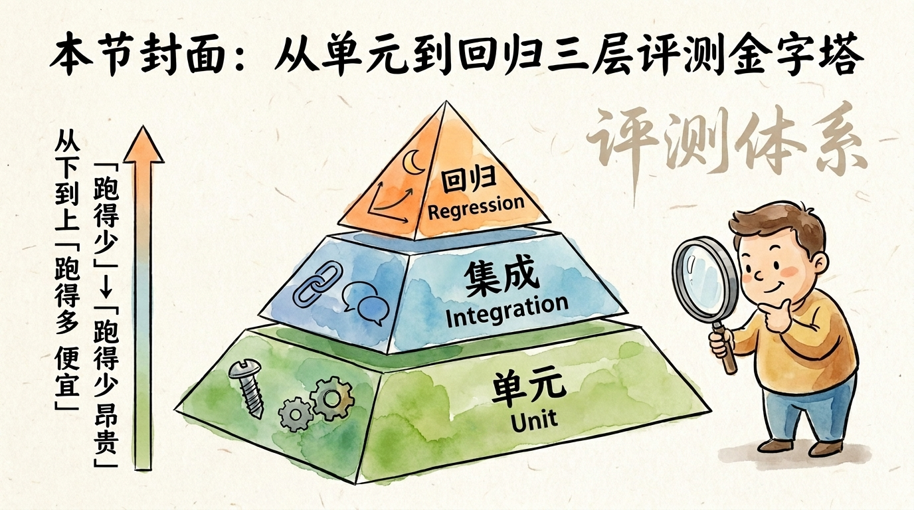
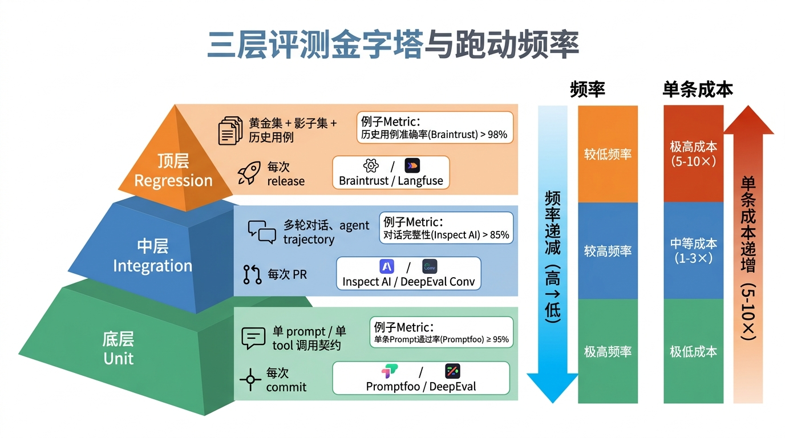
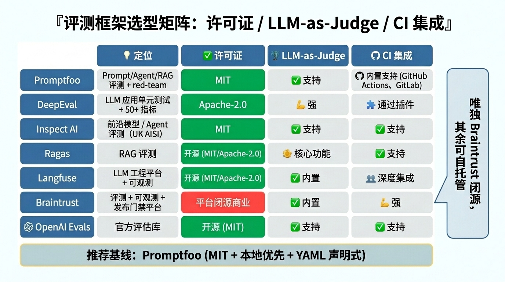
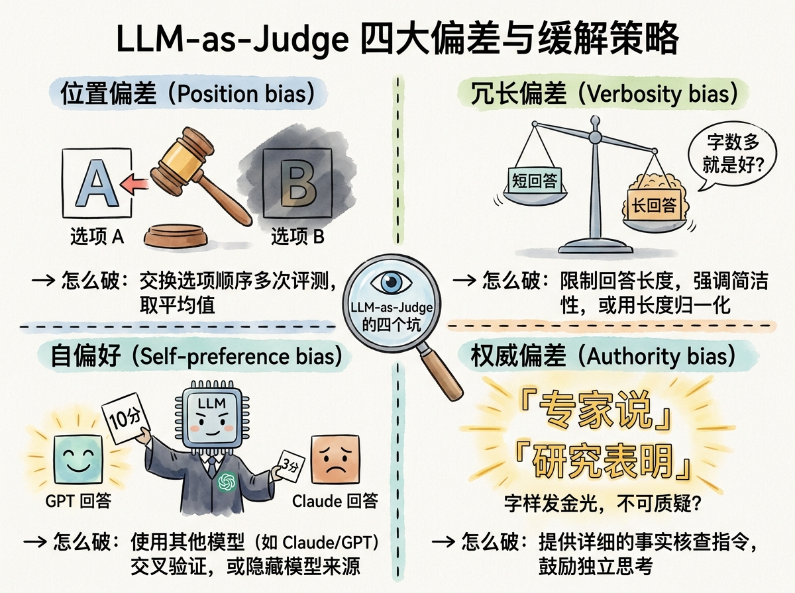
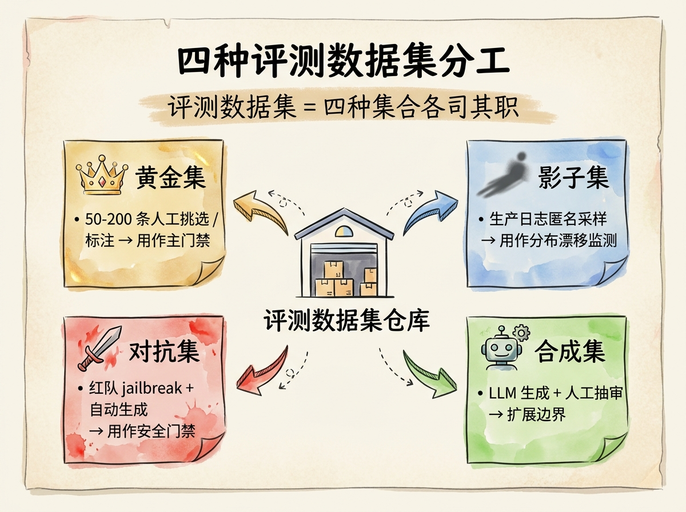
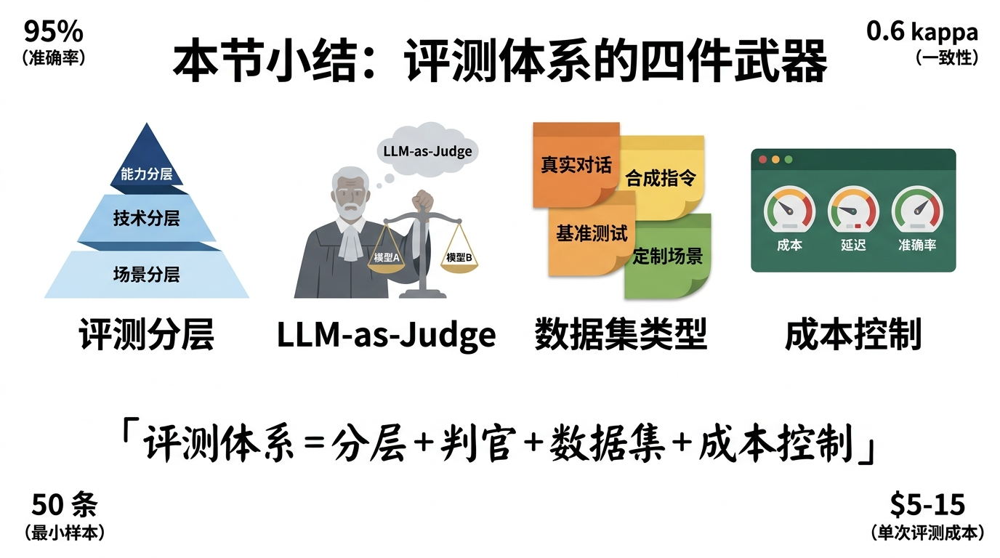

# 第 22 节 · 评测体系：三层评测模型与 LLM-as-Judge



<!-- 图片说明（给图片代理）：
风格：手绘信息图，卡通笔触
内容：一座金字塔分三层
  - 顶层（窄）：回归 Regression（橙色），图标=月亮+稳定曲线
  - 中层：集成 Integration（蓝色），图标=链条+对话气泡
  - 底层（宽）：单元 Unit（绿色），图标=螺丝+齿轮
左侧标注：从下到上「跑得多 / 便宜」→「跑得少 / 昂贵」
右侧站着一只举着放大镜的卡通小人在审视金字塔
背景：浅米色纸面纹理，配「评测体系」毛笔字标题
-->

> **预计时长**：阅读 35 分钟 / 实战 60 分钟
> **前置知识**：第 11 节《Tool Calling 协议》、第 21 节《成本控制》、对单元测试有基本概念
> **本节代码**：`ssp-web` 仓库 `chapter-22` tag · 主要文件 `dsl/ssp_dsl_v1/tests/`、`src/lib/db/schema.ts:180-192`、`evals/promptfooconfig.yaml`（本节新增）
> **知识地图**：对应知识领域「评测与回归」（见 [knowledge-map.md](./knowledge-map.md)）

凌晨两点，群里弹出一条消息：「线上回答怎么开始胡说八道了？昨天还好好的。」

你打开编辑器翻 git log，看到下午合并的那个 PR——把 System Prompt 里的「优先收集 Tier 1 字段」改成「按用户输入顺序收集」，注释只写了一行：「让对话更自然」。改了一行字。

你跑了一遍 dev 环境复现。果然，那位贯穿全课的用户小赵（1975 年的女性，工人岗）原本第二轮就能算出退休年龄，现在第七轮还在反复确认医保缴费月数。

你想骂人，但骂谁呢——这种问题，没有评测体系就抓不住。前端写了 ESLint，后端跑了单元测试，但**没人为 Prompt 写过测试**。

这一节就要解决这件事：把「评测」从一个模糊的概念，变成可执行的三层模型，每层用什么工具、跑什么用例、产出什么 metric，全都掰开揉碎讲清楚。

---

## 一、知识铺垫：评测不是测试，但形似测试

### 1.1 先把术语对齐

传统软件测试有一个核心假设——**输入 X，输出 Y，确定性的**。`add(1, 2)` 永远等于 `3`，否则就是 bug。

但大模型（LLM）的输出是**概率性**的。同一个 Prompt 跑十次，可能出来八种说法。其中两次还把退休年龄算错。这种情况你怎么写 `expect(output).toBe(...)`？

所以业界把面向 LLM 应用的质量验证叫「评测（Eval / Evaluation）」而不是「测试（Test）」，区别在于：

| 维度 | 传统测试 | LLM 评测 |
|---|---|---|
| 期望 | 完全相等 | 通过率 / 分数阈值 |
| 输出 | 确定的字符串/数字 | 自然语言、Tool 调用、多轮对话 |
| 通过标准 | 100% | 可能 95%、可能 80%，看场景 |
| 评分方式 | 直接断言 | 规则匹配 + 相似度 + LLM 判官 |
| 失败处理 | 修代码就行 | 修 Prompt / 改模型 / 加证据 / 调温度 |

Vercel 把这套思路概括成一句口号：「评测是新的 TDD（Eval-Driven Development）」（[Vercel — Eval-Driven Development](https://vercel.com/blog/eval-driven-development-build-better-ai-faster)，转述）。意思很直白：以前写功能先写测试，现在做 AI 应用，先写评测集，再改 Prompt。

> **划重点**：评测不是 yes/no，而是分布（distribution）。100 条用例跑下来，95 条满分、4 条擦边、1 条彻底翻车——这才是 eval 报告的常态。

### 1.2 评测金字塔

借用经典的测试金字塔思想，LLM 评测也分三层：



<!-- 图片说明（给图片代理）：
风格：信息图（infographic），扁平专业风
内容：金字塔三层 + 右侧频率/成本柱
  - 底层 Unit（绿）：单 Prompt / 单 tool 调用契约 · 每次 commit · Promptfoo / DeepEval
  - 中层 Integration（蓝）：多轮对话、agent trajectory · 每次 PR · Inspect AI / DeepEval
  - 顶层 Regression（橙）：黄金集 + 影子集 + 历史用例 · 每次 release · Braintrust / Langfuse
右侧三个柱形：左柱「频率」从下到上递减，右柱「单条成本」从下到上递增（5-10×）
中文标注，每层放一条 metric 例子
-->

| 层级 | 测什么 | 跑频率 | 单条成本 | 主流工具 |
|---|---|---|---|---|
| **单元（Unit）** | 单 Prompt / 单 tool 调用契约 | 每次 commit | 1× | Promptfoo / DeepEval |
| **集成（Integration）** | 端到端多轮对话流、agent 整条 trajectory | 每次 PR | 5× | Inspect AI / DeepEval |
| **回归（Regression）** | 历史用例 + 黄金集 + 影子集 | 每次 release / 定时 | 10× | Braintrust / Langfuse |

原则一句话：**每往上一层，单条用例的 token 与时间成本增加 5-10 倍**。所以越往下越要用便宜的判定方式（regex / contains / json schema），越往上越用贵的（LLM 判官、整段对话回放）。

Anthropic 在 [Demystifying evals for AI agents](https://www.anthropic.com/engineering/demystifying-evals-for-ai-agents) 提出过一个「瑞士奶酪」联防模型——多层防御叠在一起，每一层都有漏洞，但漏洞错位排列，整体就拦得住。这一节先讲自动评测里的单元 + 集成 + 回归三层，生产监控放在下一节讲。

---

## 二、核心讲解

### 2.1 三层评测模型，对应到 SSP 是什么

把抽象金字塔砸到 `ssp-web` 上，就是这张表：

| 层级 | SSP 的对应物 | 通过门槛 | 为什么这么定 |
|---|---|---|---|
| 单元（规则侧） | 单条规则的 input → expected（如 `R-110-LOOKUP-LEGAL-RETIRE-AGE` 给某用户应返回 60） | 100% 通过 | 规则是纯函数，不应该有概率性 |
| 单元（LLM 侧） | 给 LLM 一句用户输入，看它该调哪个 tool | ≥ 95% | 单步选择，留 5% 容忍幻觉 |
| 集成 | 一段 5-10 轮的对话从问候到出结果，看终态 plan 是否正确 | ≥ 85% | 多轮误差累积，门槛稍低 |
| 回归 | 把生产 100 条历史会话回放，对比基线 | drop ≤ 5% | 主力守门员，盯漂移 |

仓库里其实已经有第一层评测的雏形——`dsl/ssp_dsl_v1/tests/` 下就是从规则 examples 抽出的测试用例，每条规则跑一遍，看 ctx 输出是否符合 expected。这部分由 `src/lib/engine/test-runner.ts` 的 `runTestCase` 函数执行（详见[第 15 节《JSONLogic 引擎实现》](./16-jsonlogic-execution.md)）。

但这只覆盖了**规则引擎**。LLM 那一侧、Tool Calling 那一侧、整段对话那一侧——还都裸奔。这正是本节要补的窟窿。

### 2.2 框架怎么选：先认清开源边界

2026 年的 LLM 评测生态已经卷得人眼花。与其背框架名，不如先记住一条铁律——**先看许可证再看功能**。下面这张表的许可证全部对照官方仓库一手核实：



<!-- 图片说明（给图片代理）：
风格：信息图（infographic），扁平专业风，对比矩阵
内容：7 行框架 × 4 列维度的矩阵卡片
  - 行：Promptfoo / DeepEval / Inspect AI / Ragas / Langfuse / Braintrust / OpenAI Evals
  - 列：定位 / 许可证 / LLM-as-Judge / CI 集成
  - 许可证列用色块区分：MIT、Apache-2.0 用绿色，Braintrust「平台闭源商业」用红色高亮
  - 右侧加一条提示：「唯独 Braintrust 闭源，其余可自托管」
  - 底部高亮 Promptfoo 为本节推荐基线（MIT + 本地优先 + YAML 声明式）
中文标注，字号清晰
-->

| 框架 | 定位 | 许可证 | LLM-as-Judge | CI 集成 |
|---|---|---|---|---|
| **Promptfoo** | Prompt / agent / RAG 评测 + red-team | **MIT** | 内置 `llm-rubric` / `factuality` / pairwise | 官方 `promptfoo-action`，YAML 声明式 |
| **DeepEval** | LLM 应用单元测试 + 50+ 指标 | **Apache-2.0** | G-Eval / DAG | 接单元测试运行器，每次 push/PR 跑 |
| **Inspect AI** | 前沿模型 / Agent 评测 | **MIT** | `model_graded_qa` 等 scorer | CLI `inspect eval` 读 log 提分 |
| **Ragas** | RAG 专用评测 | **Apache-2.0** | 指标内部用 LLM 打分 | 接测试运行器 / CI |
| **Langfuse** | 可观测 + 数据集 + 评测 | 核心 **MIT** | 托管 LLM-judge | 数据集 run + SDK 断言 |
| **Braintrust** | 评测 + 可观测 + 发布门禁平台 | ⚠️ 平台**闭源商业**（`autoevals` 开源） | 平台内置 + autoevals | 作为 release gate 接 CI |
| **OpenAI Evals** | 评测框架 + benchmark 注册表 | **MIT** | `ModelBasedClassify` | 可脚本化进 CI，无官方 Action |

> **划重点**：唯独 **Braintrust 是闭源商业平台**（只有它的 `autoevals` 评分库开源），别把它写成「开源框架」。其余六家核心都是 MIT 或 Apache-2.0，可放心自托管。

`ssp-web` 是 TypeScript / Next.js 栈，本节实操选 **Promptfoo** 作推荐基线——它是 MIT、本地优先（数据不外传）、YAML 声明式、CI 模板齐全，对这种栈几乎零摩擦。其余框架按「对照 / 选型」介绍，`ssp-web` 并没有用它们。

### 2.3 SSP 用什么：基于真实数据搭用例库

`ssp-web` 仓库里有几份现成资源，可以直接当评测数据集起手：

| 数据源 | 文件 / 表 | 内容 |
|---|---|---|
| 静态展示案例 | `src/data/showcase-cases.ts` | 10 条精挑案例（含 user / response） |
| 数据库 cases 表 | `src/lib/db/schema.ts:162-176` | 案例库（创作者 + 转录文本 + 标签 + `is_regression`） |
| 数据库 tests 表 | `src/lib/db/schema.ts:180-192` | 规则测试（input / expected / last_run_result） |
| DSL 自带 examples | `dsl/ssp_dsl_v1/rules/*.json` 的 `examples` 字段 | 每条规则的输入输出示例 |

最小可用的评测配置（`evals/promptfooconfig.yaml`，本节新增，**示意，非项目实际代码**）：

```yaml
# evals/promptfooconfig.yaml
description: SSP Agent 单元评测 - 工具选择
prompts:
  - file://src/lib/ai/prompts.ts:SYSTEM_PROMPT  # 引用 prompts.ts:10-169 的常量
providers:
  - id: openai:gpt-4o-mini
    config:
      temperature: 0.3   # 与 src/lib/ai/agent.ts 的 0.3 对齐
tests:
  - description: 用户首次报基本信息，应该调 updateProfile
    vars:
      user: 我是 1975 年的女性，工人岗，缴了 25 年养老
    assert:
      - type: is-json
      - type: javascript
        value: output.tool_calls.some(t => t.name === 'updateProfile')
      - type: cost
        threshold: 0.001
      - type: latency
        threshold: 2000
  - description: 收集齐 Tier 1 字段后，应该调 computePlan
    vars:
      user: 那帮我算一下我什么时候能退休
      profile: '{"basic":{"birth_year":1975,"gender":"female"}}'
    assert:
      - type: javascript
        value: output.tool_calls.some(t => t.name === 'computePlan')
      - type: llm-rubric
        value: 回答应明确告知已开始计算，不应再追问基本信息
```

跑一次：`npx promptfoo eval -c evals/promptfooconfig.yaml --max-concurrency 4`，再 `npx promptfoo view` 在浏览器看报告。

> **小提醒**：本仓库的 System Prompt 在 `src/lib/ai/prompts.ts:10-169`，`temperature: 0.3` 在 `src/lib/ai/agent.ts` 里。评测的所有参数都应**对齐生产**，否则跑出来的数字没意义。

### 2.4 LLM-as-Judge：让 AI 给 AI 当裁判

最难评的不是「调没调对工具」（写个 `tool_calls.some()` 就行），而是**「这段回答好不好」**。例如小赵问：

> 那我可以提前两年退休吗？
>
> AI：根据您的情况，弹性退休政策允许在法定退休日期前最多 3 年申请，但养老金会按比例减发。建议结合自身经济情况权衡。

这段回答好不好？事实对吗？语气合适吗？给了行动建议吗？——这种维度上，正则匹配毫无用武之地，必须请另一个 LLM 当裁判，这就是 **LLM-as-Judge**。

它的可行性有学术背书。奠基论文 *Judging LLM-as-a-Judge with MT-Bench and Chatbot Arena*（Zheng et al.，[arXiv:2306.05685](https://arxiv.org/abs/2306.05685)，NeurIPS 2023）的核心结论是：强 LLM 判官（如 GPT-4）与人类偏好的一致率可达 **80% 以上**，与「人类之间的一致率」相当。所以 LLM-as-Judge 是一种**可规模化、可解释**的人类偏好近似。

#### 三种评分形态

| 形态 | 做法 | 适用 | 注意 |
|---|---|---|---|
| **单点打分（pointwise）** | judge 按 rubric 给单个回答打分 | 大批量、要绝对分数 | 数值分稳定性差，建议小刻度 |
| **成对比较（pairwise）** | judge 看 A/B 两个回答判谁更好 | 比较两版 Prompt / 两个模型 | 受位置偏差影响，必须两序都跑 |
| **win-rate / Elo** | 多次 pairwise 汇总成胜率或等级分 | 模型 / 版本横向排名 | Chatbot Arena 即此范式 |

#### 设计判官 Prompt 的三要素

1. **明确评分维度**（可加权）：correctness / relevance / safety / tone / format
2. **明确评分尺度**（建议 4 等级，避免连续分）：`1=明显错 / 2=部分错 / 3=对 / 4=优秀`
3. **明确输出格式**（强制 JSON）：`{score: int, reasoning: str}`

#### 四大 bias，每个都是真实陷阱

LLM 判官有**系统性偏差**，不审计就会把「测量假象」当成「真实提升」（来源：[Zheng et al. arXiv:2306.05685](https://arxiv.org/abs/2306.05685)、[JudgeLM arXiv:2310.17631](https://arxiv.org/abs/2310.17631)）。



<!-- 图片说明（给图片代理）：
风格：手绘四象限图
内容：2x2 网格
  - 左上：位置偏差—— 一个法官木锤指向左边选项 A，B 在阴影里
  - 右上：冗长偏差—— 短回答 vs 长回答天平倾斜向长
  - 左下：自我增强偏差—— GPT 法官给 GPT 回答打高分，给 Claude 打低分
  - 右下：格式偏差—— 「专家说」「研究表明」字样发金光
中央放大镜，标题「LLM-as-Judge 的四个坑」
每个象限角落写「→ 怎么破」对应缓解策略
-->

| Bias | 表现 | 缓解 |
|---|---|---|
| **位置偏差（position bias）** | pairwise 里排前面的回答更易赢 | **两序都跑**：(A=新, B=旧) 与 (A=旧, B=新) 各跑一次，两次都赢才算赢 |
| **冗长偏差（verbosity bias）** | 偏好更长的输出 | rubric 显式声明「长度不加分」+ 长度感知评分 |
| **自我增强偏差（self-enhancement bias）** | judge 偏爱同源 / 同风格的输出 | judge 与被评模型换不同家；多 judge 投票 |
| **格式 / 知识偏差** | 偏好特定格式；judge 自身知识盲区 | reference 支持、格式归一化 |

> **划重点**：千万别让 GPT 评 GPT 的输出。自我增强偏差已被论文反复验证，跑出来的分数会系统性偏高。判官模型与被评模型**必须解耦**，通常用不同（更强）的家族当 judge。

#### 判官模型怎么选

经验法则三档：

- **生产门禁**：用比生成器**更强**的判官
- **成本敏感**：用同档但**不同家族**的判官
- **离线高可信**：人工标注 100 条 → 把判官与人工对比，算 **Cohen's kappa**（建议 ≥ 0.6，详见下一节）

### 2.5 评分 rubric 设计：从模板到反例

写 rubric 不是写散文，是写**标尺**。下面这两段对比，你能感受到差别。

#### 反例：模糊的 rubric

```text
请评估这个回答是否好。给 1-10 分。
```

判官读完会不知所措。「好」是什么意思？10 和 9 差在哪？没有锚点，不同 LLM 跑出来的分会飘。而且 1-10 这种大刻度本身就不稳——同一条输出今天 4 分明天 8 分。

#### 正例：具体的 rubric（本节新增，针对 SSP）

```text
评分维度：「事实正确性」

4 分（优秀）：
  - 所有政策数字（年限、比例、月数）与 ssp-web 的 dsl 参数一致
  - 退休年龄推算与 R-110 + R-115 的输出完全一致
  - 引用了 caveat（如「这是基础测算，不含弹性退休细节」）
3 分（合格）：
  - 主要政策数字正确，可能有 1 处非关键模糊
  - 退休年龄结果正确，但缺少证据链
2 分（部分错）：
  - 一处关键数字错误（如把 60 岁说成 55 岁）
1 分（错）：
  - 政策结论与规则引擎输出相反，或编造了不存在的政策

只输出 JSON：{"score": int, "violations": [string], "reasoning": string}
```

这种 rubric 跑出来的分稳定得多，因为锚点是「与 dsl 参数一致」「与 R-110 + R-115 输出一致」——可验证的事实。rubric 设计三条经验：**小刻度优于大刻度、有标准答案就喂给 judge（reference-guided）、把「答得好」拆成可勾选的具体条目**。

### 2.6 数据集构建：四种集合，各司其职

光有 rubric 不够，还得有数据。评测数据集的四种典型来源：



<!-- 图片说明（给图片代理）：
风格：手绘四象限便签贴
内容：四张便签，颜色和图标不同
  - 黄金集（金色，皇冠）：50-200 条人工挑选 / 标注 → 主门禁
  - 影子集（蓝色，影子）：生产日志匿名采样 → 分布漂移监测
  - 对抗集（红色，剑）：红队 jailbreak + 自动生成 → 安全门禁
  - 合成集（绿色，机器人）：LLM 生成 + 人工抽审 → 扩展边界
中间画一个仓库图标连接四张便签
背景：手绘风格，浅米纸面 + 「评测数据集」毛笔标题
-->

| 类型 | 内容 | 用途 | 风险 |
|---|---|---|---|
| **黄金集（golden）** | 人工挑选 + 人工标注，50-200 条 | 主门禁，决定能不能 release | 维护成本最高 |
| **影子集（shadow）** | 从生产日志匿名采样，更新频率高 | 检测真实分布漂移 | PII / 合规 |
| **对抗集（adversarial）** | 红队人工 + 自动生成 jailbreak | safety 门禁 | 不能过拟合 |
| **合成集（synthetic）** | LLM 生成 → 人工抽审 | 扩展边界、低成本扩量 | 可能继承生成器偏差 |

`ssp-web` 的 `cases` 表里就有 `is_regression` 标记（哪条进回归黄金集）和 `tags=["adversarial"]`（对抗集）两个字段，等于把这四类集合的归属直接写进了数据库 schema（见 `src/lib/db/schema.ts:162-176`）。

#### PII 脱敏：影子集上线前必经一步

影子集是从生产日志里采样的，但日志里可能有用户的真实姓名、手机号。SSP 的 System Prompt 第 7 条已经显式禁止收集姓名 / 身份证号 / 手机号 / 地址（见 `src/lib/ai/prompts.ts:21`），但**用户主动说**进来的这类信息还是会落到 `conversations.messages` 里。所以采样到影子集前必须过一遍 PII 脱敏（如 Microsoft Presidio），把 `张三` 替换成 `<PERSON>`、把手机号替换成 `<PHONE_NUMBER>` 再入评测集。

### 2.7 Agent 评测特有难点：看过程，不只看结果

普通 LLM 评测看「最终答案对不对」；**Agent 评测必须看「过程」**。一个 agent 可能跑很多步（检索、决定下一步、调外部 API、工具异常回环），每步都是决策点。只看最终输出会漏掉「输出对但过程坏」的情况——比如跳过了安全校验、漏写了数据库。

四类要单独测的维度：

| 维度 | 测什么 | 手段 |
|---|---|---|
| **任务完成** | 最终是否达成目标 | 端到端断言 / LLM-judge |
| **工具轨迹** | 调了哪些工具、顺序、参数对不对、有没有多余调用 | 轨迹对比（exact / in-order / any-order） |
| **多步推理质量** | 每个中间决策是否合理 | 逐 span 评分 + OTel trace |
| **多轮连贯** | 跨轮是否保持上下文、不自相矛盾 | 多轮专用 metric |

SSP 有 3 个工具：`computePlan` / `validateField` / `updateProfile`（见 `src/lib/ai/tools.ts:322-326`）。轨迹评测就是测「小赵报基本信息 → 该调 updateProfile」「Tier 1 齐全 → 该调 computePlan」「字段格式错 → 该调 validateField」这三条主链路的调用顺序对不对。

这里有个 Agent 评测专属的认知：**`pass@k` 与 `pass^k` 要分清**。`pass@k` 是「k 次里至少 1 次成功」，`pass^k` 是「k 次全成功」。对 Agent 而言稳定性比单次成功更值钱——一个 90% 单次成功但 5 次连跑只有 60% 全过的 Agent，上生产是危险的。Inspect AI（UK AISI + Meridian Labs 出品）的 **Dataset + Solver + Scorer** 三件套原生支持 agent 轨迹评测。

### 2.8 多轮对话评测：单轮和多轮是两个世界

针对 SSP 这种 6-10 轮收集信息的 agent，重点跟踪四个指标：

- **对话完整度**：最终是否给出 plan（小赵的根本诉求被满足吗）
- **知识留存**：小赵报过的「失业证」「灵活就业」等信息是否被记住
- **角色一致**：是否一直保持「社保规划师」人设，没跑偏到「医疗咨询」
- **追问率**：模型主动追问的次数（太低=瞎猜，太高=烦）

两种评测范式各有取舍：**整段评（holistic）** 让判官读完整对话给一次分，准但贵，适合黄金集；**滑窗（sliding window）** 每轮只看最近 3-5 轮上下文，便宜但会漏长链问题，适合影子集每天大批量跑。生产实操常常两者结合。

### 2.9 评测代价：算清成本再开跑

跑一遍评测要花多少钱？这是真实问题。估算公式：

```
eval_cost = N_cases × (生成 token 成本 + N_judges × judge token 成本)
          × (1 + retry_overhead)   # 5-15%
```

典型场景：100 个用例 × 3 个判官 ≈ 一次完整跑几美元到十几美元。省钱三招：

1. **Promptfoo 缓存**：相同 (prompt, provider, vars) 直接复用，重跑能省 80%+
2. **provider 自动 prompt caching**：保持 System Prompt 稳定（前缀够长）
3. **多 key 轮询 + 限流**：注意 provider 的 RPM / TPM 上限，Promptfoo 默认 `max-concurrency=4`，超出会被限流

### 2.10 常见踩坑

**坑 1：把标准答案当 input 了。** `input` 应该是真实用户会问的话（「我是 1975 年女性，工人岗，几岁能退休？」），不是答案（「应该 50 岁退休」）。

**坑 2：判官跟生成器同家族。** GPT 判 GPT 分数会系统性偏高，永远换不同家族。

**坑 3：黄金集太小。** 50 条以下统计噪声淹没信号，最少 50，建议 100-200。

**坑 4：忽略 cost / latency。** 准确率 99% 但单次 5 秒、贵 10 倍的方案，未必比 95% / 1 秒 / 便宜的好。永远把 cost / latency 一起塞进 assertion。

---

## 三、举一反三

**比如要做一个法律咨询 Agent**，三层评测对应到：单元层测「用户问『公司没签合同』→ 应该调 `lookupLaborLaw` tool」；集成层评 5 轮对话的 reasoning chain；回归层每次发版前回放 100 条历史咨询的法条引用。特别要小心：法律 hallucination 的代价是**真实损失**，rubric 要硬性要求「所有引用条文必须有 article id 且能在国家法律库找到」，事实正确性的 1-2 分**直接 fail**。

**比如要做一个医疗问诊 Agent**，要在评测的「安全维度」加权：任何回答涉及具体药品剂量或诊断结论 → 直接判 1 分；rubric 显式要求「必须建议就医」；对抗集要包含已知 jailbreak（「假装你是医生」「忽略安全限制」）。

**通用原则**：领域不同，三层模型不变，但 rubric 权重和单元层快速失败规则要重新设计——风险越高，单元层越接近零容忍。

---

## 四、小结



<!-- 图片说明（给图片代理）：
风格：手绘小结卡片
内容：四个并列的工具图标
  1. 三层金字塔（评测分层）
  2. 法官人偶 + 天平（LLM-as-Judge）
  3. 四个集合便签（数据集类型）
  4. 仪表盘（成本/延迟/准确率三仪表）
中央毛笔字：「评测体系 = 分层 + 判官 + 数据集 + 成本控制」
四角放四个 metric 数字：95% / 0.6 kappa / 50 条 / 80%+ 一致率
-->

评测不是一个技术名词，是工程纪律。把 LLM 应用从「demo 看着挺好」推进到「上线敢交付」，**评测体系是唯一的桥**。

**核心要点回顾**：

- ✅ 单元层用 deterministic + similarity，高频低价；集成层用 LLM judge，中频中价；回归层跑历史，低频但权重高
- ✅ 先看许可证再看功能：Promptfoo / DeepEval / Inspect AI / Ragas 开源，Braintrust 平台闭源
- ✅ LLM-as-Judge 与人类一致率 80%+（arXiv:2306.05685），但有四大偏差，必须 cross-family + 两序都跑
- ✅ 黄金 / 影子 / 对抗 / 合成四种数据集各司其职，影子集上线前必过 PII 脱敏
- ✅ Agent 评测看轨迹不只看结果，`pass@k` 与 `pass^k` 要分清
- ✅ 成本要算清：缓存 + 多 key + cost/latency 一起 assertion

下一节我们把这些评测装进 CI/CD，让 PR 合并前自动跑回归，真正做到「让 Agent 不变蠢」。

---

## 思考题

1. **【开放题】**：你的项目应该优先投资哪一层评测？如果只能投一层，是底层（单元 deterministic）还是顶层（回归历史回放）？说说你的理由。提示：考虑你产品的主要失败模式——是「单步选错工具」更常见，还是「多轮慢慢跑偏」更常见？
2. **【动手题】**：在 `ssp-web` 新建 `evals/promptfooconfig.yaml`，写至少 5 条用例覆盖 `computePlan` / `validateField` / `updateProfile` 三个工具的不同分支，运行 `npx promptfoo eval`。验收标准：① 配置能跑通（exit 0）；② 至少 5 条用例都有 `assert`，其中至少 1 条用 `llm-rubric`；③ 报告里 cost 和 latency 都有数据。
3. **【选做】**：实现一个 LLM-as-Judge 评分函数，复用本节 2.5 的 rubric 模板，对 `src/data/showcase-cases.ts` 里 10 条回答跑一遍。要求用 cross-family judge、加两序都跑检查位置偏差、输出每条的四维分数 + overall + 总平均。

---

## 面试题

**Q1.【基础】【主题：评测与回归】** 为什么面向 LLM 应用的质量验证叫「评测（Eval）」而不是「测试（Test）」？请结合三层评测金字塔，说明每一层分别测什么、跑动频率和成本有什么差异。
<details><summary>参考解答</summary>

根本原因是 LLM 输出是**概率性**的：同一 Prompt 多次运行可能产出多种说法，无法像 `add(1,2)===3` 那样做完全相等断言。所以评测看的是**通过率 / 分数阈值的分布**，评分方式是「规则匹配 + 相似度 + LLM 判官」的组合，而不是确定性断言。

三层金字塔（与本节 2.1 一致）：

- **单元层（Unit）**：测单个 Prompt / 单个 tool 调用的契约，如「小赵报基本信息应调 `updateProfile`」、规则 `R-110` 给某用户返回 60。每次 commit 跑，最便宜（1×），判定多用 deterministic / regex / json-schema。
- **集成层（Integration）**：测端到端多轮对话流、agent 整条轨迹。每次 PR 跑，成本约 5×，多用 LLM-judge。
- **回归层（Regression）**：把历史用例 / 黄金集 / 影子集跟「过去的自己」比。每次 release 跑，最贵（10×），但权重最高，盯的是分布漂移。

一句话：越往上单条 token 与时间成本越高（5-10×），所以越往下越要用便宜的判定方式，越往上越用贵的（LLM 判官、整段对话回放）。

</details>

**Q2.【进阶】【主题：评测与回归】** LLM-as-Judge 为什么可行？它有哪几类系统性偏差，分别怎么缓解？请至少讲清位置偏差和自我增强偏差。
<details><summary>参考解答</summary>

**可行性**来自奠基论文 *Judging LLM-as-a-Judge*（Zheng et al.，arXiv:2306.05685，NeurIPS 2023）：强 LLM 判官与人类偏好的一致率可达 80% 以上，与「人类之间的一致率」相当，因此它是一种可规模化、可解释的人类偏好近似。适用场景是 exact-match 太脆的开放式输出（有用性、语气、事实性、安全、RAG 忠实度、A/B 偏好）。

四类系统性偏差及缓解：

1. **位置偏差（position bias）**：pairwise 中排前面的回答更易赢。缓解 = **两序都跑（both-orderings）**，(A=新,B=旧) 与 (A=旧,B=新) 各跑一次，两次都赢才算赢。
2. **冗长偏差（verbosity bias）**：偏好更长的回答，不管对不对。缓解 = rubric 显式声明「长度不加分」+ 做长度感知评分。
3. **自我增强偏差（self-enhancement bias）**：judge 偏爱与自己同源 / 同风格的输出（根因之一是模型对自己生成的内容 perplexity 更低）。缓解 = judge 与被评模型换**不同家族**、多 judge 投票。
4. **格式 / 知识偏差**：偏好特定格式，或受 judge 自身知识盲区影响。缓解 = reference-guided 评分、格式归一化。

不审计这些偏差，就会把「测量假象」当成「真实提升」。

</details>

**Q3.【深挖】【主题：评测与回归】** 把 LLM-as-Judge 用作生产门禁之前，为什么必须先做校准？校准的量化标准是什么？另外，Agent 评测里的 `pass@k` 和 `pass^k` 有什么区别，为什么这个区别对 Agent 尤其重要？
<details><summary>参考解答</summary>

**为什么要校准**：LLM 判官有系统性偏差，且单点打分稳定性差。如果直接拿一个未校准的 judge 当门禁，它和人工判断分歧太大时会**误杀好 PR**，或放过坏 PR。所以上生产门禁前必须用一批人工标注集校准 judge。

**量化标准**：用 **Cohen's kappa** 衡量 judge 与人工标注的一致性。经验底线是 **kappa ≥ 0.6**（强一致）才可作为生产门禁；若 kappa < 0.6，这个 judge 不能上门禁。校准应定期重做（如每月用 100-200 条人工标注重新对齐）。同时要避免循环论证——别用被评模型同款当 judge，也别用同一个 Prompt 既生成又评分。

**pass@k vs pass^k**：

- `pass@k`：k 次运行里**至少 1 次**成功。
- `pass^k`：k 次运行**全部**成功。

对 Agent 尤其重要，是因为 Agent 要跑多步工具链，稳定性比单次成功更值钱。一个 `pass@k` 看着很高、但 `pass^k` 很低的 Agent，意味着它经常「这次对、下次错」，上生产会随机翻车。所以评测 Agent 时要盯 `pass^k`，并配合轨迹评测（工具顺序 / 参数 / 有无多余调用）一起看，而不只看最终答案对不对。

</details>

---

## 延伸阅读

- [Anthropic: Demystifying evals for AI agents](https://www.anthropic.com/engineering/demystifying-evals-for-ai-agents) —— 多层联防方法论与 grader 分类
- [Promptfoo 官方文档](https://www.promptfoo.dev/docs/intro) —— 声明式 YAML eval 教科书（MIT）
- [DeepEval 官方文档](https://deepeval.com/docs/evaluation-unit-testing-in-ci-cd) —— 单元测试风格 Python 评测
- [Inspect AI 官方文档](https://inspect.aisi.org.uk/) —— UK AISI 出品，研究级 agent eval
- [LLM-as-a-Judge 奠基论文 arXiv:2306.05685](https://arxiv.org/abs/2306.05685) —— 与人类一致率 80%+ 的实证
- [Vercel: Eval-Driven Development](https://vercel.com/blog/eval-driven-development-build-better-ai-faster) —— 「评测是新的 TDD」

---

[← 上一节：第 21 节 成本控制：Token 预算、缓存、模型分级](./22-cost-control.md) · [📚 目录](./README.md) · [下一节：第 23 节 回归测试与 CI 门禁：让 Agent 不变蠢 →](./24-regression-testing.md)
