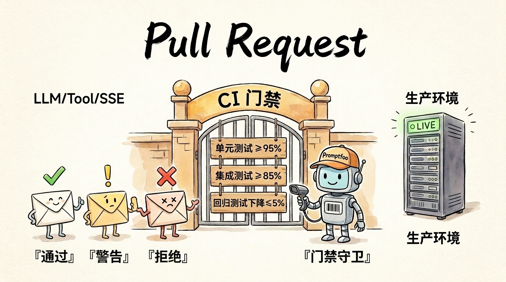
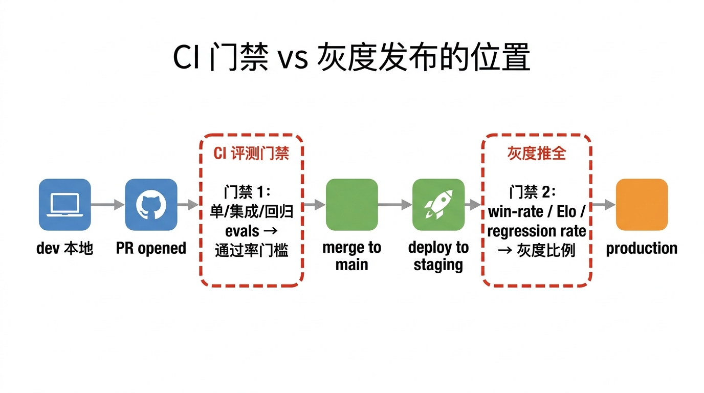
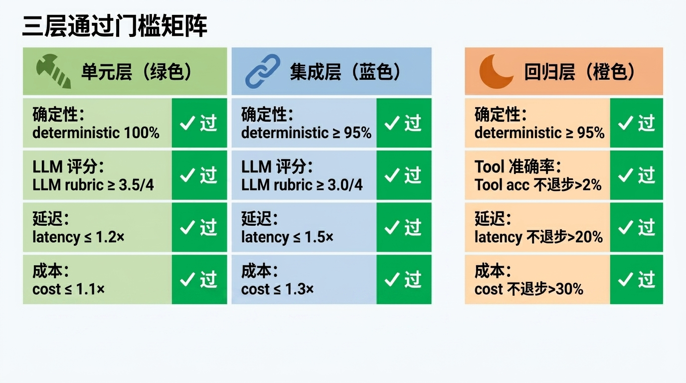
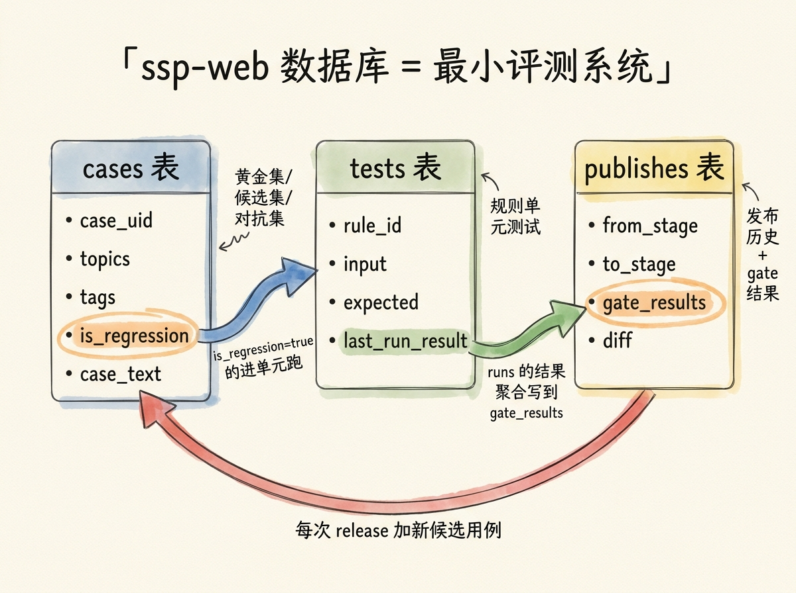
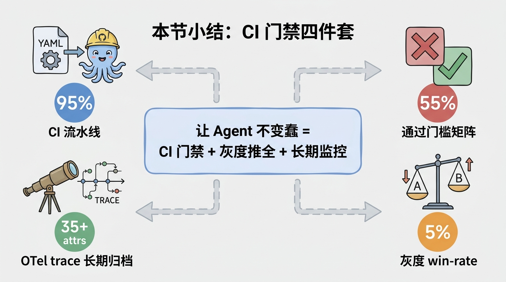

# 第 23 节 · 回归测试与 CI 门禁：让 Agent 不变蠢



<!-- 图片说明（给图片代理）：
风格：手绘信息图，卡通风
内容：一道城门「CI 门禁」拦在 PR 与生产之间
  - 左边：3 个 PR 排队（卡通信封图标），分别贴绿勾 / 黄叹号 / 红叉
  - 城门上挂三块告示牌：「单元 ≥ 95%」「集成 ≥ 85%」「回归 drop ≤ 5%」
  - 右边：生产服务器闪着「LIVE」绿光
  - 城门守卫是个戴着「Promptfoo」帽子的卡通机器人，举着扫码器
背景：浅米色纸面纹理 + 「Pull Request」字样毛笔标题
-->

> **预计时长**：阅读 30 分钟 / 实战 90 分钟
> **前置知识**：第 22 节《评测体系》、对 GitHub Actions 有基本概念、对 git 工作流熟悉
> **本节代码**：`ssp-web` 仓库 `chapter-23` tag · 主要文件 `.github/workflows/eval.yml`（本节新增）、`src/lib/db/schema.ts:103-114, 162-176, 180-192`
> **知识地图**：对应知识领域「评测与回归」（见 [knowledge-map.md](./knowledge-map.md)）

那次「AI 突然变蠢」的事故复盘会上，技术总监问了一句很扎心的话：

> 「我们上线前过了 review，过了单元测试，过了 lint，跑了视觉回归。AI 评测有没有过？」

会议室沉默了五秒。

——没有。所有人都默认「Prompt 改一行不需要测试」。但**那一行就足够让 95% 通过率掉到 73%**，足够让小赵那个本该两轮算完的对话退化成七轮还在原地打转。

如果这个评测能在 PR 阶段自动跑、自动 fail、自动 block merge，根本就不会有这次事故。

这一节就要把上一节学到的评测体系**装进 CI/CD**，让它变成 PR 合并前必经的关卡。我们要回答四个问题：CI pipeline 怎么搭？通过 / 不通过的标准怎么定？灰度发布时怎么判断「新版比旧版好」？出了问题怎么追溯？

---

## 一、知识铺垫：CI 门禁 vs 灰度发布

### 1.1 两个动作，两个时机

很多人混淆「CI 门禁」和「灰度发布」，但它们在管线上完全不在一个位置：



<!-- 图片说明（给图片代理）：
风格：信息图，扁平专业风
内容：横向流水线 6 个节点
  1. dev 本地（笔记本图标）
  2. PR opened（github 章鱼图标）
  3. CI 评测门禁 ← 红色虚线框「门禁 1」
  4. merge to main
  5. deploy to staging（火箭图标）
  6. 灰度推全 ← 红色虚线框「门禁 2」 → production
两个虚线框上方分别标注：
  门禁 1：单/集成/回归 evals → 通过率门槛
  门禁 2：win-rate / Elo / regression rate → 灰度比例
-->

| 维度 | CI 门禁 | 灰度发布 |
|---|---|---|
| 位置 | PR → merge 前 | 部署 → 推全前 |
| 数据 | 离线黄金集 + 影子集 | 真实流量 A/B |
| 时长 | 分钟级 | 小时到天 |
| Block 谁 | 阻断 merge | 阻断 100% rollout |
| 主要 metric | 通过率、scoring delta | win-rate、Elo、retention |

CI 门禁挡住的是**已知失败模式**——历史上你见过的踩坑、人工审过的 case。灰度发布挡住的是**未知失败模式**——只有真实流量才能暴露的边缘情况。两者缺一不可。

### 1.2 「不变蠢」的三层防线

借用上一节的多层联防思路，从 PR 到生产再到长期稳态，是三层防线：

| 防线 | 目的 | 主要手段 |
|---|---|---|
| 第一层：CI 门禁 | 阻断已知坏 PR | 单元 + 集成 evals + 通过率门槛 |
| 第二层：灰度推全 | 阻断进了 main 的坏版本 | A/B 测试 + win-rate + 自动回滚 |
| 第三层：生产监控 | 抓住跑偏的稳态 | 影子集回放 + OTel trace + 人工抽检 |

下面我们逐层拆开讲。

---

## 二、核心讲解

### 2.1 CI 流水线设计：三套候选

业界主流的 CI 评测方案，按工具分三派。下面给出每套的核心配置。

#### 方案 A：Promptfoo + GitHub Actions（推荐基线，ssp-web 真实落地）

最简单、跨语言、CI 模板齐全。`.github/workflows/eval.yml`（**本节新增到 ssp-web，这是项目真实落地代码**）：

```yaml
name: 'LLM Eval Gate'
on:
  pull_request:
    paths:
      - 'src/lib/ai/**'        # AI 核心改动
      - 'evals/**'             # 评测配置改动
      - 'dsl/**'               # 规则 DSL 改动

jobs:
  evaluate:
    runs-on: ubuntu-latest
    permissions:
      pull-requests: write
    steps:
      - uses: actions/checkout@v4
      - name: Set up promptfoo cache
        uses: actions/cache@v4
        with:
          path: ~/.cache/promptfoo
          key: ${{ runner.os }}-promptfoo
      - name: Run promptfoo evaluation
        uses: promptfoo/promptfoo-action   # 固定到官方主版本 tag
        with:
          openai-api-key: ${{ secrets.OPENAI_API_KEY }}
          github-token: ${{ secrets.GITHUB_TOKEN }}
          config: 'evals/promptfooconfig.yaml'
          cache-path: ~/.cache/promptfoo
          fail-on-error: true            # 任意 assertion 失败即 fail
        env:
          PROMPTFOO_PASS_RATE_THRESHOLD: 0.95   # 总通过率 < 95% 即 fail
```

> **看这里 →**：`PROMPTFOO_PASS_RATE_THRESHOLD: 0.95` 是整体通过率门槛。`fail-on-error: true` 是任一 assertion 失败立即终止。这两个一起用，等于双保险。Action 会**自动**把 eval 报告作为 PR comment 贴回去——失败时 PR 状态打 ❌，开发者看到红叉就回去改 Prompt 或加证据，根本不需要进 CI 日志翻。

#### 方案 B：DeepEval + GitHub Actions（Python 栈对照）

如果你的栈是 Python（FastAPI / LangChain / LlamaIndex），DeepEval 更顺手（**示意 / 对照，非项目实际代码**）：

```yaml
- run: pip install deepeval pytest
- name: Run DeepEval tests
  env:
    OPENAI_API_KEY: ${{ secrets.OPENAI_API_KEY }}
  run: deepeval test run tests/ --display-only-failed
```

`tests/test_chatbot.py` 里每个 metric 都自带 `threshold`，自动决定 pass/fail。例如 `AnswerRelevancyMetric(threshold=0.8)` 就是该指标必须 ≥ 0.8 才过。它深度集成 Python 的单元测试运行器，每次 push/PR 跑一遍。

#### 方案 C：Inspect AI + GitHub Actions（轨迹评测对照）

研究级、agent trajectory 强项，适合需要测「整条工具链路是否走对了」的场景（**示意 / 对照**）：

```yaml
- run: pip install inspect-ai
- env:
    ANTHROPIC_API_KEY: ${{ secrets.ANTHROPIC_API_KEY }}
  run: inspect eval evals/ssp_agent.py --model anthropic/claude-sonnet-4-6 --log-dir ./logs
- name: Check accuracy
  run: |
    python -c "import json,sys; log=json.load(open('logs/latest.json')); sys.exit(0 if log['results']['scores']['accuracy']>=0.85 else 1)"
```

关键技巧：用一个脚本读 `logs/latest.json` 提取 score，再 `sys.exit(0/1)` 决定 pass/fail——这种模式可以接到任何 eval 框架。

> **小提醒**：所有方案都依赖 `secrets.OPENAI_API_KEY` 之类的密钥。仓库 Settings → Secrets 配好之前别合 PR，否则 CI 直接挂。`ssp-web` 至少要塞 `OPENAI_API_KEY` + `OPENAI_MODEL`（见 `code-facts.md` §11）。

### 2.2 合格标准矩阵：拍脑袋还是看数字？



<!-- 图片说明（给图片代理）：
风格：信息图，扁平专业风
内容：三栏对比表
  - 列1：单元层（绿色）→ deterministic 100% / LLM rubric ≥ 3.5/4 / latency ≤ 1.2× / cost ≤ 1.1×
  - 列2：集成层（蓝色）→ deterministic ≥ 95% / LLM rubric ≥ 3.0/4 / latency ≤ 1.5× / cost ≤ 1.3×
  - 列3：回归层（橙色）→ deterministic ≥ 95% / Tool acc 不退步>2% / latency 不退步>20% / cost 不退步>30%
表头三个图标：单元=螺丝、集成=链条、回归=月亮
中间用一道竖直分隔线表示「门禁」概念，左是 PR 右是 production
中文标注，加「✓ 过」「✗ 不过」醒目色块
-->

光跑通 eval 还不够，得有清晰的 pass/fail 阈值。下面是业界推荐的门禁标准（可按业务调整）：

| Metric | 单元层 | 集成层 | 回归层 |
|---|---|---|---|
| Deterministic assertion 通过率 | 100% | ≥ 95% | ≥ 95% |
| LLM-rubric 平均分 | ≥ 3.5/4 | ≥ 3.0/4 | ≥ 3.0/4 |
| Tool-call accuracy | ≥ 95% | ≥ 90% | 不退步 > 2% |
| p95 latency | ≤ baseline × 1.2 | ≤ baseline × 1.5 | 不退步 > 20% |
| 总成本 | ≤ baseline × 1.1 | ≤ baseline × 1.3 | 不退步 > 30% |

三个常被忽视的细节：

**细节 1：单元层要求 100% deterministic 通过。** 单元层测的是 contract（合约），不是性能。「调用 `computePlan` 时必须传 `birth_year` 字段」这种事不该有任何容忍，100% 是底线。

**细节 2：回归层不看绝对值，看 delta。** 回归层的 baseline 是 main 分支当前的成绩。新版 PR 跑出来，对比 baseline 看「掉了几个点」，绝对值再高也不能掉超过 5%（业内通用口径）。

**细节 3：cost 和 latency 必须 assert。** 只看 accuracy 是误区。一个改动让准确率从 90% 升到 92%，但延迟从 1s 涨到 3s——这是好改动还是坏改动？没有 cost / latency 门槛根本回答不了。

### 2.3 灰度发布的 metric：win-rate / Elo / regression rate

CI 门禁拦不住的，灰度发布兜底。灰度阶段四个核心指标：

| 指标 | 用途 | 建议阈值 |
|---|---|---|
| **Win-rate**（A/B pairwise） | 新 Prompt vs 旧 Prompt 的偏好 | 灰度推全：≥ 55%（统计显著） |
| **Elo score**（多版本联赛） | 排名稳定性 | 新版 Elo 不低于旧版 −10 |
| **Regression rate** | 历史用例上得分下降的占比 | < 3% |
| **Per-segment delta** | 切分用户群后的胜率 | 任何 segment 胜率 ≥ 50% |

#### Win-rate 怎么算

最简单的做法：把同一个用户问题，分别让旧版和新版回答，请 LLM judge 投票。100 个问题里新版赢 62、旧版赢 30、平手 8，win-rate = 62 / 100 = 62%。

> **划重点**：永远跑 **两序都跑（both-orderings）**——同一对回答让 judge 跑两次，(A=新, B=旧) 和 (A=旧, B=新)，两次都赢才算赢。这是为了对抗位置偏差（详见上一节 LLM-as-Judge 章节）。

#### Per-segment delta：分人群看胜负

整体 win-rate 60% 看着不错，但拆开一看可能是「英文用户 75%、中文用户 38%」——中文翻车了。这种 per-segment 视角能抓住整体看不见的灾难。SSP 里典型的 segment 包括：

- 男性 / 女性（女性退休口径有 worker50 / cadre55 两种，小赵属于 worker50）
- 灵活就业 / 在职 / 失业
- 临近退休 / 还有 10 年以上

每个 segment 至少 10-20 个用例，胜率必须 ≥ 50%。任一 segment 翻车 → 不推全。

### 2.4 三种 diff 形态：snapshot / score / pairwise

回归测试本质是「跟过去的自己比」。三种实现方式各有取舍：

| 形态 | 做法 | 优点 | 缺点 |
|---|---|---|---|
| **Snapshot diff** | 存历史输出快照，新输出做语义相似度比对 | 直观，看 diff 一目了然 | LLM 输出有抖动，误报多 |
| **Score delta** | 直接对比每个 metric 的平均值 | 抗抖动，看 delta 不看绝对值 | 均值可能掩盖个别灾难 |
| **Pairwise win-rate** | 每个用例同时让新旧两版回答，judge 投票 | 最有说服力 | 最贵 |

Score delta 的核心逻辑很简单：对 50 条用例分别跑 HEAD 与 main 两版打分，算 `delta = mean_new − mean_old`，断言 `delta > -0.05`。但要小心均值陷阱——5 条 +0.2、5 条 −0.3，平均看着只掉 0.05，其实有一半样本灾难性退化。所以实操推荐**三种结合**：日常 score delta，发版前 pairwise，事故复盘 snapshot。

### 2.5 失败用例的人工抽查：自动评的局限

LLM judge 跑得再好，也有 5-10% 的判错率。所以**关键决策点必须有人工抽查**：daily 抽样生产日志 0.5%-1% 进人工标注队列；release-gate 时黄金集失败的 case 100% 人工复核；每月用 100-200 条人工标注重新校准 judge。

#### Cohen's kappa：判官与人工的一致性

Cohen's kappa 衡量 LLM judge 和人工两个评分者的一致性：

| kappa | 含义 |
|---|---|
| 0.2 - 0.4 | 弱 |
| 0.4 - 0.6 | 中等 |
| **0.6 - 0.8** | 强（可作为生产 judge） |
| 0.8 - 1.0 | 几乎完全一致 |

> **划重点**：如果你的 LLM judge 跟人工 kappa < 0.6，这个 judge **不能上生产门禁**——它和人工分歧太大，会误杀好 PR。这是上一节讲过的校准底线，在 CI 门禁里是硬前提。

### 2.6 SSP 的最小评测系统：三张表打底

`ssp-web` 数据库里其实已经有给评测系统准备的三张表（见 `src/lib/db/schema.ts`）：

| 表 | 行号 | 关键字段 | 评测中的角色 |
|---|---|---|---|
| `cases` | 162-176 | case_uid, topics, case_text, tags, **is_regression** | 回归用例库（黄金集源头） |
| `tests` | 180-192 | name, rule_id, input, expected, last_run_result, last_run_at | 规则单元测试 |
| `publishes` | 103-114 | entity_type, from_stage, to_stage, actor, **gate_results**, diff | 发布门禁记录 |

> **看这里 →**：`cases.is_regression` 字段就是「这条要进回归集吗」的标志，`tags=["adversarial"]` 标对抗集。`publishes.gate_results` 存每次发布时所有 gate 的判定结果（JSON），可以追溯「哪次 release 把哪个 metric 拉下来了」。

这三张表的设计逻辑：`cases` 里 `is_regression=true` 的进回归集（每次发版必跑），`is_regression=false` 的是待人工标注的候选集；`tests` 关联到具体 `rule_id`，`expected` 字段供 diff；`publishes` 记录每次 staging → production 的 gate 结果与 diff。



<!-- 图片说明（给图片代理）：
风格：手绘 ER 图风
内容：三张表卡片 + 关系箭头
  - cases 表（左）：case_uid / topics / tags / is_regression（高亮）/ case_text → 旁标「黄金集 / 候选集 / 对抗集」
  - tests 表（中）：rule_id / input / expected / last_run_result → 旁标「规则单元测试」
  - publishes 表（右）：from_stage / to_stage / gate_results（高亮）/ diff → 旁标「发布历史 + gate 结果」
箭头：cases →（is_regression=true 进单元跑）→ tests →（结果聚合）→ publishes.gate_results →（每次 release 加候选）→ cases
背景：浅米色纸面纹理 + 顶部毛笔字「ssp-web 数据库 = 最小评测系统」
-->

这套设计的好处：**所有评测数据是项目源码的一部分**，不依赖外部 SaaS。需要复盘「3 月 15 日那次 release 是怎么过的 gate」，直接查 `publishes` 表就行。

### 2.7 让 trace 跨工具走：OpenTelemetry GenAI

CI 门禁拦截 + 生产监控告警，两套数据如果各自为政，复盘时你会被「同一个用户的 trace 在 dev、staging、prod 三个系统里各看一遍」逼疯。

**OpenTelemetry GenAI Semantic Conventions** 定义了一批 `gen_ai.*` 属性，让所有 LLM 调用都说同一种语言。核心 attributes 分几类：

```text
# 操作元信息
gen_ai.operation.name / gen_ai.provider.name
gen_ai.request.model / gen_ai.response.model / gen_ai.response.finish_reasons
# Token 与成本
gen_ai.usage.input_tokens / gen_ai.usage.output_tokens
# 对话与工具
gen_ai.conversation.id
gen_ai.tool.name / gen_ai.tool.call.arguments / gen_ai.tool.call.result
```

把 SSP 的 `/api/chat` 接进 OTel，每次 `streamText` 调用、每次 tool 执行都是一个 span。开发者看 trace UI 就能从用户消息一路追到规则引擎的 24 条规则执行序列。Langfuse / Phoenix 走「OTel trace + 逐 span evaluator」路线，trace schema 互相兼容，不锁住你今天选 Langfuse、明天换 Phoenix。

### 2.8 生产案例：业界怎么做

**Anthropic** 在 [April 23 Postmortem](https://www.anthropic.com/engineering/april-23-postmortem) 与 [Demystifying evals for AI agents](https://www.anthropic.com/engineering/demystifying-evals-for-ai-agents) 里披露的实践概括为：每个 system prompt 改动都跑全套 per-model evals；可能影响智能的改动加 **浸泡期（soak period）** + 更宽 eval suite + 渐进 rollout；用「瑞士奶酪」多层联防（自动评测 + 生产监控 + A/B + 人工抽检 + 校准研究）；并区分三种 grader（code-based / model-based / human）与 `pass@k` / `pass^k`。

**Vercel** 在 [Eval-Driven Development blog](https://vercel.com/blog/eval-driven-development-build-better-ai-faster) 提出「评测是新的 TDD」——AI SDK 让 eval 跨模型可移植，推荐 **Braintrust + AI Gateway + Vitest** 这套栈（注意 Braintrust 平台是闭源商业产品，只有 `autoevals` 评分库开源）。

### 2.9 常见踩坑

**坑 1：CI 跑得太慢，工程师绕过 CI。** 如果一次 eval 要跑 30 分钟，工程师会偷偷在 PR 里写「skip eval」逼 reviewer 让步。对策：用 `--max-samples` 限制样本数、缓存命中率拉到 70%+、只对改动路径触发、抽样跑全量留 nightly。**目标是把 CI 跑进 5-8 分钟**。

**坑 2：门槛设得太严，PR 永远不通过。** 第一天就要求 95% 通过率会让所有 PR 全红。务实做法：第 1 周只跑 deterministic 门槛 100%；第 2-3 周加 LLM judge 门槛 80%；第 4 周起上正式门槛（95% / 3.5 / drop ≤ 5%）。

**坑 3：忘记测「不该做」的事。** assertion 通常写「应该做什么」，但安全维度要写「不该做什么」：不该泄露 System Prompt、不该给医疗诊断、不该收集 PII、不该回答超出政策范围的问题。对抗集的核心就是这类「负面 assertion」。

**坑 4：把 baseline 永远固定。** baseline 应该跟 main 走。每次 main 合入自动重跑 eval 写新 baseline，否则三个月后你还在跟半年前的 baseline 比，毫无意义。

---

## 三、举一反三

**比如要做一个金融规划 Agent**，CI 门禁要更严：单元层 deterministic 通过率 = 100%（金融数字不能错）；LLM judge 必须 cross-family + 人工 kappa ≥ 0.7（投资建议错了赔钱）；灰度阶段加「合规规则命中率」segment；回归集每周必更新（行情变化快）。

**比如要做一个医疗问诊 Agent**，门禁多一道「合规审查」：任何 PR 触碰诊断逻辑自动 cc 医学顾问；对抗集每周由红队人工补 5-10 条新 jailbreak；灰度时 per-segment 必须按疾病类别拆；必须接 OTel + 长期归档 trace（监管随时来查）。

**通用原则**：领域风险越高，门禁层数越多，单元层门槛越接近 100%，回归集刷新频率越高。

---

## 四、小结



<!-- 图片说明（给图片代理）：
风格：手绘小结卡片
内容：四件套图标
  1. YAML 文件图标 + 章鱼（GitHub Actions）：CI 流水线
  2. 红色叉号 + 绿色勾号：通过门槛矩阵
  3. 天平 + AB 标签：灰度 win-rate
  4. 望远镜 + 时间线：OTel trace 长期归档
中央文字：「让 Agent 不变蠢 = CI 门禁 + 灰度推全 + 长期监控」
四角标四个数字：95% / 55% / 5% / 0.6 kappa
-->

CI 门禁不是「锦上添花」，是「保住底线」。一次 Prompt 改动让通过率从 95% 跌到 73%——没有自动门禁，这种事故只能靠用户投诉发现。

**核心要点回顾**：

- ✅ CI 门禁挡已知问题，灰度发布抓未知问题，OTel trace 兜底归档
- ✅ Promptfoo + GitHub Actions 是 ssp-web 真实落地的推荐基线；DeepEval 适合 Python 栈；Inspect AI 适合 agent 轨迹（后两者属对照）
- ✅ 不光看 accuracy，cost 和 latency 也必须 assert
- ✅ Win-rate 一定要两序都跑，避免位置偏差；回归层看 delta 不看绝对值
- ✅ LLM judge 必须 cross-family，且与人工 kappa ≥ 0.6 才能上门禁
- ✅ ssp-web 的 cases / tests / publishes 三张表是最小评测系统的本地实现

走完这一节，你应该能：fork ssp-web → 加 `evals/promptfooconfig.yaml` → 加 `.github/workflows/eval.yml` → 让 PR 自动跑评测。下一节我们走进 MCP 协议——把 Agent 的工具变成可共享服务。

---

## 思考题

1. **【开放题】**：你怎么定义「AI 变蠢了」？给出一个**可量化**的定义，包含至少 3 个 metric + 各自阈值。提示：是单次回答错了叫蠢，还是连续几次掉分叫蠢？你产品里「正确」的定义是什么（事实正确 / 格式正确 / 语气正确）？不同 segment 的「蠢」标准一样吗？
2. **【动手题】**：在 `ssp-web` 添加 `.github/workflows/eval.yml`，跑通 Promptfoo eval 流程。验收标准：① Action 触发后能跑通（exit 0），失败能正确 fail；② PR 收到自动 comment 包含通过率；③ 故意改一行 System Prompt 让通过率掉到 80%，验证 CI 能拦住 merge。
3. **【选做】**：实现一个 `trajectory_match` scorer，评测 SSP 在「小赵首报基本信息 → AI 调 updateProfile → 补医保信息 → AI 调 computePlan」这条主链路上的工具调用顺序。要求能识别工具名 / 参数名 / 参数值三层匹配，输出 trajectory accuracy + tool selection F1 两个指标，并给出 segment 分组（worker50 / cadre55 / 灵活就业）的 metric。

---

## 面试题

**Q1.【基础】【主题：评测与回归】** CI 门禁和灰度发布都是「拦住坏版本」，它们有什么本质区别？请从位置、数据来源、拦截对象三个角度说明，并解释为什么两者缺一不可。
<details><summary>参考解答</summary>

两者在发布管线上位置不同、各拦一类问题：

| 维度 | CI 门禁 | 灰度发布 |
|---|---|---|
| 位置 | PR → merge 前 | 部署 → 推全前 |
| 数据 | 离线黄金集 + 影子集 | 真实流量 A/B |
| 时长 | 分钟级 | 小时到天 |
| 拦截对象 | 阻断 merge | 阻断 100% rollout |
| 主要 metric | 通过率、scoring delta | win-rate、Elo、retention |

本质区别：**CI 门禁挡的是「已知失败模式」**——历史上见过的踩坑、人工审过的 case，用离线数据集就能复现；**灰度发布挡的是「未知失败模式」**——只有真实流量才能暴露的边缘情况（特定人群、罕见输入组合）。

缺一不可的原因：CI 门禁再全也只能覆盖你「想到的」场景，真实用户总会用你没预料的方式触发问题；而灰度发布成本高、反馈慢，不可能拿它当第一道关。所以正确做法是分层联防：CI 门禁拦已知（快、便宜），灰度发布兜未知（慢、贵但真实），再加生产监控盯长期稳态。

</details>

**Q2.【进阶】【主题：评测与回归】** 设计 CI 门禁阈值时，为什么「单元层要 100% deterministic 通过」而「回归层要看 delta 不看绝对值」？cost 和 latency 为什么也必须 assert？
<details><summary>参考解答</summary>

**单元层 100% deterministic**：单元层测的是 **contract（合约）**，不是性能。比如「调用 `computePlan` 时必须传 `birth_year` 字段」「字段格式错必须调 `validateField`」——这些是确定性的协议约束，规则引擎本身是纯函数，不该有概率性。任何一次违反都是 bug，所以 0 容忍、100% 是底线。

**回归层看 delta**：回归层是「跟过去的自己比」。baseline = main 分支当前成绩。LLM 输出本身有抖动，绝对分数会飘，所以盯的是「相对 baseline 掉了几个点」。业内通用口径是掉超过 ~5% 即 fail。只看绝对值会被抖动误导，看 delta 才能稳定捕捉真实退化。要注意均值陷阱（一半样本涨、一半暴跌，均值看不出），必要时配 per-segment delta 或 pairwise。

**cost / latency 必须 assert**：只看 accuracy 是误区。一个改动让准确率从 90% 升到 92%，但延迟从 1s 涨到 3s、成本翻 3 倍——这未必是好改动。「对但慢 3 倍 / 贵 3 倍」也是一种回归。所以门禁要同时设 latency（如 ≤ baseline × 1.5）和 cost（如 ≤ baseline × 1.3）的阈值，把它们和 accuracy 一起塞进 assertion。

</details>

**Q3.【深挖】【主题：评测与回归】** 灰度阶段判断「新版比旧版好」常用 win-rate。请说明 win-rate 怎么算、为什么必须「两序都跑」，以及为什么整体 win-rate 高还不够、要看 per-segment delta。再谈谈 ssp-web 的三张表是怎么支撑回归门禁的。
<details><summary>参考解答</summary>

**win-rate 算法**：同一批用户问题，分别让旧版和新版回答，请 LLM judge 两两投票。如 100 题中新版赢 62、旧版赢 30、平手 8，win-rate = 62/100 = 62%。推全门槛通常取 ≥ 55%（统计显著）。

**为什么两序都跑（both-orderings）**：LLM judge 有**位置偏差**，pairwise 里排前面的回答更容易赢。所以同一对回答要跑两次——(A=新,B=旧) 与 (A=旧,B=新)，两次都赢才算赢。否则胜率是位置带来的假象。

**为什么看 per-segment delta**：整体 60% 可能掩盖灾难。拆开看也许是「英文用户 75%、中文用户 38%」——整体过了，中文用户却退化了。SSP 的典型 segment 有性别（女性 worker50 / cadre55）、就业状态（在职 / 灵活 / 失业）、距退休年限。每个 segment 至少 10-20 例、胜率必须 ≥ 50%，任一 segment 翻车就不推全。

**三张表怎么支撑回归门禁**（`src/lib/db/schema.ts`）：

- `cases`（162-176）：`is_regression=true` 的进回归黄金集，`tags=["adversarial"]` 是对抗集——回归门禁的数据来源。
- `tests`（180-192）：关联 `rule_id` 的规则单元测试，`expected` 供 diff，`last_run_result` 盯漂移。
- `publishes`（103-114）：`gate_results`（JSON）记录每次 staging → production 所有 gate 的判定，`diff` 记与前一发布的差异，可追溯「哪次 release 把哪个 metric 拉下来」。

好处是评测数据是项目源码的一部分，不依赖外部 SaaS，复盘时直接查表即可。

</details>

---

## 延伸阅读

- [Anthropic: April 23 Postmortem](https://www.anthropic.com/engineering/april-23-postmortem) —— 真实事故复盘，看 Anthropic 怎么做评测
- [Anthropic: Demystifying evals for AI agents](https://www.anthropic.com/engineering/demystifying-evals-for-ai-agents) —— grader 分类与 pass@k / pass^k
- [Promptfoo CI/CD Integration](https://www.promptfoo.dev/docs/integrations/ci-cd/) —— 官方 CI 集成指南
- [OpenTelemetry GenAI Semantic Conventions](https://opentelemetry.io/docs/specs/semconv/gen-ai/) —— 标准属性参考
- [Vercel: Eval-Driven Development](https://vercel.com/blog/eval-driven-development-build-better-ai-faster) —— 评测驱动开发的方法论

---

[← 上一节：第 22 节 评测体系：三层评测模型与 LLM-as-Judge](./23-evaluation.md) · [📚 目录](./README.md) · [下一节：第 24 节 MCP 协议拆解：让工具变成可共享服务 →](./25-mcp-protocol.md)
