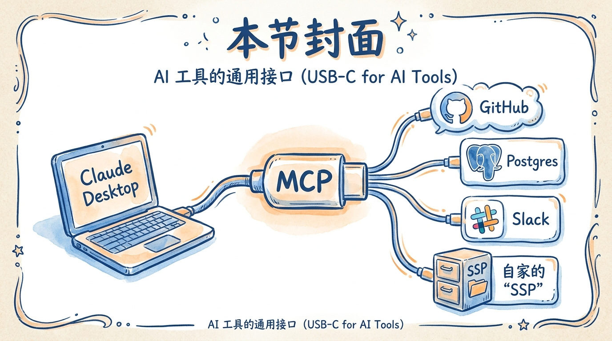
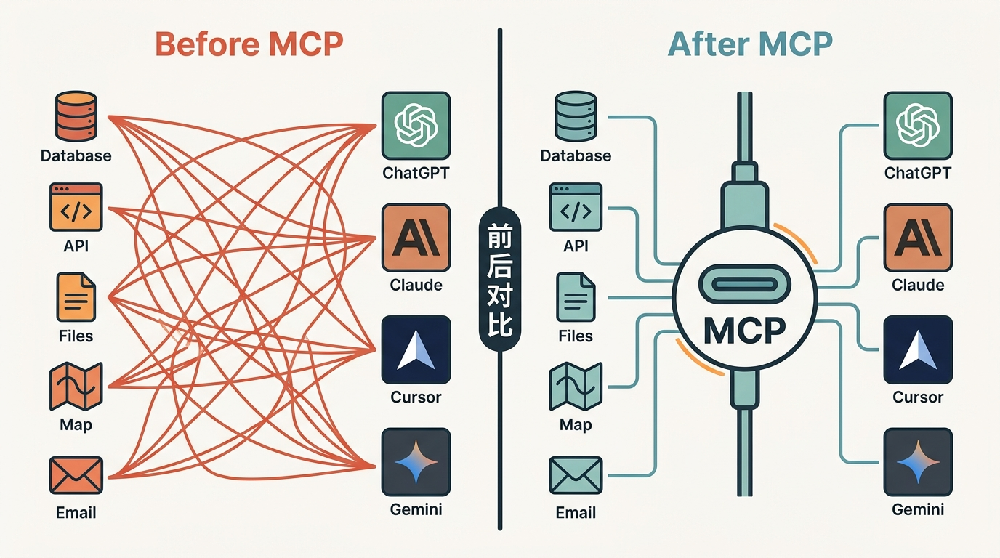
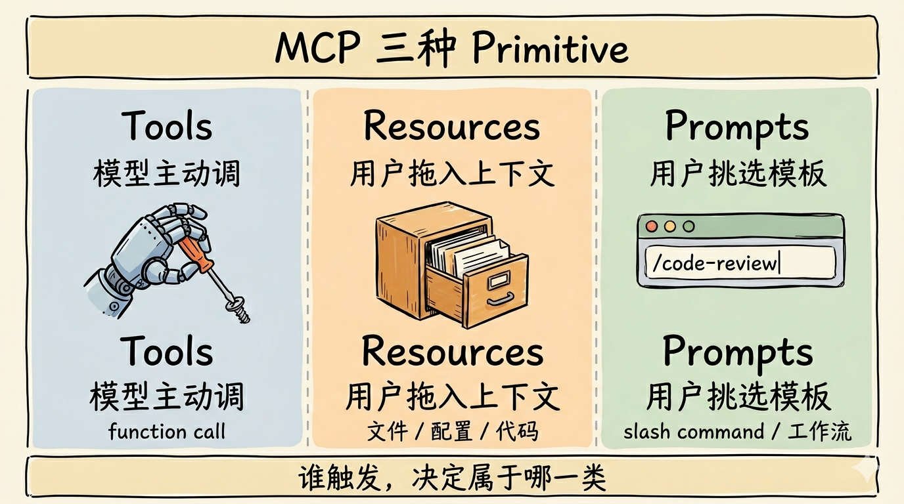
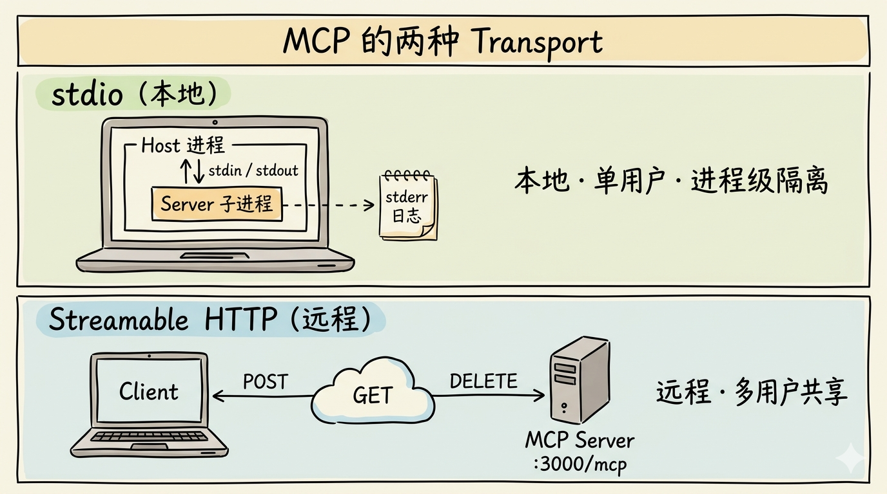
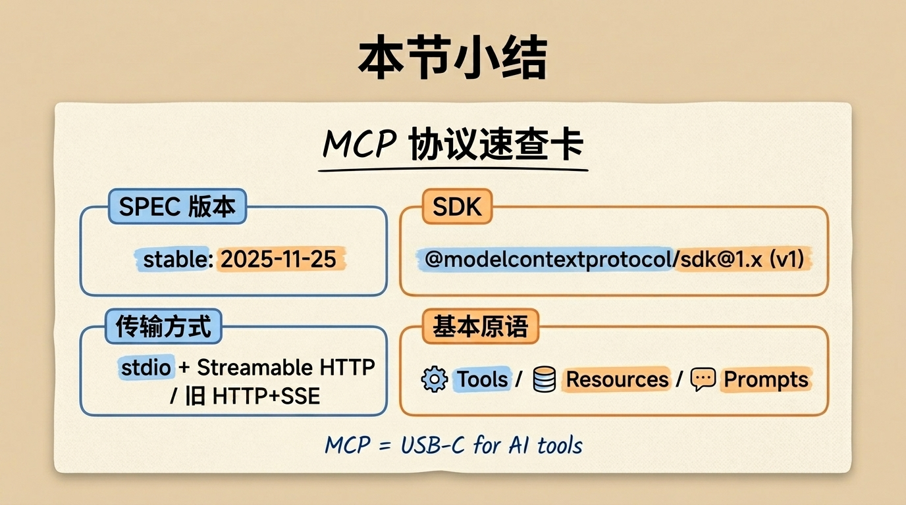

# 第 24 节 · MCP 协议拆解：让工具变成可共享服务



<!-- 图片说明（给图片代理）：
风格：手绘风格信息图
内容：画面中央是一个 USB-C 接口的卡通图，上面写着 "MCP"。
  接口左边是一台笔记本电脑（标"Claude Desktop"）通过线连过来。
  接口右边分出 4 条线，分别连到 4 个不同形状的盒子：
    - 盒子 1：GitHub 八爪鱼图标
    - 盒子 2：Postgres 大象图标
    - 盒子 3：文件柜图标
    - 盒子 4：自家的"SSP" 文件柜图标
  最下方一行小字："USB-C for AI Tools"
  整体配色：米色背景 + 蓝色线条 + 橙色高亮
-->

> **预计时长**：阅读 30 分钟 / 实战 45 分钟
> **前置知识**：[第 11 节《Tool Calling 协议：LLM 从来不执行代码》](./12-tool-calling.md)、[第 13 节《三个工具的编排策略：何时调、谁先谁后》](./14-tool-orchestration.md)
> **本节代码**：本节以协议讲解为主，下一节进入实战编码（`chapter-24` tag）
> **知识地图**：对应知识领域「MCP」（见 [knowledge-map.md](./knowledge-map.md)）

那天有个朋友在群里发了张截图，三个 Agent 应用并排开着——Claude Desktop、Cursor 编辑器、ChatGPT 网页。

每一个里都装了 GitHub 工具：能列 PR、能改 issue、能查 commit。

「同一套 GitHub 接口，」他在群里发牢骚，「我得在 Claude 里写一遍，在 Cursor 里写一遍，在 ChatGPT 里再写一遍。**为什么不能共享？**」

我看了一眼截图就笑了——他三个里其实**都装的是同一个 MCP server**。Anthropic、OpenAI、Cursor 团队都已经达成默契：工具的描述协议是 MCP，谁来调都行。

但他没意识到这件事。因为这种「跨厂商工具协议」对很多人来说还是个新概念。我们在前面 11、12、13 节讲了 Tool Calling——LLM 怎么决定调用工具、参数怎么序列化、结果怎么回填。那一层是模型和应用之间的契约。

这一节要讲的是**再往外**一层：**工具自己怎么对外发布**？怎么让 OpenAI、Anthropic、Cursor、Claude Code 都能以同一种方式接入你的工具？答案就是 MCP（Model Context Protocol，模型上下文协议）。

> **划重点**：MCP **不是** OpenAI Function Calling 的替代。它是工具的**标准化共享层**——让工具脱离单一 Agent，变成生态里随便谁都能调的服务。

---

## 一、知识铺垫：MCP 是什么、为什么会有它

### 1.1 一个简单类比：USB-C for tools

Anthropic 在 2024 年 11 月发布 MCP 时，官方用了一个很形象的类比：**MCP 之于 AI 工具，就像 USB-C 之于电子设备**。

USB-C 出现之前，每家厂商都有自己的接口——苹果的 Lightning、安卓的 microUSB、相机的 mini-USB……你买一个新设备就得配一根新线。USB-C 之后，一根线接所有东西：手机、电脑、显示器、移动硬盘。

AI 工具圈过去几年也是这样的乱象——OpenAI 有自己的 Function Calling，Anthropic 有自己的 Tool Use，Cursor、VS Code Copilot 各有各的接入规范。每个工具的开发者都得给每个 Host 写一遍适配。**写一次，全平台用**这件事，在 2024 年之前是不存在的。MCP 出现就是为了把它变成可能。



<!-- 图片说明（给图片代理）：
风格：信息图风格，左右对比
左半部分（标"Before MCP"）：5 个工具图标各自连到 4 个不同的 Host 图标，画面凌乱，连线交叉成网。
右半部分（标"After MCP"）：5 个工具先连到中央一个 USB-C 形状的"MCP"枢纽，再从枢纽连到 4 个 Host。线条清爽。
配色：左侧用红色/橙色暖色调表示混乱，右侧用蓝色/绿色冷色调表示秩序。
中间一根分割线，标注"前后对比"。
-->

### 1.2 MCP 的设计动机

MCP 的核心问题不是「LLM 怎么调工具」——这个 OpenAI 在 2023 年用 Function Calling 已经解决了。MCP 的核心问题是**「工具怎么发布给所有 LLM 用」**。它要解决三件事：

**第一，让工具有「服务身份」**。一个 MCP server 是独立进程或服务，有自己的版本、依赖、鉴权。它不再寄生在某个 Agent 应用的代码库里，而是能独立运行、被任意 client 连接的实体。

**第二，让 client 能「自助发现」能力**。Client 一连上 server，就能列出「你提供哪些 tool / resource / prompt」，不需要 client 端硬编码工具列表。

**第三，让协议「跨厂商」**。OpenAI 的 GPT、Anthropic 的 Claude、Google 的 Gemini，都能用同一个 MCP server——前提是 host 实现了 MCP client。这一点和 LSP（Language Server Protocol）不绑定某家编辑器是同样的思路。

### 1.3 治理与生态归属

MCP 由 Anthropic 在 2024-11-05 开源发布。截至本节核实，spec 页脚版权已署名 **"Model Context Protocol a Series of LF Projects, LLC."**——即由 Linux Foundation 系托管，治理结构、工作组与 SDK 分级制度都已正式化。这意味着它正在变成行业事实标准，类似 LSP 不属于 Microsoft。

> **小提醒**：很多人会把 MCP 和 Tool Calling 弄混。简单记一句话：**Tool Calling 是模型和应用之间的协议；MCP 是工具和应用之间的协议**。前者管「模型怎么调工具」，后者管「工具怎么发布给应用用」。

---

## 二、核心讲解

### 2.1 MCP spec 简史：当前 stable 是 2025-11-25

MCP 用**日期即版本号**（`YYYY-MM-DD`）。写代码之前先确认版本：当前 stable 是 `2025-11-25`，URL 是 [modelcontextprotocol.io/specification/2025-11-25](https://modelcontextprotocol.io/specification/2025-11-25)。

```
2024-11-05  ── 初版（HTTP+SSE 时代）
2025-03-26  ── 第二版（HTTP+SSE 被 Streamable HTTP 取代，旧 transport 标记 deprecated）
2025-06-18  ── Streamable HTTP 成熟；OAuth Resource Server 形式化
2025-11-25  ── 当前 stable，加 Tasks 实验性 primitive、工具命名指南等
2026-07-28  ── Release Candidate（官方计划发布日，写作时尚未落地）：stateless 核心、Extensions、MCP Apps、授权加固
```

`/specification/latest` 当前解析到 `2025-11-25`。我们后面写 server 时会显式声明协议版本（通过 `MCP-Protocol-Version` HTTP header），让 server 按目标版本响应。

`2025-11-25` 几个值得记住的变更：授权服务发现支持 OpenID Connect Discovery；tool / resource / prompt 可暴露 icons 元数据；新增**工具命名指南**（SEP-986）；新增 **URL elicitation**（让 server 弹浏览器走 OAuth / 付款）；Sampling 增加 tool calling 支持；引入实验性 **Tasks** primitive；并明确「输入校验错误应作为 Tool Execution Error 返回（`isError: true`），而非协议错误」，以便模型自我修正。

> **本节版本承诺**：本节和下一节所有代码都基于 spec `2025-11-25` + TypeScript SDK `@modelcontextprotocol/sdk`（生产推荐的 1.x 线）。官方明确：2.x stable 写作时尚未发布，1.x 仍是生产推荐版本，2.x 发布后 1.x 至少再维护 6 个月。**生产现在锁 1.x，别用 2.x alpha**。

### 2.2 协议骨架：JSON-RPC 2.0 + 状态化连接

MCP 在底层选了 **JSON-RPC 2.0**——不是 REST，不是 GraphQL，不是 gRPC。原因有三个：

**第一，工具调用的语义天然就是 RPC**：给一个名字（tool 名）传一组参数（input），等回一个结果。REST 那套资源 / 动词的抽象在这儿别扭。

**第二，JSON-RPC 支持双向通信**：传统 HTTP 是 client → server 单向，但 MCP 需要 server → client 也能主动发请求（比如 sampling、elicitation）。JSON-RPC 不依赖具体 transport，天然支持双向。

**第三，借鉴 LSP 的成熟经验**：LSP 几年前就用 JSON-RPC 解决了「编辑器和语言服务器跨进程通信」的问题，MCP 直接搬过来，省一遍设计成本。

协议里的四个核心角色：

| 角色 | 含义 |
|---|---|
| **Host** | 发起连接的 LLM 应用（Claude Desktop、Cursor、ChatGPT 等） |
| **Client** | Host 内部的连接器，与一个 Server 一一对应 |
| **Server** | 提供上下文与能力的进程 / 服务 |
| **Session** | 有状态连接；初始化时做**能力协商（capability negotiation）** |

握手流程：`initialize` 阶段 client 声明「我支持哪些 capability、用哪个 protocol version」，server 回「我支持这些 primitive」。协商完成后所有调用都跑在这个 session 里——这是 MCP **比 REST 工具调用更「重」**的地方，但也是它更「智能」的地方。

### 2.3 三大 server primitives：Tools / Resources / Prompts

MCP 把 server 能提供的能力归纳成**三种 primitive**，按**谁触发**区分：

| Primitive | 谁触发 | 典型用法 | JSON-RPC 方法 |
|---|---|---|---|
| **Tools** | LLM / 模型主动调 | 计算、查询、副作用、网络请求 | `tools/list`、`tools/call` |
| **Resources** | 用户或客户端 UI 决定 | 暴露只读数据，由 client 决定何时塞进上下文 | `resources/list`、`resources/read` |
| **Prompts** | 用户主动选 | 模板化对话 / 工作流入口（如 slash command） | `prompts/list`、`prompts/get` |



<!-- 图片说明（给图片代理）：
风格：手绘风格，三栏并列
内容：三个并排的卡通方块
  1. 左：Tools。图标 = 一只机械手在拧螺丝。文字"Model 主动调 / function call"
  2. 中：Resources。图标 = 一个文件柜的抽屉。文字"User 拖进上下文 / 文件、配置、代码"
  3. 右：Prompts。图标 = 一个搜索框里写着 "/code-review"。文字"User 选 slash command / 工作流模板"
底部一行小字："谁触发，决定属于哪一类"
配色：米色背景 + 蓝/橙/绿三色区分
-->

三个生活化例子帮你记住区别：

**Tools 例子：`get_weather(city)`**——模型在聊天里看到「今天北京天气怎么样」，自主决定调这个工具，传 `{ city: "Beijing" }`，拿到结果再翻译成人话。

**Resources 例子：`config://app/.env`**——server 把配置（脱敏后）暴露成 resource，用户在 Claude Desktop 里点「附加文件」拖进对话。模型看到的是「用户主动给的上下文」，不是「工具调用结果」。

**Prompts 例子：`/code-review`**——server 注册一个 slash command 模板，用户在编辑器里敲 `/` 触发，server 给出预设 System Prompt + 几条 example，把对话引导到代码审查的轨道上。

> **划重点**：三种 primitive 的本质区别是**触发者**。Tool 是模型自主调；Resource 是用户 / UI 决定塞；Prompt 是用户挑选模板。这一层弄清楚了，后面写 server 就不会迷茫。

我们在 SSP 项目里只用 Tools——因为 SSP 的工具（computePlan、updateProfile、validateField）都是模型自主调用的计算工具，不是用户主动塞的数据，也不是固定的对话模板。

#### 工具命名也有规范

`2025-11-25` spec 里加了一条**工具命名指南**（SEP-986，等级是 SHOULD）：用 `snake_case`、动宾或宾动结构、名字自解释、同 server 内不重复语义、name 与 description 都**写给模型看**。

几个反例与正例：

- ❌ `getData(type, id)` —— 太通用，模型不知道何时调
- ❌ `tool1(args)` —— 完全没有语义
- ✅ `compute_retirement_plan(profile)`
- ✅ `validate_birth_year(value)`

实践证明：**工具名起得好，模型选工具的准确率会显著上升**——这是模型选择 tool 的「嗅探信号」。

#### 工具返回结构

写 server 必记的返回结构：`{ content: [...], structuredContent?: {...}, isError?: boolean }`。`content` 给模型看（数组里可以混 `text` / `image` / `audio` / `resource` 多种 part），`structuredContent` 给 client UI 看的结构化数据。**两个一起填最稳**。

### 2.4 三大 client capabilities：Sampling / Roots / Elicitation

刚才讲的是 server 给 client 提供的能力。MCP 还有反方向的——**client 反过来给 server 提供的能力**：

| Capability | 含义 | 典型场景 |
|---|---|---|
| **Sampling** | Server 让 Host 用它的 LLM 跑一次 completion | Server 内部需要 AI 推理，不想自己付 API 费 |
| **Roots** | Server 询问 Client 它可操作哪些目录边界 | filesystem server 问「我能读哪些文件夹」 |
| **Elicitation** | Server 让 Client 向用户索要更多输入 | 「请输入 API key」「请确认这次操作」 |

举个 Sampling 的例子：你写了个 MCP server 叫 `summarize-pdf`，要把 PDF 摘要——你可以**让 Claude Desktop 帮它跑这次摘要**，不用 server 自己付 API 的钱。Server 通过 sampling 把「prompt + 用户的 PDF」发给 host，host 用内置模型跑 completion，结果回流给 server。

`2025-11-25` 在 Elicitation 上做了两个扩展：**URL Elicitation**（让 server 弹浏览器走 OAuth / 付款等敏感流程）和基础类型**默认值**支持。这些都是为了让 server 更优雅地索要用户输入，不用把所有 prompt 硬塞进 tool description。

### 2.5 Tasks：实验性的「call-now / fetch-later」

`2025-11-25` 引入了新 primitive **Tasks**（SEP-1686，目前 experimental），目标是解决「长任务怎么办」——传统 Tool Calling 是同步的，工具跑 5 分钟模型就超时了。

Tasks 的方案是 **call-now / fetch-later**：① server 声明 `tasks` capability；② client 调 tool 时附 task 元数据，server 返回 `taskId`（不是结果）；③ client 后续用 `taskId` 轮询，或断线重连后 resume 拿结果。任务有 5 个状态：`working` / `input_required` / `completed` / `failed` / `cancelled`。

这对部署到 Vercel（Hobby 计划 10s 超时）这种场景特别有意义。⚠️ Tasks 当前是 experimental，**生产请慎用**。我们 SSP 的工具都是同步的（计算 < 1s），不需要 Tasks。

### 2.6 Transport 二选一：stdio vs Streamable HTTP

MCP 现在只有**两种官方 transport**——stdio 和 Streamable HTTP。

⚠️ 老博客里你可能还会看到「HTTP+SSE」transport——**那个已经在 2025-03-26 spec 起被 deprecated**，仅作向后兼容保留，新写的 server 不要用了。

| Transport | 部署形态 | 通信方式 | 适合场景 |
|---|---|---|---|
| **stdio** | Client 把 server 当子进程 | stdin/stdout JSON-RPC，stderr 日志 | 本地工具，per-user 单实例 |
| **Streamable HTTP** | 独立 HTTP server | 单 endpoint，POST/GET/DELETE | 远程工具，多用户共享 |



<!-- 图片说明（给图片代理）：
风格：信息图风格，上下两块
上半部分（stdio）：一台笔记本里一个大的 Host 进程框，框里又分出一个小的 server 子进程框，二者用箭头标 stdin/stdout 双向连接。右侧标"本地，单用户，进程级隔离"
下半部分（Streamable HTTP）：一台笔记本（标"Client"）通过云图标连到一个远程服务器（标"MCP Server :3000/mcp"）。连线上标 POST / GET / DELETE。右侧标"远程，多用户共享"
配色：上半绿色（本地安全），下半蓝色（云端服务）
-->

#### stdio（本地推荐）

Client 把 server 当子进程启动，通过标准输入输出交换 JSON-RPC：每条消息一行，**不能内嵌换行**。`stdout` **只能有 JSON-RPC 消息**，所有日志走 `stderr`（`2025-11-25` 明确 stderr 可用于所有日志类型）。好处是**零网络开销 + 进程级隔离**——每个用户跑自己的 server 进程，崩溃只影响自己。

#### Streamable HTTP（远程推荐）

**单一 HTTP endpoint**（如 `https://example.com/mcp`），同时支持三种 HTTP 方法：

| 客户端动作 | Accept | 服务端可能响应 |
|---|---|---|
| `POST` JSON-RPC request | `application/json, text/event-stream` | `200 + JSON`（一次性）或 `200 + SSE`（升级流） |
| `POST` notification/response | - | `202 Accepted`，no body |
| `GET` | `text/event-stream` | 打开 server-to-client SSE 通道 |
| `DELETE` + `MCP-Session-Id` | - | 显式终止 session |

> **看这里 →**：单 endpoint 同时支持 POST/GET/DELETE 是 Streamable HTTP 的精髓。它不再有「消息 endpoint」和「SSE endpoint」两个 URL，全部走一个 `/mcp`。

### 2.7 Streamable HTTP 关键 header 与安全

写远程 MCP server 必须知道这三个 header：

| Header | 谁设置 | 作用 |
|---|---|---|
| `MCP-Session-Id` | server init 时下发 | 客户端后续每次请求都要带，标识 session |
| `MCP-Protocol-Version` | client 请求时带 | 例如 `2025-11-25`，告诉 server 按这个版本响应 |
| `Origin` | 浏览器自动带 | server **必须**校验，非法返回 **403** |

`Origin` 校验是为了**防 DNS rebinding 攻击**——本地跑的 MCP server 可能被恶意网页通过 DNS 重绑定接管。`2025-11-25` 明确：Streamable HTTP 对非法 `Origin` header 必须返回 HTTP 403 Forbidden。

**Resumability（断线重连）**：SSE 事件带全局唯一 `id`，client 断线后重连带 `Last-Event-ID` header，server 把未送达消息重放出来。这是 Streamable HTTP 比老 HTTP+SSE 优秀的核心点之一。一条完整的 POST 请求长这样：

```
POST /mcp
Accept: application/json, text/event-stream
MCP-Session-Id: 7c4e8d10-...
MCP-Protocol-Version: 2025-11-25
Origin: https://my-host.com
Content-Type: application/json

{"jsonrpc":"2.0","id":1,"method":"tools/list","params":{}}
```

### 2.8 SDK 版本：1.x stable 是当前选择

⚠️ 写代码前最后的版本说明：

| 包 | 状态 | 推荐 |
|---|---|---|
| `@modelcontextprotocol/sdk`（1.x 线） | **生产 stable** | ✅ 本节 / 生产 |
| `@modelcontextprotocol/server` / `@modelcontextprotocol/client`（2.x） | pre-alpha | ❌ 生产慎用 |
| `mcp`（Python，1.27.x） | 官方 stable | ✅ Python 项目 |
| `fastmcp`（Python，3.x） | 第三方流行 | 二选一 |

**1.x 与 2.x 的关键区别**：1.x 是单包 `@modelcontextprotocol/sdk`，子路径导入（`/server/mcp.js`、`/client/streamableHttp.js`），校验靠 `zod`；2.x 拆成 server 和 client 两个独立包，改用 [Standard Schema](https://standardschema.dev/)（zod / valibot / arktype 都行），加了 middleware 包。2.x stable 写作时尚未发布，发布后 1.x 至少再维护 6 个月。**生产现在锁 MCP SDK 1.x**。

### 2.9 MCP vs A2A：解决的不是同一个问题

经常有人问：「MCP 和 Google 的 A2A（Agent to Agent，代理协议）是不是竞争关系？」答案是：**互补，不竞争**。

| 维度 | MCP | A2A |
|---|---|---|
| 范围 | **垂直**：单个 Agent ↔ 工具 / 数据 | **水平**：Agent ↔ Agent |
| 类比 | "USB-C for tools" | "HTTP for agents" |
| 单元 | tool / resource / prompt | agent card / task / message |
| 提出方 | Anthropic（2024.11） | Google（2025.04） |

**典型架构是组合的**：`Planner Agent ──A2A──> Domain Agent ──MCP──> 数据库 / 外部 API`。A2A 把多个组织的 Agent 连起来（跨组织协作）；MCP 让每个 Agent 各自连自己的工具（内部能力）。本节不展开 A2A——我们在第 27 节《多 Agent 协作模式》里专门讲。

### 2.10 MCP vs Function Calling：两层正交

很多人第一次接触 MCP 会问：「我已经有 OpenAI Function Calling 了，为什么还要 MCP？」这是把两层混在一起了：

| 维度 | OpenAI / Anthropic 原生 tool use | MCP |
|---|---|---|
| 协议范围 | 单 provider 内 | **跨 provider / 跨进程** |
| 颗粒 | 一次 API call 内传 tool schema | 持久连接，server 暴露能力 |
| 扩展面 | 仅 functions | tools + resources + prompts + sampling + elicitation + tasks |
| 鉴权 | 在你的 API key 范围内 | 独立 OAuth 2.1 / DCR / CIMD |
| 复用 | 每个 host 单写 adapter | **写一次 server，所有 client 通用** |

> **划重点**：Function Calling 是「模型怎么调这个工具」，MCP 是「这个工具怎么对外发布」。两层正交，可以同时存在。实际上 **MCP server 内部往往还是用 Function Calling 的语义来定义工具**（zod schema + execute），外面再裹一层 MCP 协议发布出去——MCP server 是工具的「发布层」，Function Calling 是工具的「调用语义层」。

### 2.11 生态现状：哪些 client 已经支持 MCP

截至本节核实，主流 AI 应用基本都已经是 MCP client（来自 [modelcontextprotocol.io/clients](https://modelcontextprotocol.io/clients) 的精选）：

| 客户端 | 支持的 MCP 能力 |
|---|---|
| **Claude Desktop** / Claude.ai | Resources, Prompts, Tools, Apps, DCR |
| **Claude Code** | Resources, Prompts, Tools, Roots, Elicitation（**还能反过来当 server**） |
| **ChatGPT** / **Codex**（OpenAI） | Tools, Apps, DCR / Resources, Tools, Elicitation |
| **Cursor** | Prompts, Tools, Roots, Elicitation, DCR |
| **VS Code Copilot Chat** | 通过 `mcp.json` 接入 |
| **Continue / Cline / JetBrains AI / Gemini CLI / Amazon Q** | Tools 等 |

注意 **Claude Code 双向**——它既是 client（能调别的 server），又能当 server 暴露给别的工具调。「Agent 互相做对方的 MCP server」是 2026 年很有意思的趋势。

#### 现成的 reference server 与避坑

官方 reference servers 精选：`server-everything`（测试，覆盖全 primitive）、`server-filesystem`（文件读写）、`server-memory`（持久记忆）、`mcp-server-fetch`（抓网页转 markdown）、`mcp-server-git`、`mcp-server-time`。

⚠️ 一个**反例**：很多老博客引用的 `server-github`、`server-postgres`、`server-slack` 已经迁到 [servers-archived](https://github.com/modelcontextprotocol/servers-archived) 不再维护，GitHub 现在推荐用其官方实现。社区聚合站点有 [官方 registry](https://registry.modelcontextprotocol.io)、Smithery、PulseMCP、glama.ai。关于 registry 里有多少个 server，二手统计给出的区间从八千到五万多不等（口径不同、未在官方一手源直接确认），仅作「生态规模感」参考，别当确定事实引用。

---

## 三、举一反三

理解了 MCP 的设计逻辑，你就能看出**「领域工具能不能跨 Agent 共享」**这件事在不同领域的潜力。

**比如要做一个医疗 Agent**，核心工具可能是 `look_up_drug_interaction(drug_a, drug_b)`、`get_patient_history(patient_id)`（带 PII 鉴权）、`compute_dosage(weight_kg, age, drug)`。把这三个工具变成一个 MCP server 发布，**任何接 MCP 的 AI 应用——Claude Desktop、Cursor、ChatGPT——都能立刻用上**，不用每个平台都接一遍。

**比如要做一个法律咨询 Agent**，工具集是 `search_case_law(query, jurisdiction)`、`analyze_contract_clause(text)`、`compute_litigation_odds(facts)`。发布成 MCP server 后，所有合作律所可以**直接在内部 Agent 平台接入**，鉴权用 OAuth 2.1 + 律所域名的 access token——你不需要为每家所写一遍接入代码。

**关键原则**：**领域知识 + 工具实现 = 一个 MCP server**。一旦封装好，就是一个能被任意 host 调用的「服务」，从此再也不用为每个 Agent 平台重复劳动。

> **划重点**：MCP 把「工具」从某个 Agent 应用里**解耦**出来，变成独立的、可复用的、可买卖的服务。下一个十年的 AI 工具市场不是按「Cursor 插件 vs Claude 插件」分的，是按「MCP server 名字」分的。

---

## 四、小结

这一节我们把 MCP 协议从底层逻辑到生态现状过了一遍：**MCP 是 USB-C for AI tools**，一个让工具能跨 Agent 共享的标准协议；当前 spec 是 `2025-11-25` stable，TypeScript SDK 用 1.x 线，不要碰 2.x alpha；三种 server primitive（Tools / Resources / Prompts）按触发者区分；三种 client capability（Sampling / Roots / Elicitation）反向赋能 server；transport 只剩 stdio + Streamable HTTP；MCP 解 "agent ↔ tool"、A2A 解 "agent ↔ agent"、Function Calling 解 "model ↔ tool API"，三层正交。

下一节我们就把 SSP 的三个工具改造成一个 MCP server，让 Cursor、Claude Code 都能直接调用。



<!-- 图片说明（给图片代理）：
风格：手绘风格小结卡片
内容：标题"MCP 协议速查卡"，分四块：
  左上：spec 版本框，写"stable: 2025-11-25"
  右上：SDK 框，写"@modelcontextprotocol/sdk 1.x 线"
  左下：transport 框，写"stdio + Streamable HTTP"（旧 HTTP+SSE 划掉）
  右下：primitives 框，写"Tools / Resources / Prompts"
底部签名："MCP = USB-C for AI tools"
配色：米色背景 + 蓝橙双色高亮
-->

**核心要点回顾**：

- ✅ MCP（模型上下文协议）= 工具的标准化共享层，`2025-11-25` 是当前 stable，治理由 Linux Foundation 系托管
- ✅ 协议骨架是 JSON-RPC 2.0 + 状态化 session + 能力协商
- ✅ 三种 server primitive 按触发者区分：Tool 模型调 / Resource 用户拖 / Prompt 用户选
- ✅ 三种 client capability：Sampling / Roots / Elicitation
- ✅ Transport 只剩 stdio + Streamable HTTP，旧 HTTP+SSE 已 deprecated；远程必须校验 Origin（防 DNS rebinding）
- ✅ TypeScript SDK 锁 1.x 线，别用 2.x alpha
- ✅ MCP vs A2A：垂直 vs 水平，互补不冲突；MCP vs Function Calling：发布层 vs 调用层，两层正交

---

## 思考题

1. **【开放题】**：MCP 会成为 AI 工具领域的 "USB-C" 吗？想想 USB-C 普及花了多少年、有哪些前提（操作系统、芯片、配件厂商集体配合）。MCP 在哪些方面已经具备 USB-C 的特征，又在哪些方面还差很远？写一段你的分析。
2. **【动手题】**：用 Inspector 连一个公共 MCP server，看它暴露了哪些 tool。验收标准：① 在终端运行 `npx @modelcontextprotocol/inspector npx -y @modelcontextprotocol/server-filesystem /tmp`；② 浏览器访问 `http://localhost:6274`；③ 在 UI 里点击 "List Tools"，截图保存 `read_file` 工具的完整 schema（含 description 和 inputSchema）；④（加分）调用一次 `list_directory`，参数 `/tmp`，看返回结果。
3. **【选做】**：阅读 [MCP spec 2025-11-25 的 Transports 章节](https://modelcontextprotocol.io/specification/2025-11-25/basic/transports)，画出 Streamable HTTP 完整握手时序图（init → tools/list → tools/call → close）。要求标注每条消息的 method、headers（特别是 `MCP-Session-Id`）、HTTP status。

---

## 面试题

**Q1.【基础】【主题：MCP】** 都已经有 OpenAI Function Calling 了，为什么还需要 MCP？请说明二者各自解决什么问题，以及它们为什么是「正交、可同时存在」的关系。
<details><summary>参考解答</summary>

二者不在同一层，解决不同问题：

- **Function Calling** 解决「**模型怎么调这个工具**」——在一次 API call 内，把 tool schema 传给模型，模型输出调用意图（tool name + 参数），服务端执行。范围限单个 provider 内。
- **MCP** 解决「**这个工具怎么对外发布**」——把工具做成独立进程 / 服务（有自己的版本、依赖、鉴权），通过持久连接暴露能力，任意支持 MCP 的 host（OpenAI / Anthropic / Cursor / Claude Code）都能连上复用。

对照差异：协议范围（单 provider vs 跨 provider / 跨进程）、颗粒（一次 call vs 持久连接）、扩展面（仅 functions vs tools + resources + prompts + sampling + elicitation + tasks）、鉴权（API key 范围 vs 独立 OAuth 2.1 / DCR）、复用（每个 host 单写 adapter vs 写一次 server 所有 client 通用）。

为什么正交可共存：实际上 **MCP server 内部往往还是用 Function Calling 的语义来定义工具**（zod schema + execute 函数），外面再裹一层 MCP 协议发布出去。Function Calling 是「调用语义层」，MCP 是「发布层」，两层叠在一起用，不互相替代。

</details>

**Q2.【进阶】【主题：MCP】** MCP 的三种 server primitive 是什么？区分它们的关键维度是什么？再说明工具调用的返回结构里 `content`、`structuredContent`、`isError` 各自的作用。
<details><summary>参考解答</summary>

三种 server primitive 及区分维度——关键是**谁触发**：

| Primitive | 触发者 | 用法 |
|---|---|---|
| **Tools** | LLM / 模型主动调 | 计算、查询、副作用（`tools/list`、`tools/call`） |
| **Resources** | 用户 / client UI 决定 | 暴露只读数据，由 client 决定何时塞进上下文 |
| **Prompts** | 用户主动选 | 模板化对话入口，如 slash command |

例子：`get_weather` 是 Tool（模型自主调）；脱敏后的 `.env` 暴露成 Resource（用户拖进上下文）；`/code-review` 是 Prompt（用户敲 `/` 选）。SSP 项目只用 Tools，因为它的三个工具都是模型自主调用的计算工具。

工具返回结构 `{ content, structuredContent?, isError? }`：

- `content`：**给模型看**的内容，数组可混 `text` / `image` / `audio` / `resource` 多种 part——这是 LLM 实际读到的。
- `structuredContent`：**给 client UI 看**的结构化数据，便于做卡片渲染。
- `isError`：布尔标志。工具级错误时返回 `{ isError: true, content: [...] }`，而不是抛协议异常——这样 client 拿到错误能继续多步循环，不会让整个 Agent 卡死。

实践上 `content` 与 `structuredContent` 两个一起填最稳。

</details>

**Q3.【深挖】【主题：MCP】** MCP 现在有哪两种官方 transport？分别适合什么场景？写一个远程 Streamable HTTP server 时，有哪三个关键 header 必须处理，其中 `Origin` 校验防的是什么攻击？断线重连（resumability）又是怎么实现的？
<details><summary>参考解答</summary>

**两种官方 transport**（老的 HTTP+SSE 自 2025-03-26 起已 deprecated）：

- **stdio**：client 把 server 当子进程拉起，stdin/stdout 逐行交换 JSON-RPC，stderr 走日志。适合**本地工具、per-user 单实例**，零网络开销 + 进程级隔离。注意 stdout 只能有 JSON-RPC 消息，日志必须走 stderr。
- **Streamable HTTP**：独立 HTTP server，单一 endpoint（如 `/mcp`）同时支持 POST/GET/DELETE。适合**远程工具、多用户共享**。

三个关键 header：

1. `MCP-Session-Id`：server 在 init 时下发，客户端之后每次请求都要带，标识 session。
2. `MCP-Protocol-Version`：client 请求时带（如 `2025-11-25`），让 server 按对应版本响应。
3. `Origin`：浏览器自动带，server **必须校验**，非法返回 **403 Forbidden**。

`Origin` 校验防的是 **DNS rebinding 攻击**——本地跑的 MCP server 可能被恶意网页通过 DNS 重绑定接管，校验 Origin 能挡住这类来自非信任来源的请求。

**resumability（断线重连）**：Streamable HTTP 的 SSE 事件带全局唯一 `id`，client 断线后重连时带上 `Last-Event-ID` header，server 据此把未送达的消息重放出来。这是它相对老 HTTP+SSE transport 的核心优势之一。生产部署远程 server 时，除了这三个 header，还应加鉴权（Bearer / OAuth 2.1）和限流。

</details>

---

## 延伸阅读

- [MCP 官方 spec 2025-11-25](https://modelcontextprotocol.io/specification/2025-11-25)：协议本体，权威来源
- [MCP Transports 规范](https://modelcontextprotocol.io/specification/2025-11-25/basic/transports)：stdio / Streamable HTTP 细节
- [Anthropic MCP 公告原文](https://www.anthropic.com/news/model-context-protocol)：2024-11-05 首发，理解动机
- [Auth0 — MCP vs A2A](https://auth0.com/blog/mcp-vs-a2a/)：两种协议的对比解读
- [Inspector GitHub](https://github.com/modelcontextprotocol/inspector)：调试 MCP server 的瑞士军刀

---

[← 上一节：第 23 节 回归测试与 CI 门禁：让 Agent 不变蠢](./24-regression-testing.md) · [📚 目录](./README.md) · [下一节：第 25 节 MCP 实战：把 SSP 工具变成 MCP Server →](./26-mcp-in-practice.md)
