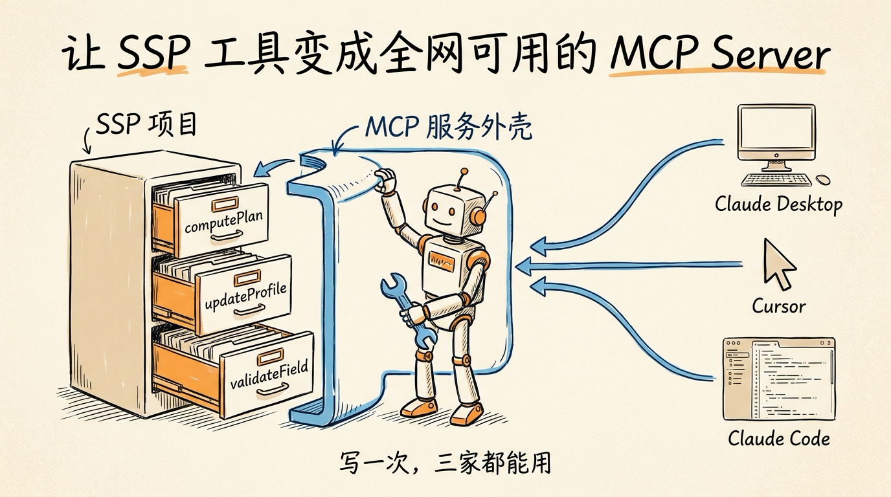
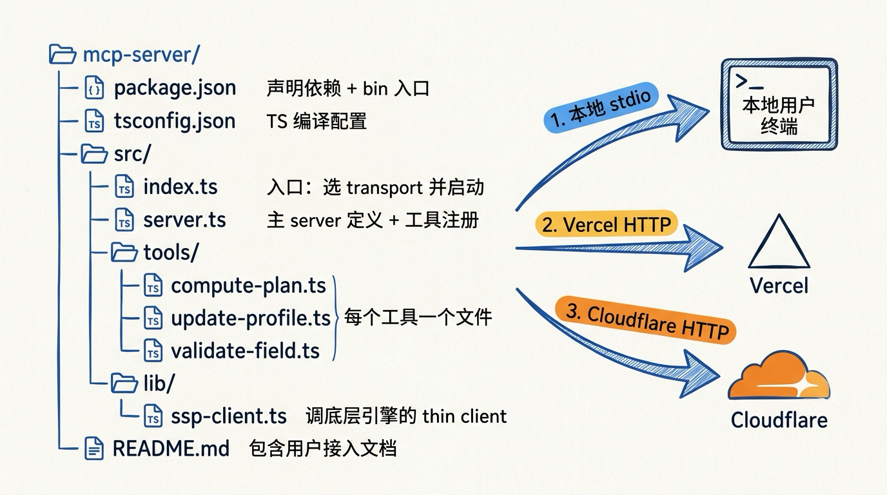
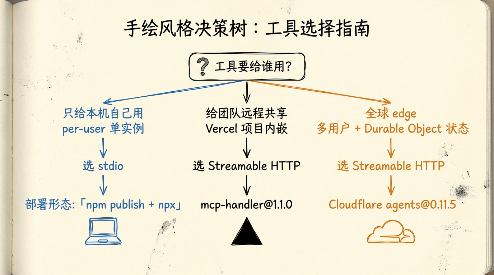
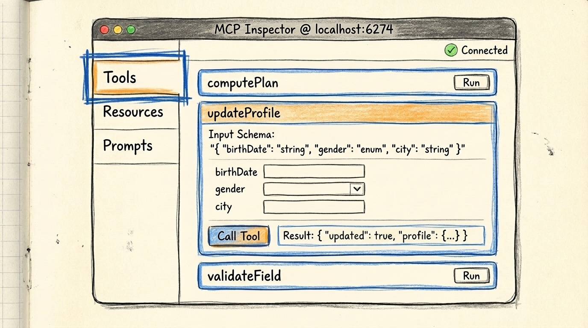
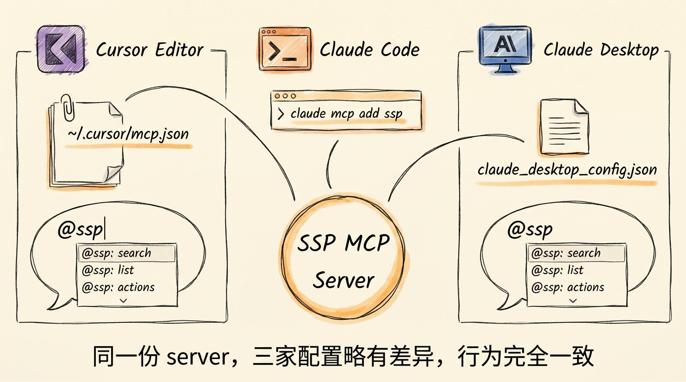
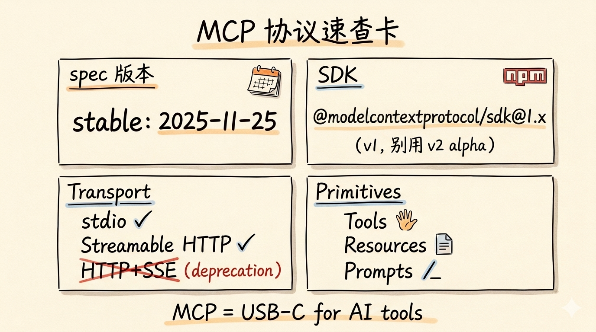

# 第 25 节 · MCP 实战：把 SSP 工具变成 MCP Server



<!-- 图片说明（给图片代理）：
风格：手绘风格信息图
内容：画面左侧是 SSP 项目的文件柜（标"computePlan / updateProfile / validateField"三个抽屉）。
中间画一个机器人挥着扳手在改造文件柜——把抽屉外面套上一个 MCP 服务器外壳。
右侧画三台不同的客户端：Claude Desktop、Cursor、Claude Code，三条线连进来取工具用。
顶部标题："让 SSP 工具变成全网可用的 MCP Server"
底部小字："写一次，三家都能用"
配色：米色背景 + 橙色高亮 + 蓝色细节
-->

> **预计时长**：阅读 35 分钟 / 实战 90 分钟
> **前置知识**：[第 24 节《MCP 协议拆解》](./25-mcp-protocol.md)、[第 13 节《三个工具的编排策略》](./14-tool-orchestration.md)、对 Node.js / TypeScript 有基础了解
> **本节代码**：`ssp-web` 仓库 `chapter-25` tag · 主要文件 `mcp-server/`、`src/lib/mcp/client.ts`（本节新增）
> **知识地图**：对应知识领域「MCP」「Tool Calling 协议」（见 [knowledge-map.md](./knowledge-map.md)）

朋友前两天半夜发我消息：「你们 SSP 那个算社保的工具太好用了。我用 Cursor 写代码时经常要算政策——能不能让 Cursor 直接调？」

我看了一眼时间，凌晨一点，他还在加班。

「能。把 computePlan 改成 MCP（Model Context Protocol，模型上下文协议）server，Cursor 自动认。」

「需要改多少代码？」

「不到 50 行。」

第二天我把改造完的 server 发给他，他在 Cursor 的配置文件里加了三行，重启 Cursor，就能在写代码时直接「@ ssp」让 Claude 帮他算小赵那种「1975 年女性、工人岗」的退休方案了。

这一节就是要把这件事讲清楚——**怎么把一个已经跑得好好的 Agent 工具，改造成所有 MCP 客户端都能用的服务**。跟着做完，你能：① 把 SSP 三个工具暴露成 MCP server；② 用 Inspector 在本地调通；③ 部署到 Vercel / Cloudflare 让别人远程调；④ 让 ssp-web 自己同时也是 MCP client；⑤ 让 Cursor / Claude Code 接进来用。

---

## 一、知识铺垫：MCP server 的最小工程结构

写 MCP server 之前先搞清楚它的**工程形态**。一个生产级 MCP server 项目结构大致是这样：

```
mcp-server/
├── package.json              # 声明依赖 + bin 入口
├── tsconfig.json             # TS 编译配置
├── src/
│   ├── index.ts              # 入口：选 transport + 启动
│   ├── server.ts             # 主 server 定义 + 工具注册
│   ├── tools/                # 每个工具一个文件
│   │   ├── compute-plan.ts
│   │   ├── update-profile.ts
│   │   └── validate-field.ts
│   └── lib/
│       └── ssp-client.ts     # 调底层引擎的 thin client
└── README.md                 # 包含用户接入文档
```

为什么单独建一个 `mcp-server/` 目录而不是塞进 `ssp-web` 主项目？两个原因：**独立发布**——MCP server 通常以 npm 包形式发布，用户用 `npx` 直接跑，不需要 clone 整个 web 项目；**部署形态不同**——Web 项目跑在 Vercel serverless，MCP server 可能跑在用户本地（stdio）、Cloudflare Workers 或 Vercel Function（Streamable HTTP），各跑各的。



<!-- 图片说明（给图片代理）：
风格：信息图风格，文件夹树状图
内容：左侧是文件夹层级树，每个文件后面跟一句话说明。
右侧画三个箭头分出三种部署形态：
  1. 本地 stdio：箭头指向"本地用户终端"
  2. Vercel HTTP：箭头指向 Vercel logo
  3. Cloudflare HTTP：箭头指向 Cloudflare logo
配色：米色背景 + 蓝色目录树 + 三色部署标签
-->

> **小提醒**：如果你只想让自家产品（如 ssp-web）内部接 MCP，不发布给外人用，**也可以把 MCP server 内嵌**到 web 项目，作为一条 API route——下面 2.4 节会演示 Vercel Route Handler 写法。两种形态各有合理性，按需求选。

---

## 二、核心讲解

### 2.1 用 SDK 写一个最小 MCP Server

先把版本钉死。安装 MCP TypeScript SDK 的生产推荐版本（1.x 线）和 zod 4（与 ssp-web 主项目 `^4.3.6` 一致）：

```bash
mkdir mcp-server-ssp && cd mcp-server-ssp
npm init -y
npm install @modelcontextprotocol/sdk zod
npm install -D typescript tsx
```

> 回顾上一节：MCP SDK 用生产推荐的 1.x 线，**不要用 2.x alpha**（它是 `@modelcontextprotocol/server` / `@modelcontextprotocol/client` 分包，API 还不稳定）。

写最小 server（`src/server.ts`）：

```typescript
// mcp-server-ssp/src/server.ts （示意，非项目实际代码）
import { McpServer } from '@modelcontextprotocol/sdk/server/mcp.js';

export function createSspMcpServer() {
  const server = new McpServer({ name: 'ssp-mcp', version: '1.0.0' });

  server.registerTool(
    'health',
    { title: 'Health Check', description: 'Verify the SSP MCP server is alive.', inputSchema: {} },
    async () => ({ content: [{ type: 'text', text: 'ok' }] }),
  );

  return server;
}
```

> **看这里 →**：`McpServer` 用 `registerTool(name, schema, handler)` 注册工具。schema 里 `inputSchema` 是 zod shape（不是 `z.object(...)` 包裹后的——SDK 会内部包）。返回必须是 `{ content: [...] }`。

入口（`src/index.ts`）选 stdio transport：

```typescript
// mcp-server-ssp/src/index.ts （示意，非项目实际代码）
import { StdioServerTransport } from '@modelcontextprotocol/sdk/server/stdio.js';
import { createSspMcpServer } from './server.js';

const server = createSspMcpServer();
await server.connect(new StdioServerTransport());
```

启动 `npx tsx src/index.ts` 后**没有任何 console 输出**是正常的——所有日志要往 stderr 走，stdout 必须只有 JSON-RPC 消息。这是 MCP 的硬规定。

### 2.2 改造 SSP 三个工具

回到我们要做的事——把 ssp-web 的三个工具暴露成 MCP tool。先看源项目的工具定义（来自第 13 节，真实源码在 `src/lib/ai/tools.ts`）：

```typescript
// src/lib/ai/tools.ts:174-266 (ssp-web 主项目，真实代码)
export const computePlanTool = tool({
  description: '调用社保规则引擎，根据用户参数计算社保规划方案……',
  inputSchema: zodSchema(z.object({ basic: z.object({/* ... */}), /* social/status/... */ })),
  execute: computePlanExecute,  // 内部调 orchestrate({ user })
});
```

这是 AI SDK v6 的 `tool()` 形态——跑在 ssp-web 服务进程里，被 Vercel AI SDK 调用。

**MCP 改造的关键认知：内部 `execute` 逻辑不变，只是把 schema + execute 重新用 MCP SDK 注册，外面包一层协议**。

#### 2.2.1 重写 computePlan

先把入参 schema 定义出来（用 zod shape，结构对齐源项目的嵌套 `basic` / `social` / `objective`）：

```typescript
// mcp-server-ssp/src/tools/compute-plan.ts （示意，非项目实际代码）
import { z } from 'zod';

const computePlanInput = {
  basic: z.object({
    birth_year: z.number().int().min(1940).max(2010).optional(),
    gender: z.enum(['male', 'female']).optional(),
    female_retire_type: z.enum(['worker50', 'cadre55']).optional(),
  }).optional(),
  social: z.object({ pension_contrib_months: z.number().int().min(0).optional() }).optional(),
  objective: z.string().optional(),
};
```

再用 `registerTool` 把 schema + execute 注册上去，内部仍调底层 `orchestrate`：

```typescript
export function registerComputePlan(server: McpServer) {
  server.registerTool(
    'computePlan',
    { title: '社保规划计算', description: 'Compute a Shanghai social security plan…', inputSchema: computePlanInput },
    async (input) => {
      const result = await orchestrate({ user: input });
      return {
        content: [{ type: 'text', text: JSON.stringify(result, null, 2) }],
        structuredContent: result,
      };
    },
  );
}
```

> **看这里 →**：MCP tool 返回的 `content` 数组主要给模型看（**这是 LLM 实际读到的内容**）；`structuredContent` 是结构化数据，client 拿去做 UI 渲染。两个都填最稳。

#### 2.2.2 改造 updateProfile

`updateProfile` 在 ssp-web 主项目里是**客户端工具**——execute 直接 `return { updated: true, profile: params }`，让前端 `onFinish` 钩子合并到 sessionProfile（见 `code-facts.md` §4.3）。到了 MCP 里没有「前端钩子」，换一种语义：**把 profile 存到 MCP server 自己的 session 存储**，让后续 computePlan 复用。

```typescript
// mcp-server-ssp/src/tools/update-profile.ts （示意，非项目实际代码）
const profileStore = new Map<string, Record<string, unknown>>(); // 生产换 Redis / DB

export function registerUpdateProfile(server: McpServer) {
  server.registerTool(
    'updateProfile',
    {
      title: '更新用户档案',
      description: 'Persist or update the user profile across tool calls within the same session.',
      inputSchema: {
        sessionId: z.string().describe('Unique session identifier'),
        profile: z.record(z.unknown()).describe('Partial profile to merge'),
      },
    },
    async ({ sessionId, profile }) => {
      const merged = { ...(profileStore.get(sessionId) ?? {}), ...profile };
      profileStore.set(sessionId, merged);
      return {
        content: [{ type: 'text', text: `Profile updated. Keys: ${Object.keys(merged).join(', ')}` }],
        structuredContent: { sessionId, profile: merged },
      };
    },
  );
}
```

#### 2.2.3 改造 validateField

`validateField` 在 ssp-web 是单字段格式校验，按 `field` switch（实现见 `tools.ts:402-536`）。MCP 版本几乎一比一搬过来，把 `field` enum 与 `value` 作为入参，内部复用同一套校验逻辑，返回 `{ valid, normalized, error? }`。

#### 2.2.4 串起来

```typescript
// mcp-server-ssp/src/server.ts (扩展版，示意)
export function createSspMcpServer() {
  const server = new McpServer({ name: 'ssp-mcp', version: '1.0.0' });
  registerComputePlan(server);
  registerUpdateProfile(server);
  registerValidateField(server);
  return server;
}
```

到这里 server 端核心代码 50 行左右就够了——剩下的复杂度都在 `lib/ssp-client.ts` 调底层规则引擎（`orchestrate`）。

### 2.3 stdio vs Streamable HTTP：选哪个？

写完 server 第一个工程决策：走 stdio 还是 Streamable HTTP？这关系到部署形态。



<!-- 图片说明（给图片代理）：
风格：手绘风格决策树
内容：从顶部一个问题节点开始："工具要给谁用？"
左分支："只给本机自己用 / per-user 单实例" → 选 stdio → 部署：npm publish + npx
中分支："给团队远程共享 / Vercel 项目内嵌" → 选 Streamable HTTP → mcp-handler
右分支："全球 edge / 多用户 + Durable Object 状态" → Streamable HTTP → Cloudflare agents
每个叶子节点画一个对应的部署 logo（笔记本电脑/Vercel 三角/Cloudflare 云）
配色：米色背景 + 三色分支
-->

| 维度 | stdio | Streamable HTTP |
|---|---|---|
| 部署 | 用户本地 `npx` 拉起子进程 | 远程独立服务（Vercel / Cloudflare） |
| 鉴权 | 跟用户进程同权限 | 必须自己实现（API Key / OAuth） |
| 状态 | per-session 进程内 | 通常需要外部存储（Redis / DB） |
| 多用户 | 每个用户一个进程 | 单服务多用户共享 |

**SSP 的选择**：让用户在 Claude Desktop / Cursor 本地用 → **stdio**（发 npm 包，`npx` 拉起）；要让 ssp-web.com 对外暴露付费的社保规划能力 → **Streamable HTTP**。两种都做。stdio 版入口就是 2.1 节那段 `StdioServerTransport`；`package.json` 里加 `bin` 字段（如 `"mcp-server-ssp": "./dist/index.js"`），`npm publish` 后用户 `npx @ssp/mcp-server` 即可拉起。

### 2.4 部署到 Vercel：用 mcp-handler

要做远程版本，最简单的路径是用 Vercel 官方的 `mcp-handler`（背后是 `@vercel/mcp-adapter`）。直接在 ssp-web 主项目里加一条 API route：

```typescript
// ssp-web/src/app/api/[transport]/route.ts （示意，非项目实际代码）
import { createMcpHandler } from 'mcp-handler';
import { z } from 'zod';
import { orchestrate } from '@/lib/engine/orchestrator';

const handler = createMcpHandler(
  (server) => {
    // 工具注册与 2.2.1 完全一致：server.registerTool('computePlan', { ... }, async (input) => ...)
    registerComputePlan(server);
  },
  {},
  { basePath: '/api', maxDuration: 60, verboseLogs: true },
);

export { handler as GET, handler as POST };
```

部署 `vercel deploy` 后客户端连 `https://yourapp.vercel.app/api/mcp`。

> **看这里 →**：`createMcpHandler` 帮你处理掉了 Streamable HTTP 的所有细节——session id 生成、Origin 校验、SSE 升级、断线重连。**你只需要写工具的 execute 逻辑**。

⚠️ **Vercel 超时坑**：Hobby 计划默认 10s 超时，Pro 60s。SSP 的 computePlan 一次调用 < 200ms，没问题；但如果工具里有 LLM 调用，多步推理可能超 60s——这时要么换 Cloudflare Workers，要么用 MCP Tasks（实验性）。

### 2.5 部署到 Cloudflare Workers：用 agents SDK

Cloudflare 在 `agents` SDK 里提供了 `McpAgent` Durable Object——把 MCP server 部署成 Worker，享受全球 edge + 持久化 session。核心写法是继承 `McpAgent`、在 `init()` 里 `registerTool`，再在 `fetch` 里把 `/mcp` 路由到 `SspMCP.serve('/mcp')`。

```typescript
// ssp-mcp-cf/src/index.ts （示意，非项目实际代码）
import { McpAgent } from 'agents/mcp';
import { McpServer } from '@modelcontextprotocol/sdk/server/mcp.js';

export class SspMCP extends McpAgent {
  server = new McpServer({ name: 'ssp-mcp', version: '1.0.0' });
  async init() {
    this.server.registerTool('computePlan', { description: '...', inputSchema: {} },
      async (input) => ({ content: [{ type: 'text', text: JSON.stringify(await this.compute(input)) }] }));
  }
  async compute(input: unknown) { /* 走 D1 / Hyperdrive 取规则数据 */ return {}; }
}

export default {
  fetch(request: Request, env: unknown, ctx: ExecutionContext) {
    const url = new URL(request.url);
    if (url.pathname === '/mcp') return SspMCP.serve('/mcp').fetch(request, env, ctx);
    return new Response('Not found', { status: 404 });
  },
};
```

> **小提醒**：CF Worker 的好处是全球 edge + Durable Object 自动管 session 状态。坏处是 SSP 主项目用 Neon Postgres + Drizzle，整套依赖在 Worker 里要走 Hyperdrive 或 D1 重写。如果工具不依赖 ssp-web 主库，CF 是远程 MCP 的最优解；强依赖就老老实实用 Vercel。

### 2.6 用 Inspector 调试 MCP server

写完 server 第一件事**永远是先用 Inspector 验**。它是「MCP 世界的 curl」。



<!-- 图片说明（给图片代理）：
风格：UI 界面示意（手绘风格）
内容：画一个浏览器窗口，顶栏写"MCP Inspector @ localhost:6274"。
左侧栏：三个 tab "Tools / Resources / Prompts"，Tools 高亮被点选。
主区域：列出三个工具卡片"computePlan / updateProfile / validateField"，每个旁边有"Run"按钮。
中间一个工具被展开，显示输入 schema 与"Call Tool"按钮和返回结果框。
顶部右侧画一个绿色"Connected"指示灯。
配色：米色背景 + 浏览器深色顶栏 + 工具卡片用蓝色边框
-->

UI 模式默认开在 `http://localhost:6274`，能看到 Tools / Resources / Prompts 三个 tab，点开工具看 schema、点 "Run" 直接传参跑：

```bash
# UI 模式
npx @modelcontextprotocol/inspector npx tsx src/index.ts
# 带环境变量
npx @modelcontextprotocol/inspector -e DATABASE_URL="postgresql://..." npx tsx src/index.ts
```

CI 里要用 CLI 模式：

```bash
npx @modelcontextprotocol/inspector --cli npx tsx src/index.ts --method tools/list
npx @modelcontextprotocol/inspector --cli npx tsx src/index.ts \
  --method tools/call --tool-name computePlan \
  --tool-arg basic.birth_year=1975 --tool-arg basic.gender=female
```

把这两条命令丢进 GitHub Actions，每次 PR 跑一遍：能列工具 + 能调通基本场景就 pass。

> **划重点**：**先 Inspector 跑通再写 client**。一上来就让 Cursor 接，发现工具不工作，根本不知道是 server 错还是 client 错。

### 2.7 在 ssp-web 里同时做 client：用 @ai-sdk/mcp

刚才让 SSP **作为 server** 暴露工具。现在反过来——**让 ssp-web 作为 client** 调别的 MCP server（比如调 filesystem 读用户上传的 Excel）。AI SDK v6 提供 `createMCPClient()`（来自 `@ai-sdk/mcp`）+ `mcp.tools()` 把外部 MCP 工具合并进 `streamText({ tools })`：

```typescript
// src/lib/ai/agent.ts (扩展版，示意)
import { streamText, stepCountIs } from 'ai';
import { createMCPClient } from '@ai-sdk/mcp';
import { StdioClientTransport } from '@modelcontextprotocol/sdk/client/stdio.js';
import { tools as nativeTools } from './tools';

export async function createChatStream(messages, context, onFinish) {
  const fsMcp = await createMCPClient({
    transport: new StdioClientTransport({
      command: 'npx', args: ['-y', '@modelcontextprotocol/server-filesystem', '/tmp/ssp-uploads'],
    }),
  });
  const mcpTools = await fsMcp.tools();             // MCP tools 自动转 AI SDK tool 形态
  return streamText({
    model: openai('gpt-4o-mini'),
    system: SYSTEM_PROMPT,
    messages,
    tools: { ...nativeTools, ...mcpTools },         // 与原生 tools 合并
    stopWhen: stepCountIs(8),
    temperature: 0.3,
    onFinish: async (result) => { await fsMcp.close(); onFinish?.(result); }, // ⚠️ 记得关连接
  });
}
```

> **看这里 →**：`createMCPClient()` + `mcp.tools()` 是 v6 的标准用法。**不要写 `experimental_createMCPClient`**——那是早期 API，v6 已去掉 `experimental_` 前缀，复制老博客会编译报错。Streamable HTTP 版本只换 transport 为 `StreamableHTTPClientTransport`。

把 MCP tool 和原生 tool 协同有三个工程注意点：

**第一，命名冲突防御**。若 MCP server 也有 `validateField`，会和原生 tool 冲突，建议给 MCP tools 加前缀（如 `fs_`）。

**第二，超时控制分层**。原生 tool timeout 你可控；MCP tool 走网络 / 子进程，用 `AbortController` 单独包一层 timeout。

**第三，失败要降级**。MCP server 离线 / 超时 / schema 漂移都可能让工具不可用，建议 `mcp.tools()` 失败时返回空对象，让 streamText 只用原生 tools 兜底，并在 System Prompt 里告诉模型「MCP tool 失败时回退到原生 tool」。

### 2.8 让 Cursor / Claude Code 调用 SSP 工具

server 部署好了，怎么让 Cursor 用上？三家配置文件不同但接入逻辑一样。



<!-- 图片说明（给图片代理）：
风格：手绘风格信息图，三栏并列
内容：从同一个 SSP MCP server 中央节点出发，三条线分别连到：
  1. 左：Cursor logo + "~/.cursor/mcp.json" 配置文件示意
  2. 中：Claude Code logo + "claude mcp add" 命令示意
  3. 右：Claude Desktop logo + "claude_desktop_config.json" 示意
每个 client 下方画一个对话气泡，里面显示 "@ssp" 自动补全菜单
底部小字："同一份 server，三家配置略有差异，行为完全一致"
配色：米色背景 + 三色 logo 标识 + 蓝色连线
-->

**Cursor**：编辑 `~/.cursor/mcp.json`，加一段 `mcpServers`：

```json
{ "mcpServers": { "ssp": { "command": "npx", "args": ["-y", "@ssp/mcp-server"] } } }
```

远程版本则用 `"url": "https://ssp.example.com/api/mcp"` + `"headers": { "Authorization": "Bearer sk-ssp-xxxx" }`。重启 Cursor，在 chat 里输入「@ ssp」就能看到三个工具。

**Claude Code**：`claude mcp add ssp -- npx -y @ssp/mcp-server`（远程用 `--url`）。

**Claude Desktop**：编辑 `claude_desktop_config.json`，写法和 Cursor 的 `mcpServers` 一样。

> **划重点**：**同一个 MCP server，三家配置文件不同但接入逻辑一样**——这就是 MCP 的承诺：你写一份 server，所有 client 自动适配。

### 2.9 鉴权：API Key / OAuth / Scope

stdio 不需要鉴权（跟用户进程同权限）。但 Streamable HTTP 一旦上线，**鉴权是必须的**——不然服务被薅羊毛是分分钟的事。

最小方案是 **Bearer Token**：在 `createMcpHandler` 外包一层，检查 `Authorization: Bearer ...`，无效返回 401/403。完整方案是 **OAuth 2.1**——`2025-11-25` spec 把 server 形式化为 OAuth 2.1 Resource Server，要求 PKCE、Resource Indicators、Protected Resource Metadata（`.well-known/oauth-protected-resource`）、推荐 DCR 与 CIMD。完整 OAuth 复杂度高，建议用 Auth0 / Clerk / Stytch 托管。

Scope 设计可以把 SSP 能力切分：`ssp:read`（仅 `validateField`，公开演示）、`ssp:compute`（加 `computePlan`，普通用户）、`ssp:profile`（全部，长期会话用户）。通过 OAuth scope 限制每个 token 能调的工具集，是 SaaS 化 MCP server 的标准做法。

### 2.10 生产部署 checklist 与错误处理

上线前过一遍清单：Inspector 跑通所有 tool（UI + CLI）、health check endpoint、限流（参考 ssp-web 的 `rate-limit.ts`，如 30 次/分钟/IP）、结构化日志 + request_id 串联（参考 `logging.ts`，stdio server 日志必须走 stderr）、Origin 校验（防 DNS rebinding）、远程必须加鉴权、session 清理、文档齐全。

错误处理是重点——**MCP 的错误返回不是抛异常，是返回 `{ isError: true, content: [...] }`**：

```typescript
async (input) => {
  try {
    const result = await orchestrate({ user: input });
    return { content: [{ type: 'text', text: JSON.stringify(result) }], structuredContent: result };
  } catch (err) {
    return {
      content: [{ type: 'text', text: `计算失败：${err instanceof Error ? err.message : '未知错误'}` }],
      isError: true,   // ⚠️ 这个标志非常重要，让 client 知道这是错误结果
    };
  }
}
```

> **划重点**：返回 `isError: true` 而不是抛异常，client 拿到错误能继续多步循环，不会让整个 Agent 卡死。这与上一节讲的「输入校验错误应作为 Tool Execution Error 返回」是同一设计哲学。

---

## 三、举一反三

把 SSP 工具改造成 MCP server 这套套路，可以**几乎一比一搬到任何垂直领域**。

**比如要做一个法律咨询 MCP server**：`searchCaseLaw(query, jurisdiction)`、`analyzeContract(text)`、`computeStatuteOfLimitations(case_type, date)`、`generateLegalDocTemplate(doc_type)`。部署到 `legal-mcp.your-firm.com/api/mcp`，所有合作律所在自己的 Cursor / Claude Desktop 里 `claude mcp add legal --url https://...` 接入，鉴权用律所 OAuth domain。

**比如要做一个医疗 MCP server**：`lookupDrugInteraction(drug_a, drug_b)`、`getPatientHistory(patient_id)`（带 PII OAuth 鉴权）、`computeDosage(weight_kg, age, drug)`。部署后接入任意 AI 应用都能调用——医生在 Claude Desktop 里写病历，AI 自动调你的 MCP 工具核对剂量。

反三的核心原则：① **领域工具 + zod schema + execute 函数**就够了，剩下都是协议；② 第一版只做 stdio，跑通后再上 Streamable HTTP；③ 鉴权是上线前的最后一道关；④ 把工具发布到 [registry.modelcontextprotocol.io](https://registry.modelcontextprotocol.io) 让全网发现。

> **划重点**：未来一年最有意思的 AI 创业方向之一，就是**做某个垂直领域最好的 MCP server**。不需要做完整的 Agent 应用，只做「工具层」，服务全网所有 AI 应用——这个市场比「再造一个 ChatGPT」大得多。

---

## 四、小结

这一节我们把 SSP 的工具完整走了一遍 MCP 改造路径——从最小 stdio server，到 Vercel / Cloudflare 远程部署，到 ssp-web 自己当 client，再到 Cursor / Claude Code 接入。

关键路径：写 stdio server（50 行）→ Inspector 调通（UI + CLI）→ 选部署形态（本地 npm / Vercel `mcp-handler` / Cloudflare `agents`）→ ssp-web 同时做 client（`@ai-sdk/mcp` + `createMCPClient`）→ 三家 client 配置接入 → 上线 checklist（限流 / 日志 / 鉴权 / 错误处理）。



<!-- 图片说明（给图片代理）：
风格：手绘风格小结卡片
内容：标题"MCP 实战六步走"，竖排六个带编号的步骤图标：
  1. 写 stdio server（扳手）
  2. Inspector 调通（放大镜）
  3. 选部署形态（三岔路）
  4. ssp-web 做 client（双向箭头）
  5. 三家 client 接入（三个 logo）
  6. 上线 checklist（清单勾选）
底部签名："写一次 server，所有 client 通用"
配色：米色背景 + 蓝橙双色高亮
-->

**核心要点回顾**：

- ✅ MCP 改造的关键：内部 `execute` 逻辑不变，只用 MCP SDK 重注册 schema + execute，外面包一层协议
- ✅ TypeScript SDK 用生产推荐的 1.x 线，zod 与主项目对齐
- ✅ 工具返回 `{ content, structuredContent, isError }`：content 给模型、structuredContent 给 UI、isError 标错误（不抛异常）
- ✅ stdio 本地、Streamable HTTP 远程；Vercel 用 `mcp-handler`，Cloudflare 用 `agents` 的 `McpAgent`
- ✅ ssp-web 做 client 用 `createMCPClient`（v6 已去掉 `experimental_` 前缀），注意命名冲突 / 超时 / 降级
- ✅ 先 Inspector 跑通再写 client；远程上线必须加鉴权 + Origin 校验 + 限流

下一节我们会讲 RAG——给 Agent 接上知识库，让它能查最新政策原文，而不只是调规则引擎算数。

---

## 思考题

1. **【开放题】**：盘点你手上某个项目的核心工具，判断它适合做成 stdio 还是 Streamable HTTP 的 MCP server？说说理由（考虑用户在哪用、要不要鉴权、状态怎么存、是否依赖你的主数据库）。
2. **【动手题】**：把 SSP 的 `validateField` 改造成一个最小 stdio MCP server，用 Inspector 调通。验收标准：① `npx @modelcontextprotocol/inspector --cli ... --method tools/list` 能列出 `validateField`；② 用 `--method tools/call --tool-name validateField --tool-arg field=birth_year --tool-arg value=1975` 调用返回 `{ valid: true, ... }`；③ 传非法值（如 `value=abc`）返回 `isError` 或 `valid: false`。
3. **【选做】**：让 ssp-web 作为 MCP client 接入一个公共 server（如 filesystem），用 `createMCPClient` + `mcp.tools()` 合并进 `streamText`。要求实现命名前缀、`AbortController` 超时、失败降级三件套，并在 `onFinish` 里正确 `close()` 连接。

---

## 面试题

**Q1.【基础】【主题：MCP】** 把一个已有的 AI SDK 工具（如 ssp-web 的 `computePlan`）改造成 MCP server 工具，核心改动是什么？为什么说「内部逻辑基本不用动」？另外，为什么 stdio server 启动后没有任何 console 输出才是正常的？
<details><summary>参考解答</summary>

**核心改动**：把工具的 zod inputSchema 和 execute 函数，从 AI SDK 的 `tool({ inputSchema, execute })` 形态，改用 MCP SDK 的 `server.registerTool(name, { title, description, inputSchema }, handler)` 重新注册，handler 返回 `{ content: [...], structuredContent }` 而不是直接返回业务对象。

**为什么内部逻辑基本不用动**：因为 MCP 只是工具的「发布层」。`computePlan` 的内部逻辑——调 `orchestrate({ user })` 跑规则引擎——完全不变，变的只是「怎么把它暴露出去」。AI SDK 形态是被 Vercel AI SDK 在进程内调用；MCP 形态是用协议把同一个 execute 包出去，让任意 MCP client 跨进程调。唯一要调整的是返回值包装（包成 content/structuredContent）和个别工具的语义（如 `updateProfile` 从「回传给前端钩子」改成「存进 server 自己的 session」）。

**为什么 stdio server 没输出才正常**：stdio transport 用标准输入输出交换 JSON-RPC 消息，**stdout 必须只有 JSON-RPC 消息**，任何额外的 console.log 都会污染协议流导致解析失败。所以所有日志必须走 stderr。一个空跑等待 stdin 的 stdio server 在 stdout 上自然没有任何输出，这是 MCP 的硬规定。

</details>

**Q2.【进阶】【主题：Tool Calling 协议】** ssp-web 作为 MCP client 调外部 server 时，把 MCP tool 和原生 tool 合并进 `streamText({ tools })` 有哪些工程注意点？AI SDK v6 里这个 API 叫什么，有什么常见的版本踩坑？
<details><summary>参考解答</summary>

合并 MCP tool 与原生 tool 的三个工程注意点：

1. **命名冲突防御**：MCP server 可能有与原生工具同名的 tool（如都叫 `validateField`），合并到同一个 `tools` 对象会覆盖。建议给 MCP tools 统一加前缀（如 `fs_validateField`）。
2. **超时控制分层**：原生 tool 的 timeout 完全可控；MCP tool 走网络或子进程，必须单独包一层超时（用 `AbortController`，因为 `createMCPClient` / `mcp.tools()` 不直接给 timeout 参数）。
3. **失败降级**：MCP server 离线、超时、schema 漂移都可能让某工具不可用。建议 `mcp.tools()` 失败时返回空对象，让 `streamText` 只用原生 tools 兜底，并在 System Prompt 里提示模型「MCP tool 失败时回退原生 tool」。

**API 与版本踩坑**：v6 的标准用法是 `createMCPClient()`（来自 `@ai-sdk/mcp`）+ `await mcp.tools()`，把 MCP 工具自动转成 AI SDK 的 tool 形态合并进 `streamText`。常见踩坑是从老博客复制了 `experimental_createMCPClient`——这是早期 API 名，v6 已经去掉 `experimental_` 前缀，照抄会编译报错。另外别忘了在 `onFinish` 里 `await mcp.close()` 关连接，否则子进程 / 连接泄漏。

</details>

**Q3.【深挖】【主题：MCP】** 要把 SSP 的远程 MCP server 部署上生产，鉴权、错误处理、超时三个维度分别要做什么？为什么 MCP 工具出错时要返回 `isError: true` 而不是抛异常？Vercel 部署有什么超时坑，怎么绕？
<details><summary>参考解答</summary>

**鉴权**：stdio 不需要（同进程权限），但 Streamable HTTP 上线必须做。最小方案是 Bearer Token（在 handler 外检查 `Authorization` header，无效返 401/403）；完整方案是 OAuth 2.1——`2025-11-25` spec 要求 PKCE、Resource Indicators、Protected Resource Metadata（`.well-known/oauth-protected-resource`），推荐 DCR / CIMD，复杂度高建议用 Auth0 / Clerk / Stytch 托管。还可用 scope（`ssp:read` / `ssp:compute` / `ssp:profile`）限制每个 token 能调的工具集。

**错误处理（为什么用 isError）**：MCP 工具出错时返回 `{ isError: true, content: [...] }`，而不是抛异常。原因是——抛异常会变成协议级错误，可能中断整个连接 / 让 Agent 卡死；而返回 `isError: true` 是一个「工具级错误结果」，client 拿到后能把错误回灌给模型，让多步工具循环继续（模型可以据此换参数重试或换工具）。这和 spec 里「输入校验错误应作为 Tool Execution Error 返回」是同一设计哲学，目的是让模型有机会自我修正。

**超时**：远程 server 要对每个工具调用设超时（`AbortController`），并配限流（如 30 次/分钟/IP）保护后端。

**Vercel 超时坑**：Hobby 计划默认 10s、Pro 60s。SSP 的 `computePlan` < 200ms 没问题，但如果工具内部有 LLM 调用，多步推理可能超 60s 被平台杀掉。绕法两条：① 换 Cloudflare Workers（Durable Object，无此短超时）；② 用 MCP 的 Tasks primitive（call-now / fetch-later，实验性）把长任务异步化。

</details>

---

## 延伸阅读

- [MCP TypeScript SDK](https://github.com/modelcontextprotocol/typescript-sdk)：本节 server 代码的官方源（生产用 1.x 线）
- [Vercel mcp-adapter / mcp-handler](https://github.com/vercel/mcp-adapter)：Route Handler 适配
- [Cloudflare agents SDK](https://github.com/cloudflare/agents)：`McpAgent` Durable Object
- [MCP Inspector](https://github.com/modelcontextprotocol/inspector)：调试 MCP server 的标准工具
- [AI SDK — MCP Tools](https://ai-sdk.dev/docs/ai-sdk-core/tools-and-tool-calling)：`createMCPClient` 用法

---

[← 上一节：第 24 节 MCP 协议拆解：让工具变成可共享服务](./25-mcp-protocol.md) · [📚 目录](./README.md) · [下一节：第 26 节 RAG 增强与混合检索：给 Agent 接上知识库 →](./27-rag-augmentation.md)
