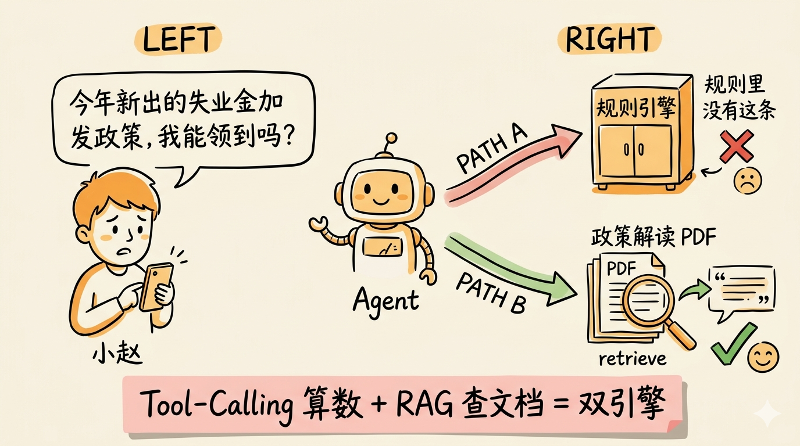
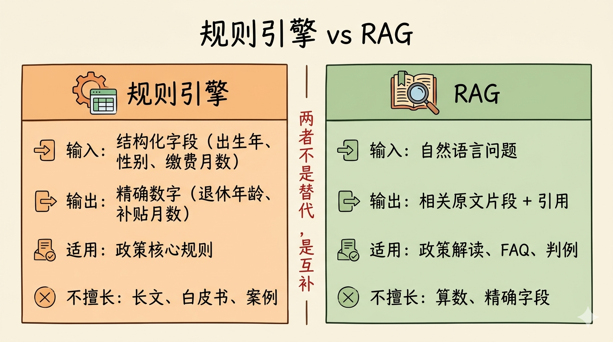
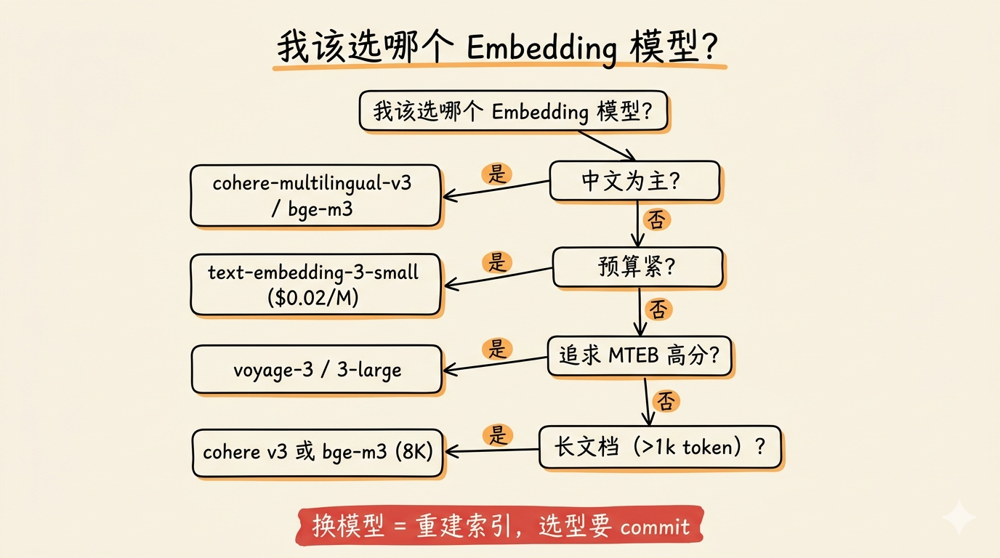
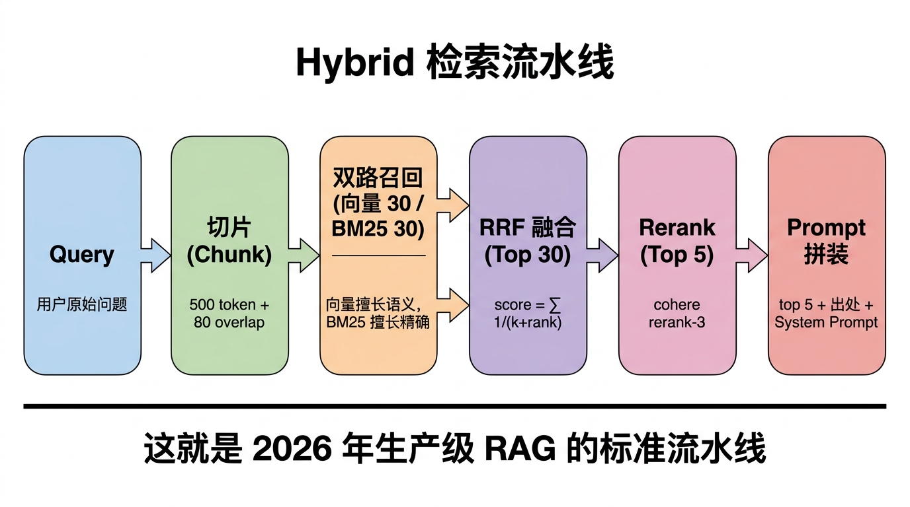
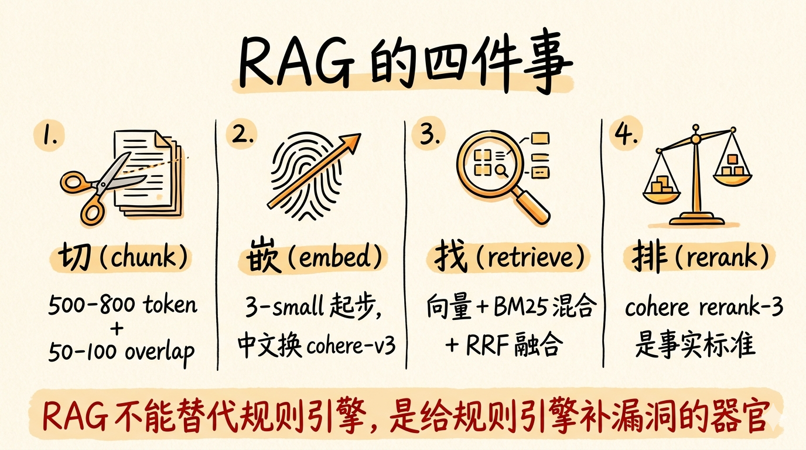

# 第 26 节 · RAG 增强与混合检索：给 Agent 接上知识库



<!-- 图片说明（给图片代理）：
风格：手绘信息图，扁平温暖
内容：左边是用户小赵的对话气泡：「今年新出的失业金加发政策，我能领到吗？」
右边是 Agent 的两条决策路径：
  - 路径 A（红线）：Agent 翻规则引擎 → "规则里没有这条"，红色叉
  - 路径 B（绿线）：Agent 调 retrieve 工具 → 从一篇政策解读里取出原文 → 绿色对勾
中间夹一个粉色卡片写「Tool-Calling 算数 + RAG 查文档 = 双引擎」
中文标注，强调"规则引擎不是万能的"
-->

> **预计时长**：阅读 30 分钟 / 实战 60 分钟
> **前置知识**：第 11 节《Tool Calling 协议》、第 14 节《规则引擎 DSL》、对向量检索有基本概念
> **本节代码**：`ssp-web` 仓库 `chapter-26` tag · 主要文件 `src/lib/ai/tools.ts`、新增 `src/lib/rag/retrieve.ts`、`src/lib/db/schema.ts`
> **知识地图**：对应知识领域「RAG」（见 [knowledge-map.md](./knowledge-map.md)）

那天晚上十一点，群里炸了。

「今天人社局公众号发了一篇政策解读，我们的 Agent 算的数和文章对不上！」产品扔过来一张截图——标题是《2026 年上海失业金加发新规：长期缴费人员每月多领 50 元》。

打开文章读了三遍，不是规则错。是规则**没有**这条。这是上周刚发布的新政，规则引擎里的 24 条规则覆盖不到。

那一刻才意识到：规则引擎能帮你算精确数字（小赵几岁退休、缺多少缴费月数），但**它不是百科全书**。政策每年要改、解读文章每周要发、白皮书隔三差五出新版——这些**非结构化、半结构化**的内容，规则引擎吞不下。

要么做规则的人累死，把每篇政策解读都翻译成 JSON。要么——给 Agent 接一个**真正能读文档的器官**：RAG（Retrieval-Augmented Generation，检索增强生成）。

这一节就讲怎么接、怎么不踩坑、什么时候该接、什么时候根本不用接。一个原则提前丢出来：**RAG 不是炫技，是给规则引擎补漏洞的兜底**。

---

## 一、知识铺垫：RAG 是什么、为什么 SSP 一开始没上 RAG

### 1.1 RAG 的本质：把"找资料"和"写答案"拆开

把 RAG 拆成最简单的话：

> **检索（Retrieval）**：根据用户问题，从知识库里找出最相关的几段文字。
> **增强（Augmented）**：把这几段文字塞进 Prompt。
> **生成（Generation）**：让 LLM 基于这些"小抄"回答。

它解决 LLM 的两个老问题：**知识截止**（训练数据有 cutoff，2026 年发的文件旧模型不知道）和**幻觉**（不知道的就编，编得理直气壮）。RAG 的妙处在于：**模型不再"凭记忆"回答，而是"开卷考试"**。

RAG 这个词最早出现在 2020 年的同名论文（Lewis et al., NeurIPS 2020）。2023 年之后，LangChain、LlamaIndex 这些框架把切片、向量化、检索、Rerank、Prompt 拼装的复杂度封装起来，"RAG" 才从论文术语变成大众词汇。

### 1.2 RAG 不是什么

> **小提醒**：RAG 不等于"上向量数据库"。RAG 是一类设计模式，向量检索只是它最常用的一种实现。

| 不是 | 是 |
|---|---|
| 不是搜索引擎 | 是「搜索 + 喂给 LLM」 |
| 不是模型微调 | 是不动模型权重的"外挂记忆" |
| 不是替代 Tool Calling | 是 Tool Calling 里的一种特殊工具（retrieve tool） |
| 不是"向量数据库就 = RAG" | 向量是手段，相关性才是目的 |

### 1.3 SSP 一开始为什么没上 RAG

回头看 ssp-web 前 25 节，整个项目里**一个 RAG 都没有**。原因很简单：用户问的 90% 问题都能用 24 条规则 + 政策参数表回答；政策核心数字已经被规则引擎吸收；工具描述、补贴文案够小可以塞进 System Prompt。

> **划重点**：能用规则解决的别上 RAG，能塞进 Prompt 的别上向量。RAG 是给规则引擎"漏掉的角落"准备的，不是日常工具。

这背后有条更普遍的规律：**结构化的归结构化、非结构化的才归 RAG**。社保政策的核心是"几岁退、缴几年、领多少"——这些都能拍成参数表。但"4050 政策的设立背景""为什么 2025 年要延迟退休"——这些是非结构化的解读、历史、上下文，没法塞进 JSON。RAG 专吃这一块。

什么时候规则引擎会有漏？典型三类：**政策解读类长文**（人社局公众号三千字解读）、**案例库 / FAQ**（大量历史问答）、**白皮书 / 研报 / 法律条文**（原文重要，必须可追溯出处）。



<!-- 图片说明（给图片代理）：
风格：信息图，扁平双柱对比
左柱：规则引擎（橙色背景）—— 输入：结构化字段；输出：精确数字；适用：政策核心规则；不擅长：长文、白皮书
右柱：RAG（绿色背景）—— 输入：自然语言问题；输出：相关原文片段 + 引用；适用：政策解读、FAQ、判例；不擅长：算数、精确字段
中间一行红色字「两者不是替代，是互补」
-->

---

## 二、核心讲解

### 2.1 RAG vs Tool-Calling：边界在哪里

第 11 节讲的 Tool Calling 不也是"让 Agent 去外面找东西"吗？跟 RAG 有啥区别？答案是：**RAG 是 Tool Calling 的一种特殊形态**——一种带"语义检索"的工具。"调数据库查退休年龄"和"从政策文档里找一段相关解读"，对模型来说都是 tool call；区别是后者的工具背后是个**向量索引 + 关键词索引 + 重排器**的复合搜索引擎。

| 场景 | 用什么 | 为什么 |
|:---|:---|:---|
| 「我 1975 年生女工人，几岁退休？」 | Tool Calling 调规则引擎 | 答案确定、可计算、可追溯到规则 |
| 「这次发的失业金新规具体说了啥？」 | RAG 检索政策原文 | 答案是非结构化文字，需要返回原文 |
| 「我月薪 8000，养老每月扣多少？」 | Tool Calling 调规则引擎 | 算数题，规则有 |
| 「过去三年和我类似的案例怎么处理？」 | RAG 检索案例库 | 案例非结构化、量大 |

> **划重点**：分界线是「答案是不是可以从结构化字段推出来」。能推 → Tool Calling 调规则；不能推 → RAG 找原文。

实战里两者经常**混用**。本节开头那个例子，就是先 Tool Calling 算精确数字，再 RAG 补政策依据：小赵问「2026 年上海女工人 50 岁退休能领多少」→ Agent 先调 `computePlan` 拿到「每月 X 元，引用 R-200 / R-210」→ 再调 `retrieve` 拿到「上海市人社局 2026.01.15 发布……计发基数……」→ 综合两段给用户讲数字 + 政策出处。

### 2.2 在 Neon 上开启 pgvector

为什么不另起一个专用向量库（Pinecone、Weaviate、Qdrant）？因为对 ssp-web 这个量级（预计文档 < 10 万 chunk）的项目，**单独的向量库是过度工程**——多一个服务要 monitoring、要鉴权、要 backfill。一句话：能用一个数据库解决的就别加第二个。

ssp-web 已经在用 `@neondatabase/serverless`（见 `code-facts.md` §2，版本 `^1.0.2`）。Neon 原生支持 `pgvector`，开启只要 `CREATE EXTENSION IF NOT EXISTS vector;`，然后在 Drizzle schema 里加一张表：

```typescript
// src/lib/db/schema.ts （新增，示意，非项目实际代码）
import { pgTable, serial, text, jsonb, vector, index } from "drizzle-orm/pg-core";

export const documents = pgTable("documents", {
  id: serial("id").primaryKey(),
  source_id: text("source_id").notNull(),     // 来源文档
  chunk_index: text("chunk_index").notNull(), // 第几段
  content: text("content").notNull(),
  metadata: jsonb("metadata").notNull(),      // { url, title, published_at, tags }
  embedding: vector("embedding", { dimensions: 1536 }), // text-embedding-3-small
}, (t) => ({
  embedding_idx: index("documents_embedding_idx").using("hnsw", t.embedding.op("vector_cosine_ops")),
}));
```

> **看这里 →**：`vector("embedding", { dimensions: 1536 })` 配合 `hnsw` 索引，是 pgvector 在 Neon 上的标准搭配。`hnsw` 比早期的 `ivfflat` 召回率更高、构建更快；`vector_cosine_ops` 表示用余弦相似度，查询时用 `<=>` 算子。

为什么不用 Postgres 自带的 `tsvector` 全文搜索就够？因为 **tsvector 只能精确匹配关键词**。用户问"延迟退休的过渡安排"，文档里写"渐进式调整方案"——tsvector 一个都召回不到。向量检索能识别"过渡"和"渐进"语义相近，这是它真正的价值。

### 2.3 文档分片策略：chunk 大小 / overlap / metadata

把一篇 3000 字解读直接当一条向量存，效果很差——向量是"一段话的语义平均"，太长则细节被冲淡。所以要**切片**（chunking）。三个关键参数：

| 参数 | 推荐范围 | 为什么 |
|:---|:---|:---|
| chunk_size | 300-800 token | 语义完整、向量信息密度合适 |
| overlap | 50-100 token | 防止句子在切片边界被劈开 |
| metadata | source_id / url / title / published_at / tags | 召回后能展示来源 + 过滤 |

进阶做法是**按语义切**——按段落、标题、列表项边界切，而不是机械按 token 数。对中文政策文件，先按 `\n\n` + 子标题 + token 数三层组合切，往往效果就够好。更专业的是 Anthropic 在 2024.09 提出的 **Contextual Retrieval**：每个 chunk 嵌入前先让 LLM 给它生成一段"全局上下文"，把上下文 + chunk 一起嵌入。Anthropic 实测能把检索失败率从 5.7% 降到 1.9%（再叠 rerank 能到 1.1%）。代价是建索引时多花一笔预处理钱，但**对政策这种段落跳跃多的文档，值得做**。

### 2.4 Embedding 模型选型

把文字变成向量是 RAG 的第一关，选错后面再优化都白搭——embedding 决定了"什么样的两段文字会被认为相似"，是 RAG 的语义底色。四家主流模型（价格与 MTEB 综合分为示意口径）：

| 模型 | 厂商 | 维度 | 价格 / 1M tokens | 中文表现 |
|:---|:---|:---|:---|:---|
| `text-embedding-3-small` | OpenAI | 1536 | 最低 | 一般 |
| `text-embedding-3-large` | OpenAI | 3072 | 中 | 一般 |
| `embed-multilingual-v3.0` | Cohere | 1024 | 中 | 强 |
| `bge-m3` | 智源（开源）| 1024 | 自部署 | 强 |

针对 SSP 这种**中英混合 + 政策文档**：首发用 `text-embedding-3-small`（便宜、召回够用）；进阶换 Cohere 多语言模型（中文召回上一档）；极致自部署 `bge-m3`（零边际成本但要跑 GPU）。

> **小提醒**：换 embedding 模型 = 重建索引。所有历史向量都要用新模型重新算。所以选型要 commit 一段时间再换。另外，索引时 embedding 调用是网络瓶颈——要加并发 + 失败重试 + 用 `source_id + chunk_index + content_hash` 做幂等键的增量更新。



<!-- 图片说明（给图片代理）：
风格：信息图，扁平决策树
内容：从「我该选哪个 embedding 模型？」开始：
  - 中文为主？→ 是：Cohere multilingual / bge-m3
  - 否 → 预算紧？→ 是：text-embedding-3-small
  - 否 → 追求高分：3-large
  - 长文档（>1k token）？→ 走 Cohere 或 bge-m3
底部红字「换模型 = 重建索引，选型要 commit」
-->

### 2.5 检索：相似度 + 关键词的混合检索

只用余弦相似度的纯向量检索，2024 年后已被业界普遍认为**不够**：向量擅长"语义相近"，但**对专有名词（4050、R-200、上海市人社局）召回不稳**；关键词检索擅长精确匹配，但**对同义词无能**。

举个真实例子：用户问"4050 补贴具体多少钱"，纯向量召回回来的可能是"老年补贴""社保福利"等语义相近但**不精准**的段落。而 BM25 能精确锁定包含"4050"这个专有名词的文档。两者结合，召回率能明显提升（Microsoft Azure AI Search 的 hybrid 评测）。

所以现代 RAG 用 **Hybrid Search**——向量 + 关键词（BM25）打分加权：

```typescript
// src/lib/rag/retrieve.ts（示意，非项目实际代码）
export async function hybridRetrieve(query: string, topK = 10) {
  const queryEmbedding = await embed(query);
  // 向量召回（cosine 距离，越小越相关）
  const vectorHits = await db.execute(sql`
    SELECT id, content, metadata, 1 - (embedding <=> ${queryEmbedding}::vector) AS vector_score
    FROM documents ORDER BY embedding <=> ${queryEmbedding}::vector LIMIT 30`);
  // 关键词召回（PG 的 ts_rank）
  const bm25Hits = await db.execute(sql`
    SELECT id, content, metadata,
           ts_rank(to_tsvector('simple', content), plainto_tsquery('simple', ${query})) AS bm25_score
    FROM documents
    WHERE to_tsvector('simple', content) @@ plainto_tsquery('simple', ${query}) LIMIT 30`);
  // RRF（Reciprocal Rank Fusion）合并：score = Σ 1 / (k + rank_i)，k 常取 60
  return reciprocalRankFusion(vectorHits, bm25Hits, topK);
}
```

> **看这里 →**：`<=>` 是 pgvector 的余弦距离运算符，`1 - distance` 转成相似度。RRF 是行业最常用的融合算法，Azure AI Search、Elasticsearch、Weaviate 都默认在用。纯中文场景 PG 的 `to_tsvector('simple', ...)` 分词不够好，要换 `pgroonga` / `zhparser` 或前置 jieba 分词。

### 2.6 重排（Rerank）：召回 30 条精选 5 条

混合检索后通常召回 20-30 条。直接全塞给 LLM 不行（贵 + 噪声）。要再过一层 **Rerank**——用专门的"判官模型"对召回结果重新打分。

为什么不在第一层就召回 5 条？因为**召回（recall）和精度（precision）是不同的任务**。召回追求"该出现的别漏"，宁可多放；精度追求"出现的都对"，从大池子里精选。一前一后两道工序，召回用便宜的 embedding（毫秒级、几乎免费），精度用昂贵的 cross-encoder（毫秒级、几分钱），是工程上最划算的组合。

```typescript
// src/lib/rag/rerank.ts（示意，非项目实际代码）
export async function rerank(query: string, docs: string[], topK = 5) {
  const result = await cohere.rerank({ model: "rerank-3", query, documents: docs, topN: topK });
  return result.results.map((r) => ({ index: r.index, score: r.relevanceScore }));
}
```

> **划重点**：Rerank 不是 nice-to-have。在 RAG 评测里，加 Rerank 通常能把 `context_precision` 从 0.6 提到 0.85+，是性价比最高的一步优化。一次 query 重排 30 条的成本极低，哪怕用户量大也不会是成本瓶颈。

进阶做法是**两段 rerank**：第一段用便宜的开源 cross-encoder（自部署）从 30 条筛到 10 条，第二段用商用 reranker 从 10 条精选 5 条，大流量场景能再砍 5-10× 成本。



<!-- 图片说明（给图片代理）：
风格：信息图，横向时序图
内容：左到右六个节点：Query → 切片(chunk) → 双路召回（向量 30 / BM25 30）→ RRF 融合（top 30）→ Rerank（top 5）→ Prompt 拼装
每个节点下方一句话说明
底部加粗「这就是 2026 年生产级 RAG 的标准流水线」
-->

### 2.7 长上下文模型出现后，什么时候不需要 RAG

2026 年最有趣的变化是——**长上下文模型可能让 RAG 在某些场景失业**。模型上下文从 4K → 128K → 1M，会不会以后大家把所有文档全塞进 Prompt？

如果你的全部知识库就 50 万 token（约 35 万汉字），现在最便宜的方案可能是：**不分片、不向量、整本扔给一个 1M 上下文的便宜模型**。但 RAG 仍不会消失，原因有三：**成本**（1M 上下文每次输入都收费，RAG 召回 5 个 chunk 只要零头）、**延迟**（1M 上下文首字节延迟数秒，RAG 几百毫秒）、**可追溯**（RAG 能告诉你"这个回答来自第 X 篇文档第 Y 段"，长上下文做不到）。

而且长上下文有个隐形坑：**Lost in the Middle**——模型对长 context 中间段的信息利用率显著低于开头和结尾。直接塞 50 万 token 不等于模型真"读"了 50 万。RAG 把最相关的 5 段精准放到 Prompt 顶部，反而召回得更准。

> **小提醒**：知识库 < 100K token、日活低、对延迟不敏感 → 直接长上下文。否则还是 RAG。2026 年的混合架构趋势是：常见知识塞进长上下文（享受 prefix cache），冷门知识走 RAG。

### 2.8 RAG 评测：用 Ragas 量化好坏

加了 RAG 之后怎么知道它"加对了"？这是 90% 项目都没做的事。RAG 的失败模式恰恰**用户感知不到**——模型把假信息编得和真的一模一样，用户以为查到的是政策原文，其实是模型瞎编。

**Ragas** 是 RAG 专项评测的事实标准（Apache-2.0 开源），给五个核心指标：

| 指标 | 测什么 | 目标 |
|:---|:---|:---|
| `faithfulness` | 回答有没有"扎根"在检索到的上下文 | >0.85 |
| `answer_relevancy` | 回答和问题的相关度 | >0.80 |
| `context_precision` | 检索到的相关性高的占比 | >0.70 |
| `context_recall` | 该召回的有没有都召回 | >0.75 |
| `context_entities_recall` | 实体覆盖率 | >0.70 |

> **看这里 →**：上 RAG **必须**配套上评测。否则你不知道是检索差、切片差还是 Prompt 差，调优变成猜谜。

实战里最常见的"看着就是不对"，往往不是召回率不够，而是 `faithfulness` 低——模型把检索回来的事实**改写跑偏了**。Ragas 的 faithfulness 算法很巧：先让 LLM 把回答拆成"原子陈述"，再逐句问「这条能从 context 推出来吗」，最后算比例。低于 0.8 就要警觉，可能是 Prompt 没强约束「只能基于 context 回答」。经验上 `faithfulness` 和 `context_precision` 是上线前两道硬门禁，任一 < 0.7 都不该上线。注意 faithfulness=1.0 只说明"没在 context 之外编"，**不**保证检索到的就是对的 chunk，要配 context_precision 一起看。

### 2.9 在 SSP 加 RAG 模块的最小改动

够铺垫了，看落地。SSP 现有三个工具：`computePlan` / `validateField` / `updateProfile`（见 `code-facts.md` §4）。我们加第四个 `retrievePolicy`，整套改动**不到 200 行 + 一张表 + 一条 Prompt 规则**：

**第一步**：DB 加 `documents` 表（前面 §2.2）。

**第二步**：写 retrieve 函数：

```typescript
// src/lib/rag/retrieve.ts（新文件，示意，非项目实际代码）
export async function retrievePolicy(query: string, topK = 5) {
  const candidates = await hybridRetrieve(query, 30);
  const reranked = await rerank(query, candidates.map(c => c.content), topK);
  return reranked.map(r => ({ ...candidates[r.index], score: r.score }));
}
```

**第三步**：注册成 Tool（参照 `tools.ts:174-266` 的 `computePlanTool` 写法）：

```typescript
// src/lib/ai/tools.ts （新增 retrievePolicy 工具，示意，非项目实际代码）
export const retrievePolicyTool = tool({
  description: "检索政策原文、解读文章、白皮书。当用户问最新政策、政策解读、出处、案例时使用。返回若干段相关原文 + 出处。",
  inputSchema: z.object({ query: z.string(), topK: z.number().optional().default(5) }),
  execute: async ({ query, topK }) => {
    const hits = await retrievePolicy(query, topK);
    return { success: true, hits: hits.map(h => ({ content: h.content.slice(0, 500), url: h.metadata.url, title: h.metadata.title, score: h.score })) };
  },
});
```

**第四步**：聚合到 `tools` 里（`tools.ts:322-326`），加一行 `retrievePolicy: retrievePolicyTool`。

**第五步**：在 System Prompt 加一条规则（参照 `prompts.ts:14-23` 的核心规则风格）：「当用户问到最新政策 / 政策原文 / 文件依据 / 类似案例时，必须先调用 retrievePolicy 检索原文，再基于检索结果回答，引用时给出出处链接」。

接下来三件事：**数据填充**（写 ingestion 脚本，参考 `scripts/generate-showcase-cases.ts` 风格，从 PDF / 公众号抓文本 → 切片 → embed → 入库）、**Prompt 调优**（约束模型必须引用原文 + 出处，避免把 RAG 结果改写成"个人理解"）、**评测兜底**（参考第 22 节，加 20 条 RAG 黄金集跑 Ragas）。

### 2.10 常见踩坑

1. **chunk 太大**：800 token 以上向量信息密度下降，召回飘。改 400-600。
2. **不存 metadata**：召回回来分不清来自哪篇文章，没法引用。**永远存 source_id + chunk_index + url**。
3. **混搭多个 embedding 模型**：旧文档用 small、新文档用 large 同库混存——彻底翻车。**换模型 = 重建索引**。
4. **没 rerank 直接 top-5**：向量召回 top-5 噪声大，幻觉率比 top-30 + rerank-5 还高。
5. **不评测就上线**：靠用户投诉反馈，业务方迟早炸。
6. **过期文档不下架**：政策每年改，旧解读还在索引里——召回时分高、内容错。索引必须有 `effective_to` 字段，过期自动降权或删除。

---

## 三、举一反三

RAG 的范式抽象出来就一句话：**当回答需要"原文 + 出处"时，先检索，后生成**。换个领域只是"切什么、存什么 metadata、按什么过滤"变了。

**法律咨询 Agent**：知识库是判例 + 法条 + 司法解释；按"裁判文书结构"（事实 / 理由 / 判决）切；metadata 存案号、审级、生效日期、援引法条；检索必须 hybrid（"故意伤害罪"必须精确匹配）；评测额外测"援引法条准确率"——AI 不能虚构法条号。

**医疗问诊 Agent**：知识库是临床指南 + 药品说明书；按章节切，避免把"用法用量"和"禁忌"切到不同 chunk；metadata 存来源期刊、发布年份、循证等级；检索 hybrid + 时间衰减（5 年前指南权重降低）；**最看重 faithfulness**——医疗幻觉成本不是钱是命。

**金融研究 Agent**：知识库是财报 + 行研 + 监管公告；表格单独存（CSV-as-text）；metadata 存机构、公司代码、报告日期；检索能按"日期 + 公司 + 行业"三维过滤；**最看重 context_recall**——漏掉关键数据 = 投资决策失败。

三条共用工程原则：**永远存来源 + 时间**（引用时能说"这是 2024 年判例 / 2026 新规"）、**永远过滤再排序**（先按 metadata 硬过滤再向量召回 + rerank）、**永远先评测再上线**（每个领域至少 50 条人工标注的黄金集）。

> **划重点**：架构都是 chunk → embed → hybrid retrieve → rerank → generate，**变化的只是"切什么、存什么 metadata、按什么过滤"**。

---

## 四、小结



<!-- 图片说明（给图片代理）：
风格：手绘小结卡片，温暖暖色
内容：一张大卡片，标题"RAG 的四件事"
四个小图标 + 一句话：
  1. 切（chunk）：500-800 token + 50-100 overlap
  2. 嵌（embed）：3-small 起步，中文换 Cohere
  3. 找（retrieve）：向量 + BM25 混合 + RRF 融合
  4. 排（rerank）：cross-encoder 重排精选 5 条
底部红字「RAG 不能替代规则引擎，是给规则引擎补漏洞的器官」
-->

RAG 不是给项目加一个"看起来很 AI"的标签——它是为规则引擎漏掉的那部分非结构化知识准备的器官。回顾这一节的核心：

- **边界**：能算的用规则引擎，能塞 Prompt 的别上向量，剩下的才上 RAG
- **基建**：Neon + pgvector + drizzle + hnsw，零额外成本
- **流程**：chunk → embed → hybrid retrieve（cosine + BM25 + RRF）→ rerank → 拼进 Prompt
- **评测**：Ragas 五指标，至少跑通 faithfulness 和 context_precision
- **演进**：知识库小到 < 100K token 时，可考虑直接用长上下文模型替代 RAG

**核心要点回顾**：

- ✅ RAG 解决"模型知识截止 + 幻觉"两个问题，不是"必上"
- ✅ RAG 是 Tool Calling 的一种特殊形态（带语义检索的 retrieve tool）
- ✅ pgvector + Neon serverless 是 ssp-web 风格项目最低成本的 RAG 基建
- ✅ 向量检索只是 RAG 的一种实现，hybrid search + rerank 是 2026 标配
- ✅ Ragas 是 RAG 评测事实标准，**上 RAG 必上评测**；faithfulness=1.0 不等于检索对
- ✅ 切片 400-800 token、overlap 50-100、metadata 必带 source_id + chunk_index + url
- ✅ 长上下文模型让小型 RAG 在某些场景失去成本优势，但可追溯性 + Lost in the Middle 让 RAG 不会消失

---

## 思考题

1. **【开放题】**：你的项目"真的"需要 RAG 吗？拿你正在做的 AI 项目对照本节的边界判断——能用规则、能塞 Prompt、能用长上下文模型解决的部分先排除，剩下的再决定上不上 RAG。把判断写下来，包括"为什么不上"或"为什么上"。
2. **【动手题】**：fork `ssp-web`，在 `src/lib/rag/retrieve.ts` 加一个 retrieve tool，索引 5 篇上海社保政策解读文章（自己网上找）。验收标准：用户问「2026 年失业金加发新规」时，Agent 调用了 retrievePolicy 工具，并返回带 url + 段落 + 相关性分数的结构化卡片。
3. **【选做】**：用 Ragas 跑一组 20 个用例的对比评测——「不加 RAG 直接答」vs「加 RAG」。提交一份 Markdown 报告，至少包含 `faithfulness` 和 `answer_relevancy` 两个指标的对比柱状图，并写一段你看到的差异。

---

## 面试题

**Q1.【基础】【主题：RAG】** 用一句话说清 RAG 的三个字母分别代表什么，它解决了 LLM 的哪两个老问题？为什么说"向量数据库不等于 RAG"？
<details><summary>参考解答</summary>

**三个字母**：

- **R（Retrieval，检索）**：根据用户问题从知识库里找出最相关的几段文字。
- **A（Augmented，增强）**：把这几段文字塞进 Prompt。
- **G（Generation，生成）**：让 LLM 基于这些"小抄"回答。

**解决的两个老问题**：① **知识截止**——大模型训练数据有 cutoff，新发的文件旧模型不知道；② **幻觉**——模型不知道的就编。RAG 让模型从"凭记忆闭卷"变成"开卷考试"，答错的概率大幅下降。

**为什么向量数据库 ≠ RAG**：RAG 是一类**设计模式**（先检索、后生成），向量检索只是它**最常用的一种实现**。完全可以用关键词检索（BM25）、混合检索、甚至 SQL 查询来做检索那一步。向量是手段，**相关性才是目的**。把"上了向量数据库"等同于"做了 RAG"，会忽略召回质量、切片、重排、评测这些真正决定效果的环节。

</details>

**Q2.【进阶】【主题：RAG】** 现代生产级 RAG 为什么要用「混合检索 + 重排」两步，而不是纯向量检索一步到位？请说明混合检索解决什么问题、RRF 是什么，以及召回和精度为什么用不同模型。
<details><summary>参考解答</summary>

**为什么纯向量不够**：向量擅长"语义相近"，但对专有名词（如 "4050"、"R-200"、机构名）召回不稳；关键词检索（BM25）擅长精确匹配，但对同义词无能。例：用户问"4050 补贴多少钱"，纯向量可能召回"老年补贴""社保福利"等语义近但不精准的段落，而 BM25 能精确锁定含"4050"的文档。

**混合检索（Hybrid Search）**：向量召回 + 关键词（BM25）召回各跑一路，再融合。融合常用 **RRF（Reciprocal Rank Fusion）**——按每条在两路里的**排名**算分：`score = Σ 1 / (k + rank_i)`，k 常取 60。它只看名次不看绝对分，跨不同打分体系也稳，是 Azure AI Search、Elasticsearch、Weaviate 的默认融合算法。

**为什么召回和精度用不同模型**：因为它们是不同任务。**召回（recall）追求"该出现的别漏"**，所以从大池子里多捞一些（如 top-30），用便宜的 embedding（毫秒级、几乎免费）；**精度（precision）追求"出现的都对"**，所以用昂贵的 cross-encoder reranker 从 30 条精选 5 条。两道工序分别用便宜 / 贵的模型，是工程上最划算的组合。实测加 rerank 能把 `context_precision` 从 0.6 提到 0.85+，是性价比最高的一步优化。

</details>

**Q3.【深挖】【主题：RAG】** 上了 RAG 怎么知道它"加对了"？请讲清 Ragas 的 faithfulness 是怎么算的、为什么 faithfulness=1.0 还不够。另外，2026 年长上下文模型（1M context）出现后，RAG 在什么场景会"失业"，又为什么不会真正消失？
<details><summary>参考解答</summary>

**为什么必须评测**：RAG 的失败模式用户感知不到——模型把假信息编得跟真的一样，用户以为是政策原文。Ragas（RAG 专项评测事实标准）给五个指标：faithfulness、answer_relevancy、context_precision、context_recall、context_entities_recall。

**faithfulness 算法**：先让 LLM 把回答拆成若干"原子陈述"，再逐句问「这条陈述能否从检索到的 context 推出来」，最后算"能推出的比例"。它衡量的是"模型有没有在 context 之外瞎编"。低于 0.8 就要警觉，通常是 Prompt 没强约束「只能基于 context 回答」。

**为什么 faithfulness=1.0 还不够**：faithfulness=1.0 只说明"没在检索结果之外编造"，**不**保证检索到的就是对的 chunk——如果检索本身召回了错误片段，模型忠实复述错误片段也能拿满分。所以必须配 **context_precision**（检索的相关性）一起看。经验上 faithfulness 和 context_precision 是上线前两道硬门禁，任一 < 0.7 都不该上线。

**长上下文与 RAG**：知识库很小（< 100K token）、日活低、对延迟不敏感时，可以不分片不向量、整本塞进 1M 上下文模型，RAG 在这种场景"失业"。但 RAG 不会真正消失，三个原因：① **成本**——1M 上下文每次输入都收费，RAG 召回几个 chunk 只要零头；② **延迟**——长上下文首字节延迟数秒，RAG 几百毫秒；③ **可追溯**——RAG 能定位"答案来自第 X 篇第 Y 段"，长上下文做不到。还有 **Lost in the Middle**——模型对长 context 中间段利用率低，全塞不等于真读了。2026 的趋势是混合架构：常见知识塞长上下文（吃 prefix cache），冷门知识走 RAG。

</details>

---

## 延伸阅读

- [pgvector 官方仓库](https://github.com/pgvector/pgvector)
- [Anthropic — Contextual Retrieval](https://www.anthropic.com/news/contextual-retrieval)（2024.09，加 chunk 上下文的实战）
- [Ragas — Available Metrics](https://docs.ragas.io/en/stable/concepts/metrics/available_metrics/)
- [RAGAS 论文 arXiv:2309.15217](https://arxiv.org/abs/2309.15217)
- [Microsoft — Reciprocal Rank Fusion](https://learn.microsoft.com/en-us/azure/search/hybrid-search-ranking)（RRF 算法实操）

---

[← 上一节：第 25 节 MCP 实战：把 SSP 工具变成 MCP Server](./26-mcp-in-practice.md) · [📚 目录](./README.md) · [下一节：第 27 节 多 Agent 协作模式 →](./28-multi-agent.md)
