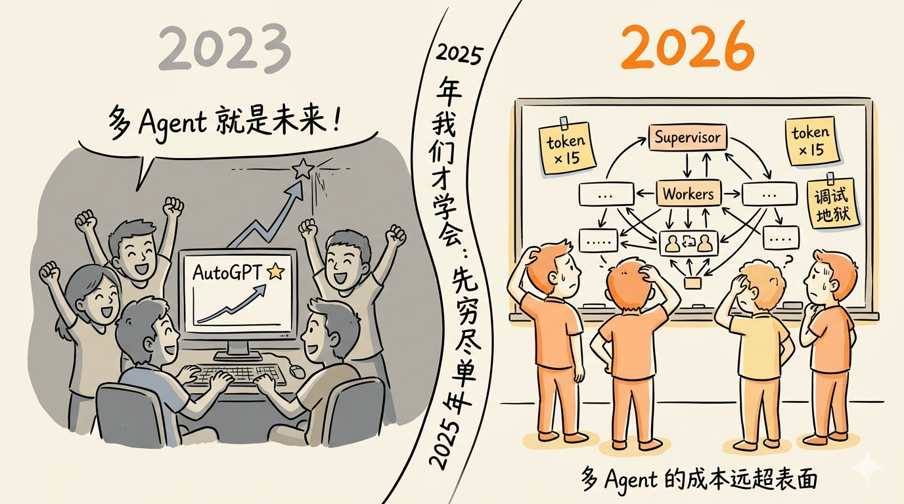
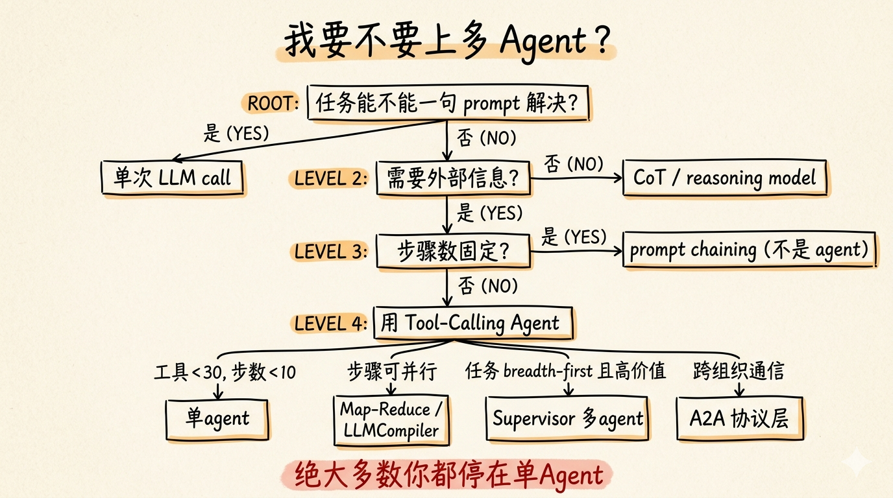
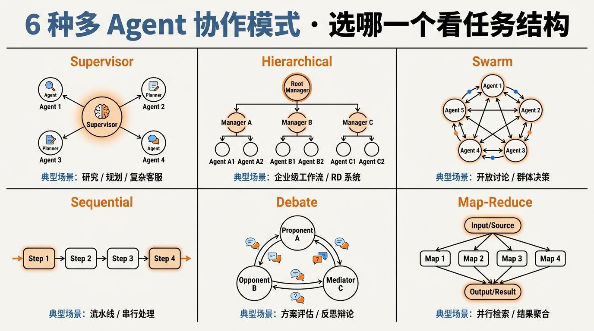
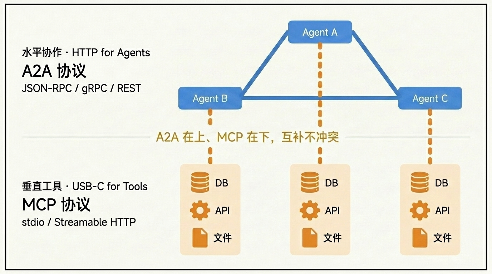
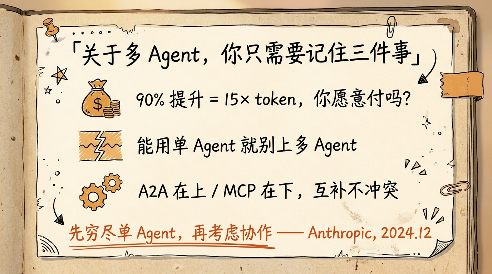

# 第 27 节 · 多 Agent 协作模式：planner-executor / A2A



<!-- 图片说明（给图片代理）：
风格：手绘信息图，温暖反讽风
内容：场景一分两半。
左半（灰色调）：一群人围着电脑欢呼，屏幕上是某开源多 Agent 项目的 GitHub star 曲线冲到天花板，气泡写「多 Agent 就是未来！」
右半（亮色调）：同一群人在白板前抓头，白板画着复杂的 Supervisor / Worker 拓扑，标注「token × 15」「调试地狱」
中间一句金句「先把单 Agent 做到 95 分，再谈协作」
中文标注，强调“多 Agent 的成本远超表面”
-->

> **预计时长**：阅读 30 分钟 / 实战 60 分钟
> **前置知识**：第 11 节《Tool Calling 协议》、第 24 节《MCP 协议拆解》、对单 Agent 设计有基本概念
> **本节代码**：`ssp-web` 仓库 `chapter-27` tag · 主要文件 `src/lib/ai/agent.ts`、`src/lib/ai/tools.ts`

那年某个开源多 Agent 项目一周拿了十万星，技术圈刷屏：「Agent 协作就是未来，单 LLM 是过去式。」

我也激动过。第二天就拉着同事开会：要不要把社保 Agent 拆成「问诊 + 计算 + 政策 + 总结」四个角色？画了一下午白板，越画越像组织架构图。

幸亏没动手。几年过去，那些刷屏的明星项目大多还停在 demo。它们失败的共同点不是模型不行，而是一个动作：**上来就多 Agent**——先有「多 Agent 协作」的方案，再去找「什么任务适合」，本末倒置。

这一节讲三件事：什么时候你**真的**需要多 Agent；6 种主流协作模式怎么选；Google 牵头的 A2A（Agent to Agent）代理协议解决了什么。读完你会明白，为什么 `ssp-web` 跑了二十多节还是单 Agent——不是偷懒，是这才对。

---

## 一、知识铺垫：多 Agent 的真实成本

### 1.1 90.2% 的提升，背后是 15× 的 token

Anthropic 在 2025 年的工程博客《How we built our multi-agent research system》里，给了业内最有说服力的一组多 Agent 数据：他们的多 Agent 研究系统（orchestrator-worker 架构，一个 lead agent 派生多个并行 subagent）在内部 research 评测上比单 Agent 高 **90.2%**，代价是消耗的 token 约为普通 chat 的 **15×**。

更关键的是官方的归因：性能差异**很大程度由 token 用量差异解释**——多 Agent 之所以更好，主要是因为它「看得更多、想得更多、写得更多」，不是某种「协作智慧」。

这给了我们一把最简单的尺子：

> **划重点**：你愿意为单次任务多付约 15 倍的钱，换约 90% 的质量提升吗？多数场景，答案是不愿意。而且 15× 还只算了显性的 token 账。隐性成本更扎心：**延迟变长**（每次 handoff 都是一次完整 LLM 调用，单 Agent 两秒的活容易拖到十几二十秒）、**可观测复杂度爆炸**（trace 从一条直线变成一张图）、**测试矩阵指数增长**（5 个 Agent 各有几种状态，组合数迅速失控）、**Prompt 维护翻倍**（政策一更新要改 N 份而不是 1 份）。

### 1.2 多轮本来就掉分，多 Agent 把坑乘以 N

还有一个反直觉的现象：有研究综述口径（二手，非官方一手数字）指出，顶级 LLM 在多轮对话里的表现比单轮平均明显下滑。机制是业界共识：错误传播（error propagation）让早期失误沿对话放大，上下文丢失（context loss）让关键信息淹没在长历史里。而多 Agent 里每一次 handoff 本质就是一轮「LLM 对 LLM」对话——这种惩罚不是叠加，而是相乘。

### 1.3 那为什么还有人坚持做多 Agent

不是他们没看见数字，而是有些任务单 Agent 真的做不好。Anthropic 反复强调的「适合多 Agent」的任务有三个共同特征：**breadth-first（宽度优先，一次要看 50 个网站、读上百篇文档）**、**independent subtasks（子任务弱耦合、可各跑各的）**、**任务价值 ≫ 15× token 成本**。

他们的内部 research 系统正是这类——用户提一个问题，系统跑半小时给一份白皮书，值这个钱。它还有个隐藏前提：**单个 Agent 的上下文窗口装不下**，必须 fan-out 后让每个 subagent 只看自己那一份，用上下文窗口换 token 成本。



<!-- 图片说明（给图片代理）：
风格：手绘决策树，扁平温暖风
内容：从顶端「我要不要上多 Agent？」开始的决策流：
  - 能一句 prompt 解决？→ 能：单次 LLM 调用
  - 不能 → 需要外部信息？→ 不需要：CoT / reasoning model
  - 需要 → 步骤数固定？→ 是：prompt chaining（不是 Agent）
  - 否 → 用 Tool-Calling 单 Agent
    - 工具少、步数 < 10 → 单 Agent（绝大多数停在这）
    - 子任务可并行 → Map-Reduce
    - breadth-first 且价值 ≫ 15× → Supervisor 多 Agent
    - 跨组织通信 → A2A 协议层
中文标注，结尾箭头指向「绝大多数你都停在单 Agent」
-->

> **小提醒**：判断自己是不是这类任务，最简单的办法是看 evals 通过率（详见[第 22 节《评测体系：三层评测模型与 LLM-as-Judge》](./23-evaluation.md)）。单 Agent 在黄金集上还没到 95 分，先去优化 Prompt、工具描述、补全边界规则——这些几乎都比「拆成多 Agent」更便宜直接。

---

## 二、核心讲解

### 2.1 六种多 Agent 协作模式

先建立一个心理预期：这 6 种模式不是「先进 vs 落后」，而是「**适用任务不同**」。把 Supervisor 用在该用 Sequential 的地方白白多花几倍 token；把 Sequential 当 Map-Reduce 用又根本并行不起来。这一段的目的，是让你看到任务长什么样就能立刻识别该用哪种。

#### 模式 1 · Supervisor（中心化路由）

一个 Supervisor 负责「看任务 → 选 Worker → 收结果 → 决定下一步」。

```
       ┌───────────┐
       │ Supervisor│
       └─────┬─────┘
        ┌────┼────┐
        ▼    ▼    ▼
       W1    W2   W3
```

**适合**：路由准确度敏感、控制流清晰、好调试。代表实现：LangGraph 的 `langgraph-supervisor`、Anthropic 研究系统的 lead + subagent。**风险**：Supervisor 是单点瓶颈，每步都要过它一次。实战里通常让 **Supervisor 用更强的 reasoning 模型、Worker 用便宜模型**——Anthropic 系统里 lead 用 Opus 档、subagent 用 Sonnet 档就是这种分层。

#### 模式 2 · Hierarchical（多层 Supervisor）

Supervisor 管 sub-Supervisor，再各自管一组 Worker。**适合**超复杂任务的分层分解；**风险**是层数一深，总调用量 ≈ `层数 × 每层路由`，token 爆炸。

#### 模式 3 · Swarm（点对点 handoff）

Agent 之间直接交接控制权，没有中央节点。**适合**各自维护上下文、追求速度的场景；**风险**是 handoff 决策分散在各 Agent 的 Prompt 里，调试困难，容易「踢皮球」或循环 handoff。

#### 模式 4 · Sequential Pipeline

A → B → C 串行，前一个输出喂后一个。**适合**极简、可预测、易测试；**风险**是错误传播、不能并行。

> **划重点**：能用 Sequential 解决的，根本不该叫多 Agent——它本质就是 prompt chaining。

#### 模式 5 · Debate / Consensus

N 个 Agent 各自作答 → 互看 → 修订 → 多轮后取共识。出自 Du 等人的论文《Improving Factuality and Reasoning in Language Models through Multiagent Debate》（arXiv:2305.14325，ICML 2024），被称为「群智（society of minds）」。**适合**高赌注、对错可被外部验证的推理；**风险**是成本随「Agent 数 × 轮数」线性上涨，是最贵的模式之一，只在「对错可验证」时才划算。

#### 模式 6 · Map-Reduce（并行 Fan-out + Fan-in）

把任务切成 N 块 → N 个 Agent 并行 → 一个 reducer 合并。**适合**breadth-first、单 Agent 上下文装不下的场景；**风险**是 reducer 的聚合 Prompt 难写、并发计费高。代表实现：LangGraph 的 `Send` API（动态 fan-out）、Anthropic 研究系统。这是 6 种里**最容易回本**的一种——fan-out 是真并行，挂钟时间几乎不增加，每个 Worker 只看一小段还能用便宜模型。



<!-- 图片说明（给图片代理）：
风格：信息图，扁平专业风
内容：3×2 网格，6 个小拓扑图：
  1. Supervisor：中心 + 多外圈
  2. Hierarchical：树状两层
  3. Swarm：点对点环形
  4. Sequential：横向链条
  5. Debate：多节点互相连线
  6. Map-Reduce：分叉合并
每图下方一行小字标典型场景
顶端横幅「6 种多 Agent 协作模式 · 选哪一个看任务结构」
中文标注
-->

### 2.2 主流框架横向对比

挑框架前先问自己：你要「快速搭个 demo 看协作能不能跑」，还是「上线一个能扛流量、bug 能定位、出事能回滚的生产系统」？两者答案不一样。下表是截至 2026 年初的格局归纳（框架迭代快，成熟度为综合判断）：

| 框架 | 语言/生态 | 多 Agent 范式 | 状态管理 | 适合 |
|:---|:---|:---|:---|:---|
| **LangGraph** | Python / TS | 全部（图节点） | checkpointing、time-travel、durable | 要可观测/可中断/可回放的生产状态机 |
| **CrewAI** | Python | role-based、sequential、hierarchical | 任务输出顺序传递 | 最快从想法到「3-5 角色协作」原型 |
| **OpenAI Agents SDK** | Python（+TS） | handoff、guardrails、sessions、tracing | 内置 tracing/session | 已在 OpenAI 生态、要 handoff + 内置追踪 |
| **Microsoft Agent Framework** | .NET / Python | orchestrator、group chat、handoff | 内置 | 微软栈；由 AutoGen + Semantic Kernel 合并而来 |
| **Vercel AI SDK** | TypeScript | routing、orchestrator-workers、`ToolLoopAgent` | Workflow DevKit 持久化 | TypeScript / Next.js 项目（如 ssp-web）首选 |

> **小提醒**：Anthropic 在《Building Effective Agents》（2024-12）里直白写过——若要用框架，务必先理解它的底层运作。否则 bug 出现时你 debug 不动框架，框架就会反过来 debug 你。

我们走过一个反例：早期试 CrewAI，3 个 role 还好，加到 5 个 role 后 token 暴涨。读源码才发现它默认每次任务都把完整角色定义 + 历史输出全塞进 Prompt——不读源码根本看不见，每次请求都多花三五成 token。最后手写了一层很薄的 supervisor，反而又便宜又好懂。

### 2.3 handoff 模式与 OpenAI Agents SDK

OpenAI 早期的实验项目 **Swarm**（核心两原语是 `Agent` 与 `handoff`）已于 2025 年 3 月弃用，由生产级的 **OpenAI Agents SDK** 接棒，保留了 handoff 思想，补上了 guardrails、sessions、tracing、MCP 接入等。

handoff 的核心思想是：让每个 Agent 显式声明「我能把任务交给谁」。它不是简单把消息传过去，而是把**整段对话上下文 + 控制权**一起交出去，被接管方从用户视角看仍是「同一个对话」。两个高频陷阱（与社区实战一致）：**循环 handoff**（A→B→A→B 死循环，要靠 `max_steps` 兜底 + Prompt 写清交接条件）、**context 膨胀**（每次都带全部历史，到第 5 个 Agent 就爆，交接时要主动 summarize）。

> **小提醒**：Anthropic 侧的多 Agent 落地一般用 **Claude Agent SDK（原 Claude Code SDK，2025-09 改名）**，它内置 agent loop、子代理（subagents）、上下文管理。提到它时记得用全称，避免和产品「Claude Code」混淆。

### 2.4 A2A 协议：Agent 之间的 HTTP

把背景交代清楚：A2A（Agent to Agent，代理协议）不是私有协议，而是一个开放标准，目标是让「用不同框架、不同厂商构建、互相不透明」的 Agent 之间能彼此发现、交换结构化任务、协作，而**不暴露各自的内部状态、记忆、工具实现**。

它的演进脉络（只锁定可核实的点）：**Google 在 2025 年 4 月发起 → 随后捐给 Linux Foundation → A2A 规范当前是 v1.0**，首年即超过 150 家组织参与（二手通报口径）。

#### 四个核心概念

| 概念 | 是什么 |
|:---|:---|
| **Agent Card** | 一份 JSON 元数据，发布在 well-known 约定路径。描述身份、能力、技能、服务端点、认证要求——让 Agent 像网站一样**可被发现** |
| **Task** | 任务生命周期单元（send / get / cancel），有状态流转，支持长任务的实时流式更新与异步推送（webhook） |
| **Transport** | JSON-RPC 2.0 / gRPC / HTTP+JSON(REST) 三选一，都支持流式（SSE / gRPC streams） |
| **认证** | API Key / HTTP Basic / Bearer / OAuth 2.0 / OIDC / mTLS 等企业级方案 |

一个最小 Agent Card 长这样：

```json
// 示意，非项目实际代码
{
  "name": "ssp-pension-agent",
  "description": "上海社保养老规划 Agent",
  "version": "1.0",
  "skills": [
    {
      "id": "compute_pension_plan",
      "description": "根据用户档案计算养老规划",
      "input_schema": { "$comment": "JSON Schema" }
    }
  ],
  "auth": { "type": "bearer" }
}
```

#### A2A 与 MCP 互补，不竞争

[第 24 节《MCP 协议拆解：让工具变成可共享服务》](./25-mcp-protocol.md)讲过模型上下文协议（MCP，Model Context Protocol）。A2A 常被拿来和它对比，但两者完全互补：

| 维度 | MCP（模型上下文协议） | A2A（代理协议） |
|:---|:---|:---|
| 解决 | Agent ↔ 工具/数据（**垂直**） | Agent ↔ Agent（**水平**） |
| 类比 | “USB-C for tools” | “HTTP for agents” |
| 单元 | tool / resource / prompt | agent card / task / message |
| 提出方 | Anthropic（2024-11） | Google（2025-04） |
| 当前版本 | spec 2025-11-25（stable） | A2A v1.0 |

典型组合是：`Planner Agent ──A2A──→ Domain Agent ──MCP──→ 数据库 / API / 工具`。A2A 把跨组织的 Agent 连起来，MCP 让每个 Agent 各自连自己的工具。

举个具体场景：你的 SSP Agent 想用用户的银行流水算个人账户余额。银行愿意配合，但不会把数据库直接开给你。怎么办？银行对外暴露一个 A2A Agent（用 Agent Card 写明能做什么、怎么认证），SSP Agent 通过 A2A 调它即可；银行内部那个 Agent 再用 MCP 连自己的核心系统——边界清晰、安全分离。这正是 A2A 在金融、医疗、政务这类高合规场景的杀手锏。



<!-- 图片说明（给图片代理）：
风格：信息图，扁平双层架构
内容：上下两层。
  上层：横向 3 个 Agent（A/B/C）通过 A2A 相连，写「水平协作 · HTTP for Agents」
  下层：每个 Agent 通过 MCP 连下面的工具栈（DB、API、文件），写「垂直工具 · USB-C for Tools」
中间一行金句「A2A 在上、MCP 在下，互补不冲突」
箭头标注 transport：A2A 是 JSON-RPC/gRPC/REST，MCP 是 stdio/Streamable HTTP
中文标注
-->

#### 什么时候用、什么时候不用

**该用**：跨组织 Agent 互通（B2B 集成）、内部多团队各自维护 Agent 需标准化接入、面向未来的 Agent Marketplace。**不该用**：单产品内的 Agent 协作（直接用 LangGraph / CrewAI 即可）、没有跨组织需求时（引入即过度工程）。

A2A 真正的颠覆性在于「Agent Card 让 Agent 可发现」。但今天多数项目还没到这一步。先把内部 Agent 跑稳，等真有第一个外部对接需求时再上——那时你能围绕真实场景设计 schema，而不是空想空设。

### 2.5 SSP 为什么不需要多 Agent

回到 `ssp-web` 自己。从[第 11 节《Tool Calling 协议：LLM 从来不执行代码》](./12-tool-calling.md)到第 15 节，我们看到 SSP 是一个**单 Agent + 三个工具**的架构：`computePlan` / `validateField` / `updateProfile`，背后接 24 条规则的规则引擎。

技术上能不能升级成多 Agent？能。比如拆成「问诊 / 计算 / 政策 / 总结」四个角色。但**不该**。算笔账：

| 维度 | 单 Agent | 多 Agent（4 个） |
|:---|:---|:---|
| Token / 请求 | 1× | 5–15×（每次 handoff 多带上下文） |
| 延迟 | 2–5s | 8–20s |
| 调试 | 看一条 trace | 跨 Agent 关联 trace |
| 维护 | 1 套 Prompt | 4 套 Prompt + handoff 规则 |
| 用户体验提升 | baseline | **几乎为 0** |

> **划重点**：SSP 用户的问题边界很窄（社保），单 Agent + `stopWhen: stepCountIs(8)`（`src/lib/ai/agent.ts`）已经能解决约 95% 的问题。为剩下的 5% 多付 5–15 倍成本，不划算。

那 SSP 什么时候该考虑？等业务扩展到「社保 + 个税 + 公积金 + 退休理财」四件套、单一 Prompt 装不下时。即便那时，最优解往往也是「1 个 Supervisor + 4 个 domain worker」，每个 worker 内部仍是单 Agent + Tool Calling——**多 Agent 在最佳实践里几乎都是「嵌套的单 Agent」**。更现实的演进路径，是先用 AI SDK v6 的 `prepareStep` 做「虚拟分工」：同一个 Agent 在不同 step 拥有不同的 System Prompt 和 active tools（详见[第 13 节《三个工具的编排策略：何时调、谁先谁后》](./14-tool-orchestration.md)），既享受关注点分离，又不付 15× token。

### 2.6 一个最小 supervisor-worker 例子（AI SDK v6）

如果理论都看完仍想亲手试，先答应自己三件事：跑通≠要上线；打印 token 成本表和单 Agent baseline 对比；故意造失败用例，验证 trace 能定位问题。

用 AI SDK v6 的 `ToolLoopAgent` 写最小版本——一个 Supervisor 把子任务路由给只调 `computePlan` 的便宜 Worker（实现见 `src/lib/ai/tools.ts:174-266`）：

```typescript
// examples/multi-agent-demo.ts （示意，非项目实际代码）
const supervisor = new ToolLoopAgent({
  model: openai("gpt-5.5"), // 更强模型
  system: "你是协调者：能领多少/几岁退休 → askPlanAgent；信息不全 → done",
  tools: {
    askPlanAgent: tool({ // 把任务转给规划计算 Worker
      inputSchema: z.object({ subtask: z.string() }),
      execute: async ({ subtask }) =>
        ({ result: (await planAgent.generate({ prompt: subtask })).text }),
    }),
    // done 不写 execute → ToolLoopAgent 自动停止
    done: tool({ inputSchema: z.object({ answer: z.string() }) }),
  },
  stopWhen: ({ steps }) => steps.length >= 5, // 硬上限
});
```

跑起来就是 `await supervisor.generate({ prompt: "我是小赵，1975 年女工人，今年能退休吗？" })`。

> **看这里 →**：三个细节最关键。一是 Supervisor 用强模型、Worker 用便宜模型（Planner = reasoning，Worker = 普通）；二是 `stopWhen` 设 5 步硬上限；三是 `done` 不写 `execute`，模型一调它就停。还有最易忽略的一点：**Worker 必须返回结构化 JSON（用 zod 约束）**——Agent 之间用自然语言传 JSON 是慢性自杀。

### 2.7 多 Agent 的高频反模式

把最常踩的坑列成清单，每条都值得贴墙上：

1. **上来就多 Agent**——多数需求单 Agent + Tool Calling 就够。
2. **没有 step / token / cost 上限**——生产必须三个硬上限。SSP 在 `route.ts:22-29` 设了 `MAX_MESSAGES=40`、`CHAT_RATE_LIMIT=30`，在 `agent.ts` 设了 `stopWhen: stepCountIs(8)`，单 Agent 都得有限制，多 Agent 更得有。
3. **工具描述写得像代码注释**——Anthropic 把「工具描述不清」列为 Agent 失败的高频原因。
4. **没有 evals 就上线**——多 Agent 的失败更难复现，先建评测集。
5. **同一上下文里自己审自己**——生成和评审不能是同一个 LLM 实例。
6. **追新框架不读源码**——出 bug 你 debug 不动。
7. **把 demo 当生产**——明星开源项目多是研究/参考实现。
8. **Agent 之间用自然语言传 JSON**——交接一律用结构化 schema。

### 2.8 多 Agent 调试的三件套

多 Agent 出 bug 的频率比单 Agent 高得多，上生产前先做三件事（参考[第 19 节《调试与可观测：Agent 出 bug 怎么查》](./20-debugging-observability.md)）：

1. **结构化 trace**：每次 handoff、每次工具调用都带 `request_id` + `agent_name` + `step_number`。
2. **token 仪表盘**：每个 Agent / 每次调用的输入、输出、缓存 token 单独打 metric。
3. **回放能力**：保存完整 message 历史 + tool calls，能用一条命令重跑。

OpenTelemetry 的 GenAI 语义约定（`gen_ai.tool.name`、`gen_ai.usage.input_tokens` 等）如今已是事实标准，Datadog / Langfuse / Phoenix 都原生支持。生产多 Agent 系统必上它。

---

## 三、举一反三

多 Agent 的判断逻辑可以抽象成一句话：**任务能不能拆成「宽度优先 + 独立子任务 + 高价值」？能就多 Agent，不能就单 Agent**。套到三个领域看边界：

**法律 Agent**：单一案件咨询、合同条款提问——单 Agent + RAG 够了；上百页并购协议的完整尽调——拆成「条款扫描 / 合规对标 / 风险打分 / 报告生成」四个 Worker 才划算。

**报税 Agent**：「月薪 1.5 万扣多少税」是纯计算题，单 Agent 即可；年度汇算清缴要做「收入归集 / 扣除项识别 / 政策匹配 / 申报表生成」，才考虑多 Agent。

**医疗 Agent**：日常用药咨询、症状解读，单 Agent + 知识库够；复杂病例多专家会诊（呼吸科 + 影像科 + 药学），Debate 模式能显著降低误诊风险。

共同特征是：简单咨询型任务永远是单 Agent，复杂尽调 / 审查 / 会诊型任务才考虑多 Agent。

> **划重点**：判断标准不是「领域专不专业」，而是「**任务价值是否覆盖 15× 成本**」。同一个领域，简单问题单 Agent，高价值复杂场景才上多 Agent。

最后帮你识别三个「假多 Agent」信号，命中任何一个就该收回单 Agent：**没有真并行**（其实是串行 → prompt chaining）、**没有独立 context**（共享同一份 Prompt + 历史 → 一个 Agent 多角色切换）、**没有失败隔离**（一个挂全崩 → 没享受到 fail one, retry one）。---

## 四、小结



<!-- 图片说明（给图片代理）：
风格：手绘小结卡片，温暖暖色
内容：大卡片，标题「关于多 Agent，你只需要记住三件事」
三个图标 + 一句话：
  1. 钱袋图：90% 提升 = 15× token，你愿意付吗？
  2. 边界线图：能用单 Agent 就别上多 Agent
  3. 齿轮图：A2A 在上 / MCP 在下，互补不冲突
底部一行字「先穷尽单 Agent，再考虑协作 —— Anthropic, 2024.12」
-->

多 Agent 不是 AI 的「未来」，它是一种**特定任务下的工程选择**，绝大多数项目从头到尾都用不上它。这和当年「单体已死、微服务为王」的故事何其相似——技术圈每隔几年就重演一次：被新概念催眠 → 大规模过度设计 → 集体回头补学「什么时候不该用」。

**核心要点回顾**：

- ✅ 多 Agent 比单 Agent 提升约 90% 的代价是约 15× token，任务价值要够高才划算
- ✅ 6 种协作模式各有适用场景，Sequential 本质就是 prompt chaining
- ✅ OpenAI Swarm 已退役，新项目用 OpenAI Agents SDK 的 handoff 模式
- ✅ A2A 是「跨组织 Agent 互通」的 HTTP，和 MCP 互补；单产品内不要引入
- ✅ SSP 这种边界清晰的项目，单 Agent + Tool Calling 是终点而非中间站
- ✅ 真正适合多 Agent 的三特征：breadth-first、独立子任务、价值密度高
- ✅ 上多 Agent 前永远先把单 Agent 做到 95 分；监控基建（OTel + 结构化 trace + token 仪表盘）必备

---

## 思考题

1. **【开放题】**：拿你正在做的项目，实际算一笔账——当前单 Agent 每次请求约 X token，若拆成 N 个 Agent 协作，预估涨到多少？再对照「breadth-first / 独立子任务 / 价值 ≫ 15×」三条判据，写下「该不该上多 Agent」的结论与理由。
2. **【动手题】**：用 AI SDK v6 的 `ToolLoopAgent` 写一个最小 supervisor-worker（一个 Supervisor + 两个 Worker，一个调 `computePlan`、一个调政策检索，参照本节 §2.6）。**验收标准**：跑通至少 3 个测试用例分别命中两个 Worker；每次跑完打印 step 数与 token 数；故意造 1 个失败用例，确认能从 trace 里定位到是哪个 Worker、哪一步出错。
3. **【选做】**：挑 10 个真实社保咨询问题，分别用「单 Agent + 8 步」和「3-Agent supervisor」两种架构跑，记录每条的输入/输出 token 总和，提交对比报告，回答「多 Agent 是否在你的样本上证明了约 90% 提升、token 涨了几倍」。

---

## 面试题

**Q1.【基础】【主题：多 Agent】** 面试官说：「多 Agent 系统总比单 Agent 强，所以我们应该默认用多 Agent。」请用一组具体数字反驳，并说明多 Agent 真正适合的任务有哪些共同特征。
<details><summary>参考解答</summary>

这句话不对，它忽略了成本。Anthropic 2025 年的多 Agent 研究系统数据（与本节 1.1 一致）显示：多 Agent 在内部 research 评测上比单 Agent 高约 **90.2%**，但消耗 token 约为普通 chat 的 **15×**；而且官方归因指出，性能提升**很大程度由 token 用量差异解释**，不是某种「协作智慧」。所以正确的尺子是：**任务价值是否覆盖约 15× 成本**。

多 Agent 真正适合的任务有三个共同特征：

1. **breadth-first**：宽度优先探索，一次要看几十上百个来源；
2. **independent subtasks**：子任务弱耦合、可独立并行；
3. **价值 ≫ 15× token 成本**：单次任务贵到值得付 15 倍代价；

还有一个隐藏前提——单个 Agent 的上下文窗口装不下，必须 fan-out 让每个 subagent 只看一份。绝大多数客服、规划、问答类 Agent 都不满足这些条件，单 Agent + Tool Calling 就够。

</details>

**Q2.【进阶】【主题：多 Agent】** 请说出至少四种多 Agent 协作拓扑，并指出哪一种「根本不该叫多 Agent」、哪一种「最容易回本」，分别说明原因。
<details><summary>参考解答</summary>

常见拓扑（本节 2.1）：**Supervisor（中心化路由）、Hierarchical（多层 Supervisor）、Swarm（点对点 handoff）、Sequential（串行）、Debate（互辩取共识）、Map-Reduce（并行 fan-out/fan-in）**。

- **Sequential 根本不该叫多 Agent**：A→B→C 串行、每个输出喂下一个，本质就是 prompt chaining，没有并行、没有运行时动态决策，叫它多 Agent 只是名头好听。
- **Map-Reduce 最容易回本**：fan-out 是真并行，挂钟时间几乎不随子任务数增加；每个 Worker 只看一小段，可以用便宜模型；它正好命中「breadth-first + 独立子任务」两条判据。相比之下 Debate 是「Agent 数 × 轮数」线性烧 token，最贵，只在对错可外部验证时才划算。

补充：Supervisor 是最常用的生产拓扑，实战里让 Supervisor 用强 reasoning 模型、Worker 用便宜模型分层省钱（Anthropic 的 lead Opus + subagent Sonnet 就是这种）。

</details>

**Q3.【深挖】【主题：多 Agent】** A2A 和 MCP 经常被拿来对比，有人说「A2A 会取代 MCP」。请说清两者各解决什么问题、为什么是互补关系，并给出一个把它们组合起来的真实架构。
<details><summary>参考解答</summary>

「取代」是误解，两者是**正交互补**（本节 2.4）：

- **MCP（模型上下文协议，Anthropic 2024-11）**解决**垂直**问题：单个 Agent ↔ 它的工具/数据，类比「USB-C for tools」，单元是 tool / resource / prompt，当前 spec 2025-11-25 稳定。
- **A2A（代理协议，Google 2025-04 发起、后捐 Linux Foundation，当前稳定版 A2A v1.0）**解决**水平**问题：Agent ↔ Agent，让不同厂商/框架、互相不透明的 Agent 能彼此发现、交换结构化任务而不暴露内部实现，类比「HTTP for agents」，核心概念是 Agent Card / Task / Transport / 认证。

组合架构：`Planner Agent ──A2A──→ Domain Agent ──MCP──→ 数据库/API/工具`。例如 SSP Agent 想用银行流水算个人账户余额，银行对外暴露一个 A2A Agent（用 Agent Card 声明能力与认证），SSP 通过 A2A 调它；银行内部那个 Agent 再用 MCP 连自己的核心系统——A2A 负责跨组织连接，MCP 负责各自连工具，边界清晰、安全分离。

判断口径：单产品内的 Agent 协作不需要 A2A（直接用框架即可），只有跨组织/跨厂商通信才值得引入。

</details>

**Q4.【进阶】【主题：ReAct 与规划】** 在决定上多 Agent 之前，为什么应该先穷尽单 Agent 的规划能力？AI SDK v6 里有什么轻量手段能在单 Agent 内实现「虚拟分工」？
<details><summary>参考解答</summary>

因为多 Agent 的每次 handoff 都相当于一轮「LLM 对 LLM」对话，会放大多轮对话固有的错误传播与上下文丢失，还额外付 15× token。很多看似需要「多个角色」的任务，单 Agent 配合规划范式（Plan-and-Execute、Reflection、ReWOO 等）就能解决——这也是 Anthropic「完全自主 Agent 是最后手段」的含义。

AI SDK v6 里的轻量手段是 **`prepareStep`**：同一个 Agent 在不同 step 可以动态切换 System Prompt 和 active tools（甚至切换模型）。这等于在一个 Agent 内部做「关注点分离」——第一步只开「收集信息」的工具与提示、确认信息齐全后再切到「计算」的工具与提示——既享受分工的清晰，又不付多 Agent 的 token 与调试代价。SSP 单 Agent + `stopWhen: stepCountIs(8)` 已能解决约 95% 的问题，正是「先把单 Agent 做到 95 分」的实践。

</details>

---

## 延伸阅读

- [Anthropic — Building Effective Agents（2024-12）](https://www.anthropic.com/engineering/building-effective-agents)
- [Anthropic — How we built our multi-agent research system（2025-06）](https://www.anthropic.com/engineering/built-multi-agent-research-system)
- [A2A Protocol — Specification](https://a2a-protocol.org/latest/specification/)
- [OpenAI — Orchestration and handoffs](https://developers.openai.com/api/docs/guides/agents/orchestration)
- [LangGraph — Workflows and agents](https://docs.langchain.com/oss/python/langgraph/workflows-agents)

---

[← 上一节：第 26 节 RAG 增强与混合检索：给 Agent 接上知识库](./27-rag-augmentation.md) · [📚 目录](./README.md) · [下一节：第 28 节 部署上线 + 持续迭代：CI/CD、灰度、模型迁移 →](./29-deploy-and-beyond.md)
