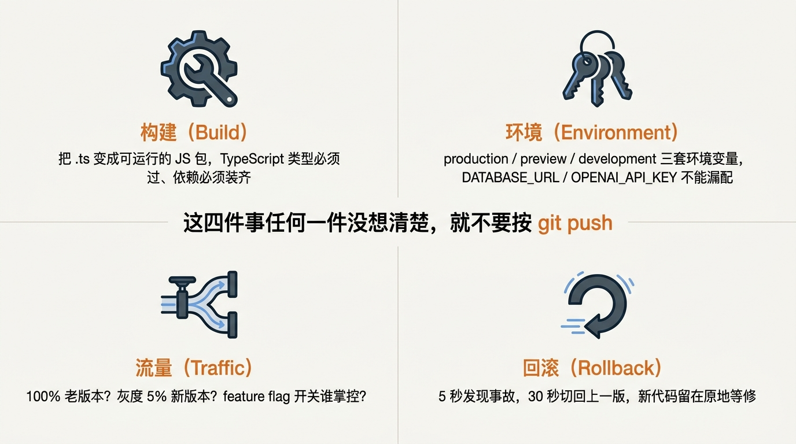
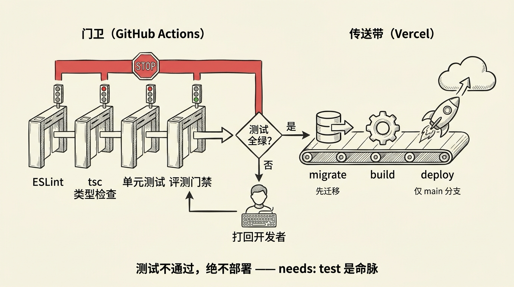
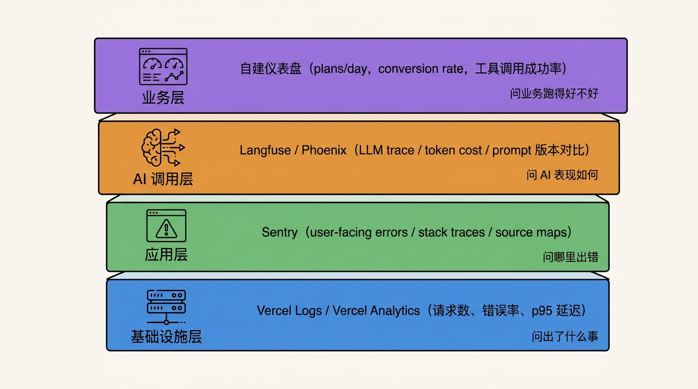

# 第 28 节 · 部署上线 + 持续迭代：CI/CD、灰度、模型迁移


<!-- 图片说明（给图片代理）：
风格：手绘信息图，温暖暖色 + 蓝灰双调
内容：一条从 git push 到用户手机的"最后一公里"流水线。
左侧：开发者按下 git push，本地代码气泡飞出
中间：四个关卡像传送带闸门——CI 测试（图标：试管）→ Vercel 部署（图标：火箭）→ 灰度阀门（图标：分流阀）→ 监控仪表盘
右侧：一只手拿手机的用户，屏幕上是 SSP 的对话界面
顶部一行金句「写完代码不算完，到用户手里才算完」
中文标注，整体踏实、不夸张
-->

> **预计时长**：阅读 30 分钟 / 实战 90 分钟
> **前置知识**：第 22 节《评测体系》、第 23 节《回归测试与 CI 门禁》、对 Vercel / GitHub 有基础了解
> **本节代码**：`ssp-web` 仓库 `chapter-28` tag · 主要文件 `vercel.json`、`next.config.ts`、`src/lib/ai/config.ts`
>
> **本节知识领域**：`部署与模型迁移`、`成本控制`（对应[知识地图](./knowledge-map.md)演进篇）

凌晨两点，群里炸了。

老板甩来一张截图：「线上 chat 接口报错，OpenAI 那边没问题，是我们的事。」红字一行写着 `FUNCTION_INVOCATION_TIMEOUT`。

我点开 Vercel Dashboard 看日志。一条慢请求，从开始到被掐断整整跑了十几秒，正好撞在函数时长上限的边界。前一天我们刚把模型从一个轻量模型换成更强的，输出 token 多了点，于是踩线。群里有人喊「快回滚」，我打开命令行敲下回滚命令，几秒后告警消失。

那一刻我意识到：我们花了二十多节讲 Agent 怎么造，但用户从来不关心 Agent 内部多漂亮，他们只关心一件事——**打开浏览器它能不能转**。

部署、CI/CD、灰度、监控、回滚，再加上「换个更强的模型」，这是把「我写的代码」变成「用户能用的产品」的最后一公里。这一公里走不通，前面全白搭。这一节就讲怎么走完它：从 `git push` 到用户手机上的对话框，中间要过哪几个关卡，每个关卡怎么把门。

---

## 一、知识铺垫：部署的四个关注点

把「部署」摊开看，本质就四件事。



<!-- 图片说明（给图片代理）：
风格：信息图，扁平专业风
内容：4 宫格，每格一个关注点 + 图标 + 一句话：
  1. 构建（齿轮+扳手）：把 .ts 变成可运行的 JS，类型必须过、依赖必须齐
  2. 环境（钥匙串）：production / preview / development 三套环境变量，密钥不能漏配
  3. 流量（分流阀）：100% 老流量？灰度 5% 新版？开关谁掌控？
  4. 回滚（U-turn 箭头）：几秒发现事故，几十秒切回稳定部署
中间一行金句「这四件事任何一件没想清楚，就别按 git push」
中文标注
-->

**1. 构建（Build）**：本地的 `.ts` / `.tsx` 怎么变成生产环境能跑的 JS。这一步要做 TypeScript 类型检查、ESLint、依赖安装、Next.js 编译。任何一项失败，部署就该被卡住。

**2. 环境（Environment）**：production / preview / development 三套环境变量。`DATABASE_URL` 在生产指向真实库、在预览指向沙箱库；`OPENAI_API_KEY` 在生产用真实额度、在预览用受限的开发 key——免得一个测试 PR 把生产额度烧光。

**3. 流量（Traffic）**：新代码要不要先放给 5% 用户跑两天？新旧两套怎么并存？开关谁来控？这是「灰度」要解决的事。

**4. 回滚（Rollback）**：事故不是「会不会」发生，是「什么时候」发生。你要在多少秒内把流量切回上一个稳定部署？回滚是不是真的瞬时？数据库结构改过的话，回滚代码后还能读吗？

这四件事彼此咬合：构建出问题就部署不动，环境出问题就部署成功却启动失败，流量没控好就一发不可收拾，回滚不顺就把事故无限拉长。

> **划重点**：把这四件事任何一件留到事故当晚才想，你都会很被动。生产部署体系是**预演**出来的，不是临时**搭**出来的。

---

## 二、核心讲解

### 28.1 为什么 SSP 跑在 Vercel：runtime 与 Fluid compute

Next.js 是 Vercel 出的，在 Vercel 上跑 Next.js 16 是一等公民。但比「同宗同源」更实在的，是两个工程理由。

**第一，AI 路由默认且应当走 Node.js runtime**。Next.js 16 的 Route Segment Config 里，`runtime` 取值是 `'nodejs'`（默认）或 `'edge'`。官方有两条硬约束要记牢：**Edge runtime 不支持 Cache Components**，且 **Edge runtime 不能用于 Proxy**（`proxy.ts` 跑 Node.js runtime）。`ssp-web` 的 `/api/chat` 没有显式声明 `runtime`，因此走默认 Node.js——这是对的：它要用 `bcryptjs`、读数据库、跑多步工具调用循环，Edge 的受限环境不合适。

| 维度 | Node.js runtime（默认） | Edge runtime |
|:---|:---|:---|
| Node API / npm 原生包 | 全部可用（如 `bcryptjs` / `xlsx`） | 受限（Web 标准 API 子集） |
| 冷启动 | 相对慢 | 更快、更轻 |
| 适合 | 完整 Agent 后端、读 DB/密钥、长流式 | 低延迟、轻量、边缘个性化 |
| Cache Components | 支持 | 不支持 |

**第二，Vercel 在 2025-04-23 起对新项目默认启用 Fluid compute**。它解决的痛点很具体：传统 serverless 一个请求占一个实例，而 AI 负载大半时间在等模型吐 token，机器空转浪费钱。Fluid 用 Active CPU 计费——只在 CPU 真正干活时计费，等模型返回的 I/O 空档不计 CPU 费。这对「LLM 推理、长跑 Agent」这类 I/O 密集、间歇空闲的负载很省钱。启用 Fluid 后，各 plan 的默认函数时长也提升到约 300 秒。

> **小提醒**：上面的「300 秒」「Active CPU」这类数字会随官方调整，引用时以 Vercel 官方页面当时值为准，不要当成永久事实。

### 28.2 maxDuration：一个真实的配置不一致

`ssp-web` 的 `/api/chat/route.ts` 顶部有这两行（真实存在）：

```ts
// src/app/api/chat/route.ts:22-23
export const dynamic = "force-dynamic";
export const maxDuration = 120;
```

`force-dynamic` 强制该路由每次请求都动态执行、不缓存，这对实时对话是正确选择。`maxDuration = 120` 想把函数时长上限抬到 120 秒。

但 `vercel.json` 里另有一套口径（也真实存在）：

```json
// vercel.json（ssp-web 真实配置）
{
  "regions": ["iad1"],
  "functions": {
    "src/app/api/**/*.ts": {
      "maxDuration": 30
    }
  }
}
```

> **看这里 →**：`route.ts` 声明 120 秒，`vercel.json` 却把 `src/app/api/**/*.ts` 限到 30 秒。两处口径不一致时，**平台侧 `vercel.json` 的配置实际生效**。要真正拉长流式上限，两处都要改，且受所在 plan 的时长上限约束。这是个真实的工程坑——和「`vercel.json` 写 `iad1`、README 写 `hkg1`，以 `vercel.json` 为准」是同一类「配置以平台文件为准」的提醒。

为什么部署区域选 `iad1`（美东弗吉尼亚）？因为 `ssp-web` 用 Neon（serverless Postgres，在 us-east）+ OpenAI 兼容端点，把函数放 `iad1` 让函数到数据库、到模型 API 的链路都走美东内网，延迟更稳。

### 28.3 next.config.ts 与 Cache Components

`ssp-web` 的 `next.config.ts` 极简，只有一项：

```ts
// next.config.ts（ssp-web 真实配置）
const nextConfig: NextConfig = {
  serverExternalPackages: ["bcryptjs", "xlsx"],
};
export default nextConfig;
```

`serverExternalPackages` 把两个 Node 原生依赖排除出打包，让它们在服务端以原生方式加载——这正好呼应了 28.1 为什么 chat 路由必须走 Node.js runtime。

Next.js 16 还带来了 **Cache Components**（`use cache` 指令 + Partial Prerendering）：缓存完全 opt-in，默认所有动态代码请求时执行，要缓存才显式声明。`ssp-web` 当前**未开启** Cache Components，实时对话链路走 `force-dynamic`、不依赖缓存失效那套 API。下面这段属示意：

```ts
// next.config.ts（示意，非项目实际代码）
const nextConfig = {
  cacheComponents: true,  // 开启后默认动态、缓存才 opt-in
};
```

> **小提醒**：`use cache` 不能直接放进 Route Handler 的请求处理逻辑里，需要抽到可缓存的 helper 函数。课程引用 `use cache` / `cacheComponents` 一律按「（示意，非项目实际代码）」处理。

### 28.4 CI/CD：GitHub Actions 当门卫，Vercel 当传送带

Vercel 自带 Git 集成（push 自动部署），但**不要只靠它**——它不会替你跑测试、lint、类型检查。正确姿势是：**GitHub Actions 当门卫，Vercel 当传送带**。



<!-- 图片说明（给图片代理）：
风格：信息图，横向流水线，扁平专业风
内容：从左到右两段。
  第一段「门卫（GitHub Actions）」：四个串联闸门——ESLint → tsc 类型检查 → 单元测试 → 评测门禁；任一红灯整条卡住
  中间一个判断菱形「测试全绿？」，否→打回开发者，是→放行
  第二段「传送带（Vercel）」：migrate（数据库箭头，标注“先迁移”）→ build（齿轮）→ deploy（火箭，标注“仅 main 分支”）
底部一行小字「测试不通过，绝不部署 —— needs: test 是命脉」
中文标注
-->


```yaml
# .github/workflows/deploy.yml（示意，建议放进 ssp-web）
name: Deploy
on:
  push:
    branches: [main]
  pull_request:

jobs:
  test:
    runs-on: ubuntu-latest
    steps:
      - uses: actions/checkout@v4
      - uses: actions/setup-node@v4
        with: { node-version: 20 }
      - run: npm ci
      - run: npm run lint
      - run: npx tsc --noEmit
      - run: npm test
      - run: npm run eval:smoke   # 第 23 节的评测门禁
        env:
          OPENAI_API_KEY: ${{ secrets.OPENAI_API_KEY_TEST }}

  deploy:
    needs: test
    if: github.ref == 'refs/heads/main'
    runs-on: ubuntu-latest
    steps:
      - uses: actions/checkout@v4
      - run: npx tsx scripts/migrate.ts     # 先迁移，再部署
        env:
          DATABASE_URL: ${{ secrets.DATABASE_URL_PROD }}
      - run: npx vercel deploy --prod --token=${{ secrets.VERCEL_TOKEN }}
```

> **看这里 →**：`needs: test` 是整套流程的命脉——**测试不过，绝不部署**。这一行能拦掉一大批生产事故。PR 来时第一段 `test` 仍会跑，给 reviewer 清晰信号；`deploy` 因为 `if: github.ref == 'refs/heads/main'` 被跳过，PR 的预览交给 Vercel Git 集成。

注意 Next.js 16 移除了 `next lint` 命令，`next build` 也不再自动跑 lint，所以 CI 里要显式跑 ESLint 与 `tsc --noEmit`。

### 28.5 数据库迁移在 CI 里跑，且在部署之前

`drizzle-kit` 有三个相关命令，含义不同：

| 命令 | 用途 | 适合 |
|:---|:---|:---|
| `drizzle-kit push` | 直接同步 schema 到 DB，不生成文件 | 仅开发期 |
| `drizzle-kit generate` | 从 schema 变化生成 SQL 迁移文件 | 上线前 |
| `drizzle-kit migrate` | 把 SQL 迁移应用到 DB | 生产 |

`ssp-web` 开发期用 `drizzle-kit push` 同步结构（README 有记录，仓库未提交独立的 SQL 迁移目录）。但生产期把 `push` 当迁移用是危险的：出错没有 SQL 文件可追溯、没有审计记录。正确做法是 `generate` + `migrate` 双步：

```ts
// scripts/migrate.ts（示意，非项目实际代码）
import { drizzle } from "drizzle-orm/neon-http";
import { migrate } from "drizzle-orm/neon-http/migrator";
import { neon } from "@neondatabase/serverless";

const db = drizzle(neon(process.env.DATABASE_URL!));
await migrate(db, { migrationsFolder: "./drizzle" });
```

迁移**要在部署之前**跑，两个原因：一是顺序保证——先迁移再部署，新代码上线时结构已就绪；反过来会有几秒「新代码读不到新表」的窗口期，用户报错。二是别在预览跑——预览用沙箱库，迁移逻辑要用 `if: github.ref == 'refs/heads/main'` 显式只在生产执行。

### 28.6 灰度发布：三种粒度

灰度的核心命题：**新代码怎么先暴露给小部分用户，验证两天再全量**？

**粒度 1 · 预览部署**：每个 PR 自动有独立 URL，merge 前分享给团队或内测用户跑两天，这是最便宜的灰度。

**粒度 2 · feature flag（Vercel Edge Config）**：

```ts
// proxy.ts（示意，非项目实际代码）
import { get } from "@vercel/edge-config";

export default async function proxy(request: NextRequest) {
  const useNewModel = await get<boolean>("feature_new_model");
  const sid = request.cookies.get("ssp-anon-session")?.value ?? "";
  // 5% 流量按 session hash 分桶
  if (useNewModel && hashToBucket(sid) < 5) {
    return NextResponse.rewrite(new URL("/api/chat-next", request.url));
  }
  return NextResponse.next();
}
```

Edge Config 读延迟极低，适合布尔 / 简单字符串配置，在 Dashboard 改个值即可全球快速生效。

**粒度 3 · alias 切流**：把新部署挂一个 alias（如 `canary.ssp-web.com`），在 DNS / 负载均衡层把一小部分流量打过去。粒度最粗但最透明。

更复杂的灰度（按用户分群、按地域、按 A/B 实验组）可接 GrowthBook 或 LaunchDarkly。**SSP 默认推荐**：起步用 Edge Config，要做 A/B 实验再升级 GrowthBook。

### 28.7 模型迁移：从轻量模型升到更强模型

第 21 节讲过成本，但成本只是模型迁移的一面。`ssp-web` 把模型选择全部交给环境变量，迁移友好——这是关键前提：

```ts
// src/lib/ai/config.ts（真实结构，节选）
export function getOpenAIConfig(): OpenAIConfig {
  const apiKey = readRequiredEnv("OPENAI_API_KEY");
  const model = readRequiredEnv("OPENAI_MODEL");   // 必填，无默认值
  const baseURL =
    process.env.OPENAI_URL?.trim() ||
    process.env.OPENAI_BASE_URL?.trim() ||
    "https://api.openai.com/v1";
  // cr_ 前缀通常是中转网关 key，未配 baseURL 时直接抛错，不静默回退官方
  if (apiKey.startsWith("cr_") && !process.env.OPENAI_URL?.trim()
      && !process.env.OPENAI_BASE_URL?.trim()) {
    throw new Error("OPENAI_URL not set for relay key (cr_).");
  }
  return { baseURL, apiKey, model };
}
```

> **看这里 →**：`model` 和 `baseURL` 都来自环境变量，`OPENAI_MODEL` 是**必填、无默认值**。换模型不改一行业务代码——改环境变量就行。

完整的模型迁移要走五步，每步都不能省。

**第一步 · 选型对照**。把「任务类型 → 推荐档位」固化成一棵决策树（价格截至 2026-05-30，单位 USD / 每百万 token，以官方为准）：

```text
任务需要强推理 / 多步规划 / 复杂代码？
├─ 是 → 旗舰档：gpt-5.5（$5/$30） / claude-opus-4.8（$5/$25） / gemini-3.1-pro（$2/$12，≤200K）
└─ 否 ↓
生产主力对话 / 工具调用 / 中等复杂度？（多数 Agent 落于此）
├─ 是 → 主力档：gpt-5.4-mini（$0.75/$4.50） / claude-sonnet-4.6（$3/$15） / gemini-2.5-flash（$0.30/$2.50）
└─ 否 ↓
高吞吐 / 低成本 / 简单（分类、抽取、字段校验）？
└─ 是 → 最省档：gpt-5.4-nano（$0.20/$1.25） / claude-haiku-4.5（$1/$5） / gemini-2.5-flash-lite（$0.10/$0.40）
```

`ssp-web` 的对话链路是「低温度 + 多步工具调用（`stopWhen: stepCountIs(8)`）+ 规则引擎产出结构化结果」，本质是**主力对话档**任务。从一个轻量模型升级时，`gpt-5.4-mini` / `claude-haiku-4.5` / `gemini-2.5-flash` 都是同价位带的合理候选；要更强的工具编排稳定性可上 `gpt-5.4` / `claude-sonnet-4.6`。

**第二步 · 改接入层**。迁到 OpenAI 新模型只改 `OPENAI_MODEL`；迁到 Claude 换 `@ai-sdk/anthropic`，迁到 Gemini 换 `@ai-sdk/google`——得益于 AI SDK v6 的 provider 抽象，业务代码（`streamText` / `tool()` / `stopWhen`）基本不动：

```ts
// 当前（OpenAI 兼容端点）
import { createOpenAI } from "@ai-sdk/openai";
const openai = createOpenAI({ apiKey, baseURL });
return streamText({ model: openai(model), tools, stopWhen: stepCountIs(8) });

// 迁到 Anthropic（示意，非项目实际代码）
import { createAnthropic } from "@ai-sdk/anthropic";
const anthropic = createAnthropic({ apiKey });
return streamText({ model: anthropic("claude-sonnet-4.6"), tools, stopWhen: stepCountIs(8) });
```

**第三步 · 重测 Prompt 与工具行为**。不同家族对 System Prompt 的「听话程度」和工具触发时机不同。换模型后要验证三件事：工具是否被正确触发、多步是否在产出结论前提前停止、结构化入参是否仍满足 Zod schema（必要时启用 tool call repair，让模型按校验错误重出参）。还要注意价格重算——按真实流量的输入/输出 token 比例和缓存命中率算总账，别只看输入单价；Anthropic 较新的模型换了分词器，相同文本可能多吃约 35% token，账单会偏高，务必实测。

**第四步 · 评测保底**。迁移前先用第 23 节的评测集跑「现模型 vs 候选模型」双路对比：

```yaml
# 评测配置（示意，非项目实际代码）
providers:
  - openai:gpt-5.4-mini
  - anthropic:claude-sonnet-4.6
tests:
  - vars: { input: "73 年女性，事业编，上海" }
    assert:
      - type: contains
        value: "55"        # 法定退休年龄关键数字
      - type: cost
        threshold: 0.005
```

跑完看哪个候选在你的核心用例上通过率最高、成本与延迟可接受，再做决定。

**第五步 · 灰度切流**。决定上新模型后，先在 5% 流量跑两天（用 28.6 的 feature flag + 分桶），观察错误率、p95 延迟、token 成本、用户满意度。指标稳定再扩到 50%、100%。因为模型名是环境变量，异常时一键回滚。

> **划重点**：把换模型当「改个模型名字符串」是常见踩坑。实际要重测 Prompt、工具行为、重算成本、走评测和灰度。模型名做成配置，异常一键回滚。

### 28.8 政策更新：改 JSON 不动代码

SSP 的核心设计之一，是 24 条政策规则用 JSONLogic 表达。政策一变，**改 JSON 即可，不动 TypeScript**——这本身就是一种「零代码部署」。

`ssp-web` 的发布有两层灰度。第一层是 `rule_sets` 表的 `status` 字段：`draft`（只有管理员可见）→ `staging`（内测）→ `production`（全量），三档逐级 promote。第二层是 `publishes` 表记录每次 promote 的 `gate_results`——把第 23 节的评测结果作为门禁，**评测不过就不能 promote**。

实际操作（在管理后台 `/admin/publish`）：编辑某条规则 → 系统自动跑该规则内置的 examples + 全量回归 → 通过则标 `staging` → 内测两天看指标 → 再 promote 到 `production`。整个过程不需要 `git push`、不需要重新部署。这是把「政策即代码」做对的关键。

### 28.9 线上监控：四个层次

部署上线只是开始。生产跑起来后，你要知道四件事：它有没有挂、慢不慢、烧不烧钱、答得对不对。



<!-- 图片说明（给图片代理）：
风格：信息图，4 层堆叠
内容：从下到上 4 层：
  1. 基础设施层（蓝色）：Vercel Logs / Analytics（请求数、错误率、p95 延迟）
  2. 应用层（绿色）：Sentry（前端报错 / 后端异常 / source map）
  3. AI 调用层（橙色）：Langfuse / Phoenix（LLM trace / token cost / Prompt 版本）
  4. 业务层（紫色）：自建仪表盘（每日 plans、转化率、工具调用成功率）
右侧每层一句：「出了什么事」「哪里出错」「AI 表现如何」「业务跑得好不好」
中文标注
-->

**第 1 层 · 基础设施**：Vercel Logs + Analytics，开箱即用，看请求数、错误率、p95 延迟。**第 2 层 · 应用错误**：Sentry 抓前端 JS 错误 + 后端异常，source map 自动定位源码。**第 3 层 · AI 调用**：Langfuse / Phoenix 记每次 `streamText` 的 trace、token 成本、Prompt 版本。AI SDK v6 一个开关就接上：

```ts
// 在 streamText 里加一行
streamText({
  experimental_telemetry: { isEnabled: true, functionId: "chat" },
});
```

**第 4 层 · 业务监控**：直接查 Postgres，比如「每天有多少 plan 计算成功」「每个工具的调用成功率」。

监控不是装上就完，**必须配 alert**：5xx 错误率超 1%（5 分钟窗口）报 Slack；`/api/chat` p95 延迟超 8 秒报 Slack；单日 LLM 开销超阈值报 Slack（成本失控预警）。

> **划重点**：监控的目的不是「看数据」，是「出事时第一时间被叫醒」。没配 alert 的监控等于没监控。

### 28.10 回滚：几十秒切回稳定部署

回滚是最该练熟、又最少被练熟的技能。出事时你不该在搜「Vercel 怎么回滚」。

**代码回滚（瞬时）**：用 `vercel rollback` 指向一个稳定部署，或在 Dashboard 里把某个稳定部署 Promote 到 Production。它重新指向 alias、不重新构建，通常几秒完成。

**数据库回滚（要小心）**：代码能瞬时回滚，但数据库结构不会跟着回滚。

- ✅ **加列、加表**：旧代码读不到新列但不会崩——回滚安全。
- ❌ **删列、改类型、加 NOT NULL**：旧代码不知道列没了，会立刻崩——回滚不安全。

正确做法是**扩展—收缩（expand-contract）四阶段迁移**，每阶段都能独立回滚：

```
阶段 1（扩展）：DB 加新列（可空），代码同时读新旧两列
阶段 2：代码只写新列、读时优先新列
阶段 3：观察 7 天，确认旧列没人引用
阶段 4（收缩）：DB 删旧列
```

> **小提醒**：Neon 的 `neon-http` driver 不支持交互式事务，跑大批量迁移时切到 WebSocket driver。建议每月做一次「假事故」演练——故意部署一个坏版本，掐表看团队从发现到回滚要多久，目标控制在几分钟内。

---

## 三、举一反三

部署的四个关注点（构建 / 环境 / 流量 / 回滚）是通用的，换个领域看怎么套用。

**法律咨询 Agent**：环境上把案例库与法条库分两套，预览用脱敏样本、生产用真实数据；流量上因为失误成本极高，灰度比例从 5% 降到 1%、灰度周期从两天拉到两周；回滚上要把「免责声明」等关键文案也纳入 Prompt 版本控制。

**医疗问诊 Agent**：构建阶段加密钥扫描，确保不泄露任何敏感信息；环境上生产必须跑在合规区域；流量上不能「按比例随机」灰度，必须先在医生内测、再开放给特定人群；回滚时要保证对话历史完整，不能因结构变化丢数据。

**金融报税助手**：报税季是流量峰值，构建产物要预热；把「税年」当一等环境变量，预览与生产分别指向不同税年；峰值期间绝不做大版本上线；税务计算结果必须可重放——把「税年 + 政策包版本」写进每条记录，回滚后能精准重算。

**核心原则不变**：构建有门禁、环境有隔离、流量有灰度、回滚有预案。这是 SaaS 行业沉淀多年的最佳实践，AI 应用是它们的最新场景，不是特例。

---

## 四、小结


<!-- 图片说明（给图片代理）：
风格：手绘小结卡片，温暖暖色
内容：一张大卡片，标题「部署上线七件套」
左半 4 个关注点（构建 / 环境 / 流量 / 回滚）
右半 7 个落地工具：
  1. Vercel + Fluid compute（火箭）
  2. GitHub Actions 门卫（齿轮链）
  3. drizzle-kit migrate（数据库 + 箭头）
  4. Edge Config feature flag（开关）
  5. Langfuse + Sentry（仪表盘）
  6. vercel rollback（U-turn）
  7. 评测门禁（试管 + 通行证）
底部金句「写完代码不算完，到用户手里才算完」
中文标注
-->

部署是把「我写的」变成「用户能用的」中间那道桥。这道桥有四根桥墩：构建、环境、流量、回滚，缺一不可。再加上「模型迁移」这件演进篇专属的事，就构成了 Agent 走向生产的最后一公里。

**核心要点回顾**：

- ✅ AI 路由走 Node.js runtime（Edge 不支持 Cache Components、不能用于 Proxy），Fluid compute 的 Active CPU 计费利好 I/O 密集 Agent
- ✅ `route.ts` 的 `maxDuration = 120` 与 `vercel.json` 的 30 不一致，**以平台 `vercel.json` 为准**；区域 `iad1` 不是 `hkg1`
- ✅ `next.config.ts` 只有 `serverExternalPackages`；Cache Components 当前未开启，引用按「示意」处理
- ✅ CI/CD 双阶段：GitHub Actions 当门卫（lint / tsc / test / 评测），`needs: test` 是命脉；Vercel 当传送带
- ✅ 数据库迁移用 `generate` + `migrate`，在部署之前跑、只在生产跑
- ✅ 灰度三粒度：预览部署 → Edge Config feature flag 5% → 50% → 100%
- ✅ 模型迁移五步：选型对照 → 改接入层 → 重测 Prompt/工具 → 评测保底 → 灰度切流；模型名是环境变量，一键回滚
- ✅ 政策更新走 `draft / staging / production` 三档 + 评测门禁，不动代码
- ✅ 监控四层（Vercel / Sentry / Langfuse / 自建）必须配 alert；回滚瞬时，数据库用扩展—收缩四阶段

---

## 思考题

1. **【开放题】**：你的项目什么时候该上灰度发布、什么场景不需要？拿你正在做的某个 feature，用「用户量 / 错误成本 / 验证周期 / 回滚成本」四个维度评估，写下「该不该上灰度」的结论与理由。
2. **【动手题】**：把 `ssp-web` fork 到自己的 GitHub，用本节的 `vercel.json` + `.github/workflows/deploy.yml` 模板部署到 Vercel 预览环境。**验收标准**：(a) push 到任意分支，PR 里能看到预览 URL；(b) 预览 URL 能正常发起一次完整对话；(c) `vercel logs` 能看到这次请求；(d) push 到 main 前，CI 里 `tsc` + lint + test 三个 step 都通过。
3. **【选做】**：给 CI 加上评测门禁——每次 PR 跑 20 条核心用例，通过率低于 90% 自动拦截合并。提交一个 PR，故意改坏 System Prompt 的某段，证明门禁能拦住。

---

## 面试题

**Q1.【基础】【主题：部署与模型迁移】** Agent 的流式对话 API 在 Next.js 16 里应该选 Node.js runtime 还是 Edge runtime？为什么？`maxDuration` 又是干什么的？
<details><summary>参考解答</summary>

应选 **Node.js runtime**（也是默认）。原因：

1. 流式 Agent 后端通常要用 Node 原生包（如 `ssp-web` 的 `bcryptjs` / `xlsx`）、读数据库、跑多步工具调用循环，Edge 的受限 Web API 子集不够用。
2. 官方两条硬约束：**Edge runtime 不支持 Cache Components**，且 **Edge 不能用于 Proxy**（`proxy.ts` 跑 Node.js runtime）。
3. Edge 适合的是低延迟、轻量、边缘个性化响应，不是完整 Agent 后端。

`maxDuration`（`export const maxDuration = <秒>`）设置该路由服务端逻辑的最大执行秒数，部署平台会从构建输出读取它来施加限制。AI 流式 / 多步循环可能跑很久，必须显式调高，否则会被默认超时掐断。`ssp-web` 的 `route.ts` 写了 120，但 `vercel.json` 把该路径限到 30——**平台 `vercel.json` 实际生效**，要拉长两处都要改且受 plan 上限约束。

</details>

**Q2.【进阶】【主题：部署与模型迁移】** 数据库迁移为什么要在「部署之前」跑、且只在生产分支跑？回滚代码时数据库结构带来什么风险，怎么规避？
<details><summary>参考解答</summary>

**为什么部署之前跑**：先迁移再部署，新代码上线时数据库结构已就绪；反过来（先部署再迁移）会有几秒「新代码读不到新表」的窗口期，用户报错。**为什么只在生产分支**：预览环境用沙箱库，若每次部署都跑迁移会污染沙箱，所以用 `if: github.ref == 'refs/heads/main'` 显式只在生产执行。命令上用 `drizzle-kit generate`（生成 SQL 文件、可审计可追溯）+ `drizzle-kit migrate`（应用），而不是把开发期的 `drizzle-kit push` 直接用到生产。

**回滚风险**：代码能瞬时回滚，但数据库结构不会跟着回滚。加列、加表安全（旧代码读不到新列但不崩）；删列、改类型、加 NOT NULL 不安全（旧代码会立刻崩）。**规避办法是扩展—收缩四阶段迁移**：阶段 1 加可空新列、代码读新旧两列；阶段 2 只写新列；阶段 3 观察确认旧列无人引用；阶段 4 才删旧列。每阶段都能独立回滚，实现近似零停机。

</details>

**Q3.【深挖】【主题：部署与模型迁移】** 把线上 Agent 从一个轻量模型迁到更强模型，为什么不能只「改个模型名」？请给出一套可落地的迁移流程。
<details><summary>参考解答</summary>

不能只改名，因为换模型会牵动 Prompt 听话度、工具触发行为、成本结构等多个面。可落地的五步流程：

1. **选型对照**：按「强推理 / 主力对话 / 高吞吐低成本」三档匹配候选模型；SSP 的多步工具调用属主力对话档，候选如 `gpt-5.4-mini` / `claude-sonnet-4.6` / `gemini-2.5-flash`。
2. **改接入层**：`ssp-web` 的模型名是 `OPENAI_MODEL` 环境变量（必填、无默认），同 provider 只改环境变量；跨 provider 借 AI SDK v6 抽象换 `@ai-sdk/anthropic`、`@ai-sdk/google`，业务代码基本不动。
3. **重测 Prompt 与工具行为**：验证工具是否正确触发、多步是否提前停、结构化入参是否仍过 Zod schema（必要时开 tool call repair）；并按真实输入/输出 token 比例重算成本（注意有的新模型换了分词器、相同文本多吃约 35% token）。
4. **评测保底**：用评测集跑「现模型 vs 候选」双路对比，看通过率、成本、延迟，再决定。
5. **灰度切流**：先 5% 流量跑两天，观察错误率、p95、成本、满意度，稳定再扩到 50%、100%。模型名是配置，异常一键回滚。

口径：把换模型当「改字符串」是常见踩坑，必须重测 + 评测 + 灰度。

</details>

**Q4.【进阶】【主题：成本控制】** SSP 用规则引擎 + 环境变量化模型的设计，对「部署期与上线后的成本控制」分别带来什么好处？
<details><summary>参考解答</summary>

两类好处：

1. **政策更新零代码、零部署成本**：24 条政策规则用 JSONLogic 表达，政策一变改 JSON 即可，不动 TypeScript、不需 `git push`、不需重新部署。配套 `draft / staging / production` 三档 + 评测门禁（`publishes.gate_results`），让政策变更的发布成本和风险都很低。
2. **模型成本可灵活调优、可灰度**：模型名是 `OPENAI_MODEL` 环境变量，可以按成本/质量在 nano / mini / 旗舰档之间切换，简单子任务下沉到便宜模型、难步骤才上旗舰；换模型不改代码、能灰度、能一键回滚。再叠加 Prompt Caching（缓存命中价约为标准输入价的 10%）和 Batch API（离线任务约 5 折），能把账单显著压下来。

此外 Fluid compute 的 Active CPU 计费只在 CPU 干活时计费，等模型返回的 I/O 空档不计 CPU 费，对 SSP 这种 I/O 密集的 Agent 直接省钱。

</details>

---

## 延伸阅读

- [Next.js 16 发布公告（2025-10-21）](https://nextjs.org/blog/next-16)
- [Vercel — Functions 限制与时长](https://vercel.com/docs/functions/limitations)
- [Vercel — Active CPU 计费（Fluid compute）](https://vercel.com/changelog/lower-pricing-with-active-cpu-pricing-for-fluid-compute)
- [Drizzle ORM — Migrations 指南](https://orm.drizzle.team/docs/migrations)
- [Langfuse — Tracing for the AI SDK](https://langfuse.com/docs/integrations/vercel-ai-sdk)

---

[← 上一节：第 27 节 多 Agent 协作模式：planner-executor / A2A](./28-multi-agent.md) · [📚 目录](./README.md) · [下一节：结束语 你以为这是终点 →](./30-epilogue.md)
