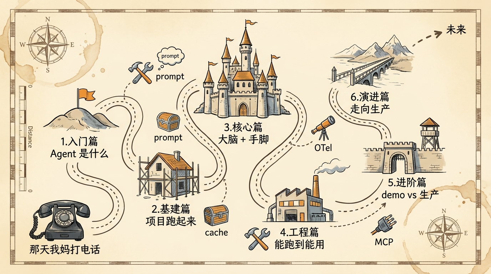
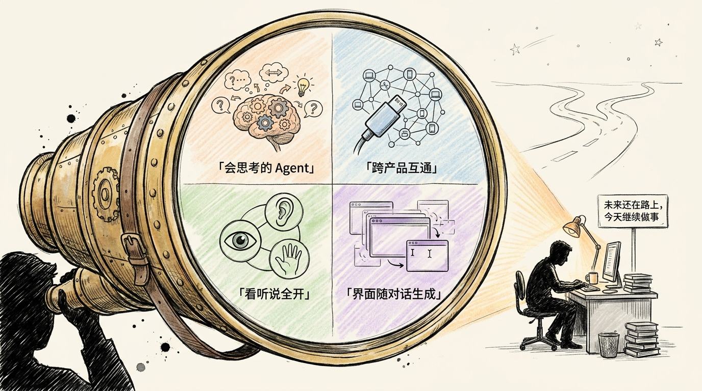

# 结束语｜你以为这是终点，其实只是起点

<!-- 图片说明（给图片代理）：
风格：手绘风格封面，温暖治愈系，呼应 prologue-hero 的视觉语言
内容：开篇词那个开发者还坐在书桌前，桌上摊开的"政策红头文件"上多了几张便签纸（写着 SSP / Tool Calling / 规则引擎 / RAG / MCP / Eval），笔记本电脑屏幕上 SSP 对话界面里有一段对话已经完成。
窗外的天色从清晨变成了傍晚，桌上多了一杯凉透的咖啡。
开发者抬头望向窗外，远处地平线上有一条路向远方延伸，路上有几个模糊的人影在行走（暗示「读完这门课的你」）。
色调：米白底 + 橙黄主色 + 钢笔黑线条（保持和 prologue-hero 同一调性）
中文标题手写在右上角：「你以为这是终点，其实只是起点」
不要写英文，不要科技感太强
-->

> **预计时长**：阅读 15 分钟
> **前置知识**：读完第 1–28 节主线（至少跟着跑过几节代码）
> **配套项目**：`ssp-web` 仓库（[github.com/jiji262/ssp-web](https://github.com/jiji262/ssp-web)）

---

还记得开篇词那通电话吗？

我妈在电话那头问："你能不能帮我算算，我到底什么时候能退休。"我打开 ChatGPT，得到一个错答案；又问 Claude，得到另一个不一样的错答案。差一个月，差几千块钱。那天晚上我没睡好，第二天开始写 SSP。

后来这门课里反复出现的那个人——小赵，1975 年的上海女性，第一次打开 SSP 时只敢小声问一句"我能不能算一下"——其实就是我妈的影子，也是无数个拿不准政策、不敢自己下结论的普通人。整门课从头到尾，做的就是一件事：**让一个 Agent 替小赵把那个数算对**。

如果这门课是一段旅程，它的起点是一通电话，终点呢——其实没有终点。但你读到这里，已经走完了很长一段路。这一路我们到底做了什么？我想和你一起回头看看。

---

## 一、我们一起走过的路

整门课像一栋楼，从地基往上盖了六层。

**地基（开篇 + 序章）**：先把"为什么要做这件事"讲清楚。大模型（LLM）算不对社保不是它笨，是它本来就不该被用来做"事实必须 100% 准确"的计算。SSP 的解法只有一句话——**让 LLM 当嘴，让规则引擎当脑**。这个分工是整门课的元命题。

**入门篇（第 1–4 节）**：搞清楚 Agent 到底是什么。Agent 不是"会聊天的 LLM"，是"能自己决定下一步做什么"的系统。我们用 ReAct 循环讲清了 Agent 的心智模型，用四层架构（交互层 / 推理层 / 执行层 / 持久层）画出了 SSP 的骨架（详见[第 4 节《SSP 四层架构鸟瞰》](./05-four-layer-architecture.md)）。

**基建篇（第 5–8 节）**：把项目跑起来。从技术选型逻辑（Next.js 16 + AI SDK v6 + Drizzle + Neon），到几十行代码起一个最小可用 Agent，再到数据持久化与认证——这一段是从"能跑 demo"到"能上生产"的脚手架。

**核心篇（第 9–15 节）**：给 Agent 装大脑和手脚。System Prompt 分层设计、动态上下文注入、Tool Calling 协议本质、用 Zod 写 Schema、三个工具的编排、规则引擎 DSL 与 JSONLogic 实现——这是整门课最厚的一段。读完你会从"知道 `streamText` 怎么调"变成"理解为什么这么调"。

**工程篇（第 16–21 节）**：从能跑到能用。前端流式集成、工具结果卡片（Tool Result Card）、记忆系统、调试与可观测、安全护栏、成本控制——这一段教你让一个能跑的 Agent 经得起真实流量的考验。

**进阶篇 + 演进篇（第 22–28 节）**：区分 demo 和生产。三层评测模型、回归测试与 CI 门禁、MCP（Model Context Protocol）、RAG 增强、多 Agent 协作的真实代价、CI/CD 与灰度发布——把"上线"两个字拆成了一张可执行的清单（详见[第 28 节《部署上线 + 持续迭代》](./29-deploy-and-beyond.md)）。

加餐 3 篇 + FAQ 30+ 条作为补充，让"读完之后还能回来查"成为可能。

<!-- 图片说明（给图片代理）：
风格：手绘地图风格，像旅行手册的章节图
内容：一张完整的"课程地图"，从左下角"那通退休电话"出发，蜿蜒曲折地穿过 6 个篇章地标：
  1. 入门篇（小山丘，标注「Agent 是什么」）
  2. 基建篇（搭脚手架的房子，标注「项目跑起来」）
  3. 核心篇（最大的城堡，标注「大脑 + 手脚」）—— 这一段地势最高
  4. 工程篇（工具厂房，标注「能跑到能用」）
  5. 进阶篇（带瞭望塔的关卡，标注「demo vs 生产」）
  6. 演进篇（一座桥，通向远处的山脉，标注「走向生产」）
路线终点是右上角的「未来」，但路并没有结束，箭头继续向远方延伸。
路两旁散落着几个小图标：Tool / Prompt / Cache / OTel / MCP（暗示一路上的工具）
色调：米黄底 + 钢笔黑线条 + 几处橙黄重点
中文标注，整体感觉像旅行日记
-->

走完这一路，你不只是看了 30 节文章。你拥有了一个完整的、可运行的、能上生产的 AI Agent——`ssp-web` 仓库就在那里，每一节对应一个 git tag，`git checkout chapter-NN` 就能看到当节学完后的完整代码状态。

---

## 二、现在的你，能做什么

如果你**真的**跟着代码走过一遍（不是只看不练），你现在应该能独立做这些事：

**Agent 设计层面**

- 看一眼业务需求，立刻判断它该用 Chatbot / RAG / Tool Calling / Autonomous 哪一类架构
- 用 ReAct 心智模型把模糊需求拆成 Agent 的具体动作
- 写一份分层、可演进、可灰度的 System Prompt
- 用 Zod 写出 LLM 一眼读懂、自带边界提示的 Tool Schema

**工程实现层面**

- 用 AI SDK v6 起一个能流式输出、能调工具、能持久化的 Agent
- 把 Drizzle + Neon Postgres 接进 Next.js 16，schema、queries、migration 三件套齐全
- 写一个稳定运行的规则引擎（JSONLogic 规则 + 决策表 + 证据链）
- 把工具结果从一坨 JSON 变成有按钮的 Tool Result Card

**上生产层面**

- 设计三层评测体系（单元 / 集成 / 回归）+ LLM-as-Judge 评分
- 写一份 CI 门禁，挡住"Prompt 改坏了"的提交
- 灰度发布新模型 / 新 Prompt（5% → 50% → 100%）
- 出事时 30 秒内 `vercel rollback` 回滚到上一个稳定部署

**跨领域迁移层面**

- 把"LLM + 规则引擎"的架构换到法律、医疗、报税、健身——核心架构不变，业务逻辑替换
- 知道什么时候该上 RAG、什么时候不该；什么时候该上多 Agent、什么时候是过度设计

这些不是"理论上知道"，是"打开 IDE 就能写"。如果你做到了这一步，你已经走过了大多数人停下的地方——很多"AI 应用开发者"仍停在"能调通 `streamText`"这一层，没有走完到"上线 + 监控 + 迭代"那一段。

---

## 三、下一步往哪走

「你已经拿到驾照了，但路还很长。」这是一位前辈跟我说过的话，我转送给你。下面是三个时间尺度的建议，按你的状态、目标、时间投入挑一条走。

### 短期（1–3 个月）：把 SSP 改成你自己领域的 Agent

这是消化这门课最快的路径。挑一个你有领域知识的方向开始 fork——法律咨询、税务规划、健身计划、教育规划、职业发展都行。

具体节奏：

1. 第 1 周：把 `ssp-web` 完整 clone 下来，按章节走一遍，每节代码自己敲一遍
2. 第 2 周：梳理你领域的规则——多少条"硬规则"（必须 100% 准确）、多少条"软建议"（LLM 自由发挥）
3. 第 3 周：把规则引擎里的 JSONLogic 规则替换成你领域的；System Prompt 也按分层重写一遍
4. 第 4 周：跑通本地链路，自己当用户提 20 个真实问题，看 Agent 答得怎么样
5. 第 5–12 周：写评测、调 Prompt、部署 preview、灰度内测、拿真实反馈迭代两版

这三个月走完，你会**真的**拥有一个上线的 AI 产品。这比任何证书都值钱。

### 中期（3–6 个月）：过一遍完整的生产周期

demo 项目用户少、问题少。中期目标是经历一次真正的"生产事故 → 排查 → 修复 → 复盘"循环：

- 凑够 1000+ 真实用户对话，让 Agent 暴露 demo 永远遇不到的问题
- 经历至少一次模型迁移，体感不同模型的实际差异
- 经历至少一次重大事故：超时、超 quota、Prompt 改坏、DB schema 出问题
- 建立完整的可观测体系，每周看一次报表
- 做一次 A/B 实验：两个 Prompt、两个模型、两种 UI 对比

走完这一段，你的简历不再需要"我读过某某 AI 课"，你有真实的 AI 工程经验。两次踩坑和复盘，可以直接读[加餐 2《生产事故复盘》](./extras/02-postmortems.md)与[加餐 3《模型迁移实战》](./extras/03-model-migration.md)对照着走。

### 长期（6+ 个月）：参与生态，把它当事业

确认自己真心想在这个领域深耕之后，可以做的事：

- 给 MCP 生态贡献一个高质量 server
- 给 AI SDK / Promptfoo / DeepEval 这类基础设施提 PR 或 metric
- 写技术博客，把踩过的坑、做过的实验写出来——不是为流量，是为了让自己的思考变清晰
- 关注前沿：Reasoning 模型、Computer Use、多模态 Agent

<!-- 图片说明（给图片代理）：
风格：手绘风格，未来感但不科幻
内容：一幅望远镜的视角图。读者拿着望远镜望向远方，望远镜里看到 4 个未来场景：
  1. Reasoning 模型（图标：大脑齿轮 + 思考气泡），标注「会推理的 Agent」
  2. MCP / A2A 生态（图标：插头 + 网络节点），标注「跨产品互通」
  3. 多模态 Agent（图标：眼睛 + 耳朵 + 手），标注「看听说全开」
  4. 生成式 UI（图标：动态变形的 UI 框），标注「界面随对话生成」
望远镜外面的现实世界仍然是开发者坐在桌前敲代码——暗示「未来还在路上，今天继续做事」
色调：米白底 + 钢笔黑线条 + 望远镜里的内容用淡彩色突出
中文标注
-->

不管走哪一条，**最重要的事始终是回到工程**：让一个 Agent 真实地服务真实的用户。不要去做"AI 影响人类未来"那种宏大叙事，就做一件小事——帮小赵算清楚她什么时候能退休。这件小事如果你做对了，背后的方法论可以套在任何领域。

写这门课的时候是 2026 年。未来 12–24 个月，Reasoning 模型大概率会让多步规划框架的价值下降，Prompt 工程的重心会从"教模型怎么思考"转向"告诉模型边界在哪里"；MCP 很可能成为工具生态的事实标准；多模态和生成式 UI 会从原型走向更多生产场景。这些判断两年后回头看大概率一半对一半错，但**那一半对的，足够指导你今天的选择**。

---

## 四、致谢

最后想说几句感谢的话。

**感谢 `ssp-web` 仓库的所有贡献者。** 这门课不是凭空而来，它建立在一个真实运行的开源项目上。每一节代码引用都能在 [github.com/jiji262/ssp-web](https://github.com/jiji262/ssp-web) 找到对应位置。如果这个项目不存在，这门课最多写成"理论指南"，不会有任何动手感。

**感谢开放的技术写作生态。** 课程里引用的数据、benchmark、博客、论文，来自 Anthropic Engineering、OpenAI Cookbook、Vercel Engineering、LangChain、Promptfoo / DeepEval / Inspect AI 的公开文档。是这些公开资料让中文读者能在今天同步获得世界一流的 AI 工程实践。

**感谢一路读到这里的你。** 30 节课、十几万字、上百张配图，读完需要几十个小时的投入。在这个信息爆炸的年代，愿意拿出这么多时间连续学一件事的人已经不多了。**你愿意走完这段，本身就是一种稀缺的品质。**

如果你在读的过程中产生了任何思考、改进意见、bug 报告，或者只是想说一声"我读完了"——欢迎来项目仓库提 issue：[github.com/jiji262/ssp-web/issues](https://github.com/jiji262/ssp-web/issues)。每一个真实的 issue 都会让这门课变得更好。读之前若还有疑问没解开，先翻一翻 [FAQ 30+ 条](./faq.md)，大概率已经有答案。

---

## 五、最后想说的话

写这门课的过程，和我写 SSP 的过程很像——一开始觉得"这件事很简单嘛"，写到一半发现"原来这里还有这么多坑"，写完才意识到"我以为讲清楚的东西，其实还有十层没讲"。

每一节都比预期长，每一张图都比预期改了好几遍，每一段代码都要回 `ssp-web` 仓库确认行号。不是因为我追求完美，是因为这门课面对的读者是认真的——你们值得这么写。

如果你读完之后**少走了一段弯路**——少踩一个我踩过的坑、少花一笔我花过的钱、少熬一个我熬过的夜——这门课对我而言就值了。如果你读完之后**做出了一个真正帮到人的产品**——哪怕只服务 100 个用户、只解决一个像"我什么时候能退休"这么具体的问题——那就远远超值了。

AI 这件事最迷人的地方，不在于"它能做什么"，而在于它**让普通开发者也有能力造出真正帮到人的东西**。一个人，一杯咖啡，一台笔记本，一个夜晚——以前需要一个团队、一笔预算、一年时间才能做的产品，今天你一个人就能做。

还记得小赵第一次用 SSP 时那句小心翼翼的"我能不能算一下"吗？这门课真正的句号，不是你读完这一页，而是**有一天，某个像小赵一样的人，因为你写的 Agent，第一次把自己的那个数算清楚了**。

这门课只是其中一段路。前面的路更长、更难，也更精彩。

愿你的 Agent，能算对每一个数。
愿你的代码，能帮到每一个真实的人。
愿你下一次按下 `git push` 的时候，比这次更确信自己在做对的事情。

我们路上再见。

---

[← 上一节：第 28 节 部署上线 + 持续迭代](./29-deploy-and-beyond.md) · [📚 目录](./README.md) · [下一节：加餐 1 管理后台 →](./extras/01-admin-cms.md)

---

> **配套项目**：[github.com/jiji262/ssp-web](https://github.com/jiji262/ssp-web)
> **反馈与讨论**：[ssp-web issues](https://github.com/jiji262/ssp-web/issues)
> **加餐与 FAQ**：[加餐 1 管理后台](./extras/01-admin-cms.md) · [加餐 2 生产事故复盘](./extras/02-postmortems.md) · [加餐 3 模型迁移实战](./extras/03-model-migration.md) · [FAQ 30+](./faq.md)
