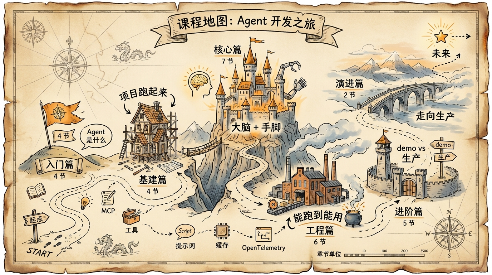

# 手把手带你造一个真能算社保的 AI Agent

> **从概念到生产·30 节体系课·配套真实可部署项目**


---

## 这门课在讲什么

2025 年延迟退休政策落地，几亿人都在问同一个问题：**我到底什么时候能退休？**

但你去问任何一个大语言模型，它大概率会一本正经地胡说八道——退休年龄取决于性别、出生年月、岗位类型，叠加延迟退休渐进调整表，养老最低缴费年限从 15 年逐步提到 20 年……每个变量都让 LLM 翻车。

这门课要做的事情很简单：**教你造一个不会算错数的 AI Agent。**

不是玩具 demo，不是 "Hello World" 教学项目。是一个真正跑在生产环境、服务真实用户的社保规划助手——SSP（Shanghai Social Security Planner）。

> **核心思路**：用户跟 AI 聊天 → AI 调工具去算 → 规则引擎出结果 → AI 翻译成人话。四步闭环，数字零幻觉。

---

## 配套实战项目

**🔗 项目仓库**：[https://github.com/jiji262/ssp-web](https://github.com/jiji262/ssp-web)

每节末尾对应一个 git tag（`chapter-NN`），你可以 `git checkout chapter-04` 看到当节学习完成后的完整代码状态。

**技术栈一览**：

| 干什么的 | 用什么 | 为什么选它 |
|---|---|---|
| 全栈框架 | **Next.js 16** | App Router + Cache Components + Turbopack |
| 前端 | **React 19** | `useChat` + assistant-ui 双栈 |
| AI 接入 | **Vercel AI SDK v6** | `streamText` + `tool()` 标准化调用 |
| 大模型 | **gpt-4o-mini**（默认）| 性价比之王，加餐 3 有迁移到 Claude / GPT-5 的完整方案 |
| 数据库 | **Neon Postgres + pgvector** | Serverless Postgres + 向量检索 |
| ORM | **Drizzle 0.45+** | 类型安全 + SQL 可控 |
| 认证 | **NextAuth v5** | 匿名会话 + 邮箱登录 |
| 规则引擎 | **JSONLogic** | 24 条政策规则，改 JSON 不改代码 |
| 工具协议 | **MCP**（加餐演示） | 标准化工具接口，可跨 Agent 共享；非主仓库依赖，见加餐《MCP 实战》 |
| UI 库 | **Tailwind v4** + 自研组件 | 统一设计语言 |

---

## 这门课适合谁

写过 Web 应用就行。React、Next.js、Node.js，你熟悉其中任何一个就够了。

**不需要**机器学习背景。**不需要**懂 Transformer 原理。**不需要**买 GPU。

你需要的只是对"怎么把 AI 做成靠谱产品"这件事的好奇心。

---

## 学完你能做什么

- 独立设计、实现、部署一个生产级 Tool-Calling Agent
- 看懂 Vercel AI SDK / OpenAI SDK / Anthropic SDK 的源码
- 搭一套 Prompt + Tool + Rule Engine + Memory 的完整闭环
- 设计评测体系，用 CI 门禁防止 AI 变蠢
- 在真实流量下做模型迁移（4o-mini → Claude / GPT-5）
- 给 Agent 接 MCP 工具、RAG 知识库、多 Agent 协作

---

## 学习路径图



```
开篇词 → 序章 →
[入门篇 4 节] → [基建篇 4 节] → [核心篇 7 节] → [工程篇 6 节] → [进阶篇 5 节] → [演进篇 2 节]
→ 结束语
+ 加餐 3 篇 + FAQ
```

---

## 完整目录

### 📖 开篇

| | 标题 | 一句话剧透 |
|:---:|---|---|
| | [开篇词：为什么要做这门课](./00-prologue.md) | 这门课的来由、能学到什么、怎么读 |
| 00 | [序章：延迟退休来了，我们造了个 AI 帮你算社保](./01-introduction.md) | 项目缘起、四层架构鸟瞰、5 分钟快速体验 |

### 🎯 入门篇 · 搞清楚 Agent 是什么

| | 标题 | 一句话剧透 |
|:---:|---|---|
| 01 | [AI Agent 到底是个啥：和聊天机器人的本质区别](./02-what-is-agent.md) | 一句话区分 Agent 与 Chatbot |
| 02 | [Agent 四代进化史：从规则匹配到自主规划](./03-agent-evolution.md) | Chatbot → RAG → Tool-Calling → Autonomous |
| 03 | [ReAct 循环：感知-推理-行动的三板斧](./04-react-loop.md) | Agent 的核心心智模型 |
| 04 | [SSP 四层架构鸟瞰：用一张图看懂整个系统](./05-four-layer-architecture.md) | 交互层 / 推理层 / 执行层 / 持久层 |

### 🛠 基建篇 · 把项目跑起来

| | 标题 | 一句话剧透 |
|:---:|---|---|
| 05 | [2026 年 AI 全栈技术栈选型逻辑](./06-tech-stack-2026.md) | "够用就好"选型哲学 |
| 06 | [20 行代码起 Agent：用 streamText + tool() 搭最小可用版本](./07-minimal-agent.md) | 最少代码起跑 |
| 07 | [数据库与 ORM：Drizzle + Neon Postgres 实战](./08-database-and-drizzle.md) | Serverless Postgres + 类型安全 |
| 08 | [认证与多用户：NextAuth v5 + 匿名会话设计](./09-auth-and-session.md) | 用户分流、PII 边界 |

### 🧠 核心篇 · 给 Agent 装大脑和手脚

| | 标题 | 一句话剧透 |
|:---:|---|---|
| 09 | [System Prompt 11 节分层设计法](./10-system-prompt.md) | 分层、可演进、可灰度的 prompt |
| 10 | [动态上下文注入与 Prompt 版本管理](./11-dynamic-context.md) | 让 prompt 跟着对话演进 |
| 11 | [Tool Calling 协议：LLM 从来不执行代码](./12-tool-calling.md) | 协议本质 + 三方协议对比 |
| 12 | [用 Zod 写出一份"自解释"的 Tool Schema](./13-zod-schema.md) | 模型读得懂的 schema |
| 13 | [三个工具的编排策略：何时调、谁先谁后](./14-tool-orchestration.md) | computePlan / updateProfile / validateField |
| 14 | [规则引擎 DSL：把 24 条政策变成可执行 JSON](./15-rule-engine-dsl.md) | 决策表 + 政策即代码 |
| 15 | [JSONLogic 引擎实现：从 ctx 到证据链](./16-jsonlogic-execution.md) | 引擎流水线 + Trace |

### ⚙️ 工程篇 · 从能跑到能用

| | 标题 | 一句话剧透 |
|:---:|---|---|
| 16 | [前端集成：useChat + assistant-ui 双栈对比](./17-frontend-integration.md) | 选哪个、为什么 |
| 17 | [工具结果卡片化：把 JSON 变成有按钮的 UI](./18-streaming-ui.md) | Tool Result Card 设计 |
| 18 | [Agent 记忆系统：从金鱼脑到过目不忘](./19-agent-memory.md) | 四种记忆 + 持久化 |
| 19 | [调试与可观测：Agent 出 bug 怎么查](./20-debugging-observability.md) | 五步排查法 + Trace 可视化 |
| 20 | [安全护栏：Prompt 注入、PII、速率限制四层防御](./21-security-guardrails.md) | 攻防视角 + 实战代码 |
| 21 | [成本控制：Token 预算、缓存、模型分级](./22-cost-control.md) | 把成本砍到 30% 的路径 |

### 🚀 进阶篇 · 区分 demo 和生产

| | 标题 | 一句话剧透 |
|:---:|---|---|
| 22 | [评测体系：三层评测模型与 LLM-as-Judge](./23-evaluation.md) | 单元 / 集成 / 回归 |
| 23 | [回归测试与 CI 门禁：让 Agent 不变蠢](./24-regression-testing.md) | GitHub Actions + Promptfoo |
| 24 | [MCP 协议拆解：让工具变成可共享服务](./25-mcp-protocol.md) | spec、生态、与 Tool Calling 的关系 |
| 25 | [MCP 实战：把 SSP 工具变成 MCP Server](./26-mcp-in-practice.md) | 把项目改造成 MCP 玩家 |
| 26 | [RAG 增强与混合检索：给 Agent 接上知识库](./27-rag-augmentation.md) | pgvector + 重排 |

### 🎁 演进篇 · 走向生产

| | 标题 | 一句话剧透 |
|:---:|---|---|
| 27 | [多 Agent 协作模式：planner-executor / A2A](./28-multi-agent.md) | 通信模式、任务拆解、结果聚合 |
| 28 | [部署上线 + 持续迭代：CI/CD、灰度、模型迁移](./29-deploy-and-beyond.md) | 从 git push 到用户手里的最后一公里 |

### 📒 结束 + 加餐

| | 标题 | 一句话剧透 |
|:---:|---|---|
| | [结束语：你以为这是终点，其实只是起点](./30-epilogue.md) | 课程回顾 + 下一步建议 + 未来展望 |
| 加餐 1 | [管理后台是怎么炼成的](./extras/01-admin-cms.md) | admin / rule-sets / cases / params 设计 |
| 加餐 2 | [那些年我们踩过的坑（生产事故复盘 5 则）](./extras/02-postmortems.md) | 真实事故复盘 |
| 加餐 3 | [模型迁移实战：从 gpt-4o-mini 到 GPT-5.5 / Claude / Gemini](./extras/03-model-migration.md) | 真实迁移路径 + 评测对比 |
| FAQ | [高频问题集锦（30+ 条）](./faq.md) | 学员高频问题 + 解决方案 |

---

## 怎么读这门课

**赶时间？** 读 开篇 + 序章 + 01 + 11，三小时搞懂 Agent 全貌。

**想动手？** 序章有"5 分钟快速体验"，clone `ssp-web` 跑一遍再说。

**想学透？** 从开篇按顺序走完，预计 **30-40 小时**。每节独立成篇，中间被打断了随时能续上。

**要上线？** 看完核心篇 + 工程篇 + 演进篇，能直接 fork `ssp-web` 改造上线。

**要深挖？** 加餐 + FAQ + 延伸阅读 + 思考题，是区分"看完"和"内化"的分水岭。

> 每节都用 SSP 真实生产代码当例子，但讲的是通用 Agent 设计原则。学完换个领域——法律、金融、医疗——架构直接复用。

---

## 项目源码结构

```
ssp-web/
├── src/lib/ai/          # Agent 核心逻辑（核心篇：09-13）
├── src/lib/engine/      # 规则引擎（核心篇：14-15）
├── src/lib/db/          # 数据持久化（基建篇 + 工程篇）
├── src/components/chat/ # 前端对话界面（工程篇：16-17）
├── src/lib/security/    # 安全护栏（工程篇：20）
├── src/lib/auth.ts      # 认证（基建篇：08）
├── src/app/api/chat/    # API 路由入口（贯穿全篇）
├── src/app/admin/       # 管理后台（加餐 1）
└── dsl/ssp_dsl_v1/      # 规则 DSL（核心篇：14）
```

---

准备好了？我们从一个让几亿人头疼的问题开始。

**[👉 进入开篇词](./00-prologue.md)**

---

## 致谢

- 实战项目 [`ssp-web`](https://github.com/jiji262/ssp-web) 由社区贡献者维护
- 课程图片由 baoyu skill 系列辅助生成
- 所有代码示例基于真实生产项目，截至 2026 年 4 月有效

---

> **状态**：v1.0（2026-04-25）
> **反馈**：欢迎在 [ssp-web](https://github.com/jiji262/ssp-web/issues) 提 issue
