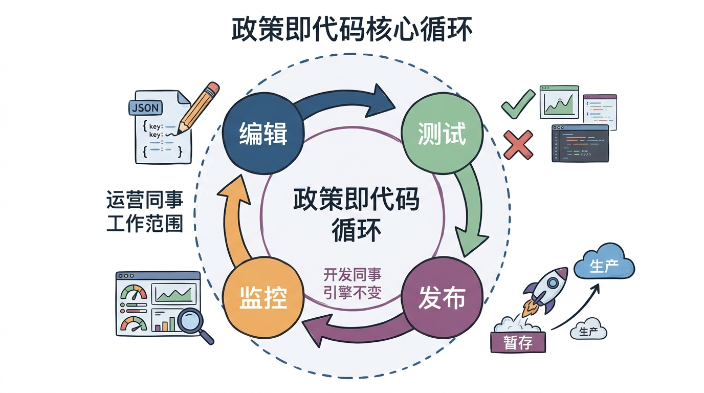
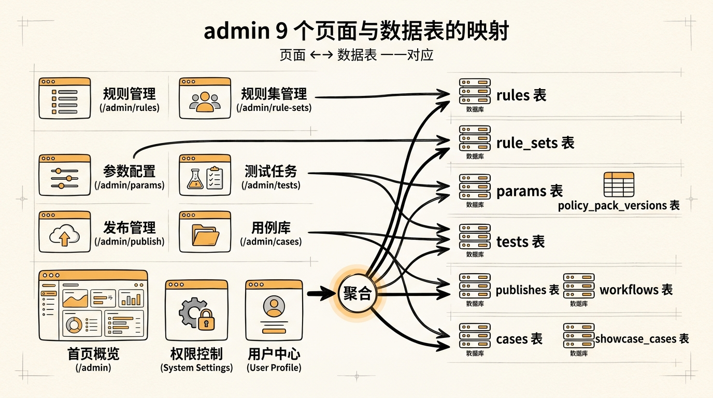
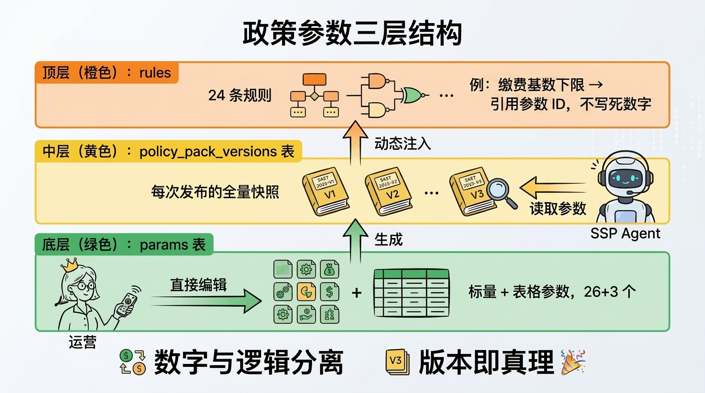
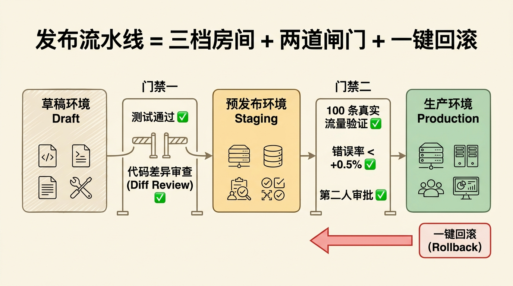
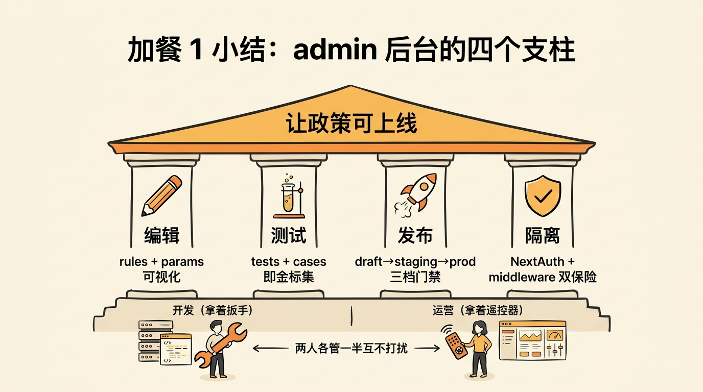

## 加餐 1｜管理后台是怎么炼成的：让运营改规则，不让开发改代码


<!-- 图片说明（给图片代理）：
风格：手绘风格 hero 封面，温暖治愈系
内容：画面分两半。左半边是"C 端用户"——一个普通中年女性坐在沙发上，手里拿着手机，屏幕上是 SSP 聊天界面，正在问"我73年生的能什么时候退休"。右半边是"后台运营人员"——一个戴眼镜的中年男性坐在办公桌前，电脑屏幕上是一个 CMS 编辑器界面，正在拖拽规则、调整参数。
两人中间用一条钢笔黑色的"看不见的线"连接（从他屏幕里编辑的规则，流向她屏幕上的回答）
桌上散落几张便签：「政策更新」「24 小时上线」「不要叫开发」
色调：米白底 + 橙黄主色 + 钢笔黑线条
中文标题手写在右上角：「不会写代码也能上线政策」
-->

> **预计时长**：阅读 25 分钟 / 实战 45 分钟
> **前置知识**：第 14 节《规则引擎 DSL》、第 15 节《JSONLogic 引擎实现》
> **本节代码**：`ssp-web` 仓库 `chapter-admin` 分支 · 主要文件 `src/app/admin/`、`src/app/api/admin/`、`src/lib/admin/`
> **温馨提示**：这是加餐，不是必修。但如果你打算把这门课的架构搬去做"政策即代码"类的真实项目，这一节是绕不开的。

---

那是某个周五晚上 11 点，运营群里突然蹦出一条消息：「人社局刚发了新通知，2026 年 7 月起退休年龄调整表又改了三档。明天上午 9 点之前必须更新到产品里。」

群里一片寂静。开发同事在度假，技术负责人电话关机。一线运营盯着那张 Excel 表，眉头越拧越紧——表里有十几条规则都要改，每条改完还得测一遍，测完还得"上线"。

"上线"是什么？是 git push 一下吗？是部署到服务器吗？她不知道。她只知道——明天 9 点用户进来一问，AI 还在用旧规则算，就要出公关事故。

这不是虚构故事。这是任何一个把 AI 放进政策类业务的团队，都会遇到的真实瞬间。

**SSP 这套架构的解法是**：从第一天就假设"政策永远在变，开发永远不在"。所以在 C 端聊天界面之外，我们造了一整套管理后台——`/admin` 这个隐藏入口下面，藏着 9 个页面、20 多个 API、6 张专门的数据库表。它的存在就是为了让那位运营同事，在那个周五晚上 11 点，能够**不依赖任何开发，独立把新规则上线**。

这一节，我们就来拆这套后台。

---

## 一、知识铺垫：什么是"政策即代码"

先说清楚一个概念。

传统业务系统里，规则是写死在代码里的。比如"60 岁以上免运费"——开发同事在 `checkout.ts` 里写一句 `if (age >= 60) shipping = 0`，年龄变了？改代码、提 PR、过 review、合并、部署。一套流程下来，最快也要 2 小时。

这套流程在大部分业务里都没问题。但碰上**政策类业务**，立刻就会卡死：

- 政策每年甚至每季度都改
- 改的不是"代码逻辑"，而是"参数"或"分支"
- 决策方（人社局 / 运营 / 政策研究员）和执行方（开发）是两批人
- 决策方比开发更懂规则细节，但他们写不出 TypeScript

于是有了一个简单但深刻的想法：**把规则从代码里抽出来，放到数据库里；让运营直接编辑数据库（通过 UI），开发只维护"读规则的引擎"。**

这就是"政策即代码"（Policy as Code）的核心思想。在第 14 节《规则引擎 DSL》里，你已经看到 SSP 是怎么把 24 条政策表达成 JSONLogic 规则的。但那一节只讲了"规则长什么样"，没讲"规则怎么改、怎么测、怎么发"。

这套"改、测、发"的工作流，全部需要一个管理后台来承载。



<!-- 图片说明（给图片代理）：
风格：手绘风格信息图，扁平专业风
内容：一个圆形循环图，4 个节点用箭头连接：
1. 编辑（左上）— 一支铅笔在 JSON 上画
2. 测试（右上）— 一个绿色 ✅ 和红色 ❌ 的对比
3. 发布（右下）— 一个火箭从 staging 升到 production
4. 监控（左下）— 一个仪表盘
中间写着「政策即代码循环」
箭头方向：编辑 → 测试 → 发布 → 监控 → 编辑
最外圈用虚线表示"运营同事"的工作范围
最内圈是"开发同事"的引擎不变
中文标注，整体感觉像产品手册的核心图
-->

这套循环里，**编辑、测试、发布、监控**四件事全由运营完成，开发只需要在循环最里面维护"引擎读规则"那一段。这就是 SSP admin 的底层假设。

---

## 二、核心讲解

### 2.1 SSP admin 的整体结构：9 个页面、20 多个 API、6 张表

很多人初次看到 SSP 的 admin，第一反应是"功能不算多嘛"。这是个误解——真正撑起这套后台的不是页面数量，而是**页面、API、表三层之间的强映射关系**。

打开 `ssp-web` 仓库的 `src/app/admin/` 目录，结构非常工整：

```
src/app/admin/
├── layout.tsx                    # admin 通用布局（侧边栏 + 顶部）
├── AdminLayoutClient.tsx          # 客户端布局组件
├── page.tsx                       # /admin 首页（Dashboard）
├── login/
│   └── page.tsx                   # 登录页
├── rules/
│   ├── page.tsx                   # 规则列表
│   └── [ruleId]/page.tsx          # 单条规则详情 + 编辑器
├── rule-sets/
│   └── page.tsx                   # 规则集（执行顺序）
├── params/
│   └── page.tsx                   # 政策参数编辑
├── tests/
│   └── page.tsx                   # 测试中心
├── publish/
│   └── page.tsx                   # 发布流水线
└── cases/
    └── page.tsx                   # 用例库
```

> **看这里 →**：admin 是一整个**独立子树**，和 C 端 `(client)` 完全分开。这种隔离不是偶然——它对应的是数据库层面、鉴权层面、UI 设计层面三重分离。

每个页面对应数据库的一张表（详见第 6 节《代码事实表》第 6.1 小节）：

| 页面 | 对应表 | 干什么 |
|---|---|---|
| `/admin` | （聚合统计） | Dashboard，显示规则数、参数数、测试通过率 |
| `/admin/rules` | `rules` | 24 条 JSONLogic 规则的 CRUD |
| `/admin/rule-sets` | `rule_sets` | 规则的**执行顺序**（哪个先跑、哪个后跑） |
| `/admin/params` | `params` + `policy_pack_versions` | 政策参数（基数、费率等）+ 版本快照 |
| `/admin/tests` | `tests` | 单条规则的测试用例（input → expected） |
| `/admin/publish` | `publishes` + `workflows` | 发布流水线（draft → staging → production）|
| `/admin/cases` | `cases` + `showcase_cases` | 上线后真实用户的疑难问题 |

> **小提醒**：这里有个非常容易踩坑的地方——`rule_sets` 和 `rules` 是分开的两张表。`rules` 存"规则本体"（决策表 + JSONLogic），`rule_sets` 存"执行顺序"（一个 JSON 数组列出 rule_id）。改顺序不动规则，改规则不动顺序——这是为了让两个动作可以独立 review、独立发布。

API 层也是同样工整。每个 admin 页面背后对应 3-5 个 API endpoint（参考代码事实表第 3.1 节）：

| 操作类别 | API 路径 | HTTP 方法 |
|---|---|---|
| 规则 CRUD | `/api/admin/rules` 系列 | GET / POST / PATCH / DELETE |
| 规则版本管理 | `/api/admin/rules/[ruleId]/versions` | GET |
| 规则试运行 | `/api/admin/rules/[ruleId]/run-example` | POST |
| 参数 CRUD | `/api/admin/params` 系列 | GET / POST / PATCH |
| 测试运行 | `/api/admin/tests/[testId]/run` | POST |
| 发布操作 | `/api/admin/publish/{promote,rollback,history}` | POST / GET |
| Excel 导入 | `/api/admin/import/{cases,tests}` | POST |
| Dashboard 统计 | `/api/admin/stats` | GET |

所有这些 admin API 都被 `src/proxy.ts`（实际是 Next.js middleware，文件名误导）的 `matcher: ["/admin/:path*", "/api/admin/:path*"]` 统一保护，未登录直接 401。这种"页面 + API + middleware"三位一体的隔离，是后续 admin 安全的基石。



<!-- 图片说明（给图片代理）：
风格：手绘信息图，扁平专业风
内容：左侧 9 个 admin 页面（用浏览器窗口图标），右侧 6 张数据库表（用桌面/数据库图标），中间用钢笔黑色箭头连接：
- /admin/rules → rules 表
- /admin/rule-sets → rule_sets 表
- /admin/params → params + policy_pack_versions 表
- /admin/tests → tests 表
- /admin/publish → publishes + workflows 表
- /admin/cases → cases + showcase_cases 表
- /admin（首页） → 多张表（聚合）
顶部写「页面 ←→ 数据表 一一对应」
色调：米白底 + 橙黄/钢笔黑
中文标注
-->

### 2.2 规则编辑器：可视化编辑 24 条 JSONLogic

进入 `/admin/rules` 页面，看到的是一张规则列表表格，按 `module`（normalization / retirement / pension / medical / unemployment / subsidy / reminder / plan / gate）分类筛选。

点进任意一条，比如 `R-110-LOOKUP-LEGAL-RETIRE-AGE`，进入详情页（`src/app/admin/rules/[ruleId]/page.tsx`，371 行）。这里有三块：

**左半屏：JSON 编辑器**（基于 `JsonEditor` 组件）

```json
{
  "rule_id": "R-110-LOOKUP-LEGAL-RETIRE-AGE",
  "name": "查表+算法计算法定退休年龄",
  "module": "retirement",
  "decision_table": {
    "hit_policy": "first",
    "rows": [
      {
        "row_id": "row_1_lookup_table",
        "when": { "...": "..." },
        "then": {
          "actions": [
            {
              "type": "lookup",
              "table_param_id": "T-RETIREMENT-AGE-LOOKUP",
              "key": { "...": "..." },
              "into": "calc.legal_retire_age"
            }
          ]
        }
      }
    ]
  }
}
```

运营点击编辑，左侧 JSON 实时变化，右侧立刻显示**用人话翻译过的规则**——"如果用户性别 = 女 且 退休类型 = 工人，则查表 T-RETIREMENT-AGE-LOOKUP，结果存到 calc.legal_retire_age"。

这种"双视图"是规则编辑器最关键的产品设计。运营不需要懂 JSONLogic 语法——她只需要确认右侧那段中文翻译是不是她想要的逻辑。如果不对，左侧改 JSON、右侧立刻更新；如果对，往下走测试。这种"所改即所见"把"懂 JSON"这件事的认知负担从"必须懂"降低到"不一定要懂"。

**右半屏：试运行**

输入一个用户档案（gender=female / birth_year=1973 / female_retire_type=worker50），点"运行"，立刻看到：

- 这条规则**触发了哪一行**（hit row_1）
- **lookup 的结果**是什么（55.5 岁）
- 中间过程的 **trace**（每一步的 ctx 快照）

这个"试运行"不走 LLM、不走 API，直接调引擎里的 `executeSingleRuleInMemory`（`src/lib/engine/orchestrator.ts`），毫秒级返回。

这是另一个值得拆解的设计选择。为什么不让运营直接走 `/api/plan/compute` 这个 C 端用的 API？三个原因：

1. **成本**：C 端 API 走完整流程（24 条规则 + 全套参数），运营试一条规则没必要全跑
2. **隔离**：试运行不能影响生产数据库（不能往 `plans` 表写测试数据）
3. **速度**：in-memory 跑一条规则 < 5ms，调 API 至少 200ms（网络 + 鉴权 + 持久化）

这种"为不同用户场景做不同接口"的设计，在 admin 系统里非常普遍——记住这条原则，可以省掉一堆"为什么不复用 API"的争论。

> **划重点**：让运营**在编辑的同时立刻看到结果**，是规则编辑器最关键的设计。如果改一条规则要等 3 分钟测试跑完，运营就不敢改。所见即所得 + 试运行 + trace 三件套，让"改规则"这件事的心理门槛从"找开发"降到"自己点几下"。

### 2.3 政策参数编辑：把"数字"和"逻辑"分开管

很多人第一次看 SSP 的 admin，会问一个问题：「为什么有 `rules` 还要有 `params`？规则里不是已经有数字了吗？」

答案是：**不能让数字和逻辑放在一起**。

举个例子。政策里有这么一条："上海 2025 年社保缴费基数下限是 7460 元/月"。如果直接写在规则里：

```json
{ "if": [{ ">=": [{"var": "user.salary"}, 7460] }, "..." ] }
```

那 2026 年基数变成 7858，所有引用 7460 的规则都要改。改一个数，PR 改 12 个文件，每个文件都要走 review。荒谬。

SSP 的做法是把"数字"全部抽到 `params` 表里，规则只引用 `param_id`：

```json
{ "if": [{ ">=": [{"var": "user.salary"}, {"var": "params.P-SH-CONTRIB-BASE-LOWER"}] }, "..." ] }
```

`/admin/params` 页面（`src/app/admin/params/page.tsx`，256 行）就是这张参数表的可视化编辑器。两类参数：

| 类型 | 例子 | 编辑方式 |
|---|---|---|
| **scalar**（标量） | `P-SH-CONTRIB-BASE-LOWER = 7460` | 一个输入框 |
| **table**（表格） | `T-RETIREMENT-AGE-LOOKUP`（性别+岗位+出生年→年龄） | 一个表格编辑器 |

整个 `policy_params_shanghai_base.json` 里有 26 个 scalar 参数 + 3 个 table 参数（详见代码事实表第 10.3 节）。运营改任何一个，都不需要碰规则、不需要碰代码。

更深一层的设计在 `policy_pack_versions` 表（`src/lib/db/schema.ts:61-69`）。每次发布参数包，都会创建一个**版本快照**——包含当时全部 29 个参数的完整 JSON。这意味着：

- 历史 conversation 可以追溯到当时用了哪一版参数
- 政策回滚一键搞定（把现役指针指回先前的参数包快照即可）
- A/B 灰度可以同时跑两版参数（5% 用新版 / 95% 用现行版）

这就是政策类业务里**"版本即真理"**的工程化体现。



<!-- 图片说明（给图片代理）：
风格：手绘信息图，扁平专业风
内容：三个横向叠加的层，从下到上：
- 底层（绿色）：params 表（标量 + 表格参数，26+3 个）
- 中层（黄色）：policy_pack_versions 表（每次发布的全量快照）
- 顶层（橙色）：rules（24 条规则，引用参数 ID 而非数字）
左侧小人物（运营）拿着遥控器，能直接编辑底层 params；右侧 SSP Agent 通过中层 versions 读取参数，动态注入到顶层 rules
箭头说明数据流向
中文标注：「数字与逻辑分离」「版本即真理」
-->

### 2.4 用例库：把"上线后翻车"变成"训练资产"

`/admin/cases` 页面（`src/app/admin/cases/page.tsx`，245 行）是 SSP 后台里**最有价值但最容易被忽视**的一块。

它解决的是这样一个场景：

某天运营从客服群里看到一段对话——用户问「我 1973 年女性，但我之前是公务员，去年辞职做自由职业了，现在能按工人 50 岁退休吗？」。AI 回了个错的答案。

这段对话怎么处理？三种选择：

1. **忽略**——下次再说。
2. **手动改**——开发同事修一条规则，但下次同样的问题换个表述又会翻车。
3. **沉淀**——把这条用户消息存进用例库，标注正确答案，作为下次评测的"金标准"。

SSP 选第三种。`/admin/cases` 的工作流是：

- 运营把翻车对话粘贴进来，标 tags（"女性退休"、"职业身份转换"等）
- 系统自动从对话里提取 `user_message` + `ai_response`
- 运营人工标注 `expected_data`（这条用户档案下，正确的 plan 应该长什么样）
- 一键转化为 `tests` 表里的回归测试用例

这个动作之所以重要，是因为它把"上线后真实翻车"这种**最珍贵的训练数据**沉淀下来了。第 23 节《回归测试与 CI 门禁》里讲的"金标集"，绝大多数就是从这里来的。

> **小提醒**：很多团队在做评测时会问"金标集去哪儿找"。答案永远是一样的——**真实用户翻车的对话**就是金矿。但如果你没有一个让运营把它"捞起来"的入口，这些金矿就永远被埋在客服记录里。`/admin/cases` 就是这个入口。

更进一步，`cases` 表（`src/lib/db/schema.ts:162-176`）和 `showcase_cases` 表是分开的：

- **cases**：内部用例库，包含 `creator / post_date / video_id / topics / case_text / transcript_text / tags / is_regression`，记录原始访谈或客服对话
- **showcase_cases**：对外展示库，只有 `case_uid / title / tags / user_message / ai_response / input_data / expected_data / is_published / sort_order`，给 C 端首页"经典案例"模块用

这种"内部数据 / 外部展示"的双表设计也是 admin 系统的常见模式。内部表保留所有原始信息（包括 PII、客服内部备注、修复过程），外部表只暴露脱敏后的精华版本。运营审核通过后，从内部表"一键发布"到外部表——避免直接展示未经审核的数据。

### 2.5 测试发布工作流：改完不能直接生效，要过门禁

来到 SSP admin 最重的一块——`/admin/tests` 和 `/admin/publish`。

**`/admin/tests`**（`src/app/admin/tests/page.tsx`，291 行）：测试中心。每条规则关联多个测试用例（input → expected），随时可以一键跑完整套，看哪条挂了、为什么挂。

```typescript
// src/lib/engine/test-runner.ts:39-69（runTestCase，节选）
export function runTestCase(
  testCase: TestCase,
  allRules: RuleDefinition[],
  baseParams: Record<string, unknown>,
): TestResult {
  // 三层 params 合并：DB baseParams → input.params → params_override
  const mergedParams = { ...baseParams };
  if (testCase.input.params && typeof testCase.input.params === "object") {
    Object.assign(mergedParams, testCase.input.params);
  }
  if (testCase.params_override && typeof testCase.params_override === "object") {
    Object.assign(mergedParams, testCase.params_override);
  }
  // ... 单规则走 executeSingleRuleInMemory，整套走 orchestrateInMemory
  // 最终对 expected 做 deepPartialDiff，diff 为空即 pass
}
```

> **看这里 →**：注意这里有一处工程上的精巧设计——`runTestCase` 的 params 走**三层合并**（DB 基线 → 测试输入里的 `params` → `params_override`），让同一条规则可以在"基线政策"和"假设性政策覆盖"两种环境下分别验证。配合每个测试用例冻结的 `as_of_date`（"在某一天的政策环境下，这条规则的输出应该等于 expected"），即使政策包随时间演进，老用例也不会无故挂掉——因为它们绑定的是当时的政策环境。

**`/admin/publish`**（`src/app/admin/publish/page.tsx`，293 行）：发布流水线。三档：`draft` → `staging` → `production`。

发布工作流（`workflows` 表里定义）的核心约束：

```
draft → staging
  门禁 1：所有关联测试必须通过
  门禁 2：与现役版本的 diff 必须有人 review

staging → production
  门禁 3：staging 上至少跑过 100 条真实流量
  门禁 4：错误率不超过基线 +0.5%
  门禁 5：必须有第二个 admin 账号 approve
```

每次 promote（推进）操作都会写进 `publishes` 表（表结构见 `src/lib/db/schema.ts:103-114`，下面是一条记录的字段示意，非项目实际代码）：

```typescript
// 一条 publishes 记录的字段示意（非项目实际代码）
{
  entity_type: "rule" | "rule_set" | "policy_pack",
  entity_id: "R-110-LOOKUP-LEGAL-RETIRE-AGE",
  from_stage: "draft",
  to_stage: "staging",
  actor: "operator@admin.local",
  gate_results: { tests_passed: 47, total: 47, ... },
  diff: { /* 完整 before/after */ }
}
```

这张表是**整套政策上线的审计日志**。出事时第一个查的就是它——「2026-04-15 14:23:11 谁把 R-200 改坏了」一秒就能查到。

更狠的是：`publishes` 表里存了完整 diff。这意味着任何一次发布都可以**一键回滚**——把"现役版本"指针改回上一条记录的 entity 即可。

这种"diff + actor + timestamp"三件套是审计日志的最小可行结构。任何企业级系统在做合规审查时，第一件事就是问"谁在什么时候改了什么"。SSP 的发布流水线每一次 promote 都自动写满这三个字段，等于把合规要求做进了基础设施——而不是事后再补一层"日志中间件"。

发布工作流（`workflows` 表里定义）的核心是 `gate_results` 字段，它存了**每一道门禁的输出**（下面是该字段的内容示意，非项目实际代码）：

```typescript
// gate_results 字段内容示意（非项目实际代码）
{
  tests_passed: 47,
  total_tests: 47,
  diff_review_by: "policy_lead@admin.local",
  diff_review_at: "2026-04-15T14:20:00Z",
  staging_traffic_count: 132,
  staging_error_rate: 0.003,
  approver: "ops_director@admin.local"
}
```

每一次 promote 都是一次"凭证收集"——所有门禁的证据全部固化到 `publishes` 表里。出事时不需要去翻多个系统的日志，一条 SQL 就能复原整个发布过程。这种"证据本位"的设计，比任何"全员遵守 SOP"的口号都管用。



<!-- 图片说明（给图片代理）：
风格：手绘信息图，扁平专业风
内容：三个横向并列的房间（draft / staging / production），中间有两道闸门，每道闸门上画几个 ✅ 表示门禁条件：
- draft → staging 闸门：测试通过 ✅ + diff review ✅
- staging → production 闸门：100 条真实流量 ✅ + 错误率<+0.5% ✅ + 第二人 approve ✅
最右侧的 production 房间外面有一个"回滚"按钮（带箭头指回 staging）
顶部标题：「发布流水线 = 三档房间 + 两道闸门 + 一键回滚」
色调：米黄底 + 钢笔黑 + 绿色 ✅ + 红色禁止符号
-->

### 2.6 鉴权：NextAuth v5 + 单管理员账号

很多人会以为 admin 后台需要复杂的角色权限系统（RBAC、多角色、细粒度权限）。SSP 的选择极简：**只有一个 admin 账号**。

文件：`src/lib/auth.ts:53` 行（详见代码事实表第 7.1 节）。

```typescript
import NextAuth from "next-auth";
import Credentials from "next-auth/providers/credentials";
import bcrypt from "bcryptjs";

export const { auth, signIn, signOut, handlers } = NextAuth({
  providers: [
    Credentials({
      async authorize(credentials) {
        const adminUsername = process.env.ADMIN_USERNAME;
        const adminPasswordHash = process.env.ADMIN_PASSWORD_HASH;
        if (!adminUsername || !adminPasswordHash) return null;
        if (credentials.username !== adminUsername) return null;
        const isValid = await bcrypt.compare(
          credentials.password as string,
          adminPasswordHash,
        );
        if (!isValid) return null;
        return { id: "admin", name: adminUsername, ... };
      },
    }),
  ],
  session: { strategy: "jwt" },
  pages: { signIn: "/admin/login" },
});
```

**关键事实**：
- 只有 `ADMIN_USERNAME` + `ADMIN_PASSWORD_HASH` 两个环境变量
- bcrypt hash 密码（不是明文也不是 SHA）
- JWT session（**没有 DB session 表**——少一张表少一份维护成本）
- 登录页就一个：`/admin/login`

为什么这么简单？因为 SSP 这个产品形态下，**改规则的人就一个团队**——内部政策研究员 + 运营。他们之间的权限边界靠"流程"管（draft 谁能编辑、promote 需要谁 approve），不靠"账号"管。

如果未来真的需要多账号，加一张 `users` 表 + 改 `authorize` 函数即可。但**先别加**——80% 的中小型 admin 后台都不需要 RBAC，加了反而是负担。

> **小提醒**：这是 SSP 的一个设计原则——**先用最简的方案跑起来，等真的需要复杂方案时再加**。这条原则贯穿整个项目，从单 admin 账号到 in-memory 限流再到 JSONLogic（而不是上 OPA / Drools），都是同一种"够用就好"的取舍。

实际工程经验里，admin 系统的"权限复杂度膨胀"几乎从不源于"业务真的需要"，而是源于"有人觉得应该这样设计"。每多一种角色 = 多一套测试用例 + 多一份运维成本 + 多一个出 bug 的边界。SSP 的选择是把这一切延后到"业务真的喊痛"那一天——通常那一天根本不会到来。

### 2.7 与 C 端的隔离：admin layout vs client layout

最后一块要讲的，是 admin 和 C 端 chat 之间的"物理隔离"。

打开 `src/app/` 目录，看到两个**完全平行**的子树：

```
src/app/
├── (client)/              # C 端，括号是 Next.js 的路由组语法
│   ├── layout.tsx         # C 端布局：Marketing 导航 + 暖色背景
│   ├── page.tsx           # 首页
│   ├── chat/page.tsx      # 聊天页
│   └── cases/page.tsx     # 案例展示
├── admin/                 # 管理后台
│   ├── layout.tsx         # admin 布局：侧边栏 + 顶部
│   └── ...                # 9 个页面
└── api/                   # API 路由
    ├── chat/              # C 端聊天 API（无需登录）
    ├── conversations/     # C 端会话管理
    ├── plan/              # C 端计算 API
    └── admin/             # 管理 API（middleware 强制鉴权）
```

> **看这里 →**：admin 与 client 的 layout 完全独立。这意味着 admin 页面**永远不会**渲染 marketing 导航条、不会引入 C 端的字体/主题、不会被 C 端 SEO 元数据污染。

这种隔离还体现在 middleware 上（`src/proxy.ts`，35 行 — 文件名虽叫 proxy 但实际是 middleware）：

```typescript
export default auth((req) => {
  const { pathname } = req.nextUrl;
  const session = req.auth;
  if (pathname.startsWith("/api/admin/")) {
    if (!session) {
      return NextResponse.json({ error: "Unauthorized" }, { status: 401 });
    }
    return NextResponse.next();
  }
  if (pathname.startsWith("/admin/")) {
    if (pathname === "/admin/login") return NextResponse.next();
    if (!session) {
      return NextResponse.redirect(
        new URL("/admin/login?callbackUrl=" + pathname, req.url),
      );
    }
  }
  return NextResponse.next();
});
export const config = { matcher: ["/admin/:path*", "/api/admin/:path*"] };
```

`config.matcher` 限定只有 `/admin/*` 和 `/api/admin/*` 走鉴权——C 端的所有路由完全不被 middleware 触碰。这就是 Next.js 16 App Router 下做"两套子应用"的标准姿势。

---

## 三、举一反三

这套 admin 架构不是 SSP 独有，而是任何"政策类业务"的通用骨架。换到其他领域，几乎是"换名字不换结构"：

**比如要做一个法律咨询 Agent**——客户问"我这个合同纠纷该怎么打"，AI 调工具去查"法律条款知识库"，给出建议。这时候你需要的 admin 后台是：

- `/admin/clauses` — 法律条款表（对应 SSP 的 rules）
- `/admin/jurisdictions` — 司法管辖参数（对应 SSP 的 params）
- `/admin/cases` — 历史案例（对应 SSP 的 cases）
- `/admin/publish` — 法律解读发布流水线
- 改条款不需要找开发，律师团队自己在后台编辑

**比如要做一个税务规划 Agent**——用户问"我个人所得税怎么算"，AI 调引擎去算。这时候你需要：

- `/admin/tax-rules` — 税率档位 + 减除项规则
- `/admin/tax-params` — 个税起征点、专项附加扣除等数字
- `/admin/cases` — 用户疑难退税场景库
- 每年 1 月新政策出来，财务团队 1 小时上线，不动代码

**比如要做一个医疗分诊 Agent**——患者描述症状，AI 给出"建议挂哪个科"。这时候你需要：

- `/admin/triage-rules` — 症状到科室的决策规则
- `/admin/protocols` — 各科室的"红旗症状"（必须立刻就医的关键词）
- `/admin/cases` — 历史误判案例（这是医疗领域最敏感的）
- 临床知识更新由医生团队主导，不动代码

每一个领域都有自己的"规则"、"参数"、"用例"、"发布"四件套。**结构通用，业务替换**——这就是 SSP admin 给你的最大启发。

---

## 四、小结



<!-- 图片说明（给图片代理）：
风格：手绘风格小结卡片
内容：一张"四柱亭"的简笔画，亭子顶上写着「让政策可上线」
四根柱子从左到右分别标注：
1. 编辑（铅笔图标）— 「rules + params 可视化」
2. 测试（试管图标）— 「tests + cases 即金标集」
3. 发布（火箭图标）— 「draft→staging→prod 三档门禁」
4. 隔离（盾牌图标）— 「NextAuth + middleware 双保险」
亭子底下站着两个小人物：开发（拿着扳手）和运营（拿着遥控器），两人各管一半互不打扰
色调：米白底 + 橙黄主色 + 钢笔黑
-->

SSP 的管理后台不是"多一个功能"，而是**整套架构的"另一半"**。

C 端只是用户能看到的那一面，admin 才是支撑这个产品**长期演进**的根。一句话总结这一节：

> **核心区别就一句话：让运营改规则，不让开发改代码。**

具体落地拆成四件事：

- ✅ **规则与参数分离**：rules 存逻辑、params 存数字，`policy_pack_versions` 存版本快照
- ✅ **编辑 + 测试 + 发布闭环**：所见即所得编辑 → 一键试运行 → 三档发布流水线
- ✅ **用例即金标集**：把上线后翻车的真实对话沉淀进 `cases` 表，转成回归测试
- ✅ **物理隔离**：admin 与 client 用独立 layout、独立 API 子树、独立 middleware 鉴权

读完这一节，你应该有能力判断一件事——你的 AI 项目，**是不是也需要一个这样的后台**。如果是，从哪几张表开始建。

---

## 思考题

1. **【开放题】**：SSP admin 用的是"单管理员账号"。但现实里，一个团队往往有政策研究员、运营、合规审核三种角色，他们对 rules / params 的编辑权限应该不一样。如果你要给 SSP 加 RBAC（基于角色的访问控制），你会怎么设计？至少考虑：（a）哪些动作要独立权限，（b）发布流程的审批节点，（c）审计日志要不要扩展。**思考时不要急于上 Casbin 或 OPA**，先想清楚到底"谁要做什么"。

2. **【动手题】**：在 `ssp-web` 仓库里，给 `rules` 表加一个 `tags` 字段（jsonb 数组），并在 `/admin/rules` 列表页加上 tag 筛选。验收标准：（a）`drizzle-kit push` 后表结构有 tags 字段；（b）admin UI 能按 tag 过滤；（c）seed 脚本能从 `dsl/ssp_dsl_v1/rules/*.json` 读取每条规则的 module 字段作为初始 tag。

---

## 延伸阅读

如果你想把"政策即代码"做得更深，下面几篇值得看：

- [Open Policy Agent (OPA) 官方文档](https://www.openpolicyagent.org/) — 政策即代码领域的工业级标准，看完 SSP 的 JSONLogic 你会理解为什么 OPA 用 Rego DSL
- [Drools 决策表设计](https://www.drools.org/) — Java 老牌规则引擎，决策表（Decision Table）这个概念就是从这里发扬光大的
- [Policy as Code: Beyond Compliance（Google SRE Book）](https://sre.google/) — 从工业实践视角看政策代码化
- [JSONLogic 官方文档](https://jsonlogic.com/) — 本节用到的引擎核心，3 分钟读完
- [Vercel AI Gateway 政策与限流](https://vercel.com/docs/ai-gateway) — admin 后台之外，模型层面的"运行时政策"
- 推荐阅读论文：*Decision Model and Notation (DMN)* — OMG 标准，决策建模的官方规范

---

[← 上一节：第 30 节 结束语](../30-epilogue.md) · [📚 目录](../README.md) · [下一节：加餐 2 生产事故复盘 →](./02-postmortems.md)
