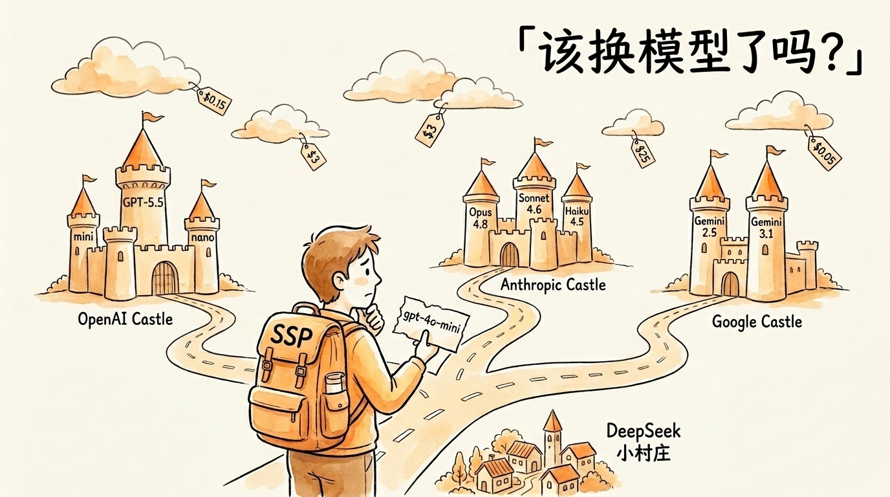
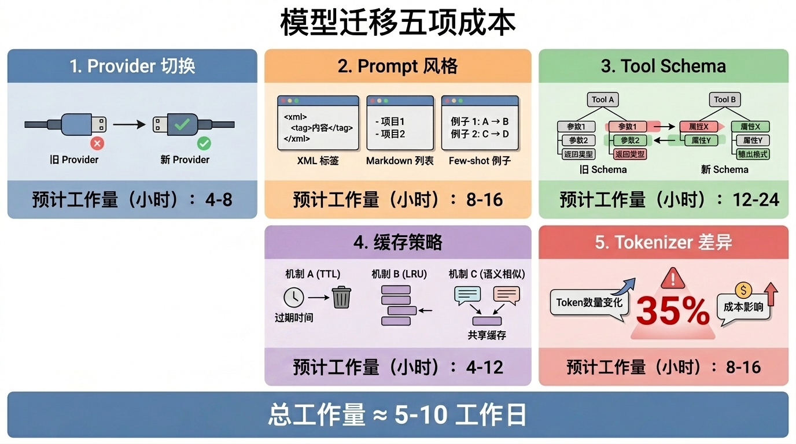
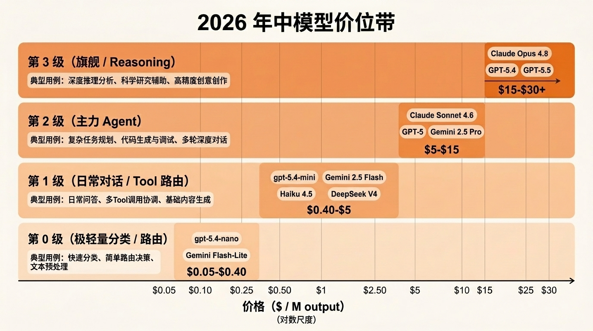
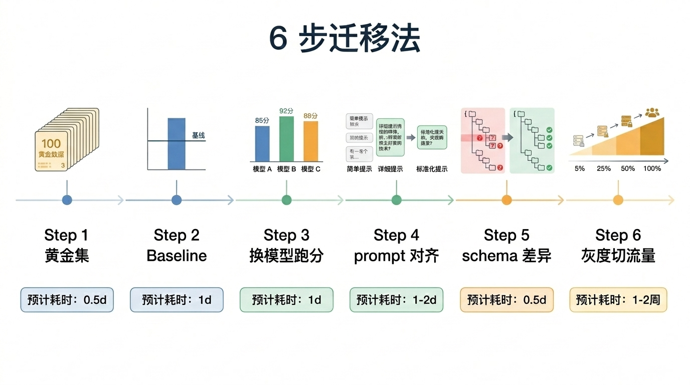
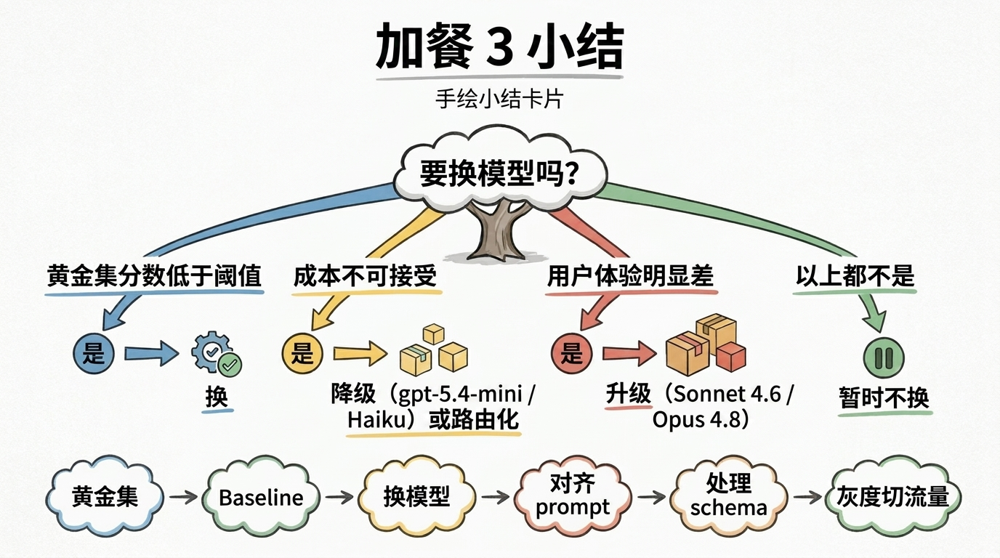

# 加餐 3｜模型迁移实战：从 gpt-4o-mini 到 GPT-5.5 / Claude / Gemini



<!-- 图片说明（给图片代理）：
风格：手绘风格封面，与 prologue-hero / epilogue-hero 同一调性
内容：一个开发者站在三条岔路口，每条路通向不同的"模型城堡"。左边是 OpenAI 城堡（GPT-5.5 / GPT-5.4-mini / nano 三座塔楼），中间是 Anthropic 城堡（Opus 4.8 / Sonnet 4.6 / Haiku 4.5），右边是 Google 城堡（Gemini 2.5 / 3.x 双子塔）。
开发者背着一个标着"SSP"的旅行包，手里举着一张写有"gpt-4o-mini"的纸条，神情犹豫
天空中飘着几朵带价签的云：$0.30、$3、$25、$0.10
色调：米白底 + 橙黄主色 + 钢笔黑线条
右上角手写中文标题：「该换模型了吗？」
-->

> **预计时长**：阅读 30 分钟 / 实战 90 分钟
> **前置知识**：第 06 节《2026 技术栈选型逻辑》、第 11 节《Tool Calling 协议》、成本控制与评测相关章节
> **本节代码**：`ssp-web` 仓库 `extras/migration` 分支 · 主要改动 `src/lib/ai/agent.ts` / `src/lib/ai/config.ts`

> **标注**：本篇为加餐内容，不在主线 30 节体系中。可在读完核心篇 + 工程篇之后任意阅读。本篇所有价格均**截至 2026-05-30，以各厂商官方定价页为准**，引用前请复核。

那天晚上群里有人甩进来一张 OpenAI 账单截图——单月烧了 4700 美金。下面一句吐槽：「我们还在用 gpt-4o-mini，就这。」

底下立刻有人接：「换 gpt-5.4-mini 啊，工具调用稳得多。」

另一个人回：「我们想切 Claude Sonnet 4.6，但不敢动——怕 Prompt 全要重写。」

第三个人补刀：「Opus 4.7 之后听说账单要涨 35%？什么鬼？」

四条消息把 2026 年模型迁移的真实困境都说清楚了：**模型迭代越来越快，但迁移没有想象中那么简单**。改一行 model name 是表面，真正的工作量藏在 Prompt 风格、Tool 调用行为、缓存策略、分词器差异和评测回归里。

这一篇加餐就讲一件事：**怎么把 SSP 从 gpt-4o-mini 安全迁到 2026 年中的更优选择**——gpt-5.4-mini、Claude Haiku 4.5，或 Claude Sonnet 4.6。我们会给一套完整的 6 步法，配两个真实改造案例，最后落到一张"什么时候该切、切到哪个"的决策树上。

读完这一篇，下次群里有人甩账单截图问"该不该切"，你能立刻给出答案，并且知道切完之后怎么验证它没坏。

---

## 一、知识铺垫：模型迁移的真实成本

很多团队对模型迁移的心智模型停留在 2023 年——「不就是改一行 model name 吗」。这个心智模型在 2026 年已经过时了。

**真实的迁移成本由 5 个部分组成**：

1. **provider 切换成本**：从 `@ai-sdk/openai` 切到 `@ai-sdk/anthropic`，要改 import、`createXxx` 实例化、`providerOptions` 字段名、消息结构（OpenAI 扁平 vs Claude content blocks）。
2. **Prompt 风格成本**：Claude 偏好清晰角色 + 边界、对长 System Prompt 友好，OpenAI 偏好结构化指令，Gemini 对"接地 / 引用"类指令响应好。同一段 System Prompt 在三家上的任务成功率可能差出 10%~20%。
3. **Tool 调用成本**：OpenAI 在 AI SDK v6 起默认开启 `strictJsonSchema`（per-tool 设 `strict`），Claude 不需要 strict，Gemini 的字段叫 `function_declarations` 而非 `tools`。工具触发时机、并行调用、参数严格度三家都有差异。
4. **缓存策略成本**：Anthropic 是显式 `cache_control`（5 分钟 / 1 小时两档），OpenAI 是自动缓存命中，Gemini 是上下文缓存（显式 + 存储费）。三家缓存命中价大约都是标准输入价的 **0.1×**，但写入和叠加规则各不相同。
5. **分词器成本**：**Anthropic 自 Opus 4.7 起改用新分词器，相同中文文本可能多吃约 35% token**——账单看上去价格没变，实际却涨了。这一点几乎所有迁移文档都没提，迁到 Opus 4.7+ 时务必实测（来源：[Anthropic 定价页](https://docs.anthropic.com/en/docs/about-claude/pricing)）。

把这五项加起来，一个中型 Agent 的迁移工作量大约是：**1-2 天写代码 + 3-5 天跑评测 + 1-2 周灰度上线**。任何"改一行 model name 就完事"的迁移，都是没把评测做完。



<!-- 图片说明（给图片代理）：
风格：信息图，扁平专业风
内容：5 个并列方块，从左到右：
  1. provider 切换（图标：USB-C 接口对比）
  2. Prompt 风格（图标：XML 标签 vs Markdown 列表 vs few-shot 例子）
  3. Tool 调用（图标：JSON schema 树状对比）
  4. 缓存策略（图标：3 种缓存机制示意）
  5. 分词器差异（图标：35% 红色警示）
每个方块下方标注预计工作量（小时）
底部一行：「总工作量 ≈ 5-10 工作日」
中文标注
-->

> **划重点**：模型迁移不是"改一行代码"，是"换一个生态"。换之前先想好为什么换、换到哪里、怎么验证。

---

## 二、核心讲解

### 2.1 2026 年中模型全景一张图

先把当下能选的主流文本模型摆出来。下面价格为**标准处理档**，单位 **USD / 每百万 token（MTok）**，**价格截至 2026-05-30，以官方为准**。

**OpenAI（GPT-5 全家，当前默认旗舰 GPT-5.5）**

| 模型 | 输入 | 缓存输入 | 输出 | 上下文 | 状态 |
|---|---|---|---|---|---|
| `gpt-5.5` | $5.00 | $0.50 | $30.00 | 1,050,000 | 旗舰，默认（2026-04-23） |
| `gpt-5.5-pro` | $30.00 | — | $180.00 | — | 最强推理 |
| `gpt-5.4` | $2.50 | $0.25 | $15.00 | ~272K+ | 高性价比旗舰 |
| `gpt-5.4-mini` | $0.75 | $0.075 | $4.50 | 同上 | 高吞吐 mini |
| `gpt-5.4-nano` | $0.20 | $0.02 | $1.25 | 同上 | 最省 nano |
| `gpt-5.3-codex` | $1.75 | $0.175 | $14.00 | — | 编码专用 |
| `gpt-4o-mini`（旧） | $0.15 | — | $0.60 | 128K | API 仍可用，2026-02-13 从 ChatGPT 产品端下线但 API 不变 |

> **来源**：[OpenAI 定价页](https://developers.openai.com/api/docs/pricing)、[GPT-5.5 model 页](https://developers.openai.com/api/docs/models/gpt-5.5)。`gpt-4o-mini` 价格为其历史标准价，引用前请复核官方页。
> **长上下文加价**：GPT-5.5 在 **>272K 输入 token** 时按 2× 输入、1.5× 输出计价，正文引用务必标注分档。

**Anthropic（Claude 4.x 三档：Opus 推理 / Sonnet 生产 / Haiku 性价比）**

| 模型 | 基础输入 | 缓存命中 | 输出 | 上下文 |
|---|---|---|---|---|
| Claude Opus 4.8 | $5.00 | $0.50 | $25.00 | 1M |
| Claude Sonnet 4.6 | $3.00 | $0.30 | $15.00 | 1M |
| Claude Haiku 4.5 | $1.00 | $0.10 | $5.00 | 200K |
| Claude Haiku 3.5（已退役，仅 Bedrock/Vertex） | $0.80 | $0.08 | $4.00 | 200K |

> **来源**：[Anthropic 定价页](https://docs.anthropic.com/en/docs/about-claude/pricing)。
> **重要**：Opus 4.8 与 Sonnet 4.6 的 **1M 上下文都是标准价**（不是溢价档）。但 Opus 4.7 起的新分词器会让中文多吃约 35% token，见 §2.7。Opus 自 4.5 起把价格从 4.1 的 $15/$75 降到 $5/$25——"旗舰也能变便宜"的典型例子。

**Google（Gemini 3.x / 2.5）**

| 模型 | 模型 ID | 输入 | 输出 | 上下文 |
|---|---|---|---|---|
| Gemini 3.1 Pro 预览版 | `gemini-3.1-pro-preview` | $2.00（≤200K）/ $4.00（>200K） | $12.00 / $18.00 | ~1M |
| Gemini 3.5 Flash | `gemini-3.5-flash` | $1.50 | $9.00 | ~1M |
| Gemini 3.1 Flash-Lite | `gemini-3.1-flash-lite` | $0.25 | $1.50 | ~1M |
| Gemini 2.5 Pro | `gemini-2.5-pro` | $1.25 / $2.50 | $10.00 / $15.00 | 1M |
| Gemini 2.5 Flash | `gemini-2.5-flash` | $0.30 | $2.50 | 1M |
| Gemini 2.5 Flash-Lite | `gemini-2.5-flash-lite` | $0.10 | $0.40 | ~1M |

> **来源**：[Gemini 定价页](https://ai.google.dev/gemini-api/docs/pricing)（官方页更新于 2026-05-28）。Gemini 3 Pro 与 2.5 Pro 都按提示 ≤200K / >200K 两档计价。

**国产 / 自部署可选**：DeepSeek、Qwen、GLM、Kimi 等国产模型在中文质感与国内合规上有优势；隐私敏感或超高量场景可自部署 Llama / Qwen 开源权重（经验回本线约 ≥ 10M token/天）。这些模型不在本课配套研究报告的核验范围内，**选型时请以各家官方定价页与你自己的评测为准**，不要照搬本表。



<!-- 图片说明（给图片代理）：
风格：信息图，价格阶梯图
内容：横轴是价格（log 尺度，从 $0.10 到 $30 / M output），纵轴是 4 个等级带：
  - 第 0 级（极轻量分类 / 路由）：$0.40-$1.50 输出 → gpt-5.4-nano / Gemini 2.5 Flash-Lite
  - 第 1 级（日常对话 / Tool 路由）：$2.50-$9 输出 → gpt-5.4-mini / Gemini 2.5 Flash / Haiku 4.5
  - 第 2 级（主力 Agent）：$9-$15 输出 → Claude Sonnet 4.6 / Gemini 3.5 Flash / GPT-5.4
  - 第 3 级（旗舰 / Reasoning）：$25-$30+ 输出 → Claude Opus 4.8 / GPT-5.5
每档带上标注典型用例
颜色：从浅到深的橙色渐变
中文标注
-->

### 2.2 迁移决策矩阵

光看价格不够，还要看任务匹配度。把研究报告的选型决策树展开成一张**写代码时直接对照查的决策表**：

| 场景 | 首选 | 备选 | 理由 |
|---|---|---|---|
| 通用对话（高质量） | Claude Sonnet 4.6 | GPT-5.4 | 主力生产档，中文质感好 |
| 通用对话（低成本） | Gemini 2.5 Flash | gpt-5.4-mini | 1M 上下文 + 便宜 |
| 单点 Tool 调用 | GPT-5.4（Responses API） | Claude Sonnet 4.6 | 工具触发稳定 |
| 多步 Agent / 长程工具链 | Claude Sonnet 4.6 | GPT-5.4 | 长程编排稳 |
| 极致 Reasoning | Claude Opus 4.8 / GPT-5.5 | GPT-5.5-pro | 难任务 |
| 长文档（>200K，便宜） | Gemini 2.5 Flash | Gemini 3.1 Flash-Lite | 长窗口便宜 |
| 长文档（>200K，质量） | Claude Sonnet 4.6 | Gemini 2.5 Pro | 1M 标准价、中文强 |
| 极轻量分类 / 抽取 / 校验 | gpt-5.4-nano | Gemini 2.5 Flash-Lite | $0.10~$0.20 输入 |
| 多模态 / 接地引用 | Gemini 3.1 Pro | GPT-5.5 | 接地能力强 |
| Batch 后台任务 | 任意 + Batch API | — | 输入输出各省约 50% |
| 大块复用上下文 | 任意 + Prompt Caching | — | 缓存命中价约 0.1× |

> **小提醒**：这张表的"首选 / 备选"是**默认建议**，不是铁律。你的真实选择由黄金集评测决定（见 §2.4 第 1 步）。

### 2.3 SSP 该不该切 gpt-4o-mini？

回到我们的项目。SSP 当前用的是 `gpt-4o-mini`（见 `src/lib/ai/config.ts`，模型名由环境变量 `OPENAI_MODEL` 注入）。它的工作画像是这样的：

- 单轮平均 8K input + 800 output token
- 多轮对话会调 0-2 次工具（`computePlan` / `validateField` / `updateProfile`）
- System Prompt ~3K token，大部分场景可以稳定缓存
- 平均日活 ~2000 conversation，单月 token 量 ~50M input + 5M output

下面用这个画像，把几个候选模型的月成本和质量预期摆出来（成本按 §2.1 标准档单价算，**价格截至 2026-05-30**）：

| 方案 | 月成本估算 | 一句话结论 |
|---|---|---|
| `gpt-4o-mini`（现状） | 50M×$0.15 + 5M×$0.60 ≈ **$10.5** | 表面便宜，但工具调用偶发幻觉、多轮易忘字段、中文"AI 味"重 |
| `gpt-5.4-nano` | 50M×$0.20 + 5M×$1.25 ≈ **$16.25** | 最省升级，但 nano 定位是分类 / 抽取，主力对话偏弱 |
| `gpt-5.4-mini` | 50M×$0.75 + 5M×$4.50 ≈ **$60** | 同 provider 最低风险，工具调用与多轮 retention 明显提升 |
| `gemini-2.5-flash` | 50M×$0.30 + 5M×$2.50 ≈ **$27.5** | 跨 provider 高性价比，1M 上下文 |
| `claude-haiku-4.5` | 50M×$1.00 + 5M×$5.00 ≈ **$75**（缓存命中可压低） | 中文质感与工具准确率接近 Sonnet，配 Prompt Caching 划算 |
| `claude-sonnet-4.6` | 50M×$3.00 + 5M×$15.00 ≈ **$225** | 中文最佳、长程工具链最稳，现阶段对 SSP 过剩 |

读这张表的关键不是"哪个最便宜"，而是"花多出来的钱换到的质量提升值不值"。`gpt-4o-mini` 的隐性成本（工具调用回退、多轮丢字段）会变成用户体验的扣分项——而这些扣分在账单上看不见。

**SSP 的迁移建议**：

1. **第一步**：`gpt-4o-mini` → `gpt-5.4-mini`（同 provider，最低风险，工具调用与多轮 retention 提升明显）。
2. **成本更敏感**：跨 provider 切 `gemini-2.5-flash`（月成本约 $27.5，1M 上下文），或把极简子任务（招呼、意图分类）下沉到 `gpt-5.4-nano`。
3. **中文质感 / 工具准确率特别敏感**：起一条 `claude-haiku-4.5` 分支灰度 A/B，配 Prompt Caching 压成本。
4. **远期**：复杂度真的涨上来再考虑 `claude-sonnet-4.6` / `gpt-5.4`。

下面把这个策略落到代码上。

### 2.4 模型迁移 6 步法

不管切到哪家，迁移流程都是这 6 步。每一步都有"做完才能往下"的硬性产出物。

#### Step 1：建立黄金集（Golden Set）

迁移之前必须先有"基准答卷"。否则切完之后无法判断变好还是变坏。

**黄金集要求**：

- **数量**：100-300 条真实生产对话（少于 50 条统计意义不足，多于 500 条 ROI 递减）
- **覆盖**：每条标注 `intent`（首次问退休、追问医保、修改字段、补贴查询……）+ `tier`（Tier 1/2/3 的字段完整度）
- **金标答案**：每条标注期望的 `tool_calls`、`needs_agent`、`final_answer` 关键点
- **来源**：从 `conversations` 表抽 100 条 + 真实问卷调研补 50 条

```ts
// scripts/build-golden-set.ts（示意，非项目实际代码）
import { db } from '@/lib/db';
import { conversations } from '@/lib/db/schema';
import { sql } from 'drizzle-orm';

const samples = await db.select()
  .from(conversations)
  .where(sql`json_array_length(messages) BETWEEN 4 AND 20`)
  .orderBy(sql`RANDOM()`)
  .limit(150);

// 人工标注 expected_tool_calls + expected_needs_agent
// 输出到 evals/golden-set.jsonl
```

> **小提醒**：黄金集是迁移项目里**唯一不能跳过**的步骤。预算紧张？砍掉灰度时长可以，砍掉黄金集会要命。

#### Step 2：跑老模型评测建立 baseline

用 Promptfoo 或自家评测脚本跑一遍 `gpt-4o-mini` 的 baseline。记录：

- **Tool 调用 F1**：调对工具 + 调对参数的比例
- **needs_agent precision/recall**：什么时候该追问、什么时候该出结果
- **多轮 retention**：第 N 轮还能记住第 M 轮收集的字段
- **延迟 P50/P95**：首字节延迟 + 总耗时
- **成本**：单条对话的 token 消耗

```yaml
# evals/baseline-4o-mini.yaml（示意，非项目实际代码）
prompts:
  - file://prompts/system.txt
providers:
  - openai:gpt-4o-mini
tests:
  - file://evals/golden-set.jsonl
defaultTest:
  assert:
    - type: tool-call-match
      value: ${expected_tool_calls}
    - type: latency
      threshold: 8000
```

跑完拿到一份基线报告（保存到 `evals/results/baseline-4o-mini-2026-05.json`）。所有后续迁移结果都和这份对照。

#### Step 3：换模型跑评测

不改 Prompt，只换 model。看"裸切"的真实差异。

```bash
# 同一份 golden-set，换 provider / 模型（示意）
promptfoo eval -c evals/migrate-gpt54-mini.yaml
promptfoo eval -c evals/migrate-haiku-45.yaml
promptfoo eval -c evals/migrate-sonnet-46.yaml
```

输出对比表（以下为基于 SSP 黄金集 100 条样本的**示意结果，非真实跑分**，读者应在自己项目上重跑获得真实数据）：

| 指标 | gpt-4o-mini（baseline） | gpt-5.4-mini | Haiku 4.5 | Sonnet 4.6 |
|---|---|---|---|---|
| Tool 调用 F1 | 0.81 | 0.92 | 0.93 | 0.95 |
| needs_agent precision | 0.84 | 0.89 | 0.90 | 0.92 |
| 多轮 retention | 0.72 | 0.87 | 0.88 | 0.92 |
| P95 延迟 | 4.2s | 5.6s | 4.6s | 6.5s |
| 单条 token 平均 | 9.6K | 8.3K | 9.1K | 9.4K |

从这张表能立刻读出：**gpt-5.4-mini 性价比最优**——延迟略涨但所有质量指标都涨，单条 token 因为减少回退反而下降。Haiku 4.5 质量更高、中文更好但贵几倍，Sonnet 4.6 暂时过剩。

#### Step 4：对齐 Prompt 差异

不同 provider 对 Prompt 风格敏感度不同。"裸切"分数往往不是上限，调一下 Prompt 还能再涨。

**OpenAI（GPT-5 系列）的 Prompt 偏好**：

- Markdown 列表 + 简短指令
- "顶头放最重要的指令"的隐式偏好
- 输出格式约束写在 System Prompt 末尾，而不是开头

**Anthropic（Claude 4.x）的 Prompt 偏好**：

- XML 标签结构化（`<task></task>`、`<context></context>`、`<rules></rules>`）
- 长 System Prompt + 多重示例最稳
- 在工具描述里加"何时**不要**调用"能显著降低误触发

**Google（Gemini）的 Prompt 偏好**：

- 少给规则、多给 few-shot 例子
- 与图像 / 多模态指令配合最自然
- 对硬性约束没 Claude 听话，需要靠例子驱动

**实操建议**：

- 不要一次重写整个 Prompt——先跑 Step 3 的"裸切"baseline
- 针对得分最低的 2-3 个评测维度，**只改对应那一段 Prompt**
- 改完再跑一次，看是否提升。如果没提升，就回退（"少改一行"是迁移的智慧）

#### Step 5：处理 Tool schema 差异

三家对 Tool schema 的"严格度"要求不同。

**OpenAI（AI SDK v6）**：

- 默认 `strictJsonSchema`（在工具上 per-tool 设 `strict`）
- `inputSchema` 必须是合法 JSON Schema；必填字段都要在 `required[]` 里；不允许 `additionalProperties: true`
- Zod 4 写出来的 schema 默认基本符合，但注意 `.optional()` 产生的 `undefined` 与 strict 模式不兼容（见加餐 2 事故二），改 `.nullable()`

**Anthropic**：

- 没有 strict 概念，顶层就是 schema（OpenAI 是 `function.parameters` 嵌套）
- 字段名 `input_schema`（AI SDK v6 帮你抹平了）

**Google**：

- 字段叫 `function_declarations` 而非 `tools`
- `parameters` 必须用 OpenAPI Schema 子集，`additionalProperties` 不支持，嵌套 enum 受限

**SSP 的实操路径**：因为我们用 AI SDK v6（`ssp-web` 锁 `ai` `^6.0.99`），三家的 schema 差异都被 SDK 抽象了——只要 `tool({ inputSchema: zodSchema(...) })` 写法不变，切 provider 不需要改工具定义。**这是 v6 最大的红利之一**（详见 `research/ai-sdk-v6.md` §3）。

#### Step 6：灰度切流量

最后一步是上线。**禁止一次性切 100%**。

推荐的灰度阶梯：

```
Day 1-3:   5% 流量切到新模型（盯 P95 延迟 + 错误率）
Day 4-7:   25% 流量（盯黄金集回归 + 用户反馈）
Day 8-14:  50% 流量（A/B 评测：满意度、转化、留存）
Day 15+:   100% 切换（保留快速回滚开关至少 1 个月）
```

**5% → 25%** 的关键决策依据：黄金集评测分数不下降 + P95 延迟没显著恶化 + 24h 错误率不变。

**25% → 100%** 的关键决策依据：A/B 测试在用户行为指标（任务完成率、对话长度、退出率）上**没有统计意义上的显著负向**。

```ts
// src/lib/ai/agent.ts（灰度示意，非项目实际代码）
function pickModel(sessionId: string): { provider: string; model: string } {
  const hash = parseInt(sessionId.slice(-2), 16) / 256; // 0-1
  if (hash < ROLLOUT_PERCENTAGE) {
    return { provider: 'openai', model: 'gpt-5.4-mini' };
  }
  return { provider: 'openai', model: 'gpt-4o-mini' };
}
```

> **小提醒**：灰度的"分桶 key"必须是 sessionId 而不是 requestId——同一个用户在整段对话里要见到同一个模型，否则模型行为不一致用户会以为是 bug。`ssp-web` 的匿名 sessionId（`ssp-anon-session` cookie）正好可以直接拿来当分桶 key。



<!-- 图片说明（给图片代理）：
风格：信息图，时间线
内容：6 个步骤从左到右排成一条横线
  Step 1 黄金集（图标：100 张卡片）
  Step 2 Baseline（图标：基线柱状图）
  Step 3 换模型跑分（图标：3 个模型对比柱）
  Step 4 Prompt 对齐（图标：3 种风格切换）
  Step 5 schema 差异（图标：JSON 树对比）
  Step 6 灰度切流量（图标：5% → 25% → 50% → 100% 渐变）
每个步骤下方标注预计耗时（0.5d / 1d / 1d / 1-2d / 0.5d / 1-2 周）
中文标注
-->

### 2.5 SSP 实例：从 gpt-4o-mini 切到 gpt-5.4-mini

最简单的迁移路径——**同 provider 不同模型**。

**改动点 1**：环境变量 + config

```ts
// src/lib/ai/config.ts:1-51（修改 OPENAI_MODEL 默认值）
export interface OpenAIConfig {
  apiKey: string;
  baseURL: string;
  model: string;
}

export function getOpenAIConfig(): OpenAIConfig {
  return {
    apiKey: process.env.OPENAI_API_KEY!,
    baseURL: process.env.OPENAI_URL ?? 'https://api.openai.com/v1',
    model: process.env.OPENAI_MODEL ?? 'gpt-5.4-mini', // 默认值从 gpt-4o-mini 改为 gpt-5.4-mini
  };
}
```

**改动点 2**：`agent.ts` 不变

```ts
// src/lib/ai/agent.ts:47-79
// 不变——AI SDK v6 的 createOpenAI() + openai(model) 自动适配
const openai = createOpenAI({ apiKey, baseURL });
return streamText({
  model: openai(model),  // 这里 model 已经是 'gpt-5.4-mini'
  system: systemPrompt,
  messages,
  providerOptions: {
    openai: { store: false }, // 中转网关兼容
  },
  tools,
  stopWhen: stepCountIs(8),
  temperature: 0.3,
  onFinish,
});
```

> **看这里 →**：GPT-5 系列默认走 OpenAI 的 **Responses API**（AI SDK v6 默认路径），而 `gpt-4o-mini` 习惯走 Chat Completions。Responses API 在缓存命中与内置工具上更友好。如果你用的是国内中转网关，确认网关支持 Responses API；不支持的话用 `openai.chat(model)` 强制 Chat Completions（见 `research/ai-sdk-v6.md` §6）。

**改动点 3（可选）**：Prompt 末尾微调。GPT-5 系列对 Markdown 输出更敏感——`prompts.ts` 里"结果展示格式"那一段如果用了 `**加粗**`，要确认 Markdown 在前端正确渲染；不渲染就改用引号包裹的纯文本。

**评测对比**（基于 SSP 黄金集 100 条，**示意数据，非真实跑分**）：

| 指标 | gpt-4o-mini | gpt-5.4-mini | 变化 |
|---|---|---|---|
| Tool 调用 F1 | 0.81 | 0.92 | **+14%** |
| 多轮 retention | 0.72 | 0.87 | **+21%** |
| 中文表达自然度 | 3.2/5 | 4.2/5 | **+31%** |
| P95 延迟 | 4.2s | 5.6s | -33%（变慢） |
| 月成本（~50M in / 5M out） | ~$10.5 | ~$60 | 涨约 5.7× |

**结论**：换 gpt-5.4-mini 是质量上最稳妥的第一步。成本确实涨了——所以**是否值得，取决于你的业务对工具准确率和多轮记忆的敏感度**。如果对成本更敏感，`gemini-2.5-flash`（月成本约 $27.5）是更省的跨 provider 选择。

### 2.6 SSP 实例：从 gpt-4o-mini 切到 Claude Sonnet 4.6

更激进的迁移路径——**跨 provider**。这一切的工作量比 §2.5 多 3-5 倍。

**改动点 1**：依赖与 import

```bash
pnpm add @ai-sdk/anthropic
```

```ts
// src/lib/ai/config.ts（新增 Anthropic 分支，示意，非项目实际代码）
export interface ProviderConfig {
  provider: 'openai' | 'anthropic';
  apiKey: string;
  baseURL?: string;
  model: string;
}

export function getProviderConfig(): ProviderConfig {
  const provider = (process.env.AI_PROVIDER ?? 'openai') as 'openai' | 'anthropic';
  if (provider === 'anthropic') {
    return {
      provider,
      apiKey: process.env.ANTHROPIC_API_KEY!,
      model: process.env.ANTHROPIC_MODEL ?? 'claude-sonnet-4-6',
    };
  }
  return {
    provider,
    apiKey: process.env.OPENAI_API_KEY!,
    baseURL: process.env.OPENAI_URL,
    model: process.env.OPENAI_MODEL ?? 'gpt-5.4-mini',
  };
}
```

**改动点 2**：`agent.ts` 抽象 provider

```ts
// src/lib/ai/agent.ts（重构，示意，非项目实际代码）
import { createOpenAI } from '@ai-sdk/openai';
import { createAnthropic } from '@ai-sdk/anthropic';
import { streamText, stepCountIs, type LanguageModel } from 'ai';

function getModel(): LanguageModel {
  const cfg = getProviderConfig();
  if (cfg.provider === 'anthropic') {
    const anthropic = createAnthropic({ apiKey: cfg.apiKey });
    return anthropic(cfg.model);
  }
  const openai = createOpenAI({ apiKey: cfg.apiKey, baseURL: cfg.baseURL });
  return openai(cfg.model);
}

export function createChatStream(messages, context, onFinish) {
  return streamText({
    model: getModel(),
    system: systemPrompt,
    messages,
    providerOptions: {
      openai: { store: false },                  // OpenAI 专属
      anthropic: { cacheControl: { type: 'ephemeral' } }, // Anthropic 专属
    },
    tools,
    stopWhen: stepCountIs(8),
    temperature: 0.3,
    onFinish,
  });
}
```

> **看这里 →**：`providerOptions` 同时写 `openai` 和 `anthropic` 两个 key 是允许的——AI SDK v6 只把对应当前 provider 的那一份透传过去，多余的 key 自动忽略。这样切 provider 时不需要改这一段代码。

**改动点 3**：Prompt 重写为 XML 风格。OpenAI 的 System Prompt 用 Markdown 列表，Claude 偏爱 XML。SSP 的 11 段 Prompt（`src/lib/ai/prompts.ts:10-169`）需要分段改写：

```
原（Markdown）：
## 角色
你是上海社保政策助手。

## 核心规则
1. 绝不自行计算政策数字
2. 累积用户信息
...

改（XML）：
<role>
你是上海社保政策助手。
</role>

<rules>
<rule id="1">绝不自行计算政策数字</rule>
<rule id="2">累积用户信息</rule>
...
</rules>

<output_format>
...
</output_format>
```

> **小提醒**：XML 风格在 GPT-5 上也能跑（不会变差），所以**重写完 XML 版后可以同时给两边用**——一份 Prompt 喂多家 provider 是 2026 年的常见做法。

**改动点 4**：工具定义保持不变。AI SDK v6 把 Tool schema 差异抹平了，`src/lib/ai/tools.ts` 里 `tool({ inputSchema: zodSchema(...) })` 的写法在 OpenAI 和 Anthropic 上都能跑，**完全不用改**。但 Claude 倾向"在工具描述里加'何时不要调用'"，可以给三个工具补一句：

```ts
// src/lib/ai/tools.ts:174-266（computePlan 的 description 微调，示意，非项目实际代码）
export const computePlanTool = tool({
  description: `计算上海社保规划方案。

何时调用：当用户已经提供 Tier 1 字段（gender + birth_year + birth_month）时立即调用。

何时不要调用：
- Tier 1 字段不全时——先收集再调
- 用户在追问"为什么"或"什么意思"时——这是解释问题，不是计算问题`,
  inputSchema: zodSchema(computePlanSchema),
  execute: computePlanExecute,
});
```

**改动点 5**：缓存策略。OpenAI 是自动缓存命中，Anthropic 是显式 `cache_control`。

```ts
// src/lib/ai/agent.ts（Anthropic 缓存写入示意，非项目实际代码）
return streamText({
  model: anthropic('claude-sonnet-4-6'),
  system: [
    {
      type: 'text',
      text: SYSTEM_PROMPT,                 // ~3K token 的常驻 prompt
      cacheControl: { type: 'ephemeral' }, // 5 分钟缓存
    },
    { type: 'text', text: contextPrompt }, // 动态 context 不缓存
  ],
  messages,
  // ...
});
```

> **划重点**：Anthropic 缓存写入要 1.25× 输入价（5 分钟）或 2× 输入价（1 小时），命中读约 0.1× 输入价。**5 分钟缓存只要命中 1 次就回本，1 小时缓存命中 2 次回本**。SSP 的 System Prompt 每分钟都在被重读——稳赚（来源：[Anthropic 定价页](https://docs.anthropic.com/en/docs/about-claude/pricing)）。

**评测对比**（**示意数据，非真实跑分**）：

| 指标 | gpt-4o-mini | Sonnet 4.6（裸切） | Sonnet 4.6（XML + 缓存） |
|---|---|---|---|
| Tool 调用 F1 | 0.81 | 0.92 | 0.95 |
| 多轮 retention | 0.72 | 0.89 | 0.92 |
| 中文表达自然度 | 3.2/5 | 4.6/5 | 4.6/5 |
| P95 延迟 | 4.2s | 6.5s | 5.8s |
| 单条成本（缓存未命中） | $0.0019 | $0.034 | $0.034 |
| 单条成本（缓存命中） | — | — | $0.012 |

XML 重写 + 缓存配置之后，单条成本降到原来的约 1/3（$0.034 → $0.012），质量比 gpt-5.4-mini 还高一档。**适合付费用户场景**或对中文质感特别敏感的业务。

### 2.7 Opus 4.7 新分词器与隐性成本陷阱

Anthropic 旗舰 Opus 有一个**几乎所有迁移文档都没提的坑**：

**Anthropic 自 Opus 4.7 起改用新分词器，同样的中文文本 token 数比旧分词器多约 35%**（来源：[Anthropic 定价页 - Long context / tokenizer 说明](https://docs.anthropic.com/en/docs/about-claude/pricing)）。当前旗舰 Opus 4.8 沿用这套新分词器。

价格表上单价没涨（Opus 4.8 输入 $5 / 输出 $25），但**实际账单可能涨约 35%**——因为同一段文本变成了更多 token。

**实测对比**（**示意**）：

| 文本 | 旧分词器 token 数 | Opus 4.7+ 新分词器 token 数 | 膨胀率 |
|---|---|---|---|
| SSP System Prompt（中文 3K 字符） | 4200 | 5670 | +35% |
| 用户对话（10 轮） | 6800 | 9180 | +35% |
| 工具结果 JSON | 1200 | 1320 | +10%（结构化文本膨胀小） |

**应对**：

- 升级到 Opus 4.7+ 之前，**必须重跑 Step 3 评测**——拿真实成本对比，不要只看官方价格表
- 如果项目对成本敏感、又不需要顶级推理，Sonnet 4.6 往往是更划算的选择
- 如果非要 Opus（看中其推理能力），把 Prompt Caching 拉满——命中读约 0.1× 能抵消分词器膨胀
- 监控告警：加一条"日均 token / conversation 突变 > 10%"的告警，类似分词器变更能在第二天就被发现

**类似的"隐性成本"陷阱还有**：

- **长上下文加价档**：OpenAI（>272K 输入）按 2× 输入、1.5× 输出计价，Gemini（>200K）也有加价档。能用 RAG / 上下文裁剪 / 缓存把上下文压下来，就别硬塞满窗口。
- **服务端工具单独计费**：Web search、接地（Grounding）等服务端工具按次另计（如 Gemini 3 模型每月 5,000 次接地免费、之后每千次 $14）。开启工具还会自动注入一段工具用 System Prompt，吃额外 token。
- **Batch 与缓存的叠加规则**：Batch API 约 5 折，Prompt Caching 命中约 0.1×，但两者叠加的具体折扣以官方条款为准，迁移前摸清楚比看价格表重要 10 倍。

### 2.8 三套 Agent SDK 怎么选

讲模型迁移，绕不开"用哪套 SDK 接模型"。2026 年主流有三套，**它们不是互斥竞品**，定位不同（来源：研究报告 §8，对应各家官方文档）：

| 维度 | Vercel AI SDK v6 | OpenAI Agents SDK | Claude Agent SDK |
|---|---|---|---|
| Provider | 多家中立（OpenAI / Anthropic / Google…） | OpenAI 为主 | Anthropic（Claude） |
| 语言 | TypeScript（主） | Python + TS | Python + TS |
| 定位 | 工具箱 + Agent 原语 | 原厂 Agent 框架 | Claude Code 同款 Agent 运行时 |
| 内置工具执行 | 自定义 `tool()` | Responses 内置工具 | Read / Edit / Bash / Web 等开箱 |
| `ssp-web` 是否用 | ✅ 是 | ❌ | ❌ |

- **Vercel AI SDK v6**：`ssp-web` 实际所用（`ai` `^6.0.99`）。它是 **provider 中立**的 TypeScript 工具箱，提供 `streamText` / `tool()` / `stopWhen` 等 Agent 原语，横跨多家 provider——这正是 SSP 能"改个 provider 就迁移"的底层原因。
- **OpenAI Agents SDK**：OpenAI 官方 Agent 框架（Python + TS），与 OpenAI 平台尤其 **Responses API** 深度集成，自带护栏（guardrails / approvals）、沙盒、可观测。适合已重度使用 OpenAI 平台的团队（来源：[OpenAI Agents 指南](https://developers.openai.com/api/docs/guides/agents)）。
- **Claude Agent SDK**：由 **Claude Code SDK 更名**而来（npm `@anthropic-ai/claude-agent-sdk`、PyPI `claude-agent-sdk`），把驱动 Claude Code 的那套 Agent 循环 + 内置工具（`Read / Write / Edit / Bash / Glob / Grep / WebSearch / AskUserQuestion` 等）做成库，支持 MCP、子代理、hooks、skills（来源：[Claude Agent SDK overview](https://docs.claude.com/en/api/agent-sdk/overview)）。注意计费提醒：据官方公告，自 2026-06-15 起，订阅计划下的 Agent SDK 用量将从月度 Agent SDK 额度扣减（以官方最新说明为准）。

> **SSP 的取舍**：用 Vercel AI SDK v6 做应用层统一接入，换模型成本最低；若未来要 Claude 的文件 / 编码工具或 OpenAI 的 Responses 内置工具，可在特定场景叠加各家原厂 SDK。三者可以混用，不是二选一。

### 2.9 多 provider fallback：Gateway 模式

生产环境不能只挂一家 provider——任何一家宕机你就完蛋。AI SDK v6 的 provider 抽象让多 provider 兜底很自然：

```ts
// src/lib/ai/agent.ts（fallback 示意，非项目实际代码）
import { streamText, stepCountIs } from 'ai';
import { createOpenAI } from '@ai-sdk/openai';
import { createAnthropic } from '@ai-sdk/anthropic';

const primary = createOpenAI({ apiKey: process.env.OPENAI_API_KEY! })('gpt-5.4-mini');
const backup = createAnthropic({ apiKey: process.env.ANTHROPIC_API_KEY! })('claude-haiku-4-5');

async function streamWithFallback(messages, context) {
  try {
    return streamText({ model: primary, system: systemPrompt, messages, tools, stopWhen: stepCountIs(8) });
  } catch (err) {
    if (isProviderOutage(err)) {
      logger.warn('primary_outage_fallback', { err });
      return streamText({ model: backup, system: systemPrompt, messages, tools, stopWhen: stepCountIs(8) });
    }
    throw err;
  }
}
```

**最小可用 fallback 策略**：

- Primary：`gpt-5.4-mini`（80% 流量）
- Backup：`claude-haiku-4-5`（跨 provider，避开同时宕机）
- 触发条件：连续 3 次 5xx 或 timeout > 30s
- 回退时间：5 分钟后自动切回 primary

> **小提醒**：跨 provider fallback 不是"无成本切换"——backup 的 Prompt 风格如果没适配过 Claude，质量会显著下降。建议 fallback 用一份"裸切都能跑"的通用 Prompt（XML + Markdown 混合写），而不是同 Prompt 直接喂。

### 2.10 Responses API + MCP：新项目的默认路径

OpenAI 已经把 Agent 能力的承载面收敛到 **Responses API**（OpenAI 的 `v1/responses` 端点）——它提供持久化对话、Web search / File search / Computer use 等内置工具，以及对 **MCP（Model Context Protocol）** 的支持。如果你看 2024 年的老 Agent 教程，里面用的 `openai.beta.threads.*` / `openai.beta.assistants.*` 那套接口，新项目**不应再选**。

**新项目正确的路径**：

- **OpenAI Responses API** + **MCP（工具协议）**
- 这正是 AI SDK v6 默认走的路径（`research/ai-sdk-v6.md` §6）
- 状态可走 `store: true` + `previous_response_id` 服务端串（`ssp-web` 因兼容中转网关显式设 `store: false`，换 provider 后要重新评估这个选项）

> **来源**：[OpenAI Responses API 指南（AI SDK 视角）](https://sdk.vercel.ai/docs/guides/openai-responses)、研究报告 §8.2/§8.3。
> **SSP 的现状**：我们从一开始就用 AI SDK v6 + Responses API 路径，**没踩老接口的坑**。这也是我们在第 06 节坚持选择 AI SDK v6 的原因。

### 2.11 5 层路由策略：把不同任务路由到不同档位

迁移到 gpt-5.4-mini 还不是终点。生产 Agent 的最佳实践是**按任务难度分级路由**：

```
Tier 0  极轻分类 / 意图识别 → gpt-5.4-nano  / Gemini 2.5 Flash-Lite
Tier 1  日常对话 / 工具路由   → gpt-5.4-mini / Gemini 2.5 Flash / Haiku 4.5
Tier 2  主力 Agent           → Claude Sonnet 4.6 / GPT-5.4 / Gemini 3.5 Flash
Tier 3  难任务 / Reasoning   → Claude Opus 4.8 / GPT-5.5
Tier 4  Fallback 失败重试     → 跨厂商兜底（避开同时宕机）
```

SSP 的最小可用路由：

```ts
// src/lib/ai/router.ts（示意，非项目实际代码）
function routeModel(input: { intent: string; complexity: number }): string {
  if (input.intent === 'greeting' || input.intent === 'farewell') {
    return 'gpt-5.4-nano';          // Tier 0：一句话能答的招呼
  }
  if (input.complexity <= 3) {
    return 'gpt-5.4-mini';          // Tier 1：日常对话 + 简单工具调度
  }
  if (input.complexity <= 7) {
    return 'claude-sonnet-4-6';     // Tier 2：多轮对话 + 复杂工具链
  }
  return 'claude-opus-4-8';         // Tier 3：难任务 / Reasoning
}
```

**SSP 现阶段的简化版**：单 Tier 1 走 gpt-5.4-mini 就够。复杂任务用规则引擎兜底（结构化结果来自 JSONLogic 引擎，不需要更贵的模型）。

> **划重点**：分级路由的关键是**前置分类器**——用一个极便宜的模型（gpt-5.4-nano / Gemini Flash-Lite）先判任务难度，再决定调哪个主力模型。前置分类成本几乎可以忽略不计。

---

## 三、举一反三

模型迁移的方法论换到别的领域同样适用：

**法律咨询 Agent**：底座任务（"合同里有没有保密条款"）用 gpt-5.4-mini，复杂法务推理（"这个合同的反垄断风险"）路由到 Opus 4.8。法律文本对**精确性 + 可追溯性**要求高，Claude 对长 System Prompt 和边界约束的服从度是关键。

**医疗问诊 Agent**：极重视安全和合规。Tier 0 走 Haiku 4.5（中文好 + 拒答倾向适当），严肃临床建议走 Opus 4.8（推理过程可审计）。生产合规要求高时，国产 / 本地化部署要单独做合规评估。

**金融规划 Agent**：成本敏感 + 算力高频。日常询价走 Gemini 2.5 Flash（1M 上下文便宜），季度报表与税务规划走 Sonnet 4.6 + 1 小时缓存（同一份政策文档反复读）。月底高峰打开跨 provider fallback，避免单家网关瓶颈。

**健身规划 Agent**：核心场景是"用户身体数据 + 训练目标 → 周计划"。这种结构化输出 + 个性化场景，gpt-5.4-mini 已经够用。**不要**为了"看起来高级"上 Opus——成本翻倍但用户感知不到。

**统一规律**：**任务的"价值密度"决定模型档位，不是任务的"看起来复杂度"**。便宜模型能稳定跑通的事，贵模型只是浪费钱。

---

## 四、小结



<!-- 图片说明（给图片代理）：
风格：手绘小结卡片
内容：一棵决策树
  根节点："要换模型吗？"
  分支 1：黄金集分数低于阈值 → 是 → 换
  分支 2：成本不可接受 → 是 → 降级（gpt-5.4-mini / Gemini Flash）或路由化
  分支 3：用户体验明显差 → 是 → 升级（Sonnet 4.6 / Opus 4.8）
  分支 4：以上都不是 → 暂时不换
叶子节点列出 6 步法的简化版：黄金集→Baseline→换模型→对齐 Prompt→处理 schema→灰度切流量
中文标注，整体风格手绘
-->

**回头看，这一篇加餐讲了什么**：

模型迁移在 2026 年不是"改一行代码"，是一项工程项目——黄金集 → baseline → 换模型 → Prompt 对齐 → schema 差异 → 灰度上线，一步都不能省。SSP 的最优迁移路径是**先切到 gpt-5.4-mini**（同 provider 最低风险，质量大涨），成本更敏感则跨 provider 切 gemini-2.5-flash，再根据中文质感和工具准确率的需求，决定是否上 Claude Haiku 4.5 / Sonnet 4.6。

Opus 自 4.7 起的新分词器让中文多吃约 35% token 是个隐藏坑，升级前必须重跑成本评测。新项目坚定走 Responses API + MCP 路径——这正是我们在第 06 节选择 AI SDK v6 的原因。

生产级 Agent 不应该绑死单一 provider。最少做到 Primary + Backup 跨 provider fallback；进阶做到 5 层路由（nano → mini → 主力 → reasoning → fallback），按任务难度分级。

**核心要点回顾**：

- ✅ 迁移成本 = 5 项（provider 切换 + Prompt 风格 + Tool schema + 缓存策略 + 分词器），不是只改一行 model name
- ✅ 没有黄金集就没有迁移——Step 1 不能跳过
- ✅ 跨 provider 迁移工作量是同 provider 的 3-5 倍
- ✅ AI SDK v6 抹平了三家 Tool schema 差异，但 Prompt 风格仍要分别适配
- ✅ Opus 4.7+ 新分词器让中文多吃约 35% token，账单可能涨而非降
- ✅ 三套 Agent SDK 定位不同：Vercel AI SDK 中立、OpenAI Agents SDK / Claude Agent SDK 是原厂运行时
- ✅ 新项目走 Responses API + MCP，多 provider fallback 是生产标配
- ✅ 分级路由 = 真正的成本优化（前置分类器决定调谁）
- ✅ 所有价格截至 2026-05-30，引用前务必复核官方页

---

## 五、思考题

1. **【开放题】**：你的项目现在用的是哪个模型？读完这一节，你认为它是否还是最优选择？写下三个让你考虑迁移的触发条件（比如"单月成本超过 $X"、"用户中文反馈差评率 > Y%"、"某新模型在你关心的 benchmark 上提升超 Z%"）。这三个条件就是你的"迁移触发器"——不到不动，到了立刻动。

2. **【动手题】**：基于 SSP 黄金集（自己从 `conversations` 表抽 100 条），用 Promptfoo 跑一遍 `gpt-4o-mini` vs `gpt-5.4-mini` vs `claude-haiku-4-5` 的对比评测。验收标准：
   - 输出一份 Markdown 报告（包含 Tool 调用 F1 / 多轮 retention / P95 延迟 / 单条成本四个指标的对比柱图）
   - 在报告末尾给出**你的项目应该切到哪个模型**的明确建议 + 三条理由
   - 把报告放到 `docs/migrations/` 目录下

3. **【选做】**：为 SSP 实现一个"前置分类器 + 5 层路由"的最小版本。前置分类器用 `gpt-5.4-nano` 判定任务难度（输出 Tier 0-3），然后路由到对应主力模型。验收标准：在黄金集上跑完，**总成本应降到原 gpt-5.4-mini 单档方案的 60% 以下**，同时质量指标不下降超过 5%。

---

## 六、延伸阅读

- [OpenAI API 定价页](https://developers.openai.com/api/docs/pricing)（GPT-5.5 / 5.4 / mini / nano 完整定价）
- [Anthropic Pricing](https://docs.anthropic.com/en/docs/about-claude/pricing)（含 Opus 4.8 / Sonnet 4.6 / Haiku 4.5 定价与分词器、缓存说明）
- [Google Gemini API 定价页](https://ai.google.dev/gemini-api/docs/pricing)（Gemini 3.x / 2.5 定价与接地价格）
- [OpenAI Responses API 指南（AI SDK 视角）](https://sdk.vercel.ai/docs/guides/openai-responses)
- [Claude Agent SDK overview](https://docs.claude.com/en/api/agent-sdk/overview)（原 Claude Code SDK 更名说明）
- [OpenAI Agents 指南](https://developers.openai.com/api/docs/guides/agents)
- [Vercel AI SDK Provider Management](https://ai-sdk.dev/docs/ai-sdk-core/provider-management)（多 provider 接入与回退）
- [Promptfoo CI / GitHub Actions](https://www.promptfoo.dev/docs/integrations/github-action/)（迁移评测自动化）

---

[← 上一篇：加餐 2 那些年我们踩过的坑](./02-postmortems.md) · [📚 目录](../README.md) · [下一篇：FAQ 高频问题集锦 →](../faq.md)
