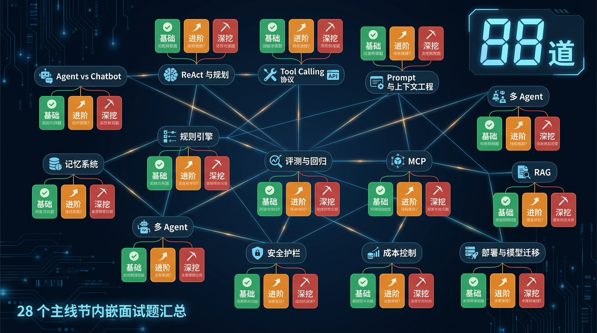

# 面试题索引：13 大核心主题 × 88 道题，对着面经查漏补缺

<!-- 图片说明（给图片代理）：
风格：信息图（infographic），扁平专业风，深色背景配亮色高亮
内容：画面中央是一张「知识网」——13 个核心主题节点（Agent vs Chatbot、ReAct 与规划、Tool Calling 协议、Prompt 与上下文工程、规则引擎、记忆系统、评测与回归、MCP、RAG、多 Agent、安全护栏、成本控制、部署与模型迁移）用线连成网状。
每个节点旁挂三张小题卡，分别标「基础」（绿）、「进阶」（橙）、「深挖」（红）。
右上角一个大数字「88 道」，左下角小字「28 个主线节内嵌面试题汇总」。
中文标注，字号清晰，整体像一张面试备战作战图。
-->

> **页面定位**：把全课 28 个主线节（第 1–28 节）内嵌的面试题，按知识主题重新编排成一份可检索的面试备战索引
> **题量**：88 道（13 个核心主题 61 道 + 8 个扩展主题 27 道）
> **配套阅读**：[知识地图](./knowledge-map.md) · [课程完整目录](./README.md#完整目录)

刷面经最怕两件事：一是题目散在二十多节正文里，临考前翻得手忙脚乱；二是刷了一堆题却不知道自己哪个知识块是空的。这份索引就是来治这两个病的——把每节末尾 `## 面试题` 段里的题目全抽出来，**按主题归堆**，每道题都挂一条回链，点一下就跳回它所在章节的完整参考解答。

怎么用最高效：先看下面的「主题题量总览」，挑你最虚的主题；再到对应小节顺着「基础 → 进阶 → 深挖」的梯度往下刷；卡壳了就点回链回正文对答案。13 个核心主题（对应[知识地图](./knowledge-map.md)第四节）每个都至少有 3 道题托底，AI Agent 岗位高频考点一个都不落。

> **难度三档怎么读**：**基础** = 概念你得说得清；**进阶** = 工程取舍你得讲得出权衡；**深挖** = 边界、坑、量化标准你得追问得动。同一主题里题目按这个梯度排，照着刷就是一条由浅入深的复习路径。

---

## 主题题量总览

下表的主题名逐字取自[知识地图](./knowledge-map.md)第二节「主题集」，难度只用 `基础 / 进阶 / 深挖` 三值。核心 13 主题在前，扩展 8 主题在后。

### 🎯 核心主题（13 个 · 61 道）

| 主题 | 题量 | 难度分布 | 覆盖章节 |
|---|:---:|---|---|
| [Agent vs Chatbot](#主题agent-vs-chatbot) | 3 | 基础 1 · 进阶 1 · 深挖 1 | 第 1 节 |
| [ReAct 与规划](#主题react-与规划) | 4 | 基础 1 · 进阶 2 · 深挖 1 | 第 3、27 节 |
| [Tool Calling 协议](#主题tool-calling-协议) | 9 | 基础 3 · 进阶 4 · 深挖 2 | 第 6、11、13、25 节 |
| [Prompt 与上下文工程](#主题prompt-与上下文工程) | 6 | 基础 2 · 进阶 2 · 深挖 2 | 第 9、10 节 |
| [规则引擎](#主题规则引擎) | 6 | 基础 2 · 进阶 2 · 深挖 2 | 第 14、15 节 |
| [记忆系统](#主题记忆系统) | 3 | 基础 1 · 进阶 1 · 深挖 1 | 第 18 节 |
| [评测与回归](#主题评测与回归) | 6 | 基础 2 · 进阶 2 · 深挖 2 | 第 22、23 节 |
| [MCP](#主题mcp) | 5 | 基础 2 · 进阶 1 · 深挖 2 | 第 24、25 节 |
| [RAG](#主题rag) | 3 | 基础 1 · 进阶 1 · 深挖 1 | 第 26 节 |
| [多 Agent](#主题多-agent) | 3 | 基础 1 · 进阶 1 · 深挖 1 | 第 27 节 |
| [安全护栏](#主题安全护栏) | 5 | 基础 1 · 进阶 2 · 深挖 2 | 第 8、17、20 节 |
| [成本控制](#主题成本控制) | 5 | 基础 1 · 进阶 2 · 深挖 2 | 第 5、21、28 节 |
| [部署与模型迁移](#主题部署与模型迁移) | 3 | 基础 1 · 进阶 1 · 深挖 1 | 第 28 节 |

### 🧩 扩展主题（8 个 · 27 道）

| 主题 | 题量 | 难度分布 | 覆盖章节 |
|---|:---:|---|---|
| [Agent 进化史](#主题agent-进化史) | 3 | 基础 1 · 进阶 1 · 深挖 1 | 第 2 节 |
| [Agent 架构设计](#主题agent-架构设计) | 4 | 基础 1 · 进阶 1 · 深挖 2 | 第 4、6 节 |
| [技术选型](#主题技术选型) | 2 | 基础 1 · 进阶 1 | 第 5 节 |
| [数据持久化与 ORM](#主题数据持久化与-orm) | 3 | 基础 1 · 进阶 1 · 深挖 1 | 第 7 节 |
| [认证与会话](#主题认证与会话) | 2 | 基础 1 · 深挖 1 | 第 8 节 |
| [Schema 设计](#主题schema-设计) | 3 | 基础 1 · 进阶 1 · 深挖 1 | 第 12 节 |
| [流式 UI 与前端集成](#主题流式-ui-与前端集成) | 7 | 基础 2 · 进阶 4 · 深挖 1 | 第 16、17 节 |
| [调试与可观测](#主题调试与可观测) | 3 | 基础 1 · 进阶 1 · 深挖 1 | 第 19 节 |

> **合计 88 道**，覆盖全部 13 个核心主题与全部 8 个扩展主题，对应第 1–28 节每一个主线节。每道题点回链即可跳到原章节的折叠式参考解答。

---
## 一、核心主题（13 个）

### 主题：Agent vs Chatbot

> 落点：第 1 节。判断「这到底是不是 Agent」是面试开场最常被拷问的一题。

- **【基础】** 面试官给你一句话：「把一个聊天机器人接上一个搜索 API，它就变成 Agent 了。」这句话对吗？请说出你判断 Agent 与 Chatbot 的标准。 — [第 1 节《AI Agent 到底是个啥》](./02-what-is-agent.md#面试题)
- **【进阶】** 请用一次 Tool Calling 的完整时序，说明用户、LLM、宿主服务端三方的分工。为什么说「LLM 从来不执行代码」？ — [第 1 节《AI Agent 到底是个啥》](./02-what-is-agent.md#面试题)
- **【深挖】** SSP 的推理循环里有一句 `stopWhen: stepCountIs(8)`。这个参数解决什么问题？去掉它会发生什么？把上限设成 100 又有什么风险？ — [第 1 节《AI Agent 到底是个啥》](./02-what-is-agent.md#面试题)

---

### 主题：ReAct 与规划

> 落点：第 3、27 节。ReAct 是 Agent 的核心心智模型，上多 Agent 之前先穷尽单 Agent 规划能力。

- **【基础】** ReAct 的全称是什么？它要解决的核心痛点是什么？请用 Thought / Action / Observation 解释它的循环结构。 — [第 3 节《ReAct 循环》](./04-react-loop.md#面试题)
- **【进阶】** 今天的 Tool-Calling Agent 和 2022 年的原始 ReAct 是什么关系？AI SDK v6 里哪一段对应 ReAct 论文的 `max_steps`？ — [第 3 节《ReAct 循环》](./04-react-loop.md#面试题)
- **【进阶】** 在决定上多 Agent 之前，为什么应该先穷尽单 Agent 的规划能力？AI SDK v6 里有什么轻量手段能在单 Agent 内实现「虚拟分工」？ — [第 27 节《多 Agent 协作模式》](./28-multi-agent.md#面试题)
- **【深挖】** 除了 ReAct，你还知道哪些规划范式？请挑两个和 ReAct 对比，说明它们的取舍，以及 SSP 为什么选最朴素的 ReAct。 — [第 3 节《ReAct 循环》](./04-react-loop.md#面试题)

---

### 主题：Tool Calling 协议

> 落点：第 6、11、13、25 节。贯穿核心篇与 MCP 实战，是 Tool-Calling Agent 岗位的绝对重点。

- **【基础】** 在 AI SDK v6 里，一个 `tool()` 由哪几部分构成？请说明 LLM 是怎么用这几部分决定「要不要调、怎么调」的，并指出 `inputSchema` 相对早期版本字段名的变化。 — [第 6 节《20 行代码起 Agent》](./07-minimal-agent.md#面试题)
- **【基础】** 为什么说「LLM 从来不执行代码」？请用一次完整的 Tool Calling 时序说明用户、LLM、服务端三方的分工。 — [第 11 节《Tool Calling 协议》](./12-tool-calling.md#面试题)
- **【基础】** AI SDK v6 控制 LLM 工具选择的手段从软到硬有哪几档？请按「谁说了算」排序并各举一个适用场景。 — [第 13 节《三个工具的编排策略》](./14-tool-orchestration.md#面试题)
- **【进阶】** 为什么说 `streamText` 默认 `stopWhen: stepCountIs(1)` 是 v6 最高频的坑？请用 step 循环解释「调了工具却不回话」的现象，并说明正确写法。 — [第 6 节《20 行代码起 Agent》](./07-minimal-agent.md#面试题)
- **【进阶】** AI SDK v6 的 `streamText` 默认 `stopWhen` 是什么？从 v5 升级时最容易踩什么坑？SSP 为什么显式写 `stepCountIs(8)`？ — [第 11 节《Tool Calling 协议》](./12-tool-calling.md#面试题)
- **【进阶】** SSP 三个工具是什么依赖关系？为什么 SSP 故意不用 `toolChoice` / `activeTools` / `prepareStep`，只用 System Prompt + `stopWhen`？ — [第 13 节《三个工具的编排策略》](./14-tool-orchestration.md#面试题)
- **【进阶】** ssp-web 作为 MCP client 调外部 server 时，把 MCP tool 和原生 tool 合并进 `streamText({ tools })` 有哪些工程注意点？AI SDK v6 里这个 API 叫什么，有什么常见的版本踩坑？ — [第 25 节《MCP 实战》](./26-mcp-in-practice.md#面试题)
- **【深挖】** AI SDK v6 工具有一个四态的状态机，请说明这四个状态分别对应前端什么 UI。当 LLM 给出的入参不满足 Zod schema 时，`experimental_repairToolCall` 怎么工作？它的边界在哪？ — [第 11 节《Tool Calling 协议》](./12-tool-calling.md#面试题)
- **【深挖】** 什么样的工具需要 `needsApproval`？请说明 human-in-the-loop 在 AI SDK v6 里的端到端三步实现，以及动态审批阈值怎么写。 — [第 13 节《三个工具的编排策略》](./14-tool-orchestration.md#面试题)

---

### 主题：Prompt 与上下文工程

> 落点：第 9、10 节。System Prompt 分层 + 动态上下文注入 + Prompt 版本管理三连。

- **【基础】** 为什么说「你是一位专业的 X 助手，请帮用户解答 X 问题」这种 System Prompt 几乎没有控制力？一个可控的 System Prompt 至少要给模型哪几类信息？ — [第 9 节《System Prompt 分层设计法》](./10-system-prompt.md#面试题)
- **【基础】** 静态 Prompt、动态 Prompt、上下文工程（Context Engineering）三者是什么关系？SSP 用哪个函数生成动态部分，拼接时为什么把动态部分放在 system message 末尾？ — [第 10 节《动态上下文注入与 Prompt 版本管理》](./11-dynamic-context.md#面试题)
- **【进阶】** SSP 把 System Prompt 拆成 11 个 section，分层设计相比一坨散文的核心收益是什么？为什么说「改哪层只测哪层」是工程化的开始？ — [第 9 节《System Prompt 分层设计法》](./10-system-prompt.md#面试题)
- **【进阶】** 动态注入按数据来源分哪三类？为什么说在 Serverless 架构下「服务端不维护对话状态」是动态注入必须遵守的前提？ — [第 10 节《动态上下文注入与 Prompt 版本管理》](./11-dynamic-context.md#面试题)
- **【深挖】** 同一份 System Prompt 从 GPT 迁移到 Claude / Gemini，行为差异很大。请说明三家模型对 prompt 形式的偏好差异，以及一次跨厂商迁移至少要做哪几件事。 — [第 9 节《System Prompt 分层设计法》](./10-system-prompt.md#面试题)
- **【深挖】** 为什么 Git 管 prompt 文件不足以支撑生产级 prompt 迭代？请描述一套「命名版本 + 灰度 + eval 回归」的 prompt 版本管理方案，并说明灰度落桶为什么要「按用户」而不是「按请求」。 — [第 10 节《动态上下文注入与 Prompt 版本管理》](./11-dynamic-context.md#面试题)

---

### 主题：规则引擎

> 落点：第 14、15 节。把政策变成可执行 JSON 的 DSL 设计 + JSONLogic 引擎实现。

- **【基础】** SSP 的规则引擎 DSL 有三个核心设计哲学，分别是什么？为什么说「规则引擎 ≠ if-else 大全」？ — [第 14 节《规则引擎 DSL》](./15-rule-engine-dsl.md#面试题)
- **【基础】** SSP 为什么用 JSONLogic（json-logic-js）而不是直接 `eval()` 来求值规则条件？请给出至少三个理由。 — [第 15 节《JSONLogic 引擎实现》](./16-jsonlogic-execution.md#面试题)
- **【进阶】** SSP 规则的命名规范 R-XXX-NAME-IN-CAPS 中「百位 = 模块」是什么意思？规则的执行顺序由什么决定？`priority` 字段起什么作用？ — [第 14 节《规则引擎 DSL》](./15-rule-engine-dsl.md#面试题)
- **【进阶】** 引擎的 ctx 有哪四个分区，分别由谁读写？`orchestrate()` 为什么用 `Promise.all` 加载规则和参数、用 `structuredClone` 初始化 user？ — [第 15 节《JSONLogic 引擎实现》](./16-jsonlogic-execution.md#面试题)
- **【深挖】** SSP 用四层版本管理保证「昨天能算出的结果今天能复现」，请说明这四层分别管什么。相比把规则硬编码进 TypeScript，DSL 方案的核心优势体现在哪几个维度？ — [第 14 节《规则引擎 DSL》](./15-rule-engine-dsl.md#面试题)
- **【深挖】** trace[] 和 evidence[] 有什么区别？为什么 `needs_agent` 要从 trace 推导而不是读一个固定字段？引擎「24 条规则串行」为什么还能跑到 60-200ms？ — [第 15 节《JSONLogic 引擎实现》](./16-jsonlogic-execution.md#面试题)

---

### 主题：记忆系统

> 落点：第 18 节。四种记忆 + 用户档案兜底策略。

- **【基础】** Agent 的四种记忆分别是什么？各自解决什么问题、存储在哪里？ — [第 18 节《Agent 记忆系统》](./19-agent-memory.md#面试题)
- **【进阶】** ssp-web 的 `updateProfile` 工具的 `execute` 为什么只 `return { updated: true, profile: params }` 而不写数据库？deepMerge 为什么必须做 null/undefined 保护？ — [第 18 节《Agent 记忆系统》](./19-agent-memory.md#面试题)
- **【深挖】** 长对话会把 LLM 上下文窗口打满，应对上下文压力有哪三种策略？ssp-web 为什么主要靠「用户档案兜底」而不是「摘要压缩」？ — [第 18 节《Agent 记忆系统》](./19-agent-memory.md#面试题)

---

### 主题：评测与回归

> 落点：第 22、23 节。三层评测金字塔 + LLM-as-Judge + CI 门禁与灰度。

- **【基础】** 为什么面向 LLM 应用的质量验证叫「评测（Eval）」而不是「测试（Test）」？请结合三层评测金字塔，说明每一层分别测什么、跑动频率和成本有什么差异。 — [第 22 节《评测体系》](./23-evaluation.md#面试题)
- **【基础】** CI 门禁和灰度发布都是「拦住坏版本」，它们有什么本质区别？请从位置、数据来源、拦截对象三个角度说明，并解释为什么两者缺一不可。 — [第 23 节《回归测试与 CI 门禁》](./24-regression-testing.md#面试题)
- **【进阶】** LLM-as-Judge 为什么可行？它有哪几类系统性偏差，分别怎么缓解？请至少讲清位置偏差和自我增强偏差。 — [第 22 节《评测体系》](./23-evaluation.md#面试题)
- **【进阶】** 设计 CI 门禁阈值时，为什么「单元层要 100% deterministic 通过」而「回归层要看 delta 不看绝对值」？cost 和 latency 为什么也必须 assert？ — [第 23 节《回归测试与 CI 门禁》](./24-regression-testing.md#面试题)
- **【深挖】** 把 LLM-as-Judge 用作生产门禁之前，为什么必须先做校准？校准的量化标准是什么？另外，Agent 评测里的 `pass@k` 和 `pass^k` 有什么区别，为什么这个区别对 Agent 尤其重要？ — [第 22 节《评测体系》](./23-evaluation.md#面试题)
- **【深挖】** 灰度阶段判断「新版比旧版好」常用 win-rate。请说明 win-rate 怎么算、为什么必须「两序都跑」，以及为什么整体 win-rate 高还不够、要看 per-segment delta。再谈谈 ssp-web 的三张表是怎么支撑回归门禁的。 — [第 23 节《回归测试与 CI 门禁》](./24-regression-testing.md#面试题)

---

### 主题：MCP

> 落点：第 24、25 节。模型上下文协议（MCP）规范 + 把工具变成可共享服务。

- **【基础】** 都已经有 OpenAI Function Calling 了，为什么还需要 MCP？请说明二者各自解决什么问题，以及它们为什么是「正交、可同时存在」的关系。 — [第 24 节《MCP 协议拆解》](./25-mcp-protocol.md#面试题)
- **【基础】** 把一个已有的 AI SDK 工具（如 ssp-web 的 `computePlan`）改造成 MCP server 工具，核心改动是什么？为什么说「内部逻辑基本不用动」？另外，为什么 stdio server 启动后没有任何 console 输出才是正常的？ — [第 25 节《MCP 实战》](./26-mcp-in-practice.md#面试题)
- **【进阶】** MCP 的三种 server primitive 是什么？区分它们的关键维度是什么？再说明工具调用的返回结构里 `content`、`structuredContent`、`isError` 各自的作用。 — [第 24 节《MCP 协议拆解》](./25-mcp-protocol.md#面试题)
- **【深挖】** MCP 现在有哪两种官方 transport？分别适合什么场景？写一个远程 Streamable HTTP server 时，有哪三个关键 header 必须处理，其中 `Origin` 校验防的是什么攻击？断线重连（resumability）又是怎么实现的？ — [第 24 节《MCP 协议拆解》](./25-mcp-protocol.md#面试题)
- **【深挖】** 要把 SSP 的远程 MCP server 部署上生产，鉴权、错误处理、超时三个维度分别要做什么？为什么 MCP 工具出错时要返回 `isError: true` 而不是抛异常？Vercel 部署有什么超时坑，怎么绕？ — [第 25 节《MCP 实战》](./26-mcp-in-practice.md#面试题)

---

### 主题：RAG

> 落点：第 26 节。检索增强生成 + 混合检索 + 重排 + Ragas 评测。

- **【基础】** 用一句话说清 RAG 的三个字母分别代表什么，它解决了 LLM 的哪两个老问题？为什么说「向量数据库不等于 RAG」？ — [第 26 节《RAG 增强与混合检索》](./27-rag-augmentation.md#面试题)
- **【进阶】** 现代生产级 RAG 为什么要用「混合检索 + 重排」两步，而不是纯向量检索一步到位？请说明混合检索解决什么问题、RRF 是什么，以及召回和精度为什么用不同模型。 — [第 26 节《RAG 增强与混合检索》](./27-rag-augmentation.md#面试题)
- **【深挖】** 上了 RAG 怎么知道它「加对了」？请讲清 Ragas 的 faithfulness 是怎么算的、为什么 faithfulness=1.0 还不够。另外，2026 年长上下文模型（1M context）出现后，RAG 在什么场景会「失业」，又为什么不会真正消失？ — [第 26 节《RAG 增强与混合检索》](./27-rag-augmentation.md#面试题)

---

### 主题：多 Agent

> 落点：第 27 节。planner-executor / A2A / 多 Agent 协作拓扑。

- **【基础】** 面试官说：「多 Agent 系统总比单 Agent 强，所以我们应该默认用多 Agent。」请用一组具体数字反驳，并说明多 Agent 真正适合的任务有哪些共同特征。 — [第 27 节《多 Agent 协作模式》](./28-multi-agent.md#面试题)
- **【进阶】** 请说出至少四种多 Agent 协作拓扑，并指出哪一种「根本不该叫多 Agent」、哪一种「最容易回本」，分别说明原因。 — [第 27 节《多 Agent 协作模式》](./28-multi-agent.md#面试题)
- **【深挖】** A2A 和 MCP 经常被拿来对比，有人说「A2A 会取代 MCP」。请说清两者各解决什么问题、为什么是互补关系，并给出一个把它们组合起来的真实架构。 — [第 27 节《多 Agent 协作模式》](./28-multi-agent.md#面试题)

---

### 主题：安全护栏

> 落点：第 8、17、20 节。Prompt 注入、PII、速率限制与输出清洗的纵深防御。

- **【基础】** 什么是 Prompt Injection？直接注入和间接注入有什么区别？为什么说它是 LLM 的「SQL 注入」？ — [第 20 节《安全护栏》](./21-security-guardrails.md#面试题)
- **【进阶】** SSP 对用户 PII 做了「三层防御」。请逐层说明它们的约束强度，以及为什么单靠 System Prompt 不够。 — [第 8 节《认证与多用户》](./09-auth-and-session.md#面试题)
- **【进阶】** ssp-web 的四层纵深防御分别守什么？为什么强调「假设外层可能被突破」？ — [第 20 节《安全护栏》](./21-security-guardrails.md#面试题)
- **【深挖】** 渲染 LLM 输出的 Markdown 时，为什么必须「先 `marked` 解析再 `DOMPurify` 清洗」，而不能反过来？为什么 `escapeHtml` + `marked` 还不够？ — [第 17 节《工具结果卡片化》](./18-streaming-ui.md#面试题)
- **【深挖】** ssp-web 的 PII 处理为什么强调「从源头不收集」？三层 PII 防护具体是什么？为什么说限流绝不能只在前端做？ — [第 20 节《安全护栏》](./21-security-guardrails.md#面试题)

---

### 主题：成本控制

> 落点：第 5、21、28 节。Token 预算、Prompt Caching、模型分级与成本归因。

- **【基础】** 为什么说一次 Agent 对话比一次单轮 chat 贵 5-15 倍？三个根因是什么？ — [第 21 节《成本控制》](./22-cost-control.md#面试题)
- **【进阶】** Prompt Caching 三家（Anthropic / OpenAI / Google）机制有什么区别？为什么说「前缀稳定性 > 一切其他优化」？ — [第 21 节《成本控制》](./22-cost-control.md#面试题)
- **【进阶】** SSP 用规则引擎 + 环境变量化模型的设计，对「部署期与上线后的成本控制」分别带来什么好处？ — [第 28 节《部署上线 + 持续迭代》](./29-deploy-and-beyond.md#面试题)
- **【深挖】** 假设 SSP 的月调用量从 1 万次涨到 10 万次，你要在 gpt-5.4-mini 与 Claude Sonnet 4.6 之间做选型。请说明你会怎么量化这笔账，以及「模型分级路由」如何进一步压成本。 — [第 5 节《AI 全栈技术栈选型》](./06-tech-stack-2026.md#面试题)
- **【深挖】** AI SDK v6 的 `streamText` 默认 `stopWhen` 是什么？为什么这关系到成本？Token 预算应该分哪两层兜底？ — [第 21 节《成本控制》](./22-cost-control.md#面试题)

---

### 主题：部署与模型迁移

> 落点：第 28 节。CI/CD、灰度发布与真实流量下的模型迁移。

- **【基础】** Agent 的流式对话 API 在 Next.js 16 里应该选 Node.js runtime 还是 Edge runtime？为什么？`maxDuration` 又是干什么的？ — [第 28 节《部署上线 + 持续迭代》](./29-deploy-and-beyond.md#面试题)
- **【进阶】** 数据库迁移为什么要在「部署之前」跑、且只在生产分支跑？回滚代码时数据库结构带来什么风险，怎么规避？ — [第 28 节《部署上线 + 持续迭代》](./29-deploy-and-beyond.md#面试题)
- **【深挖】** 把线上 Agent 从一个轻量模型迁到更强模型，为什么不能只「改个模型名」？请给出一套可落地的迁移流程。 — [第 28 节《部署上线 + 持续迭代》](./29-deploy-and-beyond.md#面试题)

---
## 二、扩展主题（8 个）

这 8 个主题覆盖核心 13 项之外的工程领域，让知识图谱更完整。面试里它们常作为「你这块还会不会」的追问出现。

### 主题：Agent 进化史

> 落点：第 2 节。四代 Agent 演进脉络与分水岭。

- **【基础】** 请按时间顺序说出 Agent 的四代演进，并指出每一代的本质分水岭是什么。SSP 属于哪一代？ — [第 2 节《Agent 四代进化史》](./03-agent-evolution.md#面试题)
- **【进阶】** 2023 年 6 月的 OpenAI Function Calling 为什么被称为 Agent 工程的关键拐点？它之前的 ReAct 是怎么实现「调用工具」的？ — [第 2 节《Agent 四代进化史》](./03-agent-evolution.md#面试题)
- **【深挖】** 有人主张「既然多 Agent 在某些任务上比单 Agent 强 90%，就该默认上多 Agent」。请结合成本与可靠性，反驳或限定这个观点。 — [第 2 节《Agent 四代进化史》](./03-agent-evolution.md#面试题)

---

### 主题：Agent 架构设计

> 落点：第 4、6 节。四层架构切分与职责边界。

- **【基础】** 为什么传统 MVC 套不上 AI Agent？SSP 的四层各自负责什么？ — [第 4 节《SSP 四层架构鸟瞰》](./05-four-layer-architecture.md#面试题)
- **【进阶】** 为什么说「推理层是最容易被换掉的一层」？这体现了分层的什么价值？ — [第 4 节《SSP 四层架构鸟瞰》](./05-four-layer-architecture.md#面试题)
- **【深挖】** SSP 的执行层把 LLM 和规则引擎分开，让 LLM「绝不自行计算政策数字」。这个边界为什么重要？`R-900-FINAL-GATE` 在其中起什么作用？ — [第 4 节《SSP 四层架构鸟瞰》](./05-four-layer-architecture.md#面试题)
- **【深挖】** SSP 的生产 chat route 在最小 Agent 的基础上多做了哪些事？请从「请求入口到流式响应」的链路说明，并解释为什么生产 Agent 不能只有 `streamText` 一行。 — [第 6 节《20 行代码起 Agent》](./07-minimal-agent.md#面试题)

---

### 主题：技术选型

> 落点：第 5 节。「够用就好」的全栈技术栈选型方法论。

- **【基础】** 有人主张「新项目就该上最强的框架和模型，免得以后重构」。请用本节的选型四原则反驳这种说法，并说明四原则的优先级顺序及其含义。 — [第 5 节《AI 全栈技术栈选型》](./06-tech-stack-2026.md#面试题)
- **【进阶】** SSP 在 Serverless 环境下选了 Neon Postgres + Drizzle，而不是传统 Postgres + Prisma。请从「连接模型」和「类型/迁移」两个角度说明这套组合解决了什么问题。 — [第 5 节《AI 全栈技术栈选型》](./06-tech-stack-2026.md#面试题)

---

### 主题：数据持久化与 ORM

> 落点：第 7 节。类型安全数据层建模与查询。

- **【基础】** 为什么 LLM 应用一定要数据库？请用「AI 没有长期记忆」这个事实，说明 SSP 是怎么让用户「刷新页面还能续上昨天的对话」的。 — [第 7 节《数据库与 ORM》](./08-database-and-drizzle.md#面试题)
- **【进阶】** SSP 把 `conversations.messages` 设计成 JSONB 整段覆盖写，而不是每条消息一行。请分析这个设计的优点、代价，以及你会在什么规模下改造它。 — [第 7 节《数据库与 ORM》](./08-database-and-drizzle.md#面试题)
- **【深挖】** SSP 用 `neon-http` driver 而非 `neon-serverless`（WebSocket）。请说明两者差异、为什么 Serverless 环境优先 HTTP，以及当遇到「必须多表原子写」时 SSP 怎么取舍。 — [第 7 节《数据库与 ORM》](./08-database-and-drizzle.md#面试题)

---

### 主题：认证与会话

> 落点：第 8 节。匿名会话、多用户分流、登录鉴权。

- **【基础】** SSP 为什么用「匿名 cookie + NextAuth v5」双轨设计，而不是统一一套登录体系？请说清两条轨道各自服务什么场景、用什么机制。 — [第 8 节《认证与多用户》](./09-auth-and-session.md#面试题)
- **【深挖】** SSP 的 Admin 选了 JWT session 而非 database session，还装了 `@auth/drizzle-adapter` 却不用。请解释这两个决策的取舍，以及什么情况下你会反转它们。 — [第 8 节《认证与多用户》](./09-auth-and-session.md#面试题)

---

### 主题：Schema 设计

> 落点：第 12 节。用 Zod 写「自解释」的 Tool Schema。

- **【基础】** 为什么说「Tool 的 schema 不是给 TypeScript 编译器看的，是给 LLM 看的」？一行 Zod schema 在 AI SDK v6 里要经过怎样的旅程才到达 LLM？ — [第 12 节《用 Zod 写出一份「自解释」的 Tool Schema》](./13-zod-schema.md#面试题)
- **【进阶】** SSP 早期 LLM 80% 把 `birth_year` 填成字符串 `"1973"`，根因是什么？请说明 `.describe()` 的写法标准，以及为什么「能 enum 不要 string」。 — [第 12 节《用 Zod 写出一份「自解释」的 Tool Schema》](./13-zod-schema.md#面试题)
- **【深挖】** AI SDK v6 的 `strictJsonSchema` 默认是什么？它对 optional 字段有什么影响，代码侧要怎么适配？另外 `inputExamples` 这个字段的作用与边界是什么？ — [第 12 节《用 Zod 写出一份「自解释」的 Tool Schema》](./13-zod-schema.md#面试题)

---

### 主题：流式 UI 与前端集成

> 落点：第 16、17 节。流式渲染、useChat / assistant-ui 双栈、工具结果卡片化。

- **【基础】** AI SDK v6 的 `useChat`（`@ai-sdk/react`）相比早期版本（v4）有哪些关键破坏性变更？为什么 v6 不再代管输入框状态？ — [第 16 节《前端集成》](./17-frontend-integration.md#面试题)
- **【基础】** AI SDK v6 的 `UIMessage` 为什么用 `parts` 数组而不是 `content` 字符串？工具调用的 part 是怎么命名的？ — [第 17 节《工具结果卡片化》](./18-streaming-ui.md#面试题)
- **【进阶】** ssp-web 为什么同时用 `@ai-sdk/react` 的 `useChat` 和 `@assistant-ui/react` 两套？`AssistantChatTransport` 和 `DefaultChatTransport` 是什么关系？ — [第 16 节《前端集成》](./17-frontend-integration.md#面试题)
- **【进阶】** `sendAutomaticallyWhen: lastAssistantMessageIsCompleteWithToolCalls` 解决什么问题？不开启会有什么后果？ — [第 16 节《前端集成》](./17-frontend-integration.md#面试题)
- **【进阶】** 工具 part 的 `state` 字段有哪几种状态？每种状态前端应该渲染什么？为什么在 `input-streaming` 时不能访问 `part.output`？ — [第 17 节《工具结果卡片化》](./18-streaming-ui.md#面试题)
- **【进阶】** 「客户端工具 + `addToolOutput`」和「直接 `sendMessage`」两种快速操作按钮实现有什么区别？ssp-web 为什么选后者？ — [第 17 节《工具结果卡片化》](./18-streaming-ui.md#面试题)
- **【深挖】** 为什么 `useChat` 的 `transport` 必须用 `useMemo` 包裹？`useChat` 的 `id` 参数有什么作用？不指定会怎样？ — [第 16 节《前端集成》](./17-frontend-integration.md#面试题)

---

### 主题：调试与可观测

> 落点：第 19 节。五步排查、Trace 可视化、结构化日志。

- **【基础】** 为什么说 LLM 应用的可观测性比传统 Web 服务更难？可观测性的「三支柱」分别回答什么问题？ — [第 19 节《调试与可观测》](./20-debugging-observability.md#面试题)
- **【进阶】** ssp-web 的日志系统为什么以 `request_id` 为锚？它通过响应头返回给前端有什么用？日志为什么输出 JSON 到 stdout？ — [第 19 节《调试与可观测》](./20-debugging-observability.md#面试题)
- **【深挖】** 为什么建议按 OpenTelemetry GenAI 语义约定打日志字段？AI SDK v6 提供了哪些 trace 入口？`prepareStep` / `onChunk` 为什么只在 dev 用？ — [第 19 节《调试与可观测》](./20-debugging-observability.md#面试题)

---

## 怎么把这份索引用出效果

三步走，比盲刷题高效得多：

1. **先扫总览定位短板**：回到顶部的「主题题量总览」，挑出你最没把握的 2-3 个主题，别一上来就从头刷。
2. **按梯度刷单个主题**：在主题小节里顺着「基础 → 进阶 → 深挖」往下走，基础题答不利索就先回正文补概念，别急着挑战深挖题。
3. **对着参考解答查漏**：每道题都点回链跳到原章节的 `## 面试题` 段，那里有折叠式参考解答，对完答案再回来刷下一道。

13 个核心主题（[知识地图](./knowledge-map.md)第四节）已全部覆盖，每个至少 3 道题托底；8 个扩展主题补全工程细节。把这 88 道刷透，AI Agent 岗位常考的知识块基本就织成一张网了。

---

[📚 返回课程目录](./README.md#完整目录) · [🗺️ 知识地图](./knowledge-map.md) · [✍️ 写作风格指南](./style-guide.md)
